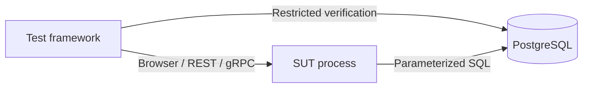
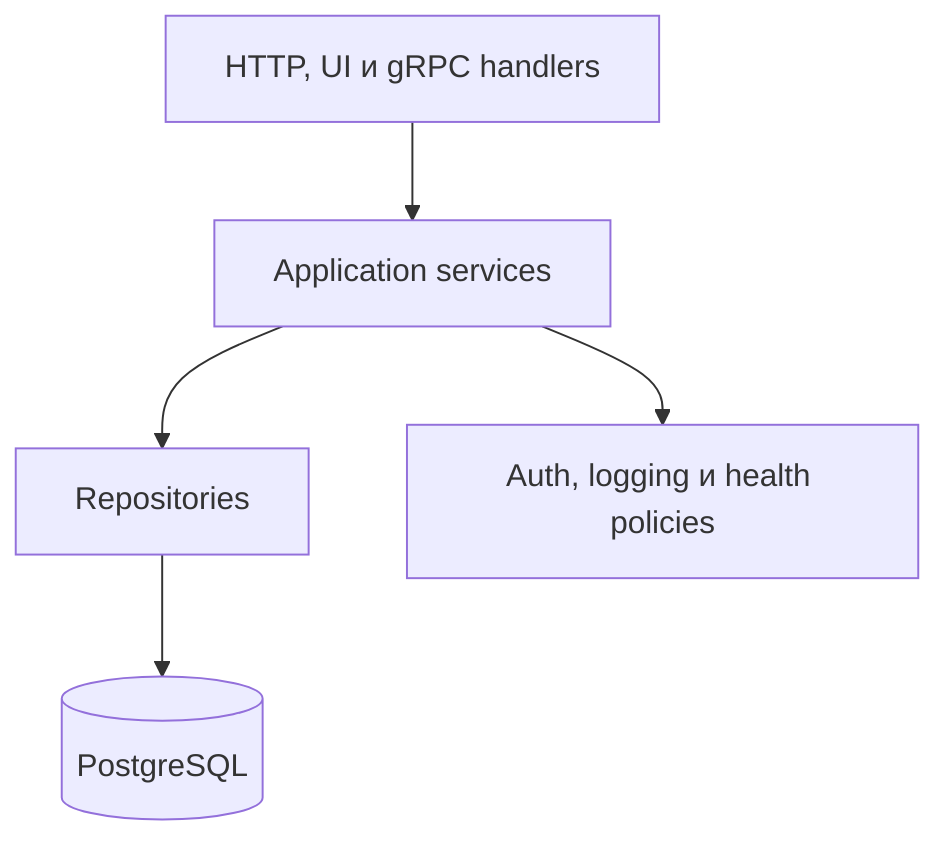
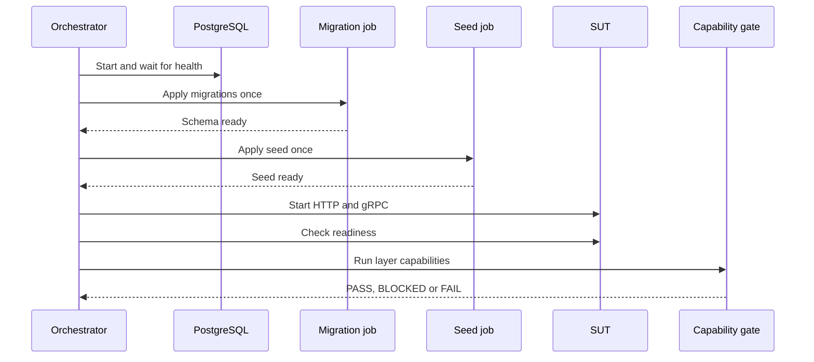

# Final Project Educational SUT Specification

Предлагаемая спецификация встроенного учебного SUT для финального проекта

> **GOVERNANCE APPROVED**
>
> **UNNUMBERED INFRASTRUCTURE SPECIFICATION**
>
> **ROADMAP-AUTHORITATIVE THROUGH SUT-0**
>
> **NOT CONTENT FROZEN**
>
> **NOT REVIEWED BASELINE**
>
> **IMPLEMENTATION LIMITED TO SUT-0 PHASE 1**

| Поле | Значение |
| --- | --- |
| Статус | GOVERNANCE APPROVED |
| Scope | Встроенный учебный SUT для финального проекта |
| Владельцы | Architecture Reviewer; Course Governance Reviewer; SUT Implementation Owner; Chapter Owner |
| Затрагиваемый модуль | Финальный промышленный проект, главы 250–259 |
| Затрагиваемые главы | 250–259 |
| Непосредственно затрагиваемые baseline | 250, 251 |
| Потенциально совместимый baseline | 252 |
| Заблокированные главы | 253–256 |
| Разрешение реализации | LIMITED: только SUT-0 Phase 1 |
| Blocker | Phase 2+ требует отдельного authorization; Gate C и Gate D BLOCKED |
| Требуемое решение | Отдельно рассмотреть Phase 2 ADR prerequisites и authorization; текущая task их не принимает |
| Последняя одобренная предпосылка | REVIEWED BASELINE главы 252 |
| Gate A | PASS: architecture review завершён; это не approval спецификации |
| Gate B | PASS: governance direction и Phase 1 authorization утверждены |
| Следующее действие | Отдельная Phase 2 governance task без implementation до явного authorization |

## Назначение и уровень полномочий

Документ задаёт governance-approved архитектуру repository-owned educational
System Under Test (SUT), необходимого главам 253–256. ROADMAP теперь
авторитетно фиксирует SUT-0, но этот документ не является baseline, content
freeze или runtime evidence.

ROADMAP остаётся единственным источником истины. Gate A подтвердил architecture,
а Gate B утвердил governance direction и разрешил только SUT-0 Phase 1.
Gate B не подтверждает runtime feasibility, не разрешает Phase 2+, не
разблокирует главы 253–256 и не заменяет Gate C или Gate D. Неизвестное или
неподтверждённое решение имеет статус BLOCKED, а не PASS.

SUT infrastructure и test framework имеют разную ответственность. SUT
предоставляет наблюдаемое приложение и публичные transports. Test framework
использует UI, REST, gRPC и PostgreSQL для проверки поведения, но не импортирует
внутренние модули SUT.

## Предлагаемое решение

Предлагается учебное приложение **Educational Work Items**:

- один TypeScript-процесс SUT;
- HTTP-сервер для server-rendered UI и REST;
- unary gRPC-сервер в том же процессе;
- отдельный процесс PostgreSQL;
- Fastify как предлагаемый HTTP/UI stack;
- `@grpc/grpc-js` для gRPC;
- `pg` для PostgreSQL;
- Docker Compose для локальной оркестрации;
- каталог `sut/`, один корневой package и один lockfile;
- ненумерованный infrastructure milestone `SUT-0` перед главой 253.

Governance boundaries SUT-001–SUT-004 приняты Gate B. Phase 1 evidence отдельно
подтвердил SUT-008, SUT-009 и SUT-011. Остальные implementation-sensitive
решения остаются рекомендациями до своего evidence и отдельного phase
authorization.

## Цели

- Дать главам 253–256 один стабильный и воспроизводимый объект тестирования.
- Покрыть реалистичные UI, REST, unary gRPC и PostgreSQL сценарии.
- Сделать setup, verification и cleanup наблюдаемыми и безопасными при parallel execution.
- Поддержать локальный запуск из clean clone без частного внешнего сервиса.
- Сохранить TypeScript и Automation QA предметом курса, а SUT — ограниченной инфраструктурой.
- Обеспечить одинаковые публичные контракты для локального и CI запуска.

## Non-goals

В scope не входят:

- production-ready application и production deployment;
- обучение SPA, frontend framework или component library;
- микросервисы, event bus и Kubernetes;
- payments, inventory, comments, attachments и notifications;
- SLA, advanced RBAC и streaming gRPC;
- generalized test-management platform;
- замена учебной программы Automation QA разработкой продукта;
- частные сервисы, облачные зависимости и реальные production endpoints;
- production secrets и production credential management.

## Выбор предметной области

| Критерий | Work Items | Orders | Support Tickets |
| --- | --- | --- | --- |
| Понятность без бизнес-контекста | Высокая | Средняя | Высокая |
| CRUD без искусственных сущностей | Высокая | Средняя | Высокая |
| Явные transitions | Высокая | Высокая | Высокая |
| Риск scope creep | Низкий | Высокий: товары, цены, платежи | Средний: сообщения, SLA, вложения |
| Подходит для UI/REST/gRPC/DB | Да | Да | Да |
| Минимальный auth model | Да | Требует ролей клиента/оператора | Часто требует ролей и очередей |
| Итог | Рекомендуется | Отклоняется | Отклоняется |

**Рекомендация:** Work Items обеспечивает необходимые state transitions,
ownership и filtering без введения commerce или support-domain подсистем.

## Доменная модель

| Поле | Типовое значение | Обязательность | Назначение |
| --- | --- | --- | --- |
| `id` | UUID | Да | Стабильная идентификация |
| `title` | string | Да | Человекочитаемое имя |
| `description` | string | Да | Проверяемое содержимое |
| `status` | `NEW`, `IN_PROGRESS`, `DONE`, `CANCELLED` | Да | Жизненный цикл |
| `priority` | `LOW`, `MEDIUM`, `HIGH` | Да | Фильтрация и enum contract |
| `ownerId` | UUID | Да | Владелец и permission boundary |
| `createdBy` | UUID | Да | Автор и permission boundary |
| `testRunId` | UUID или null | Нет | Владение данными тестового запуска; null только для seed |
| `creatorTestId` | string или null | Нет | Владение данными конкретного теста |
| `createdAt` | timestamp | Да | Аудит создания |
| `updatedAt` | timestamp | Да | Аудит изменения |
| `version` | integer | Да | Optimistic concurrency |

Допустимые переходы:

- `NEW` → `IN_PROGRESS` или `CANCELLED`;
- `IN_PROGRESS` → `DONE` или `CANCELLED`;
- terminal states `DONE` и `CANCELLED` не переходят в другое состояние.

Недопустимый transition возвращает предсказуемую domain error и не изменяет
строку. Никакой транспорт не определяет правила переходов самостоятельно.

Constraints:

- `title`: после trim от 1 до 120 Unicode code points;
- `description`: после trim от 1 до 2000 Unicode code points;
- `testRunId`: server-generated UUID, клиент не выбирает значение;
- `creatorTestId`: ASCII `[A-Za-z0-9._:-]`, от 1 до 160 символов;
- `createdBy` для non-seed data всегда выводится из authenticated principal;
- `ownerId` для non-seed data при создании равен authenticated user и не
  изменяется public API;
- timestamps создаются database clock и возвращаются в UTC;
- `version` начинается с 1 и увеличивается ровно один раз при successful update.

## Матрица возможностей

| Capability / owner | Purpose and scenario owner | Auth and data ownership | Error and cleanup | Evidence / phase | Priority |
| --- | --- | --- | --- | --- | --- |
| UI login/logout / UI adapter | Authenticated browser flow; `UI-01` | Seeded user; server creates session and run ID | Safe auth error; logout invalidates session | Browser trace / 3 | MANDATORY |
| UI list/create/details/update/delete / UI adapter | State-changing workflow; `UI-01` | `tester`; records inherit session run/test IDs | 403/404/conflict states; session-bound API cleanup | UI assertions and persisted state / 3 | MANDATORY |
| UI validation / UI adapter | Negative behavior; `UI-02` | Authenticated `tester`; no record on invalid input | Visible field errors; no cleanup if no mutation | Screenshot and absence check / 3 | MANDATORY |
| UI selectors and empty state / UI adapter | Reliable Page Objects; `UI-01`, `UI-02` | Same as owning scenario | Missing semantic control is capability failure | Accessibility/locator audit / 3 | MANDATORY |
| UI permission and version conflict / UI adapter | Role and concurrency support | `viewer` or stale tester session; owned item | Visible denial/conflict; owner cleanup | Browser plus database evidence / 3 | MANDATORY |
| REST token / auth adapter | Service authentication; `REST-01`, `REST-02` | Seeded user; server generates run ID | 400/401; token expiry needs no data cleanup | Sanitized auth response/log / 2 | MANDATORY |
| REST CRUD/filter / REST handler | Positive state change; `REST-01` | Bearer-bound user/run; server derives ownership | 400/401/403/404; exact owned cleanup | Runtime response contract and database state / 2 | MANDATORY |
| REST expected version and validation / REST handler | Negative/concurrency behavior; `REST-02` | Bearer-bound owner | 400/409 without mutation; owner cleanup | Error shape and unchanged row / 2 | MANDATORY |
| REST run cleanup / cleanup service | Failure-safe cleanup; all mutating scenarios | `tester`; token must match target run | 403 cross-run, seed protected; transactional exact-run delete | Audit event, count and residue / 2, 6 | MANDATORY |
| gRPC health / health adapter | Transport readiness; capability gate | No business auth; no mutable data | `NOT_SERVING`; no cleanup | External health response / 4, 5 | MANDATORY |
| gRPC Get/Search / gRPC handler | Successful unary read; `GRPC-01` | Bearer-bound principal/run | Invalid/auth/not-found statuses; owner cleanup for setup | Typed response and status / 4 | MANDATORY |
| gRPC Transition / gRPC handler | State change and expected non-OK; `GRPC-01`, `GRPC-02` | Bearer-bound owner and creator-test metadata | Precondition/auth/deadline statuses; API cleanup | gRPC response/status and database state / 4 | MANDATORY |
| PostgreSQL persistence/schema/migrations/seed / database owner | Reproducible state; `XL-02`, `XL-03` | App role writes; verification role reads | Readiness BLOCKED on drift; seed protected | Migration ledger and queries / 1, 5 | MANDATORY |
| PostgreSQL parameterization/version/transactions / repositories | Atomic state; `XL-02`, `XL-03` | App role only for writes | Transaction rollback; scenario cleanup through approved boundary | Integration tests and row version / 1, 2 | MANDATORY |
| PostgreSQL cleanup/residue / cleanup function | Parallel isolation; all mutating scenarios | App-only cleanup role executes function after transport authorization | Cross-run request rejected; exact-run transactional delete | Deleted count and read-only residue query / 1, 6 | MANDATORY |
| Additional styling / UI owner | Presentation only | No new authority | No effect on mandatory cleanup | Visual review / later approved work | OPTIONAL |
| Additional REST filters / REST owner | Convenience beyond required filters | Existing bearer/run rules | Existing error model | Contract test / later approved work | OPTIONAL |
| Additional unary methods / gRPC owner | Extra coverage | Existing metadata rules | Existing status model | Integration test / later approved work | OPTIONAL |
| TTL cleanup / operations owner | Recovery safety net | Privileged internal operation | Never primary cleanup; seed/cross-run guards | Expiry audit / later approved work | OPTIONAL |

## Сценарная трассировка

| ID | Слой / возможность | Setup | Действие | Ожидаемый результат | Cleanup | Evidence | Глава | Компонент / роль / владение |
| --- | --- | --- | --- | --- | --- | --- | --- | --- |
| UI-01 | Authenticated positive state change | Seeded tester logs in; SUT creates session run ID; fixture supplies creator test ID | Create, inspect, update and delete one Work Item through UI | Visible state follows public contract; ownership is inferable from current user | Session-authenticated current-run API fallback with CSRF after registered UI delete | Assertions, trace and screenshot on failure | 253 | UI adapter / tester / session run + test |
| UI-02 | Negative UI validation | Authenticated tester with isolated session run | Submit a title outside the contract | Field error is visible and no row is created | Residue query for session run | UI assertion and absence evidence | 253 | UI adapter / tester / session run + test |
| REST-01 | Positive state-changing request | Token issuance creates server run ID; client supplies valid creator test ID | Create, read, update with current version and delete | Status/body/runtime contract and persisted state agree | Exact-ID delete, then run cleanup fallback | Sanitized responses and database state | 254 | REST adapter / tester / token run + test |
| REST-02 | Negative request | Owned item at version 1 | PATCH with invalid field or stale expected version | Stable 400 or 409 response; row remains unchanged | Exact-ID cleanup with same token | Error contract and before/after row | 254 | REST adapter / tester / token run + test |
| GRPC-01 | Successful unary call | REST-created owned item; same bearer token and creator-test metadata | Transition `NEW` to `IN_PROGRESS` | Typed response has new status and version 2 | REST exact-ID cleanup | Unary response and database state | 255 | gRPC adapter / tester / token run + test |
| GRPC-02 | Expected non-OK unary call | Owned terminal item | Attempt invalid transition with deadline | `FAILED_PRECONDITION`; item is unchanged | REST exact-ID cleanup | gRPC status/details and database row | 255 | gRPC adapter / tester / token run + test |
| XL-01 | API → UI | REST creates owned item; separate UI session authenticates same tester | Open item details by public ID | UI shows canonical title, priority and status | REST owner token deletes item | REST response, UI assertion, trace on failure | 257 | Scenario orchestration / tester / REST run + test |
| XL-02 | UI → DB | UI session creates isolated item and exposes public ID | Read row through verification layer | Canonical fields, creator and version match | Session-authenticated API cleanup with CSRF, then residue check | UI evidence and parameterized read | 257 | Scenario + DB verification / tester / UI session run + test |
| XL-03 | gRPC → DB | REST creates owned item | gRPC transition, then read row | Status/version match normalized gRPC result | REST owner token deletes item | gRPC response and parameterized read | 257 | Scenario + gRPC + DB / tester / token run + test |

Permission, empty-state, version-conflict, auth-failure, deadline, migration,
seed-protection and cleanup-isolation checks remain SUT capability tests. They
do not add course scenarios or absorb chapter 253–259 teaching ownership.

## Архитектура системы

### Контекст



Repository ownership означает, что исходный код SUT и тестов хранится в одном
репозитории. Process ownership остаётся раздельным: SUT и PostgreSQL запускаются
как разные процессы, а test runner является отдельным клиентом.

### Внутреннее направление зависимостей



Запрещены handler-to-handler dependencies, handlers → test framework,
SUT → fixtures, test framework → внутренние SUT modules и business logic внутри
generated code. Composition Root связывает adapters, не меняя направление
зависимостей.

### Последовательность запуска



## Процессы, ports и lifecycle

| Процесс | Внутренний bind | Предлагаемый host port | Назначение |
| --- | --- | --- | --- |
| `sut-app` HTTP | `0.0.0.0` в container, loopback при host-run | `4310` | UI, REST, health |
| `sut-app` gRPC | `0.0.0.0` в container, loopback при host-run | `4311` | Unary gRPC и health |
| PostgreSQL | `0.0.0.0` только внутри container network | `55432` → container `5432` | Persistence и verification |

Ports конфигурируемы. Startup обязан проверить их доступность и завершиться с
понятной ошибкой при collision. Внешний bind и production bind запрещены.

Startup: PostgreSQL healthy → one-shot migration job complete → one-shot seed
job complete → HTTP active → gRPC active → readiness PASS → capability gate.
Application process никогда не запускает migrations или seed автоматически.
`sut:up` является единственным обычным orchestrator этого порядка. Standalone
`sut:seed` остаётся явной idempotent maintenance command, разрешённой только в
local mode и при отсутствии active test run.

Compose dependency использует `service_healthy` для PostgreSQL и
`service_completed_successfully` для migration/seed jobs; состояние container
`running` само по себе не считается готовностью. Application container
подключается к PostgreSQL по Compose service DNS, а tests на host runner
используют опубликованные loopback ports. `localhost` внутри application
container не используется для database target.

Shutdown: прекратить новые HTTP requests → graceful gRPC shutdown → закрыть
PostgreSQL pool → остановить PostgreSQL. Принудительное завершение допустимо
только после ограниченного shutdown timeout и должно быть отражено в evidence.

## UI contract

| Route | Страница | Обязательное поведение |
| --- | --- | --- |
| `/login` | Login | Логин, validation, safe auth error |
| `/logout` | Logout action | Удаление session и redirect на login |
| `/work-items` | List | Filter, empty state, links to details/create |
| `/work-items/new` | Create | Controlled form, validation, create |
| `/work-items/:id` | Details | Canonical fields, actions по роли |
| `/work-items/:id/edit` | Update | Expected version, conflict message |
| `/work-items/:id/delete` | Delete confirmation | Явное подтверждение и permission check |

HTML рендерится сервером; UI и REST используют same origin. Предлагаемый UI не
имеет SPA runtime, frontend build, component framework, анимаций или скрытого
cleanup endpoint.

Все state-changing HTML forms используют synchronizer CSRF token, связанный с
текущей session, и проверку `Origin`. `SameSite=Lax` остаётся дополнительной
защитой, а не заменой CSRF validation. После успешного login session ID
обязательно ротируется; logout инвалидирует session server-side. Cookie имеет
`HttpOnly`, `SameSite=Lax`, `Path=/`, ограниченный срок жизни и `Secure`, когда
используется HTTPS.

Selector contract:

1. accessible role и accessible name;
2. label;
3. устойчивый видимый текст;
4. `data-testid` только когда semantic selector недостаточен.

Запрещены selectors по CSS layout, `nth` для смыслового выбора, arbitrary sleeps
и зависимость от декоративного оформления.

## REST contract

Base path предлагается как `/api/v1`. Business endpoints требуют bearer token.
Current-run cleanup принимает либо bearer token, либо signed UI session; при
cookie auth дополнительно обязателен CSRF token. Оба adapters передают один
server-derived auth context в cleanup service. JSON timestamps используют UTC
ISO 8601. UUID и enum передаются строками.

### Общая error shape

```json
{
  "code": "STABLE_ERROR_CODE",
  "message": "Безопасное описание ошибки",
  "field": "optionalField",
  "correlationId": "request-correlation-id"
}
```

`field` присутствует только для field-specific validation. `correlationId`
связывает response и redacted SUT log. Error body не содержит stack trace,
credentials, SQL или connection data.

| Endpoint | Request | Success | Ошибки и side effects |
| --- | --- | --- | --- |
| `POST /api/v1/auth/token` | Идентификатор учебного пользователя и credential material | `200`, opaque bearer token metadata и server-generated run ID | `400` invalid input; `401` invalid credentials; запись домена не создаётся |
| `POST /api/v1/work-items` | `title`, `description`, `priority`; creator test ID в metadata | `201`, полный Work Item | `400` validation; `401`; `403`; owner, creator и run выводятся server-side |
| `GET /api/v1/work-items/:id` | Path UUID | `200`, полный Work Item | `400` invalid UUID; `401`; `403` чужая доступная запись; `404` отсутствующая; без side effects |
| `GET /api/v1/work-items` | Optional `status`, `priority`, `ownerId` | `200`, deterministic ordered authorized collection | `400` invalid filter; `401`; фильтры не расширяют права и не принимают произвольный run ID |
| `PATCH /api/v1/work-items/:id` | Изменяемые поля и обязательный `expectedVersion` | `200`, новая версия | `400`; `401`; `403`; `404`; `409` stale version; conditional update |
| `DELETE /api/v1/work-items/:id` | Path UUID | Первый успешный delete: `204` | `400`; `401`; `403`; `404`; повторный delete возвращает `404`; seed protected |
| `DELETE /api/v1/test-runs/current/work-items` | Текущий run выводится из bearer token или UI session; CSRF обязателен для cookie auth | `200`, deleted count | `400` invalid CSRF; `401`; `403`; transactional exact-run delete; seed protected; audit event |

Validation выполняется до service call. Клиент не должен ретраить business
errors. Автоматический retry допускается только для ограниченной readiness
проверки до начала тестов.

`DELETE` идемпотентен по итоговому состоянию ресурса, но это не требует
одинакового response status: первый вызов возвращает `204`, повторный — `404`.

## gRPC contract

Предлагаемый package: `qa.educational.workitems.v1`.

Services:

- `WorkItemService.GetWorkItem`;
- `WorkItemService.SearchWorkItems`;
- `WorkItemService.TransitionWorkItem`;
- standard gRPC health service `Check`.

Основные messages:

| Message | Поля |
| --- | --- |
| `WorkItem` | Все canonical domain fields, typed enums и timestamps |
| `GetWorkItemRequest` | `id` |
| `SearchWorkItemsRequest` | Optional status, priority, owner ID, test run ID |
| `SearchWorkItemsResponse` | Repeated Work Item |
| `TransitionWorkItemRequest` | `id`, target status, expected version |
| `TransitionWorkItemResponse` | Updated Work Item |

Auth передаётся через bearer metadata. `correlation-id` и `creator-test-id`
передаются отдельными metadata keys и валидируются. `test-run-id` не принимается
как authority от клиента: server выводит его из bearer token. Клиент всегда
задаёт deadline.

| Ситуация | gRPC status |
| --- | --- |
| Invalid request field | `INVALID_ARGUMENT` |
| Нет или invalid auth metadata | `UNAUTHENTICATED` |
| Роль не разрешает действие | `PERMISSION_DENIED` |
| Work Item отсутствует | `NOT_FOUND` |
| Stale version или invalid transition | `FAILED_PRECONDITION` |
| Deadline истёк | `DEADLINE_EXCEEDED` |
| Неожиданная безопасно скрытая ошибка | `INTERNAL` |

`INTERNAL` не используется для известных validation, auth, domain или
concurrency errors.

### Generation policy

Предлагаемые locations после Gate B:

- source contract: `sut/contracts/proto/work_items.proto`;
- generated code: `sut/contracts/generated/grpc/`;
- server adapters: `sut/src/grpc/`;
- client adapters: `examples/04-final-project/src/grpc/`.

Runtime service definition загружается динамически через
`@grpc/proto-loader` и `grpc.loadPackageDefinition`. Одобренный
`proto-loader-gen-types` генерирует только TypeScript type information для
динамически загружаемых объектов; он не создаёт самостоятельный runtime client.
Handwritten typed adapters создают runtime stub и связывают его с generated
types.

Generator и его exact version должны быть одобрены и pinned. Reproducible
command генерирует types во временный каталог, сравнивает их с tracked output и
завершает проверку ошибкой при drift. Generated files не редактируются вручную
и не содержат business logic. На стадии этой спецификации proto, generated
types и command не создаются.

## PostgreSQL contract

### `schema_migrations`

| Column | PostgreSQL type | Null | Constraint | Назначение / test relevance |
| --- | --- | --- | --- | --- |
| `version` | `integer` | Нет | Primary key, positive | Порядок immutable migration |
| `name` | `text` | Нет | Non-empty | Человекочитаемая evidence |
| `checksum` | `text` | Нет | Non-empty | Drift detection |
| `applied_at` | `timestamptz` | Нет | Default database time | Аудит startup |

### `users`

| Column | PostgreSQL type | Null | Constraint | Назначение / test relevance |
| --- | --- | --- | --- | --- |
| `id` | `uuid` | Нет | Primary key | Stable seeded identity |
| `login` | `text` | Нет | Unique, non-empty | Учебный login |
| `password_hash` | `text` | Нет | Non-empty | Secret boundary |
| `role` | `text` | Нет | `tester` или `viewer` | Permission scenarios |
| `is_seed` | `boolean` | Нет | Default true | Seed protection |
| `created_at` | `timestamptz` | Нет | Default database time | Audit |

### `work_items`

| Column | PostgreSQL type | Null | Constraint | Назначение / test relevance |
| --- | --- | --- | --- | --- |
| `id` | `uuid` | Нет | Primary key | Cross-layer identity |
| `title` | `text` | Нет | Length boundary, non-empty | UI/API validation |
| `description` | `text` | Нет | Length boundary | Content comparison |
| `status` | `text` | Нет | Domain enum check | Transition verification |
| `priority` | `text` | Нет | Domain enum check | Filter verification |
| `owner_id` | `uuid` | Нет | Foreign key to users | Ownership |
| `created_by` | `uuid` | Нет | Foreign key to users | Permission and audit |
| `test_run_id` | `uuid` | Да | Paired with creator identity | Run ownership |
| `creator_test_id` | `text` | Да | Requires test run ID | Test ownership |
| `is_seed` | `boolean` | Нет | Default false | Cleanup protection |
| `created_at` | `timestamptz` | Нет | Database time | Lifecycle |
| `updated_at` | `timestamptz` | Нет | Database time | Update evidence |
| `version` | `integer` | Нет | Positive, starts at 1 | Optimistic concurrency |

Required indexes:

- unique index on `users.login`;
- index on `work_items.test_run_id`;
- index on `work_items.creator_test_id`;
- index on `work_items.owner_id`;
- composite index on `work_items.status, work_items.priority`;

Migrations are immutable and ordered. Каждая migration выполняется в transaction
где PostgreSQL DDL это допускает, записывает checksum и никогда не меняется
после принятия. Drift или gap блокирует readiness.

PostgreSQL image выбирается только из поддерживаемой upstream major line,
фиксируется на reviewed current minor для воспроизводимости и обновляется
отдельным compatibility review. Floating `latest` запрещён.

Migration runner получает PostgreSQL advisory lock на всё время проверки и
применения ledger. Конкурирующий runner ожидает ограниченное время и завершается
ошибкой при timeout. Failed migration откатывается, не получает ledger row и
требует исправления новой либо ещё не принятой migration; уже применённый файл
не редактируется.

Seed использует deterministic UUID и idempotent insert/update policy, защищает
seed rows от обычного cleanup и не зависит от wall-clock ordering. Reset
пересоздаёт только учебное локальное состояние, требует явного local mode и
никогда не доступен как unrestricted public endpoint.

Conditional update включает `id` и `version` в условие, повышает version ровно
на один и различает missing row от stale version. Repository mapping явно
переводит snake_case database columns в canonical domain fields.

Все SQL values parameterized. Dynamic SQL values запрещены. Verification role
имеет read access; cleanup role ограничен run-owned rows и не может удалять seed.

UUID новых Work Items генерируется приложением через `crypto.randomUUID()`.
Database constraints дублируют критические boundaries длины, enum, foreign keys,
pairing run/test IDs и положительной version.

Application role имеет только необходимые CRUD permissions. Final-project
Database Layer получает verification role только с `SELECT`, без `INSERT`,
`UPDATE`, `DELETE` или `EXECUTE` cleanup function. Отдельная app-only cleanup
role получает только `EXECUTE` на конкретную `SECURITY DEFINER` function после
того, как transport adapter авторизовал session/token и передал server-derived
run context. Function удаляет exact-run non-seed rows и пишет audit event. Для
function задаётся безопасный фиксированный `search_path`; `EXECUTE` от `PUBLIC`
отзывается и выдаётся только app cleanup role.

## Authentication и authorization

Предлагается hybrid model:

- UI: opaque random session ID в signed cookie;
- REST: opaque random bearer token;
- gRPC: тот же opaque bearer token в metadata;
- роли: `tester` и `viewer`.

`tester` может создавать и изменять Work Items и удалять принадлежащие тесту
записи. `viewer` может читать, но не изменять. Cleanup authority отдельно
ограничивается ownership checks.

Session ID и bearer token создаются `randomBytes`, а server хранит только digest,
principal ID, role, server-generated run ID и expiry. Token не является JWT и
не содержит client-readable authority. Logout, expiry и restart инвалидируют
session/token. Cookie signing key создаётся для runtime либо передаётся через
secret reference; точный TTL утверждается ADR SUT-007 на основании тестов
expiry/revocation.

Для password hashing используется `scrypt` из `node:crypto` с уникальным
случайным salt не короче 16 bytes; сравнение выполняется constant-time API.
Конкретные credentials и signing material определяются только после security
review, передаются через references/environment и не фиксируются в
спецификации.

Educational credentials:

- предназначены только для loopback/container-isolated учебного запуска;
- не совпадают с production credentials;
- не печатаются в logs или artifacts;
- production mode отказывается запускаться с educational credential policy;
- invalid credentials дают одинаковый safe auth error.

## Владение тестовыми данными и cleanup

При выдаче UI session или bearer token server создаёт уникальный UUID
`testRunId`; клиент не может выбрать или подменить его. Каждый тест передаёт
валидированный `creatorTestId`. Worker identity может входить в creator test ID,
но не является authority. Созданная запись получает server-derived run ID,
авторизованного `createdBy` и неизменяемого `ownerId`.

Lifecycle:

1. fixture получает session/token и server-generated run identity;
2. test передаёт creator test ID и создаёт data через public API;
3. cleanup registry запоминает resource ID;
4. afterEach удаляет test-owned resources;
5. afterAll удаляет остатки exact run ID;
6. residue check подтверждает отсутствие run-owned rows;
7. primary failure и cleanup failure сохраняются раздельно.

Cleanup authority берёт run ID из текущей session/token, а не из произвольного
request parameter. Cookie-authenticated cleanup требует CSRF validation.
Framework Database Layer не вызывает cleanup function напрямую. Cleanup не
удаляет чужой run, seed или запись без подтверждённого ownership.
API cleanup является основным механизмом; restricted database cleanup — только
аварийный контролируемый путь. TTL cleanup OPTIONAL и не заменяет немедленный
cleanup. Reset разрешён только для изолированного local environment до запуска.

## Health, readiness и capability gate

### Liveness

Показывает, что процесс отвечает. Liveness не доказывает готовность database,
migrations, seed или transports и не разрешает запуск тестов.

### Readiness

Readiness report содержит:

- PostgreSQL connectivity check;
- migration-version check;
- seed-record check;
- HTTP active state;
- gRPC health state.

Readiness не может быть PASS до доступности database, применения migrations,
завершения seed, активности HTTP и активности gRPC.

HTTP readiness возвращает `200` только при PASS и `503` при BLOCKED/FAIL.
Standard gRPC health возвращает `SERVING` или `NOT_SERVING`. Эти endpoints
наблюдают внутренние dependencies, но не объявляют собственную внешнюю
доступность доказанной: browser/REST/gRPC reachability подтверждает только
external capability gate. Все probes имеют bounded timeout.

### Capability gate

| Check | PASS evidence | BLOCKED | FAIL |
| --- | --- | --- | --- |
| Browser login | Login/logout через реальный browser | Browser/SUT не стартовал | Контракт нарушен |
| REST create/delete | Создание и удаление run-owned item | REST недоступен | Response/state неверны |
| gRPC read/error | Успешный read и ожидаемый status | gRPC недоступен | Contract/status неверен |
| PostgreSQL verification | Row соответствует transport response | DB role недоступна | Mapping/state неверны |
| Cleanup verification | Residue count равен нулю | Cleanup authority недоступна | Чужие/остаточные данные |

Validation проверяет отдельный input или contract. Capability gate доказывает,
что собранная система реально выполняет минимальный cross-process сценарий.

## Local execution specification

Предпосылки: поддерживаемая Node.js LTS line, совместимая с выбранными Fastify
v5 и plugins, npm, Docker Engine и Docker Compose v2. Exact Node version
фиксируется на Gate B после compatibility spike; EOL release line запрещена.

| Command | Responsibility | Input | Expected output | Side effects | Failure behavior | Evidence | Owner phase |
| --- | --- | --- | --- | --- | --- | --- | --- |
| `npm run sut:up` | Build/start dependency order | Local config refs, free ports | Healthy PostgreSQL, completed migration/seed jobs, ready SUT | Containers, schema, seed | Non-zero; stop partial stack and preserve logs | Startup log, readiness report | 1, 2, 3, 4, 5 |
| `npm run sut:health` | Query liveness/readiness | Running stack | Structured PASS/BLOCKED/FAIL | None | Non-zero unless PASS | Health report | 5 |
| `npm run sut:seed` | Explicit idempotent maintenance seed | Ready DB, local mode, no active run | Seed version and record count | Seed rows | Refuse unsafe state; transaction rollback | Seed log/check | 5 |
| `npm run sut:reset` | Reset isolated local state | Explicit local mode | Clean migrated seeded DB | Deletes non-seed local data | Refuse non-local/active run | Reset audit | 5 |
| `npm run sut:capabilities` | Verify minimum layer behavior | Ready stack | Capability matrix PASS | Temporary run-owned data, then cleanup | Non-zero; preserve evidence | Layer evidence bundle | 6 |
| `npm run sut:logs` | Read SUT/DB logs | Running or retained stack | Separated redacted streams | None | Non-zero if stack unknown | Captured log files | 6 |
| `npm run sut:down` | Graceful shutdown | Stack identity | Processes stopped | Containers removed; volumes retained by policy | Non-zero with surviving resources listed | Shutdown report | 1, 5 |

Команды здесь являются proposed interface; scripts не добавляются этой задачей.

Expected learner flow:

1. `npm ci`;
2. `npm run sut:up`;
3. `npm run sut:capabilities`;
4. запуск final-project tests;
5. `npm run sut:down`.

## CI readiness specification

Chapter 258 владеет workflow implementation. Эта спецификация задаёт только
границу совместимости:

1. `npm ci`;
2. build SUT;
3. start PostgreSQL;
4. wait for database health;
5. run one-shot migrations;
6. run one-shot seed;
7. start SUT;
8. wait for HTTP readiness;
9. wait for gRPC health;
10. run capability gate;
11. run final-project tests;
12. collect logs и test artifacts;
13. shut down containers.

Предлагаемый общий startup budget — 120 секунд; отдельная readiness attempt —
не более 5 секунд; retry только readiness checks с ограниченным числом попыток.
Business operations и failed tests не ретраятся автоматически. Точные budgets
должны получить evidence в Phase 7 и ADR SUT-012.

CI сохраняет migration version/checksum evidence, seed evidence, redacted SUT
logs, PostgreSQL logs, Playwright artifacts, gRPC capability evidence и cleanup
report. Shutdown выполняется даже после test failure; невозможность cleanup
фиксируется отдельно и не скрывает primary failure.

Browser runtime и его system dependencies устанавливаются официальным
Playwright-supported способом до UI checks. Точный CI command принадлежит главе
258 и не добавляется этой спецификацией.

## Observability specification

SUT пишет JSON в stdout:

- `correlationId`;
- `testRunId`, если применимо;
- operation name;
- safe error code;
- startup phase;
- migration version;
- readiness state.

SUT генерирует correlation ID, если входное значение отсутствует. Входные
correlation/test IDs проходят allowlist validation и length limit до logging,
чтобы исключить log injection и unbounded fields.

Redaction обязана скрывать authorization headers, cookies, passwords,
password hashes, signing keys, bearer tokens и PostgreSQL connection strings.

SUT logs описывают приложение. Test-framework diagnostics описывают test steps,
assertions и fixtures. CI artifacts упаковывают оба источника, не смешивая их.
Chapter 258 владеет test diagnostics и publication.

## Security specification

- Host-published ports по умолчанию привязаны к loopback; container services
  доступны только внутри reviewed Compose network boundary.
- UI и REST — same origin; CORS disabled, пока implementation evidence не докажет необходимость.
- HTTP и gRPC inputs валидируются на transport boundary.
- SQL parameterized; dynamic SQL values запрещены.
- Cleanup проверяет run/test ownership.
- Seed защищён от mutation и cleanup.
- Logs проходят redaction.
- Процесс требует явный educational mode и отказывается стартовать при
  production mode, внешнем database target или неразрешённом bind.
- Educational credentials не считаются production secrets.
- Private service dependency и external production endpoint запрещены.
- Unrestricted cleanup role запрещена.

Эти guards снижают риск ошибочного запуска, но не превращают educational SUT в
production-safe систему.

> **Предупреждение:** educational SUT не одобрен и не поддерживается для
> production use.

## Repository placement

Предлагаемая структура после Gate B:

```text
sut/
  README.md
  compose.yaml
  Dockerfile
  tsconfig.json
  src/
    app/
    auth/
    http/
    grpc/
    repositories/
    health/
    logging/
  contracts/
    proto/
    generated/
  migrations/
  seed/
  tests/
```

`examples/04-final-project/` остаётся реализацией test framework. SUT и tests
имеют отдельное ownership. Test code использует public transports, а не
внутренние SUT modules.

`sut/tsconfig.json` имеет собственные `rootDir`, `outDir` и include boundary.
Root compiler configuration не расширяется на `sut/` неявно; cross-compilation
между framework и SUT запрещена.

Предлагается один root package, один lockfile, без npm workspace и nested
package/lockfile. Generated code имеет явного owner. Docker build context
остаётся repository root либо меняется только после отдельного review boundary.
Эта структура сейчас не создаётся.

## Package strategy

| Dependency | Purpose | Phase | Compatibility evidence | Pinning | Почему текущих API недостаточно | Risk | Removal criteria |
| --- | --- | --- | --- | --- | --- | --- | --- |
| Fastify v5 | HTTP routing, validation, server-rendered responses | 2 | Supported Node LTS compatibility, plugin matrix, TypeScript compile, smoke endpoint | Exact version before install | В repository нет HTTP server abstraction | Plugin/runtime compatibility, scope growth | Удалить, если reviewed native stack проще и покрывает contracts |
| Compatible Fastify cookie plugin | Signed UI session cookie | 2–3 | Matrix с выбранным Fastify, cookie security test | Exact version | Core Fastify не предоставляет полный signed-cookie lifecycle | Version mismatch | Удалить при отказе от cookie UI auth |
| Compatible form-body plugin | Server-rendered HTML forms | 3 | Parse/validation integration test | Exact version | JSON parser не обрабатывает HTML form contract | Parser ambiguity | Удалить при reviewed native form parser |
| TypeScript | SUT implementation | 1 | Existing compiler check | Сохранить reviewed installed range до отдельного pin decision | Уже выбран языком проекта | Version drift | Не удаляется, пока SUT TypeScript |
| `@grpc/grpc-js` | gRPC server/client | 4 | Unary/status/deadline integration test | Existing version reviewed before reuse | Уже предоставляет runtime | Generation/runtime drift | Удалить только при отмене gRPC scope |
| `@grpc/proto-loader` | Dynamic runtime contract loading | 4 | Runtime stub and generated-type compatibility test | Existing version reviewed before reuse | Уже предоставляет loader | Type/runtime drift | Удалить только при выборе другого approved runtime loading strategy |
| `proto-loader-gen-types` CLI from the approved package version | Type information for dynamically loaded contracts | 4 | Temp regeneration drift test | Exact version aligned with loader | Runtime loader сам не создаёт tracked TypeScript declarations | Type/runtime mismatch | Удалить, если reviewed alternative генерирует совместимые types |
| `pg` | PostgreSQL pool and parameterized queries | 1 | Migration/repository integration tests | Existing version reviewed before reuse | Уже предоставляет required DB API | Pool lifecycle | Удалить только при отмене PostgreSQL |
| Playwright | Browser capability and final tests | 6 | Existing project test execution | Existing version | Уже test runner курса | Browser startup cost | Не удаляется из final-project context |

Новые dependencies не устанавливаются до Gate B. Exact versions не выбираются
в этом proposal без installation and compatibility evidence.

## ADR register

Gate B принимает только governance-level ADR SUT-001–SUT-004.
Implementation-sensitive ADR принимается отдельно только в своём decision
point после требуемого runtime и operational evidence.

Порядок решений обязателен: SUT-001/002 → SUT-003/004/011 →
SUT-008/009 → SUT-005/007/010/013 → SUT-006 → SUT-012. Downstream ADR не
принимается, пока его upstream boundaries остаются неразрешёнными.

| ID | Context | Decision required | Alternatives | Current recommendation | Evidence required | Owner role | Latest decision point | Chapters | Review trigger |
| --- | --- | --- | --- | --- | --- | --- | --- | --- | --- |
| SUT-001 Domain | Нужна единая сущность | Выбрать domain/scope | Work Items, Orders, Support Tickets | Work Items | Scenario fit, scope estimate | Architecture Reviewer | Gate A | 250, 253–257 | Domain expansion |
| SUT-002 Process architecture | Четыре слоя без microservices | Определить process boundary | One process, split services | One SUT process + PostgreSQL | Startup and isolation review | Architecture Reviewer | Gate A | 251–258 | Новый transport/process |
| SUT-003 Repository placement | SUT repository-owned | Выбрать location | `sut/`, external repo | `sut/` | Import-boundary audit | Course Governance Reviewer | Gate B | 251–252 | Layout/package change |
| SUT-004 Package strategy | Один root package существует | Выбрать package ownership | Root, workspace, nested | Root + single lockfile | Dependency graph and install test | SUT Implementation Owner | Gate B | 251–252 | Dependency conflict |
| SUT-005 HTTP/UI stack | Нужны UI и REST | Выбрать server stack | Fastify, native HTTP | Fastify v5 | Compatibility/security spike | SUT Implementation Owner | Phase 2 entry | 253–254 | Plugin incompatibility |
| SUT-006 gRPC generation | Typed dynamic contract must reproduce | Выбрать generation/loading policy | Dynamic runtime + generated types, full static generation | Pinned dynamic runtime + generated types | Temp regeneration and runtime-stub compatibility test | SUT Implementation Owner | Phase 4 entry | 255 | Generated/runtime diff |
| SUT-007 Authentication | UI/REST/gRPC требуют auth | Выбрать auth model, TTL, revocation и CSRF policy | Cookie only, bearer only, hybrid | Opaque session + opaque bearer | Threat review, expiry/revocation/CSRF tests | Security Reviewer | Phase 2 entry | 253–255 | Credential/log/session leak |
| SUT-008 Schema and migrations | DB state must reproduce | Утвердить schema/migration ledger | Ad hoc init, ordered migrations | Ordered immutable migrations | Clean DB migration test | Database Owner | Phase 1 entry | 256 | Schema drift |
| SUT-009 Seed and reset | Нужны deterministic users/data | Утвердить seed/reset guard | Manual, scripted | Idempotent seed + local-only reset | Repeatability/protection tests | Database Owner | Phase 1 entry | 252, 256 | Nondeterministic seed |
| SUT-010 Test-data ownership | Parallel cleanup должен быть безопасен | Утвердить ownership fields | ID registry only, run markers | Run + test IDs and registry | Parallel isolation test | Test Architecture Owner | Phase 2 entry | 253–258 | Cross-run deletion |
| SUT-011 Local Docker startup | Clean clone needs one flow | Утвердить orchestration | Docker Compose, host scripts | Docker Compose v2 | Clean-clone startup timing | SUT Implementation Owner | Phase 1 entry | 252, 258 | Docker onboarding failure |
| SUT-012 CI startup | Chapter 258 needs feasible CI | Утвердить CI boundary/budgets | Services, Compose | Reviewed container startup sequence | CI feasibility run | CI Owner | Phase 7 exit | 258 | Timeout/artifact gap |
| SUT-013 Logging and redaction | Evidence must be safe | Утвердить schema/redaction | Text logs, JSON logs | JSON stdout + redaction | Secret-injection log test | Security Reviewer | Phase 2 entry | 258 | Sensitive output |

### Governance status decisions

| ADR | Previous | Final | Approval basis and authority | Remaining evidence / trigger |
| --- | --- | --- | --- | --- |
| SUT-001 | PROPOSED | ACCEPTED | Gate A domain review + Gate B ROADMAP approval; Course Governance Reviewer | Re-review при domain expansion |
| SUT-002 | PROPOSED | ACCEPTED | Gate A process review + Gate B ROADMAP approval; Course Governance Reviewer | Re-review при новом transport/process |
| SUT-003 | PROPOSED | ACCEPTED | Gate B ROADMAP/PROJECT placement decision; Course Governance Reviewer | Re-review при layout/workspace change |
| SUT-004 | PROPOSED | ACCEPTED | Gate B PROJECT single-package decision; Course Governance Reviewer | Dependency compatibility до installation |
| SUT-005 | PROPOSED | PROPOSED | Recommendation only; SUT Implementation Owner | Supported Node/Fastify/plugin spike before Phase 2 |
| SUT-006 | PROPOSED | PROPOSED | Recommendation only; SUT Implementation Owner | Generator/runtime compatibility before Phase 4 |
| SUT-007 | PROPOSED | PROPOSED | Recommendation only; Security Reviewer | Threat, CSRF, expiry and revocation evidence before Phase 2 |
| SUT-008 | PROPOSED | ACCEPTED | Phase 1 technical/runtime/security review + final operational review; Database Owner | Re-review по triggers принятого decision record |
| SUT-009 | PROPOSED | ACCEPTED | Phase 1 technical/runtime/security review + final operational review; Database Owner | Re-review по triggers принятого decision record |
| SUT-010 | PROPOSED | PROPOSED | Recommendation only; Test Architecture Owner | Parallel isolation evidence before Phase 2 |
| SUT-011 | PROPOSED | ACCEPTED | Phase 1 technical/runtime/security review + final operational review; SUT Implementation Owner | Re-review по triggers принятого decision record |
| SUT-012 | PROPOSED | PROPOSED | Recommendation only; CI Owner | CI-feasibility evidence in Phase 7 |
| SUT-013 | PROPOSED | PROPOSED | Recommendation only; Security Reviewer | Structured-log and redaction evidence before Phase 2 |

`ACCEPTED` означает принятие ограниченного governance decision на основании
evidence, указанного в его record. Этот status сам по себе не доказывает полный
SUT, не меняет gates и не авторизует следующую phase. Owner role обозначает
ответственность, а не назначенного человека.

### Accepted decision SUT-008 — Schema and migrations

- **Status:** `ACCEPTED`.
- **Decision:** Phase 1 использует PostgreSQL schema и repository-owned
  migration runner с ordered immutable SQL migrations, contiguous numeric
  versions и exact `schema_migrations` ledger. Ledger хранит version, migration
  name, canonical UTF-8/LF SHA-256 checksum и applied timestamp. Runner
  отклоняет duplicate/gap, modified и removed applied migrations, выполняет
  каждую migration и ledger insert в одной transaction и сериализует runners
  same-session advisory lock с bounded acquisition. `sut_migrator` остаётся
  least-privileged owner; image bootstrap superuser используется только при
  clean-volume initialization. Migration framework dependency не добавляется.
- **Acceptance basis:** technical/runtime/security review `9.8/10`,
  `PHASE 1 TECHNICALLY READY`; final operational review `9.9/10`,
  `PHASE 1 READY FOR ADR DECISIONS`; blocker и unresolved major finding
  отсутствуют.
- **Runtime evidence:** 3 migrations; clean apply; repeated no-op; deterministic
  ordering; exact ledger validation; canonical checksum drift; removed-file
  detection; duplicate/gap rejection; rollback; bounded lock timeout; real
  concurrent runners; effective privilege tests на PostgreSQL 17.10.
- **Operational evidence:** clean and preserved-volume flows, safe drift repair
  guidance, immutable migration policy, bounded failure messages, repeated
  Phase 1 gate и no-residue verification документированы и проверены.
- **Constraints:** решение ограничено текущей Phase 1 schema/migration
  boundary; applied files immutable; correction оформляется новой migration;
  trusted migration directory, current ownership и least privilege
  сохраняются.
- **Deferred work:** auth/session schema, cleanup authorization function и
  later business migrations.
- **Review triggers:** migration filename grammar; non-contiguous version
  policy; checksum normalization; migration framework; PostgreSQL major
  version; role/ownership, transaction, advisory-lock или schema ownership
  model; second database.
- **Affected phases:** Phase 1 и будущие phases только в части новых reviewed
  migrations.
- **Affected chapters:** 256; existing chapter ownership не меняется.
- **Authority:** Database Owner в подчинении authoritative ROADMAP, PROJECT и
  этой specification.
- **Non-consequences:** Gate C остаётся `BLOCKED`; Phase 2 не авторизована; ни
  одна chapter не разблокирована; baseline не создан; content не frozen.

### Accepted decision SUT-009 — Seed and reset

- **Status:** `ACCEPTED`.
- **Decision:** Phase 1 использует repository-owned deterministic seed с
  фиксированными educational UUID, UTC timestamps, tester/viewer users и одним
  representative Work Item. Seed идемпотентен, проверяет exact state,
  выполняется transactionally и защищает seed rows. Password fields являются
  structural placeholders без authentication claim. Reset разрешён только
  educational/local guards, в одной transaction удаляет только non-seed data,
  сохраняет и повторно проверяет seed; database/schema drop и cascade truncate
  не используются.
- **Acceptance basis:** technical/runtime/security review `9.8/10`,
  `PHASE 1 TECHNICALLY READY`; final operational review `9.9/10`,
  `PHASE 1 READY FOR ADR DECISIONS`; blocker и unresolved major finding
  отсутствуют.
- **Runtime evidence:** repeated deterministic seed, duplicate prevention,
  conflict detection, protected seed rows, failed-seed rollback, non-seed
  reset, seed preservation, repeated reset, reset rollback, external-host и
  production-mode rejection на real PostgreSQL.
- **Operational evidence:** exact seed inventory, placeholder/auth limitation,
  disposable-data warning, reset guards, active-run limitation и safe recovery
  flow документированы и проверены.
- **Constraints:** seed identities и fixed timestamps стабильны; reset остаётся
  disposable local pre-run operation; acceptance не утверждает final
  run-isolation или parallel cleanup.
- **Deferred work:** real authentication material, active-run protection,
  run-scoped cleanup authorization, TTL behavior и Phase 2+ data.
- **Review triggers:** seed identity/schema; password/auth implementation;
  active-run tracking; cleanup authorization; TTL cleanup; parallel-run
  ownership; reset scope; non-local execution; additional immutable seed
  entities.
- **Affected phases:** Phase 1; later phases только после отдельного review
  новых data/cleanup requirements.
- **Affected chapters:** 252 и 256; existing chapter ownership не меняется.
- **Authority:** Database Owner в подчинении authoritative ROADMAP, PROJECT и
  этой specification.
- **Non-consequences:** SUT-010 остаётся `PROPOSED`; Gate C остаётся `BLOCKED`;
  Phase 2 не авторизована; ни одна chapter не разблокирована; baseline не
  создан; content не frozen.

### Accepted decision SUT-011 — Local Docker startup

- **Status:** `ACCEPTED`.
- **Decision:** Phase 1 использует Docker Compose v2 с одним PostgreSQL service,
  official exact image `postgres:17.10-bookworm`, loopback
  `127.0.0.1:55432:5432`, named disposable development volume,
  `pg_isready` healthcheck, deterministic project name, clean-volume init SQL,
  restart `"no"` и bounded stop grace period. Root scripts
  `sut:db:up`, `sut:db:down` и `sut:phase1:check` используют один root package и
  lockfile. Manual down сохраняет volume; full gate удаляет только собственные
  resources. Application container и CI workflow отсутствуют.
- **Acceptance basis:** technical/runtime/security review `9.8/10`,
  `PHASE 1 TECHNICALLY READY`; final operational review `9.9/10`,
  `PHASE 1 READY FOR ADR DECISIONS`; blocker и unresolved major finding
  отсутствуют.
- **Runtime evidence:** resolved Compose validation, clean PostgreSQL 17.10
  startup, health wait, repeated startup, existing-volume behavior,
  clean-volume initialization, deterministic naming, bounded shutdown,
  container cleanup, manual volume preservation, full-gate volume cleanup,
  repeated Phase 1 gate и no residue.
- **Operational evidence:** clean-clone/manual flows, volume semantics, safe
  diagnostics, scoped recovery и unrelated-resource protection документированы
  и проверены.
- **Constraints:** local educational use, loopback binding, current exact image,
  deterministic project ownership, no nested SUT package/lockfile и no
  unrelated Docker cleanup.
- **Deferred work:** SUT application container, REST/UI/gRPC services, CI
  startup, artifact collection и full capability gate.
- **Review triggers:** PostgreSQL image or port; Compose project name; volume
  strategy; application service; network topology; Dockerfile; workspace or
  package strategy; CI orchestration; Docker-less mode; external database.
- **Affected phases:** Phase 1; later orchestration requires separate
  authorization.
- **Affected chapters:** 252 и 258; existing chapter ownership не меняется.
- **Authority:** SUT Implementation Owner в подчинении authoritative ROADMAP,
  PROJECT и этой specification.
- **Non-consequences:** SUT-012 остаётся `PROPOSED`; Gate C остаётся `BLOCKED`;
  Phase 2 не авторизована; ни одна chapter не разблокирована; baseline не
  создан; content не frozen.

## Baseline impact

### Chapter 250

| Claim area | Classification | Remediation |
| --- | --- | --- |
| “Learner supplies SUT” | Semantic replacement | Controlled semantic update |
| Selected SUT | Semantic extension | Theory/practice/solutions synchronization |
| Capability gate | Semantic extension | Technical review |
| Access evidence | Semantic extension | Final quality review |
| Requirements | Semantic extension | Append-only new baseline evidence |
| Exclusions | Editorial/semantic clarification | Preserve scope boundaries |
| Risks and effort | Semantic | Reassess estimates |
| Ownership | Semantic | Add repository/process distinction |
| Cleanup | Semantic detail | Add run/test ownership |
| CI reachability | Semantic | Add local/CI capability evidence |

Chapter 250 baseline остаётся историческим evidence текущего состояния. Proposal
не удаляет и не переписывает baseline; будущая принятая semantic update требует
нового append-only evidence.

### Chapter 251

| Claim area | Classification | Remediation |
| --- | --- | --- |
| External SUT boundary | Semantic clarification | Controlled semantic update |
| Repository ownership | Semantic addition | Architecture review |
| ADR register | Semantic extension | Add accepted SUT ADR references |
| Generated-code policy | Semantic resolution later | Resolve by SUT-006 |
| Directory plan | Semantic extension | Add reviewed `sut/` boundary |
| Milestones | Semantic prerequisite | Add SUT-0 |
| Risks/readiness | Semantic | Synchronize gates |
| Dependency direction | Unchanged | Preserve |
| Composition Root principles | Unchanged | Preserve |

Chapter 251 требует technical architecture review, final quality review и нового
append-only baseline evidence после разрешённой semantic update.

### Chapter 252

| Area | Compatibility |
| --- | --- |
| `.invalid` values | Unchanged for offline tests |
| Config keys | Compatible initially |
| Secret references | Compatible extension later |
| Profiles | Unchanged |
| Foundation Composition Root | Unchanged initially |
| Fixture | Unchanged initially |
| Startup | Unchanged |
| Scripts | Compatible extension later |
| `.env.example` | Может позже получить SUT-backed values |
| Runtime contracts | Unchanged initially |

Немедленной baseline invalidation нет, пока observable artifacts или claims
главы 252 не меняются. После SUT-0 выполняется compatibility audit; любое
фактическое изменение переводит главу в controlled review.

Повторный review главы 252 требуется, если меняются её config keys,
`.env.example`, scripts, runtime context, Composition Root, fixture,
ResourceScope, startup claims, tests или theory wording. Одно лишь появление
отдельного SUT без изменения этих artifacts baseline не инвалидирует.

## ROADMAP treatment

- Нумерация 250–259 сохраняется.
- ROADMAP авторитетно фиксирует unnumbered prerequisite
  `SUT-0 — Educational SUT Infrastructure Milestone`.
- SUT-0 располагается после главы 252 и до главы 253.
- Спецификация остаётся infrastructure document, но не главой, baseline или
  самостоятельной content-freeze unit.
- PROJECT авторитетно фиксирует repository-owned Educational Work Items scope.
- CHANGE_POLICY не меняется: существующих roadmap/specification/content status
  mechanisms достаточно.
- Chapter ownership сохраняется: 253 UI, 254 REST, 255 gRPC, 256 Database,
  257 cross-layer, 258 diagnostics/parallel/CI, 259 final audit.

SUT-0 deliverables:

- approved SUT specification;
- accepted implementation-critical ADRs;
- runnable SUT and PostgreSQL;
- migrations, seed and reset;
- UI, REST and unary gRPC;
- health/readiness;
- local capability PASS;
- CI-feasibility evidence;
- baseline reconciliation for affected chapters.

SUT-0 является authoritative infrastructure prerequisite, не меняет chapter
numbering и не может стать CONTENT FROZEN независимо. Финальная content-freeze
boundary остаётся 250–259.

## Governance remediation plan

| Step | Entry condition | Permitted files | Forbidden files | Validation | Evidence | Exit condition | Stop condition | Baseline consequence |
| --- | --- | --- | --- | --- | --- | --- | --- | --- |
| 1. Proposed specification | Impact analysis complete | Этот spec | Все implementation/content files | Structure and boundary scans | Proposed diff | Spec complete | Scope/policy conflict | None |
| 2. Architecture review | Step 1 complete | Review report only | Runtime, chapters, ROADMAP | Domain/layer/security review | Gate A record | Gate A PASS | Any critical gap | None |
| 3. Governance approval | Gate A PASS | Approved governance records | Runtime/content before decision | Policy/ROADMAP impact review | Gate B record | Gate B PASS | Permission unclear | None |
| 4. Controlled ROADMAP update | Gate B PASS | ROADMAP only as explicitly approved | Chapters/runtime | Numbering and ownership audit | Reviewed diff | SUT-0 formally represented | Numbering drift | Architecture evidence only |
| 5. Implement SUT-0 by separately authorized phases | Gate B PASS; current permission Phase 1 only | Files explicitly permitted for the active phase | Chapters 250–259, future-phase and unrelated files | Active-phase tests | Phase-scoped runtime evidence | Every phase separately reviewed and authorized | Any phase blocker or boundary leak | No content freeze |
| 6. SUT technical/runtime review | Runtime complete | Review fixes within approved scope | Course architecture/content | Integration/security checks | Technical report | Technical PASS | Contract failure | None |
| 7. SUT final quality/operational review | Technical PASS | Approved quality fixes | New features/content | Clean-clone/capability audit | Operational report | Operational PASS | Non-reproducible start | None |
| 8. Update chapter 250 | Operational PASS and formal content permission | Chapter/practice/solution 250 | Other chapters/runtime | Claims against runtime evidence | Technical review | Semantics aligned | Scope expands | Existing baseline retained |
| 9. Update chapter 251 | Step 8 governed | Chapter/practice/solution 251 | Other chapters/runtime | Architecture against accepted ADRs | Technical review | Decisions aligned | Unaccepted ADR used | Existing baseline retained |
| 10. Repeat chapter reviews | Steps 8–9 complete | Review fixes/evidence | Unrelated semantic edits | Technical and final quality checks | Scores/findings | Reviews PASS | Material finding | No new baseline yet |
| 11. Append baseline evidence | Reviews PASS | Baseline log rows only | Historical rows | Append-only audit | New evidence | New rows valid | History altered | New evidence appended |
| 12. Confirm chapter 252 | SUT operational PASS | 252 evidence; content only if needed | Unrelated chapters | Hash/claim/artifact comparison | Compatibility report | Compatible or reviewed | Observable mismatch unresolved | Preserve or append evidence |
| 13. Gate D and resume 253–256 | Steps 8–12 complete | Gate record, then chapter-owned files by separate task | Out-of-order/future chapters | ROADMAP/scope/capability checks | Gate D record | Chapters unblocked | Gate D not PASS | Normal future baseline flow |

Steps 1–4 завершены Gate A/Gate B governance work. Gate B разрешает начать
только Phase 1 шага 5; остальные implementation phases не получают
автоматического разрешения.

## Implementation phases

Никакая реализация не начинается до Phase 0 PASS.

| Phase | Scope | Entry | Deliverables | Tests | Evidence | Dependencies | Owner role | Risks | Exit | Stop conditions | Future-topic protection |
| --- | --- | --- | --- | --- | --- | --- | --- | --- | --- | --- | --- |
| 0 Governance approval | Approve proposal | Gate A PASS | Gate B decision, permitted files | Policy audit | Approval record | Governance reviewers | Course Governance Reviewer | Accidental approval inference | Gate B PASS: completed | BLOCKED/FAIL decision | No runtime/content |
| 1 Skeleton and PostgreSQL | Process skeleton, DB, migrations, minimal seed and basic probes | Gate B PASS; ROADMAP/PROJECT updated; SUT-001–004 accepted; versions reviewed before install; no real secrets | Buildable SUT, Compose, schema, seeded accounts, basic liveness/readiness | Clean DB migration, concurrent migration lock, repeat seed, constraints, roles, pool shutdown | Build/migration/seed logs | Supported Node, Docker, PostgreSQL | Database Owner | Docker/schema drift | Objective Phase 1 criteria PASS | Dependency, Docker, migration, seed, secret or scope ambiguity | No REST/UI/gRPC business implementation |
| 2 REST and authentication | Service, REST, auth, logging | Phase 1 PASS; separate Phase 2 authorization; SUT-005/007/010/013 accepted | REST contracts and auth | Contract, permission, redaction | API test report | DB repositories | SUT Implementation Owner | Credential/cleanup bugs | REST capability PASS | Security test fails | No UI/gRPC implementation |
| 3 UI | Server-rendered pages | Phase 2 PASS; separate Phase 3 authorization | Required routes/selectors | Browser UI scenarios | Trace/screenshots | REST-equivalent services | UI Owner | Frontend scope creep | UI capability PASS | SPA/build dependency requested | No chapter 253 content |
| 4 gRPC and generation | Proto, generated types, unary server | Phase 2 PASS; separate Phase 4 authorization; SUT-006 accepted | Contract and methods | Regeneration drift, status/deadline | Generated diff + integration report | Services/auth | gRPC Owner | Generator drift | gRPC capability PASS | Unpinned generator | No streaming |
| 5 Reset/readiness hardening | Deterministic full lifecycle | Phases 1–4 PASS; separate Phase 5 authorization | Reset guards and full transport-aware readiness | Reset refusal, false-readiness prevention, graceful shutdown | State and shutdown reports | All transports | SUT Implementation Owner | False readiness | Full readiness PASS | Unsafe reset or readiness | No production operations |
| 6 Local capability gate | Cross-layer local proof | Phase 5 PASS; separate Phase 6 authorization | Capability command/report | UI/REST/gRPC/DB/cleanup | Evidence bundle | Docker stack | Test Architecture Owner | Flaky startup | All mandatory gate checks PASS | Any unknown = BLOCKED | No course chapters |
| 7 CI feasibility | Validate startup boundary | Phase 6 PASS; separate Phase 7 authorization; SUT-012 accepted | Feasibility run and budgets | CI-like clean startup/shutdown | Timing/artifact report | CI-compatible environment | CI Owner | Startup time | Feasible PASS | Workflow implementation required early | No workflow YAML |
| 8 Chapter 250/251 reconciliation | Align baselines | Runtime reviews PASS | Controlled content updates/reviews | Claims verified against runtime | New append-only evidence | Governance steps 8–11 | Course Governance Reviewer | Historical drift | Baselines reconciled | Content edited without permission | No 253–259 |
| 9 Resume 253–256 | Remove learning blocker | Gate D PASS | Chapter work may begin separately | Per-chapter checks | Chapter review evidence | SUT-0 | Chapter Owners | Coupling to internals | Normal roadmap workflow | Public contract unstable | No future chapter topics |

## Acceptance criteria

### Оценочная модель

- **PASS:** требуемое observable evidence существует и подтверждает criterion.
- **BLOCKED:** prerequisite или evidence недоступны; неизвестное состояние всегда BLOCKED.
- **FAIL:** проверка выполнена и observable result нарушает criterion.

### Mandatory

| # | Criterion | Evidence | Owner phase | PASS | BLOCKED | FAIL |
| ---: | --- | --- | --- | --- | --- | --- |
| 1 | Clean clone starts locally | Clean-clone transcript | 6 | Stack ready | Prerequisite unavailable | Start fails |
| 2 | One documented startup command | Command transcript | 6 | One command reaches readiness | Interface unapproved | Extra manual mutation needed |
| 3 | PostgreSQL readiness | Health report | 5 | Connectivity PASS | DB unavailable | False/failed health |
| 4 | Deterministic migrations | Two clean migration runs/checksums | 1 | Same ordered state | Clean DB unavailable | Drift/gap |
| 5 | Deterministic seed | Repeated seed report | 5 | Same IDs/counts | Seed policy unapproved | Duplicate/different state |
| 6 | Browser login | Browser trace | 3 | Login/logout PASS | Browser unavailable | Session contract fails |
| 7 | UI CRUD | UI scenario evidence | 3 | CRUD state matches | UI unavailable | Behavior/state mismatch |
| 8 | REST CRUD | API report | 2 | All endpoints PASS | REST unavailable | Contract/state mismatch |
| 9 | REST negative validation | Error body and DB absence | 2 | Stable error, no mutation | Test input unavailable | Mutation/wrong error |
| 10 | Typed unary gRPC calls | Generation/runtime call report | 4 | Handwritten typed adapter uses dynamic runtime stub successfully | Generator unapproved | Type/runtime drift or call failure |
| 11 | gRPC error statuses | Status matrix | 4 | Expected statuses | Method unavailable | `INTERNAL`/wrong status |
| 12 | Matching PostgreSQL state | Cross-layer query report | 6 | Canonical fields match | DB reader unavailable | Mapping/state mismatch |
| 13 | Test-owned cleanup | Cleanup report | 6 | Exact owned rows removed | Authority unavailable | Residue/cross-delete |
| 14 | Run-ID isolation | Parallel isolation report | 6 | Runs do not interfere | Parallel setup unavailable | Cross-run visibility/delete |
| 15 | Seed protection | Protected-row check | 5 | Seed survives cleanup/reset policy | Seed unavailable | Seed changed/deleted |
| 16 | No production secrets | Secret scan/redaction tests | 2, 7 | No secret evidence | Scanner unavailable | Secret exposed |
| 17 | No private service | Dependency/network audit | 7 | Local assets only | Audit incomplete | Private dependency found |
| 18 | Reproducible generation | Temp regeneration diff | 4 | Empty drift | Generator unavailable | Diff/non-repeatable output |
| 19 | Safe structured logs | Log schema/redaction report | 2, 7 | JSON fields and redaction PASS | Log capture unavailable | Sensitive/unstructured output |
| 20 | Local capability gate PASS | Capability bundle | 6 | Every mandatory check PASS | Any check BLOCKED | Any check FAIL |
| 21 | CI startup feasible | CI-like timing/evidence | 7 | Sequence fits approved budget | CI environment unavailable | Budget/startup failure |
| 22 | Chapters 253–256 can execute | Gate D traceability review | 9 | Scenario prerequisites available | Baselines/contracts unresolved | Required capability missing |
| 23 | Graceful shutdown | Shutdown transcript and connection check | 5 | Requests stop, gRPC and pool close within budget | Stack unavailable | Forced exit, leaked connection or lost evidence |
| 24 | Reset determinism and refusal | Repeated reset/state report | 5 | Local reset reproduces schema/seed and refuses unsafe context | Reset policy unapproved | State differs or unsafe reset succeeds |
| 25 | Database least privilege | Role permission matrix tests | 1, 6 | App, verification and cleanup roles can perform only approved operations | Role setup unavailable | Unauthorized mutation or broad cleanup succeeds |
| 26 | Capability command exit semantics | Command transcript | 6 | PASS exits 0; BLOCKED/FAIL exit non-zero with evidence | Command unavailable | Incorrect exit or missing classification |

### Optional

| # | Criterion | Evidence owner |
| ---: | --- | --- |
| 1 | Docker-less mode | Future approved implementation phase |
| 2 | Extra filters | Future chapter-owned need |
| 3 | More roles | Future governance decision |
| 4 | Additional browsers | Chapter 253 or 258 |
| 5 | Advanced styling | UI maintenance owner |
| 6 | Extra gRPC methods | Chapter 255 |
| 7 | Automatic TTL cleanup | SUT operations owner |

Optional criteria не блокируют Gate C или Gate D.

## Risk register

| ID | Signal | Impact | Probability | Mitigation | Owner role | Blocker condition | Review trigger | Phase | Chapters |
| --- | --- | --- | --- | --- | --- | --- | --- | --- | --- |
| R-01 Scope overwhelms course | SUT code exceeds QA needs | High | Medium | Capability-only backlog, non-goals | Architecture Reviewer | New domain subsystem required | Scope estimate grows | 0–9 | 250–259 |
| R-02 Frontend complexity | SPA/build request | High | Medium | Server-rendered HTML | UI Owner | Framework needed for mandatory UI | UI design change | 3 | 253 |
| R-03 Package duplication | Nested package/lockfile appears | Medium | Medium | Root package policy | Package Owner | Duplicate versions unresolved | Dependency addition | 1–4 | 251–252 |
| R-04 Docker onboarding | Clean clone cannot start | High | Medium | Compose v2 docs and gate | SUT Owner | Mandatory environment unsupported | Startup test failure | 1, 6 | 250, 252 |
| R-05 gRPC drift | Regeneration diff | High | Medium | Pinned temp generation check | gRPC Owner | Reproducibility fails | Contract change | 4 | 255 |
| R-06 Flaky startup | Intermittent readiness | High | Medium | Dependency health, bounded retry | SUT Owner | Capability gate unstable | Timing variance | 5–7 | 252, 258 |
| R-07 Port collision | Bind error | Medium | Medium | Configurable ports, preflight | SUT Owner | No free reviewed ports | Local failure | 1, 6 | 252 |
| R-08 Seed nondeterminism | IDs/counts differ | High | Low | Deterministic UUID/idempotency | Database Owner | Repeat seed differs | Seed change | 5 | 256 |
| R-09 Unsafe cleanup | Cross-run deletion | Critical | Low | Ownership checks, restricted role | Test Architecture Owner | Isolation test fails | Cleanup change | 2, 6 | 254, 256–258 |
| R-10 Credential confusion | Educational value treated as production | High | Medium | Production refusal, docs, redaction | Security Reviewer | Production mode accepts policy | Auth change | 2, 7 | 250, 254–255 |
| R-11 CI startup time | Budget exceeded | Medium | Medium | Image/cache review, timing evidence | CI Owner | Approved budget missed | CI feasibility run | 7 | 258 |
| R-12 Migration drift | Checksum/gap | High | Low | Immutable ledger | Database Owner | Readiness cannot verify schema | Migration change | 1, 5 | 256 |
| R-13 Framework imports internals | Direct `sut/src` import | Critical | Medium | Boundary lint/review | Test Architecture Owner | Public transport bypass | New test helper | 6, 9 | 253–257 |
| R-14 Excessive DB checks | Every assertion queries DB | Medium | Medium | Cross-layer use only when valuable | Chapter Owner | Learning objective displaced | Practice design | 9 | 256–257 |
| R-15 Scope creep | Optional becomes mandatory | High | Medium | Separate optional criteria | Governance Reviewer | Gate depends on optional feature | New request | 0–9 | 250–259 |
| R-16 Maintenance ownership | No role owns contract | High | Medium | ADR owner roles and review triggers | Governance Reviewer | Critical ADR owner absent | Handoff | 0–9 | 250–259 |
| R-17 Session/CSRF weakness | State change succeeds without valid CSRF/session rotation | Critical | Low | Synchronizer token, Origin check, expiry/revocation tests | Security Reviewer | CSRF or fixation test succeeds | Auth/UI change | 2–3 | 253–254 |
| R-18 Migration race | Two runners apply the same version | High | Low | Advisory lock, transactional ledger and timeout | Database Owner | Duplicate/partial migration state | Startup concurrency test | 1 | 256 |
| R-19 False readiness | Internal probe PASS while external transport fails | High | Medium | External capability gate and bounded probes | SUT Owner | Readiness allows tests before reachability | Probe change | 5–7 | 252, 258 |
| R-20 Runtime compatibility | Node/Fastify/plugin versions conflict | High | Medium | Exact compatibility matrix and spike before install | Package Owner | Selected versions cannot compile/start | Dependency approval | 0–3 | 251–254 |
| R-21 Image availability | Docker image cannot be pulled or reproduced | Medium | Medium | Supported pinned image policy and clean-clone evidence | SUT Owner | Required image unavailable | Image/version change | 1, 7 | 252, 258 |
| R-22 Cleanup authority abuse | Cleanup credential/function deletes outside bound run | Critical | Low | Server-derived run, restricted EXECUTE and audit | Security Reviewer | Cross-run/seed delete succeeds | Cleanup change | 2, 6 | 254, 256–258 |
| R-23 gRPC type/runtime mismatch | Generated types compile but runtime descriptor differs | High | Medium | Joint regeneration/runtime stub compatibility test | gRPC Owner | Typed adapter cannot call reviewed proto | Proto/tool change | 4 | 255 |
| R-24 Root compile coupling | Root config compiles SUT and framework accidentally | Medium | Medium | Separate tsconfig boundaries and explicit scripts | Package Owner | Cross-import or duplicate output appears | Compiler/script change | 1–4 | 251–252 |

Наивысшие риски: unsafe cleanup, import of SUT internals, scope overload,
credential/session weakness и flaky startup. Любой Critical blocker переводит
соответствующий gate в BLOCKED или FAIL.

## Decision gates

| Gate | Decision authority | Required evidence | PASS requirements | BLOCKED | FAIL |
| --- | --- | --- | --- | --- | --- |
| A — Specification Review | Architecture Reviewer | Reviewed specification diff, traceability and risk audit | Coherent domain, minimal scope, layer coverage, nine-scenario mapping, security, ownership and governance plan | Evidence/reviewer unavailable | Architecture has unresolved contradiction |
| B — Governance Approval | Course Governance Reviewer with explicit repository-owner approval | Policy/ROADMAP decision, permitted-file list, baseline remediation plan | Semantic ROADMAP extension approved and implementation explicitly authorized | Любой пункт не утверждён | Proposal rejected or policy conflict unresolved |
| C — SUT-0 Technical Readiness | Technical, Security and Operational reviewers | Runtime tests, deterministic startup, cleanup/isolation, capability bundle | Every mandatory technical criterion PASS | Runtime/evidence incomplete | Mandatory capability fails |
| D — Course Resume | Course Governance Reviewer | 250/251 new evidence, 252 compatibility report, Gate C record | Baselines reconciled, 252 compatible, public contracts stable, 253–256 unblocked | Любая предпосылка неизвестна | Baseline or capability conflict |

Текущие статусы:

- Gate A — **PASS**: formal architecture review завершён; это не approval
  proposal, ROADMAP change или implementation;
- Gate B — **PASS**: governance approval завершён, ROADMAP и PROJECT
  синхронизированы, SUT-0 authoritative, Phase 1 явно разрешена;
- Gate C — **BLOCKED**: Phase 1 evidence подтверждено, но обязательные
  capabilities и reviews следующих SUT phases ещё отсутствуют;
- Gate D — **BLOCKED**: Gate C и baseline reconciliation не выполнены.

Gate A evidence:

- architecture review completed;
- transport boundaries validated;
- scenario coverage validated;
- data ownership and cleanup validated;
- security model reviewed;
- governance plan reviewed.

Gate A result: architecture была признана готовой к Gate B. Gate A не являлся
approval; governance authority появилась только через Gate B и authoritative
ROADMAP/PROJECT updates.

Gate B evidence:

- governance approval completed;
- ROADMAP updated with authoritative SUT-0;
- PROJECT updated with repository-owned Educational Work Items scope;
- governance ADR SUT-001–SUT-004 accepted;
- baseline and Content Freeze Registry records unchanged;
- implementation authorization limited to Phase 1.

Gate B сам по себе не доказывает runtime feasibility и не принимает
implementation-sensitive ADR. Позднее Phase 1 evidence отдельно приняло
SUT-008, SUT-009 и SUT-011; SUT-005–SUT-007, SUT-010, SUT-012 и SUT-013
остаются `PROPOSED`. Ни Gate B, ни эти Phase 1 ADR decisions не одобряют
reconciliation глав 250–251 и не разблокируют главы 253–256.

## Phase 1 Authorization

Текущая implementation permission: **LIMITED — SUT-0 Phase 1 only**.

Phase 1 entry conditions:

- Gate A и Gate B имеют `PASS`;
- ROADMAP и PROJECT содержат authoritative SUT-0 boundary;
- SUT-001–SUT-004 имеют `ACCEPTED`;
- chapters 250–252 и их baseline evidence не изменены;
- implementation task явно ограничена Phase 1;
- exact dependency versions проверены до installation;
- Docker availability и supported PostgreSQL/Node lines проверены;
- real secrets и production endpoints не требуются.

После отдельной Phase 1 implementation task разрешены только:

- skeleton каталога `sut/` и отдельный SUT TypeScript config;
- root dependency additions, необходимые только Phase 1;
- PostgreSQL Compose service и минимальный Dockerfile, если он необходим;
- migration runner, ordered initial migrations и migration ledger;
- deterministic users/work_items schema и минимальный seed;
- basic liveness/readiness foundation;
- database tests и Phase 1 scripts;
- Phase 1 operational documentation.

Basic internal HTTP health endpoint допустим только как infrastructure
foundation и не считается реализацией REST Layer главы 254.

Phase 1 exit conditions:

- SUT TypeScript compilation проходит;
- PostgreSQL стартует детерминированно;
- ordered migrations, ledger, checksum и concurrent protection работают;
- deterministic seed повторяется без drift;
- schema constraints и least-privilege roles проверены;
- liveness/readiness foundation и graceful shutdown работают;
- database tests проходят;
- Phase 1 reset/seed behavior детерминирован;
- REST/UI/gRPC business layers и chapters 253–259 отсутствуют;
- secret leakage и unsafe cleanup отсутствуют;
- technical/runtime/security и final operational review evidence сохранено;
- SUT-008, SUT-009 и SUT-011 имеют `ACCEPTED`;
- Gate C остаётся `BLOCKED`.

Phase 1 stop conditions:

- dependency compatibility не подтверждена;
- Docker/PostgreSQL prerequisite недоступен;
- migration или seed semantics неоднозначны;
- обнаружен real secret, unsafe cleanup или privilege escalation;
- требуется REST, UI, gRPC business layer, workflow или chapter change;
- implementation выходит за Phase 1;
- неизвестное prerequisite/evidence получает `BLOCKED`.

## Remaining Implementation Prohibition

До отдельного authorization следующих phases запрещены:

- full REST API и final authentication model;
- browser UI;
- gRPC business service, proto и generated business code;
- cross-layer scenarios;
- CI workflow;
- final diagnostics и scoring;
- chapters 250–259;
- baseline rows и Content Freeze Registry rows.

Gate B является governance approval и ограниченным implementation permission,
но не baseline evidence, content freeze или Gate C runtime approval.
