# О курсе

## Цели обучения

После изучения этой главы вы будете понимать:

* для чего существует этот курс;
* кому он предназначен;
* почему курс начинается с JavaScript, а не с TypeScript или Playwright;
* почему главная цель курса — понимание механизмов, а не запоминание синтаксиса;
* как устроен репозиторий;
* как связаны главы, примеры, практика и решения;
* как использовать материалы курса в обучении Automation QA.

Эта глава не учит синтаксису JavaScript. Ее задача — настроить правильную модель обучения. Без этой модели дальнейшие главы будут восприниматься как набор отдельных тем, хотя курс построен как последовательная инженерная система.

---

## Мотивация

Automation QA часто начинается с инструментов.

Инженер устанавливает Playwright, открывает документацию, копирует первый тест, запускает браузер и видит успешный результат. Это важный этап, но он быстро приводит к проблеме: тесты начинают расти, появляются helper-функции, fixtures, API-клиенты, работа с базой данных, retry-логика, отчеты, конфигурация окружений.

На этом уровне одного знания команд Playwright уже недостаточно.

Появляются вопросы:

* почему значение изменилось в одном тесте и неожиданно повлияло на другой;
* почему `this` внутри функции указывает не туда, куда ожидалось;
* почему `await` не остановил весь тестовый процесс;
* почему объект из API нельзя безопасно сравнить простым `===`;
* почему TypeScript показывает ошибку там, где JavaScript-код запускается;
* почему generic-тип в helper-функции помогает фреймворку, а не просто усложняет запись;
* почему тесты становятся нестабильными при неправильной работе с асинхронностью.

Все эти вопросы относятся не только к инструментам. Они относятся к языку, runtime, модели памяти, системе типов и архитектуре тестового кода.

Этот курс нужен для того, чтобы Automation QA Engineer понимал не только как написать автотест, но и почему код ведет себя именно так.

---

## Теория

### Назначение курса

Курс посвящен JavaScript, TypeScript и Automation QA.

Это не справочник по синтаксису и не коллекция готовых рецептов. Справочник отвечает на вопрос "как записать конструкцию". Этот курс отвечает на более важные инженерные вопросы:

* какую проблему решает механизм;
* почему он появился;
* как он работает внутри;
* какие ограничения у него есть;
* как он влияет на тестовый код;
* какие ошибки появляются при неправильной ментальной модели.

Основная цель курса — сформировать глубокое понимание языка и научить применять его при разработке промышленной автоматизации тестирования.

Под промышленной автоматизацией здесь понимается не один тестовый файл с несколькими сценариями, а полноценная система:

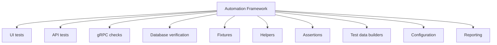

Такая система строится не на одном инструменте. Она строится на языке программирования. Поэтому курс начинает движение с фундамента.

### Целевая аудитория

Курс предназначен для инженеров, которые хотят писать автоматизацию осознанно.

Основная аудитория:

* Junior Automation QA;
* Middle Automation QA;
* Manual QA, который переходит в автоматизацию;
* Backend QA;
* SDET;
* QA Engineer, который использует Playwright;
* инженер, который хочет системно изучить JavaScript и TypeScript.

Курс не требует глубокого знания языка. Предполагается, что читатель уже видел JavaScript-код, запускал простые скрипты или автотесты, умеет пользоваться терминалом и редактором кода.

Но курс не предполагает, что читатель понимает внутренние механизмы:

* Execution Context;
* Scope;
* Hoisting;
* TDZ;
* Stack;
* Heap;
* References;
* Closure;
* Event Loop;
* Promise;
* Type Erasure;
* Type Inference.

Именно эти механизмы будут постепенно разобраны.

### Философия обучения

Главная идея курса:

> Понимание важнее запоминания.

Запоминание помогает только на коротком участке. Можно запомнить, что `const` запрещает переназначение переменной. Но этого недостаточно, чтобы понимать, почему объект, объявленный через `const`, все равно можно изменить.

Поверхностное знание выглядит так:

```javascript
const user = {
  name: 'Anna'
};

user.name = 'Maria';
```

Если запомнить только фразу "`const` запрещает изменения", этот код выглядит противоречиво. На самом деле противоречия нет. `const` запрещает переназначить binding переменной, но не делает объект в памяти неизменяемым.

Более точная модель выглядит так:

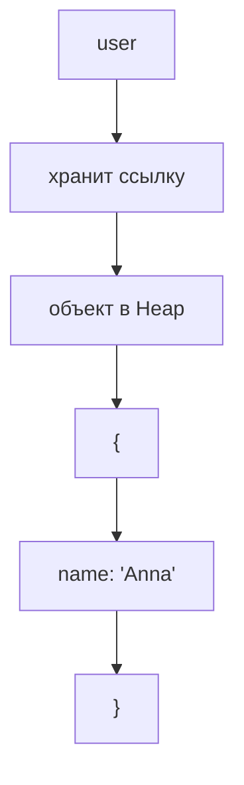

Переменная `user` хранит ссылку на объект. `const` защищает саму связь между именем `user` и ссылкой. Объект, на который указывает ссылка, остается изменяемым, если не используются специальные механизмы вроде `Object.freeze`.

Такой подход будет применяться во всем курсе:

1. Сначала проблема.
2. Затем причина появления механизма.
3. Затем внутренняя модель.
4. Затем синтаксис.
5. Затем минимальный пример.
6. Затем практический пример.
7. Затем применение в Automation QA.
8. Затем типичные ошибки.
9. Затем практика.

### Почему JavaScript изучается до TypeScript

TypeScript не заменяет JavaScript.

TypeScript расширяет JavaScript системой типов, но после компиляции выполняется JavaScript-код. Runtime не исполняет TypeScript-типы. Runtime исполняет JavaScript.

Упрощенная схема выглядит так:

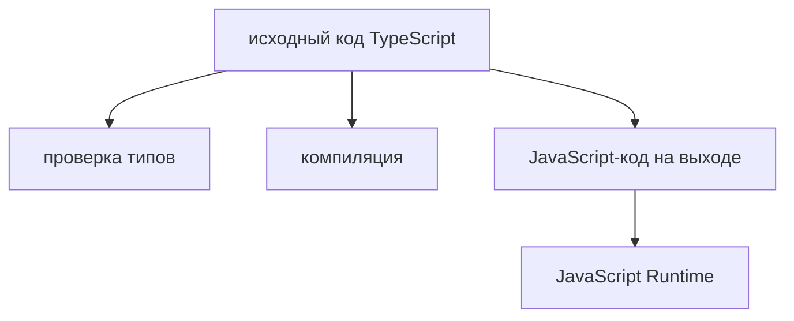

Если инженер не понимает JavaScript, TypeScript начинает восприниматься как самостоятельная магическая среда. Это приводит к ошибкам.

Например, TypeScript может помочь описать форму объекта:

```typescript
type User = {
  id: string;
  email: string;
};
```

Но во время выполнения тип `User` исчезает. Если API вернул объект неправильной формы, TypeScript сам по себе не проверит реальный JSON в runtime. Для этого нужны runtime-проверки, assertions, validators или contract tests.

Поэтому порядок курса принципиален:

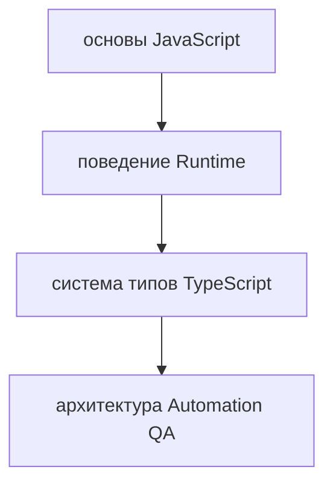

Сначала нужно понять, как выполняется JavaScript. Только после этого можно правильно понять, что TypeScript проверяет, чего не проверяет и где проходят границы его ответственности.

### Почему понимание важнее запоминания

В автоматизации тестирования код постоянно работает с изменяемой средой:

* браузером;
* сетью;
* API;
* базой данных;
* очередями;
* файлами;
* конфигурацией;
* параллельным запуском тестов.

В такой среде невозможно выжить на запоминании отдельных правил.

Можно запомнить, что перед действием в Playwright часто пишут `await`. Но если не понимать Promise и Event Loop, будет сложно объяснить, почему тест стал flaky.

Можно запомнить, что объекты сравниваются по ссылке. Но если не понимать Heap и References, будет сложно написать корректный helper для сравнения API-ответа и записи в базе данных.

Можно запомнить, что TypeScript помогает находить ошибки. Но если не понимать Type Erasure, будет сложно объяснить, почему тест упал на реальном ответе API, хотя компилятор был доволен.

Понимание дает переносимость. Если вы понимаете механизм, вы можете применить его в новой ситуации, даже если раньше не видели такой код.

---

## Внутренний механизм курса

Курс устроен как последовательная система зависимостей.

Каждая новая тема опирается на уже изученные механизмы. Это важно, потому что JavaScript нельзя надежно понять фрагментами. Например, `Closure` невозможно хорошо объяснить без `Scope` и `Lexical Environment`. `async / await` невозможно хорошо объяснить без `Promise` и Event Loop. TypeScript `Narrowing` невозможно хорошо понять без понимания условий, типов значений и runtime-проверок.

Общая зависимость тем выглядит так:

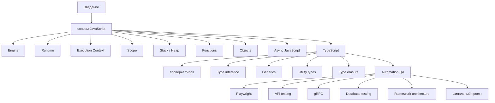

Внутри каждой главы материал проходит один и тот же цикл:

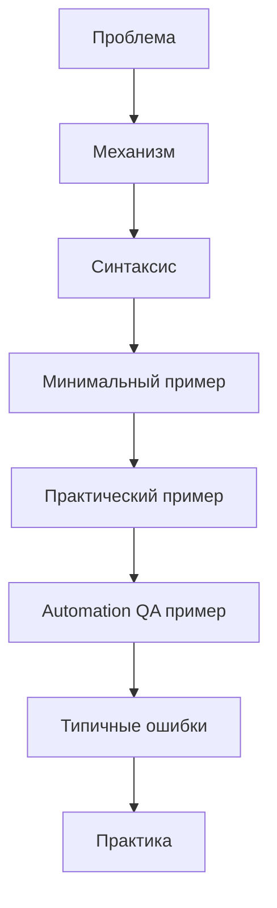

Этот цикл нужен для того, чтобы знание не оставалось абстрактным. Если тема объяснена только теоретически, ее сложно применить. Если тема показана только на коде, ее легко скопировать, но трудно перенести в другую задачу.

Курс соединяет оба уровня: механизм и применение.

---

## Ментальная модель

Представьте курс как фреймворк, который строится по слоям.

Нижний слой — JavaScript. На нем находятся механизмы выполнения кода: память, области видимости, функции, объекты, асинхронность.

Следующий слой — TypeScript. Он добавляет систему типов, но не отменяет JavaScript. TypeScript помогает описывать намерения разработчика и находить часть ошибок до запуска.

Следующий слой — Automation QA. Здесь язык используется для реальных задач: открыть страницу, отправить запрос, проверить ответ, подготовить данные, сравнить состояние системы.

Верхний слой — архитектура фреймворка. Здесь отдельные знания превращаются в систему.

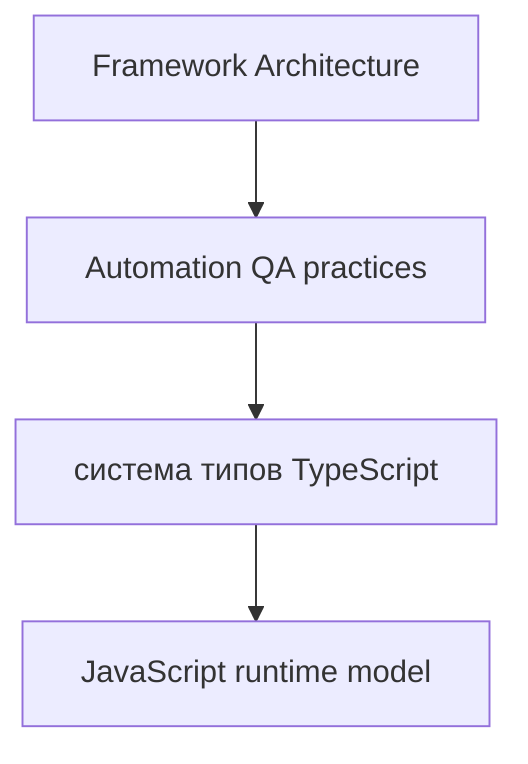

Если нижний слой слабый, верхние слои становятся нестабильными. Можно написать тест, который работает сегодня, но сложно объяснить, почему он иногда падает. Можно создать helper, который удобен в одном файле, но ломается при переиспользовании. Можно добавить типы, которые выглядят строго, но не защищают runtime.

Поэтому курс строится снизу вверх.

---

## Примеры кода

В этой главе примеры показывают не синтаксис отдельной темы, а общий принцип курса: каждый фрагмент кода нужно понимать через механизм.

### Пример 1. Значение и ссылка

```javascript
const expectedUser = {
  id: 'user-1',
  email: 'qa@example.com'
};

const actualUser = expectedUser;

actualUser.email = 'updated@example.com';

console.log(expectedUser.email);
```

Результат:

```text
updated@example.com
```

Что произошло:

`expectedUser` и `actualUser` указывают на один и тот же объект в Heap. Изменение через одну переменную видно через другую, потому что объект общий.

Внутренняя модель:

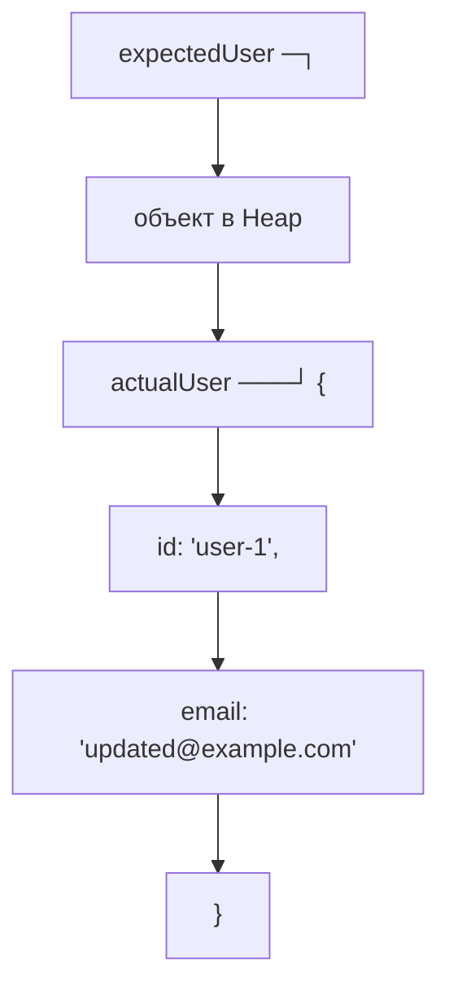

Почему это важно для Automation QA:

Если helper изменяет объект тестовых данных по ссылке, другой тест или другая проверка может получить уже измененное состояние. Это частая причина неочевидных ошибок в тестовых фреймворках.

### Пример 2. TypeScript не проверяет runtime-ответ API

```typescript
type UserResponse = {
  id: string;
  email: string;
};

async function getUser(): Promise<UserResponse> {
  const response = await fetch('https://example.com/api/users/1');
  return response.json();
}
```

Тип `UserResponse` описывает ожидание разработчика. Но если сервер вернет объект без `email`, TypeScript не остановит выполнение в runtime. Он не проверяет реальный JSON автоматически.

Внутренняя модель:

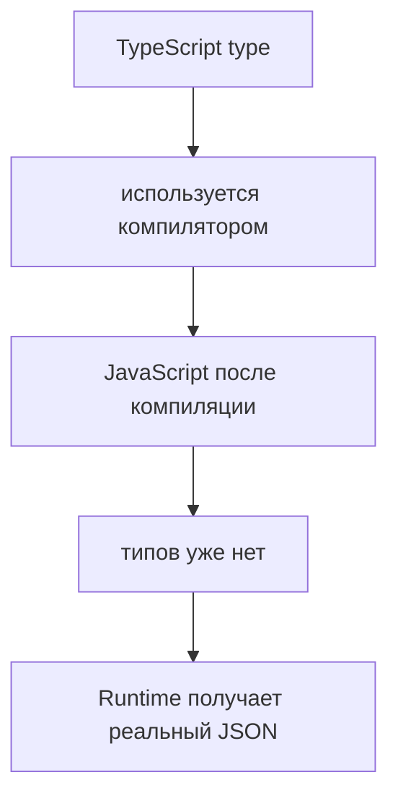

Почему это важно для Automation QA:

В API-тестах недостаточно описать тип ответа. Нужно проверять фактический ответ:

```typescript
const user = await getUser();

expect(user.email).toBeDefined();
```

Позже курс подробно разберет, как строить надежные проверки API-ответов, как соединять TypeScript-типы с runtime validation и почему contract testing не заменяется одними интерфейсами.

---

## Распространённые мифы

**Миф: чтобы писать автотесты, язык знать необязательно.**
Без языка тесты пишутся копированием. Любое отклонение от шаблона становится тупиком.

**Миф: достаточно выучить Playwright.**
Инструмент запускает браузер. Всё остальное — данные, границы, диагностика, стабильность — пишется на языке.

**Миф: курс можно пройти чтением.**
Понимание проверяется выполнением: запуском примеров и решением задач.

**Миф: если тест проходит, он написан правильно.**
Зелёный результат означает, что проверенное сошлось. Непроверенное остаётся неизвестным.

**Миф: SDET — это тестировщик, который немного программирует.**
Это инженер, который проектирует и поддерживает работающую систему проверок.

## Частые вопросы

**Нужен ли опыт программирования до начала?**
Нет. Курс начинается с модели выполнения языка.

**Зачем столько теории перед инструментами?**
Чтобы уметь читать чужой код и понимать причину падения, а не только повторять примеры.

**Можно ли сразу перейти к разделу автоматизации?**
Можно, но тогда придётся возвращаться за объяснениями почти на каждой главе.

**Сколько времени занимает прохождение?**
Зависит от темпа. Полезнее считать не часы, а число решённых задач.

**Что считать готовностью к работе?**
Умение самостоятельно написать, отладить и объяснить тест — включая причину его падения.

## Распространённые ошибки

### Ошибка 1. Начинать с инструмента и пропускать язык

Неправильный подход:

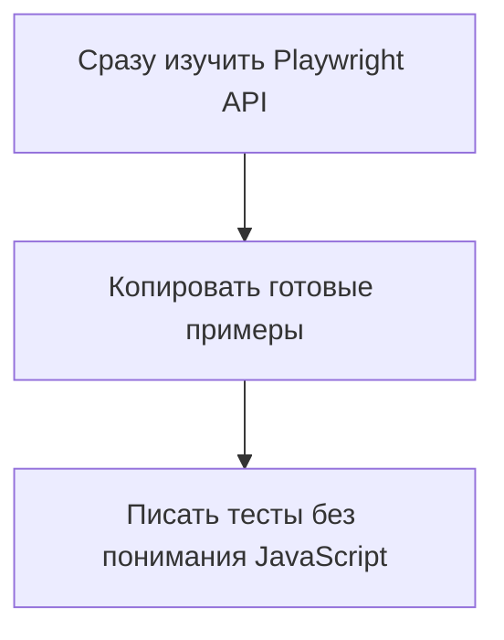

Что произошло:

Инженер быстро получает первые результаты, но при усложнении проекта сталкивается с ошибками, которые невозможно объяснить только документацией Playwright.

Почему это произошло:

Playwright использует JavaScript и TypeScript. Асинхронность, объекты, функции, модули, ошибки и типы работают по правилам языка, а не по отдельным правилам тестового инструмента.

Исправленный подход:

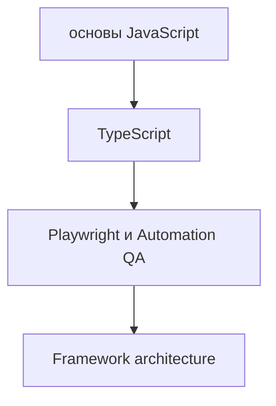

### Ошибка 2. Запоминать формулировки вместо механизма

Неправильная формулировка:

```text
const делает значение неизменяемым.
```

Что произошло:

Такая формулировка приводит к неверному ожиданию: кажется, что объект, объявленный через `const`, нельзя изменить.

Почему это произошло:

Перепутаны две разные вещи: binding переменной и значение объекта в Heap.

Исправленная формулировка:

```text
const запрещает переназначить binding переменной.
Если переменная хранит ссылку на объект, сам объект может оставаться изменяемым.
```

### Ошибка 3. Считать TypeScript runtime-защитой

Неправильный код:

```typescript
type Order = {
  id: string;
  total: number;
};

const order = await response.json() as Order;

expect(order.total).toBeGreaterThan(0);
```

Что произошло:

Код сообщает TypeScript, что `order` нужно считать объектом типа `Order`. Но это не проверяет фактическую структуру ответа.

Почему это произошло:

`as Order` является утверждением типа на этапе проверки TypeScript. Оно не создает runtime validation.

Исправленный вариант:

```typescript
const order = await response.json();

expect(typeof order.id).toBe('string');
expect(typeof order.total).toBe('number');
expect(order.total).toBeGreaterThan(0);
```

Позже такие проверки будут вынесены в отдельные assertions и validation helpers.

---

## Практическое использование

Этот курс нужно проходить как инженерный проект.

Рекомендуемый порядок работы с главой:

1. Прочитать главу полностью.
2. Повторить минимальные примеры.
3. Объяснить каждый пример своими словами.
4. Выполнить практику без просмотра решений.
5. Сравнить результат с решением.
6. Найти расхождения в рассуждениях, а не только в коде.
7. Вернуться к теории, если ошибка связана с неверной моделью.

Важно не просто получить правильный ответ. Важно понимать, почему он правильный.

Репозиторий поддерживает этот порядок:

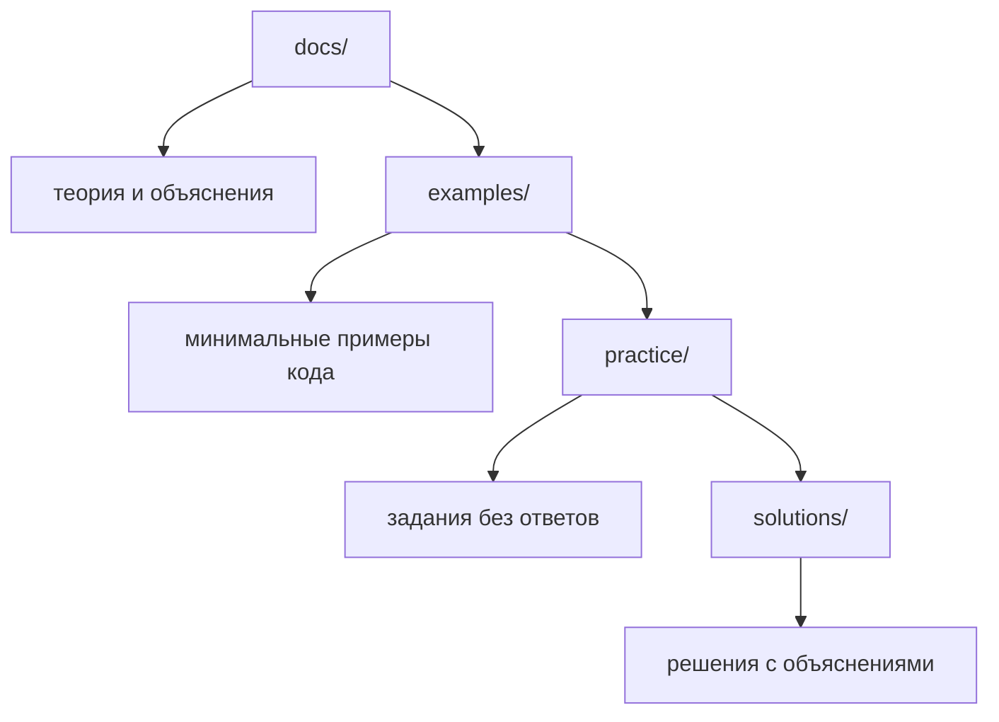

Главы находятся в `docs/`. Они объясняют механизм и дают контекст.

Примеры находятся в `examples/`. Они показывают отдельные идеи в коде. Пример должен быть минимальным и не смешивать несколько новых механизмов одновременно.

Практика находится в `practice/`. Там собраны вопросы, задачи на чтение кода, реализацию, поиск ошибок, QA-задачи и мини-проекты. Практика не содержит ответов.

Решения находятся в `solutions/`. Они нужны не для копирования, а для проверки мышления. Хорошее использование решения — сравнить не только финальный код, но и ход рассуждения.

---

## Использование в Automation QA

Automation QA в этом курсе не является отдельным приложением к языку. Это основной контекст применения.

Когда будет изучаться JavaScript, каждая важная тема будет связываться с тестовой автоматизацией:

* переменные и ссылки — с тестовыми данными;
* функции — с helper-функциями;
* объекты — с API-ответами и Page Object;
* массивы — со списками элементов и наборами данных;
* Promise — с сетевыми запросами и действиями браузера;
* Event Loop — со стабильностью асинхронных тестов;
* ошибки — с диагностикой падений;
* модули — со структурой framework;
* TypeScript-типы — с API clients, fixtures и configuration.

Например, простой тест Playwright выглядит как использование инструмента:

```typescript
test('user can open profile page', async ({ page }) => {
  await page.goto('/profile');
  await expect(page.getByRole('heading', { name: 'Profile' })).toBeVisible();
});
```

Но внутри такого теста уже присутствуют фундаментальные темы:

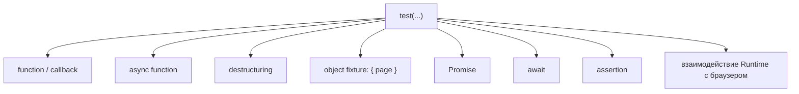

Если эти темы не изучены, тест выглядит как набор команд. Если темы понятны, тест становится читаемой программой с предсказуемым поведением.

Цель курса — довести читателя до второго состояния.

---

## Проверьте себя

1. Чем работа SDET отличается от ручного тестирования?
2. Почему курс начинается с языка, а не с инструмента автоматизации?
3. Что означает «тест прошёл» и чего это не означает?
4. Зачем в курсе задачи, если есть примеры кода?
5. По какому признаку можно считать себя готовым к рабочим задачам?

## Практика

Практика к этой главе находится в файле:

```text
practice/00-introduction/01-about-course.md
```

В ней есть:

* вопросы на понимание;
* задания на анализ кода;
* задания на написание коротких объяснений;
* задания на поиск ошибок в рассуждениях;
* QA-ориентированные задачи;
* мини-проект по описанию личного плана прохождения курса.

Решения находятся в файле:

```text
solutions/00-introduction/01-about-course.md
```

Сначала выполните практику самостоятельно. Решения нужно открывать только после попытки объяснить ответы своими словами.

---

## Итоги

Этот курс построен как инженерный учебник по JavaScript, TypeScript и Automation QA.

Его цель — не дать набор готовых шаблонов, а сформировать понимание механизмов. Поэтому курс начинается с JavaScript: именно JavaScript выполняется в runtime, управляет памятью, областями видимости, функциями, объектами и асинхронностью.

TypeScript изучается после JavaScript, потому что TypeScript добавляет систему типов поверх языка, но не заменяет runtime-модель. Чтобы правильно использовать типы, нужно понимать, что происходит после компиляции.

Automation QA проходит через весь курс как основной практический контекст. Каждая важная тема будет связываться с реальными задачами: Playwright, API, gRPC, PostgreSQL, fixtures, helpers, assertions, reporting и архитектурой фреймворка.

Репозиторий разделяет материалы по назначению:

* `docs/` — главы учебника;
* `examples/` — минимальные примеры;
* `practice/` — задания без ответов;
* `solutions/` — решения и объяснения;
* `playground/` — место для экспериментов.

Следующая глава объясняет, как пользоваться курсом: как читать главы, как выполнять практику, как работать с ошибками и как выстраивать собственный темп обучения.
