# Структура курса

## Связь с предыдущей главой

В предыдущей главе был разобран способ обучения: как читать материал, запускать примеры, выполнять практику, использовать `playground/` и сравнивать свои ответы с решениями.

Эта глава продолжает ту же тему, но смотрит на курс крупнее. Теперь важно понять не процесс работы с одной главой, а архитектуру всего учебника: почему части расположены именно так, как знания накапливаются и почему финальный проект появляется только после фундаментальных разделов.

---

## Предварительные требования

Для этой главы достаточно:

* понимать назначение курса из главы "О курсе";
* понимать учебный цикл из главы "Как пользоваться курсом";
* знать, что репозиторий разделен на `docs/`, `examples/`, `practice/`, `solutions/` и `playground/`;
* уметь читать простые ASCII-схемы.

Глубокое знание JavaScript или TypeScript для этой главы не требуется.

---

## Время изучения

Ориентировочное время:

```text
Чтение главы:          35-45 минут
Разбор схем:           15-20 минут
Практика:              40-60 минут
Повторение материала:  15 минут
```

Уровень сложности: **L0**.

L0 означает вводный уровень. На этом уровне не требуется писать сложный код. Главная задача — понять устройство курса и правила движения по нему.

---

## Навигация

Предыдущая глава:

```text
docs/00-introduction/02-how-to-study.md
```

Следующая глава:

```text
docs/00-introduction/04-development-environment.md
```

---

## Цели обучения

После изучения этой главы вы будете понимать:

* почему курс разделен на введение, JavaScript, TypeScript, Automation QA и финальный проект;
* почему порядок разделов важен для понимания;
* как каждая часть зависит от предыдущих частей;
* как знания накапливаются от главы к главе;
* почему пропуск глав создает пробелы;
* как теория, примеры, практика и решения работают вместе;
* как структура репозитория поддерживает обучение;
* как финальный проект объединяет темы курса;
* как использовать структуру курса при планировании собственного обучения.

---

## Мотивация

Большой технический курс легко воспринимать как длинный список тем.

Если смотреть на оглавление поверхностно, можно увидеть набор названий: переменные, функции, объекты, типы, Playwright, API, база данных, framework architecture. В таком виде курс кажется линейным перечнем материалов.

На самом деле это не перечень. Это система зависимостей.

Каждая часть курса отвечает за свой слой подготовки. Введение объясняет, как учиться и как устроен репозиторий. JavaScript формирует модель выполнения программы. TypeScript добавляет систему типов. Automation QA показывает применение языка в тестовой автоматизации. Финальный проект собирает эти знания в единую архитектуру.

Если изучать разделы в правильном порядке, каждое новое понятие опирается на уже построенную модель. Если перескакивать через разделы, появляются пустые места. Эти пустые места не всегда заметны сразу. Они проявляются позже: при чтении чужого кода, проектировании helper-функции, анализе flaky-теста или описании типов для API-клиента.

Структура курса нужна для того, чтобы обучение было накопительным, а не фрагментарным.

---

## Теория

### Общая архитектура курса

Курс разделен на пять крупных частей:

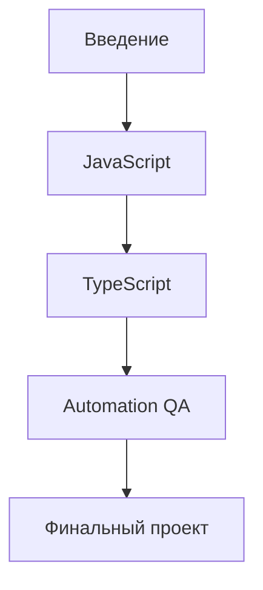

Каждая часть решает отдельную задачу.

Введение отвечает за подготовку к обучению. Здесь разбираются цель курса, способ работы с материалами, структура репозитория, рабочее окружение и правила выполнения заданий.

JavaScript отвечает за фундамент языка. Здесь изучаются механизмы выполнения кода: значения, переменные, функции, объекты, массивы, модули, ошибки и асинхронность. Асинхронность — это работа с операциями, результат которых появляется не сразу; подробно она будет разобрана в разделе Async JavaScript.

TypeScript отвечает за систему типов. Типы помогают описывать форму данных и находить часть ошибок до запуска программы. Подробно TypeScript будет изучаться после JavaScript, потому что TypeScript-код в итоге превращается в JavaScript.

Automation QA отвечает за применение языка в тестировании. Здесь появятся Playwright, API testing, gRPC, PostgreSQL, fixtures, helpers, assertions, reporting и framework architecture. Каждый из этих инструментов будет вводиться отдельно и без перегрузки деталями до нужной главы.

Финальный проект отвечает за сборку знаний в систему. Это не отдельная новая теория, а применение всего, что было изучено раньше.

### Почему курс начинается с введения

Введение не является формальностью.

Перед изучением языка нужно понять:

* как устроен курс;
* как выполнять практику;
* где запускать примеры;
* когда читать решения;
* как фиксировать ошибки понимания;
* как двигаться по темам без пропусков.

Без этого читатель может начать с JavaScript-глав, но работать с ними как со справочником. Такой подход плохо подходит для курса, который объясняет механизмы.

Введение создает рабочий процесс:

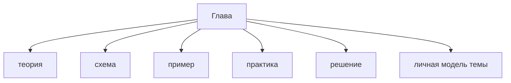

Эта модель будет использоваться во всех последующих разделах.

### Почему JavaScript изучается до TypeScript

JavaScript изучается раньше TypeScript, потому что именно JavaScript выполняется в runtime.

Runtime — это среда, в которой программа реально запускается. Например, Node.js является runtime для JavaScript вне браузера; подробно Node.js будет разобран во введении к рабочему окружению.

TypeScript добавляет проверку типов, но не отменяет поведение JavaScript. Если не понимать значения, ссылки, функции, объекты и асинхронность, TypeScript-типы могут создать ложное ощущение безопасности.

Минимальная схема:

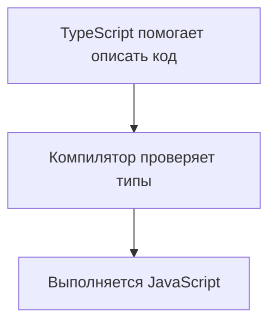

Поэтому сначала курс формирует понимание JavaScript-механизмов. Затем TypeScript объясняется как слой над уже знакомым языком.

Важно не углубляться в TypeScript раньше времени. В этой главе достаточно запомнить одну идею: TypeScript помогает проверить часть ошибок до запуска, но программа выполняется как JavaScript. Подробно компилятор, Type Erasure и система типов будут разобраны в части TypeScript.

### Почему TypeScript изучается до Playwright и framework architecture

Playwright и архитектура тестового фреймворка требуют не только знания JavaScript. В реальных проектах автотесты часто пишутся на TypeScript.

TypeScript нужен до архитектурных глав, потому что он помогает:

* описывать структуру тестовых данных;
* задавать контракты helper-функций;
* проектировать API clients;
* описывать fixtures;
* снижать количество ошибок при рефакторинге;
* делать framework более читаемым.

Fixture — это подготовленный объект или состояние, которое тест получает перед выполнением; подробно fixtures будут разобраны в разделе Automation QA.

Если начать строить framework до изучения TypeScript, часть решений будет держаться только на договоренностях в голове. Например, helper может ожидать объект одного вида, а получить другой. TypeScript не решает все проблемы, но помогает явно описывать ожидания.

Последовательность выглядит так:

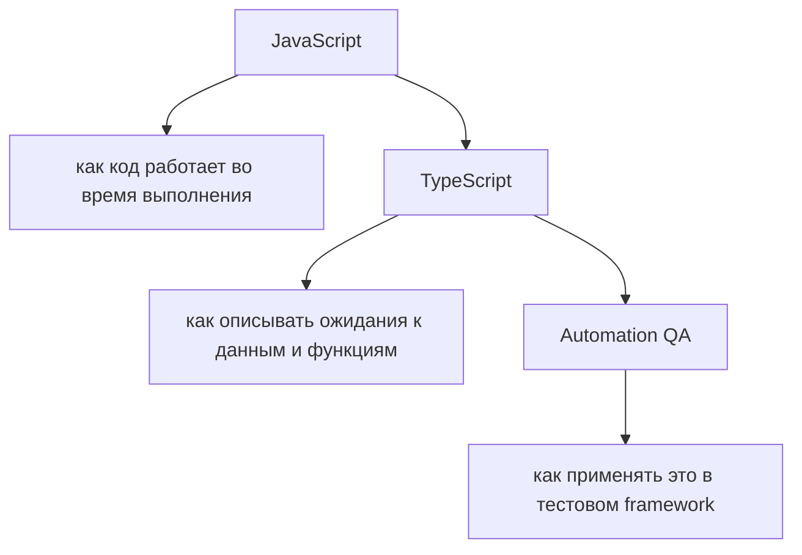

Framework architecture изучается после языка и типов, потому что архитектура состоит из решений о границах, зависимостях и ответственности модулей. Эти решения невозможно хорошо принимать, если непонятно, как работают функции, объекты, модули, ошибки и типы.

### Как разделы зависят друг от друга

В курсе есть вертикальная зависимость.

Каждая следующая часть не заменяет предыдущую, а использует ее.

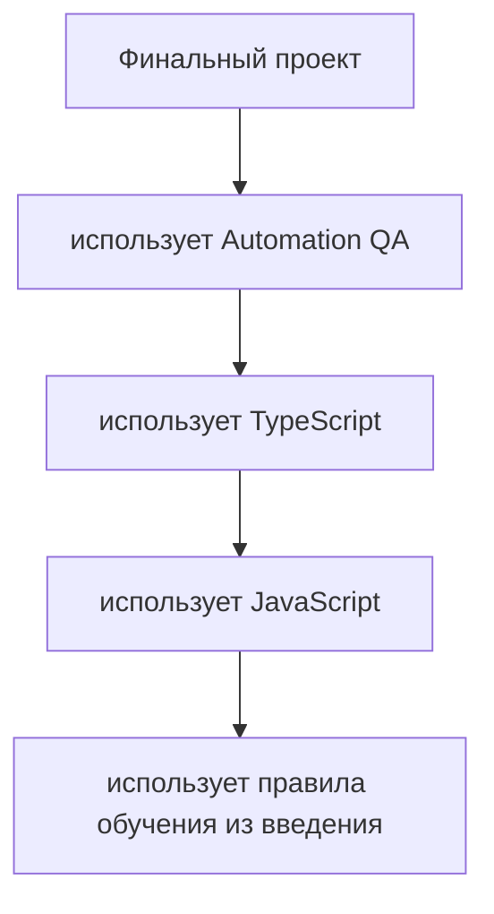

Это означает, что знания не закрываются после прохождения раздела. JavaScript продолжает использоваться в TypeScript. TypeScript продолжает использоваться в Automation QA. Практика работы с примерами продолжает использоваться в финальном проекте.

Например, когда курс перейдет к API-клиенту, там одновременно понадобятся:

* функции для выделения повторяемой логики;
* объекты для описания данных;
* асинхронность для работы с запросами;
* TypeScript-типы для описания входных и выходных данных;
* assertions для проверки результата.

Assertion — это проверка ожидаемого результата в тесте; подробно assertions будут разобраны в Automation QA.

Ни одна из этих тем не появляется изолированно. Архитурная задача почти всегда соединяет несколько механизмов.

### Как знания накапливаются

Знания в курсе накапливаются по принципу расширения модели.

Сначала читатель понимает маленький механизм. Затем этот механизм становится частью более крупного механизма. Потом несколько механизмов соединяются в практическую задачу.

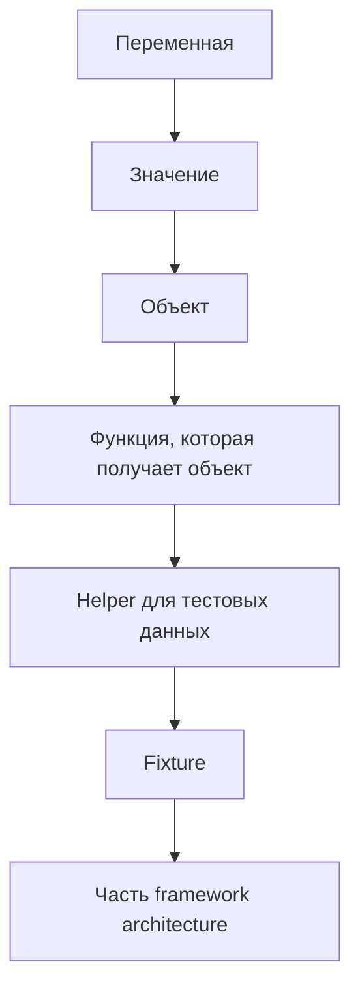

На каждом уровне появляется новая ответственность. Переменная хранит значение. Объект группирует данные. Функция выполняет действие. Helper переиспользует действие в тестах. Fixture подготавливает состояние теста. Framework architecture определяет, где это должно жить в проекте.

Курс устроен так, чтобы читатель видел эту цепочку постепенно.

### Почему пропуск глав создает пробелы

Пропущенная глава редко мешает сразу.

Можно не понимать область видимости и все равно написать несколько функций. Можно не понимать ссылки и все равно работать с объектами. Можно не понимать асинхронность и все равно скопировать тест с `await`.

Проблема появляется позже, когда код ведет себя не так, как ожидалось.

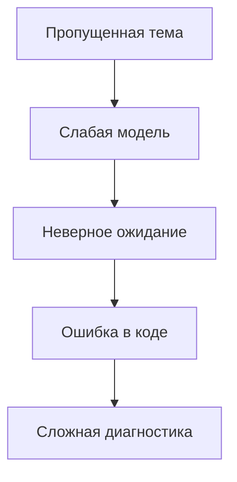

Например, если пропустить тему References, будет трудно объяснить, почему изменение тестовых данных в одном helper влияет на другой тест. Если пропустить Promise, будет трудно понять, почему действие не дождалось результата. Если пропустить Type Erasure, будет трудно объяснить, почему TypeScript не проверил реальный API-ответ во время выполнения.

Type Erasure означает исчезновение TypeScript-типов после компиляции; подробно эта тема будет разобрана в части TypeScript.

Пропуск главы создает не просто отсутствие знания. Он создает неверные ожидания.

### Как теория, примеры, практика и решения работают вместе

Каждая глава использует четыре связанных слоя:

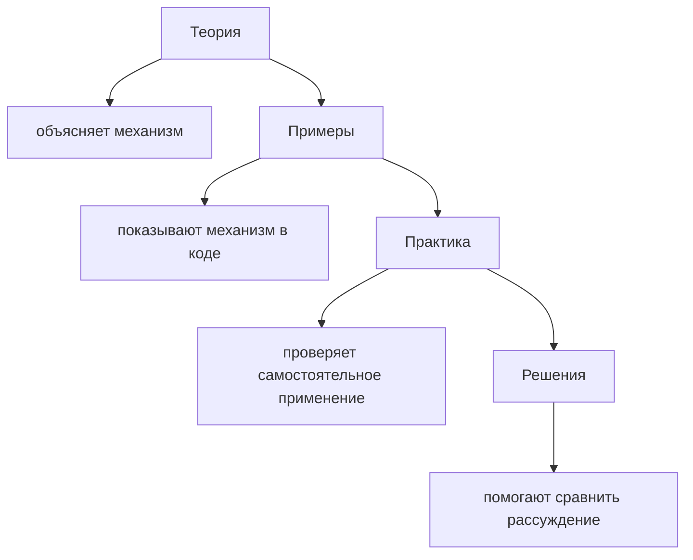

Теория без примеров остается абстрактной. Примеры без практики легко создают иллюзию понимания. Практика без решений может оставить ошибку незамеченной. Решения без самостоятельной попытки превращаются в чтение готового ответа.

Поэтому эти части нужно использовать вместе.

Правильный учебный маршрут:

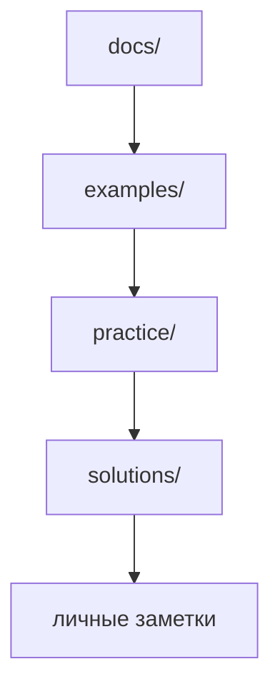

Если глава не содержит отдельного файла в `examples/`, это не означает, что в ней нет примеров. Небольшие примеры могут быть встроены прямо в текст главы. Отдельные файлы в `examples/` нужны тогда, когда пример должен запускаться как самостоятельный фрагмент.

### Как репозиторий поддерживает обучение

Структура репозитория отражает структуру обучения.

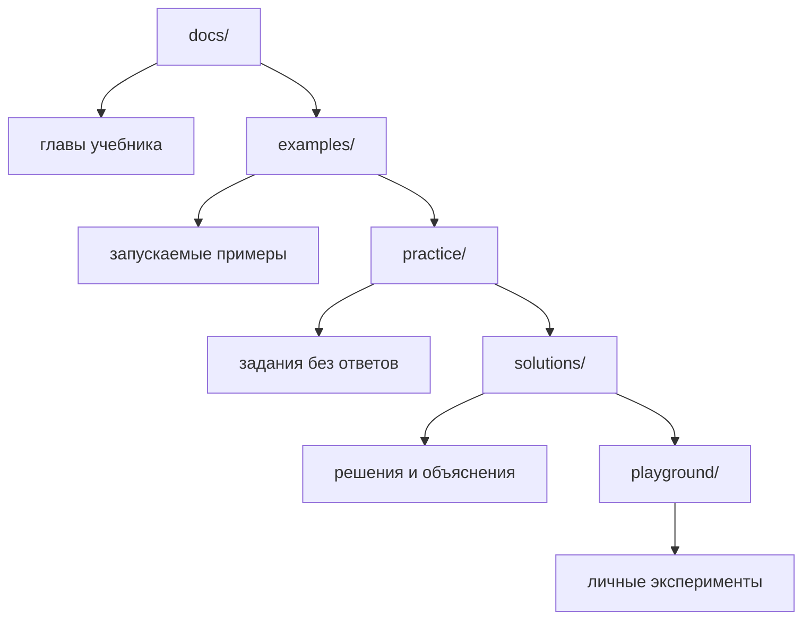

`docs/` отвечает за последовательное объяснение.

`examples/` отвечает за демонстрацию конкретного механизма в коде.

`practice/` отвечает за самостоятельную проверку понимания.

`solutions/` отвечает за разбор и сравнение подходов.

`playground/` отвечает за безопасные эксперименты, которые не должны смешиваться с основными материалами курса.

Такая структура помогает не смешивать разные задачи. Текст главы не превращается в черновик. Практика не содержит ответов. Решения не мешают самостоятельной попытке. Эксперименты не загрязняют учебные примеры.

### Как финальный проект объединяет курс

Финальный проект появляется в конце не потому, что он второстепенный.

Он появляется в конце, потому что требует всех предыдущих слоев.

В финальном проекте нужно будет принимать решения о структуре framework, слоях API, gRPC, database, helpers, fixtures, assertions, reporting и конфигурации.

gRPC — это способ взаимодействия сервисов через строго описанные контракты; подробно он будет изучаться в отдельном разделе Automation QA.

PostgreSQL — это реляционная база данных, с которой часто сравнивают состояние системы в backend- и end-to-end-проверках; подробно работа с ней будет разобрана позже.

Reporting — это сбор и представление результатов тестов; подробно отчеты будут изучаться в разделе framework.

Финальный проект соединяет темы так:

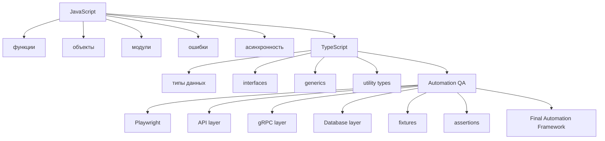

Финальный проект не должен восприниматься как набор инструкций "создать файл, вставить код". Его задача — проверить, может ли читатель объяснить архитектурные решения: почему слой находится здесь, почему helper имеет такую сигнатуру, почему проверка вынесена в assertion, почему тип описан отдельно, почему конфигурация не должна быть разбросана по тестам.

---

## Внутренний механизм

Внутренний механизм структуры курса — это управление зависимостями знаний.

В коде зависимость означает, что один модуль использует другой. В обучении зависимость означает, что одна тема использует модель, построенную раньше.

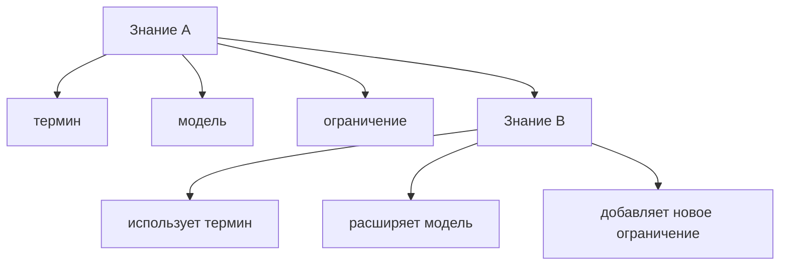

Если знание A отсутствует, знание B можно запомнить только как правило. Но правило без механизма плохо работает в новой ситуации.

Например, можно запомнить, что "нужно ставить `await`". Но без понимания Promise это правило не объясняет, что именно ожидается. Promise — это объект, который представляет результат операции сейчас или в будущем; подробно Promise будет разобран в разделе Async JavaScript.

Курс избегает таких разрывов. Новые темы вводятся только тогда, когда у читателя уже есть минимальная опора.

Этот механизм можно представить как сборку:

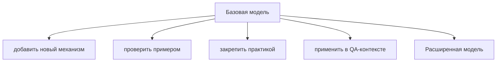

Каждая глава расширяет модель, а не заменяет ее.

---

## Ментальная модель

Представьте курс как строительство тестового фреймворка не в коде, а в понимании.

Сначала нужен фундамент. Затем появляются несущие слои. Потом добавляются прикладные части. В конце все соединяется в рабочую систему.

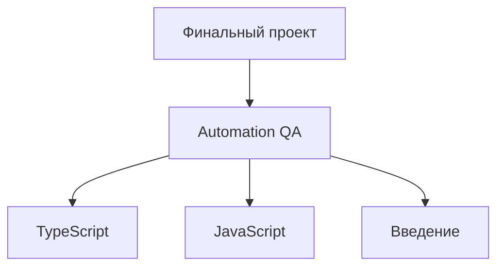

Если убрать нижний слой, верхние слои теряют опору.

Это не означает, что нужно идеально помнить каждую деталь перед переходом дальше. Но нужно понимать роль темы и иметь рабочую модель. Если модель слабая, ее можно усилить практикой, повторением и возвращением к главе.

Хороший признак готовности идти дальше:

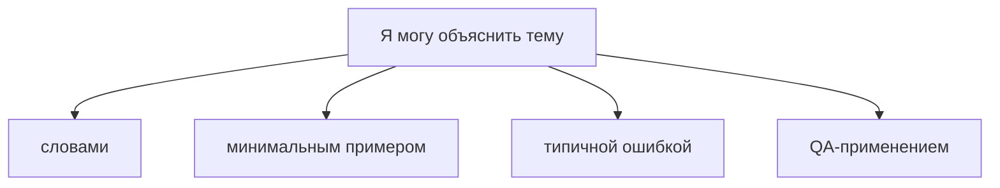

Если один из этих пунктов отсутствует, тему стоит повторить.

---

## Примеры кода

В этой главе код используется не для изучения нового синтаксиса, а для показа накопления знаний.

### Пример 1. Маленький механизм

```javascript
const baseUrl = 'https://example.com';

function buildProfileUrl(userId) {
  return `${baseUrl}/users/${userId}`;
}

console.log(buildProfileUrl('user-1'));
```

Результат:

```text
https://example.com/users/user-1
```

Что здесь используется:

* переменная хранит базовый URL;
* функция принимает `userId`;
* строка собирается из нескольких частей;
* результат возвращается из функции.

Этот пример небольшой. Он не требует Playwright, TypeScript или архитектуры. Но позже такая идея может стать частью helper-функции для API-тестов.

### Пример 2. Тот же механизм как часть QA-задачи

```javascript
function buildUserEndpoint(baseUrl, userId) {
  return `${baseUrl}/users/${userId}`;
}

const endpoint = buildUserEndpoint('https://api.example.com', 'user-1');

console.log(endpoint);
```

Результат:

```text
https://api.example.com/users/user-1
```

Что изменилось:

Базовый URL теперь передается явно. Функция стала менее зависимой от внешней переменной. Это полезно для тестов, потому что разные окружения могут иметь разные адреса API.

Environment — это окружение запуска, например local, staging или production-like; подробно конфигурация окружений будет разобрана в Automation QA.

### Пример 3. Как этот пример вырастет позже

На более поздних этапах курса похожая идея может стать частью API layer.

API layer — это слой кода, который отвечает за работу с HTTP API; подробно он будет разобран в разделе Automation QA.

Сейчас не нужно изучать его подробно. Достаточно увидеть направление роста:

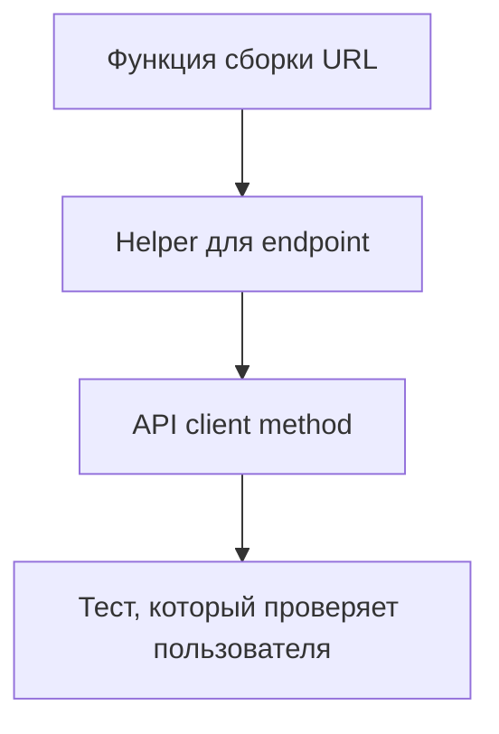

Так маленький механизм постепенно становится частью архитектуры.

---

## Распространённые мифы

**Миф: разделы независимы и порядок не важен.**
Каждый следующий опирается на модель, построенную в предыдущем.

**Миф: раздел автоматизации — главный, остальное подготовка.**
Большая часть работы инженера автоматизации — это код на языке, а не вызовы инструмента.

**Миф: TypeScript можно изучить позже, по ходу.**
Он используется во всех последующих разделах, поэтому идёт до них.

**Миф: финальный проект — формальность в конце.**
Это проверка того, что отдельные темы собираются в работающую систему.

**Миф: объём разделов отражает их важность.**
Объём отражает количество механизмов, которые нужно разобрать, а не приоритет темы.

## Частые вопросы

**Можно ли менять порядок разделов?**
Нежелательно: следующий опирается на предыдущий.

**Зачем язык и типы перед инструментами?**
Чтобы читать и отлаживать код, а не только запускать готовые сценарии.

**Что делать, если часть материала уже знакома?**
Пройти самопроверку в конце главы. Если вопросы не вызывают затруднений, двигаться дальше.

**Где проходит граница между разделами?**
Раздел заканчивается, когда его модель становится достаточной для следующего.

**Что делать после финального проекта?**
Применять подход на собственном проекте — он и есть настоящая проверка.

## Распространённые ошибки

### Ошибка 1. Воспринимать оглавление как список независимых тем

Неправильный подход:

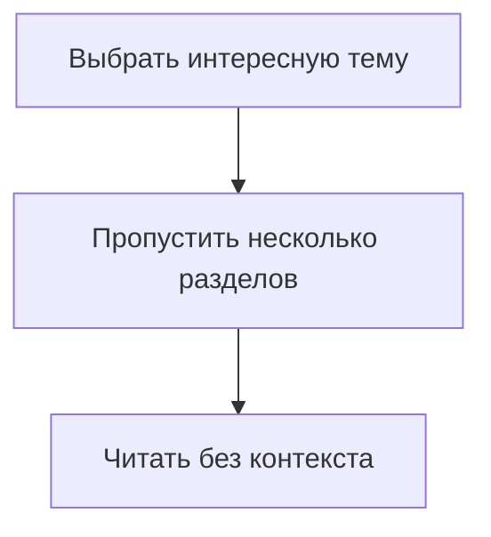

Что произошло:

Тема изучается без моделей, которые должны были быть построены раньше.

Почему это произошло:

Оглавление было воспринято как меню, а не как маршрут зависимостей.

Исправленный вариант:

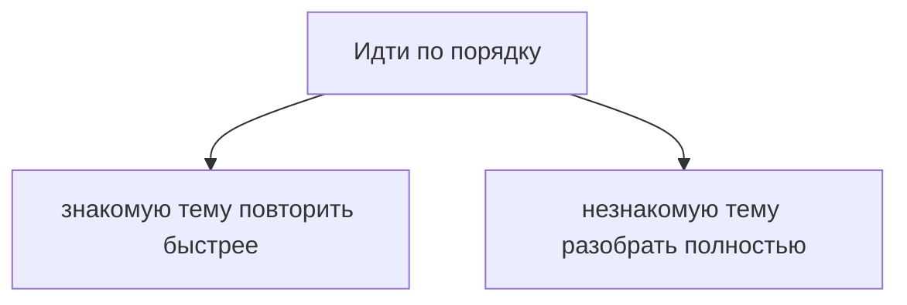

### Ошибка 2. Начинать framework architecture до языка и типов

Неправильный подход:

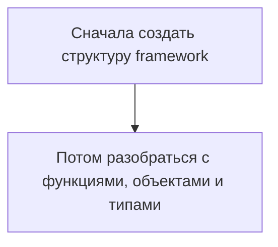

Что произошло:

Архитектурные решения принимаются без понимания строительных элементов.

Почему это произошло:

Framework воспринимается как набор папок, а не как система зависимостей и ответственностей.

Исправленный вариант:

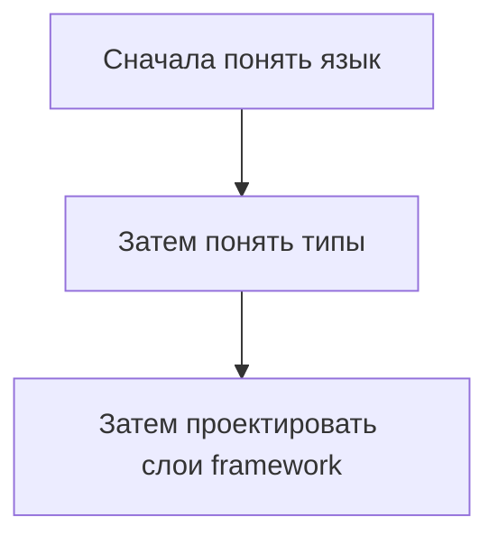

### Ошибка 3. Считать TypeScript отдельной заменой JavaScript

Неправильная формулировка:

```text
Я буду писать на TypeScript, поэтому JavaScript можно изучать поверхностно.
```

Что произошло:

Игнорируется тот факт, что TypeScript-код выполняется как JavaScript после компиляции.

Почему это произошло:

TypeScript воспринимается как отдельный runtime, хотя он добавляет проверку типов поверх JavaScript.

Исправленная формулировка:

```text
TypeScript помогает описывать и проверять код до запуска.
Поведение программы во время выполнения определяется JavaScript.
```

### Ошибка 4. Использовать решения как основной учебный материал

Неправильный подход:

```mermaid
flowchart TD
    N1["Прочитать главу"]
    N2["Открыть решение"]
    N3["Считать тему изученной"]
    N1 --> N2
    N2 --> N3
```

Что произошло:

Практика перестала проверять самостоятельное понимание.

Почему это произошло:

Решение было использовано до собственной попытки.

Исправленный вариант:

```mermaid
flowchart TD
    N1["Сначала практика"]
    N2["Затем решение"]
    N3["Затем сравнение рассуждений"]
    N1 --> N2
    N2 --> N3
```

### Ошибка 5. Не видеть будущую роль простых тем

Неправильный подход:

```text
Переменные и функции слишком простые.
Можно пройти быстро и не делать задания.
```

Что произошло:

Простые темы не были связаны с будущими задачами.

Почему это произошло:

Читатель смотрит на тему только как на синтаксис, а не как на строительный элемент framework.

Исправленный подход:

После каждой простой темы задавать вопрос:

```text
Где этот механизм появится в helper, fixture, assertion или API client?
```

---

## Практическое использование

Используйте структуру курса как карту.

Перед началом нового раздела полезно ответить на три вопроса:

1. Какие темы уже должны быть понятны?
2. Какие новые механизмы появятся?
3. Где они будут применяться в Automation QA?

Для планирования можно использовать простую таблицу:

```text
Раздел: JavaScript / Functions

Опора:
переменные, scope, значения

Новые механизмы:
function declaration, parameters, return

QA-применение:
helpers, builders, custom assertions
```

Не нужно превращать это в большой документ. Достаточно короткой записи перед началом раздела или после его завершения.

Полезный маршрут по материалам главы:

```mermaid
flowchart TD
    N1["Оглавление"]
    N2["Глава"]
    N3["Примеры"]
    N4["Задачи"]
    N5["Ответы"]
    N6["Песочница"]
    N1 --> N2
    N2 --> N3
    N3 --> N4
    N4 --> N5
    N5 --> N6
```

Оглавление показывает порядок. Глава дает объяснение. Примеры показывают код. Задачи проверяют самостоятельность. Ответы помогают сравнить ход мысли. Песочница позволяет проверить отдельные гипотезы.

Если в теме возникает трудность, возвращайтесь не к началу курса, а к ближайшей недостающей зависимости.

Пример:

```mermaid
flowchart TD
    N1["Проблема: непонятно, почему helper изменил test data."]
    N2["Ближайшая зависимость: References."]
    N3["Действие: повторить главу про References и решить 1-2 задачи."]
    N1 --> N2
    N2 --> N3
```

Такой подход экономит время и сохраняет целостность обучения.

---

## Использование в Automation QA

Для Automation QA Engineer структура курса особенно важна, потому что рабочий код автотестов почти всегда находится на пересечении нескольких тем.

Один тест может использовать:

* конфигурацию окружения;
* fixture для подготовки браузера или данных;
* helper для создания пользователя;
* API client для запроса;
* assertion для проверки;
* TypeScript-типы для описания данных;
* асинхронность для ожидания результата.

Схема зависимости в реальном тестовом коде:

```mermaid
flowchart TD
    N1["Test scenario"]
    N2["fixture"]
    N3["TypeScript type"]
    N4["JavaScript object"]
    N5["API client"]
    N6["async function"]
    N7["Promise"]
    N8["assertion"]
    N9["comparison logic"]
    N10["values and references"]
    N1 --> N2
    N1 --> N3
    N1 --> N4
    N1 --> N5
    N1 --> N6
    N1 --> N7
    N1 --> N8
    N8 --> N9
    N9 --> N10
```

Каждая строка такого теста опирается на предыдущие части курса. Поэтому архитектурные темы нельзя изучать изолированно от языка.

Когда курс дойдет до Playwright, важно будет понимать, что Playwright — это не замена языку, а библиотека для автоматизации браузера. Библиотека — это готовый код, который предоставляет функции и объекты для решения определенной задачи; подробнее Playwright будет изучаться в разделе Automation QA.

Когда курс дойдет до API testing, важно будет понимать функции, объекты, асинхронность и проверки. Когда появится database testing, понадобятся модели данных и сравнение результатов. Когда начнется framework architecture, все предыдущие темы станут строительным материалом.

Практический вывод:

```text
Не изучать инструмент отдельно от языка.
Не проектировать framework отдельно от типов.
Не писать проверки отдельно от модели данных.
```

---

## Итоги

Курс устроен как последовательная система зависимостей.

Введение подготавливает рабочий процесс обучения. JavaScript формирует понимание выполнения кода. TypeScript добавляет слой типизации поверх JavaScript. Automation QA показывает применение языка и типов в реальных тестовых задачах. Финальный проект объединяет все это в полноценный automation framework.

Порядок тем важен, потому что знания накапливаются. Простые механизмы становятся частью более сложных решений. Переменные, функции и объекты позже превращаются в helpers, fixtures, API clients и assertions. TypeScript-типы помогают описывать границы этих частей. Архитектурные главы требуют всех предыдущих слоев.

Репозиторий поддерживает этот процесс через разделение материалов: `docs/` объясняет, `examples/` показывает, `practice/` проверяет, `solutions/` разбирает, `playground/` позволяет экспериментировать.

Следующая глава будет посвящена рабочему окружению. Она объяснит, какие инструменты нужны для запуска кода и выполнения практики, не углубляясь в темы JavaScript раньше времени.

---

## Что нужно запомнить

✓ Курс устроен как система зависимостей, а не как список независимых тем.

✓ Введение формирует рабочий процесс обучения.

✓ JavaScript изучается до TypeScript, потому что выполняется именно JavaScript.

✓ TypeScript изучается до Automation QA architecture, потому что типы помогают проектировать границы кода.

✓ Каждая следующая часть использует предыдущие части.

✓ Пропуск глав создает слабые модели и неверные ожидания.

✓ Теория, примеры, практика и решения работают только вместе.

✓ Репозиторий разделяет материалы по назначению.

✓ Финальный проект объединяет язык, типы и Automation QA.

---

## Проверьте себя

1. Почему курс начинается с введения, а не сразу с JavaScript?

2. Почему JavaScript нужно изучить до TypeScript?

3. Почему TypeScript полезен до проектирования тестового framework?

4. Что происходит, если пропустить главу с базовым механизмом?

5. Как теория, примеры, практика и решения дополняют друг друга?

6. Какую роль выполняет `playground/`?

7. Почему финальный проект находится в конце курса?

8. Как простая функция может позже стать частью API layer?

9. Какой вопрос стоит задавать перед началом нового раздела?

---

## Практика

Практика к этой главе находится в файле:

```text
practice/00-introduction/03-course-structure.md
```

Сначала выполните задания самостоятельно. Особое внимание уделите схемам зависимостей: они помогают увидеть курс как систему.

---

## Решения

Решения находятся в файле:

```text
solutions/00-introduction/03-course-structure.md
```

Открывайте решения после собственной попытки. Сравнивайте не только ответы, но и то, как вы объясняете зависимости между разделами.
