# Рабочее окружение

## Связь с предыдущей главой

В предыдущей главе была разобрана структура курса: из каких частей он состоит, почему порядок тем важен и как финальный проект собирает знания в единую систему.

Эта глава переходит от структуры курса к рабочему месту. Перед началом JavaScript-раздела нужно подготовить окружение, в котором будут запускаться примеры, выполняться практика и проверяться небольшие гипотезы.

Здесь не изучается синтаксис JavaScript. Код используется только минимально: чтобы показать, как создать файл, запустить его и увидеть результат.

---

## Предварительные требования

Для этой главы достаточно:

* понимать назначение курса;
* понимать, зачем нужны `docs/`, `examples/`, `practice/`, `solutions/` и `playground/`;
* уметь открыть папку проекта в редакторе;
* иметь базовое представление о терминале как о месте, где вводятся команды.

Если терминал пока непривычен, это нормально. В этой главе он используется на базовом уровне.

---

## Время изучения

Ориентировочное время:

```text
Чтение главы:                 40-50 минут
Настройка окружения:          30-60 минут
Первые запуски JavaScript:    20-30 минут
Практика:                     45-60 минут
```

Уровень сложности: **L0**.

L0 означает вводный уровень. Главная задача главы — подготовить инструменты и научиться запускать минимальный файл, не углубляясь в язык.

---

## Навигация

Предыдущая глава:

```text
docs/00-introduction/03-course-structure.md
```

Следующая глава:

```text
docs/01-javascript/01-what-is-javascript.md
```

---

## Цели обучения

После изучения этой главы вы будете понимать:

* почему рабочее окружение влияет на качество обучения;
* зачем нужен Node.js;
* что такое Node.js на высоком уровне;
* что такое npm и зачем он существует;
* почему в курсе используется VS Code;
* какие расширения VS Code полезны для курса;
* как ориентироваться в папках проекта;
* как использовать терминал для простых команд;
* как создать, изменить и запустить JavaScript-файл;
* как использовать `playground/` для экспериментов;
* как читать сообщения об ошибках спокойно и последовательно;
* как применять базовое debugging-мышление;
* какие ошибки часто возникают при настройке окружения;
* что особенно важно для Automation QA Engineer.

---

## Мотивация

Рабочее окружение кажется второстепенной темой, пока все запускается.

Проблема появляется в момент, когда пример не выполняется, команда не находится, файл запускается не из той папки, редактор показывает непонятную подсветку, а ошибка в терминале выглядит как длинный технический текст.

Для обучения это опасно по двум причинам.

Первая причина: внимание уходит с темы главы на борьбу с инструментами. Вместо изучения механизма языка читатель пытается понять, почему команда `node` не работает.

Вторая причина: появляется страх ошибок. Терминал начинает восприниматься как место, где "что-то сломалось", хотя сообщение об ошибке обычно является источником информации.

Правильно подготовленное окружение снижает шум.

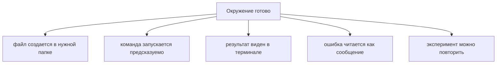

Для Automation QA это особенно важно. В реальной работе тесты запускаются командами, зависят от окружений, используют конфигурацию, пакеты, браузеры, отчеты и CI. CI — это автоматический запуск проверок на сервере или в сервисе сборки; подробно эта тема будет разобрана ближе к финальному проекту.

Если базовая работа с окружением неустойчива, сложные инструменты будут восприниматься как набор случайных проблем.

---

## Теория

### Что такое рабочее окружение

Рабочее окружение — это набор инструментов и настроек, с помощью которых вы пишете, запускаете и проверяете код.

В рамках этой главы окружение включает:

* папку проекта;
* редактор кода;
* терминал;
* Node.js;
* npm;
* `playground/` для экспериментов;
* файлы практики и решений.

Схема:

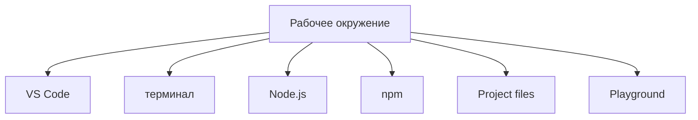

Эти элементы решают разные задачи. VS Code нужен для чтения и редактирования файлов. Терминал нужен для запуска команд. Node.js нужен для выполнения JavaScript вне браузера. npm нужен для работы с пакетами. Папки проекта помогают отделять теорию, практику, решения и эксперименты.

### Почему нужен Node.js

JavaScript можно запускать в браузере. Но этот курс использует много примеров, которые удобнее выполнять локально в файлах.

Для этого нужен Node.js.

Node.js — это среда запуска JavaScript вне браузера. В этой главе достаточно понимать Node.js именно так: он позволяет выполнить файл `.js` командой из терминала.

Глубокие внутренние темы Node.js, включая runtime, модули и работу с пакетами, будут изучаться позже. Runtime — это среда, которая реально выполняет программу; подробно runtime будет разобран в JavaScript-разделе.

Минимальная схема запуска:

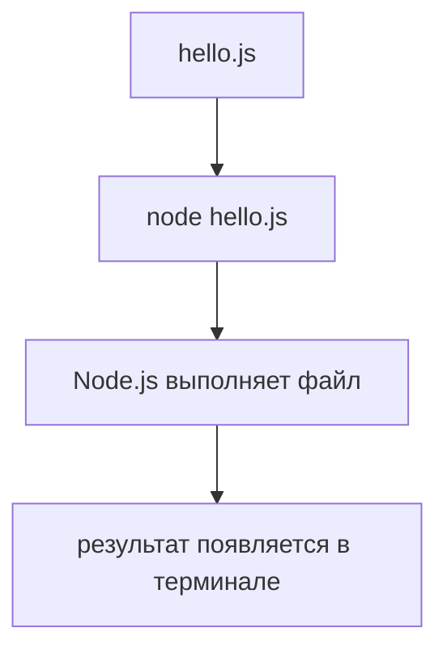

Без Node.js локальные JavaScript-файлы не будут запускаться тем способом, который используется в курсе.

### Что такое npm

npm — это инструмент для работы с пакетами JavaScript.

Пакет — это готовый код, который можно подключить к проекту. В будущих разделах через npm будут устанавливаться инструменты для TypeScript, Playwright и других задач.

В этой главе npm нужен только на уровне проверки установки:

```text
npm -v
```

Эта команда показывает версию npm.

`package.json` — это файл с описанием JavaScript-проекта и его зависимостей; подробно он будет изучаться позже. npm scripts — это команды, записанные в `package.json`; они тоже будут разобраны позже, когда появится практическая необходимость.

Важно: сейчас не нужно устанавливать дополнительные пакеты ради этой главы. Достаточно понимать, что npm будет использоваться дальше.

### Что такое VS Code

VS Code — это редактор кода.

Он используется в курсе, потому что:

* хорошо работает с JavaScript и TypeScript;
* имеет встроенный терминал;
* поддерживает расширения;
* показывает подсветку синтаксиса;
* помогает видеть структуру проекта;
* удобен для работы с Markdown, примерами и практикой.

TypeScript — это расширение JavaScript системой типов; подробно он будет изучаться в отдельной части курса позже.

Debugger — это инструмент для пошагового выполнения программы и анализа значений во время работы; подробно debugging будет изучаться позже. В этой главе достаточно знать, что VS Code поддерживает debugging, но пока мы будем читать ошибки и запускать простые файлы через терминал.

### Рекомендуемые расширения VS Code

Для этого курса полезны следующие расширения:

```text
ESLint
Prettier
Error Lens
Markdown All in One
GitLens
Playwright Test for VS Code
```

ESLint помогает находить потенциальные проблемы в коде. Подробная настройка ESLint будет изучаться позже.

Prettier форматирует код. Форматирование — это приведение кода к единому визуальному стилю; подробно настройки будут разобраны позже.

Error Lens показывает ошибки и предупреждения ближе к строке кода. Это снижает расстояние между проблемой и ее объяснением.

Markdown All in One помогает работать с Markdown-файлами, из которых состоит текст курса.

GitLens помогает читать историю изменений в Git. Git — это система контроля версий; подробно работа с Git будет разобрана отдельно.

Playwright Test for VS Code пригодится в Automation QA-разделе. Playwright — это библиотека для автоматизации браузера; подробно она будет изучаться позже.

Полезно знать:

```text
Расширения помогают видеть ошибки и форматировать код,
но они не заменяют понимание сообщения в терминале.
```

### Структура папок проекта

Проект организован так, чтобы разные типы материалов не смешивались.

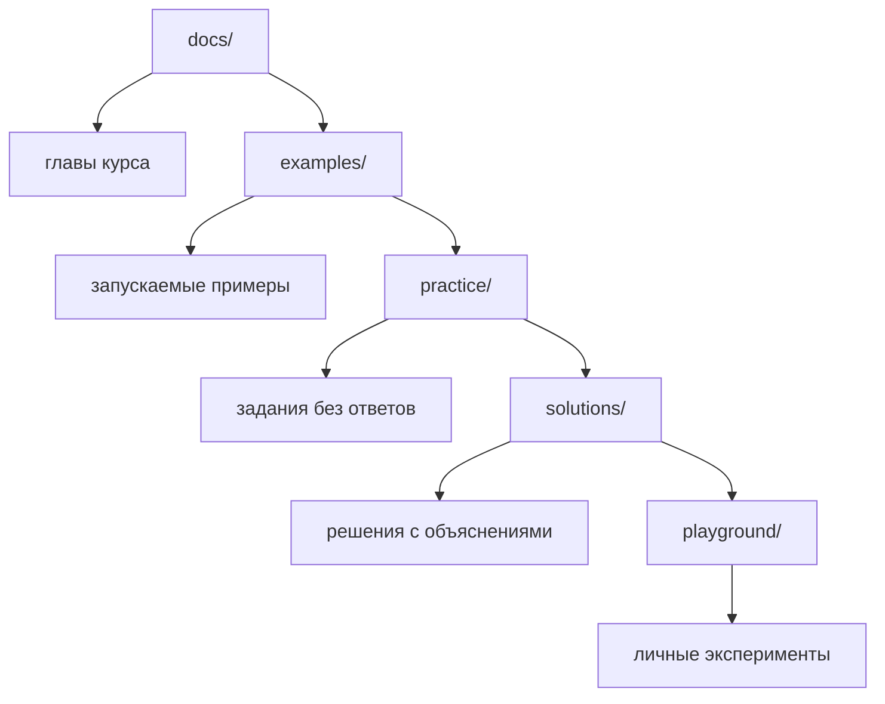

`docs/` нужно читать последовательно.

`examples/` нужно использовать для запуска подготовленных примеров, если они созданы для главы.

`practice/` нужно открывать после чтения главы и выполнять без решений.

`solutions/` нужно открывать после собственной попытки.

`playground/` нужно использовать для временных проверок: создать файл, изменить пример, запустить команду, посмотреть ошибку.

Важно:

```text
Не храните решения внутри practice/.
Не превращайте playground/ в основную папку курса.
Не меняйте структуру репозитория без явной причины.
```

### Как использовать терминал

Терминал — это интерфейс для ввода команд.

В этой главе нужны только базовые действия:

* узнать текущую папку;
* перейти в папку;
* посмотреть содержимое папки;
* запустить JavaScript-файл.

Команды:

```bash
pwd
```

Показывает текущую папку.

```bash
ls
```

Показывает файлы и папки внутри текущей папки.

```bash
cd playground
```

Переходит в папку `playground/`.

```bash
node hello.js
```

Запускает файл `hello.js` через Node.js.

Терминал всегда выполняет команду относительно текущей папки. Поэтому перед запуском важно понимать, где вы находитесь.

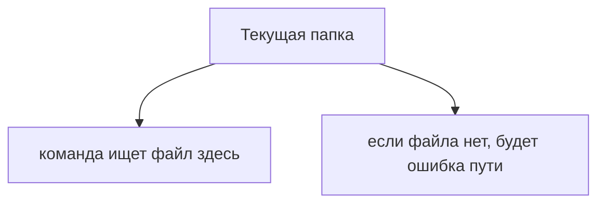

### Как создать и запустить JavaScript-файл

Минимальный рабочий цикл:

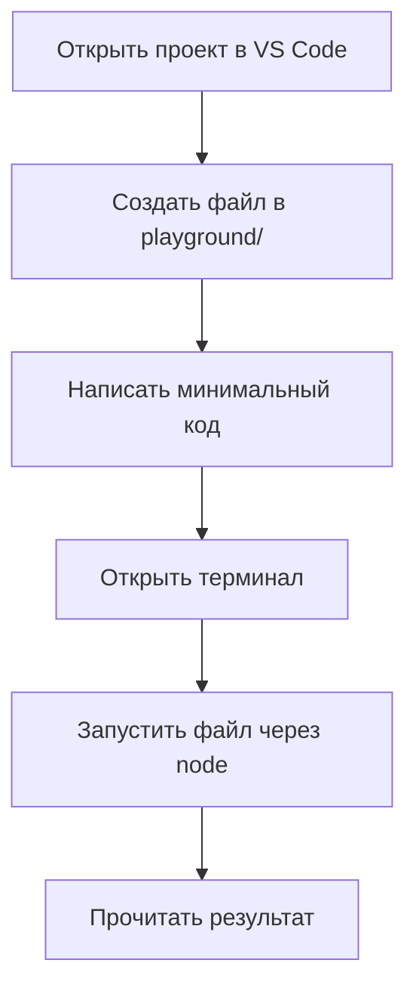

Файл:

```text
playground/hello.js
```

Код:

```javascript
console.log('Hello from Node.js');
```

В этой главе не нужно подробно изучать `console.log`. Достаточно понимать, что эта строка выводит текст в терминал. Подробно выражения, функции и другие элементы JavaScript будут изучаться в следующих главах.

Команда запуска из корня проекта:

```bash
node playground/hello.js
```

Ожидаемый вывод:

```text
Hello from Node.js
```

Если вы уже находитесь внутри `playground/`, команда будет другой:

```bash
node hello.js
```

Разница связана только с текущей папкой.

### Как использовать examples, practice и solutions вместе

В этой главе важно закрепить рабочую последовательность на уровне окружения.

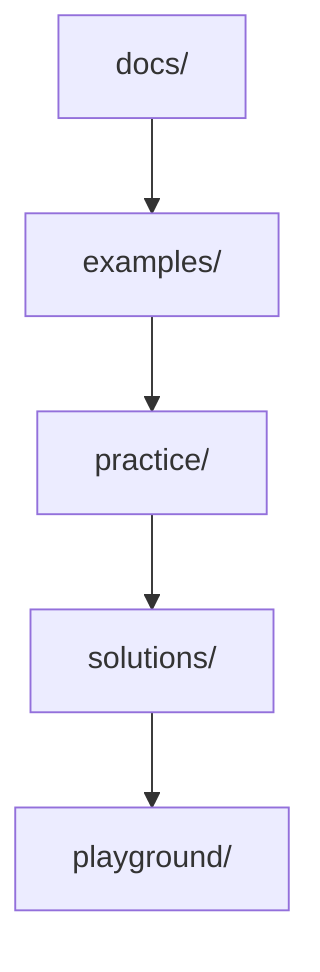

Сначала читается глава в `docs/`.

Затем запускаются примеры из `examples/`, если они есть. Если отдельного файла нет, можно временно повторить встроенный пример в `playground/`.

Затем выполняется практика из `practice/`.

После собственной попытки открываются решения из `solutions/`.

`playground/` используется на любом этапе, когда нужно проверить маленькую гипотезу.

### Как читать ошибки без страха

Ошибка — это сообщение о том, что инструмент не смог выполнить действие.

Сообщение об ошибке нужно читать как технический отчет, а не как оценку ваших действий.

Базовый порядок:

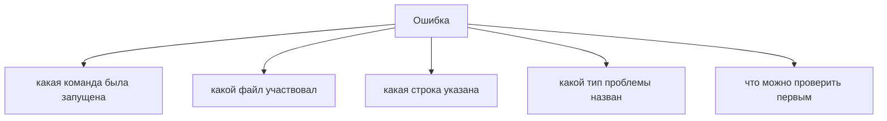

Пример:

```text
Error: Cannot find module '/project/playground/hello.js'
```

Что это означает:

Node.js не нашел файл по указанному пути.

Что проверить:

* существует ли файл;
* правильно ли написано имя;
* в той ли папке запущена команда;
* совпадает ли расширение `.js`;
* нет ли лишних пробелов в имени файла.

Распространённая ошибка:

```text
Сразу искать проблему в JavaScript-коде,
когда на самом деле файл просто запущен из другой папки.
```

### Базовое debugging-мышление

Debugging — это процесс поиска причины ошибки. Подробные инструменты debugging будут изучаться позже; сейчас важно освоить образ мышления.

Базовый подход:

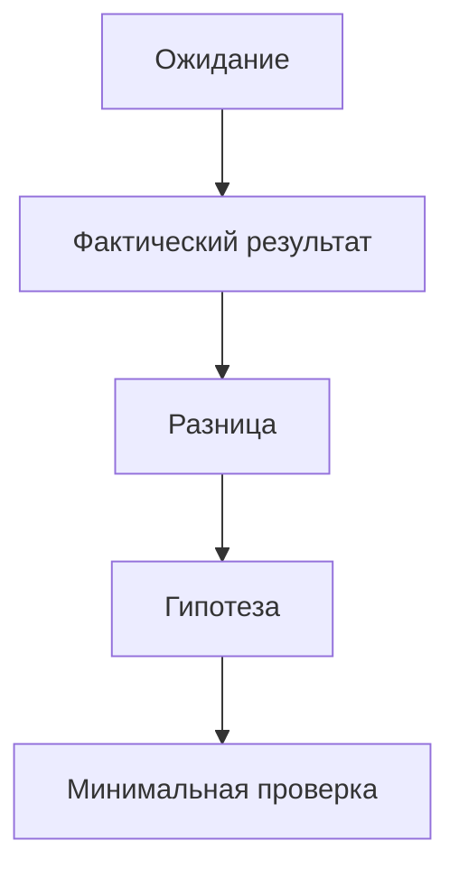

Например:

Ожидание:

```text
Команда node playground/hello.js выведет текст.
```

Фактический результат:

```text
Файл не найден.
```

Гипотеза:

```text
Файл создан не в playground/ или команда запущена из другой папки.
```

Минимальная проверка:

```bash
ls playground
```

Такой подход важен для всего курса. Ошибка разбирается не через панику, а через проверяемую гипотезу.

---

## Внутренний механизм

Внутренний механизм запуска файла можно описать без глубоких деталей.

Когда вы вводите команду:

```bash
node playground/hello.js
```

происходит последовательность:

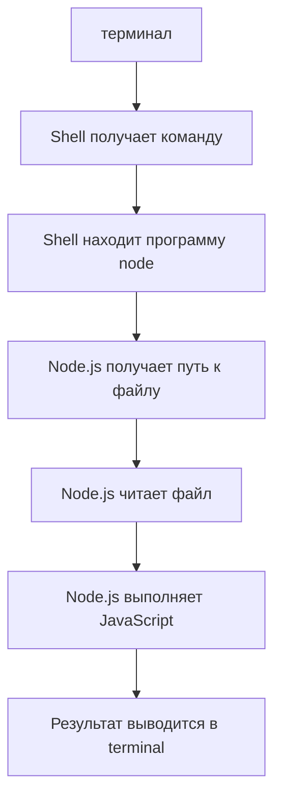

Shell — это программа, которая принимает команды в терминале и запускает другие программы; подробно shell не является темой курса, но базовые команды будут использоваться постоянно.

Если что-то идет не так, ошибка появляется на одном из этапов.

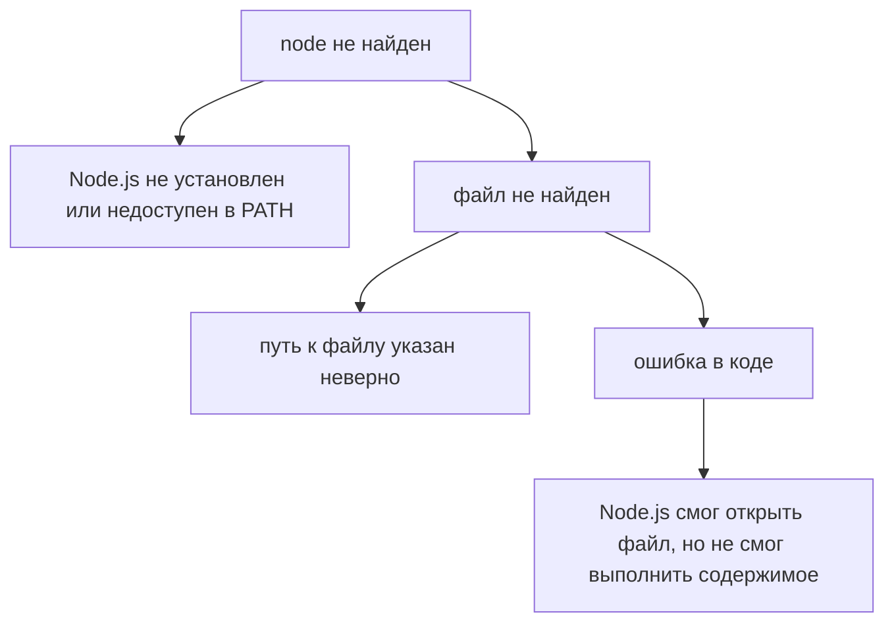

PATH — это список папок, где система ищет программы; подробно настраивать PATH в этом курсе обычно не требуется, но при ошибке "command not found" важно знать, что проблема может быть связана именно с ним.

Эта модель помогает отделять проблемы окружения от проблем кода.

---

## Ментальная модель

Представьте рабочее окружение как лабораторный стол.

На столе есть инструменты, рабочая зона и журнал наблюдений.

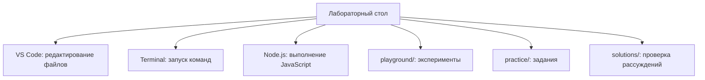

Если инструмент лежит не на месте, эксперимент становится шумным. Если файл создан не в той папке, команда не найдет его. Если результат не записан, ошибку придется разбирать заново.

Рабочее окружение должно помогать задавать один вопрос:

```text
Что именно я сейчас проверяю?
```

Если ответ звучит "я проверяю, запускается ли файл", пример должен быть минимальным. Если ответ звучит "я проверяю ошибку пути", не нужно менять JavaScript-код. Если ответ звучит "я проверяю вывод в терминал", не нужно подключать npm, TypeScript или Playwright.

---

## Примеры кода

В этой главе используется только минимальный код для проверки запуска файла.

### Пример 1. Первый файл

Создайте файл:

```text
playground/hello.js
```

Добавьте одну строку:

```javascript
console.log('Hello from playground');
```

Запустите из корня проекта:

```bash
node playground/hello.js
```

Ожидаемый результат:

```text
Hello from playground
```

Что произошло:

Node.js открыл файл и выполнил строку, которая выводит текст в терминал.

### Пример 2. Запуск из другой папки

Если терминал уже находится в `playground/`, команда меняется:

```bash
node hello.js
```

Ожидаемый результат:

```text
Hello from playground
```

Что произошло:

Файл ищется относительно текущей папки. Если текущая папка уже `playground/`, путь `playground/hello.js` будет означать вложенную папку `playground/playground/hello.js`, которой может не существовать.

### Пример 3. Минимальная ошибка для чтения

Если запустить несуществующий файл:

```bash
node playground/missing.js
```

можно увидеть ошибку вида:

```text
Cannot find module
```

Что произошло:

Node.js не нашел файл. Это не ошибка JavaScript-синтаксиса. Это ошибка пути или имени файла.

Важно:

```text
Сначала определите тип ошибки.
Потом меняйте только то, что связано с этим типом ошибки.
```

---

## Типичные ошибки

### Ошибка 1. Запускать команду не из той папки

Неправильный подход:

```bash
node playground/hello.js
```

из папки, которая уже является `playground/`.

Что произошло:

Команда ищет файл по пути `playground/playground/hello.js`.

Почему это произошло:

Путь к файлу был указан без учета текущей папки.

Исправленный вариант:

```bash
node hello.js
```

или вернуться в корень проекта и запустить:

```bash
node playground/hello.js
```

### Ошибка 2. Создать файл с неправильным расширением

Неправильный файл:

```text
hello.txt
```

Что произошло:

Файл выглядит как текстовый файл, а не как JavaScript-файл.

Почему это произошло:

Расширение файла не соответствует ожидаемому формату для запуска JavaScript-примера.

Исправленный вариант:

```text
hello.js
```

### Ошибка 3. Писать сложный код до проверки окружения

Неправильный подход:

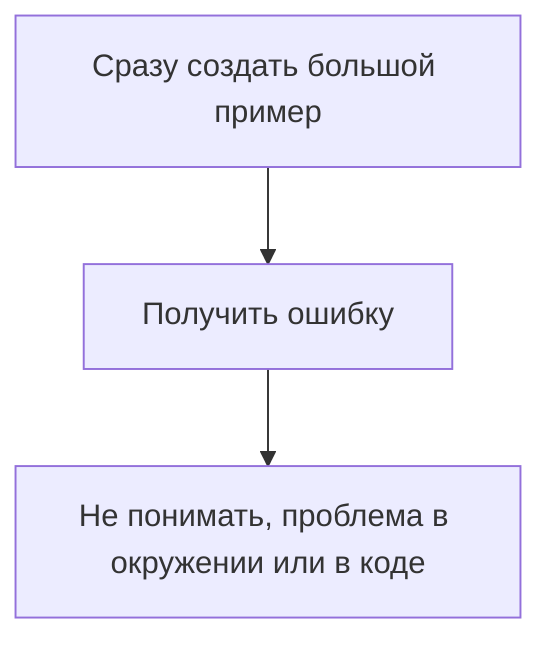

Что произошло:

Слишком много факторов появилось одновременно.

Почему это произошло:

Окружение не было проверено минимальным запуском.

Исправленный подход:

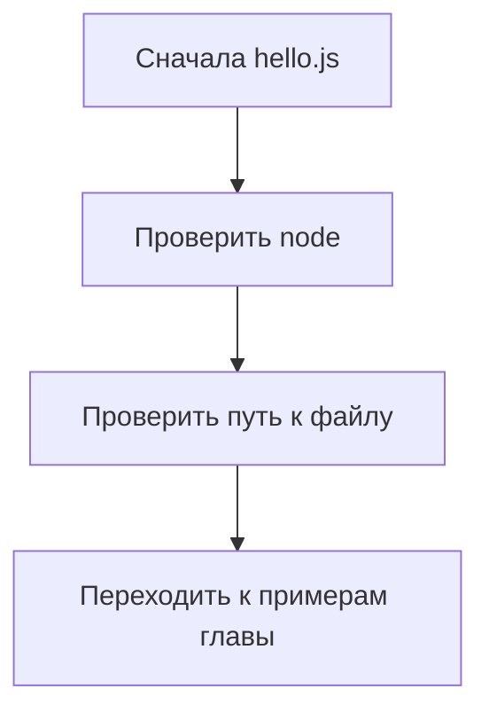

### Ошибка 4. Бояться сообщений об ошибках

Неправильный подход:

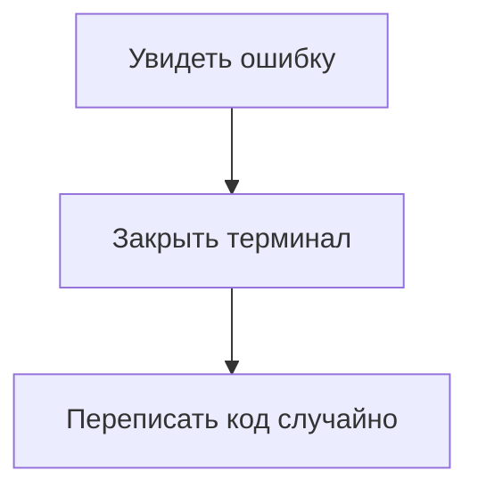

Что произошло:

Ошибка не была прочитана.

Почему это произошло:

Сообщение было воспринято как поломка, а не как источник информации.

Исправленный подход:

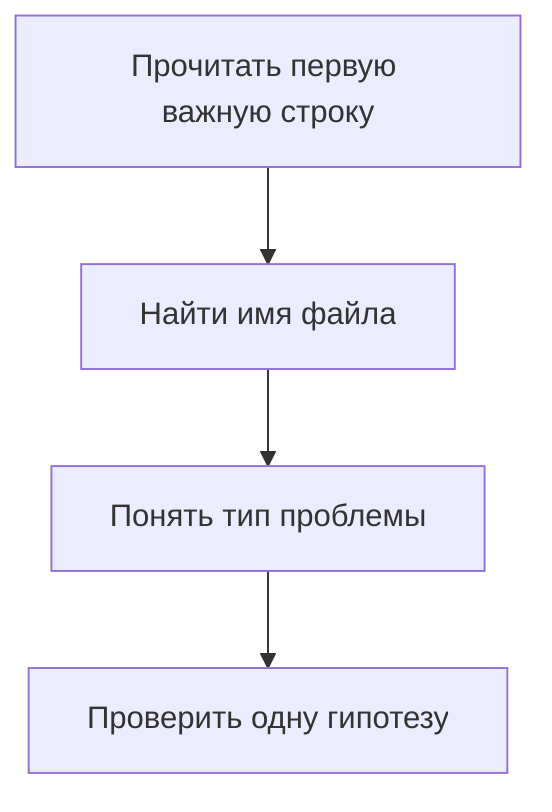

### Ошибка 5. Смешивать practice и solutions

Неправильный подход:

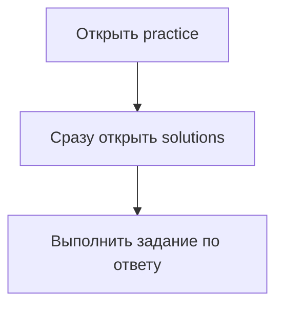

Что произошло:

Практика перестала проверять самостоятельность.

Почему это произошло:

Файлы с разными назначениями использованы одновременно.

Исправленный подход:

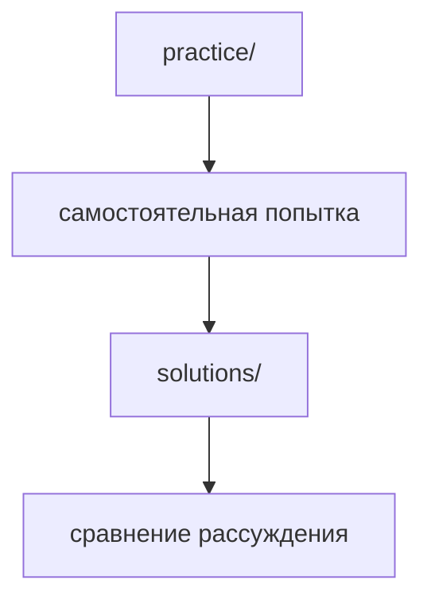

---

## Практическое использование

Перед началом JavaScript-раздела проверьте минимальный набор.

```text
1. Открыт корень проекта в VS Code
2. Терминал открыт внутри VS Code
3. Команда node -v выводит версию
4. Команда npm -v выводит версию
5. Файл playground/hello.js создан
6. Команда node playground/hello.js выводит текст
7. Ошибка missing.js понятна как ошибка пути
```

Команды проверки:

```bash
node -v
```

```bash
npm -v
```

```bash
pwd
```

```bash
ls
```

Порядок работы с новым примером:

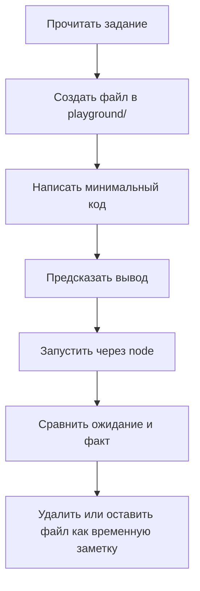

Не нужно сохранять каждый эксперимент. `playground/` может быть временным рабочим пространством.

Полезно знать:

```text
Если команда не работает, сначала проверьте текущую папку.
Это быстрее, чем переписывать код.
```

---

## Использование в Automation QA

Automation QA Engineer постоянно работает с окружением.

Даже простой автотест зависит от:

* версии Node.js;
* установленных npm-пакетов;
* текущей папки запуска;
* переменных окружения;
* конфигурации;
* браузеров и драйверов;
* отчетов и артефактов.

Переменная окружения — это значение, которое передается программе извне, например адрес тестового стенда; подробно environment configuration будет разобрана в Automation QA-разделе.

Поэтому базовые навыки из этой главы напрямую переходят в рабочие задачи.

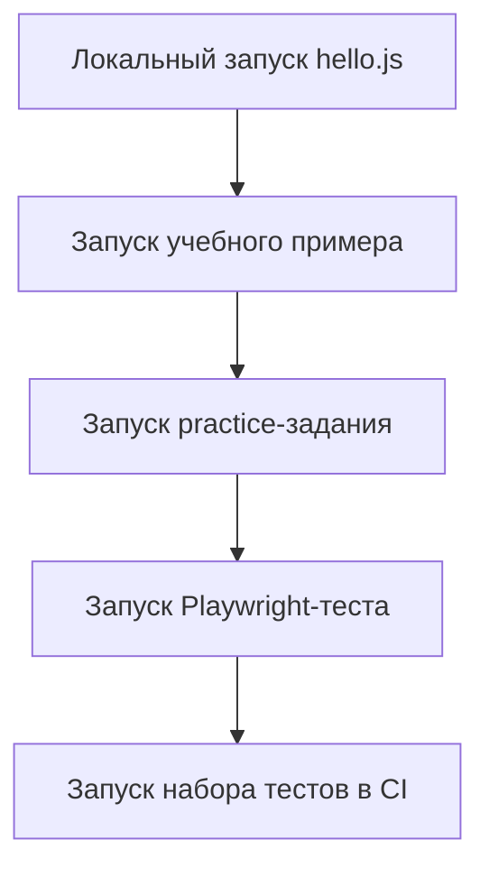

Для QA-инженера особенно важны три привычки.

Первая привычка: фиксировать команду запуска. Если тест упал, нужно знать, какой командой он был запущен.

Вторая привычка: отличать ошибку окружения от ошибки тестовой логики. Если файл не найден, проблема не в assertion. Если пакет не установлен, проблема не в Playwright-сценарии.

Третья привычка: проверять минимальный пример. Перед анализом сложного теста полезно проверить, работает ли простейший запуск.

```mermaid
flowchart TD
    N1["Сложная ошибка"]
    N2["проверить команду"]
    N3["проверить папку"]
    N4["проверить версию Node.js"]
    N5["проверить наличие файла"]
    N6["только потом менять тестовый код"]
    N1 --> N2
    N1 --> N3
    N1 --> N4
    N1 --> N5
    N1 --> N6
```

Такой подход экономит время и снижает количество случайных изменений.

---

## Учебный стенд

Теорию и задачи книги можно проходить прямо в браузере — ничего устанавливать не нужно.

Но раздел Automation QA учит писать настоящие автотесты, а настоящему тесту нужен объект тестирования. Поэтому в книге есть учебный стенд: небольшое приложение с веб-интерфейсом, REST API, gRPC и базой данных. Он поднимается локально одной командой.

Для стенда понадобится Docker. Установка описана на сайте Docker; на Windows и macOS обычно устанавливают Docker Desktop.

Запуск стенда:

```bash
npm run sut:up
```

Команда соберёт образ, поднимет PostgreSQL, применит миграции, загрузит учебные данные и запустит приложение. После этого доступны:

* веб-интерфейс — `http://127.0.0.1:4310`;
* REST API — `http://127.0.0.1:4310/api/v1`;
* gRPC — `127.0.0.1:4311`;
* PostgreSQL — `127.0.0.1:55432`.

Войти в интерфейс можно учебной учётной записью `educational_tester` с паролем `educational-tester-password`.

Проверить, что всё работает:

```bash
npm run sut:smoke
```

Остановить стенд:

```bash
npm run sut:down
```

Данные стенда одноразовые и предназначены только для обучения. Пароли лежат в открытом виде намеренно: они защищают локальные учебные данные и нигде больше не используются.

Все примеры раздела Automation QA работают против этого стенда. Запустить их целиком:

```bash
npm run qa:examples
```

Если стенд не поднят, команда скажет об этом одной понятной строкой вместо десятков ошибок соединения.

---

## Частые вопросы

### Нужно ли уже сейчас изучать Node.js глубоко?

Нет.

В этой главе Node.js нужен как инструмент запуска JavaScript-файлов. Внутреннее устройство Node.js, runtime и модули будут изучаться позже.

### Нужно ли уже сейчас изучать npm?

Нет.

Сейчас достаточно проверить команду `npm -v` и понимать, что npm работает с пакетами. `package.json`, npm scripts и зависимости будут разобраны позже.

### Можно ли использовать другой редактор вместо VS Code?

Можно, если он позволяет удобно читать Markdown, редактировать JavaScript-файлы и работать с терминалом.

В курсе используется VS Code, потому что он распространен, удобен для JavaScript и TypeScript и хорошо подходит для Automation QA.

### Нужно ли устанавливать Playwright сейчас?

Нет.

Playwright будет изучаться позже в Automation QA-разделе. Сейчас важно подготовить базовый запуск JavaScript через Node.js.

### Что делать, если команда `node -v` не работает?

Нужно проверить, установлен ли Node.js и доступна ли команда `node` в терминале.

Если терминал был открыт до установки Node.js, его стоит закрыть и открыть заново. Иногда система обновляет доступные команды только после перезапуска терминала.

### Нужно ли удалять файлы из playground?

Не обязательно.

Но `playground/` должен оставаться местом для экспериментов. Если файлов становится слишком много, лучше оставить только те, которые помогают повторить тему.

---

## Итоги

Рабочее окружение нужно подготовить до начала JavaScript-раздела.

Node.js позволяет запускать JavaScript-файлы вне браузера. npm используется для работы с пакетами, но в этой главе он нужен только на базовом уровне. VS Code используется как редактор, который объединяет файлы проекта, терминал, подсветку и расширения.

Главный практический результат главы: вы должны уметь создать файл `playground/hello.js`, запустить его командой `node playground/hello.js`, увидеть вывод в терминале и спокойно разобрать простую ошибку пути.

Для Automation QA это базовый навык. Позже те же принципы будут использоваться при запуске Playwright-тестов, API-проверок, TypeScript-кода, npm scripts и CI.

Следующая глава начнет JavaScript-раздел и объяснит, что такое JavaScript, где он выполняется и почему один язык может работать в браузере и в Node.js.

---

## Что нужно запомнить

✓ Рабочее окружение снижает шум при изучении кода.

✓ Node.js нужен для запуска JavaScript-файлов вне браузера.

✓ npm используется для работы с пакетами JavaScript.

✓ VS Code удобен для курса из-за редактора, терминала и расширений.

✓ Терминал выполняет команды относительно текущей папки.

✓ `playground/` предназначен для маленьких экспериментов.

✓ Ошибка является источником информации, а не поводом переписывать все подряд.

✓ Сначала нужно проверять команду, путь и файл, потом код.

✓ Automation QA Engineer должен уметь отличать ошибку окружения от ошибки теста.

---

## Проверьте себя

1. Зачем нужен Node.js в этом курсе?

2. Что показывает команда `node -v`?

3. Зачем нужен npm на базовом уровне?

4. Почему важно понимать текущую папку в терминале?

5. Для чего используется `playground/`?

6. Когда нужно открывать `solutions/`?

7. Что означает ошибка `Cannot find module` при запуске файла?

8. Почему не стоит начинать с большого кода до проверки окружения?

9. Какие привычки из этой главы важны для Automation QA?

---

## Практика

Практика к этой главе находится в файле:

```text
practice/00-introduction/04-development-environment.md
```

Выполните ее после того, как проверите команды `node -v`, `npm -v` и запустите минимальный файл из `playground/`.

---

## Решения

Решения находятся в файле:

```text
solutions/00-introduction/04-development-environment.md
```

Открывайте решения только после самостоятельной попытки. В этой главе особенно важно сравнивать не только ответ, но и ход диагностики.
