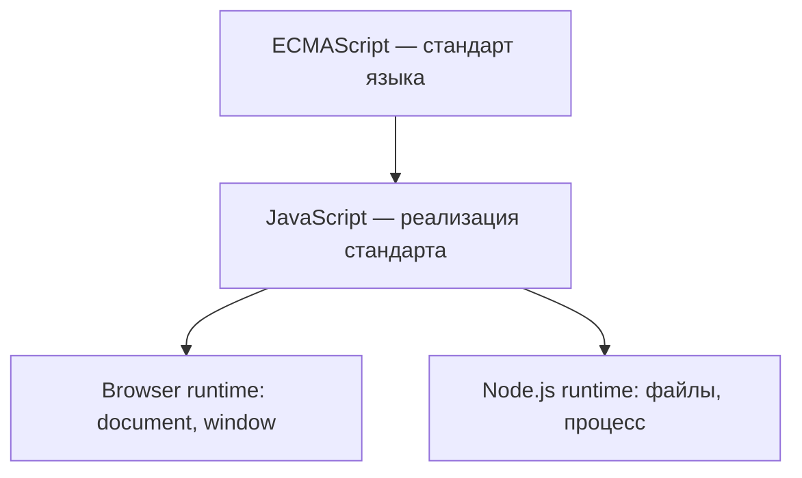
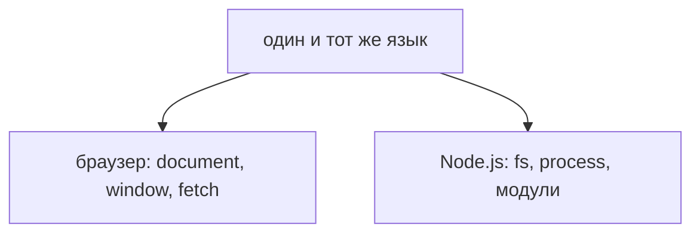
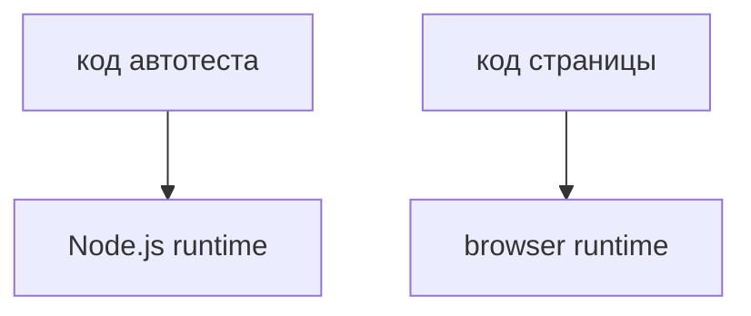
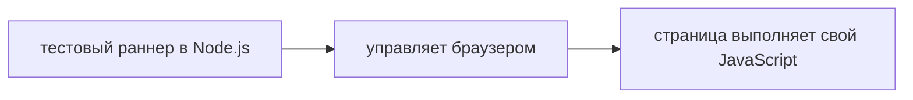

# Что такое JavaScript

## Связь с предыдущей главой

В предыдущей главе было подготовлено рабочее окружение: Node.js, терминал, VS Code, `playground/`, практика и решения.

Теперь начинается основной JavaScript-раздел. Эта глава объясняет, что именно будет выполняться в подготовленном окружении: что такое JavaScript, где он запускается, чем язык отличается от runtime, какую роль играет ECMAScript и почему Automation QA Engineer должен различать код, который выполняется в Node.js, и код, который выполняется в браузере.

---

## Предварительные требования

Для этой главы нужно:

* уметь открыть проект в VS Code;
* уметь запустить `.js` файл командой `node`;
* понимать назначение `examples/`, `practice/`, `solutions/` и `playground/`;
* понимать, что TypeScript будет изучаться позже как слой поверх JavaScript.

Глубокое знание JavaScript не требуется.

---

## Время изучения

Ориентировочное время:

```text
Чтение главы:             60-80 минут
Разбор схем:              20-30 минут
Запуск примеров:          20-30 минут
Практика:                 60-90 минут
Повторение материала:     20 минут
```

Уровень сложности: **L1**.

L1 означает первый технический уровень курса. Здесь уже вводятся ключевые понятия JavaScript-платформы, но без глубокого изучения синтаксиса языка.

---

## Навигация

Предыдущая глава:

```text
docs/00-introduction/04-development-environment.md
```

Следующая глава:

```text
docs/01-javascript/02-how-javascript-works.md
```

---

## Цели обучения

После изучения этой главы вы будете понимать:

* что такое JavaScript;
* почему JavaScript был создан;
* почему JavaScript стал широко использоваться;
* что такое ECMAScript;
* чем ECMAScript отличается от JavaScript;
* что такое JavaScript Engine;
* какие существуют движки: V8, SpiderMonkey, JavaScriptCore;
* что означает Runtime;
* чем browser runtime отличается от Node.js runtime;
* почему JavaScript может выполняться и в браузере, и в Node.js;
* какие API доступны в браузере, но недоступны в Node.js;
* какие API доступны в Node.js, но недоступны в браузере;
* почему Playwright-тесты запускаются в Node.js, но управляют браузером;
* почему код внутри `page.evaluate` выполняется в browser context;
* почему Automation QA Engineer должен различать Node.js context и browser context;
* как TypeScript связан с JavaScript на высоком уровне.

---

## Мотивация

JavaScript часто воспринимают как один цельный инструмент.

Инженер пишет файл, запускает команду `node`, открывает браузер, использует Playwright, видит TypeScript-типы и постепенно начинает думать, что все это одно и то же окружение.

Проблема появляется, когда один и тот же код ведет себя по-разному.

Например:

* `document` доступен на странице браузера, но недоступен в обычном Node.js-файле;
* `process` доступен в Node.js, но недоступен внутри страницы браузера;
* Playwright-тест запускается в Node.js, но действия происходят в браузере;
* код внутри `page.evaluate` выполняется не там, где выполняется сам тест;
* TypeScript проверяет код до запуска, но в runtime выполняется JavaScript.

Если не различать язык, engine и runtime, такие ситуации выглядят непредсказуемыми.

Цель этой главы — разделить понятия.

Для Automation QA это базовая модель. Без нее трудно объяснить, почему тестовый код видит одни возможности, а код внутри браузерной страницы — другие.

---

## Теория

### Что такое JavaScript

JavaScript — это язык программирования.

Язык программирования задает правила, по которым можно описывать действия для компьютера: какие конструкции существуют, как записываются выражения, как создаются значения, как вызывается код и как программа должна вести себя.

В этой главе не изучаются переменные, функции, объекты, область видимости, hoisting, promises или event loop. Эти темы будут подробно разобраны в следующих главах. Сейчас важно понять, где находится JavaScript в общей системе.

JavaScript можно представить как набор правил:

Syntax — это правила записи кода; подробно синтаксис будет вводиться постепенно.

Value — это значение, с которым работает программа; типы значений будут изучаться в разделе про переменные и типы.

Function — это блок кода, который можно вызвать; функции будут изучаться отдельно.

Object — это составное значение с набором свойств; объекты будут изучаться в отдельном разделе.

Сейчас эти термины нужны только как ориентиры. Глубоко разбирать их еще рано.

### Почему JavaScript был создан

JavaScript был создан для браузера.

Изначальная проблема была практической: веб-страницы были в основном статичными. HTML позволял описывать структуру страницы, CSS — внешний вид, но не хватало языка, который мог бы реагировать на действия пользователя прямо в браузере.

Нужно было:

* проверять формы до отправки на сервер;
* реагировать на клики;
* менять содержимое страницы;
* делать интерфейс более интерактивным;
* выполнять простую логику рядом с пользователем.

JavaScript появился как язык для поведения веб-страниц.

Позже JavaScript вышел за пределы браузера. Появился Node.js, и язык начал использоваться для серверных приложений, инструментов разработки, CLI-утилит, сборки проектов, тестирования и Automation QA.

CLI-утилита — это программа, которая запускается из терминала; подробнее такие инструменты будут встречаться в практических разделах.

### Почему JavaScript стал широко использоваться

JavaScript стал широко использоваться по нескольким причинам.

Первая причина: браузер стал универсальной платформой. Если язык встроен в браузеры, он автоматически оказывается доступным на огромном количестве устройств.

Вторая причина: JavaScript решал реальную задачу интерактивности. Он позволял странице реагировать на пользователя без полной перезагрузки.

Третья причина: развитие engines сделало выполнение JavaScript быстрее. Engine — это программа, которая читает и выполняет JavaScript-код; подробнее engine разбирается ниже.

Четвертая причина: Node.js позволил использовать JavaScript вне браузера. Это сделало язык полезным не только для страниц, но и для инструментов, серверов, тестов и автоматизации.

Пятая причина: вокруг JavaScript появилась большая экосистема пакетов и инструментов. Экосистема — это набор библиотек, фреймворков и утилит вокруг языка; подробно работа с пакетами будет изучаться позже.

Для Automation QA это означает, что JavaScript стал не только языком веб-страниц, но и языком тестовой инфраструктуры.

### Что такое ECMAScript

ECMAScript — это стандарт языка.

Стандарт описывает, как должен работать сам язык: какие конструкции есть, как они ведут себя, какие встроенные возможности должны быть доступны.

JavaScript — это практическая реализация языка, которая следует ECMAScript-стандарту и работает в конкретных окружениях.



Важно различать:

* ECMAScript определяет ядро языка;
* JavaScript используется как реальный язык в браузерах, Node.js и инструментах;
* browser runtime добавляет браузерные API;
* Node.js runtime добавляет Node.js API.

API — это набор возможностей, которые среда предоставляет коду; подробнее API будут встречаться в главах про browser runtime, Node.js и Automation QA.

### ECMAScript и JavaScript

Разница между ECMAScript и JavaScript часто выглядит теоретической, но она важна.

ECMAScript не описывает, как работать с HTML-страницей. Он не определяет `document`, `window`, кнопки, вкладки браузера или файловую систему.

ECMAScript описывает язык.

Браузер добавляет возможности для работы со страницей.

Node.js добавляет возможности для работы с системой, файлами и процессом.

Поэтому один и тот же язык может иметь разные доступные возможности в разных runtimes.

### Что такое JavaScript Engine

JavaScript Engine — это программа, которая выполняет JavaScript-код.

Engine читает код, разбирает его, подготавливает к выполнению и выполняет. Подробно parsing, AST, compilation и execution будут изучаться в следующей главе. Сейчас достаточно понимать: engine отвечает за выполнение самого языка.


Примеры engines:

* V8 — используется в Chrome и Node.js;
* SpiderMonkey — используется в Firefox;
* JavaScriptCore — используется в Safari.

Эти engines должны следовать ECMAScript-стандарту, чтобы один и тот же JavaScript-код вел себя предсказуемо в разных реализациях.

Важно:

```text
Engine выполняет язык.
Runtime добавляет окружение вокруг engine.
```

### Что такое Runtime

Runtime — это среда, в которой выполняется программа.

Runtime включает engine и дополнительные API, которые доступны коду.

Environment object — это объект, который окружение предоставляет коду, например `window` в браузере или `process` в Node.js; подробно объекты будут изучаться позже.

JavaScript Engine отвечает за выполнение языка. Runtime отвечает за то, какие внешние возможности есть у программы.

Например, ECMAScript не говорит, как открыть файл на диске. Node.js runtime добавляет такие возможности.

ECMAScript не говорит, как найти кнопку на HTML-странице. Browser runtime добавляет такие возможности.

### Browser Runtime

Browser runtime — это среда выполнения JavaScript внутри браузера.

Он включает JavaScript engine и browser APIs.

DOM API — это возможности для работы со структурой HTML-страницы; подробно DOM будет встречаться в Automation QA и browser-темах.

Browser runtime дает доступ к таким вещам, как:

* `window`;
* `document`;
* DOM;
* события кликов;
* элементы страницы;
* часть Web APIs.

Но browser runtime не дает обычной веб-странице прямой доступ к файловой системе компьютера или процессу Node.js.

Это ограничение важно для безопасности.

### Node.js Runtime

Node.js runtime — это среда выполнения JavaScript вне браузера.

Он включает V8 engine и Node.js APIs.

`fs` — это Node.js API для работы с файлами; подробно работа с ним будет изучаться позже, когда появится практическая необходимость.

`process` — это Node.js API с информацией о текущем процессе; подробно он будет использоваться в темах конфигурации и окружений.

Modules — это система разделения кода по файлам; подробно modules будут изучаться в отдельном разделе JavaScript.

Node.js runtime дает доступ к:

* файловой системе;
* путям файлов;
* переменным окружения;
* аргументам запуска;
* npm-пакетам;
* инструментам разработки и тестирования.

Но Node.js runtime не имеет `document` и не управляет HTML-страницей напрямую.

### Почему JavaScript работает и в браузере, и в Node.js

JavaScript может работать в разных местах, потому что язык отделен от runtime.

ECMAScript описывает ядро языка. Engine выполняет это ядро. Runtime добавляет конкретное окружение.

Один и тот же базовый язык может выполняться в разных средах, если там есть engine.

Но доступные API будут отличаться.

### Browser APIs и Node.js APIs

Browser-only API — это возможность, которая существует в браузерном окружении, но не существует в обычном Node.js-файле.

Примеры:

* `window`;
* `document`;
* работа с DOM;
* события страницы;
* browser storage.

Node-only API — это возможность, которая существует в Node.js, но не существует внутри обычной страницы браузера.

Примеры:

* `process`;
* `fs`;
* `path`;
* доступ к аргументам запуска;
* работа с локальными файлами через Node.js.



Когда код падает с сообщением, что `document` не определен, часто причина не в синтаксисе JavaScript. Причина в том, что код выполняется в Node.js, где нет browser API.

### TypeScript на высоком уровне

TypeScript — это язык, который добавляет к JavaScript систему типов.

Типы помогают описывать ожидания к данным и функциям до запуска программы. Но TypeScript не заменяет JavaScript. После компиляции выполняется JavaScript.

Compilation — это преобразование исходного кода в другой вид кода; подробно TypeScript compilation будет изучаться в части TypeScript.

Поэтому JavaScript fundamentals нужны до TypeScript. Чтобы понимать, что TypeScript проверяет, нужно понимать, как JavaScript выполняется.

---

## Внутренний механизм

Внутренний механизм этой главы — разделение ответственности.

Один JavaScript-файл не выполняется сам по себе. Его выполняет engine внутри runtime.

Если доступен `document`, значит код находится в окружении, где есть browser API.

Если доступен `process`, значит код находится в Node.js runtime.

Если доступен базовый синтаксис JavaScript, это еще не означает, что доступны все API.

Пример разделения: `const total = 2 + 2;` — это язык, он работает везде; `document.title` — это браузерный API, его в Node.js нет.

`console.log` здесь используется только как способ вывести текст; подробно средства вывода и выражения будут встречаться в следующих главах.

Когда вы видите ошибку, нужно задавать вопрос:

Такой вопрос помогает быстрее отличать синтаксическую ошибку от ошибки окружения.

---

## Ментальная модель

Представьте JavaScript как текст инструкции, engine как исполнителя инструкции, а runtime как помещение, в котором исполнитель работает.

Один и тот же исполнитель может читать похожую инструкцию в разных помещениях, но доступные инструменты будут разными.

Если вы просите исполнителя "найди кнопку на странице", это возможно в помещении браузера.

Если вы просите "прочитай файл с диска", это возможно в помещении Node.js.

Ошибка возникает не потому, что JavaScript "плохой" или "странный". Часто ошибка возникает потому, что код попросил runtime дать API, которого там нет.

---

## Примеры кода

Примеры к этой главе находятся в папке:

```text
examples/01-javascript/chapter-01/
```

Запускайте их из корня проекта.

### Пример 1. Node.js runtime

Файл:

```text
examples/01-javascript/chapter-01/01-node-runtime.js
```

Запуск:

```bash
node examples/01-javascript/chapter-01/01-node-runtime.js
```

Этот пример показывает, что файл выполняется в Node.js и может вывести версию Node.js.

### Пример 2. Проверка runtime

Файл:

```text
examples/01-javascript/chapter-01/02-runtime-check.js
```

Запуск:

```bash
node examples/01-javascript/chapter-01/02-runtime-check.js
```

Пример проверяет наличие признаков Node.js и browser runtime через безопасные проверки `typeof`.

`typeof` позволяет узнать тип значения или проверить, существует ли имя; подробно типы будут изучаться позже.

### Пример 3. Browser-only API

Файл:

```text
examples/01-javascript/chapter-01/03-browser-only-api.js
```

Запуск:

```bash
node examples/01-javascript/chapter-01/03-browser-only-api.js
```

Пример не обращается к `document` напрямую. Он безопасно проверяет, доступен ли `document` в Node.js. В обычном Node.js-файле результат покажет, что browser API недоступен.

### Пример 4. Node-only API

Файл:

```text
examples/01-javascript/chapter-01/04-node-only-api.js
```

Запуск:

```bash
node examples/01-javascript/chapter-01/04-node-only-api.js
```

Пример показывает Node.js API `process`. В браузерной странице такой API обычно недоступен.

---

## Распространённые мифы

**Миф: JavaScript и Java — родственные языки.**
Сходство только в названии. Это разные языки с разной моделью выполнения и разной историей.

**Миф: JavaScript работает только в браузере.**
Он выполняется везде, где есть движок и среда выполнения: в Node.js, в инструментах сборки, в тестовых раннерах.

**Миф: ECMAScript и JavaScript — одно и то же.**
ECMAScript описывает язык, JavaScript — его практическое применение вместе с возможностями конкретной среды.

**Миф: `document` и `window` — часть языка.**
Это браузерные API. В Node.js их нет, и обращение к ним даёт ошибку.

**Миф: TypeScript заменяет JavaScript.**
Он добавляет проверку типов до запуска. Выполняется всё равно JavaScript, поэтому знание языка остаётся необходимым.

## Распространённые ошибки

### Ошибка 1. Считать JavaScript и browser API одним и тем же

Неправильное ожидание:

```text
Если это JavaScript, значит document должен быть доступен всегда.
```

Что произошло:

Смешаны язык JavaScript и API browser runtime.

Почему это произошло:

`document` часто встречается в браузерном JavaScript, но не является частью ECMAScript core.

Исправленная модель:

```text
JavaScript может выполняться в разных runtimes.
document доступен в browser runtime, но не в обычном Node.js runtime.
```

### Ошибка 2. Считать Node.js отдельным языком

Неправильная формулировка:

```text
Node.js — это другой язык.
```

Что произошло:

Node.js перепутан с языком.

Почему это произошло:

В Node.js доступны особые API, которых нет в браузере, поэтому окружение кажется отдельным языком.

Исправленная формулировка:

```text
Node.js — это runtime для выполнения JavaScript вне браузера.
```

### Ошибка 3. Не различать Playwright test context и browser context

Неправильное ожидание:

```text
В Playwright-тесте и внутри page.evaluate доступно одно и то же окружение.
```

Что произошло:

Смешаны Node.js context теста и browser context страницы.

Почему это произошло:

Оба фрагмента пишутся на JavaScript или TypeScript, но выполняются в разных runtimes.

Исправленная модель: TypeScript добавляет проверку типов до запуска, а выполняется всё равно JavaScript — поэтому знание самого языка остаётся необходимым.

### Ошибка 4. Думать, что TypeScript заменяет JavaScript

Неправильное ожидание:

```text
Если проект на TypeScript, JavaScript можно не понимать.
```

Что произошло:

TypeScript воспринят как замена runtime-модели JavaScript.

Почему это произошло:

Типы видны в исходном коде, но после компиляции выполняется JavaScript.

Исправленная модель:

```text
TypeScript помогает до запуска.
Runtime выполняет JavaScript.
```

---

## Практическое использование

После этой главы при запуске любого JavaScript-кода задавайте три вопроса:

```text
1. Где выполняется код?
2. Какой engine его выполняет?
3. Какие runtime API доступны?
```

Для локальных файлов курса ответ обычно такой:

```text
Где выполняется: Node.js
Engine: V8
Доступные API: Node.js APIs
Недоступные API: document, window, DOM
```

Для кода внутри браузерной страницы:

```text
Где выполняется: browser runtime
Engine: зависит от браузера
Доступные API: window, document, DOM
Недоступные API: обычный Node.js process и fs
```

Для TypeScript-кода:

```text
Сначала: TypeScript проверяет типы
Потом: выполняется JavaScript
```

Это простое различение будет использоваться в следующих главах. Когда появятся Execution Context, Scope, modules, async и Playwright, вопрос "где выполняется этот код?" станет одним из главных инструментов анализа.

Execution Context — это внутренняя среда выполнения конкретного участка кода; подробно он будет изучаться в отдельной главе.

Scope — это область, в которой доступны имена; подробно Scope будет изучаться позже.

Async — это работа с действиями, которые завершаются не сразу; подробно async JavaScript будет разобран в отдельном разделе.

---

## Использование в Automation QA

Automation QA часто соединяет Node.js и браузер.

Playwright-тесты обычно запускаются в Node.js. Они используют Playwright API, чтобы открыть браузер, перейти на страницу, кликнуть по элементу или проверить текст.

Но сама страница живет в browser runtime.



Когда вы пишете обычный код теста, он выполняется в Node.js context.

Когда вы передаете код в `page.evaluate`, этот код выполняется в browser context.

`page.evaluate` — это Playwright-метод для выполнения функции внутри страницы браузера; подробно он будет изучаться в разделе Playwright.



Почему это важно:

* в тестовом файле можно читать переменные окружения Node.js;
* внутри страницы можно читать DOM;
* `document` не доступен напрямую в Node.js-тесте;
* `process` не доступен внутри обычного browser context;
* ошибка может быть связана не с Playwright, а с неправильным контекстом выполнения.

Типичная QA-ситуация:

Это различение будет постоянно использоваться в Playwright, API testing, fixtures, helpers и framework architecture.

---

## Частые вопросы

### JavaScript и ECMAScript — это одно и то же?

Не совсем.

ECMAScript — это стандарт языка. JavaScript — практический язык, который следует этому стандарту и работает в конкретных runtimes.

### Почему в Node.js нет document?

`document` относится к browser API для работы со страницей. Node.js не является браузером и не имеет HTML-страницы, поэтому обычный Node.js-файл не получает `document`.

### Почему в браузере нет process?

`process` относится к Node.js API. Обычная браузерная страница не должна иметь прямой доступ к процессу Node.js и системному окружению.

### Если Chrome и Node.js используют V8, почему API разные?

Потому что V8 — это engine, а API добавляет runtime. Chrome и Node.js могут использовать один engine, но предоставлять разные окружения.

### Нужно ли уже сейчас знать все browser APIs и Node.js APIs?

Нет.

Сейчас важно понять, что набор API зависит от runtime. Конкретные API будут изучаться тогда, когда понадобятся в JavaScript и Automation QA-разделах.

### Почему TypeScript не заменяет JavaScript?

TypeScript добавляет типы и проверку до запуска, но после компиляции выполняется JavaScript. Поэтому JavaScript-механизмы остаются обязательной основой.

---

## Итоги

JavaScript — это язык программирования, который появился для интерактивности веб-страниц, а затем стал использоваться шире благодаря браузерам, развитию engines, Node.js и большой экосистеме.

ECMAScript — это стандарт ядра языка. JavaScript — практическая реализация языка в engines и runtimes. Engine выполняет JavaScript-код. Runtime включает engine и добавляет API окружения.

Browser runtime предоставляет `window`, `document`, DOM и browser APIs. Node.js runtime предоставляет `process`, файловые возможности, модули и API для работы вне браузера. Один и тот же JavaScript-язык может работать в обоих местах, но доступные API отличаются.

Для Automation QA особенно важно различать Node.js context и browser context. Playwright-тест запускается в Node.js, управляет браузером, а код внутри `page.evaluate` выполняется уже в browser context.

Следующая глава объяснит, как JavaScript выполняется внутри: что происходит с кодом перед запуском, что такое parsing, AST, compilation и execution. Эти термины будут введены постепенно и с внутренней моделью.

---

## Что нужно запомнить

✓ JavaScript — это язык программирования.

✓ ECMAScript — это стандарт ядра JavaScript.

✓ Engine выполняет JavaScript-код.

✓ Runtime включает engine и дополнительные API.

✓ Browser runtime предоставляет `window`, `document` и DOM.

✓ Node.js runtime предоставляет `process`, `fs`, `path` и другие Node.js APIs.

✓ Один engine может использоваться в разных runtimes.

✓ Playwright-тесты запускаются в Node.js, но управляют браузером.

✓ Код внутри `page.evaluate` выполняется в browser context.

✓ TypeScript не заменяет JavaScript: после компиляции выполняется JavaScript.

---

## Проверьте себя

1. Что такое JavaScript?

2. Зачем существует ECMAScript?

3. Чем ECMAScript отличается от JavaScript?

4. Что делает JavaScript Engine?

5. Чем engine отличается от runtime?

6. Какие API характерны для browser runtime?

7. Какие API характерны для Node.js runtime?

8. Почему `document` недоступен в обычном Node.js-файле?

9. Где выполняется код Playwright-теста?

10. Где выполняется код внутри `page.evaluate`?

---

## Практика

Практика к этой главе находится в файле:

```text
practice/01-javascript/01-what-is-javascript.md
```

Перед выполнением практики запустите все примеры из раздела «Примеры кода» и сравните результат с объяснениями в главе.

---

## Решения

Решения находятся в файле:

```text
solutions/01-javascript/01-what-is-javascript.md
```

Открывайте решения после самостоятельной попытки. В этой главе особенно важно объяснять не только ответ, но и runtime, в котором выполняется код.
