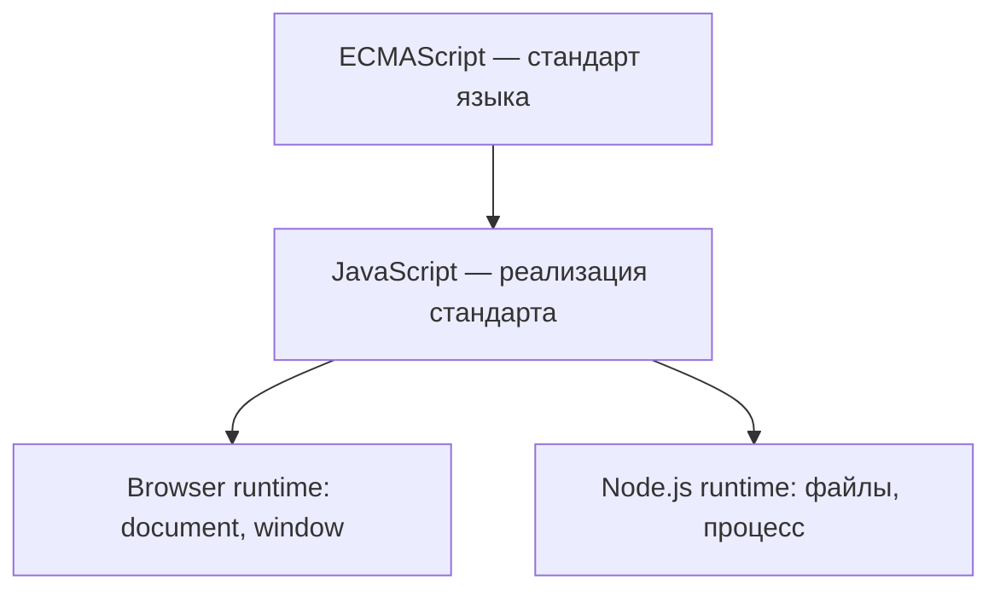
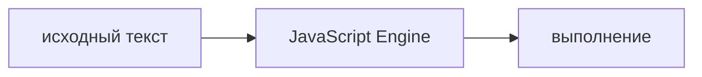
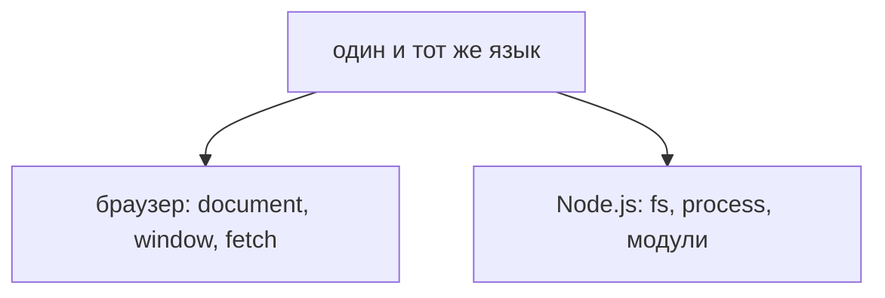
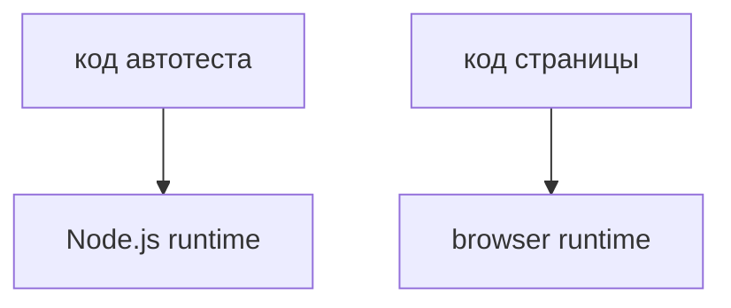
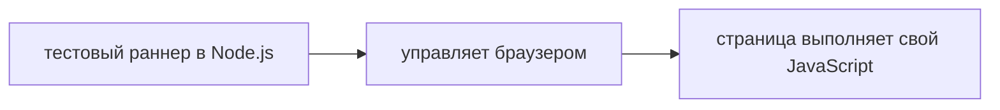

# Что такое JavaScript

## Связь с предыдущей главой

В предыдущей главе было подготовлено рабочее окружение: Node.js, терминал, VS Code, `playground/`, практика и решения.

Теперь начинается основной JavaScript-раздел. Эта глава объясняет, что именно будет выполняться в подготовленном окружении: что такое JavaScript, где он запускается, чем язык отличается от runtime, какую роль играет ECMAScript и почему Automation QA Engineer должен различать код, который выполняется в Node.js, и код, который выполняется в браузере.

---

## Предварительные требования

Для этой главы нужно:

* уметь открыть проект в VS Code;
* уметь запустить `.js` файл командой `node`;
* понимать назначение `examples/`, `practice/`, `solutions/` и `playground/`;
* понимать, что TypeScript будет изучаться позже как слой поверх JavaScript.

Глубокое знание JavaScript не требуется.

---

## Время изучения

Ориентировочное время:

```text
Чтение главы:             60-80 минут
Разбор схем:              20-30 минут
Запуск примеров:          20-30 минут
Практика:                 60-90 минут
Повторение материала:     20 минут
```

Уровень сложности: **L1**.

L1 означает первый технический уровень курса. Здесь уже вводятся ключевые понятия JavaScript-платформы, но без глубокого изучения синтаксиса языка.

---

## Навигация

Предыдущая глава:

```text
docs/00-introduction/04-development-environment.md
```

Следующая глава:

```text
docs/01-javascript/02-how-javascript-works.md
```

---

## Цели обучения

После изучения этой главы вы будете понимать:

* что такое JavaScript;
* почему JavaScript был создан;
* почему JavaScript стал широко использоваться;
* что такое ECMAScript;
* чем ECMAScript отличается от JavaScript;
* что такое JavaScript Engine;
* какие существуют движки: V8, SpiderMonkey, JavaScriptCore;
* что означает Runtime;
* чем browser runtime отличается от Node.js runtime;
* почему JavaScript может выполняться и в браузере, и в Node.js;
* какие API доступны в браузере, но недоступны в Node.js;
* какие API доступны в Node.js, но недоступны в браузере;
* почему Playwright-тесты запускаются в Node.js, но управляют браузером;
* почему код внутри `page.evaluate` выполняется в browser context;
* почему Automation QA Engineer должен различать Node.js context и browser context;
* как TypeScript связан с JavaScript на высоком уровне.

---

## Мотивация

JavaScript часто воспринимают как один цельный инструмент.

Инженер пишет файл, запускает команду `node`, открывает браузер, использует Playwright, видит TypeScript-типы и постепенно начинает думать, что все это одно и то же окружение.

Проблема появляется, когда один и тот же код ведет себя по-разному.

Например:

* `document` доступен на странице браузера, но недоступен в обычном Node.js-файле;
* `process` доступен в Node.js, но недоступен внутри страницы браузера;
* Playwright-тест запускается в Node.js, но действия происходят в браузере;
* код внутри `page.evaluate` выполняется не там, где выполняется сам тест;
* TypeScript проверяет код до запуска, но в runtime выполняется JavaScript.

Если не различать язык, engine и runtime, такие ситуации выглядят непредсказуемыми.

Цель этой главы — разделить понятия.

Для Automation QA это базовая модель. Без нее трудно объяснить, почему тестовый код видит одни возможности, а код внутри браузерной страницы — другие.

---

## Теория

### Что такое JavaScript

JavaScript — это язык программирования.

Язык программирования задает правила, по которым можно описывать действия для компьютера: какие конструкции существуют, как записываются выражения, как создаются значения, как вызывается код и как программа должна вести себя.

В этой главе не изучаются переменные, функции, объекты, область видимости, подъём объявлений, промисы или событийный цикл. Эти темы будут подробно разобраны в следующих главах. Сейчас важно понять, где находится JavaScript в общей системе.

JavaScript можно представить как набор правил:

Синтаксис — это правила записи кода; подробно он будет вводиться постепенно.

Значение — это данные, с которыми работает программа; типы значений будут изучаться в разделе про переменные и типы.

Функция — это блок кода, который можно вызвать; функции будут изучаться отдельно.

Объект — это составное значение с набором свойств; объекты будут изучаться в отдельном разделе.

Сейчас эти термины нужны только как ориентиры. Глубоко разбирать их еще рано.

### Почему JavaScript был создан

JavaScript был создан для браузера.

Изначальная проблема была практической: веб-страницы были в основном статичными. HTML позволял описывать структуру страницы, CSS — внешний вид, но не хватало языка, который мог бы реагировать на действия пользователя прямо в браузере.

Нужно было:

* проверять формы до отправки на сервер;
* реагировать на клики;
* менять содержимое страницы;
* делать интерфейс более интерактивным;
* выполнять простую логику рядом с пользователем.

JavaScript появился как язык для поведения веб-страниц.

Позже JavaScript вышел за пределы браузера. Появился Node.js, и язык начал использоваться для серверных приложений, инструментов разработки, консольных утилит, сборки проектов, тестирования и автоматизации тестов.

Консольная утилита — это программа, которая запускается из терминала; подробнее такие инструменты будут встречаться в практических разделах.

### Почему JavaScript стал широко использоваться

JavaScript стал широко использоваться по нескольким причинам.

Первая причина: браузер стал универсальной платформой. Если язык встроен в браузеры, он автоматически оказывается доступным на огромном количестве устройств.

Вторая причина: JavaScript решал реальную задачу интерактивности. Он позволял странице реагировать на пользователя без полной перезагрузки.

Третья причина: развитие движков сделало выполнение JavaScript быстрее. Движок — это программа, которая читает и выполняет код на JavaScript; подробнее он разбирается ниже.

Четвертая причина: Node.js позволил использовать JavaScript вне браузера. Это сделало язык полезным не только для страниц, но и для инструментов, серверов, тестов и автоматизации.

Пятая причина: вокруг JavaScript появилась большая экосистема пакетов и инструментов. Экосистема — это набор библиотек, фреймворков и утилит вокруг языка; подробно работа с пакетами будет изучаться позже.

Для Automation QA это означает, что JavaScript стал не только языком веб-страниц, но и языком тестовой инфраструктуры.

### Что такое ECMAScript

ECMAScript — это стандарт языка.

Стандарт описывает, как должен работать сам язык: какие конструкции есть, как они ведут себя, какие встроенные возможности должны быть доступны.

JavaScript — это практическая реализация языка, которая следует стандарту ECMAScript и работает в конкретных окружениях.


```mermaid
flowchart TD
    N1["ECMAScript — стандарт языка"]
    N2["JavaScript — реализация стандарта"]
    N3["Browser runtime: document, window"]
    N4["Node.js runtime: файлы, процесс"]
    N1 --> N2
    N2 --> N3
    N2 --> N4
```

Важно различать:

* ECMAScript определяет ядро языка;
* JavaScript используется как реальный язык в браузерах, Node.js и инструментах;
* браузерная среда выполнения добавляет браузерные API;
* среда выполнения Node.js добавляет API самого Node.js.

API — это набор возможностей, которые среда предоставляет коду; подробнее они будут встречаться в главах про браузерную среду, Node.js и автоматизацию тестов.

### ECMAScript и JavaScript

Разница между ECMAScript и JavaScript часто выглядит теоретической, но она важна.

ECMAScript не описывает, как работать с HTML-страницей. Он не определяет `document`, `window`, кнопки, вкладки браузера или файловую систему.

ECMAScript описывает язык.

Браузер добавляет возможности для работы со страницей.

Node.js добавляет возможности для работы с системой, файлами и процессом.

Поэтому один и тот же язык может иметь разные доступные возможности в разных средах выполнения.

### Что такое движок JavaScript

Движок JavaScript — это программа, которая выполняет код на JavaScript.

Движок читает код, разбирает его, подготавливает к выполнению и выполняет. Подробно разбор, AST, компиляция и выполнение будут изучаться в следующей главе. Сейчас достаточно понимать: движок отвечает за выполнение самого языка.


```mermaid
flowchart LR
    N1["исходный текст"]
    N2["JavaScript Engine"]
    N3["выполнение"]
    N1 --> N2
    N2 --> N3
```

Примеры движков:

* V8 — используется в Chrome и Node.js;
* SpiderMonkey — используется в Firefox;
* JavaScriptCore — используется в Safari.

Эти движки должны следовать стандарту ECMAScript, чтобы один и тот же код на JavaScript вёл себя предсказуемо в разных реализациях.

Важно:

```text
Engine выполняет язык.
Runtime добавляет окружение вокруг engine.
```

### Что такое среда выполнения

Среда выполнения — это окружение, в котором работает программа.

Среда выполнения включает движок и дополнительные API, доступные коду.

Объект окружения — это объект, который среда предоставляет коду, например `window` в браузере или `process` в Node.js; подробно объекты будут изучаться позже.

Движок JavaScript отвечает за выполнение языка. Среда выполнения отвечает за то, какие внешние возможности есть у программы.

Например, ECMAScript не говорит, как открыть файл на диске. Среда выполнения Node.js добавляет такие возможности.

ECMAScript не говорит, как найти кнопку на HTML-странице. Браузерная среда выполнения добавляет такие возможности.

### Браузерная среда выполнения

Браузерная среда выполнения — это окружение, в котором JavaScript работает внутри браузера.

Она включает движок JavaScript и браузерные API.

DOM API — это возможности для работы со структурой HTML-страницы; подробно DOM будет встречаться в темах про автоматизацию тестов и браузер.

Браузерная среда выполнения даёт доступ к таким вещам, как:

* `window`;
* `document`;
* DOM;
* события кликов;
* элементы страницы;
* часть Web APIs.

Но браузерная среда выполнения не даёт обычной веб-странице прямого доступа к файловой системе компьютера или к процессу Node.js.

Это ограничение важно для безопасности.

### Среда выполнения Node.js

Среда выполнения Node.js — это окружение, в котором JavaScript работает вне браузера.

Она включает движок V8 и API самого Node.js.

`fs` — это Node.js API для работы с файлами; подробно работа с ним будет изучаться позже, когда появится практическая необходимость.

`process` — это Node.js API с информацией о текущем процессе; подробно он будет использоваться в темах конфигурации и окружений.

Модули — это система разделения кода по файлам; подробно они будут изучаться в отдельном разделе JavaScript.

Среда выполнения Node.js даёт доступ к:

* файловой системе;
* путям файлов;
* переменным окружения;
* аргументам запуска;
* npm-пакетам;
* инструментам разработки и тестирования.

Но среда выполнения Node.js не имеет `document` и не управляет HTML-страницей напрямую.

### Почему JavaScript работает и в браузере, и в Node.js

JavaScript может работать в разных местах, потому что язык отделён от среды выполнения.

ECMAScript описывает ядро языка. Движок выполняет это ядро. Среда выполнения добавляет конкретное окружение.

Один и тот же базовый язык может выполняться в разных окружениях, если там есть движок.

Но доступные API будут отличаться.

### Браузерные API и API Node.js

Только браузерный API — это возможность, которая существует в браузерном окружении, но отсутствует в обычном файле Node.js.

Примеры:

* `window`;
* `document`;
* работа с DOM;
* события страницы;
* браузерное хранилище.

Только серверный API — это возможность, которая существует в Node.js, но отсутствует внутри обычной страницы браузера.

Примеры:

* `process`;
* `fs`;
* `path`;
* доступ к аргументам запуска;
* работа с локальными файлами через Node.js.


```mermaid
flowchart TD
    N1["один и тот же язык"]
    N2["браузер: document, window, fetch"]
    N3["Node.js: fs, process, модули"]
    N1 --> N2
    N1 --> N3
```

Когда код падает с сообщением, что `document` не определён, причина часто не в синтаксисе JavaScript. Причина в том, что код выполняется в Node.js, где браузерных API нет.

### TypeScript на высоком уровне

TypeScript — это язык, который добавляет к JavaScript систему типов.

Типы помогают описывать ожидания к данным и функциям до запуска программы. Но TypeScript не заменяет JavaScript. После компиляции выполняется JavaScript.

Компиляция — это преобразование исходного кода в другой вид кода; подробно компиляция TypeScript будет изучаться в части про TypeScript.

Поэтому основы JavaScript нужны до TypeScript. Чтобы понимать, что TypeScript проверяет, нужно понимать, как JavaScript выполняется.

---

## Внутренний механизм

Внутренний механизм этой главы — разделение ответственности.

Один файл JavaScript не выполняется сам по себе. Его выполняет движок внутри среды выполнения.

Если доступен `document`, значит код находится в окружении, где есть браузерные API.

Если доступен `process`, значит код находится в среде выполнения Node.js.

Если доступен базовый синтаксис JavaScript, это еще не означает, что доступны все API.

Пример разделения: `const total = 2 + 2;` — это язык, он работает везде; `document.title` — это браузерный API, его в Node.js нет.

`console.log` здесь используется только как способ вывести текст; подробно средства вывода и выражения будут встречаться в следующих главах.

Когда вы видите ошибку, нужно задавать вопрос:

Такой вопрос помогает быстрее отличать синтаксическую ошибку от ошибки окружения.

---

## Ментальная модель

Представьте JavaScript как текст инструкции, движок — как исполнителя инструкции, а среду выполнения — как помещение, в котором исполнитель работает.

Один и тот же исполнитель может читать похожую инструкцию в разных помещениях, но доступные инструменты будут разными.

Если вы просите исполнителя "найди кнопку на странице", это возможно в помещении браузера.

Если вы просите "прочитай файл с диска", это возможно в помещении Node.js.

Ошибка возникает не потому, что JavaScript «плохой» или «странный». Часто ошибка возникает потому, что код попросил у среды выполнения API, которого там нет.

---

## Примеры кода

Примеры к этой главе находятся в папке:

```text
examples/01-javascript/chapter-01/
```

Запускайте их из корня проекта.

### Пример 1. Среда выполнения Node.js

Файл:

```text
examples/01-javascript/chapter-01/01-node-runtime.js
```

Запуск:

```bash
node examples/01-javascript/chapter-01/01-node-runtime.js
```

Этот пример показывает, что файл выполняется в Node.js и может вывести версию Node.js.

### Пример 2. Проверка среды выполнения

Файл:

```text
examples/01-javascript/chapter-01/02-runtime-check.js
```

Запуск:

```bash
node examples/01-javascript/chapter-01/02-runtime-check.js
```

Пример проверяет наличие признаков Node.js и браузерной среды выполнения через безопасные проверки `typeof`.

`typeof` позволяет узнать тип значения или проверить, существует ли имя; подробно типы будут изучаться позже.

### Пример 3. Только браузерный API

Файл:

```text
examples/01-javascript/chapter-01/03-browser-only-api.js
```

Запуск:

```bash
node examples/01-javascript/chapter-01/03-browser-only-api.js
```

Пример не обращается к `document` напрямую. Он безопасно проверяет, доступен ли `document` в Node.js. В обычном файле Node.js результат покажет, что браузерный API недоступен.

### Пример 4. Только серверный API

Файл:

```text
examples/01-javascript/chapter-01/04-node-only-api.js
```

Запуск:

```bash
node examples/01-javascript/chapter-01/04-node-only-api.js
```

Пример показывает Node.js API `process`. В браузерной странице такой API обычно недоступен.

---

## Распространённые мифы

**Миф: JavaScript и Java — родственные языки.**
Сходство только в названии. Это разные языки с разной моделью выполнения и разной историей.

**Миф: JavaScript работает только в браузере.**
Он выполняется везде, где есть движок и среда выполнения: в Node.js, в инструментах сборки, в тестовых раннерах.

**Миф: ECMAScript и JavaScript — одно и то же.**
ECMAScript описывает язык, JavaScript — его практическое применение вместе с возможностями конкретной среды.

**Миф: `document` и `window` — часть языка.**
Это браузерные API. В Node.js их нет, и обращение к ним даёт ошибку.

**Миф: TypeScript заменяет JavaScript.**
Он добавляет проверку типов до запуска. Выполняется всё равно JavaScript, поэтому знание языка остаётся необходимым.

## Распространённые ошибки

### Ошибка 1. Считать JavaScript и браузерные API одним и тем же

Неправильное ожидание:

```text
Если это JavaScript, значит document должен быть доступен всегда.
```

Что произошло:

Смешаны язык JavaScript и API браузерной среды выполнения.

Почему это произошло:

`document` часто встречается в браузерном JavaScript, но не является частью ядра ECMAScript.

Исправленная модель:

```text
JavaScript может выполняться в разных runtimes.
document доступен в browser runtime, но не в обычном Node.js runtime.
```

### Ошибка 2. Считать Node.js отдельным языком

Неправильная формулировка:

```text
Node.js — это другой язык.
```

Что произошло:

Node.js перепутан с языком.

Почему это произошло:

В Node.js доступны особые API, которых нет в браузере, поэтому окружение кажется отдельным языком.

Исправленная формулировка:

```text
Node.js — это runtime для выполнения JavaScript вне браузера.
```

### Ошибка 3. Не различать контекст теста Playwright и контекст страницы

Неправильное ожидание:

```text
В Playwright-тесте и внутри page.evaluate доступно одно и то же окружение.
```

Что произошло:

Смешаны контекст теста в Node.js и контекст страницы в браузере.

Почему это произошло:

Оба фрагмента пишутся на JavaScript или TypeScript, но выполняются в разных средах выполнения.

Исправленная модель: TypeScript добавляет проверку типов до запуска, а выполняется всё равно JavaScript — поэтому знание самого языка остаётся необходимым.

### Ошибка 4. Думать, что TypeScript заменяет JavaScript

Неправильное ожидание:

```text
Если проект на TypeScript, JavaScript можно не понимать.
```

Что произошло:

TypeScript воспринят как замена модели выполнения JavaScript.

Почему это произошло:

Типы видны в исходном коде, но после компиляции выполняется JavaScript.

Исправленная модель:

```text
TypeScript помогает до запуска.
Runtime выполняет JavaScript.
```

---

## Практическое использование

После этой главы при запуске любого JavaScript-кода задавайте три вопроса:

```text
1. Где выполняется код?
2. Какой engine его выполняет?
3. Какие runtime API доступны?
```

Для локальных файлов курса ответ обычно такой:

```text
Где выполняется: Node.js
Engine: V8
Доступные API: Node.js APIs
Недоступные API: document, window, DOM
```

Для кода внутри браузерной страницы:

```text
Где выполняется: browser runtime
Engine: зависит от браузера
Доступные API: window, document, DOM
Недоступные API: обычный Node.js process и fs
```

Для TypeScript-кода:

```text
Сначала: TypeScript проверяет типы
Потом: выполняется JavaScript
```

Это простое различение будет использоваться в следующих главах. Когда появятся контекст выполнения, область видимости, модули, асинхронность и Playwright, вопрос «где выполняется этот код?» станет одним из главных инструментов анализа.

Контекст выполнения — это внутренняя среда, в которой движок выполняет конкретный участок кода; подробно он будет изучаться в отдельной главе.

Область видимости — это область, в которой доступны имена; подробно она будет изучаться позже.

Асинхронность — это работа с действиями, которые завершаются не сразу; подробно асинхронный JavaScript будет разобран в отдельном разделе.

---

## Использование в Automation QA

Automation QA часто соединяет Node.js и браузер.

Playwright-тесты обычно запускаются в Node.js. Они используют Playwright API, чтобы открыть браузер, перейти на страницу, кликнуть по элементу или проверить текст.

Но сама страница живёт в браузерной среде выполнения.


```mermaid
flowchart TD
    N1["код автотеста"]
    N2["Node.js runtime"]
    N3["код страницы"]
    N4["browser runtime"]
    N1 --> N2
    N3 --> N4
```

Когда вы пишете обычный код теста, он выполняется в контексте Node.js.

Когда вы передаёте код в `page.evaluate`, этот код выполняется в контексте страницы.

`page.evaluate` — это Playwright-метод для выполнения функции внутри страницы браузера; подробно он будет изучаться в разделе Playwright.


```mermaid
flowchart LR
    N1["тестовый раннер в Node.js"]
    N2["управляет браузером"]
    N3["страница выполняет свой JavaScript"]
    N1 --> N2
    N2 --> N3
```

Почему это важно:

* в тестовом файле можно читать переменные окружения Node.js;
* внутри страницы можно читать DOM;
* `document` не доступен напрямую в Node.js-тесте;
* `process` недоступен внутри обычного контекста страницы;
* ошибка может быть связана не с Playwright, а с неправильным контекстом выполнения.

Типичная QA-ситуация:

Это различение будет постоянно использоваться в Playwright, при тестировании API, в фикстурах, вспомогательных функциях и архитектуре фреймворка.

---

## Частые вопросы

### JavaScript и ECMAScript — это одно и то же?

Не совсем.

ECMAScript — это стандарт языка. JavaScript — практический язык, который следует этому стандарту и работает в конкретных средах выполнения.

### Почему в Node.js нет `document`?

`document` относится к браузерным API для работы со страницей. Node.js не является браузером и не имеет HTML-страницы, поэтому обычный файл Node.js не получает `document`.

### Почему в браузере нет `process`?

`process` относится к Node.js API. Обычная браузерная страница не должна иметь прямой доступ к процессу Node.js и системному окружению.

### Если Chrome и Node.js используют V8, почему API разные?

Потому что V8 — это движок, а API добавляет среда выполнения. Chrome и Node.js могут использовать один движок, но предоставлять разные окружения.

### Нужно ли уже сейчас знать все браузерные API и API Node.js?

Нет.

Сейчас важно понять, что набор API зависит от среды выполнения. Конкретные API будут изучаться тогда, когда понадобятся в разделах про JavaScript и автоматизацию тестов.

### Почему TypeScript не заменяет JavaScript?

TypeScript добавляет типы и проверку до запуска, но после компиляции выполняется JavaScript. Поэтому JavaScript-механизмы остаются обязательной основой.

---

## Итоги

JavaScript — это язык программирования, который появился для интерактивности веб-страниц, а затем стал использоваться шире благодаря браузерам, развитию движков, Node.js и большой экосистеме.

ECMAScript — это стандарт ядра языка. JavaScript — практическая реализация языка в движках и средах выполнения. Движок выполняет код на JavaScript. Среда выполнения включает движок и добавляет API окружения.

Браузерная среда выполнения предоставляет `window`, `document`, DOM и браузерные API. Среда выполнения Node.js предоставляет `process`, файловые возможности, модули и API для работы вне браузера. Один и тот же язык может работать в обоих местах, но доступные API отличаются.

Для автоматизации тестов особенно важно различать контекст Node.js и контекст страницы. Тест Playwright запускается в Node.js, управляет браузером, а код внутри `page.evaluate` выполняется уже в контексте страницы.

Следующая глава объяснит, как JavaScript выполняется внутри: что происходит с кодом перед запуском, что такое разбор, AST, компиляция и выполнение. Эти термины будут введены постепенно и с внутренней моделью.

---

## Что нужно запомнить

✓ JavaScript — это язык программирования.

✓ ECMAScript — это стандарт ядра JavaScript.

✓ Движок выполняет код на JavaScript.

✓ Среда выполнения включает движок и дополнительные API.

✓ Браузерная среда выполнения предоставляет `window`, `document` и DOM.

✓ Среда выполнения Node.js предоставляет `process`, `fs`, `path` и другие API Node.js.

✓ Один движок может использоваться в разных средах выполнения.

✓ Playwright-тесты запускаются в Node.js, но управляют браузером.

✓ Код внутри `page.evaluate` выполняется в контексте страницы.

✓ TypeScript не заменяет JavaScript: после компиляции выполняется JavaScript.

---

## Проверьте себя

1. Что такое JavaScript?

2. Зачем существует ECMAScript?

3. Чем ECMAScript отличается от JavaScript?

4. Что делает движок JavaScript?

5. Чем движок отличается от среды выполнения?

6. Какие API характерны для браузерной среды выполнения?

7. Какие API характерны для среды выполнения Node.js?

8. Почему `document` недоступен в обычном Node.js-файле?

9. Где выполняется код Playwright-теста?

10. Где выполняется код внутри `page.evaluate`?

### Ответы

1. Язык программирования, код на котором выполняет движок внутри какой-либо среды выполнения. Сам по себе язык не умеет ни открывать страницы, ни читать файлы — эти возможности даёт среда.
2. ECMAScript — это спецификация, письменное описание того, как язык обязан себя вести. Без неё разные движки расходились бы в поведении, и один и тот же код давал бы разные результаты.
3. ECMAScript — стандарт, JavaScript — язык, который ему следует. Грубо: спецификация описывает правила, язык — то, чем пользуются на практике.
4. Движок разбирает исходный код, готовит его к выполнению и выполняет: ведёт контексты выполнения, стек вызовов и память.
5. Движок умеет выполнять код языка. Среда выполнения добавляет к нему возможности, которых в языке нет: работу с файлами, сетью, страницей. Один и тот же движок может жить в разных средах.
6. `document`, `window`, `localStorage`, события страницы — всё, что описывает документ и браузерное окно.
7. Модули для файловой системы, путей, процессов, сети: `fs`, `path`, `process`. Документа и окна там нет.
8. `document` — часть браузерной среды, а не языка. В Node.js нет страницы, поэтому нет и объекта, который её описывает.
9. В Node.js. Тест — обычная программа на Node.js, которая управляет браузером снаружи, а не выполняется внутри него.
10. В браузере, на странице. Поэтому там доступен `document`, но недоступны переменные и модули теста: это две разные среды выполнения.

---

## Практика

Практика к этой главе находится в файле:

```text
practice/01-javascript/01-what-is-javascript.md
```

Перед выполнением практики запустите все примеры из раздела «Примеры кода» и сравните результат с объяснениями в главе.

---

## Решения

Решения находятся в файле:

```text
solutions/01-javascript/01-what-is-javascript.md
```

Открывайте решения после самостоятельной попытки. В этой главе особенно важно объяснять не только ответ, но и среду выполнения, в которой работает код.
