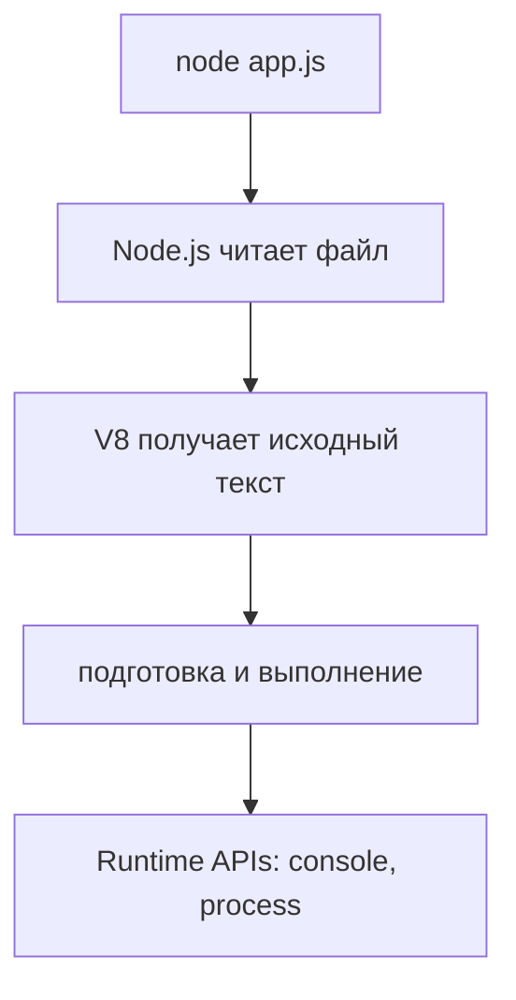
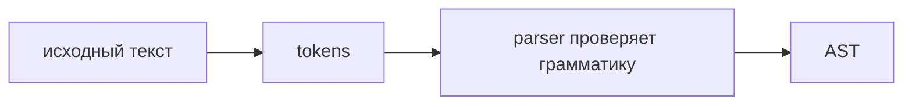
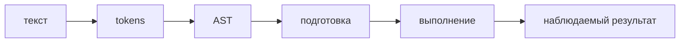

# Как выполняется JavaScript

## Связь с предыдущей главой

В предыдущей главе были разделены язык, engine и runtime. Мы увидели, что JavaScript-код не выполняется сам по себе: его выполняет JavaScript Engine внутри конкретного runtime.

Эта глава отвечает на следующий вопрос:

> Что физически происходит после команды `node app.js`, пока код еще не начал выполнять свои действия?

Мы разберем путь JavaScript-файла от исходного текста до выполнения. Главная цель — построить ментальный фильм: файл прочитан, текст разбит на элементы, проверен синтаксис, построена внутренняя структура, код подготовлен engine, затем начинается execution и взаимодействие с runtime.

---

## Предварительные требования

Для этой главы нужно понимать:

* что JavaScript — это язык программирования;
* что Engine выполняет JavaScript-код;
* что Runtime добавляет окружение и API;
* что Node.js запускает JavaScript-файлы вне браузера;
* как выполнить файл командой `node path/to/file.js`.

Не требуется знать Execution Context, Call Stack, Scope, Hoisting, Promises или Event Loop. Эти темы будут изучаться позже.

---

## Время изучения

Ориентировочное время:

```text
Чтение главы:            80-100 минут
Разбор схем:             30-40 минут
Запуск примеров:         20-30 минут
Практика:                70-100 минут
Повторение материала:    20 минут
```

Уровень сложности: **L2**.

L2 означает, что глава уже объясняет внутренний механизм работы engine, но без глубокого погружения в оптимизации конкретных реализаций.

---

## Навигация

Предыдущая глава:

```text
docs/01-javascript/01-what-is-javascript.md
```

Следующая глава:

```text
docs/01-javascript/03-execution-context.md
```

---

## Цели обучения

После изучения этой главы вы будете понимать:

* что происходит после команды `node app.js`;
* что такое source code;
* зачем engine выполняет lexical analysis;
* что такое parsing;
* что такое Abstract Syntax Tree;
* почему syntax error появляется до выполнения программы;
* что означает compilation на высоком уровне;
* чем interpretation отличается от compilation;
* как современные JavaScript engines совмещают разные подходы;
* что значит preparation for execution;
* когда начинается execution;
* как код взаимодействует с runtime;
* что является результатом выполнения программы;
* как читать ошибки запуска с точки зрения pipeline engine.

---

## Мотивация

Когда вы вводите команду:

```bash
node app.js
```

кажется, что файл просто "запускается".

На самом деле между нажатием Enter и первым видимым результатом происходит несколько этапов. Engine не бросается выполнять текст построчно как человек, который читает документ сверху вниз. Сначала он должен понять, что перед ним находится корректная программа.

Он делает это поэтапно:

Если в коде есть синтаксическая ошибка, программа может не дойти до execution вообще. Это важно для Automation QA: иногда тест не падает из-за неверной проверки, плохого locator или асинхронности. Иногда engine даже не смог разобрать файл.

Locator — это способ найти элемент на странице в UI-тесте; подробно locators будут изучаться в разделе Playwright.

В этой главе главный вопрос повторяется постоянно:

> Что engine делает прямо сейчас?

Если вы научитесь отвечать на этот вопрос, ошибки перестанут выглядеть как случайные сообщения терминала.

---

## Теория

### Полный lifecycle JavaScript-файла

Lifecycle JavaScript-файла — это путь от исходного текста до результата выполнения.

Сначала runtime получает команду запустить файл. В Node.js это происходит через команду `node app.js`. Node.js находит файл, читает его содержимое и передает текст JavaScript engine.

Дальше начинает работать engine.



V8 — JavaScript Engine, используемый в Node.js и Chrome; он был представлен в предыдущей главе.

Runtime APIs — возможности окружения, например `console` или `process`; подробнее отдельные API будут изучаться тогда, когда понадобятся.

Важно:

```text
До execution engine не "делает действия программы".
Он проверяет и подготавливает код.
```

### Source code

Source code — это исходный текст программы.

Для engine файл `app.js` сначала выглядит как последовательность символов:

```javascript
console.log('Hello');
```

На уровне файла это просто текст:

```text
c o n s o l e . l o g ( ' H e l l o ' ) ;
```

Человек сразу видит в этом "вывести Hello". Engine должен сначала превратить текст в структуру, с которой можно работать.

Что engine делает прямо сейчас:

```text
Engine еще ничего не выполняет.
Engine получает текст программы.
```

### Lexical analysis

Lexical analysis — это этап, на котором source code разбивается на значимые элементы.

Эти элементы часто называют tokens. Token — это минимальная значимая часть программы: имя, строка, число, оператор, скобка, точка с запятой.

Подробная теория tokenization не нужна в этой главе. Важно понять идею: engine перестает видеть поток отдельных символов и начинает видеть элементы языка.

Пример:

```javascript
console.log('Hello');
```

Упрощенно:

Что engine делает прямо сейчас:

```text
Engine читает символы.
Engine группирует их в tokens.
Engine еще не выполняет программу.
```

Если символы не образуют допустимые элементы языка, engine не сможет перейти дальше.

### Parsing

Parsing — это этап, на котором engine проверяет, складываются ли tokens в правильную структуру программы.

Lexical analysis отвечает на вопрос:

```text
Какие элементы есть в коде?
```

Parsing отвечает на другой вопрос:

```text
Можно ли из этих элементов построить корректную программу?
```



Грамматика языка — это набор правил, по которым элементы JavaScript могут соединяться друг с другом; подробно грамматика будет проявляться постепенно в главах про синтаксис.

Что engine делает прямо сейчас:

```text
Engine проверяет структуру программы.
Engine ищет синтаксические нарушения.
Engine готовит внутреннее представление кода.
```

### Abstract Syntax Tree

Abstract Syntax Tree, или AST, — это древовидное представление программы.

AST не является текстом. Это внутренняя структура, которая показывает, из каких частей состоит программа и как эти части связаны.

Для выражения `const total = 2 + 2;` дерево выглядит примерно так:

```text
VariableDeclaration (const)
└── Declarator
    ├── Identifier: total
    └── BinaryExpression: +
        ├── Literal: 2
        └── Literal: 2
```

Это не точный AST конкретного engine. Это учебная модель, которая показывает идею: текст превращается в дерево.

Зачем нужно дерево:

* engine проще анализировать структуру;
* можно понять порядок вложенности;
* можно отличить вызов от строки, имя от аргумента, выражение от инструкции;
* дальнейшие этапы могут работать не с текстом, а со структурой.

Expression — это фрагмент кода, который дает значение; подробно expressions будут изучаться позже.

Statement — это инструкция программы; подробно инструкции будут изучаться в следующих главах.

Что engine делает прямо сейчас:

```text
Engine уже понял форму программы.
Engine еще не выполняет пользовательскую логику.
Engine держит внутреннее дерево кода.
```

### Syntax errors

Syntax error — это ошибка, которая возникает, когда код не соответствует грамматике языка.

Пример:

```javascript
console.log('Hello'
```

Здесь не закрыта скобка.

Engine не может построить корректный AST, потому что структура незавершенная.

```text
function check( {      ← скобка открыта
  return true;
                       ← конец файла, закрывающей скобки нет
```

Parser сообщает о месте, где обнаружил незавершённость, — оно может не совпадать с местом, где была допущена ошибка.

Что engine делает прямо сейчас:

```text
Engine пытается построить AST.
Engine видит, что структура нарушена.
Engine останавливает подготовку программы.
Execution не начинается.
```

Важно:

```text
Syntax error возникает до выполнения кода.
Если parser не построил AST, программа не дошла до execution.
```

Это значит, что строки ниже синтаксической ошибки не выполняются.

### Compilation на высоком уровне

Compilation — это преобразование кода в форму, более удобную для выполнения.

В классическом понимании compiler заранее превращает исходный код в машинный код или другую исполняемую форму. В JavaScript все сложнее, потому что современные engines используют комбинацию подходов.

На высоком уровне:

Intermediate representation — промежуточное представление программы, удобное для engine; детали конкретных engines в этом курсе не являются основной темой.

Bytecode — промежуточная инструкция для виртуальной машины engine; точный формат зависит от engine.

Что engine делает прямо сейчас:

```text
Engine преобразует AST в более исполняемую форму.
Engine готовит программу к быстрому выполнению.
Engine все еще не обязан выполнять пользовательские действия.
```

### Interpretation vs compilation

Interpretation — подход, при котором программа выполняется ближе к исходному представлению, шаг за шагом.

Compilation — подход, при котором программа предварительно преобразуется в более низкоуровневую форму.

| | Interpretation | Compilation |
| --- | --- | --- |
| когда начинается выполнение | сразу | после преобразования |
| скорость старта | выше | ниже |
| скорость на длинной работе | ниже | выше |

Современные JavaScript engines используют смешанную модель. Они могут быстро начать выполнение с помощью interpreter, а часто выполняемый код дополнительно оптимизировать compiler.

Оптимизация — это преобразование кода engine так, чтобы он выполнялся быстрее; подробности оптимизаций будут изучаться позже в advanced-разделе.

Что engine делает прямо сейчас:

```text
Engine выбирает эффективную стратегию выполнения.
Engine может сочетать interpretation и compilation.
Детали зависят от конкретного engine.
```

### Современные JavaScript engines

Современный JavaScript Engine — это не простой построчный читатель.

Он обычно включает несколько подсистем:

Названия и устройство отличаются между engines, но общая идея сохраняется: engine должен понять код, представить его структурно, подготовить к выполнению и выполнить.

Для этой главы не нужно запоминать названия внутренних компонентов V8. Важно понимать pipeline.

Что engine делает прямо сейчас:

```text
Engine действует как система этапов.
Каждый этап решает свою задачу.
Ошибка на раннем этапе останавливает поздние этапы.
```

### Preparation for execution

Preparation for execution — это подготовка программы к старту выполнения.

На этом уровне engine уже:

* получил source code;
* разбил его на tokens;
* проверил синтаксис;
* построил AST;
* подготовил исполняемое представление.

Но перед реальным выполнением runtime должен предоставить окружение:

Timers — это API для отложенных действий; подробное поведение timers и Event Loop будет изучаться в async-разделе.

Execution Context — внутренняя среда выполнения кода; он будет подробно разобран в следующей главе. В этой главе мы не разбираем его внутренние фазы.

Что engine делает прямо сейчас:

```text
Engine готов перейти от подготовки к выполнению.
Runtime предоставляет доступные API.
Следующий этап — execution.
```

### Execution

Execution — этап, на котором подготовленный код начинает выполняться.

Теперь программа уже не просто анализируется. Она производит действия:

* вычисляет выражения;
* вызывает доступные операции;
* обращается к runtime API;
* выводит данные в терминал;
* может завершиться успешно или с runtime error.

Runtime error — ошибка, которая возникает во время выполнения программы; подробнее ошибки будут изучаться в отдельной главе.

Execution pipeline:

Что engine делает прямо сейчас:

```text
Engine выполняет подготовленную программу.
Если код обращается к runtime API, engine передает запрос runtime.
```

### Runtime interaction

Runtime interaction — момент, когда выполняемый JavaScript обращается к возможностям окружения.

Например:

```javascript
console.log('Hello');
```

На уровне ментальной модели:

`console.log` используется здесь только как минимальный способ увидеть результат. Подробно функции и вызовы будут изучаться позже.

Runtime interaction может быть разным:

DOM — структура HTML-страницы, доступная браузеру; подробно она будет встречаться в Playwright-разделе.

Что engine делает прямо сейчас:

```text
Engine выполняет код.
Runtime дает внешнюю возможность.
Результат появляется вне самого языка.
```

### Result of execution

Результат выполнения — это не всегда напечатанный текст.

Результатом может быть:

* успешное завершение программы;
* вывод в терминал;
* измененное состояние runtime;
* созданный файл;
* отправленный запрос;
* ошибка выполнения.

В этой главе мы используем вывод в терминал, потому что он проще всего наблюдается.



Что engine делает прямо сейчас:

```text
Engine завершает выполнение или сообщает об ошибке.
Runtime возвращает наблюдаемый результат пользователю.
```

---

## Внутренний механизм

Внутренний механизм запуска `node app.js` можно представить как цепочку проверок и преобразований.

Сначала работает Node.js runtime:

Затем работает engine:

Потом снова заметен runtime:

Side effect — наблюдаемое изменение вне самого вычисления, например вывод в терминал или запись файла; подробно side effects будут обсуждаться позже при изучении функций и архитектуры тестов.

Главное различие:

Если файл содержит синтаксическую ошибку, engine не может построить корректный AST. Это значит, что программа не начинает выполняться.

Если синтаксис корректен, но во время выполнения код обращается к недоступному API или несуществующему имени, это уже другая категория проблемы.

---

## Ментальная модель

Представьте engine как технического редактора и исполнителя в одном лице.

Сначала он не выполняет ваши инструкции. Он проверяет, можно ли вообще прочитать документ как программу.

```text
1. Получить текст
2. Разбить текст на элементы
3. Проверить грамматику
4. Построить дерево смысла
5. Подготовить исполняемую форму
6. Начать выполнение
7. Обратиться к runtime при необходимости
8. Вернуть результат
```

Ментальный фильм после `node app.js`:

Если на любом раннем этапе структура нарушена, фильм останавливается до выполнения.

---

## Примеры кода

Примеры к этой главе находятся в папке:

```text
examples/01-javascript/chapter-02/
```

Запускайте команды из корня проекта.

### Пример 1. Корректная программа

Файл:

```text
examples/01-javascript/chapter-02/01-valid-program.js
```

Команда:

```bash
node examples/01-javascript/chapter-02/01-valid-program.js
```

Этот пример показывает нормальный путь: source code успешно проходит parsing, engine начинает execution, runtime выводит результат в терминал.

### Пример 2. Syntax error

Файл:

```text
examples/01-javascript/chapter-02/02-syntax-error.js
```

Команда:

```bash
node examples/01-javascript/chapter-02/02-syntax-error.js
```

Этот пример намеренно содержит syntax error. Он нужен, чтобы увидеть важное поведение: первая строка файла не выполняется, потому что engine останавливается до execution.

### Пример 3. Engine flow

Файл:

```text
examples/01-javascript/chapter-02/03-engine-flow.js
```

Команда:

```bash
node examples/01-javascript/chapter-02/03-engine-flow.js
```

Пример показывает наблюдаемый результат успешной подготовки: если вывод появился, файл уже прошел ранние этапы engine pipeline.

### Пример 4. Runtime flow

Файл:

```text
examples/01-javascript/chapter-02/04-runtime-flow.js
```

Команда:

```bash
node examples/01-javascript/chapter-02/04-runtime-flow.js
```

Пример показывает, что видимый вывод появляется через runtime API.

### Пример 5. Концептуальная AST

Файл:

```text
examples/01-javascript/chapter-02/05-ast-visualization.md
```

Это не запускаемый JavaScript-файл, а ручная схема AST. Она нужна для закрепления модели `source code → tree`.

---

## Частые вопросы

### JavaScript выполняется построчно?

Не в буквальном смысле.

Engine сначала анализирует и подготавливает код. Во время execution действия действительно имеют порядок, но до этого уже прошли lexical analysis, parsing и подготовка.

### AST можно увидеть в Node.js?

Node.js не показывает AST обычной командой запуска. AST можно построить специальными инструментами, но в этой главе мы используем только концептуальное ручное изображение.

### Syntax error и runtime error — это одно и то же?

Нет.

Syntax error возникает, когда engine не может разобрать программу. Runtime error возникает во время выполнения уже разобранной программы.

### Нужно ли знать внутренности V8 прямо сейчас?

Нет.

Нужно понимать общий pipeline engine. Конкретные оптимизации V8 будут важны только в продвинутых темах.

### Где здесь Execution Context?

Execution Context — внутренняя среда выполнения кода. Он будет изучаться в следующей главе, потому что сначала нужно понять общий путь файла до execution.

---

## Распространённые мифы

### Миф 1. JavaScript просто читает файл сверху вниз

Реальность:

Перед выполнением engine анализирует source code, строит AST и готовит код к выполнению.

### Миф 2. Если внизу файла syntax error, верхние строки все равно выполнятся

Реальность:

Если parser не может построить AST для программы, execution не начинается.

### Миф 3. Compilation не относится к JavaScript

Реальность:

Современные JavaScript engines используют compilation и optimization как часть выполнения, хотя JavaScript часто называют интерпретируемым языком.

### Миф 4. Все ошибки появляются во время execution

Реальность:

Syntax errors появляются до execution. Runtime errors появляются во время execution.

---

## Распространённые ошибки

### Ошибка 1. Искать runtime-причину в syntax error

Неправильный подход:

Что произошло:

Категория ошибки определена неверно.

Почему это произошло:

Не отделен parsing от execution.

Исправленный подход:

### Ошибка 2. Думать, что AST — это просто красивое слово для кода

Что произошло:

AST воспринимается как текстовый формат.

Почему это произошло:

Не построена модель "текст превращается в дерево".

Исправленная модель: AST — это структура данных в памяти engine, а не текстовый формат, который можно открыть и прочитать.

### Ошибка 3. Смешивать compilation и TypeScript compilation

Что произошло:

Compilation внутри JavaScript engine смешана с компиляцией TypeScript в JavaScript.

Почему это произошло:

Одинаковое слово используется в разных контекстах.

Исправленная модель: внутри engine compilation превращает JavaScript в машинное представление, а компилятор TypeScript превращает TypeScript в JavaScript — это разные преобразования на разных уровнях.

TypeScript compilation будет изучаться в части TypeScript.

### Ошибка 4. Игнорировать этап, на котором возникла ошибка

Неправильный вопрос:

```text
Почему код не работает?
```

Более точный вопрос:

```text
На каком этапе pipeline остановился engine?
```

Такой вопрос сразу направляет диагностику.

---

## Практическое использование

При любой ошибке запуска JavaScript-файла используйте pipeline как диагностическую карту.

```text
1. Node.js нашел файл?
2. Source code прочитан?
3. Syntax корректен?
4. AST может быть построен?
5. Execution начался?
6. Ошибка возникла во время runtime interaction?
```

Например, `SyntaxError` возникает на четвёртом шаге — AST построить не удалось, и выполнение не начиналось вовсе. А `ReferenceError` появляется уже на пятом: программа выполняется, но обращается к недоступному имени.

ReferenceError — ошибка обращения к имени, которое недоступно в текущем месте выполнения; подробно имена и Scope будут изучаться позже.

Готовность к следующей главе:

---

## Использование в Automation QA

Automation QA Engineer часто видит ошибки не в учебном файле, а в тестовом проекте.

Например, при запуске `npx playwright test` ошибка может возникнуть до старта браузера — на чтении файла, на разборе синтаксиса или на подготовке кода.

`npx` — инструмент запуска npm-пакетов; подробно npm-инструменты будут изучаться позже.

Если в тестовом файле есть syntax error, Playwright может даже не начать выполнять сценарий. Браузер может не открыться, потому что ошибка случилась раньше: engine или toolchain не смогли подготовить файл.

Toolchain — цепочка инструментов, которая обрабатывает код перед запуском; подробно она будет встречаться в TypeScript и Playwright-разделах.

QA-диагностика через pipeline:

Это помогает не путать:

* ошибку синтаксиса в тестовом файле;
* ошибку запуска инструмента;
* ошибку runtime;
* ошибку браузерного взаимодействия;
* ошибку assertion.

Assertion — проверка ожидаемого результата; подробно assertions будут изучаться в Automation QA-разделе.

В хорошей автоматизации важно понимать не только "тест красный", но и "на каком этапе он стал красным".

---

## Итоги

После команды `node app.js` JavaScript-файл проходит несколько этапов.

Сначала Node.js runtime находит и читает файл. Затем JavaScript Engine получает source code. Engine выполняет lexical analysis, разбивает текст на tokens, запускает parser, проверяет грамматику и строит AST. Если синтаксис нарушен, execution не начинается.

Если AST построен успешно, engine подготавливает код к выполнению. Современные JavaScript engines используют сочетание interpretation, compilation и optimization. После подготовки начинается execution, и код может взаимодействовать с runtime APIs.

Главная ментальная модель главы: между написанным текстом и результатом стоит цепочка этапов, и ошибка на любом из них останавливает всё последующее.

Следующая глава объяснит Execution Context — внутреннюю среду, в которой JavaScript выполняет код после подготовки.

---

## Что нужно запомнить

✓ JavaScript-файл не начинает выполнять действия сразу.

✓ Engine сначала получает source code.

✓ Lexical analysis разбивает текст на tokens.

✓ Parsing проверяет структуру программы.

✓ AST — древовидное представление кода.

✓ Syntax error возникает до execution.

✓ Compilation в engine подготавливает код к выполнению.

✓ Современные engines сочетают interpretation и compilation.

✓ Execution начинается после успешной подготовки.

✓ Runtime interaction происходит, когда код обращается к API окружения.

---

## Проверьте себя

1. Что происходит после команды `node app.js` до работы engine?

2. Что такое source code?

3. Зачем нужен lexical analysis?

4. Чем parsing отличается от lexical analysis?

5. Что такое AST?

6. Почему syntax error возникает до execution?

7. Чем interpretation отличается от compilation?

8. Что делает engine во время preparation for execution?

9. Что такое runtime interaction?

10. Как pipeline помогает в диагностике тестов?

---

## Практика

Практика к этой главе находится в файле:

```text
practice/01-javascript/02-how-javascript-works.md
```

Перед практикой запустите безопасные примеры из раздела «Примеры кода». Файл `02-syntax-error.js` содержит намеренную syntax error, поэтому его нужно запускать отдельно и читать сообщение как учебный материал.

---

## Решения

Решения находятся в файле:

```text
solutions/01-javascript/02-how-javascript-works.md
```

Открывайте решения после собственной попытки. В этой главе важно сравнивать не только ответ, но и объяснение: что engine делает на каждом этапе.
