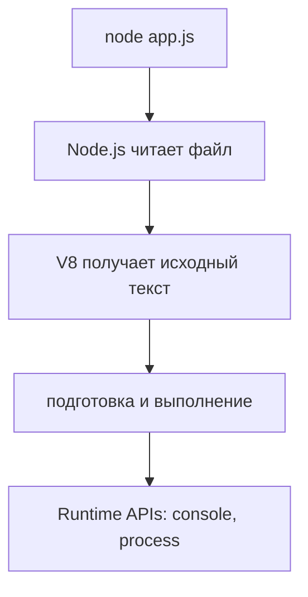
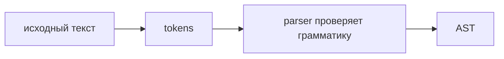
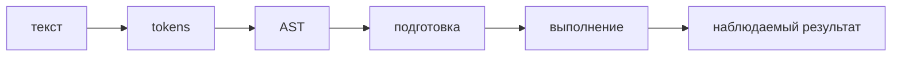

# Как выполняется JavaScript

## Связь с предыдущей главой

В предыдущей главе были разделены язык, engine и runtime. Мы увидели, что JavaScript-код не выполняется сам по себе: его выполняет JavaScript Engine внутри конкретного runtime.

Эта глава отвечает на следующий вопрос:

> Что физически происходит после команды `node app.js`, пока код еще не начал выполнять свои действия?

Мы разберем путь JavaScript-файла от исходного текста до выполнения. Главная цель — построить ментальный фильм: файл прочитан, текст разбит на элементы, проверен синтаксис, построена внутренняя структура, код подготовлен engine, затем начинается execution и взаимодействие с runtime.

---

## Предварительные требования

Для этой главы нужно понимать:

* что JavaScript — это язык программирования;
* что Engine выполняет JavaScript-код;
* что Runtime добавляет окружение и API;
* что Node.js запускает JavaScript-файлы вне браузера;
* как выполнить файл командой `node path/to/file.js`.

Не требуется знать Execution Context, Call Stack, Scope, Hoisting, Promises или Event Loop. Эти темы будут изучаться позже.

---

## Время изучения

Ориентировочное время:

```text
Чтение главы:            80-100 минут
Разбор схем:             30-40 минут
Запуск примеров:         20-30 минут
Практика:                70-100 минут
Повторение материала:    20 минут
```

Уровень сложности: **L2**.

L2 означает, что глава уже объясняет внутренний механизм работы engine, но без глубокого погружения в оптимизации конкретных реализаций.

---

## Навигация

Предыдущая глава:

```text
docs/01-javascript/01-what-is-javascript.md
```

Следующая глава:

```text
docs/01-javascript/03-execution-context.md
```

---

## Цели обучения

После изучения этой главы вы будете понимать:

* что происходит после команды `node app.js`;
* что такое source code;
* зачем engine выполняет lexical analysis;
* что такое parsing;
* что такое Abstract Syntax Tree;
* почему syntax error появляется до выполнения программы;
* что означает compilation на высоком уровне;
* чем interpretation отличается от compilation;
* как современные JavaScript engines совмещают разные подходы;
* что значит preparation for execution;
* когда начинается execution;
* как код взаимодействует с runtime;
* что является результатом выполнения программы;
* как читать ошибки запуска с точки зрения pipeline engine.

---

## Мотивация

Когда вы вводите команду:

```bash
node app.js
```

кажется, что файл просто "запускается".

На самом деле между нажатием Enter и первым видимым результатом происходит несколько этапов. Engine не бросается выполнять текст построчно как человек, который читает документ сверху вниз. Сначала он должен понять, что перед ним находится корректная программа.

Он делает это поэтапно:

Если в коде есть синтаксическая ошибка, программа может не дойти до execution вообще. Это важно для Automation QA: иногда тест не падает из-за неверной проверки, плохого locator или асинхронности. Иногда engine даже не смог разобрать файл.

Locator — это способ найти элемент на странице в UI-тесте; подробно locators будут изучаться в разделе Playwright.

В этой главе главный вопрос повторяется постоянно:

> Что engine делает прямо сейчас?

Если вы научитесь отвечать на этот вопрос, ошибки перестанут выглядеть как случайные сообщения терминала.

---

## Теория

### Полный жизненный цикл файла JavaScript

Жизненный цикл файла — это путь от исходного текста до результата выполнения.

Сначала среда выполнения получает команду запустить файл. В Node.js это происходит через команду `node app.js`. Node.js находит файл, читает его содержимое и передаёт текст движку JavaScript.

Дальше начинает работать движок.


```mermaid
flowchart TD
    N1["node app.js"]
    N2["Node.js читает файл"]
    N3["V8 получает исходный текст"]
    N4["подготовка и выполнение"]
    N5["Runtime APIs: console, process"]
    N1 --> N2
    N2 --> N3
    N3 --> N4
    N4 --> N5
```

V8 — движок JavaScript, используемый в Node.js и Chrome; он был представлен в предыдущей главе.

API среды выполнения — возможности окружения, например `console` или `process`; подробнее отдельные API будут изучаться тогда, когда понадобятся.

Важно:

```text
До execution engine не "делает действия программы".
Он проверяет и подготавливает код.
```

### Исходный код

Исходный код — это исходный текст программы.

Для движка файл `app.js` сначала выглядит как последовательность символов:

```javascript
console.log('Hello');
```

На уровне файла это просто текст:

```text
c o n s o l e . l o g ( ' H e l l o ' ) ;
```

Человек сразу видит в этом «вывести Hello». Движок должен сначала превратить текст в структуру, с которой можно работать.

Что движок делает прямо сейчас:

```text
Engine еще ничего не выполняет.
Engine получает текст программы.
```

### Лексический анализ

Лексический анализ — это этап, на котором исходный код разбивается на значимые элементы.

Эти элементы называют лексемами. Лексема — это минимальная значимая часть программы: имя, строка, число, оператор, скобка, точка с запятой.

Подробная теория разбиения на лексемы в этой главе не нужна. Важно понять идею: движок перестаёт видеть поток отдельных символов и начинает видеть элементы языка.

Пример:

```javascript
console.log('Hello');
```

Упрощённо движок видит такую последовательность лексем:

```text
console   .   log   (   'Hello'   )   ;
 имя     точка  имя  скобка строка скобка  конец инструкции
```

Что движок делает прямо сейчас:

```text
Engine читает символы.
Engine группирует их в tokens.
Engine еще не выполняет программу.
```

Если символы не образуют допустимые элементы языка, движок не сможет перейти дальше.

### Разбор

Разбор — это этап, на котором движок проверяет, складываются ли лексемы в правильную структуру программы.

Лексический анализ отвечает на вопрос:

```text
Какие элементы есть в коде?
```

Разбор отвечает на другой вопрос:

```text
Можно ли из этих элементов построить корректную программу?
```


```mermaid
flowchart LR
    N1["исходный текст"]
    N2["tokens"]
    N3["parser проверяет грамматику"]
    N4["AST"]
    N1 --> N2
    N2 --> N3
    N3 --> N4
```

Грамматика языка — это набор правил, по которым элементы JavaScript могут соединяться друг с другом; подробно грамматика будет проявляться постепенно в главах про синтаксис.

Что движок делает прямо сейчас:

```text
Engine проверяет структуру программы.
Engine ищет синтаксические нарушения.
Engine готовит внутреннее представление кода.
```

### Абстрактное синтаксическое дерево

Абстрактное синтаксическое дерево, или AST, — это древовидное представление программы.

AST не является текстом. Это внутренняя структура, которая показывает, из каких частей состоит программа и как эти части связаны.

Для выражения `const total = 2 + 2;` дерево выглядит примерно так:

```text
VariableDeclaration (const)
└── Declarator
    ├── Identifier: total
    └── BinaryExpression: +
        ├── Literal: 2
        └── Literal: 2
```

Это не точное AST конкретного движка. Это учебная модель, которая показывает идею: текст превращается в дерево.

Зачем нужно дерево:

* движку проще анализировать структуру;
* можно понять порядок вложенности;
* можно отличить вызов от строки, имя от аргумента, выражение от инструкции;
* дальнейшие этапы могут работать не с текстом, а со структурой.

Выражение — это фрагмент кода, который даёт значение; подробно выражения будут изучаться позже.

Инструкция — это отдельное указание программы; подробно инструкции будут изучаться в следующих главах.

Что движок делает прямо сейчас:

```text
Engine уже понял форму программы.
Engine еще не выполняет пользовательскую логику.
Engine держит внутреннее дерево кода.
```

### Синтаксические ошибки

Синтаксическая ошибка — это ошибка, которая возникает, когда код не соответствует грамматике языка.

Пример:

```javascript
console.log('Hello'
```

Здесь не закрыта скобка.

Движок не может построить корректное AST, потому что структура незавершённая.

```text
function check( {      ← скобка открыта
  return true;
                       ← конец файла, закрывающей скобки нет
```

Разбор сообщает о месте, где обнаружена незавершённость, — оно может не совпадать с местом, где была допущена ошибка.

Что движок делает прямо сейчас:

```text
Engine пытается построить AST.
Engine видит, что структура нарушена.
Engine останавливает подготовку программы.
Execution не начинается.
```

Важно:

```text
Syntax error возникает до выполнения кода.
Если parser не построил AST, программа не дошла до execution.
```

Это значит, что строки ниже синтаксической ошибки не выполняются.

### Компиляция на высоком уровне

Компиляция — это преобразование кода в форму, более удобную для выполнения.

В классическом понимании компилятор заранее превращает исходный код в машинный код или другую исполняемую форму. В JavaScript всё сложнее, потому что современные движки используют комбинацию подходов.

На высоком уровне цепочка выглядит так:

```text
AST  →  промежуточное представление (байт-код)  →  выполнение
                                  ↑
                    часто выполняемый код дополнительно оптимизируется
```

Промежуточное представление — форма программы, удобная движку; детали конкретных движков в этом курсе не являются основной темой.

Байт-код — промежуточная инструкция для виртуальной машины движка; точный формат зависит от движка.

Что движок делает прямо сейчас:

```text
Engine преобразует AST в более исполняемую форму.
Engine готовит программу к быстрому выполнению.
Engine все еще не обязан выполнять пользовательские действия.
```

### Интерпретация и компиляция

Интерпретация — подход, при котором программа выполняется ближе к исходному представлению, шаг за шагом.

Компиляция — подход, при котором программа предварительно преобразуется в более низкоуровневую форму.

| | Interpretation | Compilation |
| --- | --- | --- |
| когда начинается выполнение | сразу | после преобразования |
| скорость старта | выше | ниже |
| скорость на длинной работе | ниже | выше |

Современные движки JavaScript используют смешанную модель. Они могут быстро начать выполнение с помощью интерпретатора, а часто выполняемый код дополнительно оптимизировать компилятором.

Оптимизация — это преобразование кода движком так, чтобы он выполнялся быстрее; подробности оптимизаций будут изучаться позже, в углублённом разделе.

Что движок делает прямо сейчас:

```text
Engine выбирает эффективную стратегию выполнения.
Engine может сочетать interpretation и compilation.
Детали зависят от конкретного engine.
```

### Современные движки JavaScript

Современный движок JavaScript — это не простой построчный читатель.

Он обычно включает несколько подсистем: разборщик, интерпретатор,
оптимизирующий компилятор и сборщик мусора.

Названия и устройство отличаются между движками, но общая идея сохраняется: движок должен понять код, представить его структурно, подготовить к выполнению и выполнить.

Для этой главы не нужно запоминать названия внутренних компонентов V8. Важно понимать саму последовательность этапов.

Что движок делает прямо сейчас:

```text
Engine действует как система этапов.
Каждый этап решает свою задачу.
Ошибка на раннем этапе останавливает поздние этапы.
```

### Подготовка к выполнению

Подготовка к выполнению — это приведение программы в состояние, из которого она может стартовать.

На этом уровне движок уже:

* получил исходный код;
* разбил его на лексемы;
* проверил синтаксис;
* построил AST;
* подготовил исполняемое представление.

Но перед реальным выполнением среда выполнения должна предоставить окружение:
доступные API (`console`, `process`, таймеры), глобальные объекты и контекст
выполнения для кода верхнего уровня.

Таймеры — это API для отложенных действий; подробное поведение таймеров и событийного цикла будет изучаться в разделе про асинхронность.

Контекст выполнения — внутренняя среда, в которой движок выполняет код; он будет подробно разобран в следующей главе. Здесь мы не разбираем его внутренние фазы.

Что движок делает прямо сейчас:

```text
Engine готов перейти от подготовки к выполнению.
Runtime предоставляет доступные API.
Следующий этап — execution.
```

### Выполнение

Выполнение — этап, на котором подготовленный код начинает работать.

Теперь программа уже не просто анализируется. Она производит действия:

* вычисляет выражения;
* вызывает доступные операции;
* обращается к API среды выполнения;
* выводит данные в терминал;
* может завершиться успешно или с ошибкой времени выполнения.

Ошибка времени выполнения — ошибка, которая возникает во время работы программы; подробнее ошибки будут изучаться в отдельной главе.

Конвейер выполнения на этом этапе короткий:

```text
инструкция → вычисление → обращение к API среды (если нужно) → результат
```

Что движок делает прямо сейчас:

```text
Engine выполняет подготовленную программу.
Если код обращается к runtime API, engine передает запрос runtime.
```

### Взаимодействие со средой выполнения

Обращение к среде — момент, когда выполняемый код просит у окружения его возможности.

Например:

```javascript
console.log('Hello');
```

На уровне ментальной модели движок не умеет печатать сам: он выполняет вызов и
передаёт запрос среде, а печатает уже она.

```text
код        console.log('Hello')
движок     выполняет вызов, передаёт запрос наружу
среда      печатает 'Hello' в терминал
```

`console.log` используется здесь только как минимальный способ увидеть результат. Подробно функции и вызовы будут изучаться позже.

Обращение к среде может быть разным: вывод в терминал, чтение файла, сетевой
запрос, таймер, обращение к DOM в браузере.

DOM — структура HTML-страницы, доступная браузеру; подробно она будет встречаться в Playwright-разделе.

Что движок делает прямо сейчас:

```text
Engine выполняет код.
Runtime дает внешнюю возможность.
Результат появляется вне самого языка.
```

### Результат выполнения

Результат выполнения — это не всегда напечатанный текст.

Результатом может быть:

* успешное завершение программы;
* вывод в терминал;
* изменённое состояние среды выполнения;
* созданный файл;
* отправленный запрос;
* ошибка выполнения.

В этой главе мы используем вывод в терминал, потому что он проще всего наблюдается.


```mermaid
flowchart LR
    N1["текст"]
    N2["tokens"]
    N3["AST"]
    N4["подготовка"]
    N5["выполнение"]
    N6["наблюдаемый результат"]
    N1 --> N2
    N2 --> N3
    N3 --> N4
    N4 --> N5
    N5 --> N6
```

Что движок делает прямо сейчас:

```text
Engine завершает выполнение или сообщает об ошибке.
Runtime возвращает наблюдаемый результат пользователю.
```

---

## Внутренний механизм

Внутренний механизм запуска `node app.js` можно представить как цепочку проверок и преобразований.

```text
1. среда выполнения │ найти файл, прочитать текст, передать движку
2. движок           │ лексемы → разбор → AST → подготовка → выполнение
3. среда выполнения │ выполнить запрошенные побочные эффекты и показать результат
```

Шаги 1 и 3 делает Node.js, шаг 2 — движок. Разделение объясняет, почему
`console` и `process` не являются частью языка: их предоставляет среда.

Побочный эффект — наблюдаемое изменение вне самого вычисления, например вывод в терминал или запись файла; подробно побочные эффекты будут обсуждаться позже, при изучении функций и архитектуры тестов.

Главное различие — на каком этапе обнаружена проблема:

| Что случилось | На каком этапе | Выполнится ли код |
| --- | --- | --- |
| нарушена грамматика | разбор, до выполнения | нет, ни одна строка |
| обращение к несуществующему имени | выполнение | да, до этой строки |

Если файл содержит синтаксическую ошибку, движок не может построить корректное AST. Это значит, что программа не начинает выполняться.

Если синтаксис корректен, но во время выполнения код обращается к недоступному API или несуществующему имени, это уже другая категория проблемы.

---

## Ментальная модель

Представьте движок как технического редактора и исполнителя в одном лице.

Сначала он не выполняет ваши инструкции. Он проверяет, можно ли вообще прочитать документ как программу.

```text
1. Получить текст
2. Разбить текст на элементы
3. Проверить грамматику
4. Построить дерево смысла
5. Подготовить исполняемую форму
6. Начать выполнение
7. Обратиться к runtime при необходимости
8. Вернуть результат
```

Ментальный фильм после `node app.js`:

Если на любом раннем этапе структура нарушена, фильм останавливается до выполнения.

---

## Примеры кода

Примеры к этой главе находятся в папке:

```text
examples/01-javascript/chapter-02/
```

Запускайте команды из корня проекта.

### Пример 1. Корректная программа

Файл:

```text
examples/01-javascript/chapter-02/01-valid-program.js
```

Команда:

```bash
node examples/01-javascript/chapter-02/01-valid-program.js
```

Этот пример показывает нормальный путь: исходный код успешно проходит разбор, движок начинает выполнение, среда выводит результат в терминал.

### Пример 2. Синтаксическая ошибка

Файл:

```text
examples/01-javascript/chapter-02/02-syntax-error.js
```

Команда:

```bash
node examples/01-javascript/chapter-02/02-syntax-error.js
```

Этот пример намеренно содержит синтаксическую ошибку. Он нужен, чтобы увидеть важное поведение: первая строка файла не выполняется, потому что движок останавливается до выполнения.

### Пример 3. Работа движка

Файл:

```text
examples/01-javascript/chapter-02/03-engine-flow.js
```

Команда:

```bash
node examples/01-javascript/chapter-02/03-engine-flow.js
```

Пример показывает наблюдаемый результат успешной подготовки: если вывод появился, файл уже прошёл ранние этапы работы движка.

### Пример 4. Работа среды выполнения

Файл:

```text
examples/01-javascript/chapter-02/04-runtime-flow.js
```

Команда:

```bash
node examples/01-javascript/chapter-02/04-runtime-flow.js
```

Пример показывает, что видимый вывод появляется через API среды выполнения.

### Пример 5. Концептуальная AST

Файл:

```text
examples/01-javascript/chapter-02/05-ast-visualization.md
```

Это не запускаемый JavaScript-файл, а ручная схема AST. Она нужна для закрепления модели `source code → tree`.

---

## Частые вопросы

### JavaScript выполняется построчно?

Не в буквальном смысле.

Движок сначала анализирует и подготавливает код. Во время выполнения действия действительно имеют порядок, но до этого уже прошли лексический анализ, разбор и подготовка.

### AST можно увидеть в Node.js?

Node.js не показывает AST обычной командой запуска. AST можно построить специальными инструментами, но в этой главе мы используем только концептуальное ручное изображение.

### Синтаксическая ошибка и ошибка времени выполнения — это одно и то же?

Нет.

Синтаксическая ошибка возникает, когда движок не может разобрать программу. Ошибка времени выполнения возникает во время работы уже разобранной программы.

### Нужно ли знать внутренности V8 прямо сейчас?

Нет.

Нужно понимать общую последовательность этапов. Конкретные оптимизации V8 будут важны только в продвинутых темах.

### Где здесь контекст выполнения?

Контекст выполнения — внутренняя среда, в которой движок выполняет код. Он будет изучаться в следующей главе, потому что сначала нужно понять общий путь файла до выполнения.

---

## Распространённые мифы

### Миф 1. JavaScript просто читает файл сверху вниз

Реальность:

Перед выполнением движок анализирует исходный код, строит AST и готовит код к выполнению.

### Миф 2. Если внизу файла синтаксическая ошибка, верхние строки всё равно выполнятся

Реальность:

Если разбор не может построить AST для программы, выполнение не начинается.

### Миф 3. Компиляция не относится к JavaScript

Реальность:

Современные движки JavaScript используют компиляцию и оптимизацию как часть выполнения, хотя JavaScript часто называют интерпретируемым языком.

### Миф 4. Все ошибки появляются во время выполнения

Реальность:

Синтаксические ошибки появляются до выполнения. Ошибки времени выполнения — во время него.

---

## Распространённые ошибки

### Ошибка 1. Искать причину времени выполнения в синтаксической ошибке

Неправильный подход: увидеть в терминале сообщение об ошибке и сразу искать
причину в логике программы.

Что произошло: сообщение относилось к разбору. Строка, на которую оно указывает,
может быть далеко от места настоящей опечатки — разборщик сообщает о месте, где
обнаружил незавершённость.

Категория ошибки определена неверно.

Почему это произошло:

Разбор кода не отделён от его выполнения.

Исправленный подход: сначала спросить, на каком этапе появилось сообщение.
Синтаксическая ошибка возникает при разборе — до того, как выполнилась хотя бы
одна строка. Ошибка времени выполнения появляется уже во время работы
программы, когда часть строк отработала:

```text
Uncaught SyntaxError   → разбор, программа не запускалась
Uncaught TypeError     → выполнение, часть кода уже отработала
```

### Ошибка 2. Думать, что AST — это просто красивое слово для кода

Что произошло:

AST воспринимается как текстовый формат.

Почему это произошло:

Не построена модель "текст превращается в дерево".

Исправленная модель: AST — это структура данных в памяти движка, а не текстовый формат, который можно открыть и прочитать.

### Ошибка 3. Смешивать компиляцию в движке и компиляцию TypeScript

Что произошло:

Компиляция внутри движка JavaScript смешана с компиляцией TypeScript в JavaScript.

Почему это произошло:

Одинаковое слово используется в разных контекстах.

Исправленная модель: внутри движка компиляция превращает JavaScript в машинное представление, а компилятор TypeScript превращает TypeScript в JavaScript — это разные преобразования на разных уровнях.

Компиляция TypeScript будет изучаться в части про TypeScript.

### Ошибка 4. Игнорировать этап, на котором возникла ошибка

Неправильный вопрос:

```text
Почему код не работает?
```

Более точный вопрос:

```text
На каком этапе pipeline остановился engine?
```

Такой вопрос сразу направляет диагностику.

---

## Практическое использование

При любой ошибке запуска файла используйте последовательность этапов как диагностическую карту.

```text
1. Node.js нашел файл?
2. Source code прочитан?
3. Syntax корректен?
4. AST может быть построен?
5. Execution начался?
6. Ошибка возникла во время runtime interaction?
```

Например, `SyntaxError` возникает на четвёртом шаге — AST построить не удалось, и выполнение не начиналось вовсе. А `ReferenceError` появляется уже на пятом: программа выполняется, но обращается к недоступному имени.

`ReferenceError` — ошибка обращения к имени, которое недоступно в текущем месте выполнения; подробно имена и область видимости будут изучаться позже.

---

## Использование в Automation QA

Инженер по автоматизации тестирования часто видит ошибки не в учебном файле, а в тестовом проекте.

Например, при запуске `npx playwright test` ошибка может возникнуть до старта браузера — на чтении файла, на разборе синтаксиса или на подготовке кода.

`npx` — инструмент запуска npm-пакетов; подробно npm-инструменты будут изучаться позже.

Если в тестовом файле есть синтаксическая ошибка, Playwright может даже не начать выполнять сценарий. Браузер может не открыться, потому что ошибка случилась раньше: движок или цепочка инструментов не смогли подготовить файл.

Цепочка инструментов — набор программ, которые обрабатывают код перед запуском; подробно она будет встречаться в разделах про TypeScript и Playwright.

Диагностика по этапам выглядит так:

```text
браузер не открылся вовсе        → ошибка до выполнения: синтаксис или сборка
браузер открылся, тест упал      → ошибка выполнения: сценарий или приложение
инструмент не запустился         → окружение: зависимости, версия, конфигурация
```

Это помогает не путать:

* ошибку синтаксиса в тестовом файле;
* ошибку запуска инструмента;
* ошибку времени выполнения;
* ошибку браузерного взаимодействия;
* несовпадение в проверке.

Проверка — сравнение полученного результата с ожидаемым; подробно проверки будут изучаться в разделе про автоматизацию тестов.

В хорошей автоматизации важно понимать не только "тест красный", но и "на каком этапе он стал красным".

---

## Итоги

После команды `node app.js` JavaScript-файл проходит несколько этапов.

Сначала среда выполнения Node.js находит и читает файл. Затем движок получает исходный код. Движок выполняет лексический анализ, разбивает текст на лексемы, запускает разбор, проверяет грамматику и строит AST. Если синтаксис нарушен, выполнение не начинается.

Если AST построено успешно, движок подготавливает код к выполнению. Современные движки используют сочетание интерпретации, компиляции и оптимизации. После подготовки начинается выполнение, и код может обращаться к API среды.

Главная ментальная модель главы: между написанным текстом и результатом стоит цепочка этапов, и ошибка на любом из них останавливает всё последующее.

Следующая глава объяснит контекст выполнения — внутреннюю среду, в которой JavaScript выполняет код после подготовки.

---

## Что нужно запомнить

✓ JavaScript-файл не начинает выполнять действия сразу.

✓ Движок сначала получает исходный код.

✓ Лексический анализ разбивает текст на лексемы.

✓ Разбор проверяет структуру программы.

✓ AST — древовидное представление кода.

✓ Синтаксическая ошибка возникает до выполнения.

✓ Компиляция в движке подготавливает код к выполнению.

✓ Современные движки сочетают интерпретацию и компиляцию.

✓ Выполнение начинается после успешной подготовки.

✓ Обращение к среде происходит, когда код просит у окружения его возможности.

---

## Проверьте себя

1. Что происходит после команды `node app.js` до работы движка?

2. Что такое исходный код?

3. Зачем нужен лексический анализ?

4. Чем разбор отличается от лексического анализа?

5. Что такое AST?

6. Почему синтаксическая ошибка возникает до выполнения?

7. Чем интерпретация отличается от компиляции?

8. Что делает движок во время подготовки к выполнению?

9. Что такое обращение к среде выполнения?

10. Как знание этапов помогает в диагностике тестов?

### Ответы

1. Запускается процесс Node.js, он находит указанный файл, читает его содержимое как текст и передаёт движку. До этого момента никакого выполнения кода ещё нет.
2. Исходный код — это просто текст файла. Для движка он не является программой, пока не разобран.
3. Лексический анализ разбивает сплошной текст на минимальные значимые единицы: имена, числа, строки, знаки операций. Без этого шага текст остаётся набором символов.
4. Лексический анализ отвечает на вопрос «из каких единиц состоит текст», разбор — на вопрос «какая структура из них складывается». Первый даёт слова, второй — предложения.
5. AST — дерево, описывающее структуру программы: что является объявлением, что вызовом, что условием. Дальше движок работает с этим деревом, а не с текстом.
6. Синтаксическая ошибка означает, что структуру построить не удалось. Строить нечего, значит и выполнять нечего — отказ происходит до первой выполненной строки.
7. Интерпретация выполняет код по ходу разбора, компиляция заранее переводит его в другое представление. Современные движки сочетают оба подхода: сначала выполняют быстро, затем оптимизируют часто исполняемые участки.
8. Создаёт контекст выполнения и заводит записи обо всех объявлениях, которые в нём встретил, — до того как выполнится первая строка.
9. Взаимодействие с средой: вызовы, которых в самом языке нет, — работа с файлами, сетью, страницей. Движок передаёт их среде и получает результат.
10. Она показывает, на каком этапе сломалось. `SyntaxError` означает, что файл не разобран и не выполнялся вообще; `TypeError` или `ReferenceError` — что выполнение шло и упало на конкретной строке.

---

## Практика

Практика к этой главе находится в файле:

```text
practice/01-javascript/02-how-javascript-works.md
```

Перед практикой запустите безопасные примеры из раздела «Примеры кода». Файл `02-syntax-error.js` содержит намеренную синтаксическую ошибку, поэтому его нужно запускать отдельно и читать сообщение как учебный материал.

---

## Решения

Решения находятся в файле:

```text
solutions/01-javascript/02-how-javascript-works.md
```

Открывайте решения после собственной попытки. В этой главе важно сравнивать не только ответ, но и объяснение: что движок делает на каждом этапе.
