# Execution Context

## Связь с предыдущей главой

В предыдущей главе был разобран путь JavaScript-файла от `source code` до `execution`: engine читает текст, выполняет lexical analysis, строит AST, подготавливает код и только потом начинает выполнение.

Теперь нужно ответить на следующий вопрос:

> В какой внутренней среде engine выполняет подготовленный код?

Эта глава вводит Execution Context. Но мы не начнем с определения. Сначала посмотрим на наблюдаемое поведение JavaScript, которое невозможно хорошо объяснить без внутренней модели подготовки и выполнения.

---

## Предварительные требования

Для этой главы нужно понимать:

* что JavaScript выполняется engine внутри runtime;
* что перед execution код проходит подготовку;
* что syntax error возникает до выполнения;
* что Node.js может запускать `.js` файлы командой `node`;
* что runtime предоставляет API вроде `console`.

Не требуется знать Call Stack, Scope Chain, Closures, Event Loop или async. Эти темы будут изучаться в отдельных главах.

---

## Время изучения

Ориентировочное время:

```text
Чтение главы:            100-130 минут
Разбор схем:              40-50 минут
Запуск примеров:          25-35 минут
Практика:                 90-120 минут
Повторение материала:     30 минут
```

Уровень сложности: **L3**.

L3 означает фундаментальный уровень: глава объясняет внутреннюю модель, без которой следующие темы JavaScript будут восприниматься как набор правил.

---

## Навигация

Предыдущая глава:

```text
docs/01-javascript/02-how-javascript-works.md
```

Следующая глава:

```text
docs/01-javascript/04-call-stack.md
```

---

## Цели обучения

После изучения этой главы вы будете понимать:

* что такое Execution Context;
* почему Execution Context существует;
* почему JavaScript не может выполнять код без Execution Context;
* что происходит во время creation phase;
* что происходит во время execution phase;
* как engine регистрирует имена до выполнения строк кода;
* как на высоком уровне происходит memory allocation;
* чем отличается Global Execution Context от Function Execution Context;
* почему один вызов функции создает один новый Execution Context;
* как появляются и исчезают execution contexts;
* как nested execution contexts помогают мысленно симулировать выполнение;
* как Execution Context связан с runtime;
* почему эта модель важна для Playwright, helpers, fixtures, page objects и stack traces.

---

## Мотивация

Начнем не с определения, а с поведения.

Рассмотрите код:

```javascript
showMessage();

function showMessage() {
  console.log('Ready');
}
```

Если запустить файл, будет выведено:

```text
Ready
```

Наивная модель "JavaScript просто выполняет строки сверху вниз" не объясняет это поведение. Если engine действительно только дошел до первой строки, почему он уже знает о функции, которая записана ниже?

Теперь другой пример:

```javascript
console.log(status);

var status = 'ready';
```

В зависимости от среды и режима выполнения здесь можно увидеть не то поведение, которое ожидает новичок. Подробности `var`, `let`, `const` и hoisting будут разобраны в отдельных главах. Сейчас важна не конкретная конструкция, а общий факт:

```text
Перед выполнением строк engine уже выполняет подготовку.
```

Если у JavaScript есть подготовка до выполнения, нужно понять, где engine хранит результаты этой подготовки.

Ответ: в Execution Context.

Но правильнее думать не "Execution Context — это определение", а так:

```text
Engine не может выполнять код в пустоте.
Перед работой он создает рабочую среду.
Эта рабочая среда и есть Execution Context.
```

Главный вопрос главы:

> Что engine делает прямо сейчас?

---

## Теория

### Наблюдаемое поведение: выполнение не начинается сразу

После предыдущей главы мы знаем, что файл проходит pipeline:

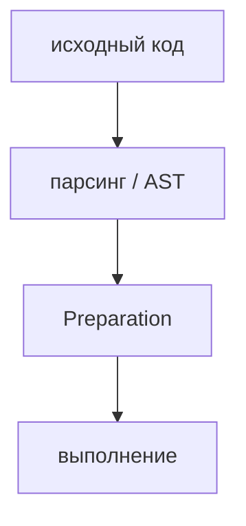

Но preparation не абстрактна. Engine должен подготовить внутреннюю рабочую среду:

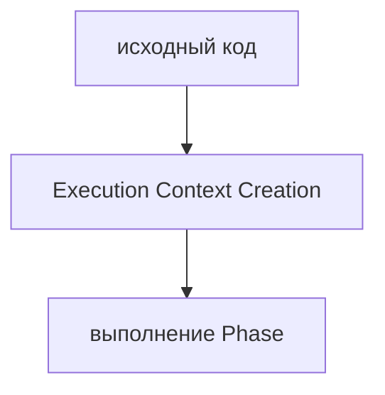

Что engine делает прямо сейчас:

```text
Engine не выполняет пользовательские действия.
Engine создает место, где выполнение будет происходить.
```

Эта идея меняет всю модель JavaScript. Строки не начинают выполняться в момент, когда engine увидел текст. Перед этим создается Execution Context.

### Пустая комната перед выполнением

Первая ментальная модель — пустая комната.

До выполнения кода engine как будто входит в пустую комнату. В комнате еще нет подготовленных имен, значений и правил текущего выполнения.

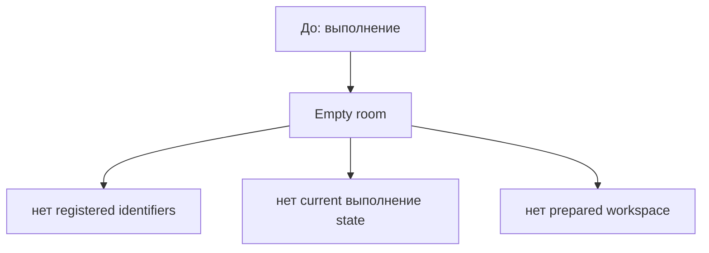

Чтобы начать работу, engine должен подготовить комнату:

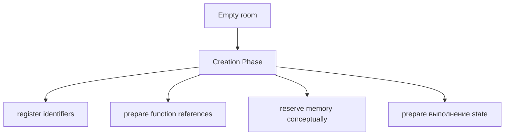

Identifier — это имя, по которому код обращается к чему-то, например к функции или переменной; подробности имен и Scope будут изучаться позже.

Memory allocation в этой главе объясняется на высоком уровне: engine подготавливает внутренние места для данных и ссылок. Подробная модель Stack, Heap и References будет изучаться позже.

### Что такое Execution Context

Теперь можно ввести термин.

Execution Context — это внутренняя рабочая среда, которую engine создает для выполнения кода.

В ней engine хранит информацию, необходимую для текущего выполнения:

* какие имена зарегистрированы;
* какие функции доступны;
* какие переменные подготовлены;
* какой код сейчас выполняется;
* с каким runtime окружением связан текущий запуск.

Упрощенная схема:

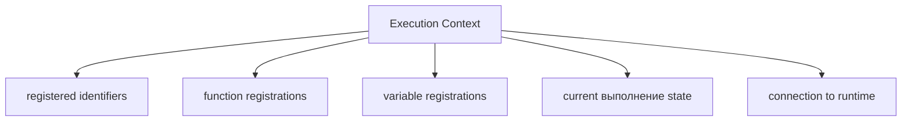

Что engine делает прямо сейчас:

```text
Engine создает рабочую среду.
Engine готовит информацию, без которой строки кода нельзя выполнять предсказуемо.
```

### Почему Execution Context существует

Сначала снова посмотрим на проблему, которую нужно объяснить.

```javascript
showMessage();

function showMessage() {
  console.log('Ready');
}
```

Наблюдаемое поведение:

```text
Ready
```

Проблема:

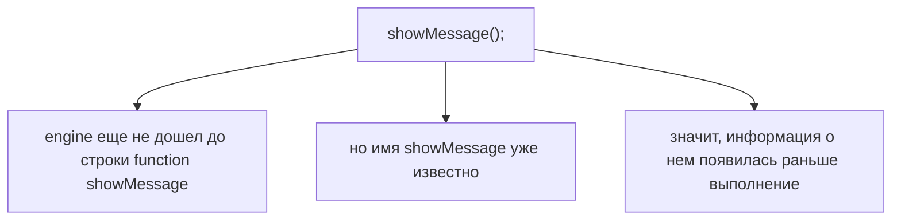

Если engine может использовать имя до того, как выполнение дошло до объявления, значит перед выполнением уже существовала некоторая внутренняя подготовленная информация.

Эта информация не может висеть в воздухе. Ей нужна рабочая среда.

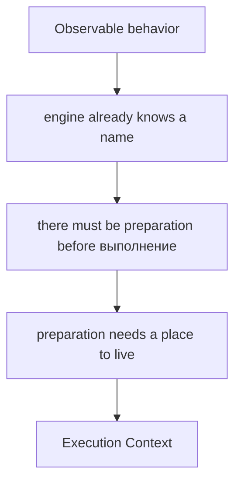

JavaScript-код не состоит только из действий. В нем есть имена, объявления, обращения, вложенные вызовы и границы выполнения.

Engine должен ответить на вопросы до и во время выполнения:

* какие имена существуют в текущем коде;
* какие функции можно вызвать;
* какие переменные уже зарегистрированы;
* где выполнять текущую строку;
* что происходит при вызове функции;
* что удалить после завершения функции.

Без Execution Context engine не имел бы организованного места для этих данных.

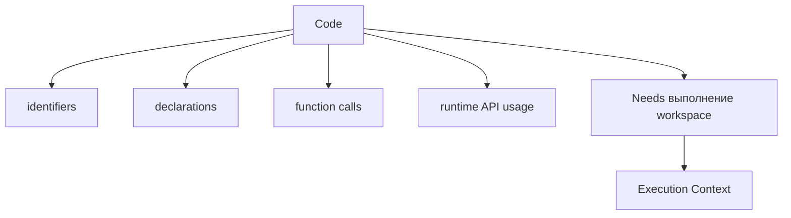

Что engine делает прямо сейчас:

```text
Engine создает не просто "память".
Engine создает модель текущего выполнения.
```

### Почему JavaScript не может выполнять код без Execution Context

Представьте строку:

```javascript
showMessage();
```

Чтобы выполнить ее, engine должен знать:

* существует ли имя `showMessage`;
* чем это имя является;
* можно ли его вызвать;
* где находится код функции;
* что делать после завершения вызова.

Эти ответы должны где-то храниться.

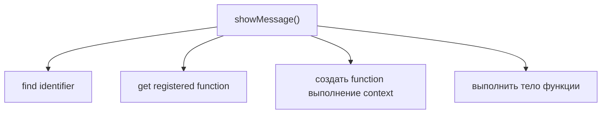

Call Stack — механизм, который управляет порядком активных function calls; он будет изучаться в следующей главе. В этой главе важно только то, что каждый вызов функции получает свой Execution Context.

### Creation phase

Creation phase — этап создания Execution Context до выполнения строк кода.

На этом этапе engine подготавливает комнату:

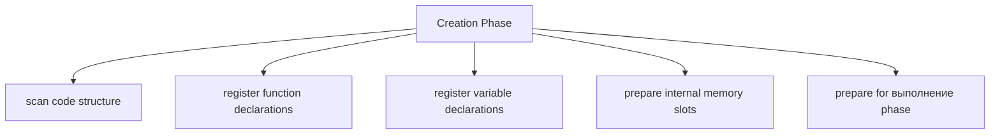

Scan code structure здесь означает, что engine работает с уже разобранной структурой программы, а не просто читает текст как человек.

Что engine делает прямо сейчас:

```text
Engine еще не выполняет console.log.
Engine еще не выполняет пользовательские вычисления.
Engine регистрирует то, что понадобится во время execution.
```

Рассмотрим более конкретный пример.

```javascript
function greet() {}

let user;

user = 'John';
```

На уровне исходного кода читатель видит три строки. На уровне engine это два разных этапа.

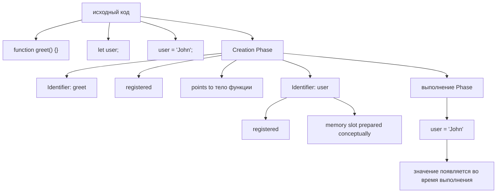

Это концептуальная схема. Она не описывает Stack, Heap или точное устройство памяти engine. Она показывает главное: engine сначала готовит имена и внутренние записи, а затем выполняет присваивание.

Что engine делает прямо сейчас:

```text
Engine видит объявление функции.
Engine регистрирует имя greet.
Engine видит объявление переменной.
Engine регистрирует имя user.
Engine готовит место для будущего значения.
Engine еще не присваивает 'John'.
```

### Registration before usage

Ключевая идея:

```text
Регистрация происходит до выполнения.
Использование происходит во время выполнения.
```

Схема:

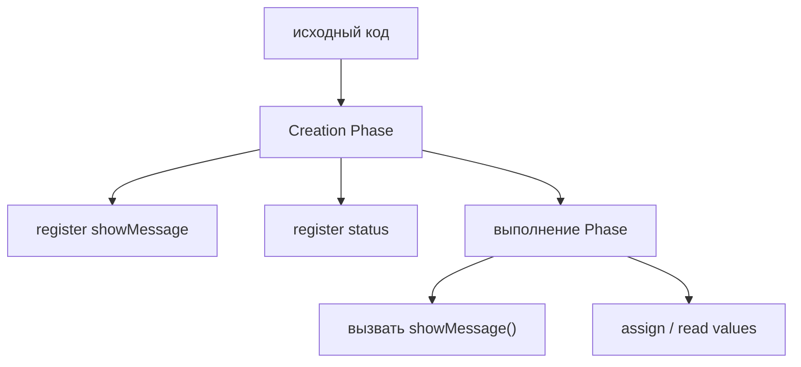

Это объясняет, почему некоторые имена уже известны engine до того, как execution дошел до строки объявления.

Важно:

```text
Это не полное объяснение hoisting.
Hoisting будет отдельной главой.
Сейчас важно понять фундамент: перед execution есть регистрация.
```

### Function registration

Function declaration регистрируется во время creation phase.

Function declaration — синтаксис объявления функции через `function name() { ... }`; подробная глава о функциях будет позже.

Пример:

```javascript
showMessage();

function showMessage() {
  console.log('Ready');
}
```

Упрощенная модель:

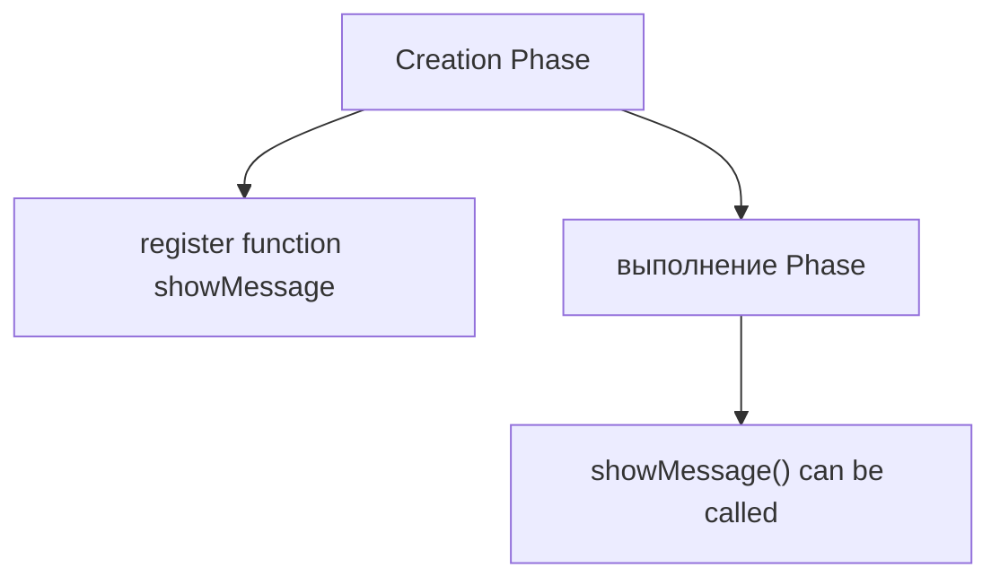

Что engine делает прямо сейчас:

```text
Engine запоминает, что имя showMessage связано с функцией.
Execution еще не начался.
```

Это не значит, что каждая форма создания функции ведет себя одинаково. Function Expression и Arrow Function будут изучаться позже.

### Variable registration

Variable declaration тоже регистрируется во время creation phase.

Variable declaration — объявление имени переменной; подробности `var`, `let`, `const`, TDZ и различий между ними будут изучаться в отдельных главах.

На высоком уровне:

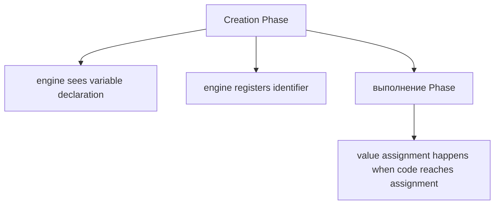

Assignment — присваивание значения имени; подробно будет изучаться в главе про variables.

Сейчас важно не запоминать правила конкретных ключевых слов, а удержать общий механизм:

```text
Имя может быть зарегистрировано до выполнения строки.
Значение может появиться позже во время execution.
```

### Memory allocation на высоком уровне

Когда engine регистрирует функции и переменные, ему нужно подготовить внутреннее место для этих данных.

В этой главе мы используем концептуальную схему:

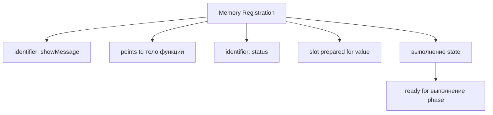

Это не подробная модель Stack и Heap. Stack, Heap и References будут изучаться позже. Здесь достаточно понимать, что Execution Context содержит подготовленные записи, с которыми engine будет работать.

Что engine делает прямо сейчас:

```text
Engine создает внутренние записи.
Engine готовит имена к будущему использованию.
```

Еще одна схема показывает сам переход от регистрации к появлению значения:

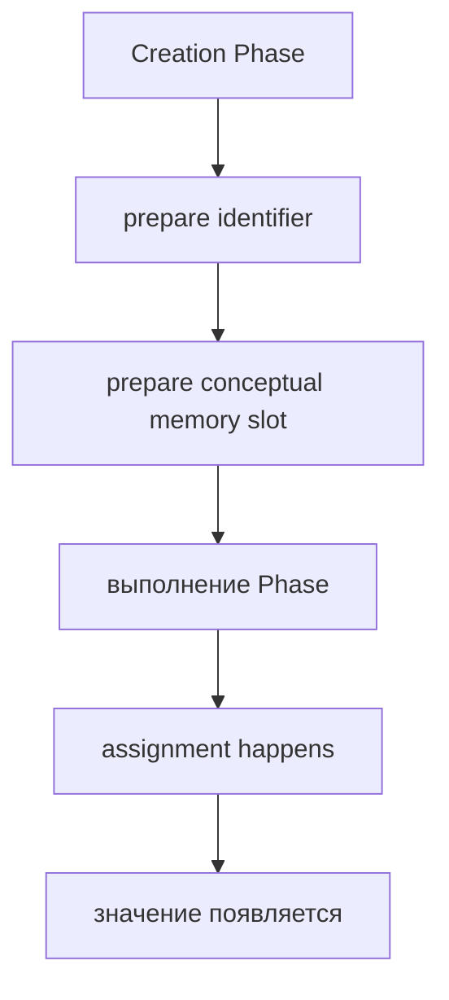

Для переменной `user` это можно представить так:

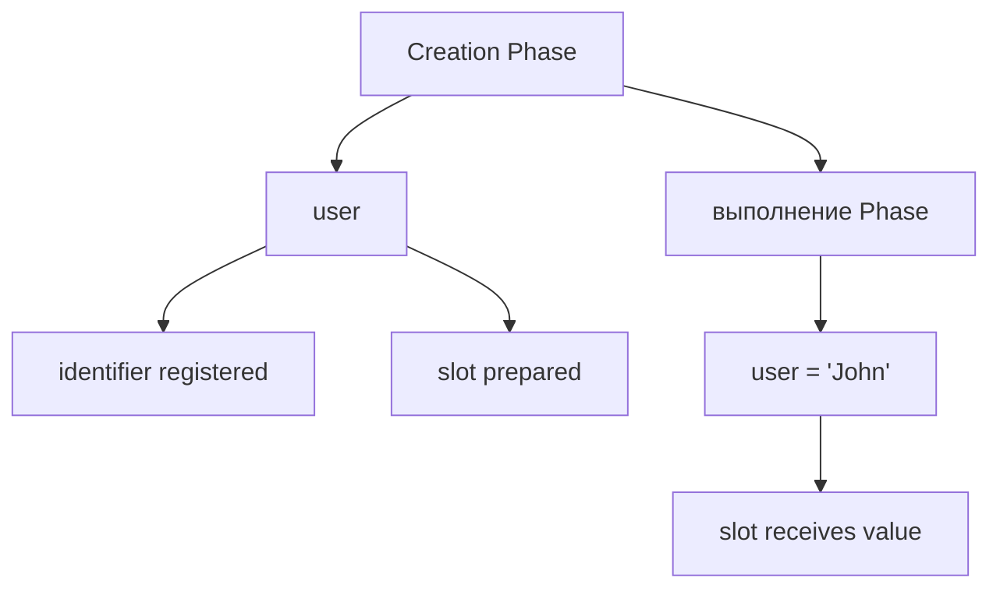

Важно:

```text
Подготовить место для значения
не означает уже выполнить присваивание.
```

### Execution phase

Execution phase — этап, на котором engine начинает выполнять код.

Теперь engine идет по подготовленной программе и выполняет действия:

* читает значения;
* выполняет присваивания;
* вызывает функции;
* обращается к runtime API;
* создает новые Function Execution Context при вызовах функций.

Схема:

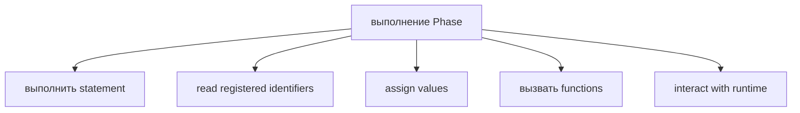

Statement — инструкция программы; подробно инструкции будут разбираться постепенно.

Что engine делает прямо сейчас:

```text
Engine уже использует подготовленную комнату.
Engine выполняет код внутри Execution Context.
```

### Global Execution Context

Global Execution Context создается для запуска файла или script.

В Node.js один файл запускается внутри своего модульного окружения, но для ментальной модели этой главы можно считать, что сначала появляется верхний контекст выполнения файла.

Modules — система разделения кода по файлам; подробности modules будут изучаться позже.

Схема:

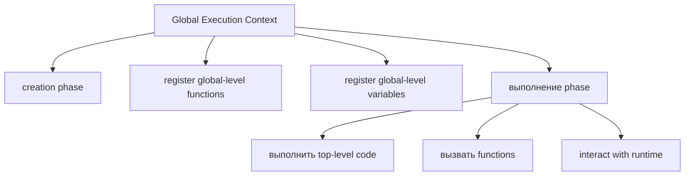

Top-level code — код, который находится не внутри функции; подробности границ выполнения будут уточняться в следующих главах.

Что engine делает прямо сейчас:

```text
Engine создает основной рабочий контекст файла.
Без него выполнение файла не начнется.
```

### Function Execution Context

Каждый вызов функции создает новый Function Execution Context.

Важно: контекст создается не просто потому, что функция объявлена. Он создается при вызове функции.

```javascript
function printMessage() {
  console.log('Message');
}

printMessage();
```

Схема:

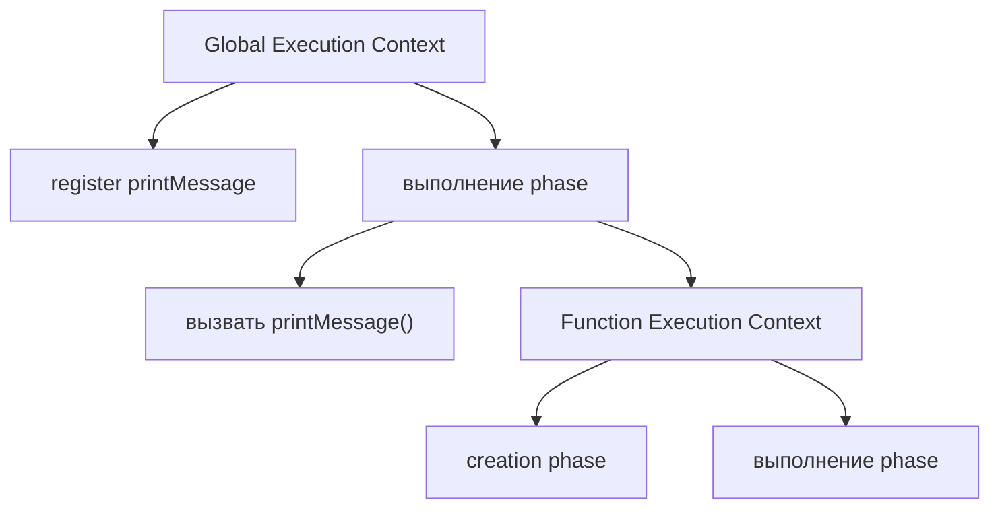

Что engine делает прямо сейчас:

```text
Engine видит function call.
Engine создает отдельную рабочую комнату для этого вызова.
```

### Один вызов функции — один Execution Context

Если функция вызывается два раза, создаются два отдельных Function Execution Context.

```mermaid
flowchart TD
    N1["вызвать helper()"]
    N2["Function Execution Context #1"]
    N3["finish and disappear"]
    N4["вызвать helper()"]
    N5["Function Execution Context #2"]
    N6["finish and disappear"]
    N1 --> N2
    N2 --> N3
    N3 --> N4
    N4 --> N5
    N5 --> N6
```

Это критично для helpers и utilities. Один и тот же код функции может выполняться много раз, но каждый вызов получает собственную временную среду выполнения.

Utility — переиспользуемая вспомогательная функция или модуль; подробно архитектура utilities будет обсуждаться в Automation QA-разделе.

### Nested execution contexts

Если функция вызывает другую функцию, contexts становятся вложенными во времени.

```javascript
function outer() {
  inner();
}

function inner() {
  console.log('Inner');
}

outer();
```

Упрощенная схема:

```mermaid
flowchart TD
    N1["Global Execution Context"]
    N2["вызвать outer()"]
    N3["Function Execution Context: outer"]
    N4["вызвать inner()"]
    N5["Function Execution Context: inner"]
    N1 --> N2
    N1 --> N3
    N3 --> N4
    N3 --> N5
```

Call Stack подробно объяснит порядок входа и выхода из таких contexts в следующей главе. Здесь важно увидеть сам факт: вызов внутри вызова создает новый контекст.

### Lifecycle Execution Context

Lifecycle Execution Context:

```mermaid
flowchart TD
    N1["Context Lifecycle"]
    N2["create"]
    N3["creation phase"]
    N4["выполнение phase"]
    N5["complete"]
    N6["disappear"]
    N1 --> N2
    N1 --> N3
    N1 --> N4
    N1 --> N5
    N1 --> N6
```

Для Global Execution Context lifecycle длится весь запуск файла.

Для Function Execution Context lifecycle обычно короче: контекст появляется при вызове функции и исчезает после завершения вызова.

```mermaid
flowchart TD
    N1["вызов функции starts"]
    N2["Function Execution Context появляется"]
    N3["Function code выполняется"]
    N4["Function возвращает / завершается"]
    N5["Function Execution Context исчезает"]
    N1 --> N2
    N2 --> N3
    N3 --> N4
    N4 --> N5
```

Return — завершение функции с результатом; подробно `return` будет изучаться в разделе Functions.

### Execution Context hierarchy

Execution contexts можно представить как иерархию активного выполнения.

```mermaid
flowchart TD
    N1["Execution Context hierarchy"]
    N2["Global Context"]
    N3["Function Context: setup"]
    N4["Function Context: readConfig"]
    N5["Function Context: runTest"]
    N6["Function Context: createUser"]
    N1 --> N2
    N1 --> N3
    N1 --> N4
    N1 --> N5
    N1 --> N6
```

Это не полная модель Call Stack. Здесь схема показывает отношение "кто вызвал кого" на уровне contexts. Call Stack объяснит, как engine управляет этим порядком технически.

### Relationship with Runtime

Execution Context принадлежит работе engine, но код внутри него может обращаться к runtime.

```mermaid
flowchart TD
    N1["Execution Context"]
    N2["engine выполняется code"]
    N3["code calls runtime API"]
    N4["Runtime"]
    N5["console"]
    N6["process"]
    N7["timers"]
    N8["environment APIs"]
    N1 --> N2
    N1 --> N3
    N1 --> N4
    N4 --> N5
    N4 --> N6
    N4 --> N7
    N4 --> N8
```

Runtime не заменяет Execution Context. Runtime предоставляет внешние возможности. Execution Context — внутренняя рабочая среда выполнения кода.

Что engine делает прямо сейчас:

```text
Engine выполняет код внутри context.
Если код обращается к console, runtime выводит результат.
```

### Текущее место главы в модели JavaScript

Теперь общая модель стала глубже:

```mermaid
flowchart TD
    N1["исходный код"]
    N2["парсинг / AST"]
    N3["Execution Context Creation"]
    N4["Creation Phase"]
    N5["выполнение Phase"]
    N6["Runtime Interaction"]
    N1 --> N2
    N2 --> N3
    N3 --> N4
    N4 --> N5
    N5 --> N6
```

В предыдущей главе мы остановились на переходе к execution. В этой главе мы открыли внутреннюю дверь: execution происходит не в пустоте, а внутри Execution Context.

### Engine timeline

С точки зрения engine глава выглядит как timeline подготовки и выполнения.

```mermaid
flowchart TD
    N1["Engine timeline"]
    N2["receive prepared code structure"]
    N3["создать Global Execution Context"]
    N4["run creation phase"]
    N5["run выполнение phase"]
    N6["создать Function Execution Context on call"]
    N7["finish Function Execution Context"]
    N8["продолжить or finish Global Execution Context"]
    N1 --> N2
    N1 --> N3
    N1 --> N4
    N1 --> N5
    N1 --> N6
    N1 --> N7
    N1 --> N8
```

Что engine делает прямо сейчас:

```text
Engine движется не по "строкам текста",
а по этапам подготовки и выполнения.
```

### Program timeline

С точки зрения программы timeline проще:

```mermaid
flowchart TD
    N1["Program timeline"]
    N2["file starts"]
    N3["global context is prepared"]
    N4["top-level code runs"]
    N5["function is called"]
    N6["function context runs"]
    N7["function завершается"]
    N8["file завершается"]
    N1 --> N2
    N1 --> N3
    N1 --> N4
    N1 --> N5
    N1 --> N6
    N1 --> N7
    N1 --> N8
```

Обе timeline описывают один процесс, но с разных сторон. Engine timeline показывает внутреннюю работу. Program timeline показывает наблюдаемое движение программы.

### Engine diary

Теперь представим тот же процесс как короткий дневник engine.

```mermaid
flowchart TD
    N1["Engine Diary"]
    N2["&quot;Я получил подготовленную структуру программы.&quot;"]
    N3["&quot;Я создаю Global Execution Context.&quot;"]
    N4["&quot;Я начинаю creation phase.&quot;"]
    N5["&quot;Я нашел function declaration.&quot;"]
    N6["&quot;Я регистрирую функцию.&quot;"]
    N7["&quot;Я нашел variable declaration.&quot;"]
    N8["&quot;Я подготавливаю место для значения.&quot;"]
    N9["&quot;Подготовка завершена.&quot;"]
    N10["&quot;Я начинаю выполнение phase.&quot;"]
    N11["&quot;Я выполняю первую инструкцию.&quot;"]
    N12["&quot;Я вижу вызов функции.&quot;"]
    N13["&quot;Я создаю Function Execution Context.&quot;"]
    N14["&quot;Я выполняю тело функции.&quot;"]
    N15["&quot;Function Context завершен.&quot;"]
    N16["&quot;Я продолжаю выполнение внешнего context.&quot;"]
    N1 --> N2
    N1 --> N3
    N1 --> N4
    N1 --> N5
    N1 --> N6
    N1 --> N7
    N1 --> N8
    N1 --> N9
    N1 --> N10
    N1 --> N11
    N1 --> N12
    N1 --> N13
    N1 --> N14
    N1 --> N15
    N1 --> N16
```

Этот дневник не является реальным логом V8. Это учебная модель, которая помогает мысленно симулировать процесс.

Если читать код с таким дневником, становится легче отделять подготовку от выполнения:

```mermaid
flowchart TD
    N1["До выполнение:"]
    N2["engine регистрирует и готовит"]
    N3["Во время выполнение:"]
    N4["engine читает, присваивает, вызывает и завершает"]
    N1 --> N2
    N1 --> N3
    N3 --> N4
```

### End-to-end timeline

Теперь соединим предыдущую главу и текущую в один большой фильм.

```mermaid
flowchart TD
    N1["node app.js"]
    N2["Node.js Runtime"]
    N3["finds app.js"]
    N4["reads исходный код"]
    N5["passes code to engine"]
    N6["JavaScript Engine"]
    N7["лексический анализ"]
    N8["исходный код → токены"]
    N9["парсер"]
    N10["токены → AST"]
    N11["AST"]
    N12["structured program"]
    N13["Global Execution Context"]
    N14["Creation Phase"]
    N15["register functions"]
    N16["register variables"]
    N17["prepare conceptual memory slots"]
    N18["выполнение Phase"]
    N19["выполнить top-level code"]
    N20["assign values"]
    N21["вызвать functions"]
    N22["вызов функции"]
    N23["создает Function Execution Context"]
    N24["Creation Phase"]
    N25["выполнение Phase"]
    N26["Function Context завершается"]
    N27["выполнение continues in outer context"]
    N28["Program ends"]
    N1 --> N2
    N2 --> N3
    N2 --> N4
    N2 --> N5
    N2 --> N6
    N6 --> N7
    N6 --> N8
    N6 --> N9
    N6 --> N10
    N6 --> N11
    N6 --> N12
    N6 --> N13
    N6 --> N14
    N6 --> N15
    N6 --> N16
    N6 --> N17
    N6 --> N18
    N6 --> N19
    N6 --> N20
    N6 --> N21
    N6 --> N22
    N6 --> N23
    N6 --> N24
    N6 --> N25
    N6 --> N26
    N6 --> N27
    N6 --> N28
```

Это схема, которую стоит держать в голове при чтении следующих глав. Scope, Call Stack, Hoisting и Event Loop будут добавлять новые слои к этому фильму, но не отменят его.

### Переход к Call Stack

После этой главы возникает следующий вопрос:

> Если каждый вызов функции создает Execution Context, как engine управляет несколькими активными contexts?

Ответ будет в следующей главе: Call Stack.

```mermaid
flowchart TD
    N1["вызов функции"]
    N2["Function Execution Context"]
    N3["How does engine track active contexts?"]
    N4["Call Stack"]
    N1 --> N2
    N2 --> N3
    N3 --> N4
```

Call Stack — механизм, который хранит порядок активных вызовов; подробно он будет изучаться сразу после этой главы.

---

## Внутренний механизм

Внутренний механизм Execution Context состоит из двух крупных фаз.

```mermaid
flowchart TD
    N1["Execution Context"]
    N2["Creation Phase"]
    N3["register identifiers"]
    N4["register functions"]
    N5["register variables"]
    N6["prepare memory conceptually"]
    N7["выполнение Phase"]
    N8["выполнить statements"]
    N9["assign values"]
    N10["вызвать functions"]
    N11["interact with runtime"]
    N1 --> N2
    N1 --> N3
    N1 --> N4
    N1 --> N5
    N1 --> N6
    N1 --> N7
    N7 --> N8
    N7 --> N9
    N7 --> N10
    N7 --> N11
```

Creation phase отвечает за подготовку.

Execution phase отвечает за выполнение.

Если код вызывает функцию, engine повторяет тот же принцип:

```mermaid
flowchart TD
    N1["Global Execution Context"]
    N2["вызвать function"]
    N3["Function Execution Context"]
    N4["Creation Phase"]
    N5["выполнение Phase"]
    N1 --> N2
    N1 --> N3
    N3 --> N4
    N3 --> N5
```

Это рекурсивная идея: выполнение функции не является исключением. Для каждого вызова создается свой контекст.

Recursion — ситуация, когда функция вызывает сама себя; подробно она будет изучаться в главе про Call Stack и функции.

---

## Ментальная модель

Главная модель главы — подготовленная рабочая комната.

```mermaid
flowchart TD
    N1["Empty room"]
    N2["Prepare room"]
    N3["register names"]
    N4["place function blueprints"]
    N5["reserve slots"]
    N6["connect runtime tools"]
    N7["Work starts"]
    N8["read names"]
    N9["assign values"]
    N10["вызвать functions"]
    N11["use runtime"]
    N12["Room disappears when work is done"]
    N1 --> N2
    N2 --> N3
    N2 --> N4
    N2 --> N5
    N2 --> N6
    N2 --> N7
    N7 --> N8
    N7 --> N9
    N7 --> N10
    N7 --> N11
    N7 --> N12
```

Для global-кода комната живет весь запуск файла.

Для функции комната появляется на время вызова.

```mermaid
flowchart TD
    N1["Global room"]
    N2["exists while file runs"]
    N3["can создать function rooms"]
    N4["Function room"]
    N5["appears on call"]
    N6["выполняется тело функции"]
    N7["disappears after completion"]
    N1 --> N2
    N1 --> N3
    N1 --> N4
    N4 --> N5
    N4 --> N6
    N4 --> N7
```

Если вы можете смотреть на код и мысленно говорить "сейчас создается global context", "сейчас регистрируется функция", "сейчас началась execution phase", "сейчас вызов создает function context", значит модель работает.

---

## Примеры кода

Примеры к этой главе находятся в папке:

```text
examples/01-javascript/chapter-03/
```

Запускайте их из корня проекта.

### Пример 1. Global Context

Файл:

```text
examples/01-javascript/chapter-03/01-global-context.js
```

Этот пример показывает top-level выполнение: engine создает Global Execution Context и выполняет строки файла.

### Пример 2. Function Context

Файл:

```text
examples/01-javascript/chapter-03/02-function-context.js
```

Пример показывает, что при вызове функции создается отдельный Function Execution Context.

### Пример 3. Nested Contexts

Файл:

```text
examples/01-javascript/chapter-03/03-nested-contexts.js
```

Пример показывает вложенный вызов: одна функция вызывает другую.

### Пример 4. Context Lifecycle

Файл:

```text
examples/01-javascript/chapter-03/04-context-lifecycle.js
```

Пример показывает появление и завершение function context через наблюдаемый вывод.

### Пример 5. Registration Before Execution

Файл:

```text
examples/01-javascript/chapter-03/05-registration-before-execution.js
```

Пример показывает, что function declaration может быть вызвана до строки объявления, потому что регистрация произошла во время creation phase.

### Пример 6. Common Mistake

Файл:

```text
examples/01-javascript/chapter-03/06-common-mistake.js
```

Пример показывает ошибку ожидания "переменная появляется только когда execution дошел до строки". Детали `var` будут разобраны позже, но уже сейчас видно, что подготовка происходит до выполнения.

---

## Частые вопросы

### Execution Context — это то же самое, что Scope?

Нет.

Scope описывает доступность имен, а Execution Context — рабочую среду выполнения. Scope будет подробно изучаться в отдельной главе.

### Execution Context — это то же самое, что Call Stack?

Нет.

Execution Context — рабочая среда выполнения. Call Stack — механизм управления активными contexts. Call Stack будет следующей главой.

### Можно ли увидеть Execution Context напрямую?

Нет, обычный JavaScript-код не дает прямой доступ к внутреннему Execution Context. Мы наблюдаем его через поведение программы и ошибки.

### Creation phase — это hoisting?

Не совсем.

Hoisting — наблюдаемое поведение, связанное с тем, как declarations обрабатываются до execution. Подробная глава о Hoisting будет позже.

### Function Context создается при объявлении функции?

Нет.

Function Context создается при вызове функции. Объявление функции регистрируется во время creation phase, но вызов создает отдельную рабочую среду.

---

## Распространенные мифы

### Миф 1. JavaScript выполняется строка за строкой

Реальность:

Перед выполнением строк engine создает Execution Context и выполняет creation phase.

### Миф 2. Переменные появляются только когда execution дошел до строки

Реальность:

Имена переменных регистрируются во время creation phase. Значения могут появляться позже, во время execution phase. Детали зависят от `var`, `let` и `const`, которые будут изучаться позже.

### Миф 3. Функции создаются только когда execution дошел до объявления

Реальность:

Function declarations регистрируются во время creation phase. Другие способы создания функций будут изучаться в разделе Functions.

### Миф 4. Execution начинается сразу после чтения файла

Реальность:

После чтения и parsing engine создает Execution Context, проходит creation phase и только затем переходит к execution phase.

---

## Типичные ошибки

### Ошибка 1. Объяснять поведение только порядком строк

Неправильная модель:

```text
Engine дошел до строки.
Только теперь он узнал, что имя существует.
```

Что произошло:

Пропущена creation phase.

Исправленная модель:

```mermaid
flowchart TD
    N1["Creation Phase"]
    N2["register identifiers"]
    N3["выполнение Phase"]
    N4["use identifiers"]
    N1 --> N2
    N1 --> N3
    N3 --> N4
```

### Ошибка 2. Считать, что один function declaration сразу создает Function Context

Что произошло:

Перепутаны регистрация функции и вызов функции.

Исправленная модель:

```mermaid
flowchart TD
    N1["function declaration"]
    N2["registered in current context"]
    N3["вызов функции"]
    N4["создает Function Execution Context"]
    N1 --> N2
    N1 --> N3
    N3 --> N4
```

### Ошибка 3. Смешивать Execution Context и runtime

Что произошло:

`console.log` или `process` воспринимаются как часть Execution Context.

Исправленная модель:

```mermaid
flowchart TD
    N1["Execution Context"]
    N2["engine выполняется code"]
    N3["Runtime API"]
    N4["console / process / timers"]
    N1 --> N2
    N1 --> N3
    N3 --> N4
```

### Ошибка 4. Углубляться в Call Stack раньше времени

Что произошло:

При первом знакомстве с Execution Context читатель пытается сразу объяснить весь порядок вложенных вызовов через Call Stack.

Исправленный подход:

Сначала понять, что каждый вызов создает Function Execution Context. Как эти contexts управляются технически, будет объяснено в следующей главе.

---

## Практическое использование

Когда вы читаете JavaScript-файл, полезно делать два прохода.

Первый проход — мысленный creation phase:

```text
1. Какие функции объявлены?
2. Какие переменные объявлены?
3. Какие имена будут зарегистрированы?
4. Какие function calls появятся позже?
```

Второй проход — мысленный execution phase:

```text
1. Какая строка выполняется первой?
2. Какие зарегистрированные имена используются?
3. Где создается Function Execution Context?
4. Когда context завершается?
5. Где есть runtime interaction?
```

Это не заменяет debugger. Debugger — инструмент пошагового выполнения программы; подробно он будет изучаться позже. Но такая модель помогает читать код до запуска.

Чек-лист готовности к Call Stack:

```text
✓ Я понимаю creation phase.
✓ Я понимаю execution phase.
✓ Я отличаю регистрацию функции от вызова функции.
✓ Я понимаю, что вызов функции создает Function Execution Context.
✓ Я понимаю, что nested calls создают nested contexts.
```

---

## Использование в Automation QA

Execution Context напрямую помогает в Automation QA.

### Отладка Playwright tests

Playwright-тест — это JavaScript или TypeScript-код, который выполняется в Node.js context и управляет браузером.

Если helper вызывается внутри теста, у helper будет свой Function Execution Context.

```mermaid
flowchart TD
    N1["Test file context"]
    N2["test callback context"]
    N3["helper function context"]
    N1 --> N2
    N2 --> N3
```

Callback — функция, переданная как значение для выполнения позже; подробно callbacks будут изучаться в async-разделе.

### Helper functions

Helper-функция не "делит" один контекст на все вызовы. Каждый вызов получает собственный Function Execution Context.

Это помогает понимать, почему локальные временные данные одного вызова не должны автоматически смешиваться с другим вызовом.

### Fixtures

Fixture часто готовит состояние для теста. Внутри fixture вызываются функции, создаются данные, используются helpers.

Если fixture падает, stack trace часто показывает цепочку вызовов. Stack trace — текстовое описание пути вызовов до ошибки; подробно он будет связан с Call Stack в следующей главе.

### Page Objects

Page Object — класс или объект, который группирует действия со страницей; подробно Page Object будет изучаться в Automation QA-разделе.

Методы Page Object при вызове создают function execution contexts. Это помогает понимать, где возникла ошибка: в тесте, helper или методе Page Object.

### Reusable utilities

Utility может вызываться из разных тестов. Один и тот же код функции выполняется в разных function contexts.

```mermaid
flowchart TD
    N1["test A"]
    N2["utility()"]
    N3["Function Context #1"]
    N4["test B"]
    N5["utility()"]
    N6["Function Context #2"]
    N1 --> N2
    N2 --> N3
    N1 --> N4
    N4 --> N5
    N5 --> N6
```

### Reading runtime errors

Если ошибка возникла внутри helper, важно понять:

```mermaid
flowchart TD
    N1["Global / test context"]
    N2["helper context"]
    N3["nested utility context"]
    N4["runtime error"]
    N1 --> N2
    N2 --> N3
    N3 --> N4
```

Такой взгляд готовит к чтению stack traces и к следующей главе про Call Stack.

---

## Итоги

Execution Context — внутренняя рабочая среда, которую engine создает для выполнения кода.

JavaScript не выполняет код в пустоте. Перед execution engine создает context, проходит creation phase, регистрирует функции и переменные на высоком уровне, подготавливает внутренние записи, а затем переходит к execution phase.

Global Execution Context создается для верхнего уровня запуска. Function Execution Context создается при каждом вызове функции. Если функция вызывает другую функцию, появляется новый context. После завершения вызова function context исчезает.

Эта глава не объясняла Call Stack, Scope Chain, Closures, Hoisting implementation, Event Loop или async. Они будут изучаться отдельно. Но теперь у вас есть фундамент: выполнение JavaScript происходит внутри Execution Context, а не просто "по строкам".

Следующая глава объяснит Call Stack — механизм, который управляет активными execution contexts.

---

## Что нужно запомнить

✓ Execution Context — рабочая среда выполнения кода.

✓ JavaScript не выполняется без Execution Context.

✓ Creation phase происходит до execution phase.

✓ Во время creation phase engine регистрирует функции и переменные на высоком уровне.

✓ Function declaration регистрируется до execution.

✓ Variable declaration регистрирует имя до выполнения присваивания.

✓ Global Execution Context создается для верхнего уровня запуска.

✓ Function Execution Context создается при вызове функции.

✓ Один вызов функции создает один Function Execution Context.

✓ Function Context появляется при вызове и исчезает после завершения.

---

## Проверьте себя

1. Почему JavaScript не может выполнять код без Execution Context?

2. Что происходит во время creation phase?

3. Что происходит во время execution phase?

4. Чем регистрация функции отличается от вызова функции?

5. Когда создается Function Execution Context?

6. Что происходит с Function Execution Context после завершения вызова?

7. Чем Execution Context отличается от runtime?

8. Почему модель Execution Context помогает читать stack traces?

9. Какая тема логически следует после Execution Context?

---

## Практика

Практика к этой главе находится в файле:

```text
practice/01-javascript/03-execution-context.md
```

Перед практикой запустите примеры из `examples/01-javascript/chapter-03/` и попробуйте для каждого файла проговорить creation phase и execution phase.

---

## Решения

Решения находятся в файле:

```text
solutions/01-javascript/03-execution-context.md
```

Открывайте решения после самостоятельной попытки. В этой главе особенно важно сравнивать не только результат, но и ментальную симуляцию работы engine.
