# Контекст выполнения

## Связь с предыдущей главой

В предыдущей главе был разобран путь JavaScript-файла от `source code` до `execution`: engine читает текст, выполняет lexical analysis, строит AST, подготавливает код и только потом начинает выполнение.

Теперь нужно ответить на следующий вопрос:

> В какой внутренней среде engine выполняет подготовленный код?

Эта глава вводит Execution Context. Но мы не начнем с определения. Сначала посмотрим на наблюдаемое поведение JavaScript, которое невозможно хорошо объяснить без внутренней модели подготовки и выполнения.

---

## Предварительные требования

Для этой главы нужно понимать:

* что JavaScript выполняется engine внутри runtime;
* что перед execution код проходит подготовку;
* что syntax error возникает до выполнения;
* что Node.js может запускать `.js` файлы командой `node`;
* что runtime предоставляет API вроде `console`.

Не требуется знать Call Stack, Scope Chain, Closures, Event Loop или async. Эти темы будут изучаться в отдельных главах.

---

## Время изучения

Ориентировочное время:

```text
Чтение главы:            100-130 минут
Разбор схем:              40-50 минут
Запуск примеров:          25-35 минут
Практика:                 90-120 минут
Повторение материала:     30 минут
```

Уровень сложности: **L3**.

L3 означает фундаментальный уровень: глава объясняет внутреннюю модель, без которой следующие темы JavaScript будут восприниматься как набор правил.

---

## Навигация

Предыдущая глава:

```text
docs/01-javascript/02-how-javascript-works.md
```

Следующая глава:

```text
docs/01-javascript/04-call-stack.md
```

---

## Цели обучения

После изучения этой главы вы будете понимать:

* что такое Execution Context;
* почему Execution Context существует;
* почему JavaScript не может выполнять код без Execution Context;
* что происходит во время creation phase;
* что происходит во время execution phase;
* как engine регистрирует имена до выполнения строк кода;
* как на высоком уровне происходит memory allocation;
* чем отличается Global Execution Context от Function Execution Context;
* почему один вызов функции создает один новый Execution Context;
* как появляются и исчезают execution contexts;
* как nested execution contexts помогают мысленно симулировать выполнение;
* как Execution Context связан с runtime;
* почему эта модель важна для Playwright, helpers, fixtures, page objects и stack traces.

---

## Мотивация

Начнем не с определения, а с поведения.

Рассмотрите код:

```javascript
showMessage();

function showMessage() {
  console.log('Ready');
}
```

Если запустить файл, будет выведено:

```text
Ready
```

Наивная модель "JavaScript просто выполняет строки сверху вниз" не объясняет это поведение. Если engine действительно только дошел до первой строки, почему он уже знает о функции, которая записана ниже?

Теперь другой пример:

```javascript
console.log(status);

var status = 'ready';
```

В зависимости от среды и режима выполнения здесь можно увидеть не то поведение, которое ожидает новичок. Подробности `var`, `let`, `const` и hoisting будут разобраны в отдельных главах. Сейчас важна не конкретная конструкция, а общий факт:

```text
Перед выполнением строк engine уже выполняет подготовку.
```

Если у JavaScript есть подготовка до выполнения, нужно понять, где engine хранит результаты этой подготовки.

Ответ: в Execution Context.

Но правильнее думать не "Execution Context — это определение", а так:

```text
Engine не может выполнять код в пустоте.
Перед работой он создает рабочую среду.
Эта рабочая среда и есть Execution Context.
```

Главный вопрос главы:

> Что engine делает прямо сейчас?

---

## Теория

### Наблюдаемое поведение: выполнение не начинается сразу

После предыдущей главы мы знаем, что файл проходит такие этапы:

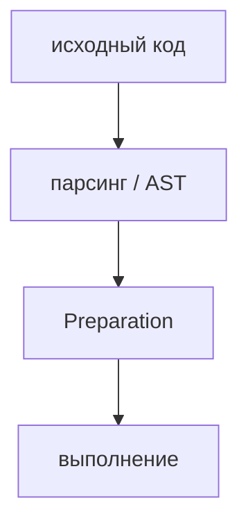
```mermaid
flowchart TD
    N1["исходный код"]
    N2["парсинг / AST"]
    N3["Preparation"]
    N4["выполнение"]
    N1 --> N2
    N2 --> N3
    N3 --> N4
```

Но подготовка не абстрактна. Движок должен подготовить внутреннюю рабочую среду:

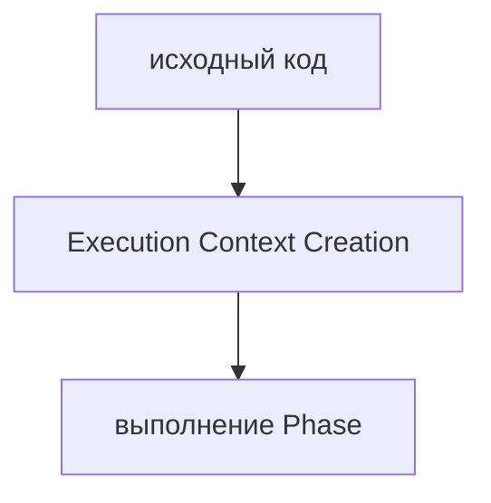
```mermaid
flowchart TD
    N1["исходный код"]
    N2["Execution Context Creation"]
    N3["выполнение Phase"]
    N1 --> N2
    N2 --> N3
```

Что движок делает прямо сейчас:

```text
Engine не выполняет пользовательские действия.
Engine создает место, где выполнение будет происходить.
```

Эта идея меняет всю модель JavaScript. Строки не начинают выполняться в момент, когда движок увидел текст. Перед этим создаётся контекст выполнения.

### Пустая комната перед выполнением

Первая ментальная модель — пустая комната.

До выполнения кода движок как будто входит в пустую комнату. В комнате ещё нет подготовленных имён, значений и правил текущего выполнения.

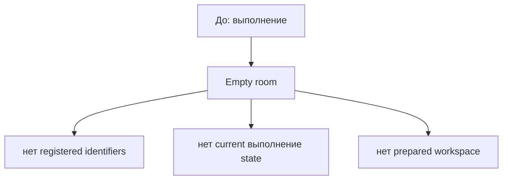
```mermaid
flowchart TD
    N1["До: выполнение"]
    N2["Empty room"]
    N3["нет registered identifiers"]
    N4["нет current выполнение state"]
    N5["нет prepared workspace"]
    N1 --> N2
    N2 --> N3
    N2 --> N4
    N2 --> N5
```

Чтобы начать работу, движок должен подготовить комнату:

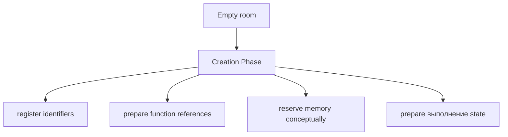
```mermaid
flowchart TD
    N1["Empty room"]
    N2["Creation Phase"]
    N3["register identifiers"]
    N4["prepare function references"]
    N5["reserve memory conceptually"]
    N6["prepare выполнение state"]
    N1 --> N2
    N2 --> N3
    N2 --> N4
    N2 --> N5
    N2 --> N6
```

Имя — это то, по чему код обращается к чему-либо, например к функции или переменной; подробности имён и области видимости будут изучаться позже.

Выделение памяти в этой главе объясняется на высоком уровне: движок подготавливает внутренние места для данных и ссылок. Подробная модель стека, кучи и ссылок будет изучаться позже.

### Что такое контекст выполнения

Теперь можно ввести термин.

Контекст выполнения — это внутренняя рабочая среда, которую движок создаёт для выполнения кода.

В ней движок хранит информацию, необходимую для текущего выполнения:

* какие имена зарегистрированы;
* какие функции доступны;
* какие переменные подготовлены;
* какой код сейчас выполняется;
* с каким окружением связан текущий запуск.

Упрощенная схема:

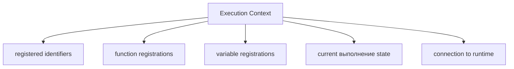
```mermaid
flowchart TD
    N1["Execution Context"]
    N2["registered identifiers"]
    N3["function registrations"]
    N4["variable registrations"]
    N5["current выполнение state"]
    N6["connection to runtime"]
    N1 --> N2
    N1 --> N3
    N1 --> N4
    N1 --> N5
    N1 --> N6
```

Что движок делает прямо сейчас:

```text
Engine создает рабочую среду.
Engine готовит информацию, без которой строки кода нельзя выполнять предсказуемо.
```

### Почему контекст выполнения существует

Сначала снова посмотрим на проблему, которую нужно объяснить.

```javascript
showMessage();

function showMessage() {
  console.log('Ready');
}
```

Наблюдаемое поведение:

```text
Ready
```

Проблема:

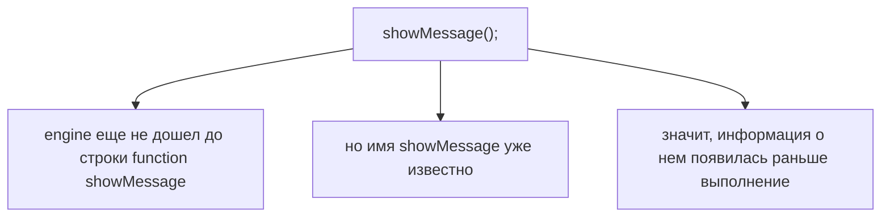
```mermaid
flowchart TD
    N1["showMessage();"]
    N2["engine еще не дошел до строки function showMessage"]
    N3["но имя showMessage уже известно"]
    N4["значит, информация о нем появилась раньше выполнение"]
    N1 --> N2
    N1 --> N3
    N1 --> N4
```

Если движок может использовать имя до того, как выполнение дошло до объявления, значит перед выполнением уже существовала некоторая подготовленная информация.

Эта информация не может висеть в воздухе. Ей нужна рабочая среда.

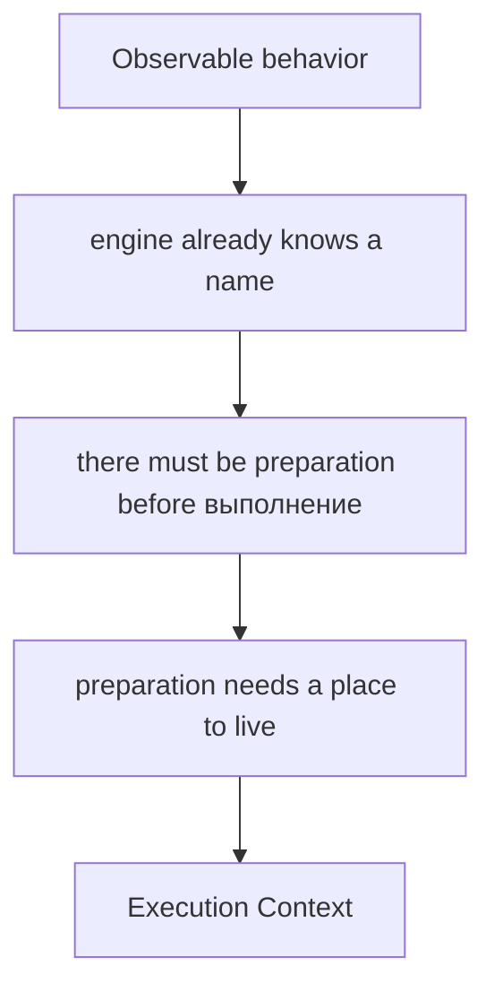
```mermaid
flowchart TD
    N1["Observable behavior"]
    N2["engine already knows a name"]
    N3["there must be preparation before выполнение"]
    N4["preparation needs a place to live"]
    N5["Execution Context"]
    N1 --> N2
    N2 --> N3
    N3 --> N4
    N4 --> N5
```

JavaScript-код не состоит только из действий. В нем есть имена, объявления, обращения, вложенные вызовы и границы выполнения.

Движок должен ответить на вопросы до и во время выполнения:

* какие имена существуют в текущем коде;
* какие функции можно вызвать;
* какие переменные уже зарегистрированы;
* где выполнять текущую строку;
* что происходит при вызове функции;
* что удалить после завершения функции.

Без контекста выполнения у движка не было бы организованного места для этих данных.

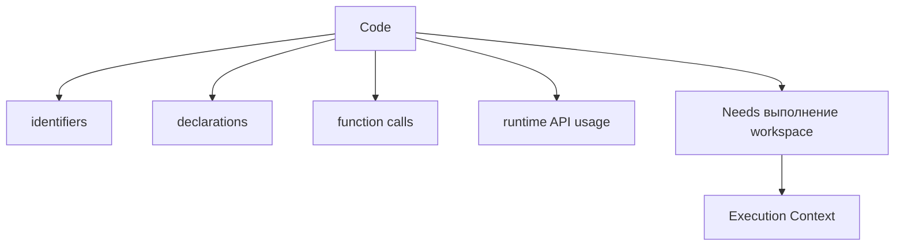
```mermaid
flowchart TD
    N1["Code"]
    N2["identifiers"]
    N3["declarations"]
    N4["function calls"]
    N5["runtime API usage"]
    N6["Needs выполнение workspace"]
    N7["Execution Context"]
    N1 --> N2
    N1 --> N3
    N1 --> N4
    N1 --> N5
    N1 --> N6
    N6 --> N7
```

Что движок делает прямо сейчас:

```text
Engine создает не просто "память".
Engine создает модель текущего выполнения.
```

### Почему JavaScript не может выполнять код без контекста выполнения

Представьте строку:

```javascript
showMessage();
```

Чтобы выполнить её, движок должен знать:

* существует ли имя `showMessage`;
* чем это имя является;
* можно ли его вызвать;
* где находится код функции;
* что делать после завершения вызова.

Эти ответы должны где-то храниться.

Стек вызовов — механизм, который управляет порядком активных вызовов функций; он будет изучаться в следующей главе. Здесь важно только то, что каждый вызов функции получает свой контекст выполнения.

### Фаза подготовки

Фаза подготовки — этап создания контекста выполнения до выполнения строк кода.

На этом этапе движок подготавливает комнату:

Просмотр структуры кода здесь означает, что движок работает с уже разобранной структурой программы, а не просто читает текст как человек.

Что движок делает прямо сейчас:

```text
Engine еще не выполняет console.log.
Engine еще не выполняет пользовательские вычисления.
Engine регистрирует то, что понадобится во время execution.
```

Рассмотрим более конкретный пример.

```javascript
function greet() {}

let user;

user = 'John';
```

На уровне исходного кода читатель видит три строки. На уровне движка это два разных этапа.

Это концептуальная схема. Она не описывает стек, кучу или точное устройство памяти движка. Она показывает главное: движок сначала готовит имена и внутренние записи, а затем выполняет присваивание.

Что движок делает прямо сейчас:

```text
Engine видит объявление функции.
Engine регистрирует имя greet.
Engine видит объявление переменной.
Engine регистрирует имя user.
Engine готовит место для будущего значения.
Engine еще не присваивает 'John'.
```

### Регистрация до использования

Ключевая идея:

```text
Регистрация происходит до выполнения.
Использование происходит во время выполнения.
```

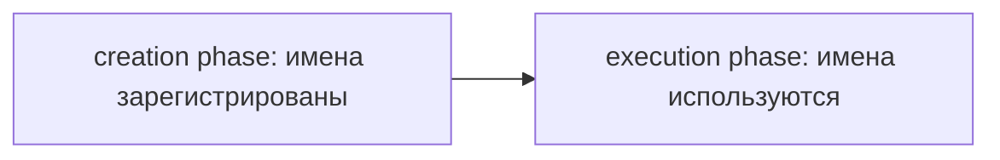
```mermaid
flowchart LR
    N1["creation phase: имена зарегистрированы"]
    N2["execution phase: имена используются"]
    N1 --> N2
```

Это объясняет, почему некоторые имена уже известны движку до того, как выполнение дошло до строки объявления.

Важно:

```text
Это не полное объяснение hoisting.
Hoisting будет отдельной главой.
Сейчас важно понять фундамент: перед execution есть регистрация.
```

### Регистрация функций

Объявление функции регистрируется во время фазы подготовки.

Объявление функции — запись вида `function name() { ... }`; подробная глава о функциях будет позже.

Пример:

```javascript
showMessage();

function showMessage() {
  console.log('Ready');
}
```

```text
до выполнения первой строки:
  showMessage — функция готова к вызову
  user        — имя зарегистрировано, значения ещё нет
```

Что движок делает прямо сейчас:

```text
Engine запоминает, что имя showMessage связано с функцией.
Execution еще не начался.
```

Это не значит, что каждая форма создания функции ведёт себя одинаково. Выражение-функция и стрелочная функция будут изучаться позже.

### Регистрация переменных

Объявление переменной тоже регистрируется во время фазы подготовки.

Объявление переменной — появление имени переменной; подробности `var`, `let`, `const`, временной мёртвой зоны и различий между ними будут изучаться в отдельных главах.

На высоком уровне:

Присваивание — запись значения в имя; подробно будет изучаться в главе про переменные.

Сейчас важно не запоминать правила конкретных ключевых слов, а удержать общий механизм:

```text
Имя может быть зарегистрировано до выполнения строки.
Значение может появиться позже во время execution.
```

### Выделение памяти на высоком уровне

Когда движок регистрирует функции и переменные, ему нужно подготовить внутреннее место для этих данных.

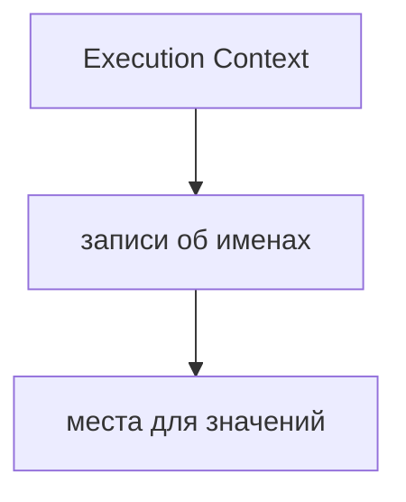
```mermaid
flowchart TD
    N1["Execution Context"]
    N2["записи об именах"]
    N3["места для значений"]
    N1 --> N2
    N2 --> N3
```

Это не подробная модель стека и кучи. Стек, куча и ссылки будут изучаться позже. Здесь достаточно понимать, что контекст выполнения содержит подготовленные записи, с которыми движок будет работать.

Что движок делает прямо сейчас:

```text
Engine создает внутренние записи.
Engine готовит имена к будущему использованию.
```

Ещё одна схема показывает сам переход от регистрации к появлению значения:


```mermaid
flowchart LR
    N1["имя зарегистрировано"]
    N2["место подготовлено"]
    N3["присваивание выполнено"]
    N1 --> N2
    N2 --> N3
```

Для переменной `user` это можно представить так: сначала появляется запись `user`, затем место под значение, и только при выполнении строки с присваиванием в нём оказывается объект.

Важно:

```text
Подготовить место для значения
не означает уже выполнить присваивание.
```

### Фаза выполнения

Фаза выполнения — этап, на котором движок начинает выполнять код.

Теперь движок идёт по подготовленной программе и выполняет действия:

* читает значения;
* выполняет присваивания;
* вызывает функции;
* обращается к API среды выполнения;
* создаёт новый контекст выполнения при вызовах функций.

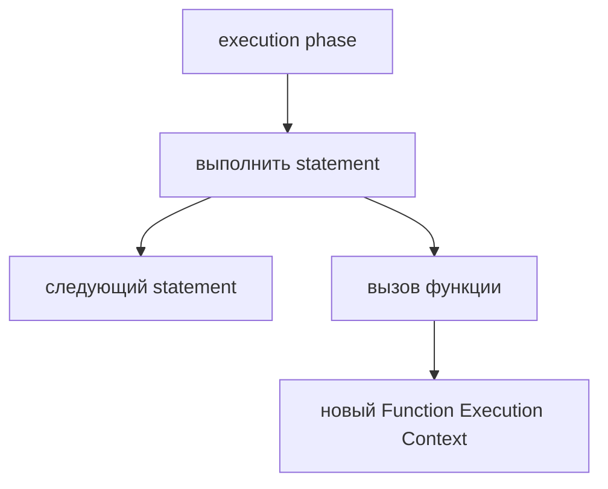
```mermaid
flowchart TD
    N1["execution phase"]
    N2["выполнить statement"]
    N3["следующий statement"]
    N4["вызов функции"]
    N5["новый Function Execution Context"]
    N1 --> N2
    N2 --> N3
    N2 --> N4
    N4 --> N5
```

Инструкция — отдельное указание программы; подробно инструкции будут разбираться постепенно.

Что движок делает прямо сейчас:

```text
Engine уже использует подготовленную комнату.
Engine выполняет код внутри Execution Context.
```

### Глобальный контекст выполнения

Глобальный контекст выполнения создаётся для запуска файла или сценария.

В Node.js один файл запускается внутри своего модульного окружения, но для ментальной модели этой главы можно считать, что сначала появляется верхний контекст выполнения файла.

Модули — система разделения кода по файлам; подробности будут изучаться позже.

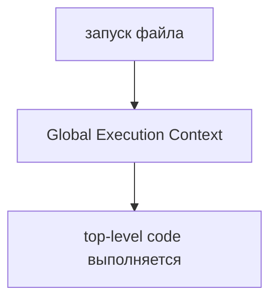
```mermaid
flowchart TD
    N1["запуск файла"]
    N2["Global Execution Context"]
    N3["top-level code выполняется"]
    N1 --> N2
    N2 --> N3
```

Код верхнего уровня — код, который находится не внутри функции; подробности границ выполнения будут уточняться в следующих главах.

Что движок делает прямо сейчас:

```text
Engine создает основной рабочий контекст файла.
Без него выполнение файла не начнется.
```

### Контекст выполнения функции

Каждый вызов функции создаёт новый контекст выполнения функции.

Важно: контекст создается не просто потому, что функция объявлена. Он создается при вызове функции.

```javascript
function printMessage() {
  console.log('Message');
}

printMessage();
```

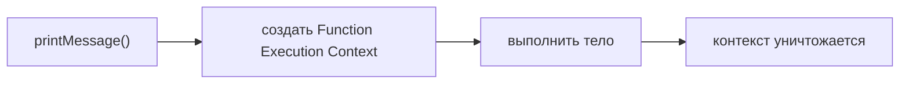
```mermaid
flowchart LR
    N1["printMessage()"]
    N2["создать Function Execution Context"]
    N3["выполнить тело"]
    N4["контекст уничтожается"]
    N1 --> N2
    N2 --> N3
    N3 --> N4
```

Что движок делает прямо сейчас:

```text
Engine видит function call.
Engine создает отдельную рабочую комнату для этого вызова.
```

### Один вызов функции — один контекст выполнения

Если функция вызывается два раза, создаются два отдельных контекста выполнения.

Это критично для вспомогательных функций. Один и тот же код может выполняться много раз, но каждый вызов получает собственную временную среду выполнения.

Вспомогательная функция — переиспользуемая функция или модуль; подробно их архитектура будет обсуждаться в разделе про автоматизацию тестов.

### Вложенные контексты выполнения

Если функция вызывает другую функцию, контексты становятся вложенными во времени.

```javascript
function outer() {
  inner();
}

function inner() {
  console.log('Inner');
}

outer();
```

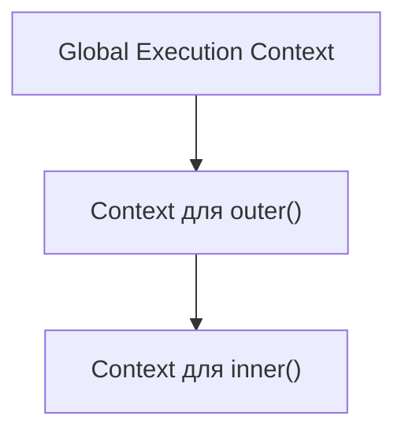
```mermaid
flowchart TD
    N1["Global Execution Context"]
    N2["Context для outer()"]
    N3["Context для inner()"]
    N1 --> N2
    N2 --> N3
```

Стек вызовов подробно объяснит порядок входа и выхода из таких контекстов в следующей главе. Здесь важно увидеть сам факт: вызов внутри вызова создаёт новый контекст.

### Время жизни контекста выполнения

Время жизни контекста выполнения:

Для глобального контекста выполнения время жизни длится весь запуск файла.

Для контекста выполнения функции время жизни обычно короче: контекст появляется при вызове функции и исчезает после завершения вызова.

Возврат — завершение функции с результатом; подробно `return` будет изучаться в разделе про функции.

### Иерархия контекстов выполнения

Контексты выполнения можно представить как иерархию активного выполнения.

Это не полная модель стека вызовов. Здесь схема показывает отношение «кто вызвал кого» на уровне контекстов. Стек вызовов объяснит, как движок управляет этим порядком технически.

### Связь со средой выполнения

Контекст выполнения принадлежит работе движка, но код внутри него может обращаться к среде выполнения.

Среда выполнения не заменяет контекст выполнения. Среда предоставляет внешние возможности. Контекст выполнения — внутренняя рабочая среда самого кода.

Что движок делает прямо сейчас:

```text
Engine выполняет код внутри context.
Если код обращается к console, runtime выводит результат.
```

### Текущее место главы в модели JavaScript

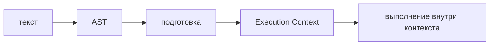
```mermaid
flowchart LR
    N1["текст"]
    N2["AST"]
    N3["подготовка"]
    N4["Execution Context"]
    N5["выполнение внутри контекста"]
    N1 --> N2
    N2 --> N3
    N3 --> N4
    N4 --> N5
```

В предыдущей главе мы остановились на переходе к выполнению. В этой главе мы открыли внутреннюю дверь: выполнение происходит не в пустоте, а внутри контекста выполнения.

### Временная шкала движка

С точки зрения движка глава выглядит как временная шкала подготовки и выполнения.

Что движок делает прямо сейчас:

```text
Engine движется не по "строкам текста",
а по этапам подготовки и выполнения.
```

### Временная шкала программы

С точки зрения программы шкала проще:

Обе шкалы описывают один процесс, но с разных сторон. Шкала движка показывает внутреннюю работу. Шкала программы показывает наблюдаемое движение.

### Дневник движка

Теперь представим тот же процесс как короткий дневник движка.

Этот дневник не является реальным логом V8. Это учебная модель, которая помогает мысленно симулировать процесс.

Если читать код с таким дневником, становится легче отделять подготовку от выполнения:

```text
[подготовка] вошёл в глобальный контекст
[подготовка] записал имена: greet, message
[подготовка] greet уже содержит функцию, message пока пусто
[выполнение] выполняю строку 1: message = 'привет'
[выполнение] выполняю строку 2: вызов greet()
[подготовка] вошёл в контекст greet, записал имена внутри функции
[выполнение] выполняю тело greet
[выполнение] вышел из greet, вернулся в глобальный контекст
```

Каждая строка дневника отвечает на один вопрос: это ещё подготовка имён или уже
выполнение кода.

### Сквозная временная шкала

Теперь соединим предыдущую главу и текущую в один большой фильм.

Это схема, которую стоит держать в голове при чтении следующих глав. Область видимости, стек вызовов, подъём объявлений и событийный цикл будут добавлять новые слои к этому фильму, но не отменят его.

### Переход к стеку вызовов

После этой главы возникает следующий вопрос:

> Если каждый вызов функции создаёт контекст выполнения, как движок управляет несколькими активными контекстами?

Ответ будет в следующей главе: стек вызовов.

Стек вызовов — механизм, который хранит порядок активных вызовов; подробно он будет изучаться сразу после этой главы.

---

## Внутренний механизм

Внутренний механизм контекста выполнения состоит из двух крупных фаз.

Фаза подготовки отвечает за подготовку.

Фаза выполнения отвечает за выполнение.

Если код вызывает функцию, движок повторяет тот же принцип:

Это рекурсивная идея: выполнение функции не является исключением. Для каждого вызова создается свой контекст.

Рекурсия — ситуация, когда функция вызывает сама себя; подробно она будет изучаться в главе про стек вызовов и в разделе про функции.

---

## Ментальная модель

Главная модель главы — подготовленная рабочая комната.

Для кода верхнего уровня комната живёт весь запуск файла.

Для функции комната появляется на время вызова.

Если вы можете смотреть на код и мысленно говорить «сейчас создаётся глобальный контекст», «сейчас регистрируется функция», «сейчас началась фаза выполнения», «сейчас вызов создаёт контекст функции», значит модель работает.

---

## Примеры кода

Примеры к этой главе находятся в папке:

```text
examples/01-javascript/chapter-03/
```

Запускайте их из корня проекта.

### Пример 1. Глобальный контекст

Файл:

```text
examples/01-javascript/chapter-03/01-global-context.js
```

Этот пример показывает выполнение верхнего уровня: движок создаёт глобальный контекст выполнения и выполняет строки файла.

### Пример 2. Контекст функции

Файл:

```text
examples/01-javascript/chapter-03/02-function-context.js
```

Пример показывает, что при вызове функции создаётся отдельный контекст выполнения.

### Пример 3. Вложенные контексты

Файл:

```text
examples/01-javascript/chapter-03/03-nested-contexts.js
```

Пример показывает вложенный вызов: одна функция вызывает другую.

### Пример 4. Время жизни контекста

Файл:

```text
examples/01-javascript/chapter-03/04-context-lifecycle.js
```

Пример показывает появление и завершение контекста функции через наблюдаемый вывод.

### Пример 5. Регистрация до выполнения

Файл:

```text
examples/01-javascript/chapter-03/05-registration-before-execution.js
```

Пример показывает, что объявленную функцию можно вызвать до строки объявления, потому что регистрация произошла во время фазы подготовки.

### Пример 6. Типичная ошибка

Файл:

```text
examples/01-javascript/chapter-03/06-common-mistake.js
```

Пример показывает ошибку ожидания «переменная появляется только когда выполнение дошло до строки». Детали `var` будут разобраны позже, но уже сейчас видно, что подготовка происходит до выполнения.

---

## Частые вопросы

### Контекст выполнения — это то же самое, что область видимости?

Нет.

Область видимости описывает доступность имён, а контекст выполнения — рабочую среду выполнения. Область видимости будет подробно изучаться в отдельной главе.

### Контекст выполнения — это то же самое, что стек вызовов?

Нет.

Контекст выполнения — рабочая среда. Стек вызовов — механизм управления активными контекстами. Стек вызовов будет следующей главой.

### Можно ли увидеть контекст выполнения напрямую?

Нет, обычный код не даёт прямого доступа к внутреннему контексту выполнения. Мы наблюдаем его через поведение программы и ошибки.

### Фаза подготовки — это подъём объявлений?

Не совсем.

Подъём объявлений — наблюдаемое поведение, связанное с тем, как объявления обрабатываются до выполнения. Подробная глава о нём будет позже.

### Контекст функции создаётся при объявлении функции?

Нет.

Контекст функции создаётся при вызове. Объявление регистрируется во время фазы подготовки, но вызов создаёт отдельную рабочую среду.

---

## Распространённые мифы

### Миф 1. JavaScript выполняется строка за строкой

Реальность:

Перед выполнением строк движок создаёт контекст выполнения и проходит фазу подготовки.

### Миф 2. Переменные появляются только когда выполнение дошло до строки

Реальность:

Имена переменных регистрируются во время фазы подготовки. Значения могут появляться позже, во время фазы выполнения. Детали зависят от `var`, `let` и `const`, которые будут изучаться позже.

### Миф 3. Функции создаются только когда выполнение дошло до объявления

Реальность:

Объявления функций регистрируются во время фазы подготовки. Другие способы создания функций будут изучаться в разделе про функции.

### Миф 4. Выполнение начинается сразу после чтения файла

Реальность:

После чтения и разбора движок создаёт контекст выполнения, проходит фазу подготовки и только затем переходит к фазе выполнения.

---

## Распространённые ошибки

### Ошибка 1. Объяснять поведение только порядком строк

Неправильная модель:

```text
Engine дошел до строки.
Только теперь он узнал, что имя существует.
```

Что произошло:

Пропущена фаза подготовки.

Исправленная модель: сначала идёт фаза подготовки, где имена регистрируются, и только потом фаза выполнения, где выполняются строки.

### Ошибка 2. Считать, что объявление функции сразу создаёт контекст

Что произошло:

Перепутаны регистрация функции и вызов функции.

Исправленная модель: объявление делает функцию доступной, а контекст выполнения создаётся только в момент вызова — и свой для каждого вызова.

### Ошибка 3. Смешивать контекст выполнения и среду выполнения

Что произошло:

`console.log` или `process` воспринимаются как часть контекста выполнения.

Исправленная модель: `console` и `process` предоставляет среда выполнения, а контекст выполнения содержит только записи об именах выполняемого кода.

### Ошибка 4. Углубляться в стек вызовов раньше времени

Что произошло:

При первом знакомстве с контекстом выполнения читатель пытается сразу объяснить весь порядок вложенных вызовов через стек вызовов.

Исправленный подход:

Сначала понять, что каждый вызов создаёт контекст выполнения функции. Как эти контексты управляются технически, будет объяснено в следующей главе.

---

## Практическое использование

Когда вы читаете JavaScript-файл, полезно делать два прохода.

Первый проход — мысленная фаза подготовки:

```text
1. Какие функции объявлены?
2. Какие переменные объявлены?
3. Какие имена будут зарегистрированы?
4. Какие function calls появятся позже?
```

Второй проход — мысленная фаза выполнения:

```text
1. Какая строка выполняется первой?
2. Какие зарегистрированные имена используются?
3. Где создается Function Execution Context?
4. Когда context завершается?
5. Где есть runtime interaction?
```

Это не заменяет отладчик. Отладчик — инструмент пошагового выполнения программы; подробно он будет изучаться позже. Но такая модель помогает читать код до запуска.

Чек-лист готовности к стеку вызовов:

```text
✓ Я понимаю creation phase.
✓ Я понимаю execution phase.
✓ Я отличаю регистрацию функции от вызова функции.
✓ Я понимаю, что вызов функции создает Function Execution Context.
✓ Я понимаю, что nested calls создают nested contexts.
```

---

## Использование в Automation QA

Контекст выполнения напрямую помогает в автоматизации тестов.

### Отладка тестов Playwright

Тест Playwright — это код на JavaScript или TypeScript, который выполняется в контексте Node.js и управляет браузером.

Если вспомогательная функция вызывается внутри теста, у неё будет свой контекст выполнения.

Обратный вызов — функция, переданная как значение для выполнения позже; подробно обратные вызовы будут изучаться в разделе про асинхронность.

### Вспомогательные функции

Вспомогательная функция не «делит» один контекст на все вызовы. Каждый вызов получает собственный контекст выполнения.

Это помогает понимать, почему локальные временные данные одного вызова не должны автоматически смешиваться с другим вызовом.

### Фикстуры

Фикстура часто готовит состояние для теста. Внутри неё вызываются функции, создаются данные, используются вспомогательные функции.

Если фикстура падает, трассировка стека часто показывает цепочку вызовов. Трассировка стека — текстовое описание пути вызовов до ошибки; подробно она будет связана со стеком вызовов в следующей главе.

### Объекты страниц

Объект страницы — класс или объект, который группирует действия со страницей; подробно он будет изучаться в разделе про автоматизацию тестов.

Методы объекта страницы при вызове создают контексты выполнения. Это помогает понимать, где возникла ошибка: в тесте, во вспомогательной функции или в методе страницы.

### Переиспользуемые утилиты

Вспомогательная функция может вызываться из разных тестов. Один и тот же код выполняется в разных контекстах.

### Чтение ошибок времени выполнения

Если ошибка возникла внутри вспомогательной функции, важно понять:

Такой взгляд готовит к чтению трассировок стека и к следующей главе про стек вызовов.

---

## Итоги

Контекст выполнения — внутренняя рабочая среда, которую движок создаёт для выполнения кода.

JavaScript не выполняет код в пустоте. Перед выполнением движок создаёт контекст, проходит фазу подготовки, регистрирует функции и переменные на высоком уровне, подготавливает внутренние записи, а затем переходит к фазе выполнения.

Глобальный контекст выполнения создаётся для верхнего уровня запуска. Контекст выполнения функции создаётся при каждом вызове. Если функция вызывает другую функцию, появляется новый контекст. После завершения вызова контекст функции исчезает.

Эта глава не объясняла стек вызовов, цепочку областей видимости, замыкания, устройство подъёма объявлений, событийный цикл и асинхронность. Они будут изучаться отдельно. Но теперь у вас есть фундамент: выполнение происходит внутри контекста выполнения, а не просто «по строкам».

Следующая глава объяснит стек вызовов — механизм, который управляет активными контекстами выполнения.

---

## Что нужно запомнить

✓ Контекст выполнения — рабочая среда выполнения кода.

✓ JavaScript не выполняется без контекста выполнения.

✓ Фаза подготовки происходит до фазы выполнения.

✓ Во время фазы подготовки движок регистрирует функции и переменные на высоком уровне.

✓ Объявление функции регистрируется до выполнения.

✓ Объявление переменной регистрирует имя до выполнения присваивания.

✓ Глобальный контекст выполнения создаётся для верхнего уровня запуска.

✓ Контекст выполнения функции создаётся при вызове.

✓ Один вызов функции создаёт один контекст выполнения.

✓ Контекст функции появляется при вызове и исчезает после завершения.

---

## Проверьте себя

1. Почему JavaScript не может выполнять код без контекста выполнения?

2. Что происходит во время фазы подготовки?

3. Что происходит во время фазы выполнения?

4. Чем регистрация функции отличается от вызова функции?

5. Когда создаётся контекст выполнения функции?

6. Что происходит с контекстом выполнения функции после завершения вызова?

7. Чем контекст выполнения отличается от среды выполнения?

8. Почему модель контекста выполнения помогает читать трассировки стека?

9. Какая тема логически следует после контекста выполнения?

### Ответы

1. Контекст выполнения — это среда, в которой живут имена и значения выполняемого кода. Без него неоткуда брать переменные и некуда записывать результат.
2. Движок создаёт окружение и регистрирует в нём объявления: функции становятся готовы к вызову, `var` получает `undefined`, `let` и `const` заводятся без доступа.
3. Движок выполняет строки по порядку: вычисляет выражения, присваивает значения, вызывает функции.
4. Регистрация делает имя функции известным, но её тело не выполняется. Вызов создаёт новый контекст выполнения и выполняет тело.
5. На каждый вызов — свой. Десять вызовов одной функции создают десять контекстов, и у каждого свои параметры и локальные имена.
6. Он уничтожается вместе со своими именами. Именно поэтому локальные переменные не видны снаружи и не сохраняются между вызовами.
7. Среда выполнения даёт возможности вне языка — файлы, сеть, страницу. Контекст выполнения — внутренняя структура движка для конкретного куска кода. Первое про окружение программы, второе про выполнение.
8. Трассировка — это список контекстов, которые были активны в момент ошибки. Понимая, что контекст создаётся на каждый вызов, вы читаете её как путь вызовов, а не как случайный набор строк.
9. Стек вызовов: если контекст создаётся на каждый вызов, нужен порядок, в котором они складываются и снимаются.

---

## Практика

Практика к этой главе находится в файле:

```text
practice/01-javascript/03-execution-context.md
```

Перед практикой запустите примеры из раздела «Примеры кода» и попробуйте для каждого файла проговорить фазу подготовки и фазу выполнения.

---

## Решения

Решения находятся в файле:

```text
solutions/01-javascript/03-execution-context.md
```

Открывайте решения после самостоятельной попытки. В этой главе особенно важно сравнивать не только результат, но и мысленную симуляцию работы движка.
