# Call Stack

## Связь с предыдущей главой

В предыдущей главе была построена модель Execution Context: engine создает рабочую среду для выполнения global-кода и отдельную рабочую среду для каждого вызова функции.

Теперь появляется следующий вопрос:

> Если во время выполнения может существовать несколько active Execution Contexts, как JavaScript помнит, какой context сейчас выполняется и куда нужно вернуться после завершения функции?

Эта глава объясняет Call Stack — механизм, который управляет активными Execution Contexts в синхронном JavaScript.

Synchronous JavaScript — код, который выполняется шаг за шагом без передачи продолжения в асинхронные очереди; Event Loop, Promises, microtasks и macrotasks будут изучаться позже.

---

## Предварительные требования

Для этой главы нужно понимать:

* что Execution Context — рабочая среда выполнения кода;
* что Global Execution Context создается для верхнего уровня запуска;
* что Function Execution Context создается при вызове функции;
* что Function Execution Context исчезает после завершения вызова;
* что runtime предоставляет API вроде `console`.

Не требуется знать Event Loop, Promises, microtasks, macrotasks, async / await или внутренние оптимизации engine. Эти темы будут изучаться позже.

---

## Время изучения

Ориентировочное время:

```text
Чтение главы:            90-120 минут
Разбор схем:             40-50 минут
Запуск примеров:         25-35 минут
Практика:                90-120 минут
Повторение материала:    30 минут
```

Уровень сложности: **L3**.

L3 означает фундаментальный уровень: глава объясняет механизм, который нужен для чтения stack traces, debugging helpers, анализа Page Object и понимания будущих тем про recursion и async.

---

## Навигация

Предыдущая глава:

```text
docs/01-javascript/03-execution-context.md
```

Следующая глава:

```text
docs/01-javascript/05-memory.md
```

---

## Цели обучения

После изучения этой главы вы будете понимать:

* что такое Call Stack;
* почему Call Stack существует;
* как Call Stack связан с Execution Context;
* что значит push context onto the stack;
* что значит pop context from the stack;
* как выполняются nested function calls;
* как JavaScript возвращается к предыдущему месту выполнения;
* как stack растет и уменьшается;
* почему программа заканчивается, когда stack становится empty;
* что такое stack overflow на высоком уровне;
* как читать stack trace;
* как применять модель Call Stack в Automation QA.

---

## Мотивация

Начнем с наблюдаемого поведения.

```javascript
function first() {
  second();
  console.log('first finished');
}

function second() {
  third();
  console.log('second finished');
}

function third() {
  console.log('third finished');
}

first();
```

Результат:

```text
third finished
second finished
first finished
```

Вопрос:

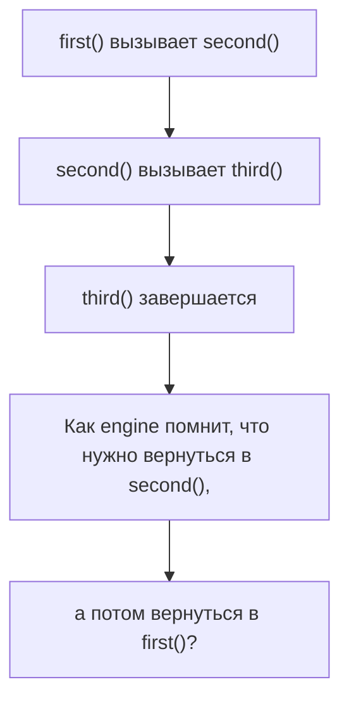

Если Execution Context — это рабочая комната, то при вложенных вызовах таких комнат становится несколько. Engine должен знать, какая комната активна сейчас и в какую комнату нужно вернуться.

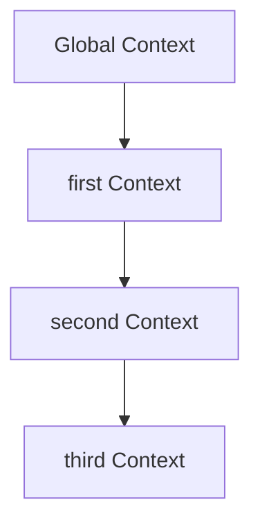

Этой задачей занимается Call Stack.

Но снова не будем начинать с определения. Сначала почувствуем проблему:

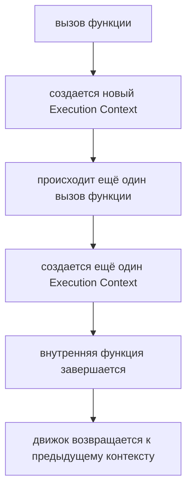

Главный вопрос главы:

> Что происходит внутри engine прямо сейчас?

---

## Теория

### Проблема возврата

Когда функция вызывает другую функцию, выполнение внешней функции временно приостанавливается.

```javascript
function outer() {
  console.log('outer start');
  inner();
  console.log('outer finish');
}

function inner() {
  console.log('inner');
}

outer();
```

Engine должен сделать несколько вещей:

* начать выполнение `outer`;
* остановиться внутри `outer` на вызове `inner`;
* выполнить `inner`;
* после завершения `inner` вернуться в `outer`;
* продолжить `outer` со строки после вызова `inner`.

Схема:

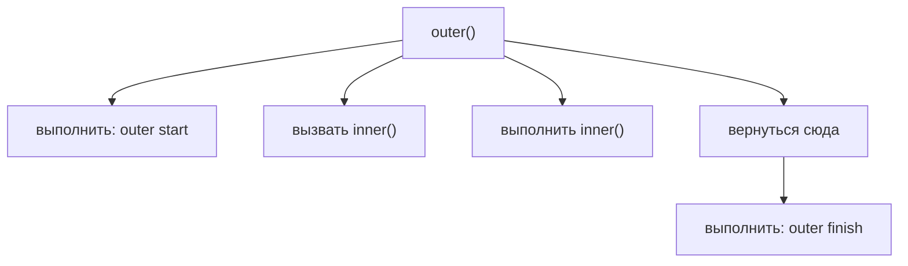

Что происходит внутри engine прямо сейчас:

```text
Engine должен запомнить место возврата.
Engine должен знать, какой Execution Context активен.
```

### Что такое Call Stack

Теперь можно ввести термин.

Call Stack — это структура, с помощью которой JavaScript Engine управляет активными Execution Contexts.

Когда начинается выполнение файла, в stack помещается Global Execution Context. Когда вызывается функция, создается Function Execution Context и помещается сверху. Когда функция завершается, ее context снимается сверху.

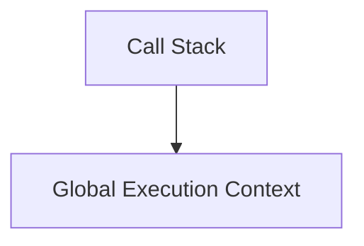

При вызове функции:

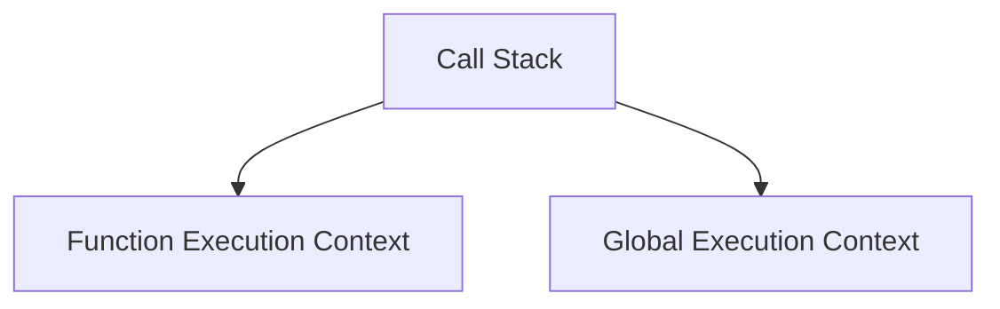

Call Stack отвечает не за создание кода и не за runtime API. Он отвечает за порядок активных contexts.

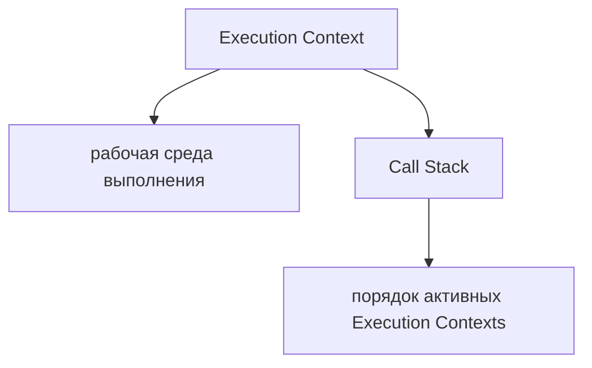

Что происходит внутри engine прямо сейчас:

```text
Engine кладет новый context поверх текущего.
Верхний context становится активным.
```

### Stack of books

Первая ментальная модель — стопка книг.

Книгу можно положить сверху. Снять можно тоже верхнюю. Нельзя взять нижнюю книгу, не сняв верхние.

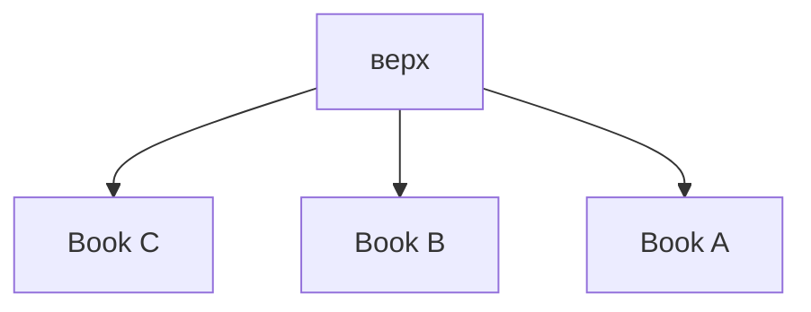

Call Stack работает так же:

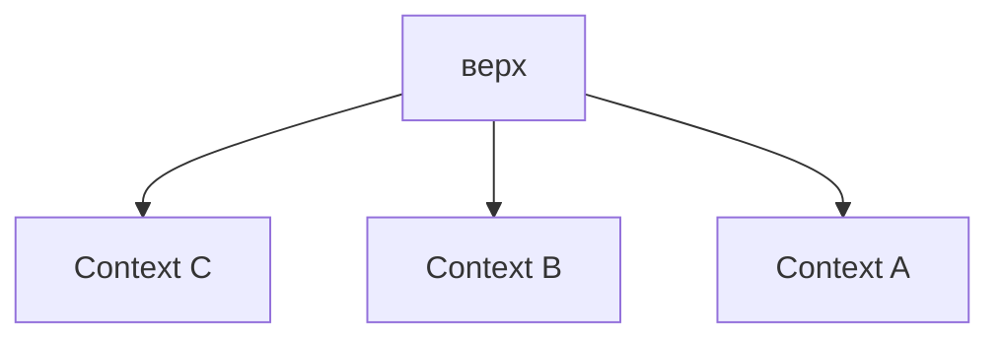

Активен всегда верхний context.

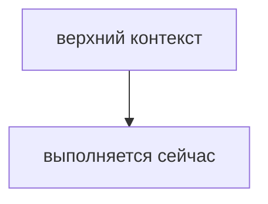

### Stack of trays

Вторая модель — стопка подносов.

Новый поднос кладется сверху. Последний положенный поднос снимается первым.

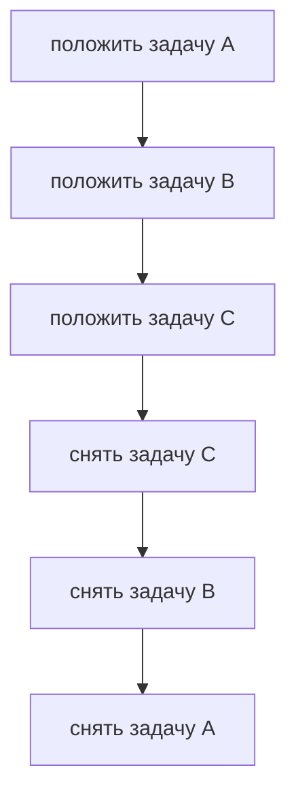

Это называется last in — first out.

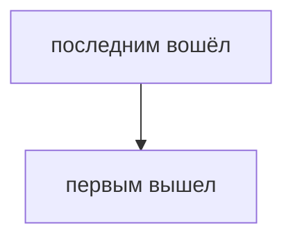

Для Call Stack:

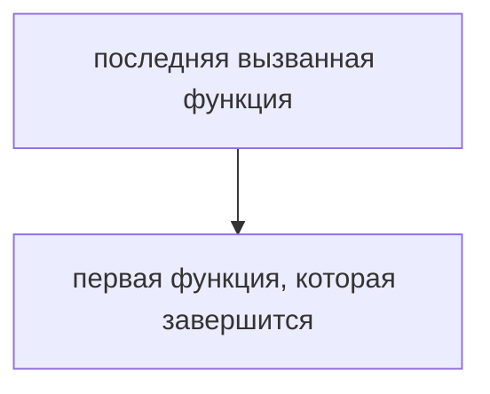

Что происходит внутри engine прямо сейчас:

```text
Engine работает с верхом stack.
Новый function call идет наверх.
Завершение функции снимает верхний context.
```

### Push context onto the stack

Push — операция добавления нового элемента на верх stack.

Когда вызывается функция, engine создает Function Execution Context и делает push.

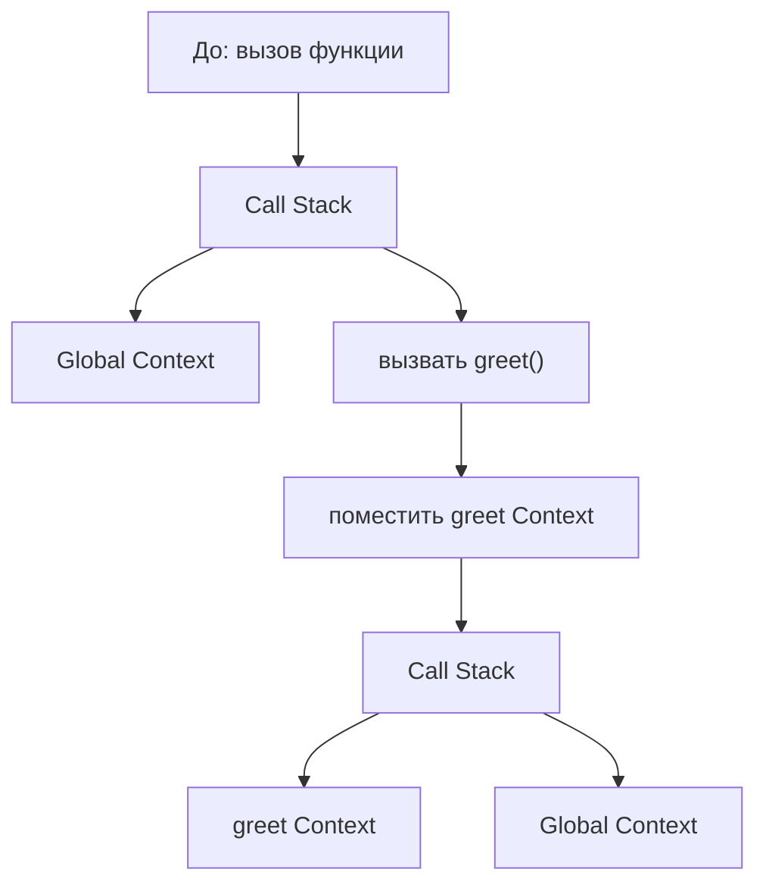

Что происходит внутри engine прямо сейчас:

```text
Engine встретил function call.
Engine создал Function Execution Context.
Engine положил его на верх Call Stack.
Engine выполняет верхний context.
```

### Pop context from the stack

Pop — операция снятия верхнего элемента со stack.

Когда функция завершается, ее Function Execution Context больше не нужен. Engine снимает его с Call Stack.

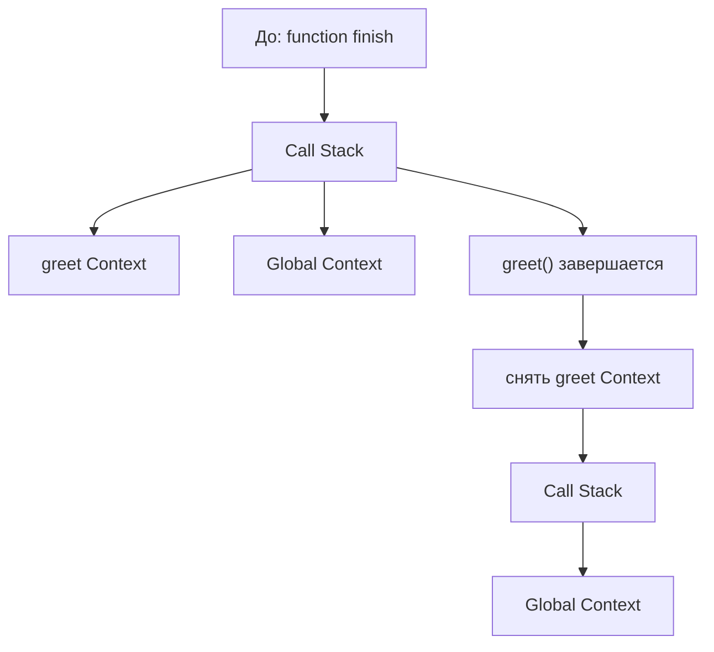

После pop активным снова становится context, который оказался сверху.

Что происходит внутри engine прямо сейчас:

```text
Engine завершил текущую функцию.
Engine снял ее context.
Engine вернулся к предыдущему context.
```

### Single function call

Рассмотрим один вызов.

```javascript
function greet() {
  console.log('Hello');
}

greet();
```

Жизненный цикл:

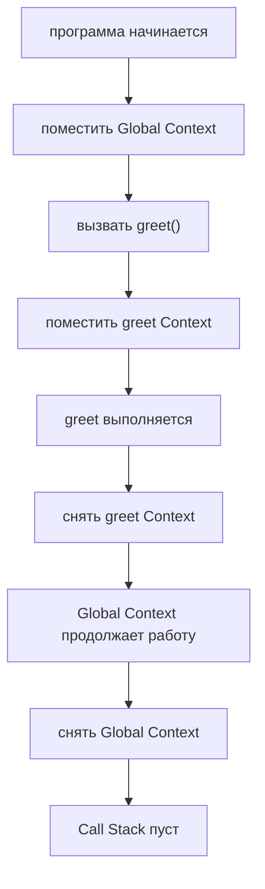

Диаграмма stack:

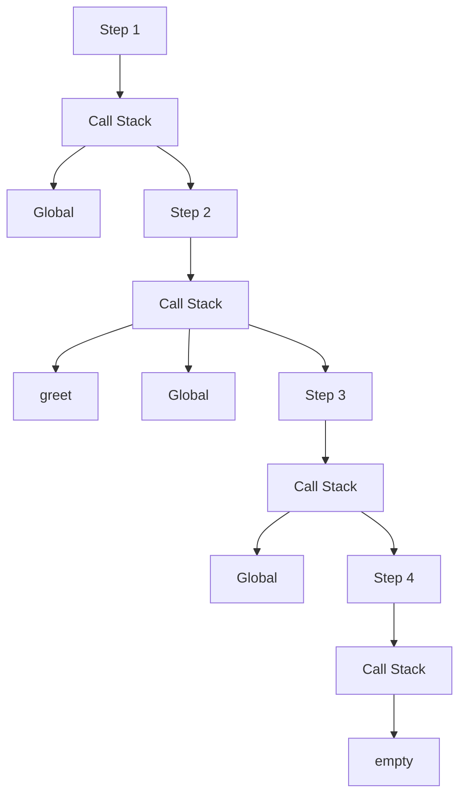

### Nested function calls

Nested calls — вызовы внутри вызовов.

```javascript
function first() {
  second();
}

function second() {
  third();
}

function third() {
  console.log('third');
}

first();
```

Stack растет вниз в схеме, но верх stack находится сверху списка:

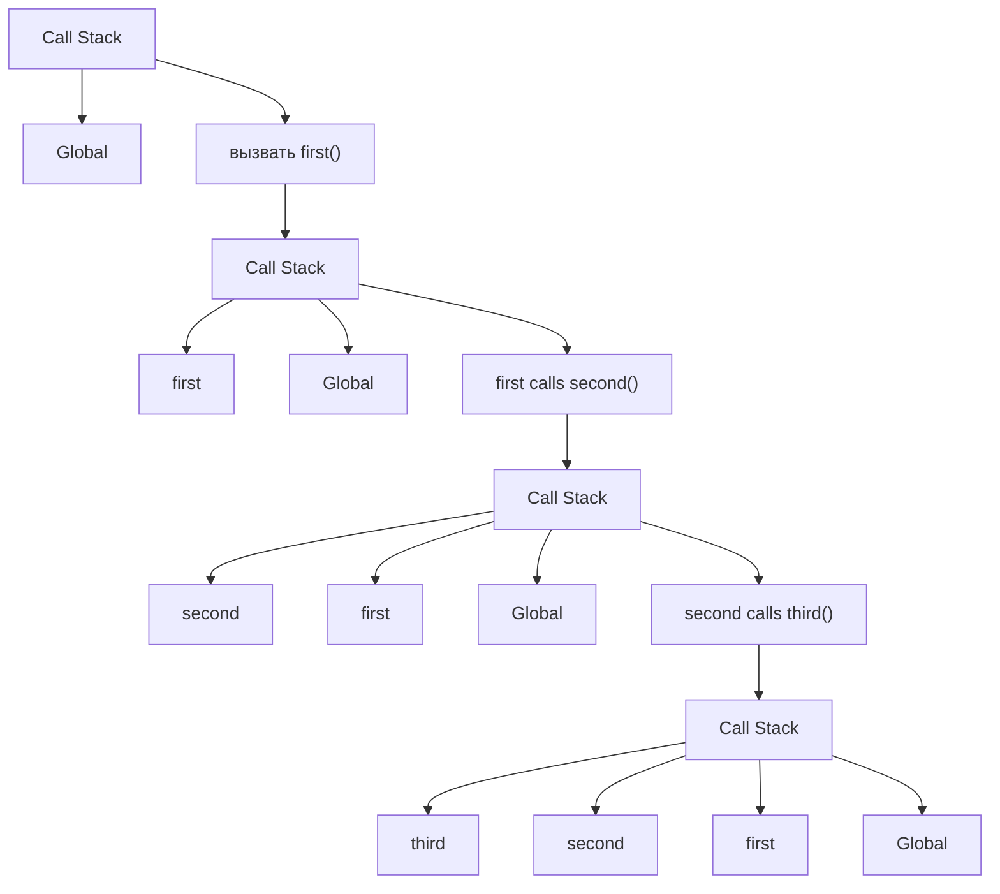

Теперь функции завершаются в обратном порядке:

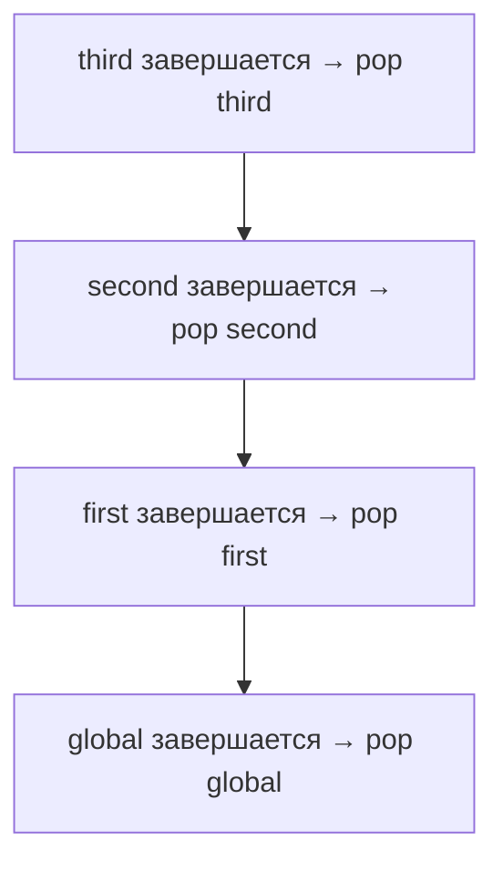

Что происходит внутри engine прямо сейчас:

```text
Каждый вложенный вызов добавляет новый context.
Каждое завершение снимает верхний context.
```

### Returning from functions

Когда функция завершается, engine должен вернуться в место вызова.

```javascript
function getName() {
  return 'Anna';
}

const name = getName();
console.log(name);
```

`return` завершает выполнение функции и передает результат в место вызова. Подробная глава о `return` будет позже; сейчас важен механизм возврата context.

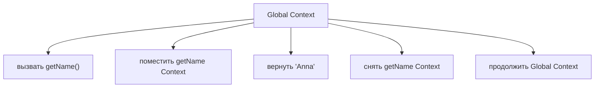

Engine помнит место возврата через Call Stack: после pop активным становится предыдущий context.

### Stack growth

Stack grows, когда функции вызывают другие функции.

```mermaid
flowchart TD
    N1["Global"]
    N2["Global + loadConfig"]
    N3["Global + loadConfig + readFilePath"]
    N4["Global + loadConfig + readFilePath + normalizePath"]
    N1 --> N2
    N2 --> N3
    N3 --> N4
```

В реальных программах stack постоянно растет и уменьшается.

```mermaid
flowchart TD
    N1["call"]
    N2["push"]
    N3["execute"]
    N4["pop"]
    N5["return"]
    N1 --> N2
    N2 --> N3
    N3 --> N4
    N4 --> N5
```

Что происходит внутри engine прямо сейчас:

```text
Engine отслеживает текущую цепочку синхронных вызовов.
```

### Empty stack

Когда Global Execution Context завершен и снят, stack становится empty.

```mermaid
flowchart TD
    N1["Call Stack"]
    N2["Global Context"]
    N3["global завершается"]
    N4["снять Global Context"]
    N5["Call Stack"]
    N6["empty"]
    N1 --> N2
    N1 --> N3
    N3 --> N4
    N4 --> N5
    N5 --> N6
```

Для синхронной программы это означает, что выполнять больше нечего.

```mermaid
flowchart TD
    N1["Stack empty"]
    N2["нет active Execution Context"]
    N3["synchronous program ends"]
    N1 --> N2
    N2 --> N3
```

Async-код, Event Loop, timers и Promises будут изучаться позже. Там история усложнится: stack может стать empty, а runtime позже снова поместит работу на выполнение. В этой главе мы изучаем только синхронный JavaScript.

### Complete stack lifecycle

Полный lifecycle stack для простой программы:

```mermaid
flowchart TD
    N1["программа начинается"]
    N2["push Global"]
    N3["вызвать A"]
    N4["push A"]
    N5["вызвать B"]
    N6["push B"]
    N7["B завершается"]
    N8["pop B"]
    N9["A завершается"]
    N10["pop A"]
    N11["Global завершается"]
    N12["pop Global"]
    N13["Stack empty"]
    N14["Program ends"]
    N1 --> N2
    N2 --> N3
    N3 --> N4
    N4 --> N5
    N5 --> N6
    N6 --> N7
    N7 --> N8
    N8 --> N9
    N9 --> N10
    N10 --> N11
    N11 --> N12
    N12 --> N13
    N13 --> N14
```

### Stack overflow на высоком уровне

Call Stack не бесконечен.

Если функции вызывают функции слишком глубоко и contexts продолжают добавляться, stack может переполниться.

```mermaid
flowchart TD
    N1["Call Stack"]
    N2["call #10000"]
    N3["call #9999"]
    N4["call #9998"]
    N5["..."]
    N6["Global"]
    N1 --> N2
    N1 --> N3
    N1 --> N4
    N1 --> N5
    N1 --> N6
```

Stack overflow — ситуация, когда вызовов стало слишком много и engine больше не может безопасно добавить новый context.

Типичный источник — recursion без корректного условия остановки. Recursion — ситуация, когда функция вызывает сама себя; подробно recursion будет изучаться позже вместе с функциями и отдельными примерами.

В этой главе важно только:

```mermaid
flowchart TD
    N1["Too many active function calls"]
    N2["too many contexts on Call Stack"]
    N3["stack overflow"]
    N1 --> N2
    N2 --> N3
```

### Stack trace

Stack trace — текстовое описание цепочки вызовов, которая привела к ошибке.

Если ошибка произошла внутри глубокой функции, stack trace помогает увидеть путь:

```mermaid
flowchart TD
    N1["Error"]
    N2["at normalizeUser"]
    N3["at buildUserData"]
    N4["at createUser"]
    N5["at test"]
    N1 --> N2
    N2 --> N3
    N3 --> N4
    N4 --> N5
```

Это читается снизу вверх как путь к ошибке:

```mermaid
flowchart TD
    N1["test"]
    N2["createUser"]
    N3["buildUserData"]
    N4["normalizeUser"]
    N5["error here"]
    N1 --> N2
    N2 --> N3
    N3 --> N4
    N4 --> N5
```

Stack trace не показывает все детали Execution Context. Но он показывает цепочку вызовов, связанную с Call Stack.

Что происходит внутри engine прямо сейчас:

```text
Runtime error произошла в верхнем context.
Engine может показать цепочку вызовов, которые привели к этому context.
```

### Relation between Execution Context and Call Stack

Связь можно представить так:

```mermaid
flowchart TD
    N1["Execution Context"]
    N2["рабочая среда одного выполнения"]
    N3["Call Stack"]
    N4["структура, где лежат активные Execution Contexts"]
    N1 --> N2
    N1 --> N3
    N3 --> N4
```

Или так:

```mermaid
flowchart TD
    N1["Call Stack"]
    N2["Function Execution Context: current"]
    N3["Function Execution Context: вызывающий код"]
    N4["Global Execution Context"]
    N1 --> N2
    N1 --> N3
    N1 --> N4
```

Call Stack не объясняет, какие имена доступны внутри context. Это будет тема Scope. Call Stack объясняет, какой context сейчас активен и куда engine вернется.

### Chapter position in JavaScript model

Теперь общая модель выполнения стала такой:

```mermaid
flowchart TD
    N1["исходный код"]
    N2["парсинг / AST"]
    N3["Execution Context Creation"]
    N4["Call Stack"]
    N5["поместить Global Context"]
    N6["поместить Function Context on call"]
    N7["снять Function Context on return"]
    N8["Runtime Interaction"]
    N1 --> N2
    N2 --> N3
    N3 --> N4
    N4 --> N5
    N4 --> N6
    N4 --> N7
    N4 --> N8
```

Предыдущая глава объяснила, что такое context. Эта глава объясняет, как engine управляет активными contexts.

### Переход к Memory chapter

Следующая крупная группа тем приведет к значениям, переменным и памяти.

После Call Stack естественный вопрос:

> Где живут значения, с которыми работает context?

На этот вопрос постепенно ответят главы про Variables, Primitive Types, Object Type, Stack & Heap и References.

```mermaid
flowchart TD
    N1["Call Stack"]
    N2["tracks active выполнение"]
    N3["Values and Memory"]
    N4["what data exists"]
    N5["where values live conceptually"]
    N6["how references work"]
    N1 --> N2
    N1 --> N3
    N3 --> N4
    N3 --> N5
    N3 --> N6
```

Stack & Heap как модель памяти будут изучаться позже. Сейчас слово stack относится именно к Call Stack вызовов, а не к будущей теме Stack & Heap.

### Full execution example

Полный синхронный пример:

```javascript
function prepare() {
  validate();
}

function validate() {
  console.log('valid');
}

prepare();
```

Фильм выполнения:

```mermaid
flowchart TD
    N1["программа начинается"]
    N2["push Global"]
    N3["Global выполняется prepare()"]
    N4["push prepare"]
    N5["prepare выполняется validate()"]
    N6["push validate"]
    N7["validate выполняется console.log"]
    N8["validate завершается"]
    N9["pop validate"]
    N10["prepare continues and завершается"]
    N11["pop prepare"]
    N12["Global Context продолжает работу and завершается"]
    N13["pop Global"]
    N14["Call Stack пуст"]
    N1 --> N2
    N2 --> N3
    N3 --> N4
    N4 --> N5
    N5 --> N6
    N6 --> N7
    N7 --> N8
    N8 --> N9
    N9 --> N10
    N10 --> N11
    N11 --> N12
    N12 --> N13
    N13 --> N14
```

Если вы можете нарисовать такую схему для любого синхронного кода, модель Call Stack работает.

---

## Внутренний механизм

Внутренний механизм Call Stack состоит из двух операций: push и pop.

```mermaid
flowchart TD
    N1["вызов функции"]
    N2["создать Function Execution Context"]
    N3["push context onto Call Stack"]
    N4["выполнить тело функции"]
    N5["function завершается"]
    N6["pop context from Call Stack"]
    N7["вернуть to previous context"]
    N1 --> N2
    N2 --> N3
    N3 --> N4
    N4 --> N5
    N5 --> N6
    N6 --> N7
```

Engine всегда выполняет верхний context.

```mermaid
flowchart TD
    N1["Call Stack"]
    N2["top context ← executing now"]
    N3["waiting context"]
    N4["Global Context"]
    N1 --> N2
    N1 --> N3
    N1 --> N4
```

Когда верхний context завершен, engine снимает его. Следующий context сверху становится активным.

```mermaid
flowchart TD
    N1["pop top"]
    N2["previous context becomes active"]
    N1 --> N2
```

Это и есть механизм возвращения к предыдущему месту выполнения.

---

## Ментальная модель

Главная модель — стопка книг.

```mermaid
flowchart TD
    N1["put book: Global"]
    N2["put book: first()"]
    N3["put book: second()"]
    N4["put book: third()"]
    N5["remove book: third()"]
    N6["remove book: second()"]
    N7["remove book: first()"]
    N8["remove book: Global"]
    N4 --> N5
    N1 --> N2
    N2 --> N3
    N3 --> N4
    N5 --> N6
    N6 --> N7
    N7 --> N8
```

Последняя положенная книга снимается первой.

```mermaid
flowchart TD
    N1["последним вошёл"]
    N2["первым вышел"]
    N1 --> N2
```

В терминах выполнения:

```mermaid
flowchart TD
    N1["enter function"]
    N2["push context"]
    N3["leave function"]
    N4["pop context"]
    N5["after pop"]
    N6["вернуть to previous place"]
    N1 --> N2
    N2 --> N3
    N3 --> N4
    N4 --> N5
    N5 --> N6
```

Модель подносов дает тот же результат:

```mermaid
flowchart TD
    N1["Tray stack"]
    N2["current tray"]
    N3["previous tray"]
    N4["first tray"]
    N1 --> N2
    N1 --> N3
    N1 --> N4
```

Работать можно только с верхним подносом. Так же engine работает только с верхним Execution Context.

---

## Примеры кода

Примеры к этой главе находятся в папке:

```text
examples/01-javascript/chapter-04/
```

Запускайте их из корня проекта.

### Пример 1. Single call

Файл:

```text
examples/01-javascript/chapter-04/01-single-call.js
```

Показывает один function call: push Function Context, выполнение, pop Function Context.

### Пример 2. Nested calls

Файл:

```text
examples/01-javascript/chapter-04/02-nested-calls.js
```

Показывает вложенные вызовы `first → second → third`.

### Пример 3. Stack growth

Файл:

```text
examples/01-javascript/chapter-04/03-stack-growth.js
```

Показывает наблюдаемое движение при росте stack.

### Пример 4. Stack pop

Файл:

```text
examples/01-javascript/chapter-04/04-stack-pop.js
```

Показывает возврат к предыдущему context после завершения внутренней функции.

### Пример 5. Stack trace

Файл:

```text
examples/01-javascript/chapter-04/05-stack-trace.js
```

Пример намеренно выбрасывает runtime error, чтобы показать stack trace.

### Пример 6. Stack overflow concept

Файл:

```text
examples/01-javascript/chapter-04/06-stack-overflow-concept.js
```

Пример безопасно показывает идею глубины вызовов без настоящего переполнения stack.

---

## Частые вопросы

### Call Stack и Execution Context — это одно и то же?

Нет.

Execution Context — рабочая среда выполнения. Call Stack — структура, которая хранит активные Execution Contexts.

### Call Stack хранит переменные?

В этой главе мы не изучаем модель памяти. Call Stack нужен для управления активными вызовами. Где живут значения и как работают ссылки, будет изучаться позже.

### Почему stack trace иногда длинный?

Потому что ошибка могла пройти через длинную цепочку function calls: test → fixture → helper → utility.

### Почему мы не изучаем Event Loop здесь?

Потому что сначала нужно понять синхронный Call Stack. Event Loop объясняет, как runtime возвращает работу в stack позже, и будет изучаться в async-разделе.

### Stack overflow всегда связан с recursion?

Чаще всего причиной является слишком глубокая цепочка вызовов, часто из-за recursion без остановки. Подробности recursion будут изучаться позже.

---

## Распространенные мифы

### Миф 1. JavaScript забывает внешнюю функцию, когда входит во внутреннюю

Реальность:

Внешний context остается в Call Stack и ждет, пока внутренний context завершится.

### Миф 2. Ошибка показывает только место, где все сломалось

Реальность:

Stack trace показывает не только место ошибки, но и путь вызовов к нему.

### Миф 3. Call Stack объясняет async

Реальность:

Call Stack объясняет активное синхронное выполнение. Event Loop и очереди будут изучаться позже.

### Миф 4. Stack overflow — это любая ошибка в stack trace

Реальность:

Stack trace — диагностический отчет. Stack overflow — конкретная ситуация, когда stack переполнен слишком большим числом вызовов.

---

## Типичные ошибки

### Ошибка 1. Читать stack trace только сверху

Что произошло:

Инженер видит последнюю функцию и игнорирует цепочку вызовов.

Исправленная модель:

```mermaid
flowchart TD
    N1["Bottom of stack trace"]
    N2["where chain started"]
    N3["Top of stack trace"]
    N4["where error happened"]
    N1 --> N2
    N1 --> N3
    N3 --> N4
```

### Ошибка 2. Думать, что функция после вызова продолжает выполняться параллельно

Что произошло:

Внешняя функция воспринимается как параллельная внутренней.

Исправленная модель:

```mermaid
flowchart TD
    N1["outer pauses"]
    N2["inner runs"]
    N3["inner завершается"]
    N4["outer continues"]
    N1 --> N2
    N2 --> N3
    N3 --> N4
```

JavaScript async и parallel execution не изучаются в этой главе.

### Ошибка 3. Смешивать Call Stack и Stack & Heap

Что произошло:

Слово stack воспринимается одинаково во всех темах.

Исправленная модель:

```mermaid
flowchart TD
    N1["Call Stack"]
    N2["active function calls"]
    N3["Stack &amp; Heap"]
    N4["memory model, будет позже"]
    N1 --> N2
    N1 --> N3
    N3 --> N4
```

### Ошибка 4. Объяснять stack overflow без stack growth

Что произошло:

Stack overflow воспринимается как случайная ошибка.

Исправленная модель:

```mermaid
flowchart TD
    N1["too many calls"]
    N2["too many contexts"]
    N3["Call Stack limit reached"]
    N1 --> N2
    N2 --> N3
```

---

## Практическое использование

Когда читаете синхронный код, рисуйте stack вручную.

Алгоритм:

```text
1. Начать с Global Context.
2. Найти первый function call.
3. Сделать push function context.
4. Если внутри есть новый call, сделать еще push.
5. Когда функция завершается, сделать pop.
6. Продолжить предыдущий context.
7. Когда Global завершен, stack empty.
```

Мини-шаблон:

```mermaid
flowchart TD
    N1["Call Stack"]
    N2["current function"]
    N3["вызывающий код function"]
    N4["Global"]
    N1 --> N2
    N1 --> N3
    N1 --> N4
```

Чек-лист готовности к следующей теме:

```text
✓ Я понимаю push.
✓ Я понимаю pop.
✓ Я понимаю last in — first out.
✓ Я могу нарисовать stack для nested calls.
✓ Я могу прочитать stack trace как цепочку вызовов.
```

---

## Использование в Automation QA

### Reading Playwright stack traces

Playwright stack trace часто показывает цепочку:

```mermaid
flowchart TD
    N1["test"]
    N2["page object method"]
    N3["helper"]
    N4["assertion utility"]
    N5["error"]
    N1 --> N2
    N2 --> N3
    N3 --> N4
    N4 --> N5
```

Если читать только последнюю строку, можно пропустить реальную причину. Иногда ошибка проявилась в utility, но вызвана неверными данными из fixture.

### Отладка helper chains

Helper может вызвать другой helper.

```mermaid
flowchart TD
    N1["createUser()"]
    N2["buildUserData()"]
    N3["normalizeEmail()"]
    N1 --> N2
    N2 --> N3
```

Call Stack помогает понять, где была создана цепочка вызовов и куда engine возвращался.

### Page Object call chains

Одна строка теста может вызвать несколько методов внутри Page Object.

```mermaid
flowchart TD
    N1["test"]
    N2["profilePage.open()"]
    N3["profilePage.waitForLoaded()"]
    N4["assertion"]
    N1 --> N2
    N2 --> N3
    N3 --> N4
```

Когда падает внутренняя проверка, stack trace помогает найти не только место падения, но и путь к нему.

### Fixture call chains

Fixture может готовить данные, авторизацию и страницы.

```mermaid
flowchart TD
    N1["fixture"]
    N2["loadConfig()"]
    N3["createUser()"]
    N4["openSession()"]
    N1 --> N2
    N1 --> N3
    N1 --> N4
```

Если fixture падает до запуска теста, это не ошибка тестового шага. Это ошибка в цепочке подготовки.

### Locating real source of runtime errors

Runtime error часто находится в верхней функции stack trace, но причина может быть ниже по цепочке вызовов.

```mermaid
flowchart TD
    N1["Top: normalizeUser failed"]
    N2["Middle: buildUserData passed invalid data"]
    N3["Bottom: test called createUser with wrong input"]
    N1 --> N2
    N2 --> N3
```

Call Stack помогает не гадать, а читать путь выполнения.

---

## Итоги

Call Stack — механизм, с помощью которого JavaScript Engine управляет активными Execution Contexts.

Когда программа начинается, в stack помещается Global Execution Context. Когда вызывается функция, создается Function Execution Context и помещается сверху. Верхний context является активным. Когда функция завершается, ее context снимается, и engine возвращается к предыдущему context.

Call Stack работает по принципу last in — first out. Последний вызванный context завершается первым.

Для синхронной программы выполнение заканчивается, когда Global Context завершен и Call Stack становится empty. Если calls становятся слишком глубокими, может произойти stack overflow.

Следующая тема добавит новый слой: Memory объяснит, где программа концептуально хранит информацию во время выполнения. Scope, Event Loop и async будут изучаться позже и не отменяют базовую модель Call Stack.

---

## Что нужно запомнить

✓ Call Stack хранит активные Execution Contexts.

✓ Верхний context в Call Stack выполняется прямо сейчас.

✓ Function call создает Function Execution Context и делает push.

✓ Завершение функции делает pop.

✓ Call Stack работает по принципу last in — first out.

✓ Nested calls увеличивают stack.

✓ Возврат из функции возвращает engine к предыдущему context.

✓ Empty stack означает завершение синхронной программы.

✓ Stack trace показывает цепочку вызовов до ошибки.

✓ Stack overflow возникает из-за слишком глубокой цепочки вызовов.

---

## Проверьте себя

1. Зачем нужен Call Stack?

2. Как Call Stack связан с Execution Context?

3. Что происходит при function call?

4. Что происходит при завершении функции?

5. Что означает last in — first out?

6. Почему outer function продолжает выполнение после inner function?

7. Когда Call Stack становится empty?

8. Что такое stack trace?

9. Почему stack overflow связан с глубиной вызовов?

10. Почему Event Loop не изучается в этой главе?

---

## Практика

Практика к этой главе находится в файле:

```text
practice/01-javascript/04-call-stack.md
```

Перед практикой запустите примеры из `examples/01-javascript/chapter-04/` и вручную нарисуйте Call Stack для каждого файла.

---

## Решения

Решения находятся в файле:

```text
solutions/01-javascript/04-call-stack.md
```

Открывайте решения после самостоятельной попытки. В этой главе важно сравнивать не только ответ, но и нарисованный Call Stack.
