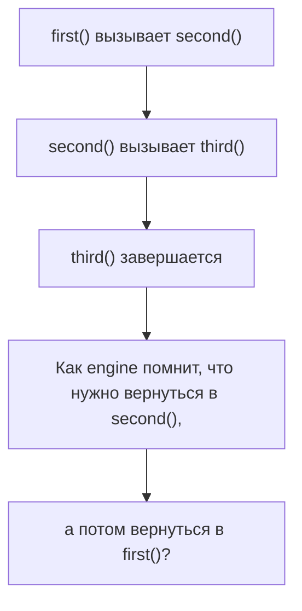
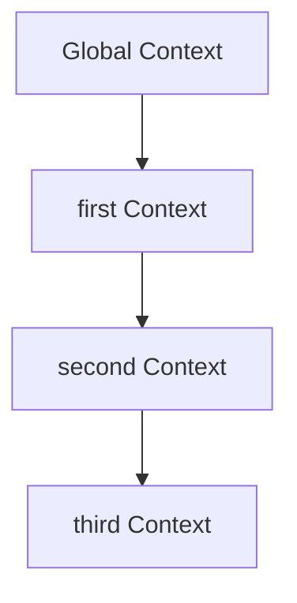
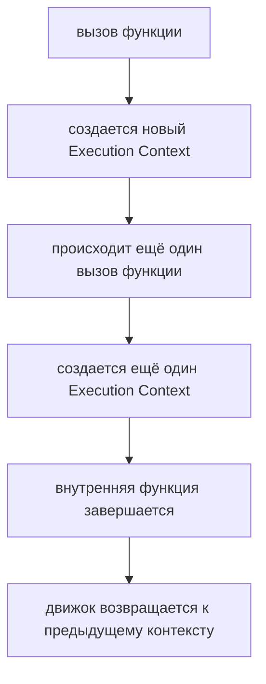
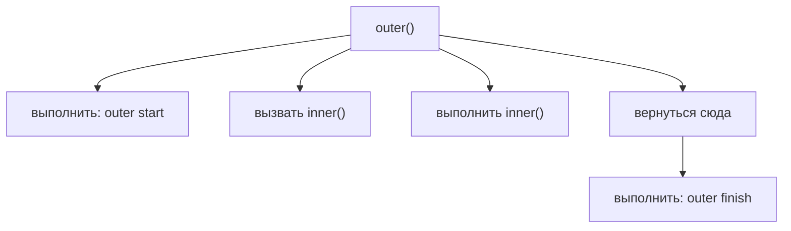
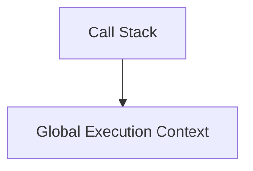
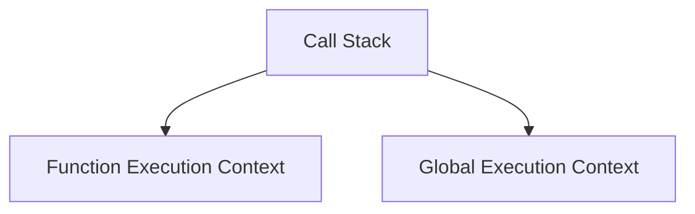
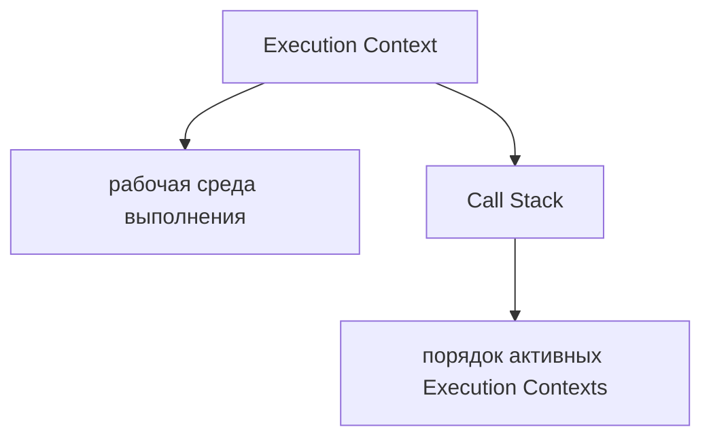
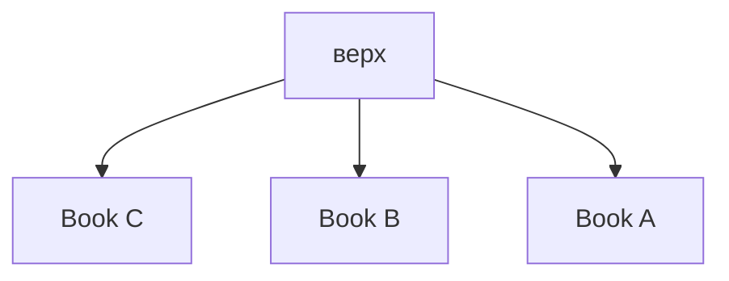
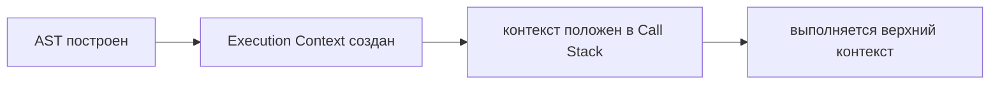

# Стек вызовов

## Связь с предыдущей главой

В предыдущей главе была построена модель Execution Context: engine создает рабочую среду для выполнения global-кода и отдельную рабочую среду для каждого вызова функции.

Теперь появляется следующий вопрос:

> Если во время выполнения может существовать несколько active Execution Contexts, как JavaScript помнит, какой context сейчас выполняется и куда нужно вернуться после завершения функции?

Эта глава объясняет Call Stack — механизм, который управляет активными Execution Contexts в синхронном JavaScript.

Synchronous JavaScript — код, который выполняется шаг за шагом без передачи продолжения в асинхронные очереди; Event Loop, Promises, microtasks и macrotasks будут изучаться позже.

---

## Предварительные требования

Для этой главы нужно понимать:

* что Execution Context — рабочая среда выполнения кода;
* что Global Execution Context создается для верхнего уровня запуска;
* что Function Execution Context создается при вызове функции;
* что Function Execution Context исчезает после завершения вызова;
* что runtime предоставляет API вроде `console`.

Не требуется знать Event Loop, Promises, microtasks, macrotasks, async / await или внутренние оптимизации engine. Эти темы будут изучаться позже.

---

## Время изучения

Ориентировочное время:

```text
Чтение главы:            90-120 минут
Разбор схем:             40-50 минут
Запуск примеров:         25-35 минут
Практика:                90-120 минут
Повторение материала:    30 минут
```

Уровень сложности: **L3**.

L3 означает фундаментальный уровень: глава объясняет механизм, который нужен для чтения stack traces, debugging helpers, анализа Page Object и понимания будущих тем про recursion и async.

---

## Навигация

Предыдущая глава:

```text
docs/01-javascript/03-execution-context.md
```

Следующая глава:

```text
docs/01-javascript/05-memory.md
```

---

## Цели обучения

После изучения этой главы вы будете понимать:

* что такое Call Stack;
* почему Call Stack существует;
* как Call Stack связан с Execution Context;
* что значит push context onto the stack;
* что значит pop context from the stack;
* как выполняются nested function calls;
* как JavaScript возвращается к предыдущему месту выполнения;
* как stack растет и уменьшается;
* почему программа заканчивается, когда stack становится empty;
* что такое stack overflow на высоком уровне;
* как читать stack trace;
* как применять модель Call Stack в Automation QA.

---

## Мотивация

Начнем с наблюдаемого поведения.

```javascript
function first() {
  second();
  console.log('first finished');
}

function second() {
  third();
  console.log('second finished');
}

function third() {
  console.log('third finished');
}

first();
```

Результат:

```text
third finished
second finished
first finished
```

Вопрос:


```mermaid
flowchart TD
    N1["first() вызывает second()"]
    N2["second() вызывает third()"]
    N3["third() завершается"]
    N4["Как engine помнит, что нужно вернуться в second(),"]
    N5["а потом вернуться в first()?"]
    N3 --> N4
    N1 --> N2
    N2 --> N3
    N4 --> N5
```

Если Execution Context — это рабочая комната, то при вложенных вызовах таких комнат становится несколько. Engine должен знать, какая комната активна сейчас и в какую комнату нужно вернуться.


```mermaid
flowchart TD
    N1["Global Context"]
    N2["first Context"]
    N3["second Context"]
    N4["third Context"]
    N1 --> N2
    N2 --> N3
    N3 --> N4
```

Этой задачей занимается Call Stack.

Но снова не будем начинать с определения. Сначала почувствуем проблему:


```mermaid
flowchart TD
    N1["вызов функции"]
    N2["создается новый Execution Context"]
    N3["происходит ещё один вызов функции"]
    N4["создается ещё один Execution Context"]
    N5["внутренняя функция завершается"]
    N6["движок возвращается к предыдущему контексту"]
    N1 --> N2
    N2 --> N3
    N3 --> N4
    N4 --> N5
    N5 --> N6
```

Главный вопрос главы:

> Что происходит внутри engine прямо сейчас?

---

## Теория

### Проблема возврата

Когда функция вызывает другую функцию, выполнение внешней функции временно приостанавливается.

```javascript
function outer() {
  console.log('outer start');
  inner();
  console.log('outer finish');
}

function inner() {
  console.log('inner');
}

outer();
```

Движок должен сделать несколько вещей:

* начать выполнение `outer`;
* остановиться внутри `outer` на вызове `inner`;
* выполнить `inner`;
* после завершения `inner` вернуться в `outer`;
* продолжить `outer` со строки после вызова `inner`.

Схема:


```mermaid
flowchart TD
    N1["outer()"]
    N2["выполнить: outer start"]
    N3["вызвать inner()"]
    N4["выполнить inner()"]
    N5["вернуться сюда"]
    N6["выполнить: outer finish"]
    N1 --> N2
    N1 --> N3
    N1 --> N4
    N1 --> N5
    N5 --> N6
```

Что происходит внутри движка прямо сейчас:

```text
Engine должен запомнить место возврата.
Engine должен знать, какой Execution Context активен.
```

### Что такое стек вызовов

Теперь можно ввести термин.

Стек вызовов — это структура, с помощью которой движок управляет активными контекстами выполнения.

Когда начинается выполнение файла, в стек помещается глобальный контекст выполнения. Когда вызывается функция, создаётся контекст выполнения функции и помещается сверху. Когда функция завершается, её контекст снимается.


```mermaid
flowchart TD
    N1["Call Stack"]
    N2["Global Execution Context"]
    N1 --> N2
```

При вызове функции:


```mermaid
flowchart TD
    N1["Call Stack"]
    N2["Function Execution Context"]
    N3["Global Execution Context"]
    N1 --> N2
    N1 --> N3
```

Стек вызовов отвечает не за создание кода и не за API среды. Он отвечает за порядок активных контекстов.


```mermaid
flowchart TD
    N1["Execution Context"]
    N2["рабочая среда выполнения"]
    N3["Call Stack"]
    N4["порядок активных Execution Contexts"]
    N1 --> N2
    N1 --> N3
    N3 --> N4
```

Что происходит внутри движка прямо сейчас:

```text
Engine кладет новый context поверх текущего.
Верхний context становится активным.
```

### Стопка книг

Первая ментальная модель — стопка книг.

Книгу можно положить сверху. Снять можно тоже верхнюю. Нельзя взять нижнюю книгу, не сняв верхние.


```mermaid
flowchart TD
    N1["верх"]
    N2["Book C"]
    N3["Book B"]
    N4["Book A"]
    N1 --> N2
    N1 --> N3
    N1 --> N4
```

Стек вызовов работает так же:

Активен всегда верхний контекст.

### Стопка подносов

Вторая модель — стопка подносов.

Новый поднос кладется сверху. Последний положенный поднос снимается первым.

Это называют правилом «последним пришёл — первым ушёл».

Для стека вызовов это означает: активна всегда та функция, чей кадр лежит
сверху, а завершается она раньше тех, что под ней.

Что происходит внутри движка прямо сейчас:

```text
Engine работает с верхом stack.
Новый function call идет наверх.
Завершение функции снимает верхний context.
```

### Добавление контекста в стек

Добавление — операция помещения нового элемента на верх стека.

Когда вызывается функция, движок создаёт контекст выполнения и добавляет его в стек.

Что происходит внутри движка прямо сейчас:

```text
Engine встретил function call.
Engine создал Function Execution Context.
Engine положил его на верх Call Stack.
Engine выполняет верхний context.
```

### Снятие контекста со стека

Снятие — операция удаления верхнего элемента со стека.

Когда функция завершается, её контекст выполнения больше не нужен. Движок снимает его со стека вызовов.

После снятия активным снова становится контекст, который оказался сверху.

Что происходит внутри движка прямо сейчас:

```text
Engine завершил текущую функцию.
Engine снял ее context.
Engine вернулся к предыдущему context.
```

### Один вызов функции

Рассмотрим один вызов.

```javascript
function greet() {
  console.log('Hello');
}

greet();
```

Жизненный цикл:

```text
вызов greet()      →  [ greet ]  [ global ]
тело выполняется   →  [ greet ]  [ global ]
greet завершился   →            [ global ]
```

### Вложенные вызовы функций

Вложенные вызовы — это вызовы внутри вызовов.

```javascript
function first() {
  second();
}

function second() {
  third();
}

function third() {
  console.log('third');
}

first();
```

В схеме стек растёт вниз, но вершиной считается верхняя строка списка:

```text
[ third  ]  ← выполняется сейчас
[ second ]
[ first  ]
[ global ]
```

Теперь функции завершаются в обратном порядке: сначала снимается `third`, затем `second`, затем `first`.

Что происходит внутри движка прямо сейчас:

```text
Каждый вложенный вызов добавляет новый context.
Каждое завершение снимает верхний context.
```

### Возврат из функций

Когда функция завершается, движок должен вернуться в место вызова.

```javascript
function getName() {
  return 'Anna';
}

const name = getName();
console.log(name);
```

`return` завершает выполнение функции и передаёт результат в место вызова. Подробная глава о нём будет позже; сейчас важен сам механизм возврата.

Движок помнит место возврата через стек вызовов: после снятия кадра активным становится предыдущий контекст.

### Рост стека

Стек растёт, когда функции вызывают другие функции.

В реальных программах стек постоянно растёт и уменьшается.

Что происходит внутри движка прямо сейчас:

```text
Engine отслеживает текущую цепочку синхронных вызовов.
```

### Пустой стек

Когда глобальный контекст выполнения завершён и снят, стек становится пустым.

Для синхронной программы это означает, что выполнять больше нечего.

Асинхронный код, событийный цикл, таймеры и промисы будут изучаться позже. Там история усложнится: стек может опустеть, а среда выполнения позже снова поместит работу на выполнение. В этой главе мы изучаем только синхронный JavaScript.

### Полный цикл жизни стека

Полный жизненный цикл стека для простой программы:

```text
1. старт программы      [ global ]
2. вызов greet()        [ global ][ greet ]
3. вызов format()       [ global ][ greet ][ format ]
4. format завершилась   [ global ][ greet ]
5. greet завершилась    [ global ]
6. конец программы      [ ]
```

Стек растёт вправо при каждом вызове и уменьшается при каждом возврате. Кадр
снимается только тогда, когда функция действительно завершилась.

### Переполнение стека на высоком уровне

Стек вызовов не бесконечен.

Если функции вызывают функции слишком глубоко и контексты продолжают добавляться, стек может переполниться.

Переполнение стека — ситуация, когда вызовов стало слишком много и движок больше не может безопасно добавить новый контекст.

Типичный источник — рекурсия без корректного условия остановки. Рекурсия — ситуация, когда функция вызывает сама себя; подробно она будет изучаться позже вместе с функциями.

В этой главе важно только одно: кадры снимаются лишь после завершения функции,
поэтому бесконечная цепочка вызовов рано или поздно упирается в предел размера
стека и программа останавливается с ошибкой `RangeError`.

### Трассировка стека

Трассировка стека — текстовое описание цепочки вызовов, которая привела к ошибке.

Если ошибка произошла внутри глубокой функции, трассировка показывает весь путь
до неё:

```text
at validateStatus (helpers/validate.js:12)   ← здесь возникла ошибка
at checkResponse  (helpers/api.js:34)
at runTest        (tests/login.spec.js:8)    ← отсюда всё началось
```

Это читается снизу вверх как путь к ошибке:

Трассировка не показывает всех деталей контекста выполнения. Но она показывает цепочку вызовов, связанную со стеком.

Что происходит внутри движка прямо сейчас:

```text
Runtime error произошла в верхнем context.
Engine может показать цепочку вызовов, которые привели к этому context.
```

### Связь контекста выполнения и стека вызовов

Связь можно представить так: контекст выполнения — это «что выполняется», а стек вызовов — «в каком порядке эти контексты сменяют друг друга».

Или так: контекст отвечает на вопрос «где сейчас код», а стек — на вопрос «куда вернуться, когда код закончится».

Стек вызовов не объясняет, какие имена доступны внутри контекста. Это будет темой области видимости. Стек объясняет, какой контекст сейчас активен и куда движок вернётся.

### Место главы в модели JavaScript


```mermaid
flowchart LR
    N1["AST построен"]
    N2["Execution Context создан"]
    N3["контекст положен в Call Stack"]
    N4["выполняется верхний контекст"]
    N1 --> N2
    N2 --> N3
    N3 --> N4
```

Предыдущая глава объяснила, что такое контекст. Эта глава объясняет, как движок управляет активными контекстами.

### Переход к главе о памяти

Следующая крупная группа тем приведет к значениям, переменным и памяти.

После стека вызовов естественный вопрос:

> Где живут значения, с которыми работает контекст?

На этот вопрос постепенно ответят главы про переменные, примитивные типы, объекты, стек и кучу, а также ссылки.

Стек и куча как модель памяти будут изучаться позже. Сейчас слово «стек» относится именно к стеку вызовов, а не к будущей теме про память.

### Полный пример выполнения

Полный синхронный пример:

```javascript
function prepare() {
  validate();
}

function validate() {
  console.log('valid');
}

prepare();
```

Фильм выполнения:

Если вы можете нарисовать такую схему для любого синхронного кода, модель стека вызовов работает.

---

## Внутренний механизм

Внутренний механизм стека вызовов состоит из двух операций: добавления и снятия.

Движок всегда выполняет верхний контекст.

Когда верхний контекст завершён, движок снимает его. Следующий контекст сверху становится активным.

Это и есть механизм возвращения к предыдущему месту выполнения.

---

## Ментальная модель

Главная модель — стопка книг.

Последняя положенная книга снимается первой.

В терминах выполнения:

Модель подносов даёт тот же результат: подносы ставят один на другой, и взять можно только верхний.

Работать можно только с верхним подносом. Так же движок работает только с верхним контекстом выполнения.

---

## Примеры кода

Примеры к этой главе находятся в папке:

```text
examples/01-javascript/chapter-04/
```

Запускайте их из корня проекта.

### Пример 1. Один вызов

Файл:

```text
examples/01-javascript/chapter-04/01-single-call.js
```

Показывает один вызов функции: кадр добавлен, тело выполнено, кадр снят.

### Пример 2. Вложенные вызовы

Файл:

```text
examples/01-javascript/chapter-04/02-nested-calls.js
```

Показывает вложенные вызовы `first → second → third`.

### Пример 3. Рост стека

Файл:

```text
examples/01-javascript/chapter-04/03-stack-growth.js
```

Показывает наблюдаемое движение при росте стека.

### Пример 4. Снятие кадра

Файл:

```text
examples/01-javascript/chapter-04/04-stack-pop.js
```

Показывает возврат к предыдущему контексту после завершения внутренней функции.

### Пример 5. Трассировка стека

Файл:

```text
examples/01-javascript/chapter-04/05-stack-trace.js
```

Пример намеренно выбрасывает ошибку времени выполнения, чтобы показать трассировку стека.

### Пример 6. Идея переполнения стека

Файл:

```text
examples/01-javascript/chapter-04/06-stack-overflow-concept.js
```

Пример безопасно показывает идею глубины вызовов без настоящего переполнения.

---

## Частые вопросы

### Стек вызовов и контекст выполнения — это одно и то же?

Нет.

Контекст выполнения — рабочая среда выполнения. Стек вызовов — структура, которая хранит активные контексты.

### Стек вызовов хранит переменные?

В этой главе мы не изучаем модель памяти. Стек вызовов нужен для управления активными вызовами. Где живут значения и как работают ссылки, будет изучаться позже.

### Почему трассировка стека иногда длинная?

Потому что ошибка могла пройти через длинную цепочку вызовов: тест → фикстура → вспомогательная функция → ещё одна функция.

### Почему мы не изучаем событийный цикл здесь?

Потому что сначала нужно понять синхронный стек вызовов. Событийный цикл объясняет, как среда выполнения возвращает работу в стек позже, и будет изучаться в разделе про асинхронность.

### Переполнение стека всегда связано с рекурсией?

Чаще всего причиной является слишком глубокая цепочка вызовов, обычно из-за рекурсии без остановки. Подробности рекурсии будут изучаться позже.

---

## Распространённые мифы

### Миф 1. JavaScript забывает внешнюю функцию, когда входит во внутреннюю

Реальность:

Внешний контекст остаётся в стеке вызовов и ждёт, пока внутренний завершится.

### Миф 2. Ошибка показывает только место, где все сломалось

Реальность:

Трассировка стека показывает не только место ошибки, но и путь вызовов к нему.

### Миф 3. Стек вызовов объясняет асинхронность

Реальность:

Стек вызовов объясняет активное синхронное выполнение. Событийный цикл и очереди будут изучаться позже.

### Миф 4. Переполнение стека — это любая ошибка в трассировке

Реальность:

Трассировка стека — диагностический отчёт. Переполнение стека — конкретная ситуация, когда вызовов стало слишком много.

---

## Распространённые ошибки

### Ошибка 1. Читать трассировку стека только сверху

Что произошло:

Инженер видит последнюю функцию и игнорирует цепочку вызовов.

Исправленная модель: верхний кадр показывает место ошибки, а кадры ниже — путь, которым программа туда пришла. Нужны оба направления чтения.

### Ошибка 2. Думать, что функция после вызова продолжает выполняться параллельно

Что произошло:

Внешняя функция воспринимается как параллельная внутренней.

Исправленная модель: внешняя функция приостановлена на строке вызова и ждёт, пока внутренняя не завершится и не будет снята со стека.

Асинхронность и параллельное выполнение в этой главе не изучаются.

### Ошибка 3. Смешивать стек вызовов со стеком памяти

Что произошло:

Слово «стек» воспринимается одинаково во всех темах.

Исправленная модель: стек вызовов хранит контексты вызовов, а стек из пары «стек и куча» — это область памяти для значений. Совпадает только слово.

### Ошибка 4. Объяснять переполнение без роста стека

Что произошло:

Переполнение стека воспринимается как случайная ошибка.

Исправленная модель:

Переполнение — предсказуемое следствие роста стека. Каждый незавершённый вызов
занимает кадр, и когда кадры перестают помещаться в отведённую память, движок
прекращает выполнение с `RangeError`. Случайности здесь нет: тот же код с той
же глубиной упадёт снова.

---

## Практическое использование

Когда читаете синхронный код, рисуйте стек вручную.

Алгоритм:

```text
1. Начать с Global Context.
2. Найти первый function call.
3. Сделать push function context.
4. Если внутри есть новый call, сделать еще push.
5. Когда функция завершается, сделать pop.
6. Продолжить предыдущий context.
7. Когда Global завершен, stack empty.
```

Мини-шаблон для чтения любого стека: назовите, какой кадр сверху, какой под ним
и какой окажется последним снятым.

Чек-лист готовности к следующей теме:

```text
✓ Я понимаю push.
✓ Я понимаю pop.
✓ Я понимаю last in — first out.
✓ Я могу нарисовать stack для nested calls.
✓ Я могу прочитать stack trace как цепочку вызовов.
```

---

## Использование в Automation QA

### Чтение трассировок стека в Playwright

Трассировка стека в Playwright часто показывает цепочку:

Если читать только последнюю строку, можно пропустить настоящую причину. Иногда ошибка проявилась во вспомогательной функции, но вызвана неверными данными из фикстуры.

### Отладка цепочек вспомогательных функций

Вспомогательная функция может вызвать другую вспомогательную функцию.

Стек вызовов помогает понять, где была создана цепочка вызовов и куда движок возвращался.

### Цепочки вызовов в объектах страниц

Одна строка теста может вызвать несколько методов внутри объекта страницы.

Когда падает внутренняя проверка, трассировка стека помогает найти не только место падения, но и путь к нему.

### Цепочки вызовов в фикстурах

Фикстура может готовить данные, авторизацию и страницы.

Если фикстура падает до запуска теста, это не ошибка тестового шага. Это ошибка в цепочке подготовки.

### Как найти настоящий источник ошибки времени выполнения

Ошибка времени выполнения часто находится в верхней функции трассировки, но причина может быть ниже по цепочке вызовов.

Стек вызовов помогает не гадать, а читать путь выполнения.

---

## Итоги

Стек вызовов — механизм, с помощью которого движок управляет активными контекстами выполнения.

Когда программа начинается, в стек помещается глобальный контекст выполнения. Когда вызывается функция, создаётся контекст выполнения функции и помещается сверху. Верхний контекст является активным. Когда функция завершается, её контекст снимается, и движок возвращается к предыдущему.

Стек вызовов работает по правилу «последним пришёл — первым ушёл». Последний вызванный контекст завершается первым.

Для синхронной программы выполнение заканчивается, когда глобальный контекст завершён и стек становится пустым. Если вызовы становятся слишком глубокими, может произойти переполнение стека.

Следующая тема добавит новый слой: память объяснит, где программа концептуально хранит информацию во время выполнения. Область видимости, событийный цикл и асинхронность будут изучаться позже и не отменяют базовой модели стека вызовов.

---

## Что нужно запомнить

✓ Стек вызовов хранит активные контексты выполнения.

✓ Верхний контекст в стеке выполняется прямо сейчас.

✓ Вызов функции создаёт контекст выполнения и добавляет его в стек.

✓ Завершение функции снимает кадр со стека.

✓ Стек вызовов работает по правилу «последним пришёл — первым ушёл».

✓ Вложенные вызовы увеличивают стек.

✓ Возврат из функции возвращает движок к предыдущему контексту.

✓ Пустой стек означает завершение синхронной программы.

✓ Трассировка стека показывает цепочку вызовов до ошибки.

✓ Переполнение стека возникает из-за слишком глубокой цепочки вызовов.

---

## Проверьте себя

1. Зачем нужен стек вызовов?

2. Как стек вызовов связан с контекстом выполнения?

3. Что происходит при вызове функции?

4. Что происходит при завершении функции?

5. Что означает правило «последним пришёл — первым ушёл»?

6. Почему внешняя функция продолжает выполнение после внутренней?

7. Когда стек вызовов становится пустым?

8. Что такое трассировка стека?

9. Почему переполнение стека связано с глубиной вызовов?

10. Почему событийный цикл не изучается в этой главе?

### Ответы

1. Он хранит порядок незавершённых вызовов, чтобы движок знал, куда вернуться после завершения функции.
2. Каждый вызов кладёт на стек свой контекст выполнения. Верхний элемент стека — тот контекст, код которого выполняется прямо сейчас.
3. На стек кладётся новый кадр, и выполнение переходит внутрь функции.
4. Кадр снимается со стека, и выполнение продолжается с того места, откуда функцию вызвали.
5. Последним положили — первым снимут. Функция, вызванная позже всех, завершится раньше тех, которые её вызвали.
6. Её кадр всё это время остаётся на стеке: он не снимается, пока вложенный вызов не вернётся. Внешняя функция не завершена, она приостановлена.
7. Когда снят последний кадр — вся синхронная работа закончена и возвращаться некуда.
8. Снимок стека на момент ошибки: перечень вызовов от места падения к внешнему коду. Читается снизу вверх как путь, по которому программа туда пришла.
9. Каждый незавершённый вызов занимает место на стеке. Если вызовы вкладываются без условия остановки, место кончается, и движок останавливает программу ошибкой `RangeError`.
10. Стек вызовов описывает только синхронное выполнение. Событийный цикл объясняет, как на этот стек попадает отложенная работа, и требует понимания промисов и обратных вызовов.

---

## Практика

Практика к этой главе находится в файле:

```text
practice/01-javascript/04-call-stack.md
```

Перед практикой запустите примеры из раздела «Примеры кода» и вручную нарисуйте стек вызовов для каждого файла.

---

## Решения

Решения находятся в файле:

```text
solutions/01-javascript/04-call-stack.md
```

Открывайте решения после самостоятельной попытки. В этой главе важно сравнивать не только ответ, но и нарисованный стек вызовов.
