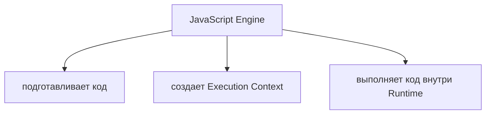
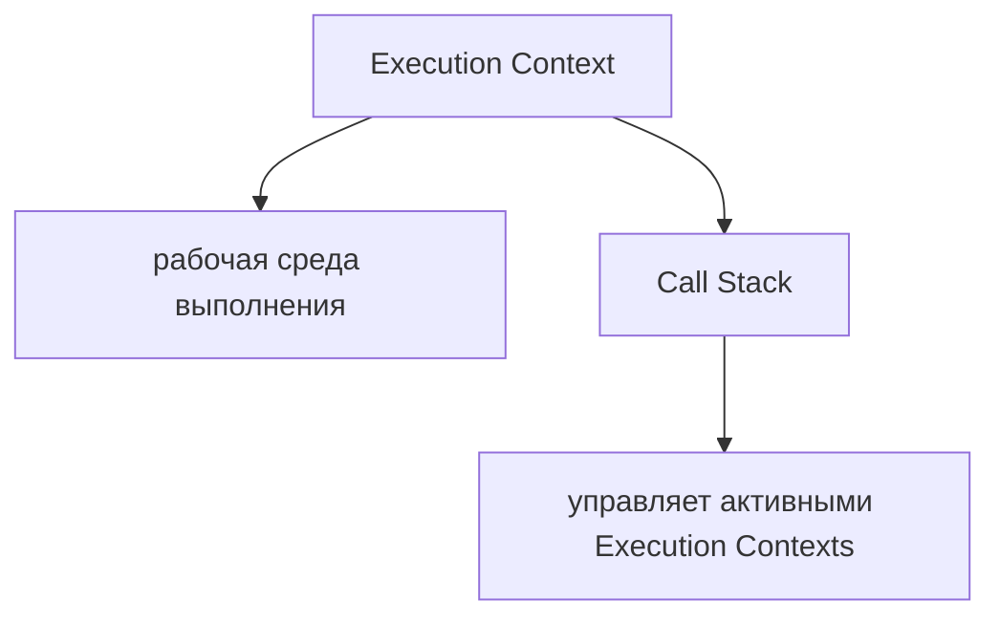
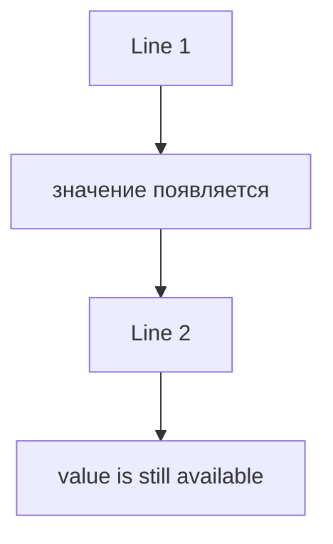
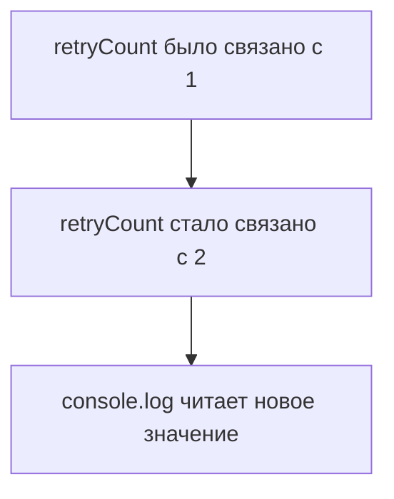
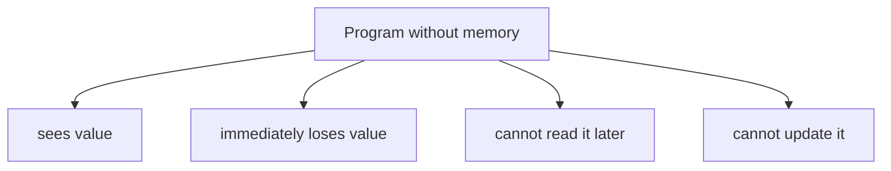
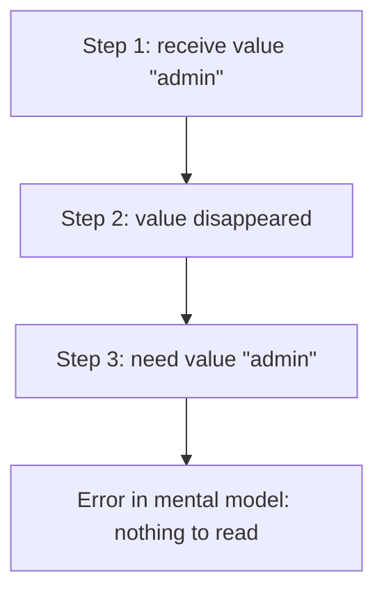
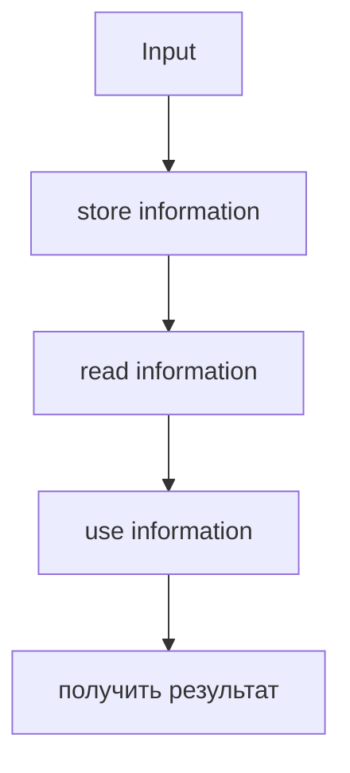
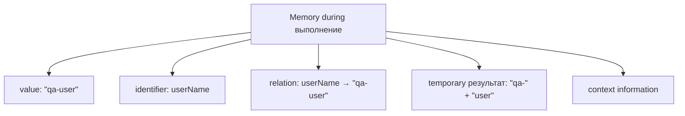

# Memory

## Связь с предыдущей главой

В предыдущих главах была собрана первая рабочая модель JavaScript:



Затем появилась модель Call Stack:



Теперь возникает следующий естественный вопрос:

> Где JavaScript хранит информацию, пока программа выполняется?

Если программа вывела значение на одной строке, а потом использовала его через несколько строк, значит это значение где-то сохранилось. Если функция подготовила данные, а следующая строка использовала результат, значит engine не потерял эту информацию между шагами.

Эта глава строит концептуальную модель memory.

Важно: здесь мы не изучаем Stack & Heap, references, Garbage Collector, Scope, Closures и Lexical Environment. Эти темы будут разобраны в отдельных главах. Сейчас задача проще и фундаментальнее: понять, зачем программе нужна память и что engine делает с информацией во время выполнения.

---

## Предварительные требования

Для этой главы нужно понимать:

* что JavaScript-код выполняется engine;
* что runtime предоставляет внешние возможности вроде `console`;
* что Execution Context является рабочей средой выполнения;
* что Call Stack управляет активными Execution Contexts;
* что функция при вызове получает отдельный Function Execution Context;
* что синхронная программа заканчивается, когда Call Stack становится empty.

Не требуется знать типы данных, объекты, ссылки, Scope, Stack & Heap или Garbage Collector. Если эти слова появляются в главе, они используются только как мост к будущим темам.

---

## Время изучения

Ориентировочное время:

```text
Чтение главы:            90-120 минут
Разбор схем:             40-50 минут
Запуск примеров:         25-35 минут
Практика:                90-120 минут
Повторение материала:    30 минут
```

Уровень сложности: **L3**.

L3 означает фундаментальный уровень: глава не учит новым конструкциям языка, но формирует модель, без которой переменные, значения, параметры функций, объекты и references будут восприниматься как набор правил.

---

## Навигация

Предыдущая глава:

```text
docs/01-javascript/04-call-stack.md
```

Следующая глава:

```text
docs/01-javascript/06-variables.md
```

Следующая глава объяснит, как программист работает с memory через `var`, `let`, `const`, declaration, initialization и assignment.

---

## Цели обучения

После изучения этой главы вы будете понимать:

* зачем любой программе нужна memory;
* какую информацию JavaScript хранит во время выполнения;
* что такое значения на концептуальном уровне;
* зачем нужны identifiers;
* как можно представить conceptual memory locations;
* что значит сохранить информацию;
* что значит прочитать информацию;
* что значит обновить информацию;
* что значит удалить информацию на высоком уровне;
* как lifetime данных связан с выполнением программы;
* чем temporary information отличается от long-lived information;
* как memory связана с Execution Context;
* как memory связана с Call Stack;
* почему эта модель важна для Automation QA.

---

## Мотивация

Начнем с наблюдаемого поведения.

```javascript
const testStatus = 'passed';

console.log(testStatus);
```

Результат:

```text
passed
```

На первой строке появляется значение `'passed'`. На третьей строке JavaScript выводит это значение.

Вопрос:



Почему значение не исчезло после первой строки?

Теперь другой пример:

```javascript
let retryCount = 1;

retryCount = 2;

console.log(retryCount);
```

Результат:

```text
2
```

Вопрос:



Где engine хранит эту связь? Как он понимает, что нужно прочитать именно последнее значение?

Если убрать memory из модели, программа становится невозможной.



Такая программа могла бы выполнять только одноразовые действия, где каждый шаг никак не связан с предыдущим.

Реальные программы так не работают. Тест хранит имя пользователя. Helper возвращает подготовленные данные. Fixture сохраняет состояние авторизации. Assertion сравнивает actual и expected. Все это требует memory.

Главный вопрос главы:

> Что engine делает с информацией прямо сейчас?

---

## Теория

### Программа без memory

Представим программу, которая не умеет ничего сохранять.



Такая модель не может объяснить даже простое поведение:

```javascript
const role = 'admin';

console.log(role);
```

Engine должен где-то сохранить информацию, чтобы следующая операция могла ее прочитать.

Что происходит внутри engine прямо сейчас:

```text
Engine встречает значение.
Engine должен сохранить его в доступной внутренней модели.
Engine связывает сохраненную информацию с именем, чтобы найти ее позже.
```

### Зачем программе memory

Memory нужна, чтобы программа могла:

* помнить данные между строками;
* передавать результат одного шага в следующий;
* обновлять состояние;
* хранить промежуточные результаты;
* выполнять проверки;
* строить более сложное поведение из простых шагов.



Без memory программа не может иметь состояние.

State — это информация, которая описывает текущее состояние программы в конкретный момент. Подробные темы состояния, объектов и изменяемости будут изучаться позже.

### Что JavaScript хранит во время выполнения

На концептуальном уровне JavaScript хранит несколько видов информации:

* значения;
* identifiers;
* связи между identifiers и значения;
* временные результаты вычислений;
* информацию, нужную текущему Execution Context;
* результаты, которые используются позже.



Эта схема концептуальная. Она не описывает физическое устройство V8 или конкретные области памяти. Реальная реализация engine сложнее. Для обучения сейчас важнее другое: engine должен уметь хранить, находить и обновлять информацию.

### Values

Value — это данные, с которыми работает программа.

Примеры значения:

```text
"passed"
42
true
null
```

Primitive Types будут изучаться позже. Сейчас достаточно понимать:

Программа не работает с пустыми словами. Она работает с значения.

```javascript
console.log('ready');
```

Здесь `'ready'` — value, который передается в `console.log`.

Что происходит внутри engine прямо сейчас:

```text
Engine видит value.
Engine может использовать value сразу
или сохранить его, если value должен понадобиться позже.
```

### Identifiers

Identifier — имя, по которому программа обращается к сохраненной информации.

```javascript
const status = 'ready';

console.log(status);
```

`status` — identifier. Он помогает engine найти нужную информацию.

Identifier не является самим value. Это имя, через которое программа получает доступ к value.

Распространённая ошибка:

```text
status и "ready" воспринимаются как одно и то же
```

Исправленная модель:

Variables будут изучаться в следующей главе. Там будет подробно разобрано, как identifiers создаются через declarations и как получают значения через initialization и assignment.

### Концептуальные места в памяти

Чтобы хранить информацию, удобно представить memory как набор ячеек.

Это не физическая схема engine. Это учебная модель.

Location — концептуальное место, где хранится информация.

Если добавить identifier, модель становится такой:

Важно: это не глава про references. Сейчас стрелка означает только учебную связь "по этому имени engine может найти сохраненную информацию". References как отдельный механизм будут изучаться позже.

### Store value

Сохранить value означает сделать так, чтобы программа могла использовать его позже.

```javascript
const browserName = 'chromium';
```

Концептуально:

Диаграмма хранения:

Что происходит внутри engine прямо сейчас:

```text
Engine получает value.
Engine связывает value с identifier.
Engine может найти value позже по этому identifier.
```

### Read value

Прочитать value означает найти сохраненную информацию и использовать ее в текущей операции.

```javascript
const browserName = 'chromium';

console.log(browserName);
```

Концептуально:

Диаграмма чтения:

Если value не был сохранен или identifier недоступен, программа не сможет корректно прочитать информацию. Подробности доступности имен относятся к Scope и будут изучаться позже.

### Update value

Обновить информацию означает изменить то, что программа будет читать по identifier в следующих шагах.

```javascript
let attempt = 1;

attempt = 2;

console.log(attempt);
```

Концептуально:

Важно: эта глава не объясняет различия между `let`, `const` и `var`. Следующая глава будет посвящена variables и покажет, почему одни identifiers можно переназначать, а другие нельзя.

Сейчас важна механика:

Что происходит внутри engine прямо сейчас:

```text
Engine находит место, связанное с identifier.
Engine обновляет сохраненную информацию.
Следующее чтение получает новое состояние.
```

### Removing information на высоком уровне

Данные не обязаны жить вечно.

Когда Execution Context завершает работу, часть информации, которая была нужна только этому context, больше не нужна программе.

Это высокоуровневая модель. Garbage Collector — механизм автоматического освобождения памяти в JavaScript engines; он будет изучаться позже. В этой главе важно только понять:

```text
Some data is needed now.
Some data is needed later.
Some data becomes unnecessary.
```

### Lifetime of stored data

Lifetime — период, в течение которого информация нужна программе.

Пример:

```javascript
function printUserName() {
  const userName = 'Anna';

  console.log(userName);
}

printUserName();
```

Концептуально:

Scope и Lexical Environment объяснят, где именно identifier доступен. Сейчас важно только lifetime: не вся информация нужна всей программе.

### Temporary information

Temporary information нужна только для одного короткого шага.

```javascript
const message = 'Status: ' + 'passed';

console.log(message);
```

Концептуально:

Диаграмма temporary data:

Temporary workspace — учебная модель места, где engine держит промежуточную информацию во время текущего шага. Это не отдельная физическая область, которую нужно запоминать как термин.

### Long-lived information

Long-lived information нужна дольше одного шага.

```javascript
const baseUrl = 'https://example.com';

console.log(baseUrl);
console.log(baseUrl);
console.log(baseUrl);
```

Концептуально:

Диаграмма long-lived data:

Long-lived не означает "навсегда". Это означает "дольше, чем один момент выполнения".

### Program execution timeline

Теперь соберем временная шкала:

Это не замена Call Stack. Это следующий слой модели.

### Memory during function execution

Каждый вызов функции может иметь информацию, нужную именно этому вызову.

```javascript
function printStatus() {
  const status = 'ready';

  console.log(status);
}

printStatus();
```

Концептуально:

Когда функция выполняется, engine хранит информацию, которая нужна для текущего function execution.

Слово "local" здесь используется на бытовом уровне: информация нужна конкретному выполнению функции. Формальная тема Scope будет изучаться позже.

### Execution Context + Memory

Execution Context — рабочая среда. Memory — информация, с которой эта среда работает.

Более полезная схема:

Для function execution:

Это концептуальная модель. В будущих главах она будет уточнена через Variables, Scope, Lexical Environment, Primitive Types, Object Type, References и Stack & Heap.

### Call Stack + Memory

Call Stack отвечает на вопрос:

```text
Which Execution Context is active?
```

Memory отвечает на вопрос:

```text
What information is available for execution?
```

Вместе:

Engine выполняет верхний context и работает с информацией, которая нужна этому context.

### Warehouse

Первая ментальная модель — склад.

Когда программа сохраняет value, она кладет информацию на склад. Когда читает value, она идет к нужной полке.

Модель полезна тем, что отделяет:

### Labeled shelves

Identifiers можно представить как подписи на полках.

Если подпись есть, engine может найти содержимое. Если подписи нет или она недоступна в текущем месте выполнения, engine не сможет использовать значение. Почему identifier может быть недоступен, объяснит глава про Scope.

### Numbered storage boxes

Иногда полезнее думать не о полках с именами, а о numbered boxes.

```text
Box #101: "chromium"
Box #102: "firefox"
Box #103: "webkit"
```

Identifier помогает найти нужную коробку:

Эта модель готовит к будущей теме references, но не объясняет ее. References будут отдельной главой.

### Notebook with records

Еще одна модель — блокнот записей.

Когда значение обновляется, запись меняется:

```text
Before
retryCount: 1

After
retryCount: 2
```

Модель блокнота полезна для debugging: можно мысленно вести таблицу "identifier → current value".

### Temporary workspace

Не вся информация достойна отдельной долгой записи.

Например:

```javascript
console.log('User: ' + 'Anna');
```

Концептуально:

Это помогает не думать, что каждое промежуточное значение обязательно становится долгоживущей записью программы.

### Переход к Variables

Эта глава объяснила, что программе нужна memory.

Следующая глава объяснит, как программист управляет этой memory через variables.

Ключевой переход:

```text
Memory answers:
"Where is information kept?"

Variables answer:
"How do we create and use named access to that information?"
```

---

## Внутренний механизм

Внутренний механизм этой главы можно описать как цикл работы с информацией.

Engine постоянно делает три базовые операции:

Для синхронного кода это происходит внутри активного Execution Context.

Что происходит внутри engine прямо сейчас:

Важно не перепрыгивать вперед. В этой главе не нужно знать, где физически лежит value, как устроены references и когда именно работает Garbage Collector. Пока достаточно модели "engine хранит информацию, чтобы программа могла продолжать осмысленное выполнение".

---

## Ментальная модель

Соберем пять моделей в одну.

### Warehouse

### Labeled shelves

### Numbered storage boxes

### Notebook with records

### Temporary workspace

Главная итоговая модель:

---

## Примеры кода

Примеры к этой главе находятся в папке:

```text
examples/01-javascript/chapter-05/
```

Запускайте их из корня проекта.

### Пример 1. Store value

Файл:

```text
examples/01-javascript/chapter-05/01-store-value.js
```

Показывает, что value может быть сохранен под identifier и использован позже.

### Пример 2. Read value

Файл:

```text
examples/01-javascript/chapter-05/02-read-value.js
```

Показывает чтение одного сохраненного value несколько раз.

### Пример 3. Update value

Файл:

```text
examples/01-javascript/chapter-05/03-update-value.js
```

Показывает обновление сохраненной информации.

### Пример 4. Function memory

Файл:

```text
examples/01-javascript/chapter-05/04-function-memory.js
```

Показывает, что информация может быть нужна только во время выполнения функции.

### Пример 5. Lifetime

Файл:

```text
examples/01-javascript/chapter-05/05-lifetime.js
```

Показывает difference между data, которая нужна нескольким шагам, и data, которая нужна только внутри одного вызова.

### Пример 6. Temporary data

Файл:

```text
examples/01-javascript/chapter-05/06-temporary-data.js
```

Показывает временный результат, который сразу используется.

---

## Частые вопросы

### Memory — это Stack & Heap?

Нет. В этой главе memory — общая концепция хранения информации. Stack & Heap — более конкретная модель размещения разных видов данных, она будет изучаться позже.

### Identifier хранит value внутри себя?

Нет. Identifier лучше воспринимать как имя для доступа к сохраненной информации. В этой главе мы не углубляемся в физическое устройство memory.

### Почему нельзя сразу изучать variables?

Можно выучить синтаксис variables без этой главы, но тогда `let`, `const`, assignment и lifetime будут казаться правилами. Модель memory объясняет, зачем variables вообще нужны.

### JavaScript сам удаляет ненужную информацию?

На высоком уровне да: JavaScript управляет памятью автоматически. Механизм Garbage Collector будет изучаться позже.

### Нужно ли Automation QA знать memory?

Да. Без этой модели сложно понимать, почему test data сохраняется между строками, почему helper result доступен дальше и почему ошибка может быть связана с неправильным обновлением значения.

---

## Распространенные мифы

### Миф 1. Значения существуют только в строке, где написаны

Реальность:

Если value сохранен и нужен позже, engine может прочитать его на следующих шагах.

### Миф 2. Identifier и value — одно и то же

Реальность:

Identifier — имя. Value — информация. Эта разница станет критичной в главах про variables, objects и references.

### Миф 3. Все данные живут одинаково долго

Реальность:

Одни данные нужны один шаг, другие — несколько строк, третьи — весь период выполнения конкретного context.

### Миф 4. Memory нужна только для сложных объектов

Реальность:

Memory нужна даже для простого значения вроде `'passed'`, если программа должна использовать его позже.

---

## Типичные ошибки

### Ошибка 1. Думать, что `console.log` хранит значение

Неправильная модель:

```text
console.log remembers previous values
```

Что произошло:

`console.log` выводит переданный value. Он не является местом хранения данных программы.

Исправленная модель:

### Ошибка 2. Не отличать storing от reading

Неправильная модель:

```text
const status = "ready"
console.log(status)

Both lines do the same thing
```

Что произошло:

Первая строка сохраняет информацию. Вторая строка читает сохраненную информацию.

Исправленная модель:

### Ошибка 3. Ожидать старое значение после update

Неправильная модель:

```javascript
let status = 'new';

status = 'done';

console.log(status);
```

Ожидание:

```text
new
```

Что произойдет:

```text
done
```

Почему:

Следующее чтение получает обновленную информацию.

### Ошибка 4. Смешивать lifetime и Scope

Неправильная модель:

```text
Если value существовал внутри функции, он должен быть доступен везде.
```

Что произошло:

Lifetime и доступность identifiers связаны, но это не одно и то же. Scope будет изучаться позже и объяснит правила доступности имен.

Исправленная модель:

```text
Function execution needs some information.
After function finishes, that execution information is no longer active.
```

---

## Практическое использование

Когда читаете код, задавайте четыре вопроса:

```text
1. Где появляется value?
2. Под каким identifier оно сохраняется?
3. Где value читается?
4. Где value обновляется?
```

Для простого кода можно вести таблицу:

Эта таблица особенно полезна перед тем, как запускать код. Она заставляет сначала построить mental model, а потом проверить себя через execution.

Мини-чек-лист:

```text
✓ Я вижу, где value появляется.
✓ Я понимаю, где оно сохраняется.
✓ Я понимаю, где оно читается.
✓ Я понимаю, где оно обновляется.
✓ Я отличаю temporary data от long-lived data.
```

---

## Использование в Automation QA

### Test data survives between инструкции

В автотесте данные часто готовятся в начале сценария и используются позже.

```javascript
const userName = 'qa-user';

console.log(userName);
```

Концептуально:

Без memory тест не мог бы подготовить данные и использовать их в следующих действиях.

### Helper results remain available

Helper может подготовить значение, которое тест использует дальше.

```javascript
function buildUserName() {
  return 'qa-user';
}

const userName = buildUserName();

console.log(userName);
```

`return` будет подробно изучаться позже. Сейчас важна идея: результат helper должен быть сохранен, иначе следующий шаг не сможет его использовать.

### Values survive between assertions

Тест может хранить expected value:

```javascript
const expectedStatus = 'active';

console.log(expectedStatus);
console.log(expectedStatus);
```

Memory объясняет, почему одно и то же expected value доступно для нескольких проверок.

### Отладка Playwright tests

Когда Playwright-тест падает, причина часто связана не с самим кликом или assertion, а с тем, какое значение было сохранено раньше.

Если URL неправильный, нужно смотреть не только на `page.goto`, но и на место, где значение было сохранено или обновлено.

### Fixture data

Fixture часто подготавливает long-lived data для теста:

Memory model помогает понять, почему ошибка в подготовленных данных проявляется позже, в другом слое test framework.

---

## Итоги

Memory нужна любой программе, потому что выполнение состоит из связанных шагов. Если один шаг создал информацию, а другой шаг должен ее использовать, engine должен сохранить эту информацию.

В этой главе memory рассматривалась концептуально. Мы не изучали Stack & Heap, references, Garbage Collector, Scope или Lexical Environment. Вместо этого была построена базовая модель:

Теперь общая модель JavaScript стала такой:

```text
Execution Context creates the execution environment.
Call Stack manages which context is active.
Memory stores everything the engine needs while the program runs.
```

Следующая глава объяснит variables: как программист создает identifiers, связывает их с значения и управляет сохраненной информацией через `var`, `let` и `const`.

---

## Что нужно запомнить

✓ Программа не может работать без memory.

✓ Memory нужна, чтобы сохранять информацию между шагами выполнения.

✓ Value — информация, с которой работает программа.

✓ Identifier — имя для доступа к сохраненной информации.

✓ Store value означает сохранить информацию для будущего использования.

✓ Read value означает получить сохраненную информацию.

✓ Update value означает изменить информацию, которую программа прочитает позже.

✓ Temporary information нужна только на короткий момент.

✓ Long-lived information нужна дольше одного шага.

✓ Execution Context, Call Stack и Memory описывают разные части одной модели выполнения.

---

## Проверьте себя

1. Почему программа не может работать без memory?

2. Чем value отличается от identifier?

3. Что значит store value?

4. Что значит read value?

5. Что значит update value?

6. Почему temporary data не обязательно живет долго?

7. Чем long-lived information отличается от temporary information?

8. Как memory связана с Execution Context?

9. Как memory связана с Call Stack?

10. Почему Automation QA engineer должен понимать memory model?

---

## Практика

Практика к этой главе находится в файле:

```text
practice/01-javascript/05-memory.md
```

Перед выполнением практики запустите примеры из `examples/01-javascript/chapter-05/` и для каждого файла составьте таблицу:

---

## Решения

Решения находятся в файле:

```text
solutions/01-javascript/05-memory.md
```

Открывайте решения после самостоятельной попытки. В этой главе важно сравнивать не только итоговый ответ, но и путь изменения memory состояние.
