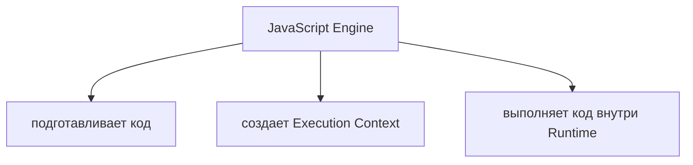
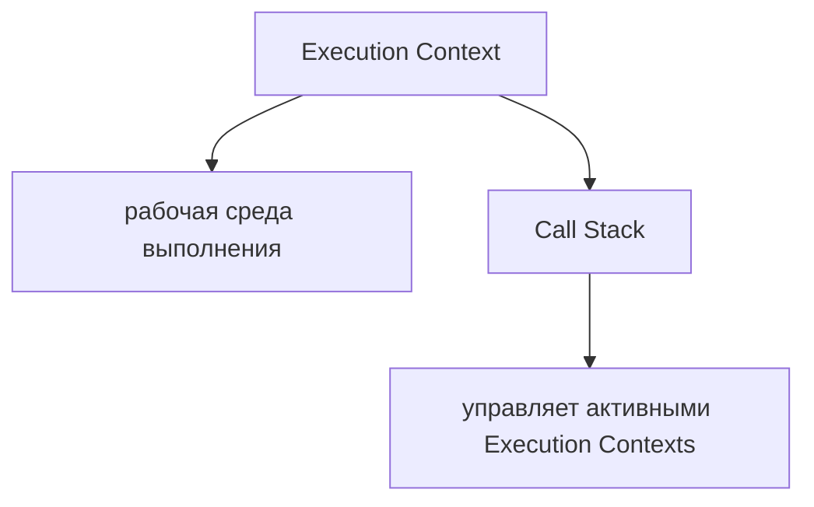
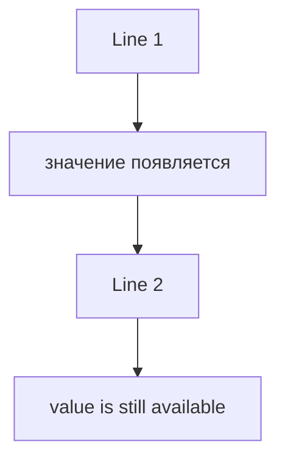
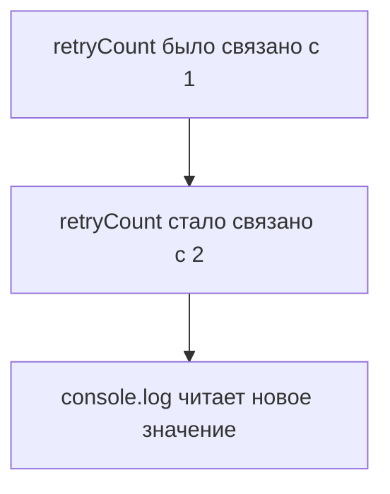
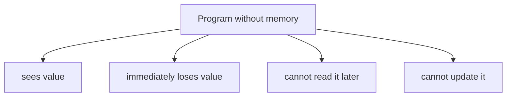
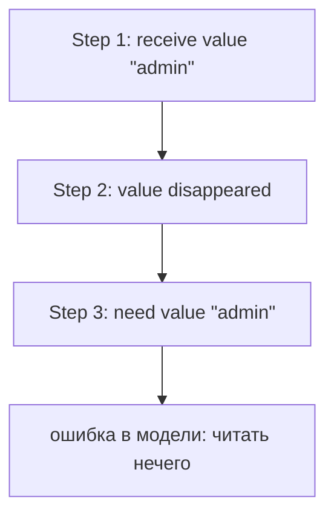
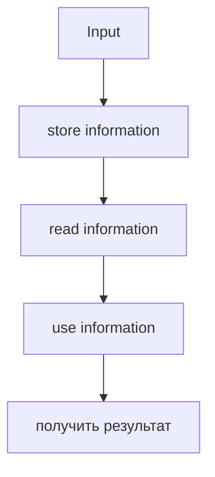
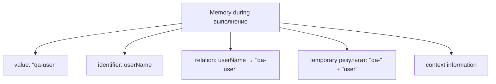
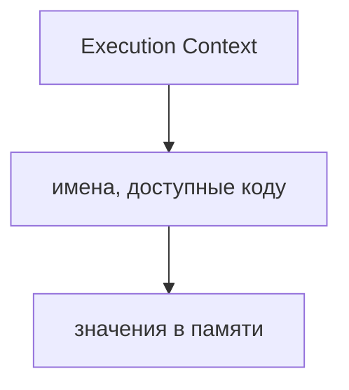

# Память

## Связь с предыдущей главой

В предыдущих главах была собрана первая рабочая модель JavaScript:


```mermaid
flowchart TD
    N1["JavaScript Engine"]
    N2["подготавливает код"]
    N3["создает Execution Context"]
    N4["выполняет код внутри Runtime"]
    N1 --> N2
    N1 --> N3
    N1 --> N4
```

Затем появилась модель Call Stack:


```mermaid
flowchart TD
    N1["Execution Context"]
    N2["рабочая среда выполнения"]
    N3["Call Stack"]
    N4["управляет активными Execution Contexts"]
    N1 --> N2
    N1 --> N3
    N3 --> N4
```

Теперь возникает следующий естественный вопрос:

> Где JavaScript хранит информацию, пока программа выполняется?

Если программа вывела значение на одной строке, а потом использовала его через несколько строк, значит это значение где-то сохранилось. Если функция подготовила данные, а следующая строка использовала результат, значит engine не потерял эту информацию между шагами.

Эта глава строит концептуальную модель memory.

Важно: здесь мы не изучаем Stack & Heap, references, Garbage Collector, Scope, Closures и Lexical Environment. Эти темы будут разобраны в отдельных главах. Сейчас задача проще и фундаментальнее: понять, зачем программе нужна память и что engine делает с информацией во время выполнения.

---

## Предварительные требования

Для этой главы нужно понимать:

* что JavaScript-код выполняется engine;
* что runtime предоставляет внешние возможности вроде `console`;
* что Execution Context является рабочей средой выполнения;
* что Call Stack управляет активными Execution Contexts;
* что функция при вызове получает отдельный Function Execution Context;
* что синхронная программа заканчивается, когда Call Stack становится empty.

Не требуется знать типы данных, объекты, ссылки, Scope, Stack & Heap или Garbage Collector. Если эти слова появляются в главе, они используются только как мост к будущим темам.

---

## Время изучения

Ориентировочное время:

```text
Чтение главы:            90-120 минут
Разбор схем:             40-50 минут
Запуск примеров:         25-35 минут
Практика:                90-120 минут
Повторение материала:    30 минут
```

Уровень сложности: **L3**.

L3 означает фундаментальный уровень: глава не учит новым конструкциям языка, но формирует модель, без которой переменные, значения, параметры функций, объекты и references будут восприниматься как набор правил.

---

## Навигация

Предыдущая глава:

```text
docs/01-javascript/04-call-stack.md
```

Следующая глава:

```text
docs/01-javascript/06-variables.md
```

Следующая глава объяснит, как программист работает с memory через `var`, `let`, `const`, declaration, initialization и assignment.

---

## Цели обучения

После изучения этой главы вы будете понимать:

* зачем любой программе нужна memory;
* какую информацию JavaScript хранит во время выполнения;
* что такое значения на концептуальном уровне;
* зачем нужны identifiers;
* как можно представить conceptual memory locations;
* что значит сохранить информацию;
* что значит прочитать информацию;
* что значит обновить информацию;
* что значит удалить информацию на высоком уровне;
* как lifetime данных связан с выполнением программы;
* чем temporary information отличается от long-lived information;
* как memory связана с Execution Context;
* как memory связана с Call Stack;
* почему эта модель важна для Automation QA.

---

## Мотивация

Начнем с наблюдаемого поведения.

```javascript
const testStatus = 'passed';

console.log(testStatus);
```

Результат:

```text
passed
```

На первой строке появляется значение `'passed'`. На третьей строке JavaScript выводит это значение.

Вопрос:


```mermaid
flowchart TD
    N1["Line 1"]
    N2["значение появляется"]
    N3["Line 2"]
    N4["value is still available"]
    N1 --> N2
    N2 --> N3
    N3 --> N4
```

Почему значение не исчезло после первой строки?

Теперь другой пример:

```javascript
let retryCount = 1;

retryCount = 2;

console.log(retryCount);
```

Результат:

```text
2
```

Вопрос:


```mermaid
flowchart TD
    N1["retryCount было связано с 1"]
    N2["retryCount стало связано с 2"]
    N3["console.log читает новое значение"]
    N1 --> N2
    N2 --> N3
```

Где engine хранит эту связь? Как он понимает, что нужно прочитать именно последнее значение?

Если убрать memory из модели, программа становится невозможной.


```mermaid
flowchart TD
    N1["Program without memory"]
    N2["sees value"]
    N3["immediately loses value"]
    N4["cannot read it later"]
    N5["cannot update it"]
    N1 --> N2
    N1 --> N3
    N1 --> N4
    N1 --> N5
```

Такая программа могла бы выполнять только одноразовые действия, где каждый шаг никак не связан с предыдущим.

Реальные программы так не работают. Тест хранит имя пользователя. Helper возвращает подготовленные данные. Fixture сохраняет состояние авторизации. Assertion сравнивает actual и expected. Все это требует memory.

Главный вопрос главы:

> Что engine делает с информацией прямо сейчас?

---

## Теория

### Программа без памяти

Представим программу, которая не умеет ничего сохранять.


```mermaid
flowchart TD
    N1["Step 1: receive value &quot;admin&quot;"]
    N2["Step 2: value disappeared"]
    N3["Step 3: need value &quot;admin&quot;"]
    N4["ошибка в модели: читать нечего"]
    N1 --> N2
    N2 --> N3
    N3 --> N4
```

Такая модель не может объяснить даже простое поведение:

```javascript
const role = 'admin';

console.log(role);
```

Движок должен где-то сохранить информацию, чтобы следующая операция могла её прочитать.

Что происходит внутри движка прямо сейчас:

```text
Engine встречает значение.
Engine должен сохранить его в доступной внутренней модели.
Engine связывает сохраненную информацию с именем, чтобы найти ее позже.
```

### Зачем программе память

Память нужна, чтобы программа могла:

* помнить данные между строками;
* передавать результат одного шага в следующий;
* обновлять состояние;
* хранить промежуточные результаты;
* выполнять проверки;
* строить более сложное поведение из простых шагов.


```mermaid
flowchart TD
    N1["Input"]
    N2["store information"]
    N3["read information"]
    N4["use information"]
    N5["получить результат"]
    N1 --> N2
    N2 --> N3
    N3 --> N4
    N4 --> N5
```

Без памяти программа не может иметь состояния.

Состояние — это информация, которая описывает программу в конкретный момент. Подробные темы состояния, объектов и изменяемости будут изучаться позже.

### Что JavaScript хранит во время выполнения

На концептуальном уровне JavaScript хранит несколько видов информации:

* значения;
* имена;
* связи между именами и значениями;
* временные результаты вычислений;
* информацию, нужную текущему контексту выполнения;
* результаты, которые используются позже.


```mermaid
flowchart TD
    N1["Memory during выполнение"]
    N2["value: &quot;qa-user&quot;"]
    N3["identifier: userName"]
    N4["relation: userName → &quot;qa-user&quot;"]
    N5["temporary результат: &quot;qa-&quot; + &quot;user&quot;"]
    N6["context information"]
    N1 --> N2
    N1 --> N3
    N1 --> N4
    N1 --> N5
    N1 --> N6
```

Эта схема концептуальная. Она не описывает физическое устройство V8 или конкретные области памяти. Реальная реализация движка сложнее. Для обучения сейчас важнее другое: движок должен уметь хранить, находить и обновлять информацию.

### Значения

Значение — это данные, с которыми работает программа.

Примеры значения:

```text
"passed"
42
true
null
```

Примитивные типы будут изучаться позже. Сейчас достаточно понимать:

Программа не работает с пустыми словами. Она работает с значения.

```javascript
console.log('ready');
```

Здесь `'ready'` — значение, которое передаётся в `console.log`.

Что происходит внутри движка прямо сейчас:

```text
Engine видит value.
Engine может использовать value сразу
или сохранить его, если value должен понадобиться позже.
```

### Имена

Имя — это то, по чему программа обращается к сохранённой информации.

```javascript
const status = 'ready';

console.log(status);
```

`status` — имя. Оно помогает движку найти нужную информацию.

Имя не является самим значением. Это то, через что программа получает доступ к значению.

Распространённая ошибка:

```text
status и "ready" воспринимаются как одно и то же
```

Исправленная модель: `status` — это имя, по которому движок находит сохранённое значение, а `'ready'` — само значение. Одно указывает на другое.

Переменные будут изучаться в следующей главе. Там будет подробно разобрано, как имена создаются объявлением и как получают значения при инициализации и присваивании.

### Концептуальные места в памяти

Чтобы хранить информацию, удобно представить память как набор ячеек.

Это не физическая схема движка. Это учебная модель.

Ячейка — концептуальное место, где хранится информация.

Если добавить имя, модель становится такой:

```text
browserName  ──→  [ 'chromium' ]
   имя              location
```

Важно: это не глава про ссылки. Сейчас стрелка означает только учебную связь «по этому имени движок может найти сохранённую информацию». Ссылки как отдельный механизм будут изучаться позже.

### Сохранение значения

Сохранить значение означает сделать так, чтобы программа могла использовать его позже.

```javascript
const browserName = 'chromium';
```

Концептуально:

```text
1. вычислить значение      'chromium'
2. подготовить location    [ ??? ]
3. сохранить значение      [ 'chromium' ]
4. связать имя             browserName ──→ [ 'chromium' ]
```

Что происходит внутри движка прямо сейчас:

```text
Engine получает value.
Engine связывает value с identifier.
Engine может найти value позже по этому identifier.
```

### Чтение значения

Прочитать значение означает найти сохранённую информацию и использовать её в текущей операции.

```javascript
const browserName = 'chromium';

console.log(browserName);
```

Концептуально:

```text
browserName  ──→  [ 'chromium' ]  ──→  значение передано в console.log
```

Если значение не было сохранено или имя недоступно, программа не сможет корректно прочитать информацию. Подробности доступности имён относятся к области видимости и будут изучаться позже.

### Обновление значения

Обновить информацию означает изменить то, что программа будет читать по этому имени в следующих шагах.

```javascript
let attempt = 1;

attempt = 2;

console.log(attempt);
```

Концептуально:

Важно: эта глава не объясняет различия между `let`, `const` и `var`. Следующая глава будет посвящена переменным и покажет, почему одни имена можно переназначать, а другие нельзя.

Сейчас важна механика: имя связывается с местом, где лежит значение, а не
содержит значение само.

Что происходит внутри движка прямо сейчас:

```text
Engine находит место, связанное с identifier.
Engine обновляет сохраненную информацию.
Следующее чтение получает новое состояние.
```

### Удаление информации на высоком уровне

Данные не обязаны жить вечно.

Когда контекст выполнения завершает работу, часть информации, которая была нужна только ему, больше не нужна программе.

Это высокоуровневая модель. Сборщик мусора — механизм автоматического освобождения памяти в движках; он будет изучаться позже. В этой главе важно только понять:

```text
Часть данных нужна сейчас.
Часть данных нужна позже.
Some data becomes unnecessary.
```

### Время жизни сохранённых данных

Время жизни — период, в течение которого информация нужна программе.

Пример:

```javascript
function printUserName() {
  const userName = 'Anna';

  console.log(userName);
}

printUserName();
```

Концептуально:

Область видимости и лексическое окружение объяснят, где именно имя доступно. Сейчас важно только время жизни: не вся информация нужна всей программе.

### Временные сведения

Временная информация нужна только для одного короткого шага.

```javascript
const message = 'Status: ' + 'passed';

console.log(message);
```

Концептуально:

```text
'Test' + ' passed'  →  [ 'Test passed' ]  →  сохранено под message
                         временное значение
```

Рабочий стол — учебная модель места, где движок держит промежуточную информацию во время текущего шага. Это не отдельная физическая область, которую нужно запоминать как термин.

### Долгоживущие сведения

Долгоживущая информация нужна дольше одного шага.

```javascript
const baseUrl = 'https://example.com';

console.log(baseUrl);
console.log(baseUrl);
console.log(baseUrl);
```

Концептуально:

```text
шаг 1: baseUrl ──→ [ 'https://example.test' ]
шаг 2: baseUrl ──→ [ 'https://example.test' ]   значение доступно снова
шаг 3: baseUrl ──→ [ 'https://example.test' ]
```

Долгоживущая не означает «навсегда». Это означает «дольше, чем один момент выполнения».

### Временная шкала выполнения программы

Теперь соберем временная шкала:

Это не замена стека вызовов. Это следующий слой модели.

### Память во время выполнения функции

Каждый вызов функции может иметь информацию, нужную именно этому вызову.

```javascript
function printStatus() {
  const status = 'ready';

  console.log(status);
}

printStatus();
```

Концептуально:

Когда функция выполняется, движок хранит информацию, которая нужна этому вызову.

Слово «локальный» здесь используется на бытовом уровне: информация нужна конкретному выполнению функции. Формальная тема области видимости будет изучаться позже.

### Контекст выполнения и память

Контекст выполнения — рабочая среда. Память — информация, с которой эта среда работает.

Более полезная схема:


```mermaid
flowchart TD
    N1["Execution Context"]
    N2["имена, доступные коду"]
    N3["значения в памяти"]
    N1 --> N2
    N2 --> N3
```

Для выполнения функции: у каждого вызова своя среда и свой набор имён, поэтому значения одного вызова не видны другому.

Это концептуальная модель. В будущих главах она будет уточнена через переменные, область видимости, лексическое окружение, примитивные типы, объекты, ссылки, стек и кучу.

### Стек вызовов и память

Стек вызовов отвечает на вопрос:

```text
Какой контекст выполнения активен?
```

Память отвечает на вопрос:

```text
Какая информация доступна для выполнения?
```

Вместе:

Движок выполняет верхний контекст и работает с информацией, которая нужна этому контексту.

### Склад

Первая ментальная модель — склад.

Когда программа сохраняет значение, она кладёт информацию на склад. Когда читает значение, она идёт к нужной полке.

Модель полезна тем, что отделяет три разные вещи: саму информацию, место её хранения и имя, по которому это место находят.

### Подписанные полки

Имена можно представить как подписи на полках.

Если подпись есть, движок может найти содержимое. Если подписи нет или она недоступна в текущем месте выполнения, движок не сможет использовать значение. Почему имя может быть недоступно, объяснит глава про область видимости.

### Пронумерованные коробки

Иногда полезнее думать не о полках с именами, а о пронумерованных коробках.

```text
Box #101: "chromium"
Box #102: "firefox"
Box #103: "webkit"
```

Имя помогает найти нужную коробку:

```text
browserName  →  Box #101  →  "chromium"
fallback     →  Box #102  →  "firefox"
```

Имя не содержит значение — оно ведёт к коробке, в которой значение лежит.

Эта модель готовит к будущей теме ссылок, но не объясняет её. Ссылки будут отдельной главой.

### Блокнот записей

Еще одна модель — блокнот записей.

Когда значение обновляется, запись меняется:

```text
Before
retryCount: 1

After
retryCount: 2
```

Модель блокнота полезна при разборе ошибок: можно мысленно вести таблицу «имя → текущее значение».

### Временный рабочий стол

Не вся информация достойна отдельной долгой записи.

Например:

```javascript
console.log('User: ' + 'Anna');
```

Концептуально:

```text
'User: ' + 'Anna'  →  временное значение "User: Anna"
console.log(...)   →  значение использовано
после строки       →  хранить его больше незачем
```

Это помогает не думать, что каждое промежуточное значение обязательно становится долгоживущей записью программы.

### Переход к переменным

Эта глава объяснила, что программе нужна память.

Следующая глава объяснит, как программист управляет этой памятью через переменные.

Ключевой переход:

```text
Memory answers:
«Где хранится информация?»

Variables answer:
«Как создать и использовать доступ к ней по имени?»
```

---

## Внутренний механизм

Внутренний механизм этой главы можно описать как цикл работы с информацией.

Движок постоянно делает три базовые операции:

```text
1. сохранить значение   store   — положить информацию и запомнить, где она
2. прочитать значение   read    — найти информацию по имени
3. обновить значение    update  — заменить содержимое той же записи
```

Для синхронного кода это происходит внутри активного контекста выполнения.

Что происходит внутри движка прямо сейчас:

```text
код            что делает engine с памятью
-------------  --------------------------------------
'chromium'     получает значение
browserName    заводит запись и связывает её с именем
console.log()  читает запись по имени и отдаёт значение
```

Важно не перепрыгивать вперёд. В этой главе не нужно знать, где физически лежит значение, как устроены ссылки и когда именно работает сборщик мусора. Пока достаточно модели «движок хранит информацию, чтобы программа могла продолжать осмысленное выполнение».

---

## Ментальная модель

Соберем пять моделей в одну. Каждая отвечает на свой вопрос, и все пять
описывают одну и ту же память с разных сторон.

### Склад

Где вообще живёт информация: программа кладёт значение на склад и потом
возвращается за ним. Склад отделяет саму информацию от места хранения.

### Подписанные полки

Как информацию находят: имя — это подпись на полке. Нет доступной подписи —
нет и доступа к содержимому, даже если оно лежит на складе.

### Пронумерованные коробки

Чем имя отличается от значения: имя ведёт к коробке, а значение лежит внутри
коробки. Одно и то же значение может быть доступно под разными именами.

### Блокнот записей

Что происходит при обновлении: запись не заводится заново, в ней меняется
содержимое. Отсюда таблица «имя → текущее значение», удобная при разборе
ошибок.

### Рабочий стол

Что бывает с промежуточными значениями: они нужны на одну операцию и не
превращаются в долгую запись программы.

Главная итоговая модель:

```text
Программа хранит значения, чтобы вернуться к ним позже.
Имя — это способ найти значение, а не само значение.
Часть значений живёт долго, часть — одну операцию.
```

---

## Примеры кода

Примеры к этой главе находятся в папке:

```text
examples/01-javascript/chapter-05/
```

Запускайте их из корня проекта.

### Пример 1. Сохранение значения

Файл:

```text
examples/01-javascript/chapter-05/01-store-value.js
```

Показывает, что значение может быть сохранено под именем и использовано позже.

### Пример 2. Чтение значения

Файл:

```text
examples/01-javascript/chapter-05/02-read-value.js
```

Показывает чтение одного сохранённого значения несколько раз.

### Пример 3. Обновление значения

Файл:

```text
examples/01-javascript/chapter-05/03-update-value.js
```

Показывает обновление сохраненной информации.

### Пример 4. Память функции

Файл:

```text
examples/01-javascript/chapter-05/04-function-memory.js
```

Показывает, что информация может быть нужна только во время выполнения функции.

### Пример 5. Время жизни

Файл:

```text
examples/01-javascript/chapter-05/05-lifetime.js
```

Показывает разницу между данными, которые нужны нескольким шагам, и данными, которые нужны только внутри одного вызова.

### Пример 6. Временные данные

Файл:

```text
examples/01-javascript/chapter-05/06-temporary-data.js
```

Показывает временный результат, который сразу используется.

---

## Частые вопросы

### Память — это стек и куча?

Нет. В этой главе память — общая концепция хранения информации. Стек и куча — более конкретная модель размещения разных видов данных, она будет изучаться позже.

### Имя хранит значение внутри себя?

Нет. Имя лучше воспринимать как способ доступа к сохранённой информации. В этой главе мы не углубляемся в физическое устройство памяти.

### Почему нельзя сразу изучать переменные?

Можно выучить синтаксис переменных без этой главы, но тогда `let`, `const`, присваивание и время жизни будут казаться набором правил. Модель памяти объясняет, зачем переменные вообще нужны.

### JavaScript сам удаляет ненужную информацию?

На высоком уровне да: JavaScript управляет памятью автоматически. Механизм сборки мусора будет изучаться позже.

### Нужно ли инженеру по автоматизации знать про память?

Да. Без этой модели сложно понимать, почему тестовые данные сохраняются между строками, почему результат вспомогательной функции доступен дальше и почему ошибка может быть связана с неправильным обновлением значения.

---

## Распространённые мифы

### Миф 1. Значения существуют только в строке, где написаны

Реальность:

Если значение сохранено и нужно позже, движок может прочитать его на следующих шагах.

### Миф 2. Имя и значение — одно и то же

Реальность:

Имя — способ найти информацию. Значение — сама информация. Эта разница станет критичной в главах про переменные, объекты и ссылки.

### Миф 3. Все данные живут одинаково долго

Реальность:

Одни данные нужны один шаг, другие — несколько строк, третьи — весь период выполнения конкретного контекста.

### Миф 4. Память нужна только для сложных объектов

Реальность:

Память нужна даже для простого значения вроде `'passed'`, если программа должна использовать его позже.

---

## Распространённые ошибки

### Ошибка 1. Думать, что `console.log` хранит значение

Неправильная модель:

```text
console.log remembers previous values
```

Что произошло:

`console.log` выводит переданное значение. Он не является местом хранения данных программы.

Исправленная модель: `console.log` только показывает значение. Хранение произошло раньше — в момент присваивания.

### Ошибка 2. Не отличать сохранение от чтения

Неправильная модель:

```text
const status = "ready"
console.log(status)

Обе строки делают одно и то же
```

Что произошло:

Первая строка сохраняет информацию. Вторая строка читает сохраненную информацию.

Исправленная модель: сохранение создаёт связь имени со значением, чтение эту связь использует. Это разные операции, и порядок между ними важен.

### Ошибка 3. Ожидать старое значение после обновления

Неправильная модель:

```javascript
let status = 'new';

status = 'done';

console.log(status);
```

Ожидание:

```text
new
```

Что произойдет:

```text
done
```

Почему:

Следующее чтение получает обновленную информацию.

### Ошибка 4. Смешивать время жизни и область видимости

Неправильная модель:

```text
Если value существовал внутри функции, он должен быть доступен везде.
```

Что произошло:

Время жизни и доступность имён связаны, но это не одно и то же. Область видимости будет изучаться позже и объяснит правила доступности имён.

Исправленная модель:

```text
Function execution needs some information.
После завершения функции эта информация о выполнении перестаёт быть активной.
```

---

## Практическое использование

Когда читаете код, задавайте четыре вопроса:

```text
1. Где появляется value?
2. Под каким identifier оно сохраняется?
3. Где value читается?
4. Где value обновляется?
```

Для простого кода можно вести таблицу:

| Строка | Что происходит | Имя | Значение после строки |
| --- | --- | --- | --- |
| 1 | сохранение | `baseUrl` | `'https://example.test'` |
| 2 | чтение | `baseUrl` | не меняется |
| 3 | обновление | `baseUrl` | новое значение |

Эта таблица особенно полезна перед тем, как запускать код. Она заставляет сначала построить мысленную модель, а потом проверить себя запуском.

Мини-чек-лист:

```text
✓ Я вижу, где value появляется.
✓ Я понимаю, где оно сохраняется.
✓ Я понимаю, где оно читается.
✓ Я понимаю, где оно обновляется.
✓ Я отличаю temporary data от long-lived data.
```

---

## Использование в Automation QA

### Тестовые данные сохраняются между инструкциями

В автотесте данные часто готовятся в начале сценария и используются позже.

```javascript
const userName = 'qa-user';

console.log(userName);
```

Концептуально:

Без памяти тест не мог бы подготовить данные и использовать их в следующих действиях.

### Результат вспомогательной функции остаётся доступным

Вспомогательная функция может подготовить значение, которое тест использует дальше.

```javascript
function buildUserName() {
  return 'qa-user';
}

const userName = buildUserName();

console.log(userName);
```

`return` будет подробно изучаться позже. Сейчас важна идея: результат вспомогательной функции должен быть сохранён, иначе следующий шаг не сможет его использовать.

### Значения сохраняются между проверками

Тест может хранить ожидаемое значение:

```javascript
const expectedStatus = 'active';

console.log(expectedStatus);
console.log(expectedStatus);
```

Память объясняет, почему одно и то же ожидаемое значение доступно для нескольких проверок.

### Отладка тестов Playwright

Когда тест Playwright падает, причина часто связана не с самим кликом или проверкой, а с тем, какое значение было сохранено раньше.

Если URL неправильный, нужно смотреть не только на `page.goto`, но и на место, где значение было сохранено или обновлено.

### Данные фикстур

Фикстура часто подготавливает долгоживущие данные для теста:

Модель памяти помогает понять, почему ошибка в подготовленных данных проявляется позже, в другом слое фреймворка.

---

## Итоги

Память нужна любой программе, потому что выполнение состоит из связанных шагов. Если один шаг создал информацию, а другой должен её использовать, движок обязан эту информацию сохранить.

В этой главе память рассматривалась концептуально. Мы не изучали стек и кучу, ссылки, сборку мусора, область видимости и лексическое окружение. Вместо этого была построена базовая модель: значение хранится в месте, имя указывает на это место, а операции сводятся к сохранению, чтению и обновлению.

Теперь общая модель JavaScript стала такой:

```text
Контекст выполнения создаёт среду выполнения.
Стек вызовов определяет, какой контекст активен.
Память хранит всё, что нужно движку во время работы программы.
```

Следующая глава объяснит переменные: как программист создаёт имена, связывает их со значениями и управляет сохранённой информацией через `var`, `let` и `const`.

---

## Что нужно запомнить

✓ Программа не может работать без памяти.

✓ Память нужна, чтобы сохранять информацию между шагами выполнения.

✓ Значение — информация, с которой работает программа.

✓ Имя — способ доступа к сохранённой информации.

✓ Сохранить значение означает отложить информацию для будущего использования.

✓ Прочитать значение означает получить сохранённую информацию.

✓ Обновить значение означает изменить информацию, которую программа прочитает позже.

✓ Временная информация нужна только на короткий момент.

✓ Долгоживущая информация нужна дольше одного шага.

✓ Контекст выполнения, стек вызовов и память описывают разные части одной модели выполнения.

---

## Проверьте себя

1. Почему программа не может работать без памяти?

2. Чем значение отличается от имени?

3. Что значит сохранить значение?

4. Что значит прочитать значение?

5. Что значит обновить значение?

6. Почему временные данные не обязательно живут долго?

7. Чем долгоживущая информация отличается от временной?

8. Как память связана с контекстом выполнения?

9. Как память связана со стеком вызовов?

10. Почему инженеру по автоматизации нужно понимать модель памяти?

### Ответы

1. Программе нужно возвращаться к значениям, вычисленным раньше. Без хранения она могла бы только вычислить значение и сразу его потерять.
2. Значение — это сами данные, имя — способ их найти. Имя не содержит значение внутри себя.
3. Сохранить значение так, чтобы к нему можно было вернуться позже, и связать его с именем.
4. Найти по имени сохранённое значение и использовать его в вычислении.
5. Заменить содержимое уже существующей записи. Новая запись при этом не заводится.
6. Промежуточное значение нужно на одну операцию — например, результат сложения, который сразу передан дальше. Держать его дольше незачем.
7. Долгоживущие данные нужны на протяжении работы программы или всего теста: адрес окружения, учётные данные. Временные существуют внутри одного вычисления или одного вызова.
8. Имена живут в контексте выполнения. Пока контекст активен, его записи доступны; когда он уничтожен, исчезают и они.
9. Стек вызовов показывает, какой контекст активен сейчас, а значит с какими записями движок работает в данный момент.
10. Потому что от этого зависит, что произойдёт при изменении общих данных. Общий объект тестовых данных, изменённый одним тестом, меняется и для другого — такие падения не объясняются логикой самого теста.

---

## Практика

Практика к этой главе находится в файле:

```text
practice/01-javascript/05-memory.md
```

Перед выполнением практики запустите примеры из раздела «Примеры кода» и для каждого файла составьте таблицу:

| Имя | Что хранит | Где концептуально лежит значение | Что изменилось после строки N |
| --- | --- | --- | --- |
| `status` | строку `'NEW'` | ячейка имени | значение записано впервые |
| `order` | ссылку на объект | ячейка имени хранит ссылку, сам объект — в куче | изменилось свойство, не ссылка |

Таблица нужна не ради формы: она заставляет каждый раз отвечать, изменилось
имя или изменилось значение, на которое оно указывает. Именно это различие
даёт большинство ошибок в тестах, разбирающих ответ API.

---

## Решения

Решения находятся в файле:

```text
solutions/01-javascript/05-memory.md
```

Открывайте решения после самостоятельной попытки. В этой главе важно сравнивать не только итоговый ответ, но и путь изменения состояния памяти.
