# Variables

## Связь с предыдущей главой

В предыдущей главе была построена модель memory:

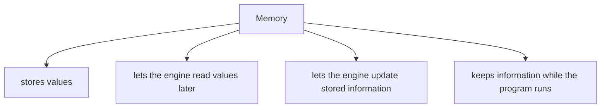

Теперь появляется следующий вопрос:

> Как программист создает named access к этой сохраненной информации?

Мы не можем напрямую сказать engine: "положи это значение в концептуальную location #42 и потом достань его оттуда". Такой стиль был бы неудобным и небезопасным для чтения программы.

Вместо этого JavaScript дает variables.

Variables — это не коробки. В этой главе variable будет рассматриваться как named access к информации, которой управляет JavaScript Engine.

Общая цепочка теперь такая:

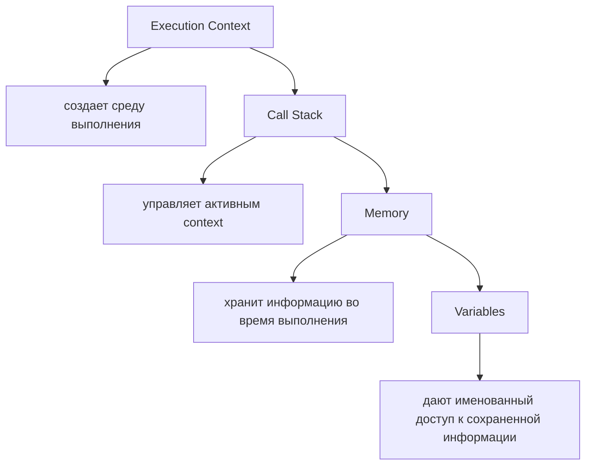

---

## Предварительные требования

Для этой главы нужно понимать:

* что JavaScript выполняется engine;
* что Execution Context является рабочей средой выполнения;
* что Call Stack показывает активный Execution Context;
* что memory хранит значения и связанную с ними информацию;
* что identifier — имя, через которое программа обращается к сохраненной информации.

Не требуется знать Hoisting, Temporal Dead Zone, Scope, Closures или Lexical Environment. Если эти темы появляются в тексте, они объясняются одной фразой и будут подробно разобраны в отдельных главах.

---

## Время изучения

Ориентировочное время:

```text
Чтение главы:            100-130 минут
Разбор схем:              40-50 минут
Запуск примеров:          25-35 минут
Практика:                 90-120 минут
Повторение материала:     30 минут
```

Уровень сложности: **L3**.

L3 означает фундаментальный уровень: глава объясняет не только синтаксис `var`, `let` и `const`, а саму причину существования variables и внутреннюю модель работы с named access.

---

## Навигация

Предыдущая глава:

```text
docs/01-javascript/05-memory.md
```

Следующая глава:

```text
docs/01-javascript/07-scope.md
```

Следующая глава объяснит Scope: почему один identifier доступен в одном месте программы и недоступен в другом. Scope — это правила доступности имен; подробно он будет изучаться позже.

---

## Цели обучения

После изучения этой главы вы будете понимать:

* что такое variable;
* почему variables существуют;
* почему variable не стоит представлять как коробку;
* что такое identifier;
* что такое declaration;
* что такое initialization;
* что такое assignment;
* что такое reassignment;
* чем declaration отличается от assignment;
* что означает declaration without initialization;
* как variable связана с memory;
* как variable связана с Execution Context;
* как variable связана с Call Stack;
* зачем в JavaScript есть `var`, `let` и `const`;
* почему `const` не означает "неизменяемое значение" в общем смысле;
* как выбирать `let` и `const` в тестовом коде;
* какие ошибки чаще всего встречаются при работе с variables.

---

## Мотивация

Начнем с наблюдаемого поведения.

```javascript
let userName = 'Anna';

console.log(userName);
```

Мы пишем не так:

```text
engine.store(value: "Anna", location: #1042)
engine.read(location: #1042)
```

Мы пишем проще:

```text
userName
```

Вопрос:

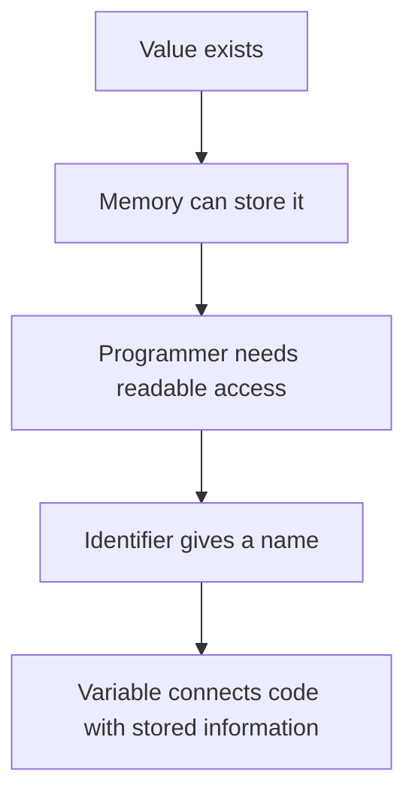

Переменная нужна не потому, что программисту хочется "коробку". Переменная нужна потому, что программе нужен понятный способ:

* зарегистрировать имя;
* связать имя со значением;
* прочитать значение позже;
* иногда изменить связь с текущей информацией;
* сделать код читаемым для человека.

Рассмотрим сквозной пример, который будет проходить через главу:

```javascript
const baseUrl = 'https://example.com';
let testStatus = 'created';

testStatus = 'ready';

console.log(baseUrl);
console.log(testStatus);
```

На поверхности это простой код. Внутри engine происходит несколько разных действий:

```text
register identifier: baseUrl
initialize baseUrl with value

register identifier: testStatus
initialize testStatus with value

assign new value to testStatus

read baseUrl
read testStatus
```

Главный вопрос главы:

> Что engine делает прямо сейчас?

---

## Теория

### Проблема прямой работы с memory

Представим, что variables не существуют.

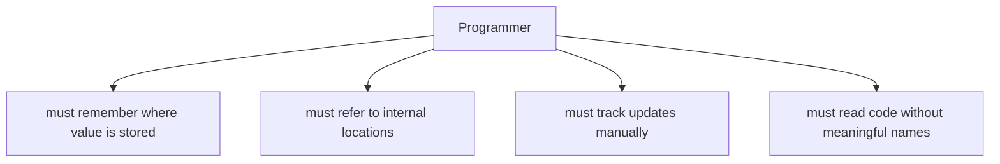

Код стал бы нечитаемым:

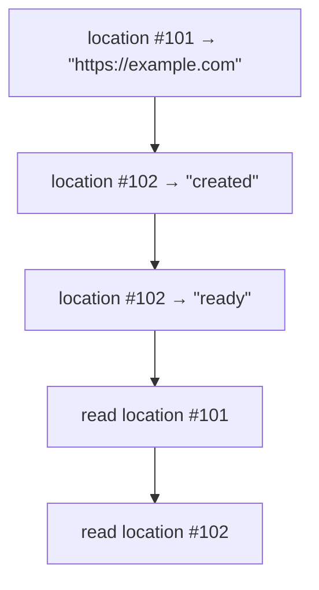

Проблема:

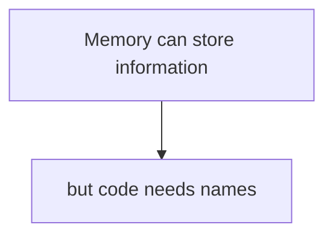

Variables решают эту проблему.

### Что такое variable

Variable — это named access к сохраненной информации, управляемой JavaScript Engine.

Важно:

```text
Variable is not a box.
Variable is not the value itself.
Variable is a named way to access stored information.
```

Концептуально:

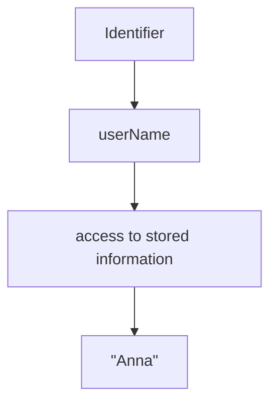

Когда вы пишете:

```javascript
const userName = 'Anna';
```

engine не создает физическую коробку с наклейкой `userName` в том учебном смысле, который часто показывают новичкам. Более точная модель:

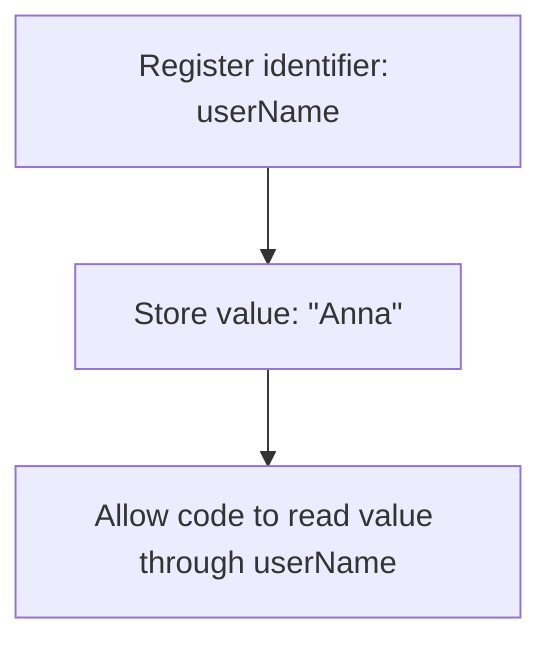

Что происходит внутри engine прямо сейчас:

```text
Engine регистрирует имя.
Engine связывает имя с информацией.
Engine позволит читать эту информацию по имени.
```

### Identifier

Identifier — имя, которое используется в коде.

```javascript
const browserName = 'chromium';
```

Здесь:

```text
Identifier: browserName
Value:      "chromium"
```

Identifier должен быть понятным человеку, потому что он описывает смысл сохраненной информации.

Плохо:

```javascript
const x = 'chromium';
```

Лучше:

```javascript
const browserName = 'chromium';
```

В Automation QA identifier часто отражает роль данных:

```javascript
const baseUrl = 'https://example.com';
const expectedStatus = 'active';
const actualStatus = 'active';
```

Схема:

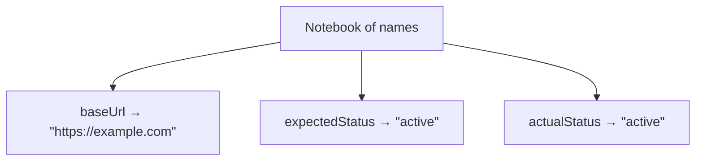

### Declaration

Declaration — регистрация identifier в текущей среде выполнения.

```javascript
let testStatus;
```

Эта строка не дает meaningful value для теста. Она говорит engine:

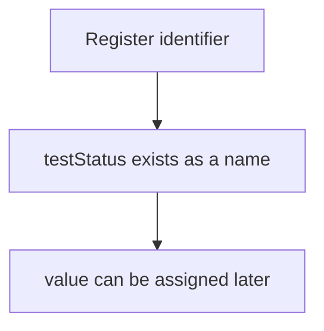

Диаграмма declaration:

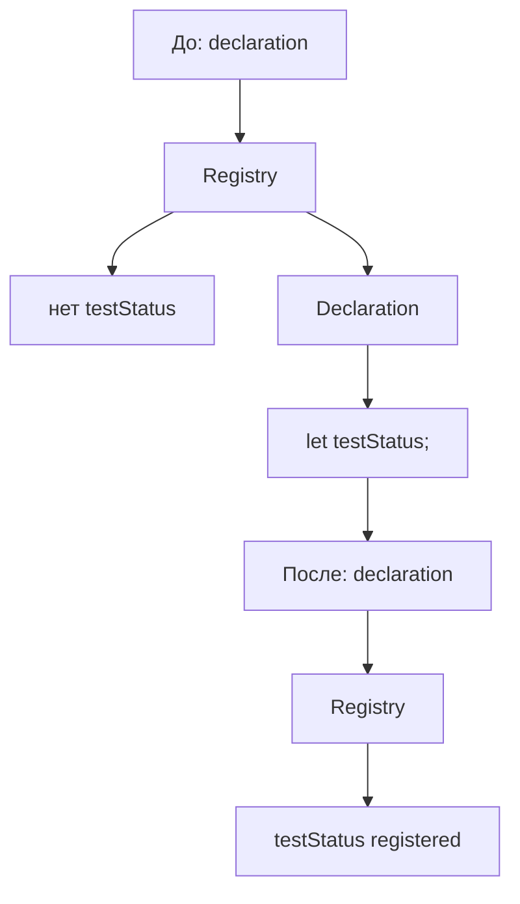

Declaration as registration:

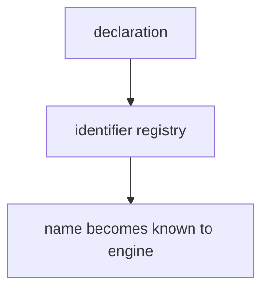

Hoisting — это особенности того, как declarations учитываются во время подготовки к выполнению; отдельная глава будет позже. Сейчас достаточно понимать declaration как регистрацию имени.

### Declaration without initialization

Declaration without initialization — объявление имени без начального meaningful value.

```javascript
let testStatus;

console.log(testStatus);
```

Результат:

```text
undefined
```

`undefined` — специальное значение JavaScript, которое часто означает отсутствие присвоенного meaningful value. Primitive Types будут изучаться позже; сейчас важно только поведение.

Концептуально:

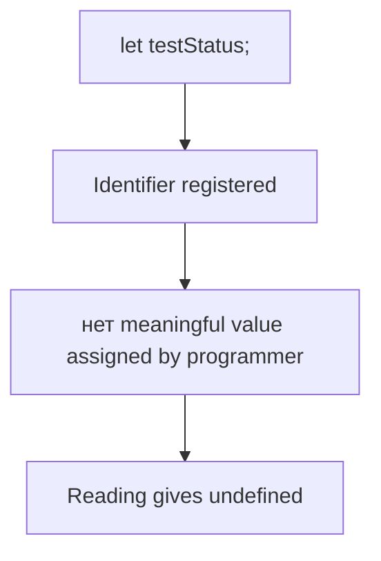

Диаграмма:

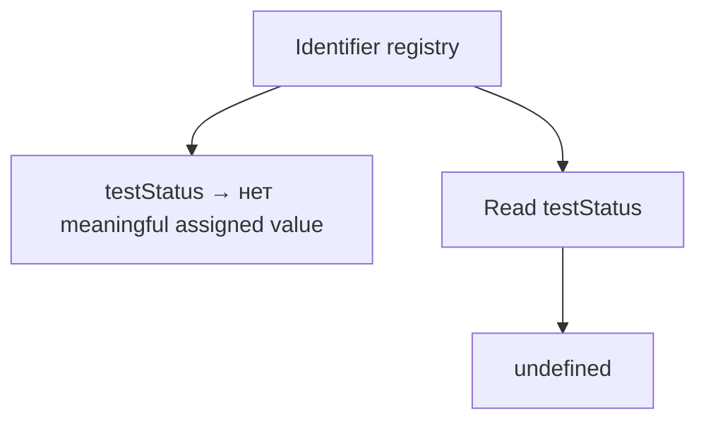

Что происходит внутри engine прямо сейчас:

```text
Engine знает имя testStatus.
Engine не получил пользовательское значение для этого имени.
Read возвращает undefined.
```

### Initialization

Initialization — первое связывание variable с начальным value в момент объявления.

```javascript
let testStatus = 'created';
```

Здесь одновременно происходят две вещи:

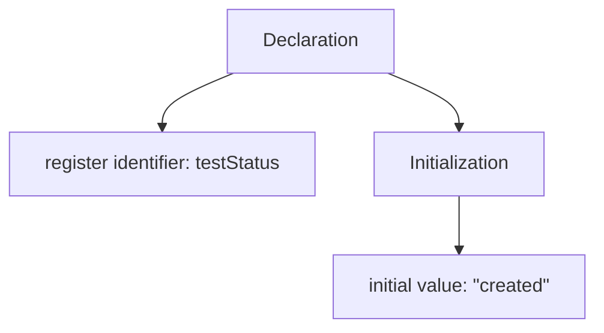

Диаграмма initialization:

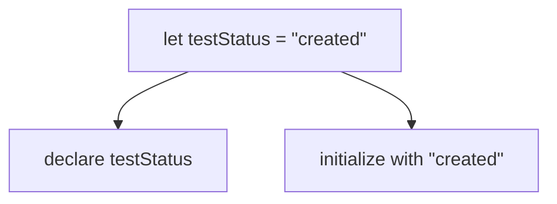

Memory view:

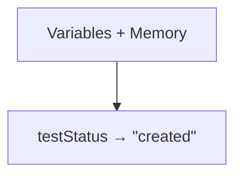

Что происходит внутри engine прямо сейчас:

```text
Engine регистрирует identifier.
Engine получает initial value.
Engine делает значение доступным через identifier.
```

### Assignment

Assignment — запись value в уже существующий named access.

```javascript
let testStatus;

testStatus = 'created';
```

Первая строка — declaration. Вторая строка — assignment.

Диаграмма assignment:

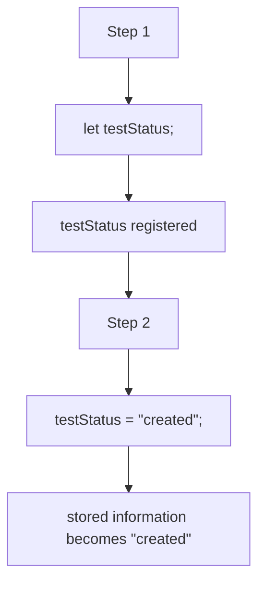

Declaration vs assignment:

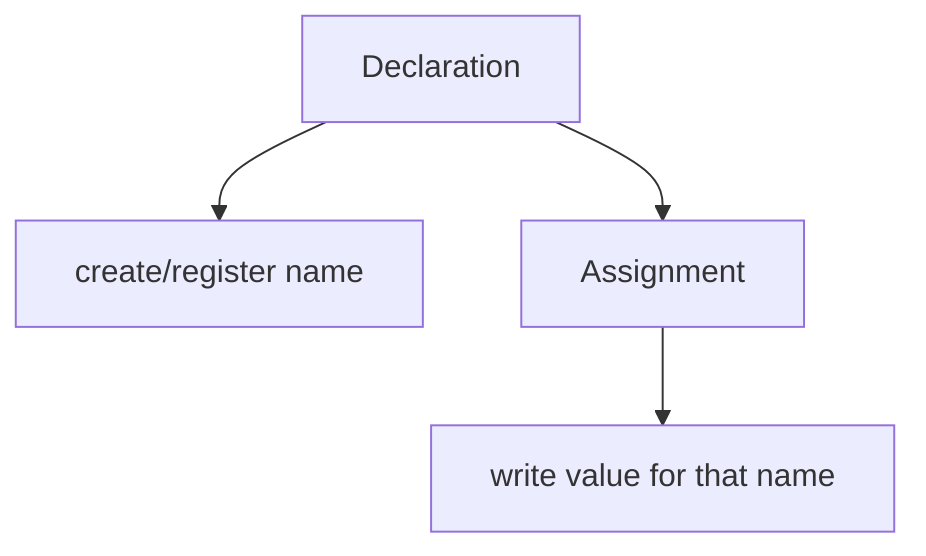

Что происходит внутри engine прямо сейчас:

```text
Engine видит existing identifier.
Engine записывает value, которое будет читаться через этот identifier.
```

### Reassignment

Reassignment — новое assignment для variable, которая уже имела value.

```javascript
let testStatus = 'created';

testStatus = 'ready';
```

Концептуально:

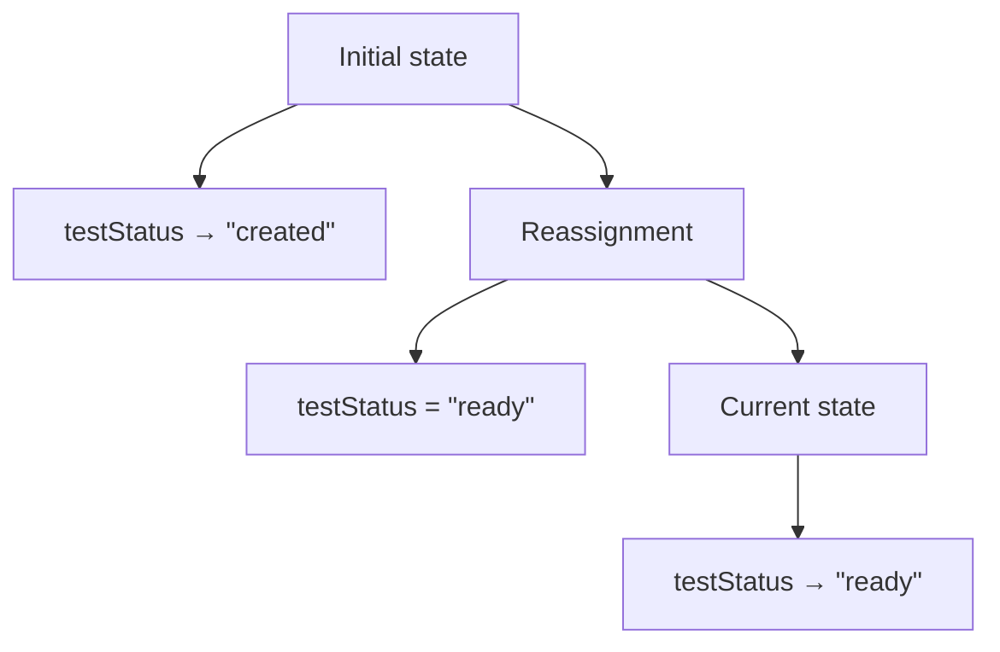

Диаграмма reassignment:

```mermaid
flowchart TD
    N1["testStatus"]
    N2["was: &quot;created&quot;"]
    N3["assigned: &quot;ready&quot;"]
    N4["now: &quot;ready&quot;"]
    N1 --> N2
    N1 --> N3
    N3 --> N4
```

Важно: один identifier не означает, что через него одновременно читаются все прошлые значения.

```mermaid
flowchart TD
    N1["Read after reassignment"]
    N2["current stored information"]
    N3["&quot;ready&quot;"]
    N1 --> N2
    N2 --> N3
```

### Declaration vs assignment

Эти операции часто смешивают.

```javascript
let testStatus;          // declaration
testStatus = 'created';  // assignment
testStatus = 'ready';    // reassignment
```

Схема:

```mermaid
flowchart TD
    N1["Line 1"]
    N2["declare identifier"]
    N3["Line 2"]
    N4["assign first meaningful value"]
    N5["Line 3"]
    N6["assign new value"]
    N1 --> N2
    N1 --> N3
    N3 --> N4
    N3 --> N5
    N5 --> N6
```

Сравнение:

```text
Operation       | What happens
----------------|-------------------------------
Declaration     | name is registered
Initialization  | initial value is provided
Assignment      | value is written
Reassignment    | existing value is replaced
```

### Variable lifecycle

На высоком уровне lifecycle variable можно представить так:

```mermaid
flowchart TD
    N1["Declaration"]
    N2["Initialization"]
    N3["Read"]
    N4["Assignment / Reassignment"]
    N5["Read updated value"]
    N6["Variable нет longer needed"]
    N1 --> N2
    N2 --> N3
    N3 --> N4
    N4 --> N5
    N5 --> N6
```

Не каждая variable проходит все этапы.

```javascript
const baseUrl = 'https://example.com';
```

Здесь есть declaration и initialization, но нет reassignment.

```javascript
let testStatus;

testStatus = 'created';
testStatus = 'ready';
```

Здесь declaration отделена от assignment, а затем есть reassignment.

Variable lifetime — период, когда named access существует и может использоваться в своей области доступности. Scope объяснит правила этой доступности в следующей главе.

### `const`

`const` создает variable, которую нельзя reassignment-ить.

```javascript
const baseUrl = 'https://example.com';

console.log(baseUrl);
```

Модель:

```mermaid
flowchart TD
    N1["const baseUrl = &quot;https://example.com&quot;"]
    N2["declare baseUrl"]
    N3["initialize with value"]
    N4["disallow reassignment of baseUrl"]
    N1 --> N2
    N1 --> N3
    N1 --> N4
```

Нельзя:

```javascript
const baseUrl = 'https://example.com';

// baseUrl = 'https://staging.example.com';
```

Строка reassignment закомментирована, потому что такой код приведет к runtime error.

Важно: `const` запрещает reassignment identifier. Он не означает, что любое сложное value становится полностью неизменяемым. Object Type и mutability будут изучаться позже.

Что происходит внутри engine прямо сейчас:

```text
Engine регистрирует identifier.
Engine требует initial value.
Engine запрещает later reassignment для этого identifier.
```

### `let`

`let` создает variable, которую можно reassignment-ить.

```javascript
let testStatus = 'created';

testStatus = 'ready';

console.log(testStatus);
```

Модель:

```mermaid
flowchart TD
    N1["let testStatus = &quot;created&quot;"]
    N2["declare testStatus"]
    N3["initialize with &quot;created&quot;"]
    N4["allow reassignment"]
    N5["testStatus = &quot;ready&quot;"]
    N6["update current stored information"]
    N1 --> N2
    N1 --> N3
    N1 --> N4
    N1 --> N5
    N5 --> N6
```

`let` подходит, когда значение действительно меняется по ходу выполнения.

Пример из Automation QA:

```javascript
let retryCount = 0;

retryCount = 1;
```

Если значение не должно меняться, обычно лучше `const`.

### `var`

`var` — старый способ объявления variables.

```javascript
var legacyStatus = 'created';
```

На базовом уровне:

```mermaid
flowchart TD
    N1["var"]
    N2["declares identifier"]
    N3["can be initialized"]
    N4["allows reassignment"]
    N1 --> N2
    N1 --> N3
    N1 --> N4
```

Но `var` имеет исторические особенности поведения, связанные с Hoisting и Scope. Hoisting — поведение declarations во время подготовки execution; Scope — правила доступности identifiers. Эти темы будут изучаться позже.

В современном коде курса и Automation QA проектах мы будем предпочитать:

```text
const by default
let when reassignment is needed
var mainly for reading legacy code
```

### Почему в JavaScript есть `var`, `let` и `const`

Исторически сначала был `var`. Он появился в раннем JavaScript и долго был единственным способом объявлять variables.

Позже появились `let` и `const`, потому что практике разработки понадобились более явные правила:

* `let` — когда named access должен позволять reassignment;
* `const` — когда named access не должен переназначаться;
* `var` — старый механизм, который остается в языке для совместимости.

Временная шкала:

```mermaid
flowchart TD
    N1["Early JavaScript"]
    N2["var"]
    N3["Modern JavaScript"]
    N4["let"]
    N5["const"]
    N6["Current practice"]
    N7["const by значение по умолчанию"]
    N8["let when needed"]
    N9["var for legacy code"]
    N1 --> N2
    N1 --> N3
    N3 --> N4
    N3 --> N5
    N3 --> N6
    N6 --> N7
    N6 --> N8
    N6 --> N9
```

Comparison:

```text
Keyword | Requires initialization | Allows reassignment | Modern default
--------|-------------------------|---------------------|---------------
var     | no                      | yes                 | no
let     | no                      | yes                 | when needed
const   | yes                     | no                  | yes
```

`const` requires initialization:

```javascript
// const baseUrl;
```

Эта строка закомментирована, потому что `const` без initial value является syntax error. Syntax error возникает до выполнения кода; этот механизм был разобран в главе про выполнение JavaScript.

### Variables + Memory

Variables дают readable access к memory.

```mermaid
flowchart TD
    N1["Memory"]
    N2["stored value: &quot;https://example.com&quot;"]
    N3["stored value: &quot;ready&quot;"]
    N4["Variables"]
    N5["baseUrl → &quot;https://example.com&quot;"]
    N6["testStatus → &quot;ready&quot;"]
    N1 --> N2
    N1 --> N3
    N1 --> N4
    N4 --> N5
    N4 --> N6
```

Более точно:

```mermaid
flowchart TD
    N1["Identifier registry"]
    N2["baseUrl"]
    N3["testStatus"]
    N4["Stored information"]
    N5["&quot;https://example.com&quot;"]
    N6["&quot;ready&quot;"]
    N1 --> N2
    N1 --> N3
    N1 --> N4
    N4 --> N5
    N4 --> N6
```

Variables не заменяют memory. Они являются способом работать с information, которая хранится и управляется engine.

### Variables + Execution Context

Execution Context — среда, в которой engine выполняет код. Variables регистрируются для выполнения в этой среде.

```mermaid
flowchart TD
    N1["Execution Context"]
    N2["current code"]
    N3["registered identifiers"]
    N4["access to stored information"]
    N1 --> N2
    N1 --> N3
    N1 --> N4
```

Для global-кода:

```mermaid
flowchart TD
    N1["Global Execution Context"]
    N2["baseUrl"]
    N3["testStatus"]
    N4["console.log reads values"]
    N1 --> N2
    N1 --> N3
    N1 --> N4
```

Для function execution:

```mermaid
flowchart TD
    N1["Function Execution Context"]
    N2["identifiers for this function выполнение"]
    N3["values used by this function выполнение"]
    N1 --> N2
    N1 --> N3
```

Подробная структура Lexical Environment будет изучаться позже. Сейчас важно только: variables не существуют "в воздухе"; они существуют внутри модели execution.

### Variables + Call Stack

Call Stack показывает, какой Execution Context активен прямо сейчас. Active context определяет, с какими registered identifiers engine работает в данный момент.

```mermaid
flowchart TD
    N1["Call Stack"]
    N2["Function Context: buildLoginUrl"]
    N3["variables used now"]
    N4["Global Context"]
    N5["variables waiting below"]
    N1 --> N2
    N1 --> N3
    N1 --> N4
    N4 --> N5
```

Когда вызывается функция:

```mermaid
flowchart TD
    N1["вызвать function"]
    N2["push Function Execution Context"]
    N3["register variables for that выполнение"]
    N4["read / assign values"]
    N5["pop Function Execution Context"]
    N1 --> N2
    N2 --> N3
    N3 --> N4
    N4 --> N5
```

Это не объяснение Scope. Это связь уже изученных механизмов:

```mermaid
flowchart TD
    N1["Call Stack"]
    N2["active context"]
    N3["variables available for current выполнение model"]
    N1 --> N2
    N1 --> N3
```

### Переход к Scope

После variables возникает новый вопрос:

```javascript
const baseUrl = 'https://example.com';

function printBaseUrl() {
  console.log(baseUrl);
}
```

Почему function может прочитать `baseUrl`?

И другой вопрос:

```javascript
function prepareUser() {
  const userName = 'Anna';
}

// console.log(userName);
```

Почему `userName` нельзя читать снаружи функции?

Ответ даст Scope.

Scope — правила, которые определяют, где identifier доступен. Это следующая глава. В текущей главе мы изучаем, как identifier создается и связывается с information; в следующей — где этот identifier можно использовать.

```mermaid
flowchart TD
    N1["Variables"]
    N2["how names are created and assigned values"]
    N3["Scope"]
    N4["where those names can be used"]
    N1 --> N2
    N1 --> N3
    N3 --> N4
```

---

## Внутренний механизм

Для каждой variable engine выполняет набор операций.

```mermaid
flowchart TD
    N1["исходный код"]
    N2["declaration keyword"]
    N3["identifier"]
    N4["optional initial value"]
    N5["registered named access"]
    N1 --> N2
    N2 --> N3
    N3 --> N4
    N4 --> N5
```

Если есть initialization:

```mermaid
flowchart TD
    N1["const baseUrl = &quot;https://example.com&quot;"]
    N2["register baseUrl"]
    N3["store initial value"]
    N1 --> N2
    N1 --> N3
```

Если declaration отделена от assignment:

```mermaid
flowchart TD
    N1["let testStatus;"]
    N2["register testStatus"]
    N3["testStatus = &quot;created&quot;;"]
    N4["assign value"]
    N1 --> N2
    N1 --> N3
    N3 --> N4
```

Если есть reassignment:

```mermaid
flowchart TD
    N1["testStatus = &quot;ready&quot;;"]
    N2["update current stored information for testStatus"]
    N1 --> N2
```

Сквозной пример:

```javascript
const baseUrl = 'https://example.com';
let testStatus = 'created';

testStatus = 'ready';

console.log(baseUrl);
console.log(testStatus);
```

Engine diary:

```mermaid
flowchart TD
    N1["&quot;I see const baseUrl.&quot;"]
    N2["&quot;I register baseUrl.&quot;"]
    N3["&quot;I initialize it with https://example.com.&quot;"]
    N4["&quot;I see let testStatus.&quot;"]
    N5["&quot;I register testStatus.&quot;"]
    N6["&quot;I initialize it with created.&quot;"]
    N7["&quot;I see assignment to testStatus.&quot;"]
    N8["&quot;I update its текущее значение to ready.&quot;"]
    N9["&quot;I read baseUrl.&quot;"]
    N10["&quot;I read testStatus.&quot;"]
    N1 --> N2
    N2 --> N3
    N3 --> N4
    N4 --> N5
    N5 --> N6
    N6 --> N7
    N7 --> N8
    N8 --> N9
    N9 --> N10
```

Что происходит внутри engine прямо сейчас:

```mermaid
flowchart TD
    N1["Declaration → register identifier."]
    N2["Initialization → provide first value."]
    N3["Assignment → write value."]
    N4["Reassignment → replace текущее значение for that identifier."]
    N5["Read → retrieve текущее значение."]
    N1 --> N2
    N2 --> N3
    N3 --> N4
    N4 --> N5
```

---

## Ментальная модель

### Labels on storage shelves

Не используйте модель "variable is a box". Более точная учебная модель — label on storage shelf.

```mermaid
flowchart TD
    N1["Shelf label"]
    N2["baseUrl"]
    N3["Stored information"]
    N4["&quot;https://example.com&quot;"]
    N1 --> N2
    N2 --> N3
    N3 --> N4
```

Label помогает найти информацию. Label не является самой информацией.

### Notebook of names

Можно представить variables как записи в блокноте имен.

```mermaid
flowchart TD
    N1["Notebook"]
    N2["baseUrl: &quot;https://example.com&quot;"]
    N3["testStatus: &quot;ready&quot;"]
    N4["retryCount: 1"]
    N1 --> N2
    N1 --> N3
    N1 --> N4
```

Когда происходит reassignment, запись обновляется:

```text
Before
testStatus: "created"

After
testStatus: "ready"
```

### Registry of identifiers

Declaration — это регистрация имени.

```mermaid
flowchart TD
    N1["Identifier registry"]
    N2["baseUrl"]
    N3["testStatus"]
    N4["retryCount"]
    N1 --> N2
    N1 --> N3
    N1 --> N4
```

После registration engine знает, что такое имя существует в текущей модели выполнения.

### Declaration as registration

```mermaid
flowchart TD
    N1["let retryCount;"]
    N2["register identifier"]
    N3["retryCount is known"]
    N1 --> N2
    N2 --> N3
```

### Assignment as changing stored information

```mermaid
flowchart TD
    N1["retryCount = 1"]
    N2["retryCount → 1"]
    N3["retryCount = 2"]
    N4["retryCount → 2"]
    N1 --> N2
    N2 --> N3
    N3 --> N4
```

Итоговая модель:

```mermaid
flowchart TD
    N1["Variable"]
    N2["named access to stored information"]
    N3["Declaration"]
    N4["register name"]
    N5["Initialization"]
    N6["first value"]
    N7["Assignment"]
    N8["write value"]
    N9["Reassignment"]
    N10["write new value to existing named access"]
    N1 --> N2
    N1 --> N3
    N3 --> N4
    N3 --> N5
    N5 --> N6
    N5 --> N7
    N7 --> N8
    N7 --> N9
    N9 --> N10
```

---

## Примеры кода

Примеры к этой главе находятся в папке:

```text
examples/01-javascript/chapter-06/
```

Запускайте их из корня проекта.

### Пример 1. Declaration

Файл:

```text
examples/01-javascript/chapter-06/01-declaration.js
```

Показывает declaration without initialization.

### Пример 2. Initialization

Файл:

```text
examples/01-javascript/chapter-06/02-initialization.js
```

Показывает declaration вместе с initial value.

### Пример 3. Assignment

Файл:

```text
examples/01-javascript/chapter-06/03-assignment.js
```

Показывает declaration отдельно от assignment.

### Пример 4. Reassignment

Файл:

```text
examples/01-javascript/chapter-06/04-reassignment.js
```

Показывает изменение current value через `let`.

### Пример 5. `var`, `let`, `const`

Файл:

```text
examples/01-javascript/chapter-06/05-var-let-const.js
```

Показывает базовое поведение трех declaration keywords без углубления в Hoisting и Scope.

### Пример 6. Типичные ошибки

Файл:

```text
examples/01-javascript/chapter-06/06-common-mistakes.js
```

Показывает типичные ошибки через безопасные закомментированные строки и корректный вариант.

---

## Частые вопросы

### Variable — это коробка?

Нет. Модель коробки слишком рано создает неправильное ощущение, будто variable физически содержит value. В этой книге variable рассматривается как named access к информации, которой управляет engine.

### Чем declaration отличается от initialization?

Declaration регистрирует identifier. Initialization дает initial value в момент объявления.

### Чем assignment отличается от initialization?

Initialization — первое значение при объявлении. Assignment — запись value в уже существующий named access.

### Почему `const` должен сразу получить value?

Потому что `const` запрещает reassignment. Если не дать initial value, потом нельзя будет корректно записать значение через reassignment.

### Почему вообще использовать `let`, если есть `const`?

`let` нужен, когда value действительно меняется по ходу выполнения: счетчик попыток, текущий статус, промежуточный результат, который будет обновлен.

### Нужно ли использовать `var`?

В новом коде обычно нет. Но `var` нужно понимать, потому что он встречается в legacy-коде и имеет особенности, которые будут изучаться позже.

---

## Распространенные мифы

### Миф 1. Variable хранит value внутри себя как коробка

Реальность:

Variable лучше понимать как named access к stored information.

### Миф 2. `const` делает любое значение неизменяемым

Реальность:

`const` запрещает reassignment identifier. Сложные значения и mutability будут изучаться позже в главах про objects и references.

### Миф 3. Declaration и assignment — одно и то же

Реальность:

Declaration регистрирует имя. Assignment записывает value.

### Миф 4. `var`, `let` и `const` отличаются только стилем

Реальность:

У них разные правила. В этой главе важны initialization и reassignment; Hoisting и Scope отличия будут изучаться позже.

---

## Типичные ошибки

### Ошибка 1. Использовать `let` там, где значение не меняется

Неправильный код:

```javascript
let baseUrl = 'https://example.com';

console.log(baseUrl);
```

Что произошло:

`baseUrl` не reassignment-ится, но `let` говорит читателю, что изменение возможно.

Почему это проблема:

Код становится менее очевидным.

Исправленный вариант:

```javascript
const baseUrl = 'https://example.com';

console.log(baseUrl);
```

### Ошибка 2. Ожидать старое значение после reassignment

Неправильная модель:

```javascript
let testStatus = 'created';

testStatus = 'ready';

console.log(testStatus);
```

Ожидание:

```text
created
```

Реальность:

```text
ready
```

Почему:

Read получает current value после reassignment.

### Ошибка 3. Объявлять `const` без initial value

Неправильный код:

```javascript
// const userName;
```

Что произошло:

Такой код является syntax error, потому что `const` должен быть initialized сразу.

Исправленный вариант:

```javascript
const userName = 'Anna';
```

Если value появится позже, нужен другой дизайн или `let`:

```javascript
let userName;

userName = 'Anna';
```

### Ошибка 4. Переобъявлять один и тот же identifier через `let` или `const`

Неправильный код:

```javascript
const status = 'created';
// const status = 'ready';
```

Что произошло:

Один и тот же identifier нельзя заново объявить в том же месте выполнения через `const`. Подробные правила места выполнения объяснит Scope.

Исправленный вариант:

```javascript
let status = 'created';

status = 'ready';
```

Если status должен изменяться, используйте reassignment, а не повторную declaration.

### Ошибка 5. Использовать плохие identifiers

Неправильный код:

```javascript
const data = 'active';
```

Что произошло:

Имя `data` не объясняет, что именно хранится.

Исправленный вариант:

```javascript
const expectedUserStatus = 'active';
```

---

## Практическое использование

При чтении variables задавайте пять вопросов:

```text
1. Где identifier объявлен?
2. Есть ли initialization?
3. Есть ли assignment позже?
4. Есть ли reassignment?
5. Что будет прочитано в текущей строке?
```

Таблица анализа:

```text
Line | Code                         | Operation
-----|------------------------------|------------------------
1    | const baseUrl = "..."        | declaration + initialization
2    | let testStatus = "created"   | declaration + initialization
3    | testStatus = "ready"         | reassignment
4    | console.log(testStatus)      | read
```

Практическое правило:

```mermaid
flowchart TD
    N1["Use const"]
    N2["when value should not be reassigned"]
    N3["Use let"]
    N4["when value must change"]
    N5["Avoid var"]
    N6["in new code"]
    N1 --> N2
    N1 --> N3
    N3 --> N4
    N3 --> N5
    N5 --> N6
```

Это правило не заменяет понимание. Оно просто помогает писать более читаемый код.

---

## Использование в Automation QA

### Storing configuration

Configuration значения обычно не должны reassignment-иться внутри теста.

```javascript
const baseUrl = 'https://example.com';
const browserName = 'chromium';
```

Почему `const`:

```mermaid
flowchart TD
    N1["Reader sees const"]
    N2["expects нет reassignment"]
    N3["configuration looks stable"]
    N1 --> N2
    N2 --> N3
```

### Storing test data

Test data может быть stable:

```javascript
const userName = 'qa-user';
const password = 'secret';
```

Если значение строится постепенно, может понадобиться `let`, но это должно быть осознанно.

```javascript
let userStatus = 'created';

userStatus = 'activated';
```

### Expected vs actual значения

В assertions часто полезно явно разделять expected и actual.

```javascript
const expectedStatus = 'active';
const actualStatus = 'active';

console.log(expectedStatus);
console.log(actualStatus);
```

Схема:

```mermaid
flowchart TD
    N1["expectedStatus"]
    N2["what test expects"]
    N3["actualStatus"]
    N4["what system returned"]
    N1 --> N2
    N1 --> N3
    N3 --> N4
```

Хорошие identifiers уменьшают количество ошибок при чтении теста.

### Helper results

Helper может вернуть value, которое нужно сохранить.

```javascript
function buildUserName() {
  return 'qa-user';
}

const userName = buildUserName();
```

`return` будет подробно изучаться позже. Сейчас важно: результат helper получает readable name.

```mermaid
flowchart TD
    N1["helper result"]
    N2["stored through variable"]
    N3["used by test step"]
    N1 --> N2
    N2 --> N3
```

### Fixture variables

Fixture часто подготавливает значения для теста.

```mermaid
flowchart TD
    N1["fixture"]
    N2["declares userName"]
    N3["initializes userName"]
    N4["test reads userName later"]
    N1 --> N2
    N1 --> N3
    N1 --> N4
```

Если fixture меняет status, это должно быть видно через `let`.

```mermaid
flowchart TD
    N1["let setupStatus"]
    N2["reader expects updates"]
    N1 --> N2
```

### Почему выбор `let` или `const` улучшает читаемость

`const` сообщает:

```text
This named access will not be reassigned.
```

`let` сообщает:

```text
This named access may change.
```

Для Automation QA это важно, потому что тесты читаются как сценарии. Если значение меняется, это должно быть видно. Если значение не меняется, `const` снижает когнитивную нагрузку.

---

## Итоги

Variables нужны, чтобы программист мог работать с stored information через понятные names.

Главная модель:

```mermaid
flowchart TD
    N1["Variable"]
    N2["named access to information managed by the engine"]
    N1 --> N2
```

В этой главе были разобраны:

```mermaid
flowchart TD
    N1["Declaration"]
    N2["register identifier"]
    N3["Initialization"]
    N4["first value at declaration"]
    N5["Assignment"]
    N6["write value to existing name"]
    N7["Reassignment"]
    N8["write new value to existing name"]
    N1 --> N2
    N1 --> N3
    N3 --> N4
    N3 --> N5
    N5 --> N6
    N5 --> N7
    N7 --> N8
```

`const` запрещает reassignment. `let` разрешает reassignment. `var` остается в языке по историческим причинам и будет важен при изучении Hoisting и Scope.

Следующая глава объяснит Scope: где объявленные identifiers доступны и почему одно имя можно прочитать в одном месте программы, но нельзя прочитать в другом.

---

## Что нужно запомнить

✓ Variable — named access к сохраненной информации.

✓ Variable не нужно представлять как коробку.

✓ Identifier — имя, используемое в коде.

✓ Declaration регистрирует identifier.

✓ Initialization дает initial value при declaration.

✓ Assignment записывает value в существующий named access.

✓ Reassignment заменяет current value.

✓ `const` запрещает reassignment.

✓ `let` разрешает reassignment.

✓ `var` нужен для понимания legacy-кода и будущих тем.

✓ Следующая тема — Scope, то есть правила доступности identifiers.

---

## Проверьте себя

1. Почему variables существуют?

2. Почему variable не стоит объяснять как коробку?

3. Что такое identifier?

4. Что делает declaration?

5. Что делает initialization?

6. Чем assignment отличается от declaration?

7. Что такое reassignment?

8. Почему `const` должен получить initial value сразу?

9. Когда уместен `let`?

10. Почему `var` не является modern default?

---

## Практика

Практика к этой главе находится в файле:

```text
practice/01-javascript/06-variables.md
```

Перед практикой запустите примеры из `examples/01-javascript/chapter-06/` и для каждого файла выпишите операции:

```text
declaration
initialization
assignment
reassignment
read
```

---

## Решения

Решения находятся в файле:

```text
solutions/01-javascript/06-variables.md
```

Открывайте решения после самостоятельной попытки. В этой главе важно сравнивать не только вывод программы, но и список операций, которые engine выполняет с identifiers и значения.
