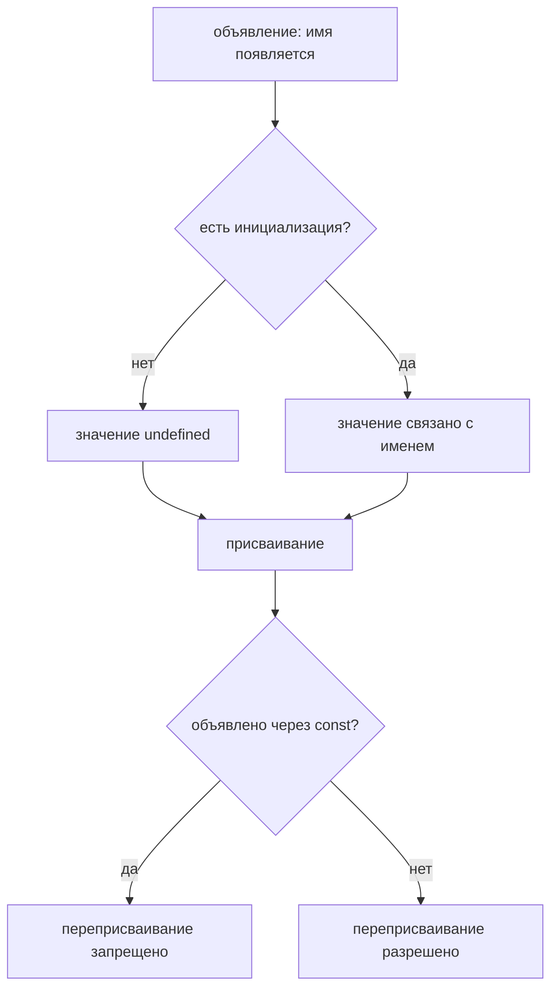

# Переменные

## Связь с предыдущей главой

В предыдущей главе была построена модель memory: значение хранится в некотором месте, а программа обращается к нему по имени.

Теперь появляется следующий вопрос:

> Как программист создает named access к этой сохраненной информации?

Мы не можем напрямую сказать engine: "положи это значение в концептуальную location #42 и потом достань его оттуда". Такой стиль был бы неудобным и небезопасным для чтения программы.

Вместо этого JavaScript дает variables.

Variables — это не коробки. В этой главе variable будет рассматриваться как named access к информации, которой управляет JavaScript Engine.

Общая цепочка теперь такая:

---

## Предварительные требования

Для этой главы нужно понимать:

* что JavaScript выполняется engine;
* что Execution Context является рабочей средой выполнения;
* что Call Stack показывает активный Execution Context;
* что memory хранит значения и связанную с ними информацию;
* что identifier — имя, через которое программа обращается к сохраненной информации.

Не требуется знать Hoisting, Temporal Dead Zone, Scope, Closures или Lexical Environment. Если эти темы появляются в тексте, они объясняются одной фразой и будут подробно разобраны в отдельных главах.

---

## Время изучения

Ориентировочное время:

```text
Чтение главы:            100-130 минут
Разбор схем:              40-50 минут
Запуск примеров:          25-35 минут
Практика:                 90-120 минут
Повторение материала:     30 минут
```

Уровень сложности: **L3**.

L3 означает фундаментальный уровень: глава объясняет не только синтаксис `var`, `let` и `const`, а саму причину существования variables и внутреннюю модель работы с named access.

---

## Навигация

Предыдущая глава:

```text
docs/01-javascript/05-memory.md
```

Следующая глава:

```text
docs/01-javascript/07-scope.md
```

Следующая глава объяснит Scope: почему один identifier доступен в одном месте программы и недоступен в другом. Scope — это правила доступности имен; подробно он будет изучаться позже.

---

## Цели обучения

После изучения этой главы вы будете понимать:

* что такое variable;
* почему variables существуют;
* почему variable не стоит представлять как коробку;
* что такое identifier;
* что такое declaration;
* что такое initialization;
* что такое assignment;
* что такое reassignment;
* чем declaration отличается от assignment;
* что означает declaration without initialization;
* как variable связана с memory;
* как variable связана с Execution Context;
* как variable связана с Call Stack;
* зачем в JavaScript есть `var`, `let` и `const`;
* почему `const` не означает "неизменяемое значение" в общем смысле;
* как выбирать `let` и `const` в тестовом коде;
* какие ошибки чаще всего встречаются при работе с variables.

---

## Мотивация

Начнем с наблюдаемого поведения.

```javascript
let userName = 'Anna';

console.log(userName);
```

Мы пишем не так:

```text
engine.store(value: "Anna", location: #1042)
engine.read(location: #1042)
```

Мы пишем проще:

```text
userName
```

Вопрос:

Переменная нужна не потому, что программисту хочется "коробку". Переменная нужна потому, что программе нужен понятный способ:

* зарегистрировать имя;
* связать имя со значением;
* прочитать значение позже;
* иногда изменить связь с текущей информацией;
* сделать код читаемым для человека.

Рассмотрим сквозной пример, который будет проходить через главу:

```javascript
const baseUrl = 'https://example.com';
let testStatus = 'created';

testStatus = 'ready';

console.log(baseUrl);
console.log(testStatus);
```

На поверхности это простой код. Внутри engine происходит несколько разных действий:

```text
register identifier: baseUrl
initialize baseUrl with value

register identifier: testStatus
initialize testStatus with value

assign new value to testStatus

read baseUrl
read testStatus
```

Главный вопрос главы:

> Что engine делает прямо сейчас?

---

## Теория

### Проблема прямой работы с памятью

Представим, что переменных не существует.

Код стал бы нечитаемым: к данным приходилось бы обращаться по адресу в памяти.

```text
записать 'Anna' по адресу 0x7ffd3c
прочитать значение по адресу 0x7ffd3c
```

Проблема не только в длине записи. Адрес ничего не сообщает о смысле значения, и
при любом изменении программы его пришлось бы искать заново.

Переменные решают эту проблему.

### Что такое переменная

Переменная — это именованный доступ к информации, которую хранит движок.

Важно:

```text
Переменная — не коробка.
Переменная — не само значение.
Переменная — именованный способ обратиться к сохранённым данным.
```

Концептуально имя и значение существуют раздельно: имя живёт в окружении, значение
— в памяти, а между ними связь.

Когда вы пишете:

```javascript
const userName = 'Anna';
```

движок не создаёт физическую коробку с наклейкой `userName` в том учебном смысле, который часто показывают новичкам. Более точная модель:

```text
запись в среде выполнения:  userName  ──→  [ 'Anna' ]
```

Что происходит внутри движка прямо сейчас:

```text
Engine регистрирует имя.
Engine связывает имя с информацией.
Engine позволит читать эту информацию по имени.
```

### Имя

Имя — это то, что используется в коде для обращения к значению.

```javascript
const browserName = 'chromium';
```

Здесь:

```text
Identifier: browserName
Value:      "chromium"
```

Имя должно быть понятным человеку, потому что оно описывает смысл сохранённой информации.

Плохо:

```javascript
const x = 'chromium';
```

Лучше:

```javascript
const browserName = 'chromium';
```

В автоматизации тестов имя часто отражает роль данных:

```javascript
const baseUrl = 'https://example.com';
const expectedStatus = 'active';
const actualStatus = 'active';
```

```text
baseUrl         ──→  [ 'https://example.com' ]
expectedStatus  ──→  [ 'active' ]
actualStatus    ──→  [ 'active' ]
```

### Объявление

Объявление — регистрация имени в текущей среде выполнения.

```javascript
let testStatus;
```

Эта строка не даёт осмысленного значения для теста. Она говорит движку: «создай
имя `testStatus` в текущем окружении, значения пока нет».

Схема объявления:

```text
testStatus  ──→  [ ??? ]
   имя есть      значения ещё нет
```

Объявление как регистрация:

Подъём объявлений — это особенности того, как объявления учитываются во время подготовки к выполнению; отдельная глава будет позже. Сейчас достаточно понимать объявление как регистрацию имени.

### Объявление без инициализации

Объявление без инициализации — появление имени без начального осмысленного значения.

```javascript
let testStatus;

console.log(testStatus);
```

Результат:

```text
undefined
```

`undefined` — специальное значение JavaScript, которое обычно означает отсутствие присвоенного значения. Примитивные типы будут изучаться позже; сейчас важно только поведение.

Концептуально:

```text
testStatus  ──→  [ undefined ]
```

Что происходит внутри движка прямо сейчас:

```text
Engine знает имя testStatus.
Engine не получил пользовательское значение для этого имени.
Read возвращает undefined.
```

### Инициализация

Инициализация — первое связывание переменной с начальным значением в момент объявления.

```javascript
let testStatus = 'created';
```

Здесь одновременно происходят две вещи:

```text
объявление:     testStatus  ──→  [ ??? ]
инициализация:  testStatus  ──→  [ 'created' ]
```

Взгляд со стороны памяти: объявление создаёт **имя**, инициализация связывает его
со **значением**. Это два разных события, и между ними имя уже существует.

Что происходит внутри движка прямо сейчас:

```text
движок регистрирует имя
движок получает начальное значение
движок делает значение доступным через это имя
```

### Присваивание

Присваивание — запись значения в уже существующее имя.

```javascript
let testStatus;

testStatus = 'created';
```

Первая строка — объявление. Вторая строка — присваивание.

```text
строка 1:  testStatus  ──→  [ undefined ]
строка 2:  testStatus  ──→  [ 'created' ]
```

Объявление и присваивание — разные операции: первая создаёт имя, вторая переводит
его связь на новое значение. Присваивание нового имени не создаёт.

Что происходит внутри движка прямо сейчас:

```text
Engine видит existing identifier.
Engine записывает value, которое будет читаться через этот identifier.
```

### Повторное присваивание

Повторное присваивание — новое присваивание переменной, у которой значение уже было.

```javascript
let testStatus = 'created';

testStatus = 'ready';
```

Концептуально:

```text
было:  testStatus  ──→  [ 'created' ]
стало: testStatus  ──→  [ 'ready' ]
```

Прежнее значение больше не доступно через это имя.

Важно: одно имя не означает, что через него одновременно читаются все прошлые значения.

### Объявление против присваивания

Эти операции часто смешивают.

```javascript
let testStatus;          // declaration
testStatus = 'created';  // assignment
testStatus = 'ready';    // reassignment
```

```text
declaration      имя зарегистрировано
assignment       имя получило значение впервые
reassignment     значение заменено на другое
```

Сравнение:

```text
Операция        | Что происходит
----------------|-------------------------------
Объявление      | имя зарегистрировано
Инициализация   | задано начальное значение
Присваивание    | значение записано
Переприсваивание| прежнее значение заменено
```

### Время жизни переменной

На высоком уровне путь переменной можно представить так:

Не каждая переменная проходит все этапы.

```javascript
const baseUrl = 'https://example.com';
```

Здесь есть объявление и инициализация, но нет повторного присваивания.

```javascript
let testStatus;

testStatus = 'created';
testStatus = 'ready';
```

Здесь объявление отделено от присваивания, а затем есть повторное присваивание.

Время жизни переменной — период, когда именованный доступ существует и может использоваться в своей области. Область видимости объяснит правила этой доступности в следующей главе.

### `const`

`const` создаёт переменную, которой нельзя присвоить значение повторно.

```javascript
const baseUrl = 'https://example.com';

console.log(baseUrl);
```

```text
baseUrl  ──→  [ 'https://example.com' ]   связь зафиксирована
```

Нельзя:

```javascript
const baseUrl = 'https://example.com';

// baseUrl = 'https://staging.example.com';
```

Строка с повторным присваиванием закомментирована, потому что такой код приведёт к ошибке времени выполнения.

Важно: `const` запрещает повторное присваивание имени. Он не означает, что любое составное значение становится полностью неизменяемым. Объекты и изменяемость будут изучаться позже.

Что происходит внутри движка прямо сейчас:

```text
Engine регистрирует identifier.
Engine требует initial value.
Engine запрещает later reassignment для этого identifier.
```

### `let`

`let` создаёт переменную, которой можно присвоить значение повторно.

```javascript
let testStatus = 'created';

testStatus = 'ready';

console.log(testStatus);
```

```text
testStatus  ──→  [ 'created' ]  ──→  [ 'ready' ]
```

`let` подходит, когда значение действительно меняется по ходу выполнения.

Пример из Automation QA:

```javascript
let retryCount = 0;

retryCount = 1;
```

Если значение не должно меняться, обычно лучше `const`.

### `var`

`var` — старый способ объявления переменных.

```javascript
var legacyStatus = 'created';
```

На базовом уровне:

Но у `var` есть исторические особенности поведения, связанные с подъёмом объявлений и областью видимости. Подъём объявлений — поведение объявлений во время подготовки к выполнению; область видимости — правила доступности имён. Эти темы будут изучаться позже.

В современном коде курса и Automation QA проектах мы будем предпочитать:

```text
const by default
let — когда нужно переприсваивание
var — в основном для чтения старого кода
```

### Почему в JavaScript есть `var`, `let` и `const`

Исторически сначала был `var`. Он появился в раннем JavaScript и долго был единственным способом объявлять переменные.

Позже появились `let` и `const`, потому что практике разработки понадобились более явные правила:

* `let` — когда имени нужно позволять повторное присваивание;
* `const` — когда имя не должно переназначаться;
* `var` — старый механизм, который остается в языке для совместимости.

Временная шкала для примера выше:

```text
строка 1  let testStatus     имя создано, значение undefined
строка 3  testStatus = '…'   связь переведена на 'created'
```

Сравнение:

| Ключевое слово | Требует инициализации | Разрешает переприсваивание | Выбор по умолчанию |
| --- | --- | --- | --- |
| `var` | нет | да | нет |
| `let` | нет | да | когда нужно менять |
| `const` | да | нет | да |

`const` требует инициализации:

```javascript
// const baseUrl;
```

Эта строка закомментирована, потому что `const` без начального значения является синтаксической ошибкой. Синтаксическая ошибка возникает до выполнения кода; этот механизм был разобран в главе про выполнение JavaScript.

### Переменные и память

Переменные дают читаемый доступ к памяти.

Более точно:

Переменные не заменяют память. Они являются способом работать с информацией, которую хранит и которой управляет движок.

### Переменные и контекст выполнения

Контекст выполнения — среда, в которой движок выполняет код. Переменные регистрируются для выполнения в этой среде.

Для кода верхнего уровня:

```text
Global Execution Context
  зарегистрированные имена: baseUrl, browserName
  живут, пока работает программа
```

Для выполнения функции:

```text
Function Execution Context (для одного вызова)
  зарегистрированные имена: параметры и объявленные внутри имена
  живут, пока выполняется этот вызов
```

Подробная структура лексического окружения будет изучаться позже. Сейчас важно только одно: переменные не существуют «в воздухе», они существуют внутри модели выполнения.

### Переменные и стек вызовов

Стек вызовов показывает, какой контекст выполнения активен прямо сейчас. Активный контекст определяет, с какими зарегистрированными именами движок работает в данный момент.

Когда вызывается функция:

```text
1. на стек кладётся новый Execution Context
2. в нём регистрируются имена этого вызова
3. код функции работает с именами активного context
4. функция завершилась — context снят вместе со своими именами
```

Это не объяснение области видимости. Это связь уже изученных механизмов:

```text
Call Stack        — какой context активен сейчас
Execution Context — где зарегистрированы имена
Variables         — сами имена и их значения
```

Область видимости ответит на другой вопрос: почему из одного контекста видны имена другого.

### Переход к области видимости

После переменных возникает новый вопрос:

```javascript
const baseUrl = 'https://example.com';

function printBaseUrl() {
  console.log(baseUrl);
}
```

Почему функция может прочитать `baseUrl`?

И другой вопрос:

```javascript
function prepareUser() {
  const userName = 'Anna';
}

// console.log(userName);
```

Почему `userName` нельзя читать снаружи функции?

Ответ даст область видимости.

Область видимости — правила, которые определяют, где имя доступно. Это следующая глава. В текущей мы изучаем, как имя создаётся и связывается с информацией; в следующей — где его можно использовать.

---

Жизненный путь переменной:


```mermaid
flowchart TD
    A["объявление: имя появляется"] --> B{"есть инициализация?"}
    B -- "нет" --> C["значение undefined"]
    B -- "да" --> D["значение связано с именем"]
    C --> E["присваивание"]
    D --> E
    E --> F{"объявлено через const?"}
    F -- "да" --> G["переприсваивание запрещено"]
    F -- "нет" --> H["переприсваивание разрешено"]
```

## Внутренний механизм

Для каждой переменной движок выполняет набор операций.

```text
объявление с инициализацией │ создать имя  +  связать со значением
объявление без значения     │ создать имя  (значение undefined)
присваивание                │ имя уже есть → перевести связь
```

Третья строка — ключевая: присваивание работает только с уже созданным именем.
Именно поэтому обращение к `let`-переменной до её объявления даёт ошибку, а не
`undefined` (глава 10).

Сквозной пример:

```javascript
const baseUrl = 'https://example.com';
let testStatus = 'created';

testStatus = 'ready';

console.log(baseUrl);
console.log(testStatus);
```

Что происходит внутри движка прямо сейчас:

```text
строка 1  const baseUrl   │ имя создано и сразу связано со значением
строка 2  let testStatus  │ имя создано и связано со значением 'created'
строка 4  testStatus = …  │ имя то же, связь переведена на 'ready'
строка 6  console.log     │ чтение: имя → текущее значение
```

Третья строка не создаёт нового имени и не трогает строку `'created'` — она
меняет только то, на что имя указывает. Имя и значение живут отдельно, и это
различие понадобится в главе про ссылки.

---

## Ментальная модель

### Подписи на полках хранения

Не используйте модель «переменная — это коробка». Более точная учебная модель — подпись на полке хранения.

Подпись помогает найти информацию. Подпись не является самой информацией.

### Блокнот имён

Можно представить переменные как записи в блокноте имён.

Когда происходит повторное присваивание, запись обновляется:

```text
Before
testStatus: "created"

After
testStatus: "ready"
```

### Список зарегистрированных имён

Объявление — это регистрация имени.

После регистрации движок знает, что такое имя существует в текущей модели выполнения.

### Объявление — это регистрация

Объявление заводит имя в текущей модели выполнения. После него движок знает,
что такое имя существует, даже если значения у него ещё нет.

```text
let attempts;     →  имя зарегистрировано, значение отсутствует
```

### Присваивание — это изменение записи

Присваивание не заводит новое имя, а меняет содержимое уже заведённой записи.

```text
attempts = 1;     →  в существующую запись положено 1
attempts = 2;     →  в той же записи 1 заменено на 2
```

Итоговая модель:

```text
Объявление отвечает на вопрос «какие имена существуют».
Присваивание отвечает на вопрос «что сейчас лежит под именем».
Это две разные операции, и они происходят в разные моменты.
```

---

## Примеры кода

Примеры к этой главе находятся в папке:

```text
examples/01-javascript/chapter-06/
```

Запускайте их из корня проекта.

### Пример 1. Объявление

Файл:

```text
examples/01-javascript/chapter-06/01-declaration.js
```

Показывает объявление без инициализации.

### Пример 2. Инициализация

Файл:

```text
examples/01-javascript/chapter-06/02-initialization.js
```

Показывает объявление вместе с начальным значением.

### Пример 3. Присваивание

Файл:

```text
examples/01-javascript/chapter-06/03-assignment.js
```

Показывает объявление отдельно от присваивания.

### Пример 4. Повторное присваивание

Файл:

```text
examples/01-javascript/chapter-06/04-reassignment.js
```

Показывает изменение текущего значения через `let`.

### Пример 5. `var`, `let`, `const`

Файл:

```text
examples/01-javascript/chapter-06/05-var-let-const.js
```

Показывает базовое поведение трёх ключевых слов объявления без углубления в подъём объявлений и область видимости.

### Пример 6. Типичные ошибки

Файл:

```text
examples/01-javascript/chapter-06/06-common-mistakes.js
```

Показывает типичные ошибки через безопасные закомментированные строки и корректный вариант.

---

## Частые вопросы

### Переменная — это коробка?

Нет. Модель коробки слишком рано создаёт неправильное ощущение, будто переменная физически содержит значение. В этой книге переменная рассматривается как именованный доступ к информации, которой управляет движок.

### Чем объявление отличается от инициализации?

Объявление регистрирует имя. Инициализация даёт начальное значение в момент объявления.

### Чем присваивание отличается от инициализации?

Инициализация — первое значение при объявлении. Присваивание — запись значения в уже существующее имя.

### Почему `const` должен сразу получить значение?

Потому что `const` запрещает повторное присваивание. Если не дать начального значения, потом записать его будет нечем.

### Почему вообще использовать `let`, если есть `const`?

`let` нужен, когда значение действительно меняется по ходу выполнения: счётчик попыток, текущий статус, промежуточный результат, который будет обновлён.

### Нужно ли использовать `var`?

В новом коде обычно нет. Но `var` нужно понимать, потому что он встречается в старом коде и имеет особенности, которые будут изучаться позже.

---

## Распространённые мифы

### Миф 1. Переменная хранит значение внутри себя как коробка

Реальность:

Переменную лучше понимать как именованный доступ к сохранённой информации.

### Миф 2. `const` делает любое значение неизменяемым

Реальность:

`const` запрещает повторное присваивание имени. Составные значения и изменяемость будут изучаться позже, в главах про объекты и ссылки.

### Миф 3. Объявление и присваивание — одно и то же

Реальность:

Объявление регистрирует имя. Присваивание записывает значение.

### Миф 4. `var`, `let` и `const` отличаются только стилем

Реальность:

У них разные правила. В этой главе важны инициализация и повторное присваивание; отличия по подъёму объявлений и области видимости будут изучаться позже.

---

## Распространённые ошибки

### Ошибка 1. Использовать `let` там, где значение не меняется

Неправильный код:

```javascript
let baseUrl = 'https://example.com';

console.log(baseUrl);
```

Что произошло:

`baseUrl` не переназначается, но `let` говорит читателю, что изменение возможно.

Почему это проблема:

Код становится менее очевидным.

Исправленный вариант:

```javascript
const baseUrl = 'https://example.com';

console.log(baseUrl);
```

### Ошибка 2. Ожидать старое значение после повторного присваивания

Неправильная модель:

```javascript
let testStatus = 'created';

testStatus = 'ready';

console.log(testStatus);
```

Ожидание:

```text
created
```

Реальность:

```text
ready
```

Почему:

Чтение получает текущее значение — то, что записано последним.

### Ошибка 3. Объявлять `const` без начального значения

Неправильный код:

```javascript
// const userName;
```

Что произошло:

Такой код является синтаксической ошибкой, потому что `const` должен получить значение сразу.

Исправленный вариант:

```javascript
const userName = 'Anna';
```

Если значение появится позже, нужен другой подход или `let`:

```javascript
let userName;

userName = 'Anna';
```

### Ошибка 4. Переобъявлять одно и то же имя через `let` или `const`

Неправильный код:

```javascript
const status = 'created';
// const status = 'ready';
```

Что произошло:

Одно и то же имя нельзя заново объявить в том же месте выполнения через `const`. Подробные правила места выполнения объяснит область видимости.

Исправленный вариант:

```javascript
let status = 'created';

status = 'ready';
```

Если статус должен изменяться, используйте присваивание, а не повторное объявление.

### Ошибка 5. Использовать плохие имена

Неправильный код:

```javascript
const data = 'active';
```

Что произошло:

Имя `data` не объясняет, что именно хранится.

Исправленный вариант:

```javascript
const expectedUserStatus = 'active';
```

---

## Практическое использование

При чтении переменных задавайте пять вопросов:

```text
1. Где identifier объявлен?
2. Есть ли initialization?
3. Есть ли assignment позже?
4. Есть ли reassignment?
5. Что будет прочитано в текущей строке?
```

Таблица анализа:

```text
Line | Code                         | Operation
-----|------------------------------|------------------------
1    | const baseUrl = "..."        | declaration + initialization
2    | let testStatus = "created"   | declaration + initialization
3    | testStatus = "ready"         | reassignment
4    | console.log(testStatus)      | read
```

Практическое правило: объявляйте через `const` по умолчанию и меняйте на `let` только тогда, когда действительно нужно переприсваивание.

Это правило не заменяет понимание. Оно просто помогает писать более читаемый код.

---

## Использование в Automation QA

### Хранение конфигурации

Значения конфигурации обычно не должны переназначаться внутри теста.

```javascript
const baseUrl = 'https://example.com';
const browserName = 'chromium';
```

Почему `const`:

```text
значение конфигурации задают один раз при запуске теста
повторное присваивание такому имени — почти всегда ошибка
const превращает эту ошибку в отказ при запуске, а не в странный результат
```

### Хранение тестовых данных

Тестовые данные могут быть постоянными:

```javascript
const userName = 'qa-user';
const password = 'secret';
```

Если значение строится постепенно, может понадобиться `let`, но это должно быть осознанно.

```javascript
let userStatus = 'created';

userStatus = 'activated';
```

### Ожидаемое и фактическое значение

В проверках часто полезно явно разделять ожидаемое и фактическое.

```javascript
const expectedStatus = 'active';
const actualStatus = 'active';

console.log(expectedStatus);
console.log(actualStatus);
```

```text
expectedStatus  ──→  [ 'active' ]   что ожидаем
actualStatus    ──→  [ 'active' ]   что получили
```

Хорошие имена уменьшают количество ошибок при чтении теста.

### Результаты вспомогательных функций

Вспомогательная функция может вернуть значение, которое нужно сохранить.

```javascript
function buildUserName() {
  return 'qa-user';
}

const userName = buildUserName();
```

`return` будет подробно изучаться позже. Сейчас важно: результат вспомогательной функции получает читаемое имя.

### Переменные фикстур

Фикстура часто подготавливает значения для теста.

Если фикстура меняет статус, это должно быть видно через `let`.

### Почему выбор `let` или `const` улучшает читаемость

`const` сообщает:

```text
Этот доступ по имени не будет переприсвоен.
```

`let` сообщает:

```text
Этот доступ по имени может измениться.
```

Для Automation QA это важно, потому что тесты читаются как сценарии. Если значение меняется, это должно быть видно. Если значение не меняется, `const` снижает когнитивную нагрузку.

---

## Итоги

Переменные нужны, чтобы программист мог работать с сохранённой информацией через понятные имена.

Главная модель: имя — это способ обратиться к сохранённому значению, а объявление, присваивание и повторное присваивание — три разных момента в жизни этой связи.

В этой главе были разобраны:

`const` запрещает повторное присваивание. `let` его разрешает. `var` остаётся в языке по историческим причинам и будет важен при изучении подъёма объявлений и области видимости.

Следующая глава объяснит область видимости: где объявленные имена доступны и почему одно имя можно прочитать в одном месте программы, но нельзя в другом.

---

## Что нужно запомнить

✓ Переменная — именованный доступ к сохранённой информации.

✓ Переменную не нужно представлять как коробку.

✓ Имя — то, что используется в коде для обращения к значению.

✓ Объявление регистрирует имя.

✓ Инициализация даёт начальное значение при объявлении.

✓ Присваивание записывает значение в существующее имя.

✓ Повторное присваивание заменяет текущее значение.

✓ `const` запрещает повторное присваивание.

✓ `let` разрешает повторное присваивание.

✓ `var` нужен для понимания старого кода и будущих тем.

✓ Следующая тема — область видимости, то есть правила доступности имён.

---

## Проверьте себя

1. Почему переменные существуют?

2. Почему переменную не стоит объяснять как коробку?

3. Что такое имя переменной?

4. Что делает объявление?

5. Что делает инициализация?

6. Чем присваивание отличается от объявления?

7. Что такое повторное присваивание?

8. Почему `const` должен получить начальное значение сразу?

9. Когда уместен `let`?

10. Почему `var` не используют по умолчанию в новом коде?

### Ответы

1. Программе нужно возвращаться к значениям, вычисленным раньше. Переменная даёт значению имя, по которому его можно найти позже, — без имён программа умела бы только вычислять и сразу забывать.
2. Коробка подсказывает, что значение лежит внутри имени. На самом деле имя — это запись в окружении, которая ведёт к значению. Для примитивов разница незаметна, но для объектов она решает всё: два имени могут вести к одному объекту.
3. Имя — это то, под чем значение зарегистрировано в текущем окружении. Само значение оно не содержит, оно только позволяет его найти.
4. Объявление заводит имя в окружении. После него движок знает, что такое имя существует, даже если значения у него ещё нет.
5. Инициализация впервые связывает имя со значением. До неё `let` и `const` уже объявлены, но читать их нельзя — это и есть временная мёртвая зона.
6. Объявление заводит новое имя, присваивание меняет содержимое уже заведённой записи. Объявление происходит один раз, присваиваний может быть сколько угодно.
7. Повторное присваивание — запись нового значения в имя, у которого значение уже есть. Имя остаётся прежним, меняется то, на что оно указывает.
8. `const` запрещает повторное присваивание, поэтому единственная возможность задать значение — момент объявления. Имя без значения и без права его задать было бы бесполезным, и движок отвергает такой код сразу.
9. `let` нужен там, где значение по смыслу меняется: счётчик попыток, накапливаемый результат, текущее состояние цикла. Если значение задаётся один раз, `let` только вводит читателя в заблуждение.
10. `var` объявляется до выполнения со значением `undefined`, поэтому чтение до объявления не ошибка, а тихий `undefined`. Кроме того, `var` не ограничен блоком. `let` и `const` превращают такие места в ошибку сразу, поэтому по умолчанию берут их.

---

## Практика

Практика к этой главе находится в файле:

```text
practice/01-javascript/06-variables.md
```

Перед практикой запустите примеры из раздела «Примеры кода» и для каждого файла выпишите операции:

```text
declaration
initialization
assignment
reassignment
read
```

---

## Решения

Решения находятся в файле:

```text
solutions/01-javascript/06-variables.md
```

Открывайте решения после самостоятельной попытки. В этой главе важно сравнивать не только вывод программы, но и список операций, которые движок выполняет с именами и значениями.
