# Scope

## Связь с предыдущей главой

Предыдущая глава ответила на вопрос:

> Как в программе появляются имена?

Variables дают named access к сохраненной информации:

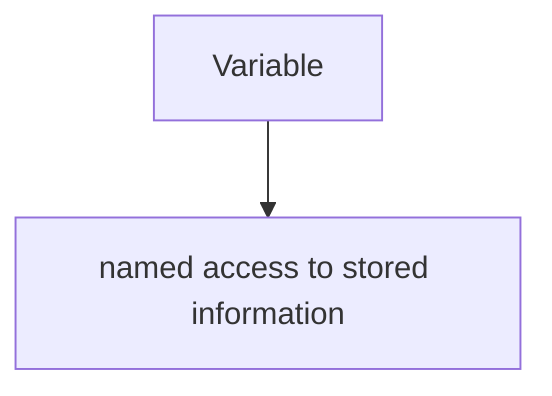

Но после variables сразу появляется следующий вопрос:

> Где эти имена можно использовать?

Код ниже работает:

```javascript
const baseUrl = 'https://example.com';

console.log(baseUrl);
```

А такой код приводит к ошибке:

```javascript
function prepareUser() {
  const userName = 'Anna';
}

prepareUser();

// console.log(userName);
```

Почему `baseUrl` доступен после объявления, а `userName` снаружи функции недоступен?

На этот вопрос отвечает Scope.

Общая цепочка теперь такая:

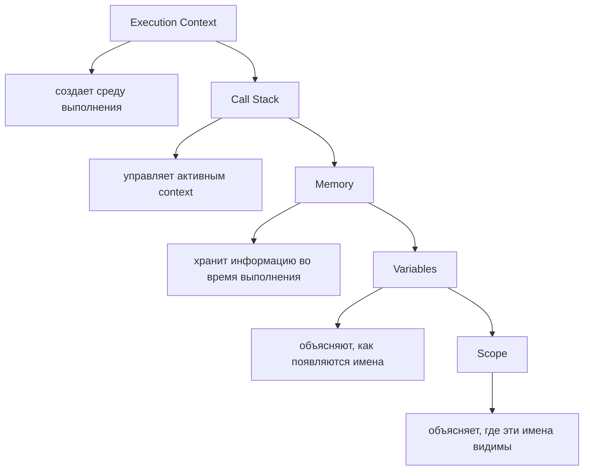

Lexical Environment объяснит внутренний механизм Scope в следующей главе. Сейчас мы строим внешнюю, но точную mental model: какие identifiers engine может access прямо сейчас.

---

## Предварительные требования

Для этой главы нужно понимать:

* что Execution Context является рабочей средой выполнения;
* что Call Stack показывает активный Execution Context;
* что memory хранит информацию;
* что variables создают named access к сохраненной информации;
* что declaration регистрирует identifier;
* что `let`, `const` и `var` создают variables.

Не требуется знать Lexical Environment internals, Hoisting, Temporal Dead Zone, Closures, `this` или modules. Эти темы будут изучаться в отдельных главах.

---

## Время изучения

Ориентировочное время:

```text
Чтение главы:            100-130 минут
Разбор схем:              45-60 минут
Запуск примеров:          25-35 минут
Практика:                 90-120 минут
Повторение материала:     30 минут
```

Уровень сложности: **L3**.

L3 означает фундаментальный уровень: Scope объясняет не синтаксис, а правила видимости identifiers. Без этой модели Hoisting, Closures, modules и архитектура тестового кода будут выглядеть как набор исключений.

---

## Навигация

Предыдущая глава:

```text
docs/01-javascript/06-variables.md
```

Следующая глава:

```text
docs/01-javascript/08-lexical-environment.md
```

Следующая глава объяснит Lexical Environment: внутреннюю структуру, через которую engine реализует Scope и поиск identifiers.

---

## Цели обучения

После изучения этой главы вы будете понимать:

* зачем существует Scope;
* что означает visibility of identifiers;
* что такое Global Scope;
* что такое Function Scope;
* что такое Block Scope;
* как работают nested scopes;
* что такое parent и child scopes;
* как работает Scope Chain на концептуальном уровне;
* как engine выполняет variable lookup;
* что такое variable shadowing;
* чем variable lifetime отличается от visibility;
* как Scope связан с Execution Context;
* как Scope связан с Variables;
* как Scope помогает писать читаемые Playwright-тесты;
* почему global mutable состояние опасен для Automation QA.

---

## Мотивация

Начнем с кода.

```javascript
const baseUrl = 'https://example.com';

function printBaseUrl() {
  console.log(baseUrl);
}

printBaseUrl();
```

Результат:

```text
https://example.com
```

Функция смогла прочитать `baseUrl`, хотя `baseUrl` объявлен снаружи.

Теперь другой код:

```javascript
function prepareUser() {
  const userName = 'Anna';

  console.log(userName);
}

prepareUser();

// console.log(userName);
```

Внутри функции `userName` доступен. Снаружи — нет.

Наблюдаемое поведение:

```text
Some identifiers are visible here.
Some identifiers are not visible here.
```

Вопрос главы:

> Какие identifiers engine может access прямо сейчас?

Пока не нужно определение. Нужно почувствовать проблему:

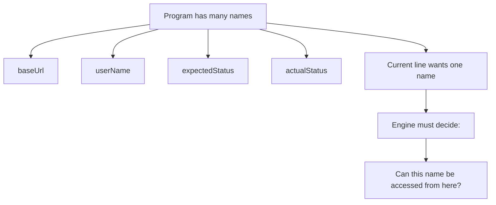

Scope существует потому, что программе нужны границы видимости имен.

---

## Теория

### Проблема видимости identifiers

Если бы все identifiers были видимы везде, программа быстро стала бы опасной.

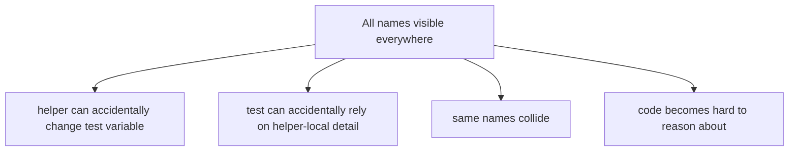

Представим тестовый проект:

```javascript
const status = 'global';

function createUser() {
  const status = 'created';

  console.log(status);
}

createUser();
console.log(status);
```

Если не понимать Scope, непонятно, какой `status` будет прочитан в каждой строке.

Что должен решить engine:

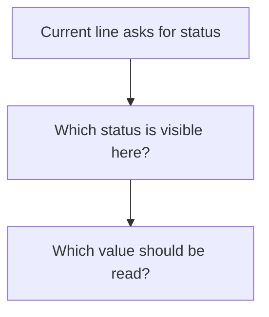

### Что такое Scope

Теперь можно ввести термин.

Scope — область программы, в которой identifier видим и может быть использован.

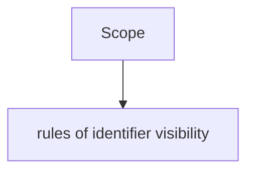

Главная формула главы:

```text
Variables answer:
"How do names appear?"

Scope answers:
"Where are those names visible?"
```

Scope не создает value сам по себе. Scope определяет, где name можно использовать для доступа к value.

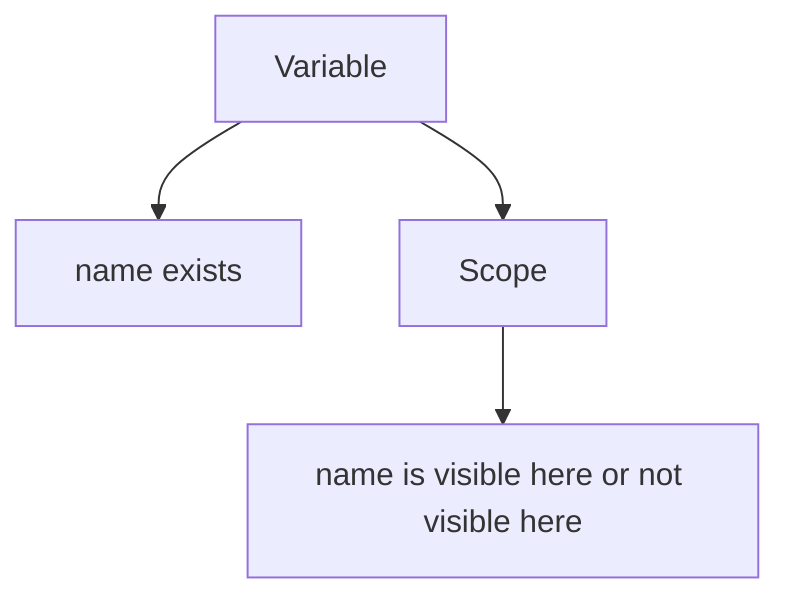

Что engine делает прямо сейчас:

```text
Engine sees identifier.
Engine checks current scope.
If not found, engine searches outward.
If no visible identifier is found, access fails.
```

### Global Scope

Global Scope — внешний scope файла или программы.

```javascript
const baseUrl = 'https://example.com';

function printBaseUrl() {
  console.log(baseUrl);
}
```

`baseUrl` объявлен в Global Scope.

Диаграмма:

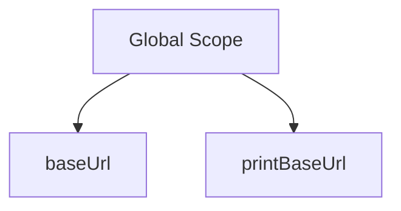

Что видно в Global Scope:

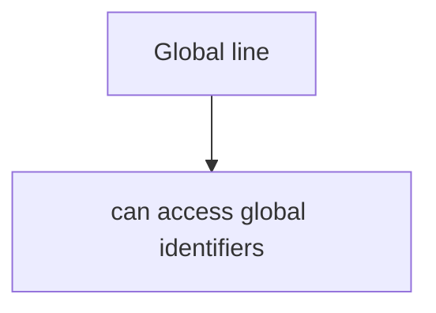

Пример:

```javascript
const testName = 'login';

console.log(testName);
```

Схема:

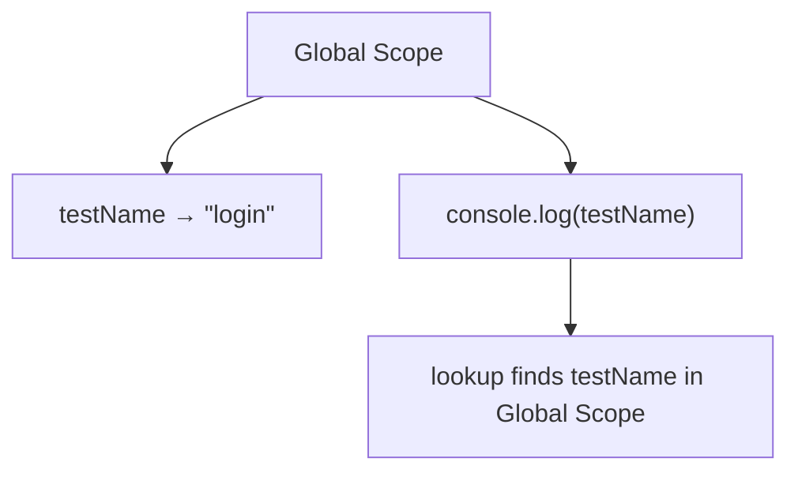

Global Scope удобен для stable configuration в маленьких примерах, но в больших тестовых проектах global mutable состояние часто создает проблемы. Это будет разобрано в Automation QA разделе главы.

### Function Scope

Function Scope — область видимости внутри функции.

```javascript
function prepareUser() {
  const userName = 'Anna';

  console.log(userName);
}

prepareUser();
```

`userName` видим внутри `prepareUser`.

Диаграмма:

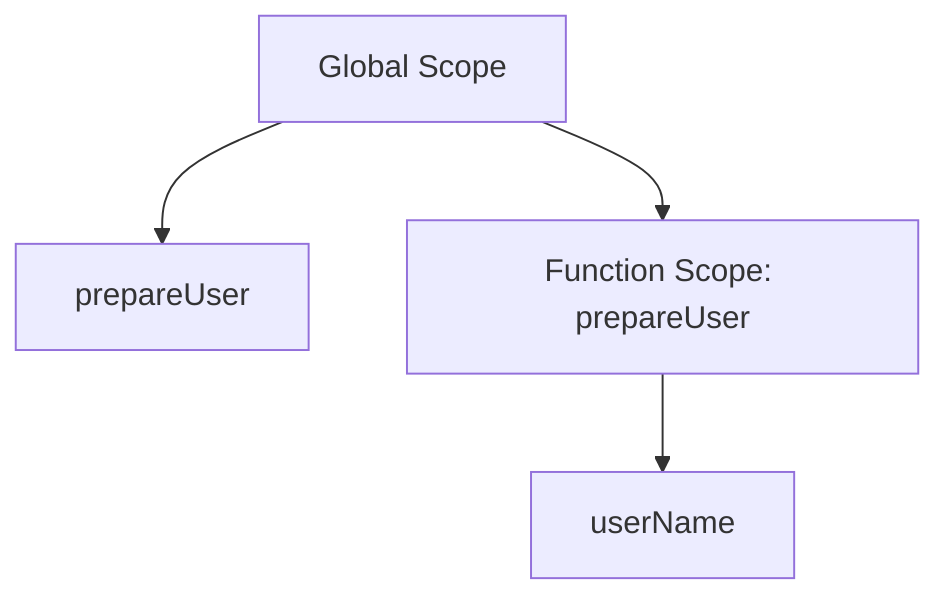

Снаружи функции `userName` не видим:

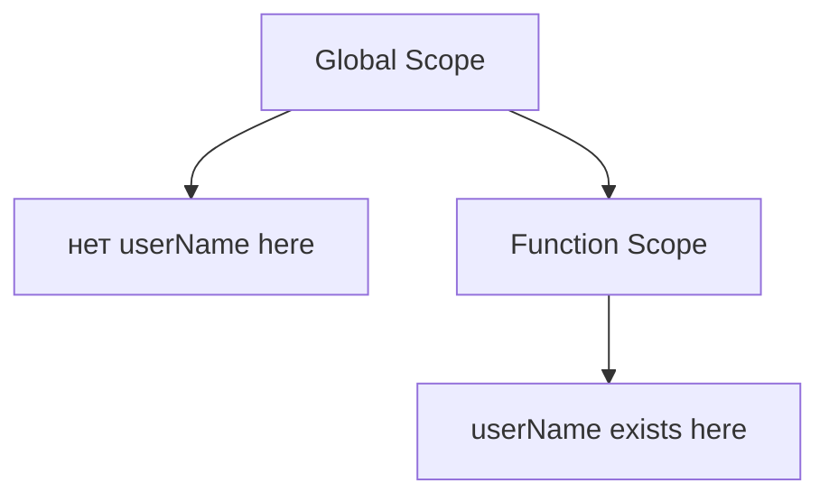

Что engine делает прямо сейчас:

```text
Inside prepareUser:
lookup userName starts in Function Scope.
userName is found.
```

Снаружи:

```text
Global line asks for userName.
lookup starts in Global Scope.
userName is not found.
access fails.
```

### Block Scope

Block Scope — область видимости внутри блока `{ ... }` для `let` и `const`.

```javascript
if (true) {
  const expectedStatus = 'active';

  console.log(expectedStatus);
}
```

`expectedStatus` видим внутри блока.

Диаграмма:

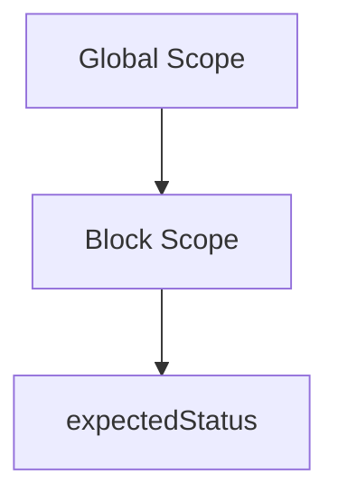

Снаружи блока identifier не видим:

```javascript
if (true) {
  const expectedStatus = 'active';
}

// console.log(expectedStatus);
```

`var` ведет себя иначе по отношению к block scope; подробности будут разобраны в главах про Hoisting и Scope-related поведение. В этой главе основной focus — `let` и `const`, потому что это modern default.

### Nested scopes

Scopes могут быть вложенными.

```javascript
const baseUrl = 'https://example.com';

function buildLoginUrl() {
  const path = '/login';

  if (true) {
    const fullUrl = baseUrl + path;

    console.log(fullUrl);
  }
}

buildLoginUrl();
```

Диаграмма nested scopes:

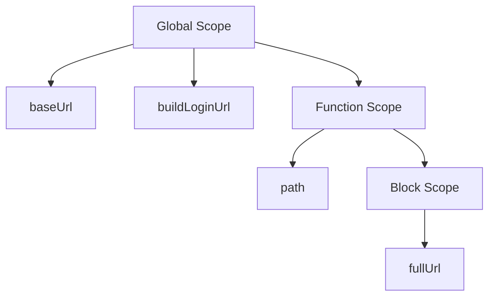

Внутренний scope может использовать identifiers из внешних scopes:

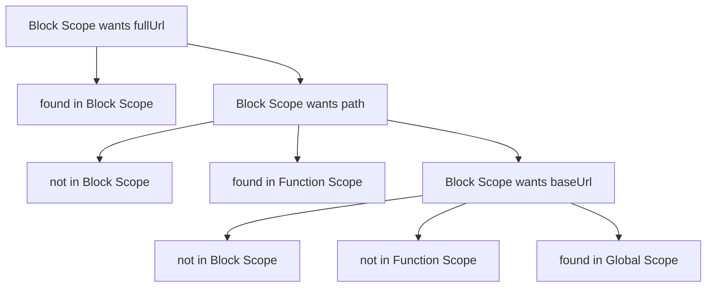

### Parent and child scopes

Вложенный scope можно назвать child scope. Внешний scope — parent scope.

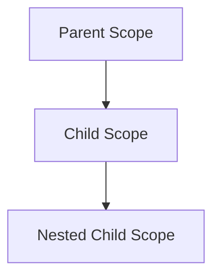

В примере:

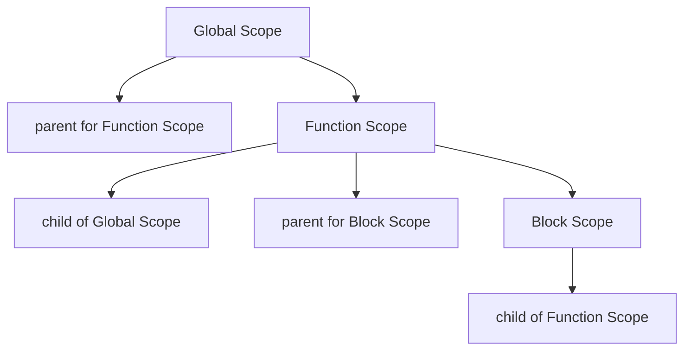

Модель rooms inside a building:

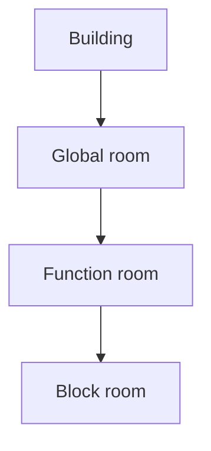

Внутренняя комната может выйти взглядом наружу к parent rooms. Внешняя комната не видит private notes, лежащие внутри child room.

### Doors between rooms

Scope можно представить как комнаты с дверями.

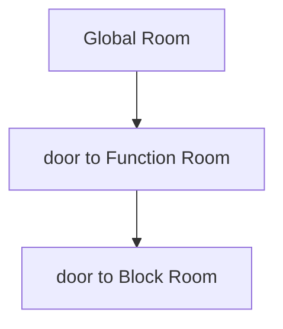

Когда engine находится внутри Block Room, он может искать наружу:

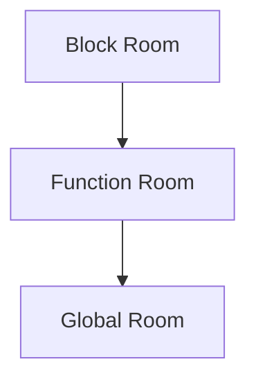

Но поиск не идет внутрь sibling или child rooms, в которых текущий код не находится.

```mermaid
flowchart TD
    N1["Current room: Global"]
    N2["cannot inspect Function local names"]
    N3["cannot inspect Block local names"]
    N1 --> N2
    N1 --> N3
```

Это ключевой принцип:

```text
Identifier lookup searches outward only.
```

### Local workspace

Function Scope похож на local workspace функции.

```javascript
function createUser() {
  const userName = 'Anna';
  const userRole = 'admin';

  console.log(userName);
  console.log(userRole);
}
```

Диаграмма:

```mermaid
flowchart TD
    N1["Function local workspace: createUser"]
    N2["userName"]
    N3["userRole"]
    N1 --> N2
    N1 --> N3
```

Эти identifiers помогают функции выполнить работу, но не становятся автоматически видимыми для всей программы.

```mermaid
flowchart TD
    N1["Local workspace"]
    N2["useful inside function"]
    N3["hidden from outside code"]
    N1 --> N2
    N1 --> N3
```

Для Automation QA это особенно важно: helper-local variables должны оставаться деталями helper.

### Scope Chain на концептуальном уровне

Scope Chain — цепочка scopes, по которой engine ищет identifier.

```mermaid
flowchart TD
    N1["Current Scope"]
    N2["Parent Scope"]
    N3["Parent of Parent"]
    N4["Global Scope"]
    N1 --> N2
    N2 --> N3
    N3 --> N4
```

Это концептуальная модель. Lexical Environment internals объяснят, как engine представляет эту связь внутри, в следующей главе.

Пример:

```javascript
const baseUrl = 'https://example.com';

function printLoginUrl() {
  const path = '/login';

  console.log(baseUrl + path);
}

printLoginUrl();
```

Lookup для `path`:

```mermaid
flowchart TD
    N1["Current Scope: printLoginUrl"]
    N2["path found"]
    N1 --> N2
```

Lookup для `baseUrl`:

```mermaid
flowchart TD
    N1["Current Scope: printLoginUrl"]
    N2["baseUrl not found"]
    N3["Global Scope"]
    N4["baseUrl found"]
    N1 --> N2
    N1 --> N3
    N3 --> N4
```

### Identifier lookup

Identifier lookup — процесс поиска visible identifier.

Алгоритм:

```text
1. Start in current scope.
2. If identifier exists here, use it.
3. If not, move to parent scope.
4. Repeat until Global Scope.
5. If not found, access fails.
```

Полный lookup process:

```mermaid
flowchart TD
    N1["Identifier requested: userName"]
    N2["Current Scope"]
    N3["found? да → use current identifier"]
    N4["found? нет"]
    N5["Parent Scope"]
    N6["found? да → use parent identifier"]
    N7["found? нет"]
    N8["Global Scope"]
    N9["found? да → use global identifier"]
    N10["found? нет → ReferenceError"]
    N1 --> N2
    N2 --> N3
    N2 --> N4
    N2 --> N5
    N5 --> N6
    N5 --> N7
    N5 --> N8
    N8 --> N9
    N8 --> N10
```

ReferenceError — runtime error, который возникает, когда код обращается к identifier, который не найден в доступной цепочке. Error Handling будет изучаться позже.

### Variable shadowing

Shadowing происходит, когда inner scope объявляет identifier с тем же именем, что и outer scope.

```javascript
const status = 'global';

function printStatus() {
  const status = 'local';

  console.log(status);
}

printStatus();
console.log(status);
```

Результат:

```text
local
global
```

Диаграмма shadowing:

```mermaid
flowchart TD
    N1["Global Scope"]
    N2["status → &quot;global&quot;"]
    N3["Function Scope"]
    N4["status → &quot;local&quot;"]
    N1 --> N2
    N1 --> N3
    N3 --> N4
```

Когда engine находится внутри function scope:

```mermaid
flowchart TD
    N1["lookup status"]
    N2["Function Scope"]
    N3["found local status"]
    N1 --> N2
    N2 --> N3
```

Поиск останавливается на ближайшем найденном identifier. Внешний `status` не исчезает, но он shadowed внутри функции.

Что engine может access прямо сейчас:

```text
Inside printStatus:
status means local status.

Outside printStatus:
status means global status.
```

### Visibility vs lifetime

Visibility и lifetime не одно и то же.

Visibility отвечает:

```text
Can this identifier be accessed from here?
```

Lifetime отвечает:

```text
How long is this information needed or active?
```

Диаграмма:

```mermaid
flowchart TD
    N1["Variable lifetime"]
    N2["when information exists / remains relevant"]
    N3["Variable visibility"]
    N4["where identifier can be used"]
    N1 --> N2
    N1 --> N3
    N3 --> N4
```

Пример:

```javascript
function prepareUser() {
  const userName = 'Anna';

  console.log(userName);
}

prepareUser();
```

`userName` visible внутри function scope. Снаружи оно не visible.

```mermaid
flowchart TD
    N1["Inside prepareUser"]
    N2["userName visible"]
    N3["Outside prepareUser"]
    N4["userName not visible"]
    N1 --> N2
    N1 --> N3
    N3 --> N4
```

Точные детали lifetime и memory cleanup будут связаны с будущими темами про Lexical Environment, Closures и Garbage Collector. Сейчас важна граница: visibility — это вопрос "где можно обратиться к имени".

### Execution Context + Scope

Execution Context — рабочая среда выполнения. Scope определяет, какие identifiers видимы для кода в этой среде.

```mermaid
flowchart TD
    N1["Execution Context"]
    N2["current code is running"]
    N3["current scope is known"]
    N4["identifier lookup follows scope chain"]
    N1 --> N2
    N1 --> N3
    N1 --> N4
```

Когда вызывается функция:

```mermaid
flowchart TD
    N1["Function Execution Context"]
    N2["тело функции runs"]
    N3["function scope is current"]
    N4["outer scopes can be searched conceptually"]
    N1 --> N2
    N1 --> N3
    N1 --> N4
```

Диаграмма:

```mermaid
flowchart TD
    N1["Call Stack"]
    N2["Function Execution Context"]
    N3["Current Scope: function"]
    N4["Global Execution Context"]
    N5["Global Scope"]
    N1 --> N2
    N1 --> N3
    N1 --> N4
    N4 --> N5
```

Lexical Environment объяснит внутреннюю структуру этой связи позже. Сейчас достаточно понимать: execution happens somewhere, and that "somewhere" has visible identifiers.

### Variables + Scope

Variables создают identifiers. Scope определяет, где identifiers видимы.

```mermaid
flowchart TD
    N1["Variable declaration"]
    N2["появляется идентификатор"]
    N3["Scope determines visibility"]
    N1 --> N2
    N2 --> N3
```

Пример:

```javascript
function testLogin() {
  const userName = 'qa-user';

  console.log(userName);
}
```

```mermaid
flowchart TD
    N1["Variable"]
    N2["userName is declared"]
    N3["Scope"]
    N4["userName visible inside testLogin"]
    N1 --> N2
    N1 --> N3
    N3 --> N4
```

Снаружи:

```mermaid
flowchart TD
    N1["Global Scope"]
    N2["userName not visible"]
    N1 --> N2
```

### Переход к Lexical Environment

Мы уже можем объяснить поведение:

```text
Engine searches current scope.
Then parent scope.
Then parent of parent.
```

Но пока это concept.

Следующая глава ответит на вопрос:

> Как engine internally stores scope information?

Lexical Environment — внутренняя структура, которая помогает engine хранить identifiers текущей области и ссылку на outer environment. Это будет следующая глава.

```mermaid
flowchart TD
    N1["Scope"]
    N2["rules of visibility"]
    N3["Lexical Environment"]
    N4["internal mechanism behind those rules"]
    N1 --> N2
    N1 --> N3
    N3 --> N4
```

---

## Внутренний механизм

Внутренний механизм Scope в этой главе остается концептуальным.

Когда engine встречает identifier:

```mermaid
flowchart TD
    N1["идентификатор появляется в коде"]
    N2["Engine asks:"]
    N3["&quot;What identifiers can I access right now?&quot;"]
    N4["проверить текущий Scope"]
    N5["If not found, search parent scope"]
    N6["продолжить outward"]
    N7["Use first matching identifier"]
    N1 --> N2
    N3 --> N4
    N4 --> N5
    N5 --> N6
    N6 --> N7
    N2 --> N3
```

Для nested scopes:

```mermaid
flowchart TD
    N1["Block Scope"]
    N2["local identifiers"]
    N3["parent → Function Scope"]
    N4["local identifiers"]
    N5["parent → Global Scope"]
    N1 --> N2
    N1 --> N3
    N1 --> N4
    N4 --> N5
```

Для shadowing:

```mermaid
flowchart TD
    N1["lookup status"]
    N2["Current Scope has status"]
    N3["use current status"]
    N4["do not продолжить to outer status"]
    N1 --> N2
    N2 --> N3
    N3 --> N4
```

Что engine делает прямо сейчас:

```text
Engine does not search everywhere.
Engine searches current scope first.
Engine moves outward only when needed.
Engine stops at the first visible matching identifier.
```

---

## Ментальная модель

### Rooms inside a building

Scope — это комнаты внутри здания.

```mermaid
flowchart TD
    N1["Building"]
    N2["Global Room"]
    N3["Function Room"]
    N4["Block Room"]
    N1 --> N2
    N2 --> N3
    N3 --> N4
```

Identifiers — записи, лежащие в комнатах.

```mermaid
flowchart TD
    N1["Global Room"]
    N2["baseUrl"]
    N3["Function Room"]
    N4["userName"]
    N5["Block Room"]
    N6["expectedStatus"]
    N1 --> N2
    N1 --> N3
    N3 --> N4
    N3 --> N5
    N5 --> N6
```

### Doors between rooms

Из внутренней комнаты можно смотреть наружу.

```mermaid
flowchart TD
    N1["Block Room"]
    N2["Function Room"]
    N3["Global Room"]
    N1 --> N2
    N2 --> N3
```

Из внешней комнаты нельзя автоматически смотреть внутрь child room.

```mermaid
flowchart TD
    N1["Global Room"]
    N2["cannot inspect Function Room local names"]
    N1 --> N2
```

### Local workspace

Функция имеет local workspace.

```mermaid
flowchart TD
    N1["Helper local workspace"]
    N2["requestBody"]
    N3["responseStatus"]
    N4["normalizedUser"]
    N1 --> N2
    N1 --> N3
    N1 --> N4
```

Эти names помогают helper, но не должны загрязнять весь тест.

### Nested rooms

Nested scopes — вложенные комнаты.

```mermaid
flowchart TD
    N1["test scope"]
    N2["helper scope"]
    N3["block scope"]
    N1 --> N2
    N2 --> N3
```

Чем глубже текущий код, тем больше outer scopes он может conceptually search.

### Parent room

Parent scope — внешняя область.

```mermaid
flowchart TD
    N1["Child Scope"]
    N2["can search Parent Scope"]
    N1 --> N2
```

### Searching outward only

Главное правило:

```text
Search starts here.
Search goes outward.
Search never jumps into unrelated rooms.
```

Итоговая модель:

```text
Variables answer:
"How do names appear?"

Scope answers:
"Where are those names visible?"

Scope Chain answers conceptually:
"In what outward order does lookup happen?"
```

---

## Примеры кода

Примеры к этой главе находятся в папке:

```text
examples/01-javascript/chapter-07/
```

Запускайте их из корня проекта.

### Пример 1. Global Scope

Файл:

```text
examples/01-javascript/chapter-07/01-global-scope.js
```

Показывает identifier, объявленный в Global Scope.

### Пример 2. Function Scope

Файл:

```text
examples/01-javascript/chapter-07/02-function-scope.js
```

Показывает function-local identifier.

### Пример 3. Block Scope

Файл:

```text
examples/01-javascript/chapter-07/03-block-scope.js
```

Показывает block-local identifier для `const`.

### Пример 4. Shadowing

Файл:

```text
examples/01-javascript/chapter-07/04-shadowing.js
```

Показывает, как inner identifier shadow-ит outer identifier.

### Пример 5. Scope Chain

Файл:

```text
examples/01-javascript/chapter-07/05-scope-chain.js
```

Показывает lookup из block scope во function scope и global scope.

### Пример 6. Типичные ошибки

Файл:

```text
examples/01-javascript/chapter-07/06-common-mistakes.js
```

Показывает типичные ошибки через безопасные закомментированные строки и корректные варианты.

---

## Частые вопросы

### Scope и Execution Context — это одно и то же?

Нет. Execution Context — среда выполнения. Scope — правила видимости identifiers для кода. Они связаны, но отвечают на разные вопросы.

### Scope Chain — это Call Stack?

Нет. Call Stack управляет активными Execution Contexts. Scope Chain описывает conceptual path поиска identifiers outward through scopes.

### Почему функция видит global variable?

Потому что lookup может идти из function scope во внешний global scope, если identifier не найден локально.

### Почему global code не видит function-local variable?

Потому что lookup идет outward only. Global Scope не ищет identifiers внутри child function scopes.

### Почему мы не изучаем Lexical Environment здесь?

Сначала нужно понять поведение Scope. Lexical Environment объяснит внутреннюю структуру этого поведения в следующей главе.

---

## Распространенные мифы

### Миф 1. Если функция была вызвана, ее variables становятся global

Реальность:

Function-local identifiers остаются видимыми только внутри function scope.

### Миф 2. Engine ищет identifier по всему файлу

Реальность:

Engine ищет в current scope и затем outward по Scope Chain.

### Миф 3. Shadowing удаляет внешнюю variable

Реальность:

Outer identifier не исчезает. Он просто hidden внутри inner scope с таким же именем.

### Миф 4. Lifetime и visibility — одно и то же

Реальность:

Visibility отвечает "где имя доступно". Lifetime отвечает "как долго информация существует или нужна".

---

## Типичные ошибки

### Ошибка 1. Читать function-local variable снаружи

Неправильный код:

```javascript
function prepareUser() {
  const userName = 'Anna';
}

prepareUser();

// console.log(userName);
```

Что произошло:

`userName` visible only inside `prepareUser`.

Почему:

Global Scope не ищет identifiers внутри Function Scope.

Исправленный вариант:

```javascript
function prepareUser() {
  const userName = 'Anna';

  console.log(userName);
}

prepareUser();
```

### Ошибка 2. Ожидать block variable снаружи блока

Неправильный код:

```javascript
if (true) {
  const expectedStatus = 'active';
}

// console.log(expectedStatus);
```

Что произошло:

`expectedStatus` visible only inside block.

Исправленный вариант:

```javascript
const expectedStatus = 'active';

if (true) {
  console.log(expectedStatus);
}
```

### Ошибка 3. Не замечать shadowing

Код:

```javascript
const status = 'global';

function printStatus() {
  const status = 'local';

  console.log(status);
}
```

Что произошло:

Inside function `status` refers to local identifier.

Исправленная модель:

```mermaid
flowchart TD
    N1["Current Scope has status"]
    N2["use local status"]
    N3["do not read global status"]
    N1 --> N2
    N2 --> N3
```

### Ошибка 4. Использовать global mutable состояние в тестах

Неправильная модель:

```text
One global variable can safely store current test data for all tests.
```

Что произошло:

Global mutable состояние может связывать тесты между собой и усложнять debugging.

Исправленная модель:

```text
Keep test data local to test / fixture / helper when possible.
```

---

## Практическое использование

При чтении кода задавайте вопрос:

```text
What identifiers can the engine access right now?
```

Алгоритм:

```text
1. Найти текущую строку.
2. Определить current scope.
3. Выписать identifiers current scope.
4. Если identifier не найден, идти в parent scope.
5. Повторять outward.
6. Остановиться на первом найденном identifier.
```

Таблица анализа:

```text
Identifier | Current Scope | Found where?     | Value used
-----------|---------------|------------------|------------
fullUrl    | block         | block            | local
path       | block         | function         | parent
baseUrl    | block         | global           | outer
```

Чек-лист:

```text
✓ Я понимаю current scope.
✓ Я вижу parent scope.
✓ Я могу пройти lookup outward.
✓ Я замечаю shadowing.
✓ Я не путаю visibility и lifetime.
```

---

## Использование в Automation QA

### Helper-local variables

Helper должен скрывать внутренние детали.

```javascript
function buildUserName() {
  const prefix = 'qa';
  const userName = prefix + '-user';

  return userName;
}
```

`prefix` и `userName` — helper-local variables. Test code не должен зависеть от них напрямую.

```mermaid
flowchart TD
    N1["Test Scope"]
    N2["calls helper"]
    N3["Helper Scope"]
    N4["prefix"]
    N5["userName"]
    N1 --> N2
    N1 --> N3
    N3 --> N4
    N3 --> N5
```

### Fixture-local variables

Fixture может иметь local setup значения:

```mermaid
flowchart TD
    N1["Fixture Scope"]
    N2["authToken"]
    N3["userId"]
    N4["setupStatus"]
    N1 --> N2
    N1 --> N3
    N1 --> N4
```

Если эти значения не нужны тесту напрямую, они должны оставаться внутри fixture logic.

### Test-local variables

Test-local variables делают сценарий изолированным.

```javascript
function testLogin() {
  const userName = 'qa-user';
  const expectedStatus = 'active';

  console.log(userName);
  console.log(expectedStatus);
}
```

```mermaid
flowchart TD
    N1["testLogin Scope"]
    N2["userName"]
    N3["expectedStatus"]
    N1 --> N2
    N1 --> N3
```

Такой код проще читать и безопаснее менять.

### Avoiding global mutable состояние

Опасная модель:

```javascript
let currentUserName = 'unknown';

function testA() {
  currentUserName = 'user-a';
}

function testB() {
  console.log(currentUserName);
}
```

Проблема:

```mermaid
flowchart TD
    N1["Global mutable state"]
    N2["can be changed by many places"]
    N3["makes tests dependent on order"]
    N4["complicates debugging"]
    N1 --> N2
    N1 --> N3
    N1 --> N4
```

Лучше держать данные ближе к месту использования:

```text
test-local data
fixture-local data
helper-local temporary data
```

### Readability of Playwright tests

Scope помогает делать тесты читаемыми:

```mermaid
flowchart TD
    N1["Global configuration"]
    N2["stable values"]
    N3["Fixture scope"]
    N4["setup details"]
    N5["Test scope"]
    N6["scenario data"]
    N7["Helper scope"]
    N8["implementation details"]
    N1 --> N2
    N1 --> N3
    N3 --> N4
    N3 --> N5
    N5 --> N6
    N5 --> N7
    N7 --> N8
```

Читатель понимает, где искать identifier и почему он не должен быть доступен везде.

### Preventing accidental variable collisions

Shadowing иногда полезен, но часто в тестах делает код мутным.

```javascript
const status = 'global';

function assertStatus() {
  const status = 'active';

  console.log(status);
}
```

Лучше использовать точные names:

```javascript
const defaultStatus = 'global';

function assertStatus() {
  const expectedStatus = 'active';

  console.log(expectedStatus);
}
```

Good scope design снижает accidental collisions и делает ошибки очевиднее.

---

## Итоги

Scope объясняет, где identifiers видимы.

Главная модель:

```text
Variables answer:
"How do names appear?"

Scope answers:
"Where are those names visible?"
```

Global Scope видим из многих мест через outward lookup, но global mutable состояние нужно использовать осторожно. Function Scope скрывает local variables функции. Block Scope ограничивает visibility identifiers внутри `{ ... }` для `let` и `const`.

Scope Chain — концептуальный путь поиска identifier:

```mermaid
flowchart TD
    N1["Current Scope"]
    N2["Parent Scope"]
    N3["Global Scope"]
    N1 --> N2
    N2 --> N3
```

Engine ищет outward only и останавливается на первом найденном matching identifier. Поэтому shadowing не удаляет outer variable, а скрывает ее внутри inner scope.

Следующая глава объяснит Lexical Environment: внутренний механизм, который делает правила Scope возможными.

---

## Что нужно запомнить

✓ Scope отвечает на вопрос, где identifier видим.

✓ Global Scope — внешний scope программы.

✓ Function Scope — область видимости внутри функции.

✓ Block Scope — область видимости внутри `{ ... }` для `let` и `const`.

✓ Inner scope может искать identifiers outward.

✓ Outer scope не ищет identifiers inside child scopes.

✓ Scope Chain — conceptual chain поиска identifiers.

✓ Lookup начинается в current scope.

✓ Shadowing скрывает outer identifier внутри inner scope.

✓ Visibility и lifetime — разные вопросы.

✓ Следующая тема — Lexical Environment, внутренний механизм Scope.

---

## Проверьте себя

1. Зачем существует Scope?

2. Что означает visibility of identifiers?

3. Чем Global Scope отличается от Function Scope?

4. Что такое Block Scope?

5. Почему inner scope может читать outer identifier?

6. Почему outer scope не читает function-local identifier?

7. Что такое Scope Chain на концептуальном уровне?

8. Как engine выполняет identifier lookup?

9. Что такое shadowing?

10. Чем visibility отличается от lifetime?

---

## Практика

Практика к этой главе находится в файле:

```text
practice/01-javascript/07-scope.md
```

Перед практикой запустите примеры из `examples/01-javascript/chapter-07/` и для каждого identifier ответьте:

```text
Where is it declared?
Where is it visible?
Where is it read?
```

---

## Решения

Решения находятся в файле:

```text
solutions/01-javascript/07-scope.md
```

Открывайте решения после самостоятельной попытки. В этой главе важно сравнивать не только вывод, но и путь lookup для каждого identifier.
