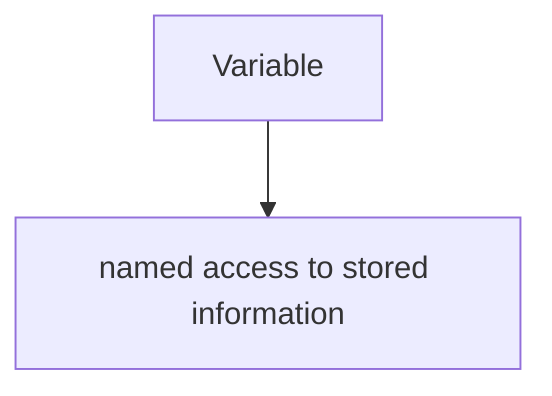
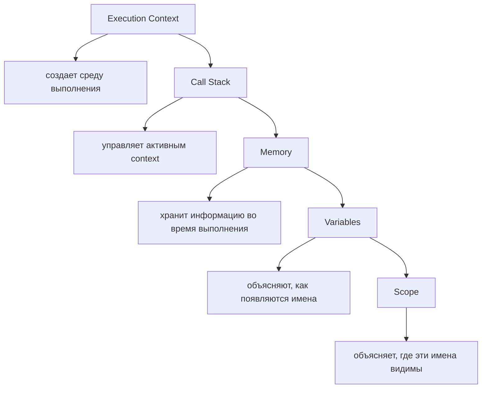
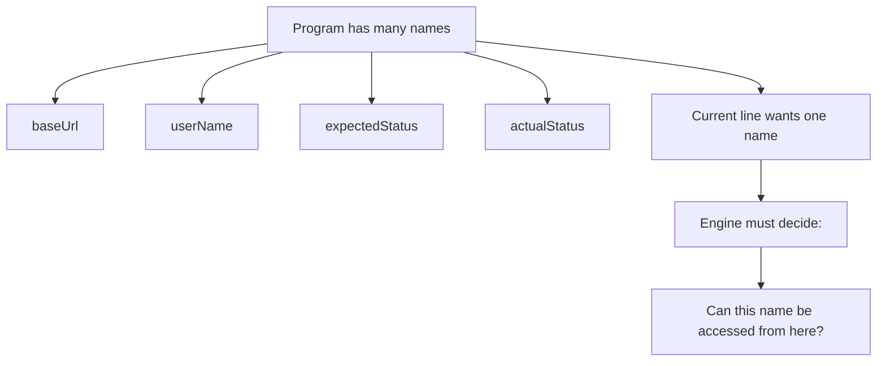
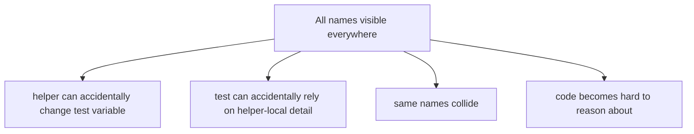
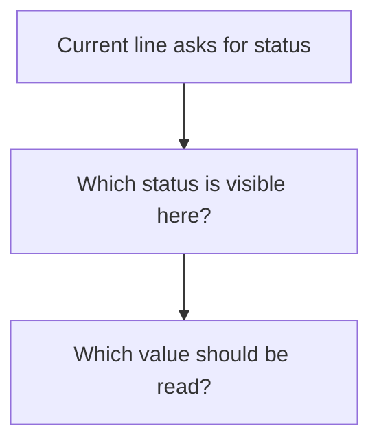
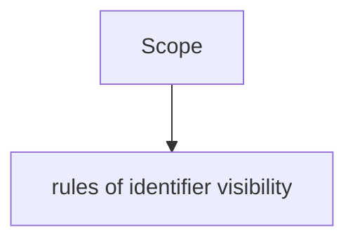
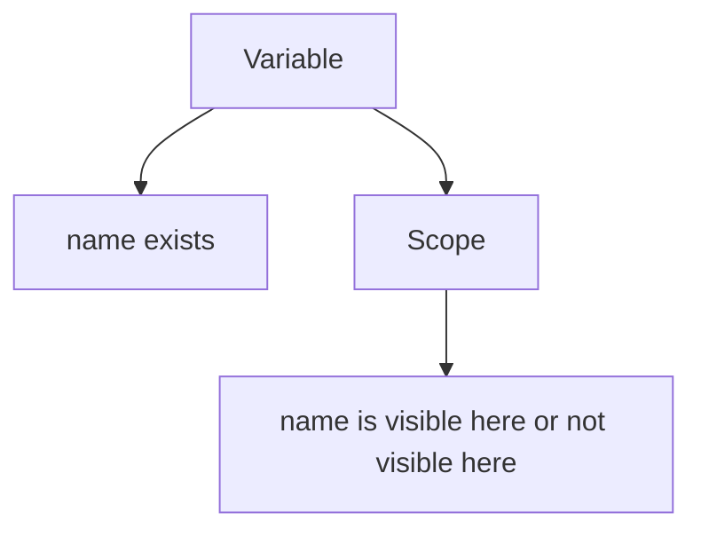
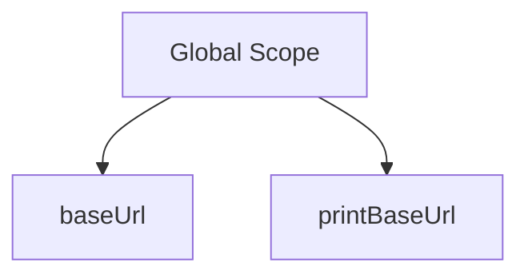
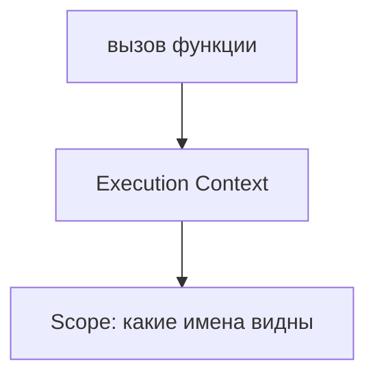

# Область видимости

## Связь с предыдущей главой

Предыдущая глава ответила на вопрос:

> Как в программе появляются имена?

Variables дают named access к сохраненной информации:


```mermaid
flowchart TD
    N1["Variable"]
    N2["named access to stored information"]
    N1 --> N2
```

Но после variables сразу появляется следующий вопрос:

> Где эти имена можно использовать?

Код ниже работает:

```javascript
const baseUrl = 'https://example.com';

console.log(baseUrl);
```

А такой код приводит к ошибке:

```javascript
function prepareUser() {
  const userName = 'Anna';
}

prepareUser();

// console.log(userName);
```

Почему `baseUrl` доступен после объявления, а `userName` снаружи функции недоступен?

На этот вопрос отвечает Scope.

Общая цепочка теперь такая:


```mermaid
flowchart TD
    N1["Execution Context"]
    N2["создает среду выполнения"]
    N3["Call Stack"]
    N4["управляет активным context"]
    N5["Memory"]
    N6["хранит информацию во время выполнения"]
    N7["Variables"]
    N8["объясняют, как появляются имена"]
    N9["Scope"]
    N10["объясняет, где эти имена видимы"]
    N1 --> N2
    N1 --> N3
    N3 --> N4
    N3 --> N5
    N5 --> N6
    N5 --> N7
    N7 --> N8
    N7 --> N9
    N9 --> N10
```

Lexical Environment объяснит внутренний механизм Scope в следующей главе. Сейчас мы строим внешнюю, но точную mental model: какие identifiers engine может access прямо сейчас.

---

## Предварительные требования

Для этой главы нужно понимать:

* что Execution Context является рабочей средой выполнения;
* что Call Stack показывает активный Execution Context;
* что memory хранит информацию;
* что variables создают named access к сохраненной информации;
* что declaration регистрирует identifier;
* что `let`, `const` и `var` создают variables.

Не требуется знать Lexical Environment internals, Hoisting, Temporal Dead Zone, Closures, `this` или modules. Эти темы будут изучаться в отдельных главах.

---

## Время изучения

Ориентировочное время:

```text
Чтение главы:            100-130 минут
Разбор схем:              45-60 минут
Запуск примеров:          25-35 минут
Практика:                 90-120 минут
Повторение материала:     30 минут
```

Уровень сложности: **L3**.

L3 означает фундаментальный уровень: Scope объясняет не синтаксис, а правила видимости identifiers. Без этой модели Hoisting, Closures, modules и архитектура тестового кода будут выглядеть как набор исключений.

---

## Навигация

Предыдущая глава:

```text
docs/01-javascript/06-variables.md
```

Следующая глава:

```text
docs/01-javascript/08-lexical-environment.md
```

Следующая глава объяснит Lexical Environment: внутреннюю структуру, через которую engine реализует Scope и поиск identifiers.

---

## Цели обучения

После изучения этой главы вы будете понимать:

* зачем существует Scope;
* что означает visibility of identifiers;
* что такое Global Scope;
* что такое Function Scope;
* что такое Block Scope;
* как работают nested scopes;
* что такое parent и child scopes;
* как работает Scope Chain на концептуальном уровне;
* как engine выполняет variable lookup;
* что такое variable shadowing;
* чем variable lifetime отличается от visibility;
* как Scope связан с Execution Context;
* как Scope связан с Variables;
* как Scope помогает писать читаемые Playwright-тесты;
* почему global mutable состояние опасен для Automation QA.

---

## Мотивация

Начнем с кода.

```javascript
const baseUrl = 'https://example.com';

function printBaseUrl() {
  console.log(baseUrl);
}

printBaseUrl();
```

Результат:

```text
https://example.com
```

Функция смогла прочитать `baseUrl`, хотя `baseUrl` объявлен снаружи.

Теперь другой код:

```javascript
function prepareUser() {
  const userName = 'Anna';

  console.log(userName);
}

prepareUser();

// console.log(userName);
```

Внутри функции `userName` доступен. Снаружи — нет.

Наблюдаемое поведение:

```text
Some identifiers are visible here.
Some identifiers are not visible here.
```

Вопрос главы:

> Какие identifiers engine может access прямо сейчас?

Пока не нужно определение. Нужно почувствовать проблему:


```mermaid
flowchart TD
    N1["Program has many names"]
    N2["baseUrl"]
    N3["userName"]
    N4["expectedStatus"]
    N5["actualStatus"]
    N6["Current line wants one name"]
    N7["Engine must decide:"]
    N8["Can this name be accessed from here?"]
    N1 --> N2
    N1 --> N3
    N1 --> N4
    N1 --> N5
    N1 --> N6
    N6 --> N7
    N7 --> N8
```

Scope существует потому, что программе нужны границы видимости имен.

---

## Теория

### Проблема видимости имён

Если бы все имена были видимы везде, программа быстро стала бы опасной.


```mermaid
flowchart TD
    N1["All names visible everywhere"]
    N2["helper can accidentally change test variable"]
    N3["test can accidentally rely on helper-local detail"]
    N4["same names collide"]
    N5["code becomes hard to reason about"]
    N1 --> N2
    N1 --> N3
    N1 --> N4
    N1 --> N5
```

Представим тестовый проект:

```javascript
const status = 'global';

function createUser() {
  const status = 'created';

  console.log(status);
}

createUser();
console.log(status);
```

Если не понимать область видимости, непонятно, какой `status` будет прочитан в каждой строке.

Что должен решить движок:


```mermaid
flowchart TD
    N1["Current line asks for status"]
    N2["Which status is visible here?"]
    N3["Which value should be read?"]
    N1 --> N2
    N2 --> N3
```

### Что такое область видимости

Теперь можно ввести термин.

Область видимости — часть программы, в которой имя видимо и может быть использовано.


```mermaid
flowchart TD
    N1["Scope"]
    N2["rules of identifier visibility"]
    N1 --> N2
```

Главная формула главы:

```text
Variables answer:
"How do names appear?"

Scope answers:
"Where are those names visible?"
```

Область видимости не создаёт значение сама по себе. Она определяет, где имя можно использовать для доступа к значению.


```mermaid
flowchart TD
    N1["Variable"]
    N2["name exists"]
    N3["Scope"]
    N4["name is visible here or not visible here"]
    N1 --> N2
    N1 --> N3
    N3 --> N4
```

Что движок делает прямо сейчас:

```text
Engine sees identifier.
Engine checks current scope.
If not found, engine searches outward.
If no visible identifier is found, access fails.
```

### Глобальная область видимости

Глобальная область видимости — внешняя область файла или программы.

```javascript
const baseUrl = 'https://example.com';

function printBaseUrl() {
  console.log(baseUrl);
}
```

`baseUrl` объявлен в глобальной области видимости.

Диаграмма:


```mermaid
flowchart TD
    N1["Global Scope"]
    N2["baseUrl"]
    N3["printBaseUrl"]
    N1 --> N2
    N1 --> N3
```

В глобальной области видимости видны имена, объявленные на верхнем уровне файла,
и объявленные там функции — их видно из любого места ниже.

Пример:

```javascript
const testName = 'login';

console.log(testName);
```

```text
Global Scope
└── testName  ──→  [ 'login' ]
```

Глобальная область удобна для постоянной конфигурации в маленьких примерах, но в больших тестовых проектах общее изменяемое состояние часто создаёт проблемы. Это будет разобрано в разделе про автоматизацию тестов.

### Область видимости функции

Область видимости функции — область внутри функции.

```javascript
function prepareUser() {
  const userName = 'Anna';

  console.log(userName);
}

prepareUser();
```

`userName` видим внутри `prepareUser`.

```text
Global Scope
└── prepareUser Scope
    └── userName  ──→  [ ... ]
```

Снаружи функции `userName` не видим: имя существует только внутри её области.

Что движок делает прямо сейчас:

```text
внутри prepareUser:
поиск userName начинается в области функции
userName найдено
```

Снаружи:

```text
Global line asks for userName.
lookup starts in Global Scope.
userName is not found.
access fails.
```

### Блочная область видимости

Область видимости блока — область внутри фигурных скобок для `let` и `const`.

```javascript
if (true) {
  const expectedStatus = 'active';

  console.log(expectedStatus);
}
```

`expectedStatus` видим внутри блока.

```text
Global Scope
└── Block Scope { }
    └── expectedStatus  ──→  [ ... ]
```

Снаружи блока имя не видимо:

```javascript
if (true) {
  const expectedStatus = 'active';
}

// console.log(expectedStatus);
```

`var` ведёт себя иначе по отношению к области блока; подробности будут разобраны в главах про подъём объявлений и связанное с ним поведение. В этой главе основное внимание — `let` и `const`, потому что в новом коде используют именно их.

### Вложенные области видимости

Области видимости могут быть вложенными.

```javascript
const baseUrl = 'https://example.com';

function buildLoginUrl() {
  const path = '/login';

  if (true) {
    const fullUrl = baseUrl + path;

    console.log(fullUrl);
  }
}

buildLoginUrl();
```

```text
Global Scope
└── buildLoginUrl Scope
    └── Block Scope { }
```

Внутренняя область может использовать имена из внешних областей:

```text
из блока        видно: имена блока, имена функции, глобальные имена
из функции      видно: имена функции и глобальные имена
из глобального  видно: только глобальные имена
```

Видимость работает наружу, но не внутрь: снаружи имена вложенной области не видны.

### Родительские и дочерние области

Вложенную область можно назвать дочерней. Внешнюю — родительской.

В примере: блок внутри функции — дочерняя область, сама функция — её родитель, а глобальная область — родитель для функции.

Модель комнат внутри здания: комнаты вложены одна в другую, и каждая внутренняя находится внутри внешней.

Из внутренней комнаты можно выглянуть наружу, в родительские. Внешняя комната не видит записей, лежащих внутри дочерней.

### Двери между комнатами

Область видимости можно представить как комнаты с дверями.

Когда движок находится внутри комнаты блока, он может искать наружу:

Но поиск не идёт внутрь соседних и дочерних комнат, в которых текущий код не находится.

Это ключевой принцип:

```text
Identifier lookup searches outward only.
```

### Локальный рабочий стол

Область видимости функции похожа на её рабочее место.

```javascript
function createUser() {
  const userName = 'Anna';
  const userRole = 'admin';

  console.log(userName);
  console.log(userRole);
}
```

```text
function Scope
├── userName
└── userRole
```

Эти имена помогают функции выполнить работу, но не становятся автоматически видимыми для всей программы.

Для автоматизации тестов это особенно важно: локальные переменные вспомогательной функции должны оставаться её внутренней деталью.

### Цепочка областей видимости на концептуальном уровне

Цепочка областей видимости — последовательность областей, по которой движок ищет имя.

Это концептуальная модель. Устройство лексического окружения объяснит, как движок представляет эту связь внутри, в следующей главе.

Пример:

```javascript
const baseUrl = 'https://example.com';

function printLoginUrl() {
  const path = '/login';

  console.log(baseUrl + path);
}

printLoginUrl();
```

Поиск `path`:

```text
1. scope функции printLoginUrl — имя найдено, поиск закончен
```

Поиск `baseUrl`:

```text
1. scope функции printLoginUrl — имени нет
2. Global Scope                — имя найдено, поиск закончен
```

Поиск всегда идёт от текущей области наружу и останавливается на первом
совпадении.

### Поиск имени

Поиск имени — процесс нахождения видимого имени.

Алгоритм:

```text
1. Start in current scope.
2. If identifier exists here, use it.
3. If not, move to parent scope.
4. Repeat until Global Scope.
5. If not found, access fails.
```

Полный процесс поиска:

`ReferenceError` — ошибка времени выполнения, которая возникает, когда код обращается к имени, не найденному в доступной цепочке. Обработка ошибок будет изучаться позже.

### Затенение переменной

Перекрытие происходит, когда внутренняя область объявляет имя, совпадающее с именем во внешней области.

```javascript
const status = 'global';

function printStatus() {
  const status = 'local';

  console.log(status);
}

printStatus();
console.log(status);
```

Результат:

```text
local
global
```

```text
Global Scope
└── status  ──→  [ 'global' ]
    function Scope
    └── status  ──→  [ 'local' ]   ← найдено первым
```

Когда движок находится внутри области функции:

Поиск останавливается на ближайшем найденном имени. Внешний `status` не исчезает, но внутри функции он перекрыт.

К чему движок может обратиться прямо сейчас:

```text
Inside printStatus:
status means local status.

Outside printStatus:
status means global status.
```

### Видимость и время жизни

Видимость и время жизни — не одно и то же.

Видимость отвечает на вопрос:

```text
Can this identifier be accessed from here?
```

Время жизни отвечает на вопрос:

```text
How long is this information needed or active?
```

```text
Scope     — где имя видно
Lifetime  — как долго значение нужно
```

Пример:

```javascript
function prepareUser() {
  const userName = 'Anna';

  console.log(userName);
}

prepareUser();
```

`userName` видим внутри области функции. Снаружи он не видим.

Точные детали времени жизни и освобождения памяти будут связаны с будущими темами про лексическое окружение, замыкания и сборку мусора. Сейчас важна граница: видимость — это вопрос «где можно обратиться к имени».

### Контекст выполнения и область видимости

Контекст выполнения — рабочая среда. Область видимости определяет, какие имена видимы для кода в этой среде.

Когда вызывается функция:


```mermaid
flowchart TD
    N1["вызов функции"]
    N2["Execution Context"]
    N3["Scope: какие имена видны"]
    N1 --> N2
    N2 --> N3
```

Лексическое окружение объяснит внутреннюю структуру этой связи позже. Сейчас достаточно понимать: выполнение всегда происходит где-то, и у этого «где-то» есть набор видимых имён.

### Переменные и область видимости

Переменные создают имена. Область видимости определяет, где эти имена видимы.

Пример:

```javascript
function testLogin() {
  const userName = 'qa-user';

  console.log(userName);
}
```

Снаружи:

```javascript
testLogin();
console.log(userName); // ReferenceError: userName is not defined
```

Имя `userName` создано внутри функции, поэтому за её пределами его в цепочке
областей нет — и поиск заканчивается ошибкой, а не значением `undefined`.

### Переход к лексическому окружению

Мы уже можем объяснить поведение:

```text
Engine searches current scope.
Then parent scope.
Then parent of parent.
```

Но пока это только идея.

Следующая глава ответит на вопрос:

> Как движок хранит информацию об областях видимости внутри?

Лексическое окружение — внутренняя структура, которая помогает движку хранить имена текущей области и ссылку на внешнее окружение. Это будет следующая глава.

---

## Внутренний механизм

Внутренний механизм области видимости в этой главе остаётся концептуальным.

Правило одно и то же во всех случаях:

```text
1. искать имя в ТЕКУЩЕЙ области           → нашли: использовать
2. не нашли → перейти к внешней области    → повторить шаг 1
3. областей больше нет                     → ReferenceError
```

Для вложенных областей это означает движение изнутри наружу — и только в эту
сторону: внешняя область не видит имён внутренней.

Перекрытие — следствие шага 1: поиск останавливается на первом найденном имени,
поэтому внутреннее имя закрывает внешнее, не изменяя его.

Что движок делает прямо сейчас:

```text
движок не ищет везде
движок сначала смотрит текущую область
движок выходит наружу только при необходимости
движок останавливается на первом подходящем видимом имени
```

---

## Ментальная модель

### Комнаты внутри здания

Области видимости — это комнаты внутри здания.

Имена — записи, лежащие в комнатах.

### Двери между комнатами

Из внутренней комнаты можно смотреть наружу.

Из внешней комнаты нельзя автоматически смотреть внутрь дочерней.

### Локальный рабочий стол

У функции есть своё рабочее место.

Эти имена помогают вспомогательной функции, но не должны засорять весь тест.

### Вложенные комнаты

Вложенные области — это вложенные комнаты.

Чем глубже текущий код, тем больше внешних областей он может обойти при поиске.

### Комната-родитель

Родительская область — внешняя по отношению к текущей.

### Поиск только наружу

Главное правило:

```text
Search starts here.
Search goes outward.
Search never jumps into unrelated rooms.
```

Итоговая модель:

```text
Variables answer:
"How do names appear?"

Scope answers:
"Where are those names visible?"

Scope Chain answers conceptually:
"In what outward order does lookup happen?"
```

---

## Примеры кода

Примеры к этой главе находятся в папке:

```text
examples/01-javascript/chapter-07/
```

Запускайте их из корня проекта.

### Пример 1. Глобальная область видимости

Файл:

```text
examples/01-javascript/chapter-07/01-global-scope.js
```

Показывает имя, объявленное в глобальной области видимости.

### Пример 2. Область видимости функции

Файл:

```text
examples/01-javascript/chapter-07/02-function-scope.js
```

Показывает имя, локальное для функции.

### Пример 3. Область видимости блока

Файл:

```text
examples/01-javascript/chapter-07/03-block-scope.js
```

Показывает имя, локальное для блока, объявленное через `const`.

### Пример 4. Перекрытие

Файл:

```text
examples/01-javascript/chapter-07/04-shadowing.js
```

Показывает, как внутреннее имя перекрывает внешнее.

### Пример 5. Цепочка областей видимости

Файл:

```text
examples/01-javascript/chapter-07/05-scope-chain.js
```

Показывает поиск из области блока в область функции и далее в глобальную.

### Пример 6. Типичные ошибки

Файл:

```text
examples/01-javascript/chapter-07/06-common-mistakes.js
```

Показывает типичные ошибки через безопасные закомментированные строки и корректные варианты.

---

## Частые вопросы

### Область видимости и контекст выполнения — это одно и то же?

Нет. Контекст выполнения — среда выполнения. Область видимости — правила видимости имён для кода. Они связаны, но отвечают на разные вопросы.

### Цепочка областей видимости — это стек вызовов?

Нет. Стек вызовов управляет активными контекстами выполнения. Цепочка областей описывает путь поиска имён наружу по вложенным областям.

### Почему функция видит глобальную переменную?

Потому что поиск может идти из области функции во внешнюю глобальную область, если имя не найдено локально.

### Почему глобальный код не видит переменную внутри функции?

Потому что поиск идёт только наружу. Глобальная область не ищет имена внутри вложенных областей функций.

### Почему мы не изучаем лексическое окружение здесь?

Сначала нужно понять поведение области видимости. Лексическое окружение объяснит внутреннюю структуру этого поведения в следующей главе.

---

## Распространённые мифы

### Миф 1. Если функция была вызвана, её переменные становятся глобальными

Реальность:

Имена, объявленные внутри функции, остаются видимыми только внутри неё.

### Миф 2. Движок ищет имя по всему файлу

Реальность:

Движок ищет в текущей области и затем наружу по цепочке областей.

### Миф 3. Перекрытие удаляет внешнюю переменную

Реальность:

Внешнее имя не исчезает. Оно просто скрыто внутри области, где объявлено такое же.

### Миф 4. Время жизни и видимость — одно и то же

Реальность:

Видимость отвечает на вопрос «где имя доступно». Время жизни — «как долго информация существует или нужна».

---

## Распространённые ошибки

### Ошибка 1. Читать переменную функции снаружи

Неправильный код:

```javascript
function prepareUser() {
  const userName = 'Anna';
}

prepareUser();

// console.log(userName);
```

Что произошло:

`userName` видим только внутри `prepareUser`.

Почему:

Глобальная область не ищет имена внутри области функции.

Исправленный вариант:

```javascript
function prepareUser() {
  const userName = 'Anna';

  console.log(userName);
}

prepareUser();
```

### Ошибка 2. Ожидать переменную блока снаружи блока

Неправильный код:

```javascript
if (true) {
  const expectedStatus = 'active';
}

// console.log(expectedStatus);
```

Что произошло:

`expectedStatus` видим только внутри блока.

Исправленный вариант:

```javascript
const expectedStatus = 'active';

if (true) {
  console.log(expectedStatus);
}
```

### Ошибка 3. Не замечать перекрытие

Код:

```javascript
const status = 'global';

function printStatus() {
  const status = 'local';

  console.log(status);
}
```

Что произошло:

Внутри функции `status` указывает на её локальное имя.

Исправленная модель: поиск имени начинается в ближайшей области, поэтому внутри функции используется её собственный `status`, а внешний остаётся нетронутым.

### Ошибка 4. Использовать общее изменяемое состояние в тестах

Неправильная модель:

```text
One global variable can safely store current test data for all tests.
```

Что произошло:

Общее изменяемое состояние может связывать тесты между собой и усложнять разбор падений.

Исправленная модель:

```text
Keep test data local to test / fixture / helper when possible.
```

---

## Практическое использование

При чтении кода задавайте вопрос:

```text
What identifiers can the engine access right now?
```

Алгоритм:

```text
1. Найти текущую строку.
2. Определить current scope.
3. Выписать identifiers current scope.
4. Если identifier не найден, идти в parent scope.
5. Повторять outward.
6. Остановиться на первом найденном identifier.
```

Таблица анализа:

```text
Identifier | Current Scope | Found where?     | Value used
-----------|---------------|------------------|------------
fullUrl    | block         | block            | local
path       | block         | function         | parent
baseUrl    | block         | global           | outer
```

Чек-лист:

```text
✓ Я понимаю current scope.
✓ Я вижу parent scope.
✓ Я могу пройти lookup outward.
✓ Я замечаю shadowing.
✓ Я не путаю visibility и lifetime.
```

---

## Использование в Automation QA

### Переменные вспомогательной функции

Вспомогательная функция должна скрывать внутренние детали.

```javascript
function buildUserName() {
  const prefix = 'qa';
  const userName = prefix + '-user';

  return userName;
}
```

`prefix` и `userName` — локальные переменные вспомогательной функции. Код теста не должен зависеть от них напрямую.

### Переменные фикстуры

Фикстура может иметь локальные значения для подготовки:

Если эти значения не нужны тесту напрямую, они должны оставаться внутри фикстуры.

### Переменные теста

Локальные переменные теста делают сценарий изолированным.

```javascript
function testLogin() {
  const userName = 'qa-user';
  const expectedStatus = 'active';

  console.log(userName);
  console.log(expectedStatus);
}
```

Такой код проще читать и безопаснее менять.

### Как избегать общего изменяемого состояния

Опасная модель:

```javascript
let currentUserName = 'unknown';

function testA() {
  currentUserName = 'user-a';
}

function testB() {
  console.log(currentUserName);
}
```

Проблема: обе функции читают одно глобальное имя, поэтому результат `testB`
зависит от того, что до него сделал `testA`. При параллельном запуске такой
порядок не гарантирован вовсе.

Лучше держать данные ближе к месту использования:

```text
test-local data
fixture-local data
helper-local temporary data
```

### Читаемость тестов Playwright

Область видимости помогает делать тесты читаемыми:

Читатель понимает, где искать имя и почему оно не должно быть доступно везде.

### Как избегать случайных совпадений имён

Перекрытие иногда полезно, но часто в тестах делает код мутным.

```javascript
const status = 'global';

function assertStatus() {
  const status = 'active';

  console.log(status);
}
```

Лучше использовать точные имена:

```javascript
const defaultStatus = 'global';

function assertStatus() {
  const expectedStatus = 'active';

  console.log(expectedStatus);
}
```

Продуманные области видимости снижают число случайных совпадений имён и делают ошибки очевиднее.

---

## Итоги

Область видимости объясняет, где имена видимы.

Главная модель:

```text
Variables answer:
"How do names appear?"

Scope answers:
"Where are those names visible?"
```

Глобальная область видима из многих мест через поиск наружу, но общее изменяемое состояние нужно использовать осторожно. Область функции скрывает её локальные переменные. Область блока ограничивает видимость имён внутри фигурных скобок для `let` и `const`.

Цепочка областей видимости — концептуальный путь поиска имени:

Движок ищет только наружу и останавливается на первом найденном совпадении. Поэтому перекрытие не удаляет внешнюю переменную, а скрывает её внутри вложенной области.

Следующая глава объяснит лексическое окружение: внутренний механизм, который делает правила области видимости возможными.

---

## Что нужно запомнить

✓ Область видимости отвечает на вопрос, где имя видимо.

✓ Глобальная область — внешняя область программы.

✓ Область функции — видимость внутри функции.

✓ Область блока — видимость внутри `{ ... }` для `let` и `const`.

✓ Внутренняя область может искать имена наружу.

✓ Внешняя область не ищет имена внутри вложенных.

✓ Цепочка областей видимости — концептуальный путь поиска имён.

✓ Поиск начинается в текущей области.

✓ Перекрытие скрывает внешнее имя внутри вложенной области.

✓ Видимость и время жизни — разные вопросы.

✓ Следующая тема — лексическое окружение, внутренний механизм области видимости.

---

## Проверьте себя

1. Зачем существует область видимости?

2. Что означает видимость имени?

3. Чем глобальная область отличается от области функции?

4. Что такое область видимости блока?

5. Почему внутренняя область может читать внешнее имя?

6. Почему внешняя область не читает имя, объявленное внутри функции?

7. Что такое цепочка областей видимости на концептуальном уровне?

8. Как движок выполняет поиск имени?

9. Что такое перекрытие?

10. Чем видимость отличается от времени жизни?

### Ответы

1. Чтобы имена не мешали друг другу. Без областей видимости любое имя было бы общим, и вспомогательная переменная внутри функции затирала бы значение снаружи.
2. Видимость имени — это ответ на вопрос, доступно ли имя в данном месте кода. Имя может существовать в программе и при этом быть недоступным отсюда.
3. Глобальная область видна всему коду и живёт, пока работает программа. Область функции создаётся на вызов, видна только внутри функции и исчезает вместе с вызовом.
4. Область, ограниченная фигурными скобками. Имена, объявленные в ней через `let` и `const`, снаружи блока не видны.
5. Поиск имени идёт изнутри наружу: не нашли здесь — смотрим в окружающей области. Это позволяет пользоваться общими значениями, не передавая их явно.
6. Поиск никогда не идёт внутрь. Внешний код не знает, какие вызовы происходят и какие имена там заведены; вложенное имя может вообще не существовать в момент обращения.
7. Цепочка областей от текущей до глобальной, по которой движок ищет имя. Поиск останавливается на первом совпадении.
8. Смотрит в текущую область; не нашёл — переходит на шаг наружу и повторяет. Дошёл до конца цепочки и не нашёл — `ReferenceError`.
9. Перекрытие: имя во внутренней области совпадает с именем во внешней. Поиск останавливается на внутреннем, и внешнее значение отсюда недоступно.
10. Видимость — откуда имя доступно, время жизни — как долго значение существует. Значение может быть жив`о, но недоступно из данного места, и наоборот — доступное имя может уже быть уничтожено вместе со своим вызовом.

---

## Практика

Практика к этой главе находится в файле:

```text
practice/01-javascript/07-scope.md
```

Перед практикой запустите примеры из раздела «Примеры кода» и для каждого имени ответьте:

```text
Where is it declared?
Where is it visible?
Where is it read?
```

---

## Решения

Решения находятся в файле:

```text
solutions/01-javascript/07-scope.md
```

Открывайте решения после самостоятельной попытки. В этой главе важно сравнивать не только вывод, но и путь поиска каждого имени.
