# Lexical Environment

## Связь с предыдущей главой

Предыдущая глава объяснила Scope:

```text
Variables answer:
"How do names appear?"

Scope answers:
"Where are those names visible?"
```

Мы уже умеем мысленно выполнять поиск:

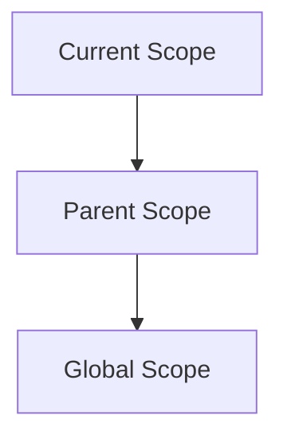

Теперь появляется следующий вопрос:

> Как JavaScript Engine internally remembers, какие identifiers принадлежат какому Scope?

Scope объясняет правила. Но rules должны где-то храниться во время выполнения. Engine должен помнить:

* какие identifiers есть в current scope;
* какие значения доступны через эти identifiers;
* куда идти дальше, если identifier не найден;
* как связать function scope с outer scope;
* почему helper-local identifiers остаются isolated.

Эта глава вводит Lexical Environment — концептуальную внутреннюю структуру, с помощью которой engine реализует Scope и identifier lookup.

Важно: это не глава по спецификации ECMAScript. Мы не будем превращать Lexical Environment в набор формальных алгоритмов. Цель — построить mental model, достаточную для понимания Hoisting, TDZ, Closures и debugging. Эти темы будут изучаться позже.

---

## Предварительные требования

Для этой главы нужно понимать:

* что Execution Context является рабочей средой выполнения;
* что Call Stack управляет active Execution Contexts;
* что Memory хранит information during execution;
* что Variables создают named access к stored information;
* что Scope определяет, где identifiers visible;
* что Scope Chain — conceptual path поиска identifiers outward.

Не требуется знать Hoisting mechanics, Temporal Dead Zone internals, Closures, `this`, modules или optimization details. Эти темы будут изучаться в отдельных главах.

---

## Время изучения

Ориентировочное время:

```text
Чтение главы:            100-130 минут
Разбор схем:              45-60 минут
Запуск примеров:          25-35 минут
Практика:                 90-120 минут
Повторение материала:     30 минут
```

Уровень сложности: **L3**.

L3 означает фундаментальный уровень: глава объясняет внутреннюю структуру, которая делает Scope работающим. Это один из мостов к Hoisting, TDZ и Closures.

---

## Навигация

Предыдущая глава:

```text
docs/01-javascript/07-scope.md
```

Следующая глава:

```text
docs/01-javascript/09-hoisting.md
```

Следующая глава объяснит Hoisting: почему declarations учитываются до выполнения строк и как это связано с подготовкой Lexical Environment.

---

## Цели обучения

После изучения этой главы вы будете понимать:

* зачем Scope нужен внутренний механизм;
* что такое Lexical Environment на концептуальном уровне;
* что такое Environment Record;
* что такое Outer Environment Reference;
* как linked environments реализуют Scope Chain;
* как Lexical Environment связан со Scope;
* как Lexical Environment связан с Execution Context;
* как Lexical Environment связан с Variables;
* как Lexical Environment связан с Memory;
* как Lexical Environment связан с Call Stack;
* как identifier lookup conceptually использует Lexical Environment;
* почему helper-local identifiers остаются isolated;
* как эта модель помогает debugging в Automation QA.

---

## Мотивация

Начнем с уже знакомого поведения.

```javascript
const baseUrl = 'https://example.com';

function printLoginUrl() {
  const path = '/login';

  console.log(baseUrl + path);
}

printLoginUrl();
```

Результат:

```text
https://example.com/login
```

Из главы про Scope мы знаем:

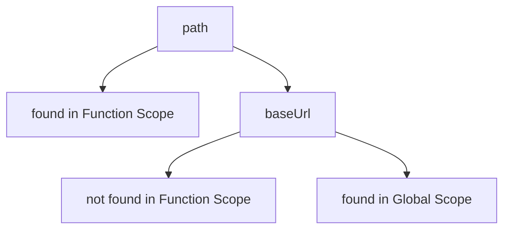

Теперь вопрос глубже:

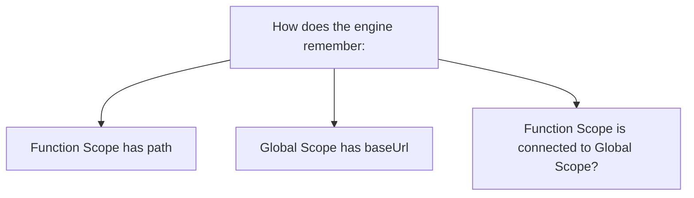

Если представить Scope только как правило, модель неполная. Правило должно быть реализовано какой-то внутренней структурой.

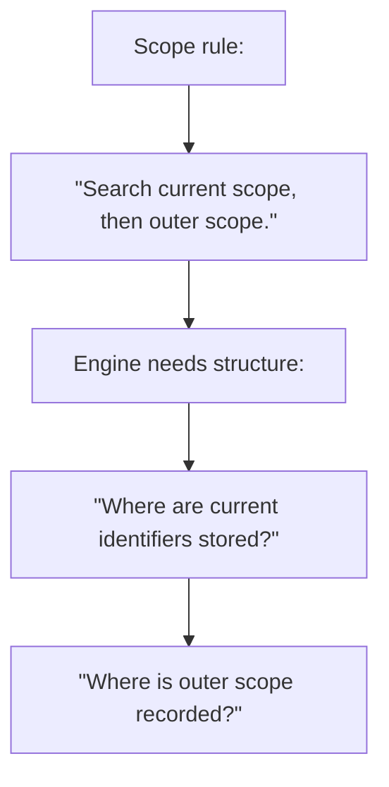

Главный вопрос главы:

> Какая структура внутри engine используется прямо сейчас?

---

## Теория

### Почему Scope нужен внутренний механизм

Scope говорит:

```text
Identifier visible here.
Identifier not visible there.
```

Но engine не может работать с абстрактным словом "видимость". Во время выполнения ему нужна конкретная внутренняя организация:

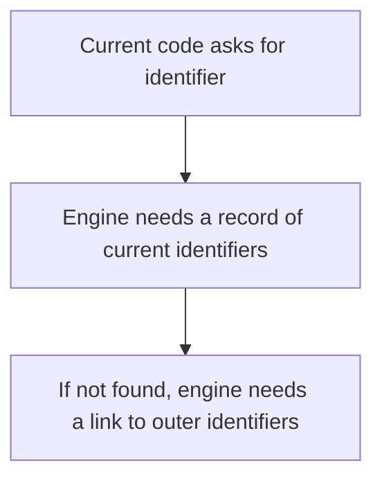

Без такой структуры engine не смог бы ответить:

* есть ли `path` в current function;
* где искать `baseUrl`;
* почему `userName` из helper не visible снаружи;
* какой `status` использовать при shadowing.

Нужна структура, которая хранит identifiers текущей области и знает, где находится outer environment.

### Наблюдаемое поведение перед термином

Рассмотрим код:

```javascript
const baseUrl = 'https://example.com';

function buildLoginUrl() {
  const path = '/login';
  const fullUrl = baseUrl + path;

  console.log(fullUrl);
}

buildLoginUrl();
```

Во время выполнения `fullUrl` engine должен сделать поиск:

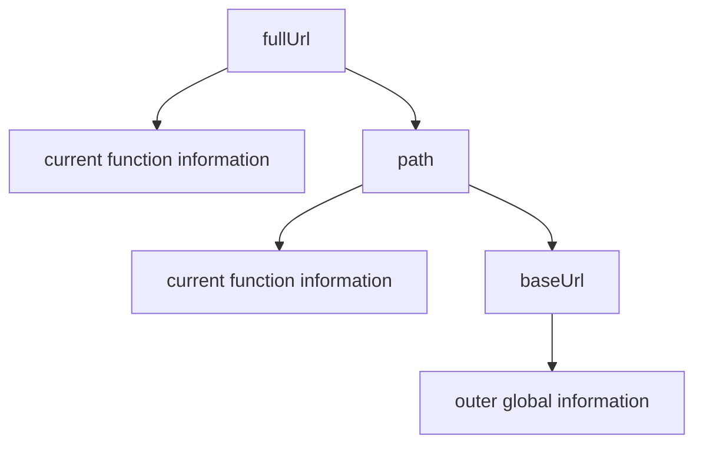

Значит, для function execution у engine есть не только code и call stack frame. Ему нужна таблица local identifiers и ссылка outward.

### Что такое Lexical Environment

Теперь можно ввести термин.

Lexical Environment — концептуальная внутренняя структура, которая хранит identifiers для текущей области и ссылку на outer environment.

Коротко:

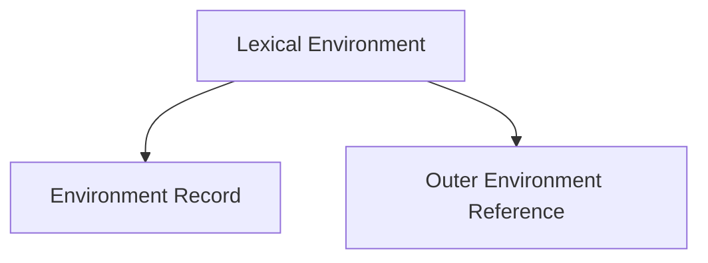

Overview:

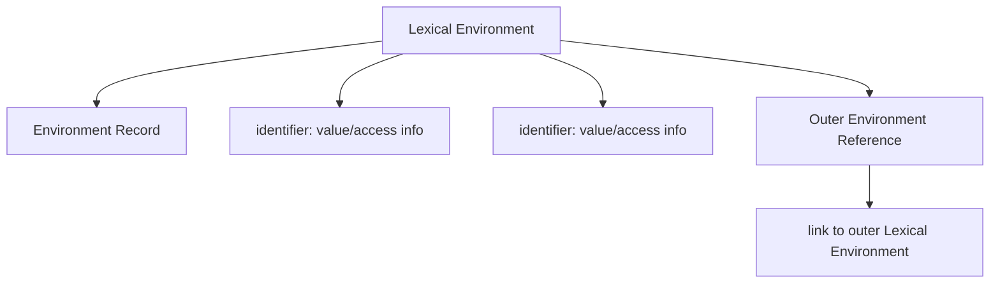

Главная модель:

```text
Scope explains the rules.
Lexical Environment is the internal structure
that allows the engine to implement those rules.
```

Что engine делает прямо сейчас:

```text
Engine uses current Lexical Environment.
Engine checks its Environment Record.
If needed, engine follows Outer Environment Reference.
```

### Environment Record

Environment Record — часть Lexical Environment, где хранятся records identifiers текущей области.

Для global-кода:

```javascript
const baseUrl = 'https://example.com';
const testName = 'login';
```

Концептуально:

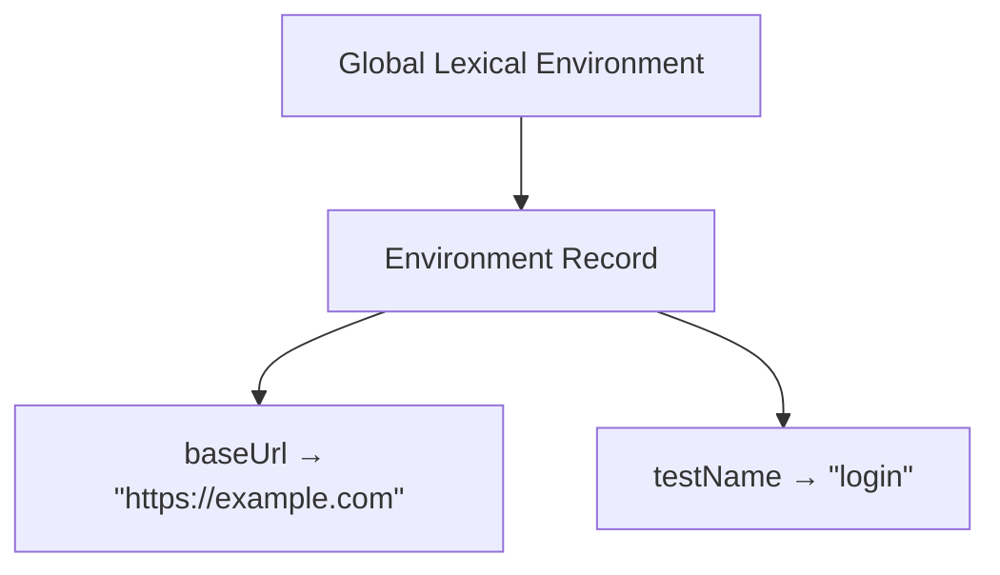

Для функции:

```javascript
function buildLoginUrl() {
  const path = '/login';
}
```

Концептуально:

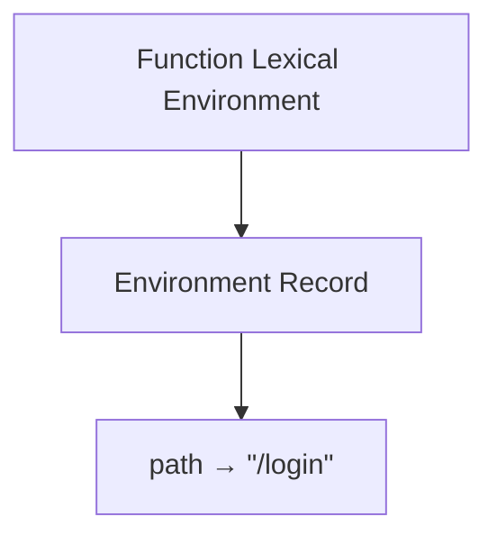

Environment Record — это не "объект, который вы можете вывести в console". Это conceptual model of internal records.

### Outer Environment Reference

Outer Environment Reference — ссылка из текущего Lexical Environment на внешний Lexical Environment.

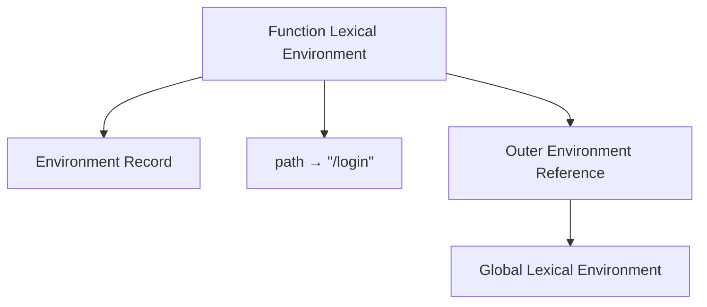

Для global environment outer reference обычно указывает на отсутствие внешнего environment:

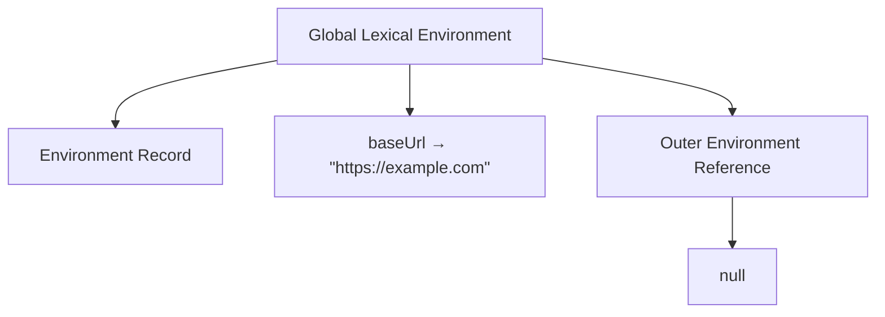

Это и есть внутренняя основа outward lookup.

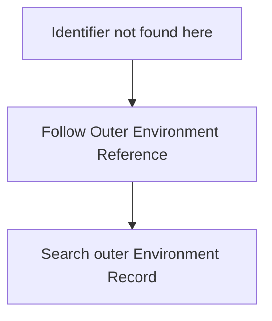

### Linked environments

Nested scopes создают linked environments.

```javascript
const baseUrl = 'https://example.com';

function buildLoginUrl() {
  const path = '/login';

  if (true) {
    const fullUrl = baseUrl + path;

    console.log(fullUrl);
  }
}
```

Диаграмма:

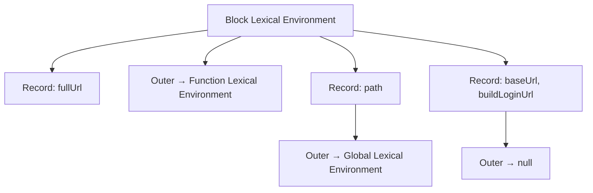

Это linked folders:

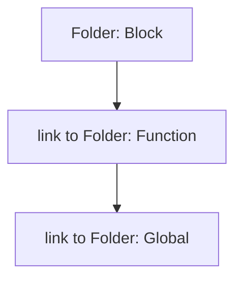

Scope Chain из предыдущей главы теперь получает внутреннюю основу:

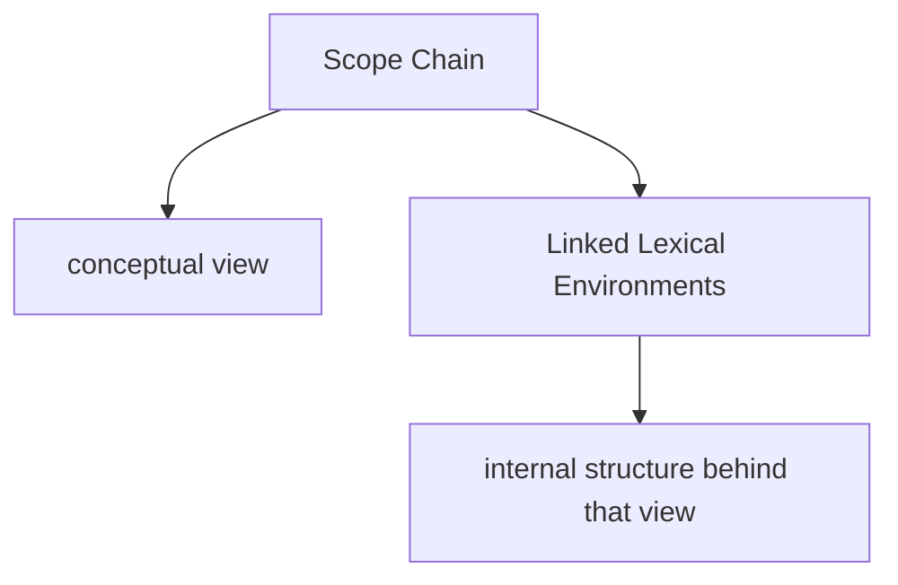

### Relationship with Scope

Scope — правило видимости. Lexical Environment — структура, которая позволяет это правило выполнять.

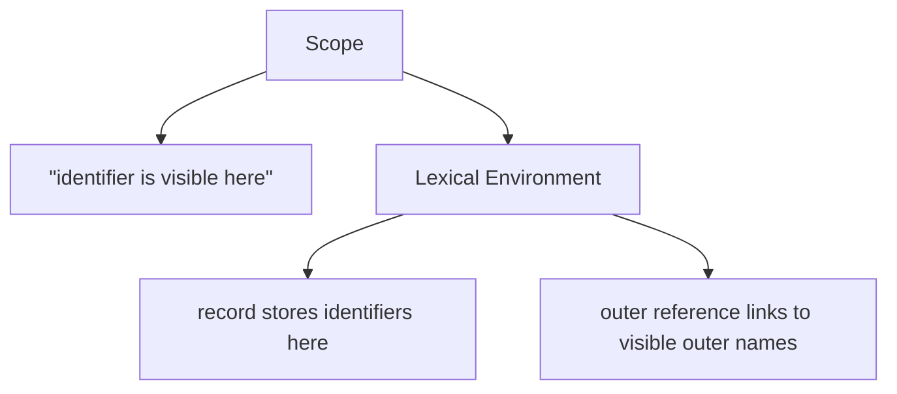

Пример:

```javascript
const baseUrl = 'https://example.com';

function printBaseUrl() {
  console.log(baseUrl);
}
```

Scope explanation:

```text
Function can access outer global identifier.
```

Lexical Environment explanation:

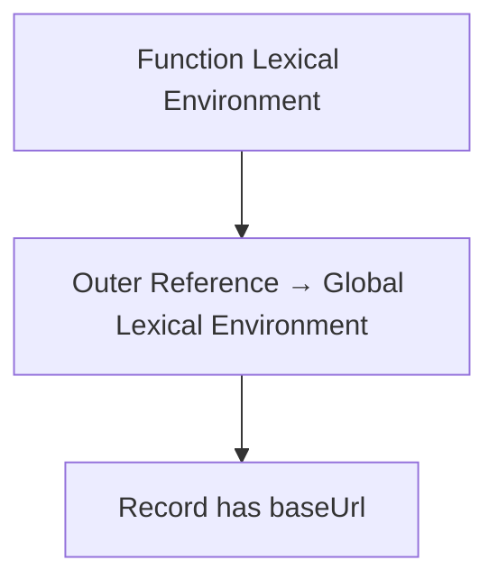

### Relationship with Execution Context

Execution Context — рабочая среда выполнения. Lexical Environment — важная часть этой среды, связанная с identifiers и scope lookup.

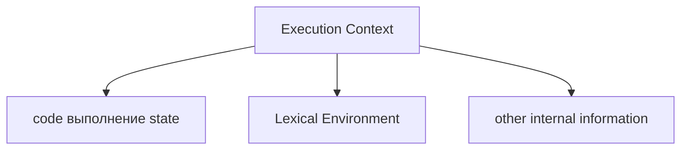

Для global execution:

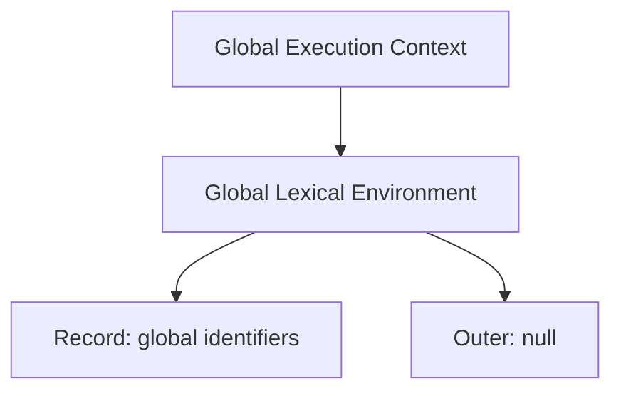

Для function execution:

```mermaid
flowchart TD
    N1["Function Execution Context"]
    N2["Function Lexical Environment"]
    N3["Record: function-local identifiers"]
    N4["Outer: lexical outer environment"]
    N1 --> N2
    N2 --> N3
    N2 --> N4
```

Что engine делает прямо сейчас:

```mermaid
flowchart TD
    N1["Active Execution Context"]
    N2["uses its Lexical Environment"]
    N3["resolves identifiers"]
    N1 --> N2
    N2 --> N3
```

### Relationship with Variables

Variables создают identifiers. Lexical Environment хранит records об этих identifiers.

```javascript
const userName = 'Anna';
let status = 'created';
```

Концептуально:

```mermaid
flowchart TD
    N1["Variable declarations"]
    N2["const userName"]
    N3["let status"]
    N4["Environment Record"]
    N5["userName → &quot;Anna&quot;"]
    N6["status → &quot;created&quot;"]
    N1 --> N2
    N1 --> N3
    N1 --> N4
    N4 --> N5
    N4 --> N6
```

При reassignment:

```javascript
status = 'ready';
```

Модель:

```mermaid
flowchart TD
    N1["Environment Record"]
    N2["userName → &quot;Anna&quot;"]
    N3["status → &quot;ready&quot;"]
    N1 --> N2
    N1 --> N3
```

`const`, `let`, `var` имеют разные правила регистрации и доступа. Hoisting и TDZ объяснят часть этих различий позже.

### Relationship with Memory

Memory хранит information. Lexical Environment хранит records named access к этой information.

```mermaid
flowchart TD
    N1["Memory"]
    N2["stores values / information"]
    N3["Lexical Environment"]
    N4["records identifiers and how to access information"]
    N1 --> N2
    N1 --> N3
    N3 --> N4
```

Учебная схема:

```mermaid
flowchart TD
    N1["Environment Record"]
    N2["baseUrl → stored information"]
    N3["testName → stored information"]
    N4["Memory"]
    N5["&quot;https://example.com&quot;"]
    N6["&quot;login&quot;"]
    N1 --> N2
    N1 --> N3
    N1 --> N4
    N4 --> N5
    N4 --> N6
```

Это не физическая карта памяти. Это conceptual relationship: Lexical Environment помогает engine понять, какой identifier к какой stored information относится.

### Relationship with Call Stack

Call Stack показывает active Execution Context.

```mermaid
flowchart TD
    N1["Call Stack"]
    N2["Function Execution Context"]
    N3["Global Execution Context"]
    N1 --> N2
    N1 --> N3
```

Каждый relevant Execution Context имеет свою Lexical Environment information.

```mermaid
flowchart TD
    N1["Call Stack"]
    N2["Function Execution Context"]
    N3["Lexical Environment: function record + outer link"]
    N4["Global Execution Context"]
    N5["Lexical Environment: global record"]
    N1 --> N2
    N1 --> N3
    N1 --> N4
    N4 --> N5
```

Что важно:

```mermaid
flowchart TD
    N1["Call Stack"]
    N2["answers &quot;what is executing now?&quot;"]
    N3["Lexical Environment"]
    N4["answers &quot;how are identifiers resolved now?&quot;"]
    N1 --> N2
    N1 --> N3
    N3 --> N4
```

Это разные механизмы, но они работают вместе во время execution.

### Identifier lookup через Lexical Environment

Рассмотрим код:

```javascript
const baseUrl = 'https://example.com';

function buildLoginUrl() {
  const path = '/login';
  const fullUrl = baseUrl + path;

  console.log(fullUrl);
}
```

Lookup для `fullUrl`:

```mermaid
flowchart TD
    N1["Current Lexical Environment: buildLoginUrl"]
    N2["Environment Record has fullUrl"]
    N3["use fullUrl"]
    N1 --> N2
    N1 --> N3
```

Lookup для `path`:

```mermaid
flowchart TD
    N1["Current Lexical Environment: buildLoginUrl"]
    N2["Environment Record has path"]
    N3["use path"]
    N1 --> N2
    N1 --> N3
```

Lookup для `baseUrl`:

```mermaid
flowchart TD
    N1["Current Lexical Environment: buildLoginUrl"]
    N2["Record does not have baseUrl"]
    N3["Outer Environment Reference"]
    N4["Global Lexical Environment"]
    N5["Record has baseUrl"]
    N6["use baseUrl"]
    N1 --> N2
    N1 --> N3
    N1 --> N4
    N4 --> N5
    N4 --> N6
```

Полный процесс поиска:

```mermaid
flowchart TD
    N1["Identifier requested"]
    N2["Current Lexical Environment"]
    N3["Environment Record has identifier?"]
    N4["да → use it"]
    N5["нет"]
    N6["Outer Environment Reference"]
    N7["Outer Lexical Environment"]
    N8["Environment Record has identifier?"]
    N9["да → use it"]
    N10["нет → продолжить outward or fail"]
    N1 --> N2
    N2 --> N3
    N2 --> N4
    N2 --> N5
    N2 --> N6
    N2 --> N7
    N7 --> N8
    N7 --> N9
    N7 --> N10
```

### Nested environments

Nested functions and blocks add more environments.

```javascript
const baseUrl = 'https://example.com';

function testLogin() {
  const userName = 'qa-user';

  if (true) {
    const expectedStatus = 'active';

    console.log(baseUrl);
    console.log(userName);
    console.log(expectedStatus);
  }
}
```

Схема:

```mermaid
flowchart TD
    N1["Block Lexical Environment"]
    N2["Record"]
    N3["expectedStatus"]
    N4["Outer → Function Lexical Environment"]
    N5["Record"]
    N6["userName"]
    N7["Outer → Global Lexical Environment"]
    N8["Record"]
    N9["baseUrl"]
    N10["testLogin"]
    N11["Outer → null"]
    N1 --> N2
    N1 --> N3
    N1 --> N4
    N1 --> N5
    N1 --> N7
    N1 --> N8
    N1 --> N11
    N5 --> N6
    N8 --> N9
    N9 --> N10
```

This is the chain of records:

```mermaid
flowchart TD
    N1["expectedStatus record"]
    N2["userName record"]
    N3["baseUrl record"]
    N1 --> N2
    N2 --> N3
```

### Текущее место главы в модели JavaScript

Теперь модель выполнения стала глубже:

```mermaid
flowchart TD
    N1["исходный код"]
    N2["Engine preparation"]
    N3["Execution Context"]
    N4["Lexical Environment"]
    N5["Environment Record"]
    N6["Outer Environment Reference"]
    N7["Call Stack manages active contexts"]
    N8["Identifier lookup uses Lexical Environments"]
    N1 --> N2
    N2 --> N3
    N3 --> N4
    N3 --> N5
    N3 --> N6
    N3 --> N7
    N7 --> N8
```

Цепочка курса:

```mermaid
flowchart TD
    N1["Execution Context"]
    N2["Call Stack"]
    N3["Memory"]
    N4["Variables"]
    N5["Scope"]
    N6["Lexical Environment"]
    N1 --> N2
    N2 --> N3
    N3 --> N4
    N4 --> N5
    N5 --> N6
```

### Переход к Hoisting

Следующий вопрос:

> Если Environment Record хранит identifiers, когда эти records появляются?

Этот вопрос ведет к Hoisting.

Hoisting — поведение, связанное с тем, как declarations учитываются во время подготовки execution. В следующей главе мы увидим, что часть "магии" Hoisting становится понятнее, если помнить про creation phase и Lexical Environment.

```mermaid
flowchart TD
    N1["Lexical Environment"]
    N2["where identifier records are kept"]
    N3["Hoisting"]
    N4["when and how declarations affect those records before выполнение"]
    N1 --> N2
    N1 --> N3
    N3 --> N4
```

---

## Внутренний механизм

Внутренний механизм главы можно представить так:

```mermaid
flowchart TD
    N1["выполнение starts"]
    N2["Execution Context is active"]
    N3["Current Lexical Environment is available"]
    N4["идентификатор появляется в коде"]
    N5["Engine checks Environment Record"]
    N6["If not found, follows Outer Environment Reference"]
    N7["Repeats until found or нет outer environment"]
    N1 --> N2
    N2 --> N3
    N3 --> N4
    N4 --> N5
    N5 --> N6
    N6 --> N7
```

Что structure inside engine is being used right now:

```mermaid
flowchart TD
    N1["Environment Record"]
    N2["stores current identifiers"]
    N3["Outer Environment Reference"]
    N4["links to outer environment"]
    N5["Lexical Environment"]
    N6["combines record + outer link"]
    N1 --> N2
    N1 --> N3
    N3 --> N4
    N3 --> N5
    N5 --> N6
```

Для shadowing:

```mermaid
flowchart TD
    N1["Current Environment Record has status"]
    N2["use current status"]
    N3["do not follow outer reference for status"]
    N1 --> N2
    N2 --> N3
```

Для missing identifier:

```mermaid
flowchart TD
    N1["Current Record: not found"]
    N2["Outer Record: not found"]
    N3["Global Record: not found"]
    N4["ReferenceError"]
    N1 --> N2
    N2 --> N3
    N3 --> N4
```

ReferenceError — runtime error при обращении к identifier, который не найден в accessible environments. Error Handling будет изучаться позже.

---

## Ментальная модель

### Office with folders

Представьте office, где у каждого scope есть folder.

```mermaid
flowchart TD
    N1["Office"]
    N2["Folder: Global"]
    N3["Folder: Function"]
    N4["Folder: Block"]
    N1 --> N2
    N1 --> N3
    N1 --> N4
```

В каждом folder лежит список identifiers.

```mermaid
flowchart TD
    N1["Folder: Function"]
    N2["path"]
    N3["fullUrl"]
    N1 --> N2
    N1 --> N3
```

### Registry of identifiers

Environment Record — registry identifiers текущего folder.

```mermaid
flowchart TD
    N1["Environment Record"]
    N2["baseUrl"]
    N3["testName"]
    N4["buildLoginUrl"]
    N1 --> N2
    N1 --> N3
    N1 --> N4
```

### Linked folders

Outer Environment Reference — link к outer folder.

```mermaid
flowchart TD
    N1["Folder: Block"]
    N2["linked to Folder: Function"]
    N3["linked to Folder: Global"]
    N1 --> N2
    N2 --> N3
```

### Address book

Lexical Environment похож на address book:

```mermaid
flowchart TD
    N1["Address Book"]
    N2["local entries"]
    N3["address of parent book"]
    N1 --> N2
    N1 --> N3
```

Если entry нет в current address book, engine открывает parent address book.

### Chain of records

Lookup идет по chain of records.

```mermaid
flowchart TD
    N1["Record: Block"]
    N2["Record: Function"]
    N3["Record: Global"]
    N1 --> N2
    N2 --> N3
```

Итоговая модель:

```mermaid
flowchart TD
    N1["Scope"]
    N2["rules of visibility"]
    N3["Lexical Environment"]
    N4["Environment Record"]
    N5["Outer Environment Reference"]
    N6["Lookup"]
    N7["search records through outer links"]
    N1 --> N2
    N1 --> N3
    N3 --> N4
    N3 --> N5
    N3 --> N6
    N6 --> N7
```

---

## Примеры кода

Примеры к этой главе находятся в папке:

```text
examples/01-javascript/chapter-08/
```

Запускайте их из корня проекта.

### Пример 1. Global environment

Файл:

```text
examples/01-javascript/chapter-08/01-global-environment.js
```

Показывает identifiers, которые conceptually попадают в global environment record.

### Пример 2. Function environment

Файл:

```text
examples/01-javascript/chapter-08/02-function-environment.js
```

Показывает function-local environment record.

### Пример 3. Nested environments

Файл:

```text
examples/01-javascript/chapter-08/03-nested-environments.js
```

Показывает linked environments: global → function → block.

### Пример 4. Environment Record

Файл:

```text
examples/01-javascript/chapter-08/04-environment-record.js
```

Показывает, какие identifiers local function использует из своего record.

### Пример 5. Lookup

Файл:

```text
examples/01-javascript/chapter-08/05-lookup.js
```

Показывает lookup local identifier и outer identifier.

### Пример 6. Типичные ошибки

Файл:

```text
examples/01-javascript/chapter-08/06-common-mistakes.js
```

Показывает типичные ошибки через безопасные закомментированные строки.

---

## Частые вопросы

### Lexical Environment и Scope — одно и то же?

Нет. Scope — правила видимости. Lexical Environment — internal structure, которая позволяет engine реализовать эти правила.

### Можно ли увидеть Lexical Environment в коде?

Нет напрямую. Это внутренняя структура engine. Мы строим conceptual model, чтобы объяснять поведение JavaScript.

### Environment Record — это обычный object?

Нет. Это не обычный JavaScript object для работы в коде. Это учебная модель внутреннего record identifiers.

### Outer Environment Reference — это reference из главы про objects?

Нет. Здесь слово reference означает link на outer environment в conceptual internal model. Object references будут изучаться отдельно.

### Почему не изучаем Hoisting сразу?

Потому что сначала нужно понять, где identifiers хранятся концептуально. Hoisting объяснит, когда records появляются и как declarations влияют на них до execution.

---

## Распространенные мифы

### Миф 1. Scope Chain существует только в голове программиста

Реальность:

Scope Chain — conceptual view, но за ним стоит internal structure linked Lexical Environments.

### Миф 2. Function-local variables исчезают из-за Call Stack

Реальность:

Call Stack управляет active contexts. Видимость identifiers объясняется Lexical Environment and Scope.

### Миф 3. Engine ищет identifier во всех functions

Реальность:

Engine checks current Environment Record and follows Outer Environment Reference outward.

### Миф 4. Lexical Environment нужно знать как спецификацию

Реальность:

Для курса важна mental model: record identifiers + outer link. Формальные детали спецификации не нужны на этом этапе.

---

## Типичные ошибки

### Ошибка 1. Путать Environment Record и Memory

Неправильная модель:

```text
Environment Record is all memory.
```

Что произошло:

Environment Record хранит identifier records. Memory model шире и связана с хранением information during execution.

Исправленная модель:

```mermaid
flowchart TD
    N1["Environment Record"]
    N2["identifiers and access records"]
    N3["Memory"]
    N4["stored information"]
    N1 --> N2
    N1 --> N3
    N3 --> N4
```

### Ошибка 2. Путать Outer Environment Reference и Call Stack

Неправильная модель:

```text
Outer link follows the вызывающий код.
```

Что произошло:

Outer Environment Reference связан с lexical nesting, а не просто с тем, кто вызвал функцию. Подробности Closures будут изучаться позже.

Исправленная модель:

```mermaid
flowchart TD
    N1["Call Stack"]
    N2["active выполнение order"]
    N3["Outer Environment Reference"]
    N4["lexical outer link"]
    N1 --> N2
    N1 --> N3
    N3 --> N4
```

### Ошибка 3. Объяснять lookup поиском по всему файлу

Неправильная модель:

```text
Engine scans the whole file for matching name.
```

Исправленная модель:

```mermaid
flowchart TD
    N1["Current Record"]
    N2["Outer Record"]
    N3["Global Record"]
    N1 --> N2
    N2 --> N3
```

### Ошибка 4. Углубляться в TDZ раньше времени

Что произошло:

Читатель пытается объяснить все особенности `let` и `const` через TDZ до изучения Hoisting.

Исправленная модель:

```text
First:
Lexical Environment stores identifier records.

Next:
Hoisting and TDZ explain timing and access restrictions.
```

---

## Практическое использование

При чтении кода задавайте вопросы:

```text
1. What is the current Lexical Environment?
2. What identifiers are in its Environment Record?
3. What is the Outer Environment Reference?
4. Where will lookup go if identifier is not local?
5. Where will lookup stop?
```

Таблица анализа:

```mermaid
flowchart TD
    N1["Identifier | Current Environment | Found in Environment | Lookup path"]
    N2["fullUrl | Block | Block | Block"]
    N3["path | Block | Function | Block → Function"]
    N4["baseUrl | Block | Global | Block → Function → Global"]
    N1 --> N2
    N2 --> N3
    N3 --> N4
```

Мини-чек-лист:

```text
✓ Я отличаю Scope от Lexical Environment.
✓ Я вижу Environment Record текущей области.
✓ Я понимаю Outer Environment Reference.
✓ Я могу пройти lookup outward.
✓ Я не путаю lookup с Call Stack.
```

---

## Использование в Automation QA

### Helper-local identifiers remain isolated

Helper-local identifiers находятся в environment helper execution.

```javascript
function buildUserName() {
  const prefix = 'qa';
  const userName = prefix + '-user';

  return userName;
}
```

Концептуальная модель:

```mermaid
flowchart TD
    N1["buildUserName Lexical Environment"]
    N2["Record"]
    N3["prefix"]
    N4["userName"]
    N1 --> N2
    N2 --> N3
    N2 --> N4
```

Тест не должен access `prefix`, потому что он не находится в accessible outer environment теста.

### Nested helper calls still access configuration

Configuration может быть global stable value:

```javascript
const baseUrl = 'https://example.com';

function buildLoginUrl() {
  const path = '/login';

  return baseUrl + path;
}
```

Lookup:

```mermaid
flowchart TD
    N1["Function Environment"]
    N2["path found here"]
    N3["baseUrl not found"]
    N4["Global Environment"]
    N5["baseUrl found"]
    N1 --> N2
    N1 --> N3
    N1 --> N4
    N4 --> N5
```

Так nested helper может читать configuration, не передавая ее через global mutable состояние.

### Runtime lookup during debugging

Когда тест падает из-за неправильного identifier или unexpected value, полезно разделять:

```mermaid
flowchart TD
    N1["Stack trace"]
    N2["how выполнение got here"]
    N3["Lexical Environment model"]
    N4["how identifiers are resolved here"]
    N1 --> N2
    N1 --> N3
    N3 --> N4
```

Stack trace показывает call chain. Lexical Environment помогает понять, какой `status`, `baseUrl` или `userName` был найден lookup-ом.

### Reading Playwright stack traces together with Scope

Playwright stack trace может привести в helper:

```mermaid
flowchart TD
    N1["test"]
    N2["page object"]
    N3["helper"]
    N4["assertion utility"]
    N1 --> N2
    N2 --> N3
    N3 --> N4
```

Но вопрос "какое значение прочитал helper?" требует Scope/Lexical Environment model:

```mermaid
flowchart TD
    N1["helper current environment"]
    N2["local identifiers"]
    N3["outer configuration identifiers"]
    N1 --> N2
    N1 --> N3
```

Для debugging нужно смотреть оба слоя:

```mermaid
flowchart TD
    N1["Call Stack path"]
    N2["where выполнение came from"]
    N3["Environment lookup path"]
    N4["where identifier value came from"]
    N1 --> N2
    N1 --> N3
    N3 --> N4
```

---

## Итоги

Scope объясняет rules visibility. Lexical Environment объясняет conceptual internal structure behind these rules.

Главная модель:

```mermaid
flowchart TD
    N1["Lexical Environment"]
    N2["Environment Record"]
    N3["identifiers of current environment"]
    N4["Outer Environment Reference"]
    N5["link to outer environment"]
    N1 --> N2
    N1 --> N3
    N1 --> N4
    N4 --> N5
```

Identifier lookup conceptually идет так:

```mermaid
flowchart TD
    N1["Current Environment Record"]
    N2["Outer Environment Reference"]
    N3["Outer Environment Record"]
    N4["продолжить outward or fail"]
    N1 --> N2
    N2 --> N3
    N3 --> N4
```

Execution Context использует Lexical Environment для resolving identifiers. Call Stack показывает active context, но не заменяет environment lookup. Variables создают identifiers, Environment Records хранят records об этих identifiers, а Memory хранит information, с которой программа работает.

Следующая глава объяснит Hoisting: как declarations влияют на Environment Records до того, как execution дойдет до соответствующей строки.

---

## Что нужно запомнить

✓ Scope объясняет правила видимости identifiers.

✓ Lexical Environment — conceptual internal structure, реализующая Scope.

✓ Environment Record хранит records identifiers текущей области.

✓ Outer Environment Reference связывает текущий environment с outer environment.

✓ Linked Lexical Environments реализуют Scope Chain.

✓ Identifier lookup checks current Environment Record first.

✓ Если identifier не найден, lookup follows Outer Environment Reference.

✓ Call Stack и Lexical Environment отвечают на разные вопросы.

✓ Lexical Environment помогает понять Hoisting, TDZ и Closures позже.

✓ Следующая тема — Hoisting.

---

## Проверьте себя

1. Почему Scope нужен внутренний механизм?

2. Что такое Lexical Environment?

3. Что хранит Environment Record?

4. Зачем нужен Outer Environment Reference?

5. Как linked environments связаны со Scope Chain?

6. Как Lexical Environment связан с Execution Context?

7. Как Lexical Environment связан с Variables?

8. Чем Lexical Environment отличается от Memory?

9. Почему Call Stack не объясняет identifier lookup?

10. Как Lexical Environment подготавливает понимание Hoisting?

---

## Практика

Практика к этой главе находится в файле:

```text
practice/01-javascript/08-lexical-environment.md
```

Перед практикой запустите примеры из `examples/01-javascript/chapter-08/` и для каждого identifier составьте lookup path.

---

## Решения

Решения находятся в файле:

```text
solutions/01-javascript/08-lexical-environment.md
```

Открывайте решения после самостоятельной попытки. В этой главе важно сравнивать не только результат выполнения, но и Environment Record / Outer Environment Reference path.
