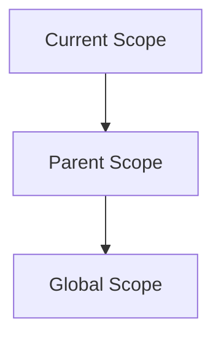
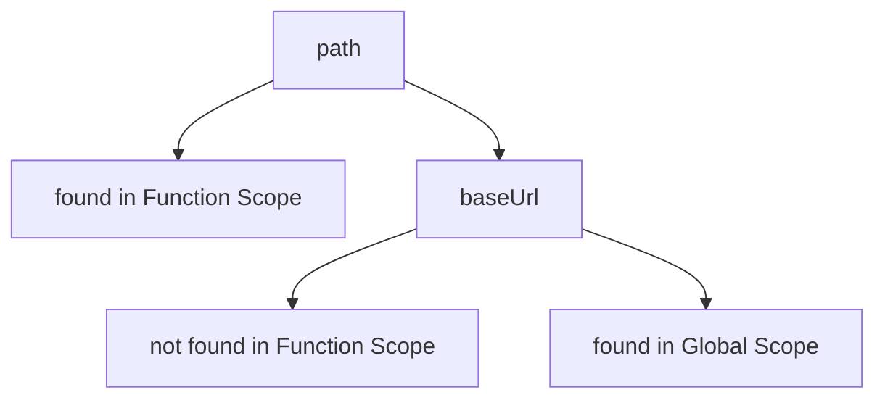
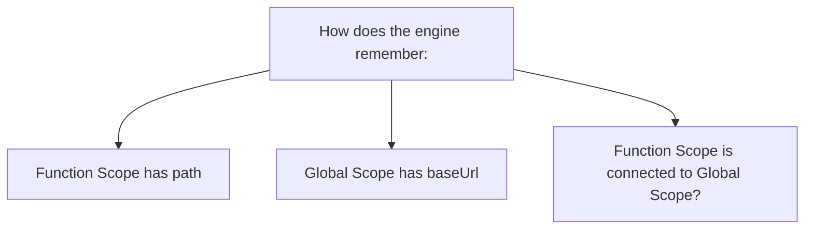
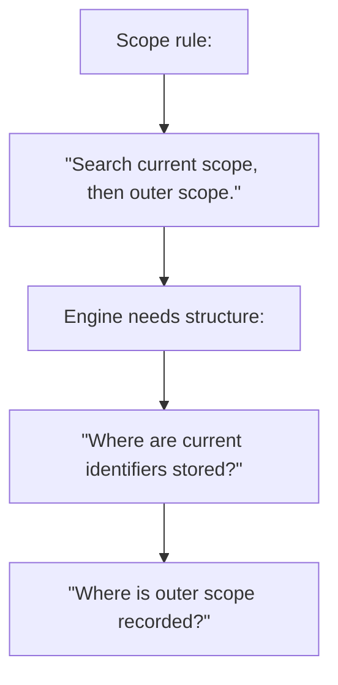
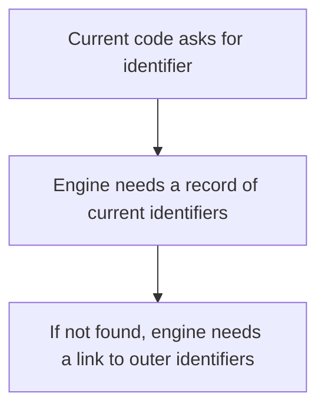
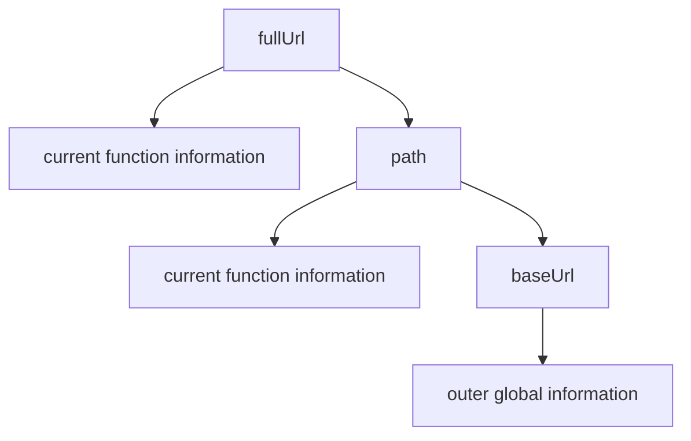
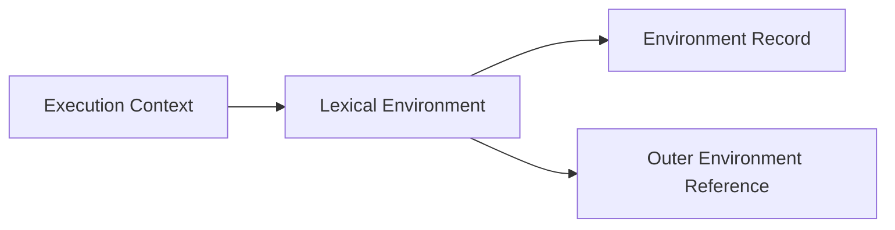

# Лексическое окружение

## Связь с предыдущей главой

Предыдущая глава объяснила Scope:

```text
Variables answer:
"How do names appear?"

Scope answers:
"Where are those names visible?"
```

Мы уже умеем мысленно выполнять поиск:


```mermaid
flowchart TD
    N1["Current Scope"]
    N2["Parent Scope"]
    N3["Global Scope"]
    N1 --> N2
    N2 --> N3
```

Теперь появляется следующий вопрос:

> Как JavaScript Engine internally remembers, какие identifiers принадлежат какому Scope?

Scope объясняет правила. Но rules должны где-то храниться во время выполнения. Engine должен помнить:

* какие identifiers есть в current scope;
* какие значения доступны через эти identifiers;
* куда идти дальше, если identifier не найден;
* как связать function scope с outer scope;
* почему helper-local identifiers остаются isolated.

Эта глава вводит Lexical Environment — концептуальную внутреннюю структуру, с помощью которой engine реализует Scope и identifier lookup.

Важно: это не глава по спецификации ECMAScript. Мы не будем превращать Lexical Environment в набор формальных алгоритмов. Цель — построить mental model, достаточную для понимания Hoisting, TDZ, Closures и debugging. Эти темы будут изучаться позже.

---

## Предварительные требования

Для этой главы нужно понимать:

* что Execution Context является рабочей средой выполнения;
* что Call Stack управляет active Execution Contexts;
* что Memory хранит information during execution;
* что Variables создают named access к stored information;
* что Scope определяет, где identifiers visible;
* что Scope Chain — conceptual path поиска identifiers outward.

Не требуется знать Hoisting mechanics, Temporal Dead Zone internals, Closures, `this`, modules или optimization details. Эти темы будут изучаться в отдельных главах.

---

## Время изучения

Ориентировочное время:

```text
Чтение главы:            100-130 минут
Разбор схем:              45-60 минут
Запуск примеров:          25-35 минут
Практика:                 90-120 минут
Повторение материала:     30 минут
```

Уровень сложности: **L3**.

L3 означает фундаментальный уровень: глава объясняет внутреннюю структуру, которая делает Scope работающим. Это один из мостов к Hoisting, TDZ и Closures.

---

## Навигация

Предыдущая глава:

```text
docs/01-javascript/07-scope.md
```

Следующая глава:

```text
docs/01-javascript/09-hoisting.md
```

Следующая глава объяснит Hoisting: почему declarations учитываются до выполнения строк и как это связано с подготовкой Lexical Environment.

---

## Цели обучения

После изучения этой главы вы будете понимать:

* зачем Scope нужен внутренний механизм;
* что такое Lexical Environment на концептуальном уровне;
* что такое Environment Record;
* что такое Outer Environment Reference;
* как linked environments реализуют Scope Chain;
* как Lexical Environment связан со Scope;
* как Lexical Environment связан с Execution Context;
* как Lexical Environment связан с Variables;
* как Lexical Environment связан с Memory;
* как Lexical Environment связан с Call Stack;
* как identifier lookup conceptually использует Lexical Environment;
* почему helper-local identifiers остаются isolated;
* как эта модель помогает debugging в Automation QA.

---

## Мотивация

Начнем с уже знакомого поведения.

```javascript
const baseUrl = 'https://example.com';

function printLoginUrl() {
  const path = '/login';

  console.log(baseUrl + path);
}

printLoginUrl();
```

Результат:

```text
https://example.com/login
```

Из главы про Scope мы знаем:


```mermaid
flowchart TD
    N1["path"]
    N2["found in Function Scope"]
    N3["baseUrl"]
    N4["not found in Function Scope"]
    N5["found in Global Scope"]
    N1 --> N2
    N1 --> N3
    N3 --> N4
    N3 --> N5
```

Теперь вопрос глубже:


```mermaid
flowchart TD
    N1["How does the engine remember:"]
    N2["Function Scope has path"]
    N3["Global Scope has baseUrl"]
    N4["Function Scope is connected to Global Scope?"]
    N1 --> N2
    N1 --> N3
    N1 --> N4
```

Если представить Scope только как правило, модель неполная. Правило должно быть реализовано какой-то внутренней структурой.


```mermaid
flowchart TD
    N1["Scope rule:"]
    N2["&quot;Search current scope, then outer scope.&quot;"]
    N3["Engine needs structure:"]
    N4["&quot;Where are current identifiers stored?&quot;"]
    N5["&quot;Where is outer scope recorded?&quot;"]
    N2 --> N3
    N1 --> N2
    N3 --> N4
    N4 --> N5
```

Главный вопрос главы:

> Какая структура внутри engine используется прямо сейчас?

---

## Теория

### Почему области видимости нужен внутренний механизм

Область видимости говорит:

```text
Identifier visible here.
Identifier not visible there.
```

Но движок не может работать с абстрактным словом «видимость». Во время выполнения ему нужна конкретная внутренняя организация:


```mermaid
flowchart TD
    N1["Current code asks for identifier"]
    N2["Engine needs a record of current identifiers"]
    N3["If not found, engine needs a link to outer identifiers"]
    N1 --> N2
    N2 --> N3
```

Без такой структуры движок не смог бы ответить:

* есть ли `path` в текущей функции;
* где искать `baseUrl`;
* почему `userName` из вспомогательной функции не видим снаружи;
* какой `status` использовать при перекрытии.

Нужна структура, которая хранит имена текущей области и знает, где находится внешнее окружение.

### Наблюдаемое поведение перед термином

Рассмотрим код:

```javascript
const baseUrl = 'https://example.com';

function buildLoginUrl() {
  const path = '/login';
  const fullUrl = baseUrl + path;

  console.log(fullUrl);
}

buildLoginUrl();
```

Во время вычисления `fullUrl` движок должен выполнить поиск:


```mermaid
flowchart TD
    N1["fullUrl"]
    N2["current function information"]
    N3["path"]
    N4["current function information"]
    N5["baseUrl"]
    N6["outer global information"]
    N1 --> N2
    N1 --> N3
    N3 --> N4
    N3 --> N5
    N5 --> N6
```

Значит, для выполнения функции движку нужен не только код и кадр стека. Ему нужна таблица локальных имён и ссылка наружу.

### Что такое лексическое окружение

Теперь можно ввести термин.

Лексическое окружение — концептуальная внутренняя структура, которая хранит имена текущей области и ссылку на внешнее окружение.

Коротко: у окружения две части — запись имён текущей области и ссылка на
внешнее окружение.

```text
Лексическое окружение
 ├─ запись окружения      имена и их значения в этой области
 └─ ссылка на внешнее     где искать, если имени здесь нет
```

Главная модель:

```text
Область видимости объясняет ПРАВИЛА.
Лексическое окружение — внутренняя структура,
которая позволяет движку эти правила выполнять.
```

Что движок делает прямо сейчас:

```text
движок использует текущее лексическое окружение
движок проверяет его запись имён
если имени нет — движок идёт по ссылке на внешнее окружение
```

### Запись окружения

Запись окружения — часть лексического окружения, где хранятся записи об именах текущей области.

Для кода верхнего уровня:

```javascript
const baseUrl = 'https://example.com';
const testName = 'login';
```

Концептуально запись окружения содержит два имени:

```text
запись окружения (верхний уровень)
 ├─ baseUrl  ──→ 'https://example.com'
 └─ testName ──→ 'login'
```

Для функции:

```javascript
function buildLoginUrl() {
  const path = '/login';
}
```

Концептуально у вызова функции появляется своё окружение, и оно ссылается на
внешнее:

```text
окружение вызова buildLoginUrl
 ├─ path ──→ '/login'
 └─ ссылка на внешнее ──→ окружение верхнего уровня (baseUrl, testName)
```

Запись окружения — это не «объект, который можно вывести в консоль». Это концептуальная модель внутренних записей.

### Ссылка на внешнее окружение

Ссылка на внешнее окружение — связь из текущего лексического окружения с внешним.

Для глобального окружения внешняя ссылка обычно указывает на отсутствие внешнего окружения:

```text
Global Environment
├── Environment Record: baseUrl, browserName
└── Outer ──→ null
```

`null` здесь означает «дальше искать негде»: именно на этом месте поиск имени
и заканчивается ошибкой `ReferenceError`.

Это и есть внутренняя основа поиска наружу.

### Связанные окружения

Вложенные области видимости создают связанные окружения.

```javascript
const baseUrl = 'https://example.com';

function buildLoginUrl() {
  const path = '/login';

  if (true) {
    const fullUrl = baseUrl + path;

    console.log(fullUrl);
  }
}
```

```text
Environment блока
├── Environment Record: fullUrl
└── Outer ──→ Environment функции buildLoginUrl
              ├── Environment Record: path
              └── Outer ──→ Global Environment
                            ├── Environment Record: baseUrl
                            └── Outer ──→ null
```

Это связанные папки:

```text
каждая папка хранит только свои записи
и помнит одну ссылку — на папку, в которой лежит сама
```

Цепочка областей видимости из предыдущей главы теперь получает внутреннюю основу:

```text
«поиск идёт наружу»  =  переход по Outer-ссылке от environment к environment
«имя не найдено»     =  дошли до Outer ──→ null
```

### Связь с областью видимости

Область видимости — правило видимости. Лексическое окружение — структура, которая позволяет это правило выполнять.

Пример:

```javascript
const baseUrl = 'https://example.com';

function printBaseUrl() {
  console.log(baseUrl);
}
```

Объяснение области видимости:

```text
Function can access outer global identifier.
```

Объяснение через лексическое окружение:

```text
Environment функции printBaseUrl не содержит записи baseUrl,
поэтому engine переходит по Outer-ссылке в Global Environment
и находит запись там.
```

### Связь с контекстом выполнения

Контекст выполнения — рабочая среда. Лексическое окружение — важная часть этой среды, связанная с именами и их поиском.

Для выполнения верхнего уровня:

```text
Global Execution Context
└── Lexical Environment: записи глобальных имён, Outer ──→ null
```

Для выполнения функции:

```text
Function Execution Context (создаётся на каждый вызов)
└── Lexical Environment: записи имён вызова, Outer ──→ environment,
    в котором функция была объявлена
```

Что движок делает прямо сейчас:

```text
1. выполняет код верхнего Execution Context
2. встречая имя, смотрит в Lexical Environment этого context
3. не нашёл — идёт по Outer-ссылке дальше
```

### Связь с переменными

Переменные создают имена. Лексическое окружение хранит записи об этих именах.

```javascript
const userName = 'Anna';
let status = 'created';
```

Концептуально создаются две записи: одна связана со строкой `'Anna'`, другая — со
строкой `'created'`.

```text
запись окружения
 ├─ userName ──→ [ 'Anna' ]
 └─ status   ──→ [ 'created' ]
```

При повторном присваивании:

```javascript
status = 'ready';
```

```text
запись найдена в Environment Record  →  значение заменено
status  ──→  [ 'ready' ]
```

У `const`, `let` и `var` разные правила регистрации и доступа. Подъём объявлений и временная мёртвая зона объяснят часть этих различий позже.

### Связь с памятью

Память хранит информацию. Лексическое окружение хранит записи об именованном доступе к этой информации.

```text
Environment Record        Memory
   userName        ──→    [ 'Anna' ]
   baseUrl         ──→    [ 'https://example.test' ]
```

Это не физическая карта памяти. Это концептуальная связь: лексическое окружение помогает движку понять, какое имя к какой сохранённой информации относится.

### Связь со стеком вызовов

Стек вызовов показывает активный контекст выполнения.

У каждого такого контекста есть своё лексическое окружение.

Что важно:

Это разные механизмы, но они работают вместе во время выполнения.

### Поиск имени через лексическое окружение

Рассмотрим код:

```javascript
const baseUrl = 'https://example.com';

function buildLoginUrl() {
  const path = '/login';
  const fullUrl = baseUrl + path;

  console.log(fullUrl);
}
```

Поиск `fullUrl`:

```text
Environment функции buildLoginUrl — запись найдена
```

Поиск `path`:

```text
Environment функции buildLoginUrl — запись найдена
```

Поиск `baseUrl`:

```text
Environment функции buildLoginUrl — записи нет
Outer ──→ Global Environment       — запись найдена
```

Полный процесс поиска:

```text
1. взять Lexical Environment текущего Execution Context
2. поискать имя в его Environment Record
3. нашли — использовать значение, поиск закончен
4. не нашли — перейти по Outer-ссылке и вернуться к шагу 2
5. Outer равен null — ReferenceError
```

### Вложенные окружения

Вложенные функции и блоки добавляют новые окружения.

```javascript
const baseUrl = 'https://example.com';

function testLogin() {
  const userName = 'qa-user';

  if (true) {
    const expectedStatus = 'active';

    console.log(baseUrl);
    console.log(userName);
    console.log(expectedStatus);
  }
}
```

```text
inner Environment   → expectedStatus
   ↓ Outer
outer Environment   → userName
   ↓ Outer
Global Environment  → всё остальное
```

Это и есть цепочка записей:

```text
expectedStatus  →  найдено в environment блока
userName        →  найдено на шаг наружу, в environment функции
baseUrl         →  найдено на два шага наружу, в global environment
```

Окружение блока не «копирует» внешние имена — оно просто умеет до них дойти.

### Текущее место главы в модели JavaScript


```mermaid
flowchart LR
    N1["Execution Context"]
    N2["Lexical Environment"]
    N3["Environment Record"]
    N4["Outer Environment Reference"]
    N1 --> N2
    N2 --> N3
    N2 --> N4
```

Цепочка курса:

```text
Memory              — программе нужно где-то хранить значения
Variables           — у значений появляются имена
Scope               — правило, какие имена видны
Lexical Environment — структура, благодаря которой это правило выполнимо
```

### Переход к подъёму объявлений

Следующий вопрос:

> Если запись окружения хранит имена, когда эти записи появляются?

Этот вопрос ведёт к подъёму объявлений.

Подъём объявлений — поведение, связанное с тем, как объявления учитываются во время подготовки к выполнению. В следующей главе мы увидим, что часть «магии» становится понятнее, если помнить про фазу подготовки и лексическое окружение.

---

## Внутренний механизм

Поиск имени всегда идёт одним и тем же путём:

```text
1. проверить запись ТЕКУЩЕГО окружения        → нашли: вернуть значение
2. не нашли → перейти по ссылке на внешнее    → повторить шаг 1
3. внешнего окружения больше нет              → ReferenceError
```

Отсюда следуют оба наблюдаемых поведения главы.

Перекрытие: поиск останавливается на первом найденном имени, поэтому внутреннее
имя «закрывает» внешнее — внешнее при этом не изменяется и не исчезает.

```text
внутреннее окружение │ baseUrl = 'https://staging.example.com'  ← нашли здесь
внешнее окружение    │ baseUrl = 'https://example.com'          ← не читали
```

Отсутствующее имя: цепочка заканчивается, и вернуть нечего.

`ReferenceError` — ошибка времени выполнения при обращении к имени, которое не найдено в доступных окружениях. Обработка ошибок будет изучаться позже.

---

## Ментальная модель

### Офис с папками

Представьте офис, где у каждой области видимости есть своя папка.

В каждой папке лежит список имён.

### Список имён

Запись окружения — список имён текущей папки.

### Связанные папки

Ссылка на внешнее окружение — связь с внешней папкой.

### Адресная книга

Лексическое окружение похоже на записную книжку:

Если записи нет в текущей книжке, движок открывает книжку уровнем выше.

### Цепочка записей

Поиск идёт по цепочке записей.

Итоговая модель:

```text
Environment функции    →  свои имена
        ↑ outer
Environment модуля     →  свои имена
        ↑ outer
Глобальное environment →  свои имена
        ↑ outer
      null                (конец цепочки)
```

Поиск идёт снизу вверх и останавливается на первой записи, где имя нашлось.
Дойдя до `null`, движок сообщает `ReferenceError`.

---

## Примеры кода

Примеры к этой главе находятся в папке:

```text
examples/01-javascript/chapter-08/
```

Запускайте их из корня проекта.

### Пример 1. Глобальное окружение

Файл:

```text
examples/01-javascript/chapter-08/01-global-environment.js
```

Показывает имена, которые концептуально попадают в запись глобального окружения.

### Пример 2. Окружение функции

Файл:

```text
examples/01-javascript/chapter-08/02-function-environment.js
```

Показывает запись окружения, локальную для функции.

### Пример 3. Вложенные окружения

Файл:

```text
examples/01-javascript/chapter-08/03-nested-environments.js
```

Показывает связанные окружения: глобальное → функции → блока.

### Пример 4. Запись окружения

Файл:

```text
examples/01-javascript/chapter-08/04-environment-record.js
```

Показывает, какие имена функция использует из своей записи.

### Пример 5. Поиск имени

Файл:

```text
examples/01-javascript/chapter-08/05-lookup.js
```

Показывает поиск локального имени и внешнего имени.

### Пример 6. Типичные ошибки

Файл:

```text
examples/01-javascript/chapter-08/06-common-mistakes.js
```

Показывает типичные ошибки через безопасные закомментированные строки.

---

## Частые вопросы

### Лексическое окружение и область видимости — одно и то же?

Нет. Область видимости — правила видимости. Лексическое окружение — внутренняя структура, которая позволяет движку эти правила выполнять.

### Можно ли увидеть лексическое окружение в коде?

Напрямую нет. Это внутренняя структура движка. Мы строим концептуальную модель, чтобы объяснять поведение JavaScript.

### Запись окружения — это обычный объект?

Нет. Это не обычный объект JavaScript, с которым можно работать в коде. Это учебная модель внутренних записей об именах.

### Ссылка на внешнее окружение — это ссылка из главы про объекты?

Нет. Здесь слово «ссылка» означает связь с внешним окружением во внутренней концептуальной модели. Ссылки на объекты будут изучаться отдельно.

### Почему не изучаем подъём объявлений сразу?

Потому что сначала нужно понять, где имена хранятся концептуально. Подъём объявлений объяснит, когда записи появляются и как объявления влияют на них до выполнения.

---

## Распространённые мифы

### Миф 1. Цепочка областей видимости существует только в голове программиста

Реальность:

Цепочка областей — концептуальный взгляд, но за ним стоит внутренняя структура связанных лексических окружений.

### Миф 2. Локальные переменные функции исчезают из-за стека вызовов

Реальность:

Стек вызовов управляет активными контекстами. Видимость имён объясняется лексическим окружением и областью видимости.

### Миф 3. Движок ищет имя во всех функциях

Реальность:

Движок смотрит текущую запись окружения и дальше идёт по ссылке наружу.

### Миф 4. Лексическое окружение нужно знать как спецификацию

Реальность:

Для курса важна мысленная модель: запись имён плюс ссылка наружу. Формальные детали спецификации на этом этапе не нужны.

---

## Распространённые ошибки

### Ошибка 1. Путать запись окружения и память

Неправильная модель:

```text
Environment Record is all memory.
```

Что произошло:

Запись окружения хранит записи об именах. Модель памяти шире и связана с хранением информации во время выполнения.

Исправленная модель: запись окружения хранит записи об именах, а память хранит сами значения. Это два разных уровня одной модели.

### Ошибка 2. Путать ссылку на внешнее окружение и стек вызовов

Неправильная модель:

```text
Outer link follows the вызывающий код.
```

Что произошло:

Ссылка на внешнее окружение связана с вложенностью кода, а не просто с тем, кто вызвал функцию. Подробности замыканий будут изучаться позже.

Исправленная модель: ссылка на внешнее окружение определяется тем, где функция написана, а стек вызовов — тем, кто её вызвал. Совпадать они не обязаны.

### Ошибка 3. Объяснять поиск перебором всего файла

Неправильная модель:

```text
Engine scans the whole file for matching name.
```

Исправленная модель: поиск идёт по цепочке окружений от текущего к внешним и останавливается на первом найденном имени — файл целиком не просматривается.

### Ошибка 4. Углубляться в TDZ раньше времени

Что произошло:

Читатель пытается объяснить все особенности `let` и `const` через временную мёртвую зону до изучения подъёма объявлений.

Исправленная модель:

```text
First:
Lexical Environment stores identifier records.

Next:
Hoisting and TDZ explain timing and access restrictions.
```

---

## Практическое использование

При чтении кода задавайте вопросы:

```text
1. What is the current Lexical Environment?
2. What identifiers are in its Environment Record?
3. What is the Outer Environment Reference?
4. Where will lookup go if identifier is not local?
5. Where will lookup stop?
```

Таблица анализа:

| Вопрос | Что смотреть |
| --- | --- |
| какое окружение активно? | текущий контекст выполнения |
| какие имена в нём есть? | запись окружения |
| куда пойдёт поиск дальше? | ссылка на внешнее окружение |
| где поиск остановится? | глобальное окружение |

Мини-чек-лист:

```text
✓ Я отличаю Scope от Lexical Environment.
✓ Я вижу Environment Record текущей области.
✓ Я понимаю Outer Environment Reference.
✓ Я могу пройти lookup outward.
✓ Я не путаю lookup с Call Stack.
```

---

## Использование в Automation QA

### Локальные имена вспомогательной функции остаются изолированными

Локальные имена вспомогательной функции находятся в окружении её вызова.

```javascript
function buildUserName() {
  const prefix = 'qa';
  const userName = prefix + '-user';

  return userName;
}
```

```text
Environment функции
├── userName   (локальное)
└── Outer ──→ Environment модуля
              └── prefix
```

Тест не должен обращаться к `prefix`, потому что его нет ни в одном доступном тесту окружении.

### Вложенные вызовы по-прежнему видят конфигурацию

Конфигурация может быть постоянным глобальным значением:

```javascript
const baseUrl = 'https://example.com';

function buildLoginUrl() {
  const path = '/login';

  return baseUrl + path;
}
```

Поиск:

Так вложенная вспомогательная функция может читать конфигурацию, не передавая её через общее изменяемое состояние.

### Поиск имён при разборе падения

Когда тест падает из-за неправильного имени или неожиданного значения, полезно разделять:

Трассировка стека показывает цепочку вызовов. Лексическое окружение помогает понять, какой именно `status`, `baseUrl` или `userName` нашёл поиск.

### Чтение трассировки стека вместе с областями видимости

Трассировка стека в Playwright может привести во вспомогательную функцию — она
показывает, **кто кого вызвал**:

```text
at buildUrl (helpers/url.ts:12)
at openOrders (pages/orders.ts:31)
at тест «открывает список» (tests/orders.spec.ts:8)
```

Но вопрос «какое значение прочитала функция?» трассировка не решает: в ней нет
имён и значений, только вызовы. На него отвечает модель окружений — по месту
объявления функции видно, откуда она брала `baseUrl`.

Для разбора падения нужно смотреть оба слоя:

| Слой | Что показывает | Чем отвечает на вопрос |
| --- | --- | --- |
| Трассировка стека | какие вызовы шли друг за другом | где произошло |
| Цепочка окружений | какие имена были видны в этом месте | почему прочиталось именно это значение |

Трассировка приводит в нужную функцию, а цепочка окружений объясняет, откуда
она взяла значение. Одного слоя не хватает: вспомогательная функция может быть
верной, а прочитать не ту переменную.

---

## Итоги

Область видимости объясняет правила видимости. Лексическое окружение объясняет внутреннюю структуру за этими правилами.

Главная модель: у каждого окружения есть собственные записи об именах и ссылка на внешнее окружение — этой пары достаточно, чтобы объяснить любой поиск идентификатора.

Поиск имени концептуально идёт так:

Контекст выполнения использует лексическое окружение для разрешения имён. Стек вызовов показывает активный контекст, но не заменяет поиск по окружениям. Переменные создают имена, записи окружения хранят записи об этих именах, а память хранит информацию, с которой программа работает.

Следующая глава объяснит подъём объявлений: как объявления влияют на записи окружения до того, как выполнение дойдёт до соответствующей строки.

---

## Что нужно запомнить

✓ Область видимости объясняет правила видимости имён.

✓ Лексическое окружение — внутренняя структура, реализующая эти правила.

✓ Запись окружения хранит записи об именах текущей области.

✓ Ссылка на внешнее окружение связывает текущее окружение с внешним.

✓ Связанные лексические окружения реализуют цепочку областей видимости.

✓ Поиск имени сначала смотрит текущую запись окружения.

✓ Если имя не найдено, поиск идёт по ссылке на внешнее окружение.

✓ Стек вызовов и лексическое окружение отвечают на разные вопросы.

✓ Лексическое окружение помогает позже понять подъём объявлений, временную мёртвую зону и замыкания.

✓ Следующая тема — подъём объявлений.

---

## Проверьте себя

1. Почему области видимости нужен внутренний механизм?

2. Что такое лексическое окружение?

3. Что хранит запись окружения?

4. Зачем нужна ссылка на внешнее окружение?

5. Как связанные окружения соотносятся с цепочкой областей видимости?

6. Как лексическое окружение связано с контекстом выполнения?

7. Как лексическое окружение связано с переменными?

8. Чем лексическое окружение отличается от памяти?

9. Почему стек вызовов не объясняет поиск имени?

10. Как лексическое окружение подготавливает понимание подъёма объявлений?

### Ответы

1. Область видимости — это правило. Чтобы движок мог его выполнять, нужна структура, в которой действительно хранятся имена и связь с внешней областью.
2. Внутренняя структура, сопоставленная участку кода: в ней лежат записи об именах этого участка и ссылка на внешнее окружение.
3. Записи об именах, объявленных в этом участке: само имя, его значение и состояние — инициализировано оно или ещё нет.
4. Он связывает окружение с тем, внутри которого оно создано. По этой ссылке и идёт поиск наружу.
5. Связанные окружения — это и есть цепочка областей видимости изнутри. «Поиск идёт наружу» означает переход по внешним ссылкам от окружения к окружению.
6. Лексическое окружение — часть контекста выполнения, отвечающая за имена. Контекст создаётся на вызов, вместе с ним создаётся и окружение.
7. Переменные создают имена, окружение хранит записи об этих именах. Объявление переменной — это появление записи в окружении.
8. Память — общая модель хранения значений. Лексическое окружение отвечает уже на другой вопрос: по каким именам и откуда эти значения доступны.
9. Стек показывает, какой вызов активен сейчас, но не хранит связь с местом объявления функции. Поиск имён идёт по внешним ссылкам, а они задаются тем, где функция написана, а не тем, откуда вызвана.
10. Если имена хранятся в записях, естественно возникает вопрос, когда эти записи появляются. Ответ — до выполнения первой строки, и это и есть подъём.

---

## Практика

Практика к этой главе находится в файле:

```text
practice/01-javascript/08-lexical-environment.md
```

Перед практикой запустите примеры из раздела «Примеры кода» и для каждого имени составьте путь поиска.

---

## Решения

Решения находятся в файле:

```text
solutions/01-javascript/08-lexical-environment.md
```

Открывайте решения после самостоятельной попытки. В этой главе важно сравнивать не только результат выполнения, но и путь по записям окружения и внешним ссылкам.
