# Hoisting

## Связь с предыдущей главой

Предыдущая глава объяснила Lexical Environment:

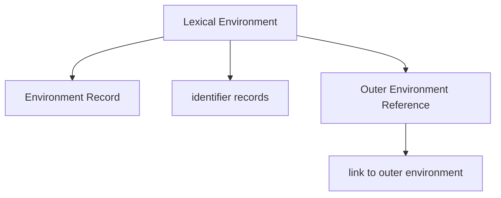

Теперь появляется следующий вопрос:

> Если Environment Record хранит identifiers, когда эти records появляются?

В главах про Execution Context и Lexical Environment уже была важная идея:

```text
Execution does not start immediately.
Before execution, engine prepares the environment.
```

Эта глава объясняет Hoisting как observable result этой подготовки.

Главная мысль:

```text
Hoisting is NOT moving code.

Hoisting is the observable result
of the engine preparing declarations
during the Creation Phase.
```

Source code не меняет position. Engine не берет строки и не переносит их вверх. Вместо этого до выполнения строк engine подготавливает records в Lexical Environment.

---

## Предварительные требования

Для этой главы нужно понимать:

* что JavaScript file проходит preparation перед execution;
* что Execution Context имеет Creation Phase и Execution Phase;
* что Lexical Environment хранит identifier records;
* что Variables создают identifiers;
* что `var`, `let`, `const` и function declaration создают разные виды declarations;
* что Scope определяет visibility identifiers.

Не требуется знать Temporal Dead Zone internals, Closures, modules, `this` или детали спецификации ECMAScript. TDZ будет объяснен в следующей главе; сейчас мы упомянем его только как причину поведения `let` и `const` до initialization.

---

## Время изучения

Ориентировочное время:

```text
Чтение главы:            110-140 минут
Разбор схем:              50-70 минут
Запуск примеров:          25-35 минут
Практика:                 90-120 минут
Повторение материала:     30 минут
```

Уровень сложности: **L3**.

L3 означает фундаментальный уровень: Hoisting часто объясняют как "поднятие кода", но эта глава заменяет миф внутренней моделью Creation Phase и Lexical Environment.

---

## Навигация

Предыдущая глава:

```text
docs/01-javascript/08-lexical-environment.md
```

Следующая глава:

```text
docs/01-javascript/10-temporal-dead-zone.md
```

Следующая глава объяснит Temporal Dead Zone: почему `let` и `const` registered during Creation Phase, но доступ к ним до initialization ведет себя иначе, чем `var`.

---

## Цели обучения

После изучения этой главы вы будете понимать:

* почему Hoisting существует;
* какое поведение наблюдает программист;
* что engine actually делает до execution;
* как Creation Phase связана с Hoisting;
* как регистрируются function declarations;
* как регистрируется `var`;
* как регистрируются `let` и `const`;
* чем declaration отличается от initialization;
* почему functions behave differently;
* почему source code никогда не moves upward;
* как читать legacy JavaScript без мифа про "перенос строк";
* как Hoisting связан с Lexical Environment;
* почему следующая тема — TDZ.

---

## Мотивация

Начнем с кода, который удивляет многих.

```javascript
console.log(userName);

var userName = 'Anna';
```

Результат:

```text
undefined
```

Если думать, что JavaScript просто выполняет строки сверху вниз, возникает вопрос:

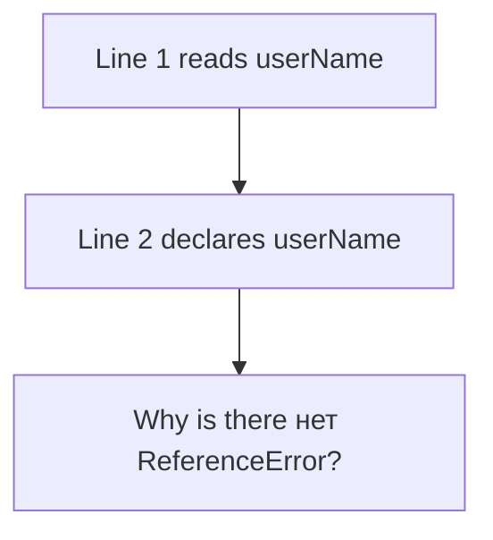

Теперь похожий пример:

```javascript
// console.log(userRole);

let userRole = 'admin';
```

Если раскомментировать первую строку, код не выведет `undefined`. Он упадет с ошибкой доступа до initialization. Подробности Temporal Dead Zone будут в следующей главе; сейчас важен факт:

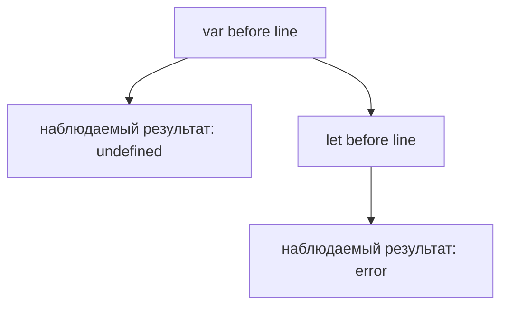

Еще один пример:

```javascript
printStatus();

function printStatus() {
  console.log('ready');
}
```

Результат:

```text
ready
```

Функцию можно вызвать до строки объявления.

Значит, разные declarations влияют на выполнение до того, как engine доходит до их строки. Но source code не двигается.

Главный вопрос главы:

> Что engine подготовил до начала execution?

---

## Теория

### Проблема мифа "код поднимается вверх"

Популярное объяснение:

```text
JavaScript moves declarations to the top.
```

Это удобная, но опасная фраза.

Она создает неправильную картину:

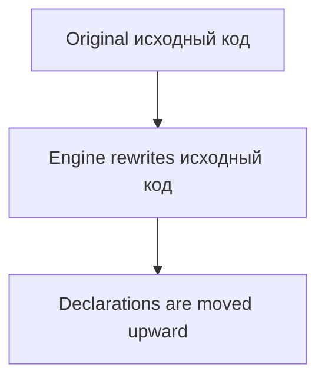

Так думать не нужно.

Правильная модель:

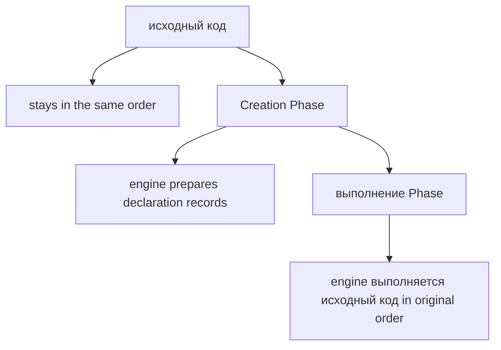

Диаграмма Source Code:

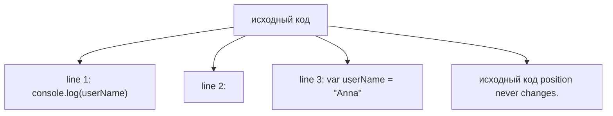

Hoisting — это не перемещение. Hoisting — это наблюдаемое поведение после подготовки.

### Что программист наблюдает

Программист видит три разных поведения.

Function Declaration:

```javascript
printStatus();

function printStatus() {
  console.log('ready');
}
```

Работает.

`var`:

```javascript
console.log(status);

var status = 'ready';
```

Выводит:

```text
undefined
```

`let` / `const`:

```javascript
// console.log(status);

let status = 'ready';
```

До строки initialization access fails. TDZ explains why; следующая глава будет полностью об этом.

Вопрос:

```text
Why does function declaration work?
Why does var produce undefined?
Why do let/const fail before initialization?
```

Ответ начинается в Creation Phase.

### Creation Phase revisited

Execution Context создается в два крупных шага:

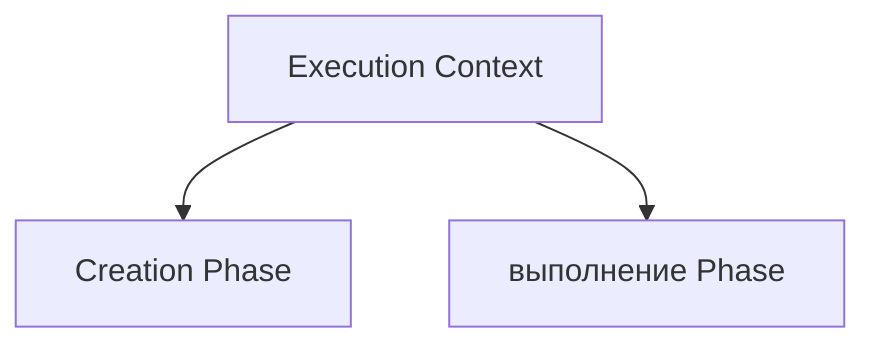

Creation Phase:

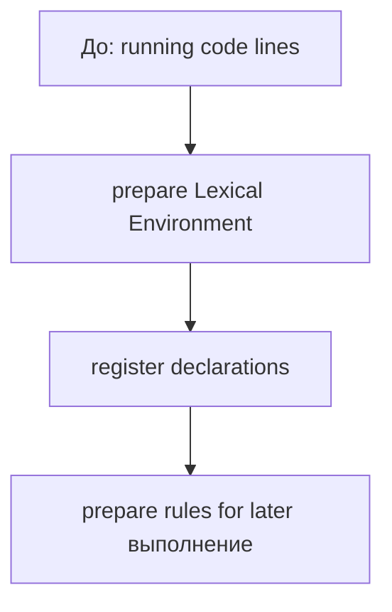

Execution Phase:

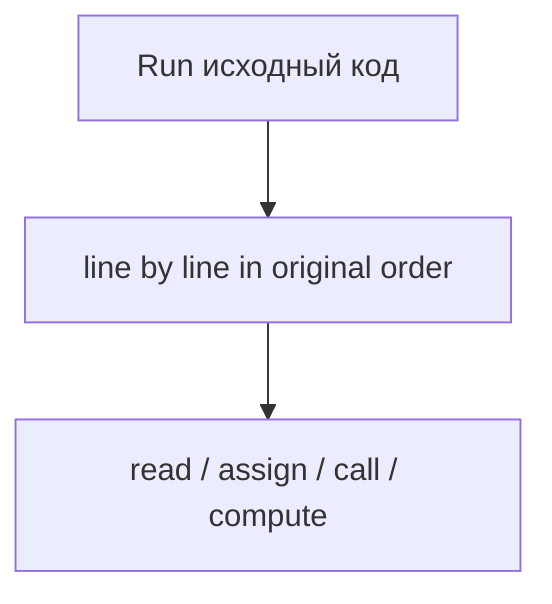

Диаграмма Creation Phase:

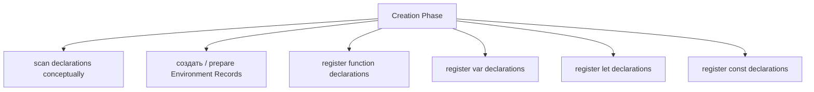

Диаграмма Execution Phase:

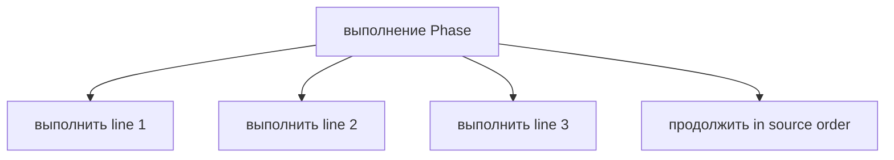

Что engine подготовил до execution:

```text
Identifier records.
Initial access behavior.
Function declaration bindings.
var bindings with undefined.
let/const bindings not initialized yet.
```

### Lexical Environment before execution

Во время Creation Phase engine подготавливает Lexical Environment.

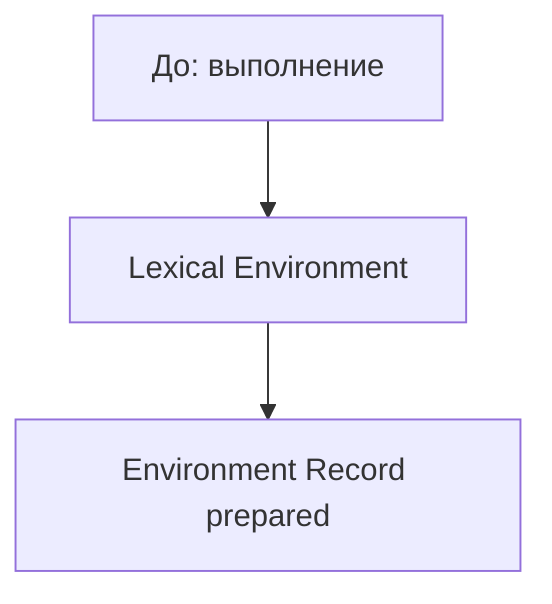

Environment Record до выполнения:

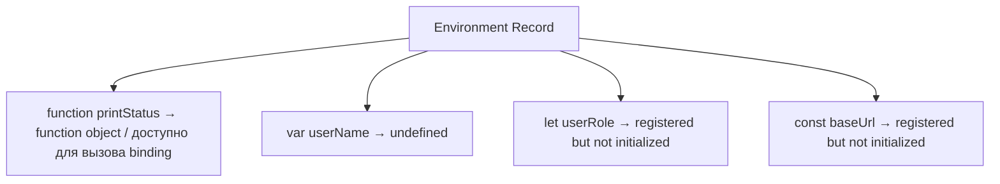

Это conceptual diagram, не спецификация.

Важно:

```text
Registration happens before execution.
Initialization may happen later during execution.
```

### Function Declaration registration

Function declaration регистрируется во время Creation Phase так, что function can be called before its line.

```javascript
printStatus();

function printStatus() {
  console.log('ready');
}
```

Creation Phase:

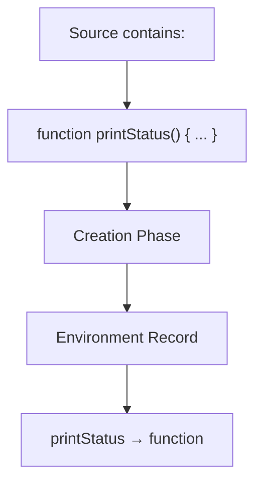

Execution Phase:

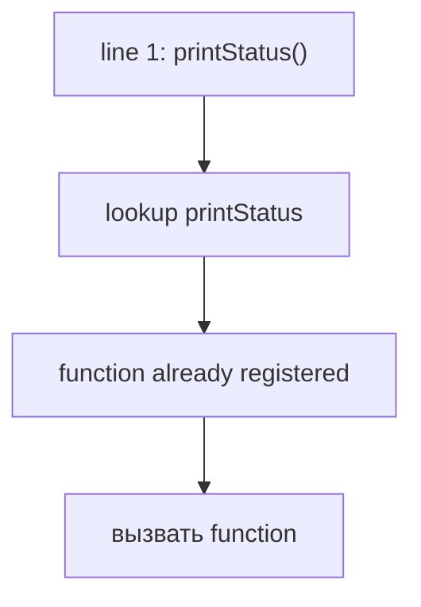

Диаграмма Function Declaration registration:

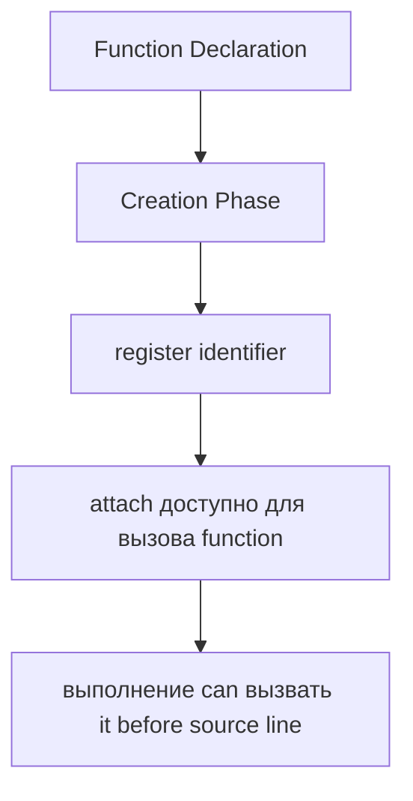

Что engine подготовил до execution:

```text
Identifier printStatus.
Callable function binding.
```

### var registration

`var` declaration тоже учитывается во время Creation Phase.

```javascript
console.log(userName);

var userName = 'Anna';
```

Creation Phase:

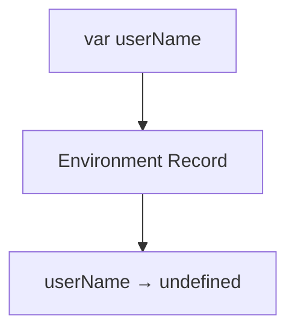

Execution Phase:

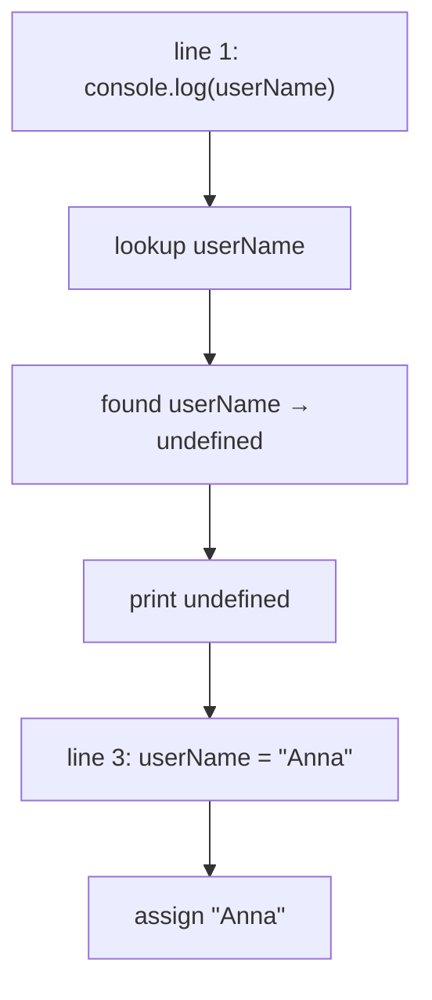

Диаграмма var registration:

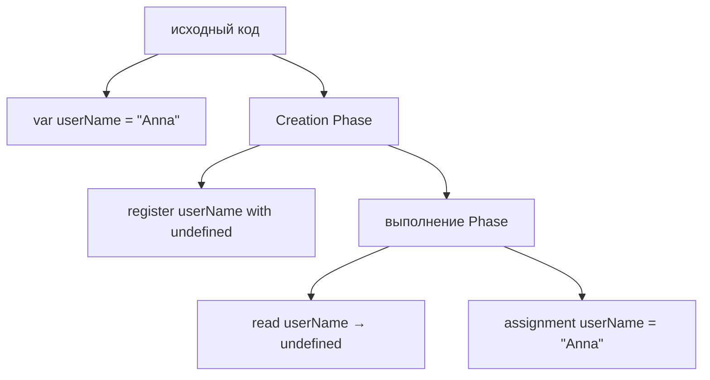

Здесь важно разделить declaration and initialization.

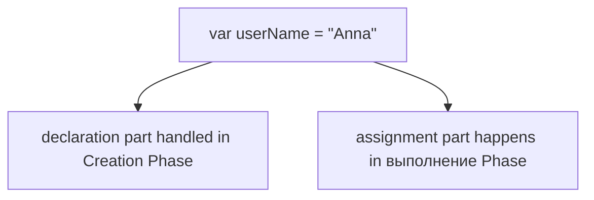

### let registration

`let` declaration тоже регистрируется во время Creation Phase, но не behaves like `var`.

```javascript
// console.log(userRole);

let userRole = 'admin';
```

Creation Phase:

```mermaid
flowchart TD
    N1["let userRole"]
    N2["Environment Record"]
    N3["userRole → registered, not initialized"]
    N1 --> N2
    N2 --> N3
```

Execution Phase:

```mermaid
flowchart TD
    N1["before line: let userRole = &quot;admin&quot;"]
    N2["access userRole fails"]
    N3["line: let userRole = &quot;admin&quot;"]
    N4["initialize userRole with &quot;admin&quot;"]
    N1 --> N2
    N1 --> N3
    N3 --> N4
```

Диаграмма let registration:

```mermaid
flowchart TD
    N1["исходный код"]
    N2["let userRole = &quot;admin&quot;"]
    N3["Creation Phase"]
    N4["register userRole"]
    N5["выполнение Phase"]
    N6["before initialization: access fails"]
    N7["declaration line: initialize with &quot;admin&quot;"]
    N1 --> N2
    N1 --> N3
    N3 --> N4
    N3 --> N5
    N5 --> N6
    N5 --> N7
```

Подробный механизм TDZ будет в следующей главе. Сейчас нужно запомнить:

```text
let is registered during Creation Phase.
It is not initialized like var.
```

### const registration

`const` похож на `let` в том, что identifier is registered during Creation Phase, but not initialized until execution reaches declaration line.

```javascript
// console.log(baseUrl);

const baseUrl = 'https://example.com';
```

Creation Phase:

```mermaid
flowchart TD
    N1["const baseUrl"]
    N2["Environment Record"]
    N3["baseUrl → registered, not initialized"]
    N1 --> N2
    N2 --> N3
```

Execution Phase:

```mermaid
flowchart TD
    N1["line: const baseUrl = &quot;https://example.com&quot;"]
    N2["initialize baseUrl"]
    N3["disallow reassignment after initialization"]
    N1 --> N2
    N1 --> N3
```

Диаграмма const registration:

```mermaid
flowchart TD
    N1["исходный код"]
    N2["const baseUrl = &quot;https://example.com&quot;"]
    N3["Creation Phase"]
    N4["register baseUrl"]
    N5["выполнение Phase"]
    N6["initialize baseUrl when declaration line runs"]
    N1 --> N2
    N1 --> N3
    N3 --> N4
    N3 --> N5
    N5 --> N6
```

`const` must be initialized at declaration. Это уже было в главе Variables. Здесь важно другое: declaration record exists before execution, but usable value appears only at initialization line.

### Declaration vs initialization

Hoisting невозможно понять без разделения declaration и initialization.

```javascript
var userName = 'Anna';
```

Разделение:

```mermaid
flowchart TD
    N1["Declaration"]
    N2["var userName"]
    N3["Initialization / assignment"]
    N4["userName = &quot;Anna&quot;"]
    N1 --> N2
    N1 --> N3
    N3 --> N4
```

Диаграмма declaration vs initialization:

```mermaid
flowchart TD
    N1["Creation Phase"]
    N2["declaration affects Environment Record"]
    N3["выполнение Phase"]
    N4["initialization / assignment happens when line runs"]
    N1 --> N2
    N1 --> N3
    N3 --> N4
```

Для function declaration:

```mermaid
flowchart TD
    N1["Creation Phase"]
    N2["function identifier registered with доступно для вызова function"]
    N1 --> N2
```

Для `var`:

```mermaid
flowchart TD
    N1["Creation Phase"]
    N2["identifier registered with undefined"]
    N3["выполнение Phase"]
    N4["assignment happens on original line"]
    N1 --> N2
    N1 --> N3
    N3 --> N4
```

Для `let` / `const`:

```mermaid
flowchart TD
    N1["Creation Phase"]
    N2["identifier registered but not initialized"]
    N3["выполнение Phase"]
    N4["initialization happens on original line"]
    N1 --> N2
    N1 --> N3
    N3 --> N4
```

### Почему функции ведут себя иначе

Function declarations ведут себя иначе, потому что во время Creation Phase engine подготавливает для них вызываемый binding.

```javascript
runTest();

function runTest() {
  console.log('test started');
}
```

До выполнения:

```mermaid
flowchart TD
    N1["Environment Record"]
    N2["runTest → function"]
    N1 --> N2
```

Then line 1 can call `runTest`.

Это полезно, потому что function declarations описывают переиспользуемые действия:

```mermaid
flowchart TD
    N1["Function Declaration"]
    N2["complete доступно для вызова unit"]
    N1 --> N2
```

`var userName = 'Anna'` is different:

```mermaid
flowchart TD
    N1["var declaration"]
    N2["name can be prepared"]
    N3["assignment"]
    N4["значение появляется, когда выполнение доходит до строки"]
    N1 --> N2
    N1 --> N3
    N3 --> N4
```

So:

```mermaid
flowchart TD
    N1["Function declaration"]
    N2["доступно для вызова before line"]
    N3["var"]
    N4["exists before line, value is undefined"]
    N5["let / const"]
    N6["registered before line, unusable before initialization"]
    N1 --> N2
    N1 --> N3
    N3 --> N4
    N3 --> N5
    N5 --> N6
```

### Complete Creation Phase timeline

Для кода:

```javascript
printStatus();

console.log(userName);

var userName = 'Anna';
let userRole = 'admin';
const baseUrl = 'https://example.com';

function printStatus() {
  console.log('ready');
}
```

Creation Phase временная шкала:

```mermaid
flowchart TD
    N1["Creation Phase starts"]
    N2["prepare Lexical Environment"]
    N3["создать Environment Record"]
    N4["register function printStatus → function"]
    N5["register var userName → undefined"]
    N6["register let userRole → not initialized"]
    N7["register const baseUrl → not initialized"]
    N8["Creation Phase finished"]
    N1 --> N2
    N2 --> N3
    N3 --> N4
    N4 --> N5
    N5 --> N6
    N6 --> N7
    N7 --> N8
```

Environment Record до выполнения:

```mermaid
flowchart TD
    N1["Environment Record"]
    N2["printStatus → function"]
    N3["userName → undefined"]
    N4["userRole → registered, not initialized"]
    N5["baseUrl → registered, not initialized"]
    N1 --> N2
    N1 --> N3
    N1 --> N4
    N1 --> N5
```

### Execution timeline

Execution выполняет source code в исходном порядке.

```mermaid
flowchart TD
    N1["выполнение Phase starts"]
    N2["line 1: printStatus()"]
    N3["lookup printStatus"]
    N4["вызвать function"]
    N5["line 3: console.log(userName)"]
    N6["lookup userName"]
    N7["read undefined"]
    N8["line 5: var userName = &quot;Anna&quot;"]
    N9["assign &quot;Anna&quot;"]
    N10["line 6: let userRole = &quot;admin&quot;"]
    N11["initialize userRole"]
    N12["line 7: const baseUrl = &quot;https://example.com&quot;"]
    N13["initialize baseUrl"]
    N1 --> N2
    N2 --> N3
    N2 --> N4
    N2 --> N5
    N5 --> N6
    N5 --> N7
    N5 --> N8
    N8 --> N9
    N8 --> N10
    N10 --> N11
    N10 --> N12
    N12 --> N13
```

Execution временная шкала:

```text
Source code order is preserved.
No line moved.
No declaration moved.
Prepared records are used.
```

### Engine preparation movie

Ментальный фильм engine:

```mermaid
flowchart TD
    N1["&quot;I received исходный код.&quot;"]
    N2["&quot;I parse and prepare it.&quot;"]
    N3["&quot;I создать Execution Context.&quot;"]
    N4["&quot;I enter Creation Phase.&quot;"]
    N5["&quot;I prepare Lexical Environment.&quot;"]
    N6["&quot;I fill Environment Record with declarations.&quot;"]
    N7["&quot;I register functions as доступно для вызова.&quot;"]
    N8["&quot;I register var as undefined.&quot;"]
    N9["&quot;I register let and const, but do not initialize them yet.&quot;"]
    N10["&quot;Creation Phase is complete.&quot;"]
    N11["&quot;I start выполнение Phase.&quot;"]
    N12["&quot;I выполнить исходный код in original order.&quot;"]
    N1 --> N2
    N2 --> N3
    N3 --> N4
    N4 --> N5
    N5 --> N6
    N6 --> N7
    N7 --> N8
    N8 --> N9
    N9 --> N10
    N10 --> N11
    N11 --> N12
```

### Текущее место в модели JavaScript

Теперь модель курса выглядит так:

```mermaid
flowchart TD
    N1["Execution Context"]
    N2["Creation Phase"]
    N3["prepares Lexical Environment"]
    N4["registers declarations"]
    N5["выполнение Phase"]
    N6["выполняется исходный код in original order"]
    N1 --> N2
    N1 --> N3
    N1 --> N4
    N1 --> N5
    N5 --> N6
```

Full position:

```mermaid
flowchart TD
    N1["JavaScript Engine"]
    N2["Execution Context"]
    N3["Call Stack"]
    N4["Memory"]
    N5["Variables"]
    N6["Scope"]
    N7["Lexical Environment"]
    N8["Hoisting"]
    N1 --> N2
    N2 --> N3
    N3 --> N4
    N4 --> N5
    N5 --> N6
    N6 --> N7
    N7 --> N8
```

### Переход к TDZ

После этой главы остается важный вопрос:

```text
If let and const are registered during Creation Phase,
why does accessing them before initialization throw an error?
```

Это вопрос Temporal Dead Zone.

TDZ — период между registration `let` / `const` during Creation Phase and initialization during Execution Phase, когда access is not allowed. Подробная глава о TDZ будет следующей.

```mermaid
flowchart TD
    N1["Creation Phase"]
    N2["let/const registered"]
    N3["До: initialization line"]
    N4["access fails"]
    N5["выполнение reaches declaration"]
    N6["initialization happens"]
    N1 --> N2
    N1 --> N3
    N3 --> N4
    N3 --> N5
    N5 --> N6
```

---

## Внутренний механизм

Hoisting — observable result подготовки declarations.

Внутренний механизм:

```mermaid
flowchart TD
    N1["исходный код"]
    N2["создание Execution Context"]
    N3["Creation Phase"]
    N4["Lexical Environment prepared"]
    N5["Environment Record filled with declaration records"]
    N6["выполнение Phase starts"]
    N7["исходный код runs in original order"]
    N1 --> N2
    N2 --> N3
    N3 --> N4
    N4 --> N5
    N5 --> N6
    N6 --> N7
```

Для function declaration:

```mermaid
flowchart TD
    N1["Creation Phase"]
    N2["function identifier → доступно для вызова function"]
    N1 --> N2
```

Для `var`:

```mermaid
flowchart TD
    N1["Creation Phase"]
    N2["var identifier → undefined"]
    N3["выполнение Phase"]
    N4["assignment on source line"]
    N1 --> N2
    N1 --> N3
    N3 --> N4
```

Для `let`:

```mermaid
flowchart TD
    N1["Creation Phase"]
    N2["let identifier → registered, not initialized"]
    N3["выполнение Phase"]
    N4["initialization on declaration line"]
    N1 --> N2
    N1 --> N3
    N3 --> N4
```

Для `const`:

```mermaid
flowchart TD
    N1["Creation Phase"]
    N2["const identifier → registered, not initialized"]
    N3["выполнение Phase"]
    N4["required initialization on declaration line"]
    N1 --> N2
    N1 --> N3
    N3 --> N4
```

Что engine подготовил до execution started:

```text
Function declarations.
var identifiers with undefined.
let identifiers in uninitialized state.
const identifiers in uninitialized state.
```

---

## Ментальная модель

### Preparing a classroom before students arrive

Представьте класс до начала занятия.

```mermaid
flowchart TD
    N1["До: students arrive"]
    N2["teacher prepares seats"]
    N3["writes names in registration list"]
    N4["puts materials on some desks"]
    N5["leaves some desks reserved but empty"]
    N1 --> N2
    N1 --> N3
    N1 --> N4
    N1 --> N5
```

Execution — это когда students arrive and work begins.

```mermaid
flowchart TD
    N1["Preparation"]
    N2["classroom is prepared"]
    N3["выполнение"]
    N4["lesson actually starts"]
    N1 --> N2
    N1 --> N3
    N3 --> N4
```

### Filling a registration list

Environment Record похож на registration list.

```mermaid
flowchart TD
    N1["Registration List before выполнение"]
    N2["printStatus → ready to use"]
    N3["userName → registered as undefined"]
    N4["userRole → reserved, not initialized"]
    N5["baseUrl → reserved, not initialized"]
    N1 --> N2
    N1 --> N3
    N1 --> N4
    N1 --> N5
```

### Reserving places before work starts

`let` and `const` можно представить как reserved places:

```mermaid
flowchart TD
    N1["Reserved place"]
    N2["name is known"]
    N3["value cannot be used yet"]
    N1 --> N2
    N1 --> N3
```

`var`:

```mermaid
flowchart TD
    N1["Reserved place"]
    N2["name is known"]
    N3["значение по умолчанию value: undefined"]
    N1 --> N2
    N1 --> N3
```

Function Declaration:

```mermaid
flowchart TD
    N1["Prepared place"]
    N2["name is known"]
    N3["function is ready to call"]
    N1 --> N2
    N1 --> N3
```

### Preparation versus execution

Главное разделение:

```mermaid
flowchart TD
    N1["Preparation"]
    N2["engine prepares records"]
    N3["выполнение"]
    N4["engine runs code lines"]
    N1 --> N2
    N1 --> N3
    N3 --> N4
```

Никогда не заменяйте это на:

```text
Code moves upward
```

Правильная формула:

```text
Hoisting is not moving code.
Hoisting is preparation before execution.
```

---

## Примеры кода

Примеры к этой главе находятся в папке:

```text
examples/01-javascript/chapter-09/
```

Запускайте их из корня проекта.

### Пример 1. Function hoisting

Файл:

```text
examples/01-javascript/chapter-09/01-function-hoisting.js
```

Показывает, что function declaration можно вызвать до её строки, потому что Creation Phase подготовила её.

### Пример 2. var hoisting

Файл:

```text
examples/01-javascript/chapter-09/02-var-hoisting.js
```

Показывает, что `var` регистрируется со значением `undefined` до строки присваивания.

### Пример 3. поведение let

Файл:

```text
examples/01-javascript/chapter-09/03-let-behavior.js
```

Показывает безопасный доступ после initialization и содержит закомментированную строку, которая будет разобрана в следующей главе про TDZ.

### Пример 4. поведение const

Файл:

```text
examples/01-javascript/chapter-09/04-const-behavior.js
```

Показывает safe access после required initialization.

### Пример 5. Declaration vs initialization

Файл:

```text
examples/01-javascript/chapter-09/05-declaration-vs-initialization.js
```

Показывает, что declaration и assignment — разные части.

### Пример 6. Типичные ошибки

Файл:

```text
examples/01-javascript/chapter-09/06-common-mistakes.js
```

Показывает типичные мифы через безопасные comments and corrected code.

---

## Частые вопросы

### Hoisting действительно поднимает код?

Нет. Source code не меняет порядок. Engine подготавливает declarations during Creation Phase, а execution идет по исходным строкам.

### Почему function declaration можно вызвать до объявления?

Потому что Creation Phase registers function declaration as callable binding before Execution Phase starts.

### Почему `var` дает `undefined`?

Потому что `var` declaration registered during Creation Phase with `undefined`, а assignment happens later during Execution Phase.

### Почему `let` и `const` не дают `undefined` как `var`?

Они тоже registered during Creation Phase, but not initialized like `var`. Подробный ответ — TDZ — следующая глава.

### Нужно ли использовать Hoisting intentionally?

В новом коде лучше не писать так, чтобы reader relied on Hoisting. Понимать Hoisting нужно для чтения existing and legacy code.

---

## Распространенные мифы

### Миф 1. JavaScript переносит declarations вверх файла

Реальность:

Source code stays in place. Engine prepares declaration records before execution.

### Миф 2. Hoisting работает одинаково для всех declarations

Реальность:

Function declarations, `var`, `let` и `const` имеют разное поведение при подготовке.

### Миф 3. `var a = 5` полностью выполняется до первой строки

Реальность:

Declaration part подготавливается. Assignment `a = 5` происходит, когда выполнение доходит до строки.

### Миф 4. Hoisting — это редкая странность

Реальность:

Hoisting is a direct consequence of Creation Phase and Lexical Environment preparation.

---

## Типичные ошибки

### Ошибка 1. Говорить, что код "переехал наверх"

Неправильная модель:

```text
var userName = "Anna" moved to top.
```

Что произошло:

Код не moving. Engine prepared identifier record.

Исправленная модель:

```text
Creation Phase registered userName with undefined.
Execution Phase later assigned "Anna".
```

### Ошибка 2. Ожидать value у `var` до assignment

Неправильный код:

```javascript
console.log(userName);

var userName = 'Anna';
```

Ожидание:

```text
Anna
```

Реальность:

```text
undefined
```

Почему:

Only declaration is prepared with `undefined`; assignment happens later.

### Ошибка 3. Объяснять `let` / `const` как "not hoisted"

Неправильная модель:

```text
let and const are not hoisted.
```

Более точная модель:

```text
let and const are registered during Creation Phase,
but access before initialization is restricted.
```

TDZ explains this next.

### Ошибка 4. Полагаться на Hoisting в новом коде

Неправильный стиль:

```javascript
runTest();

function runTest() {
  console.log('test');
}
```

Такой код работает, но в больших проектах часто читается хуже.

Более читаемый стиль:

```javascript
function runTest() {
  console.log('test');
}

runTest();
```

---

## Практическое использование

При чтении кода задавайте вопросы:

```text
1. Какие declarations есть в scope?
2. Что Creation Phase подготовит?
3. Что будет в Environment Record before execution?
4. Что произойдет на каждой строке Execution Phase?
5. Где declaration, а где initialization / assignment?
```

Таблица анализа:

```mermaid
flowchart TD
    N1["Declaration | Creation Phase | выполнение Phase"]
    N2["function printStatus() {} | printStatus → function | доступно для вызова immediately"]
    N3["var userName = &quot;Anna&quot; | userName → undefined | assign &quot;Anna&quot; on line"]
    N4["let userRole = &quot;admin&quot; | userRole registered | initialize on line"]
    N5["const baseUrl = &quot;...&quot; | baseUrl registered | initialize on line"]
    N1 --> N2
    N2 --> N3
    N3 --> N4
    N4 --> N5
```

Мини-чек-лист:

```text
✓ Я не говорю "код поднимается".
✓ Я отделяю Creation Phase от Execution Phase.
✓ Я отделяю declaration от initialization.
✓ Я понимаю function declaration behavior.
✓ Я понимаю var as undefined before assignment.
✓ Я знаю, что let/const требуют следующей темы: TDZ.
```

---

## Использование в Automation QA

### Reading legacy JavaScript

В старых helper files можно встретить:

```javascript
runSetup();

function runSetup() {
  console.log('setup');
}
```

Это работает не потому, что код переместился. Function declaration была подготовлена во время Creation Phase.

### Отладка старых helper-файлов

Legacy code часто использует `var`:

```javascript
console.log(environmentName);

var environmentName = 'staging';
```

Если вывод равен `undefined`, проблема не в `console.log`. Engine подготовил `environmentName` как `undefined`, но присваивание происходит позже.

### Understanding function declarations in frameworks

В существующих test frameworks могут быть function declarations below usage.

```mermaid
flowchart TD
    N1["test runner setup"]
    N2["вызвать helper"]
    N3["helper declared later"]
    N1 --> N2
    N1 --> N3
```

Hoisting model помогает читать такой код without panic.

### Avoiding myths in Playwright or Node.js codebases

В Playwright tests лучше писать код так, чтобы reader did not need to mentally simulate Hoisting.

```javascript
function buildUserName() {
  return 'qa-user';
}

const userName = buildUserName();
```

Читаемость важнее демонстрации знания Hoisting.

Правило для Automation QA:

```text
Understand Hoisting to read existing code.
Avoid relying on Hoisting in new test code.
```

---

## Итоги

Hoisting — это не перемещение кода.

Главная модель:

```text
Hoisting is the observable result
of the engine preparing declarations
during the Creation Phase.
```

Source code остается в исходном порядке. Engine создает Execution Context, входит в Creation Phase, подготавливает Lexical Environment and Environment Records, registers declarations, and only then starts Execution Phase.

Разные declarations behave differently:

```mermaid
flowchart TD
    N1["function declaration"]
    N2["registered as доступно для вызова function"]
    N3["var"]
    N4["registered with undefined"]
    N5["let / const"]
    N6["registered but not initialized"]
    N1 --> N2
    N1 --> N3
    N3 --> N4
    N3 --> N5
    N5 --> N6
```

Следующая глава объяснит Temporal Dead Zone: почему `let` и `const` registered during Creation Phase, но access before initialization fails.

---

## Что нужно запомнить

✓ Hoisting is not moving code.

✓ Source code never changes position.

✓ Hoisting comes from Creation Phase.

✓ Creation Phase prepares Lexical Environment.

✓ Environment Record receives declaration records before execution.

✓ Function declarations are registered as callable.

✓ `var` is registered with `undefined`.

✓ `let` and `const` are registered but not initialized.

✓ Declaration and initialization are different operations.

✓ Execution Phase выполняет код в исходном порядке.

✓ TDZ explains `let` / `const` access before initialization in the next chapter.

---

## Проверьте себя

1. Почему Hoisting существует?

2. Почему неправильно говорить, что JavaScript moves code upward?

3. Что происходит during Creation Phase?

4. Что происходит during Execution Phase?

5. Как регистрируется function declaration?

6. Как регистрируется `var`?

7. Как регистрируется `let`?

8. Как регистрируется `const`?

9. Чем declaration отличается от initialization?

10. Почему следующая тема — TDZ?

---

## Практика

Практика к этой главе находится в файле:

```text
practice/01-javascript/09-hoisting.md
```

Перед практикой запустите примеры из `examples/01-javascript/chapter-09/` и для каждого файла составьте Creation Phase / Execution Phase timeline.

---

## Решения

Решения находятся в файле:

```text
solutions/01-javascript/09-hoisting.md
```

Открывайте решения после самостоятельной попытки. В этой главе важно сравнивать не только вывод, но и то, что было подготовлено до выполнения.
