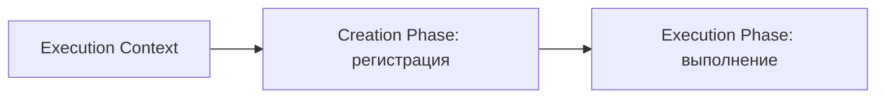

# Подъём объявлений

## Связь с предыдущей главой

Предыдущая глава объяснила Lexical Environment:

Теперь появляется следующий вопрос:

> Если Environment Record хранит identifiers, когда эти records появляются?

В главах про Execution Context и Lexical Environment уже была важная идея:

```text
Execution does not start immediately.
Before execution, engine prepares the environment.
```

Эта глава объясняет Hoisting как observable result этой подготовки.

Главная мысль:

```text
Hoisting is NOT moving code.

Hoisting is the observable result
of the engine preparing declarations
during the Creation Phase.
```

Source code не меняет position. Engine не берет строки и не переносит их вверх. Вместо этого до выполнения строк engine подготавливает records в Lexical Environment.

---

## Предварительные требования

Для этой главы нужно понимать:

* что JavaScript file проходит preparation перед execution;
* что Execution Context имеет Creation Phase и Execution Phase;
* что Lexical Environment хранит identifier records;
* что Variables создают identifiers;
* что `var`, `let`, `const` и function declaration создают разные виды declarations;
* что Scope определяет visibility identifiers.

Не требуется знать Temporal Dead Zone internals, Closures, modules, `this` или детали спецификации ECMAScript. TDZ будет объяснен в следующей главе; сейчас мы упомянем его только как причину поведения `let` и `const` до initialization.

---

## Время изучения

Ориентировочное время:

```text
Чтение главы:            110-140 минут
Разбор схем:              50-70 минут
Запуск примеров:          25-35 минут
Практика:                 90-120 минут
Повторение материала:     30 минут
```

Уровень сложности: **L3**.

L3 означает фундаментальный уровень: Hoisting часто объясняют как "поднятие кода", но эта глава заменяет миф внутренней моделью Creation Phase и Lexical Environment.

---

## Навигация

Предыдущая глава:

```text
docs/01-javascript/08-lexical-environment.md
```

Следующая глава:

```text
docs/01-javascript/10-temporal-dead-zone.md
```

Следующая глава объяснит Temporal Dead Zone: почему `let` и `const` registered during Creation Phase, но доступ к ним до initialization ведет себя иначе, чем `var`.

---

## Цели обучения

После изучения этой главы вы будете понимать:

* почему Hoisting существует;
* какое поведение наблюдает программист;
* что engine actually делает до execution;
* как Creation Phase связана с Hoisting;
* как регистрируются function declarations;
* как регистрируется `var`;
* как регистрируются `let` и `const`;
* чем declaration отличается от initialization;
* почему functions behave differently;
* почему source code никогда не moves upward;
* как читать legacy JavaScript без мифа про "перенос строк";
* как Hoisting связан с Lexical Environment;
* почему следующая тема — TDZ.

---

## Мотивация

Начнем с кода, который удивляет многих.

```javascript
console.log(userName);

var userName = 'Anna';
```

Результат:

```text
undefined
```

Если думать, что JavaScript просто выполняет строки сверху вниз, возникает вопрос:

Теперь похожий пример:

```javascript
// console.log(userRole);

let userRole = 'admin';
```

Если раскомментировать первую строку, код не выведет `undefined`. Он упадет с ошибкой доступа до initialization. Подробности Temporal Dead Zone будут в следующей главе; сейчас важен факт:

Еще один пример:

```javascript
printStatus();

function printStatus() {
  console.log('ready');
}
```

Результат:

```text
ready
```

Функцию можно вызвать до строки объявления.

Значит, разные declarations влияют на выполнение до того, как engine доходит до их строки. Но source code не двигается.

Главный вопрос главы:

> Что engine подготовил до начала execution?

---

## Теория

### Проблема мифа "код поднимается вверх"

Популярное объяснение:

```text
JavaScript moves declarations to the top.
```

Это удобная, но опасная фраза.

Она создает неправильную картину:

Так думать не нужно.

Правильная модель: строки остаются на своих местах, но до выполнения кода движок уже знает об объявленных именах.

Схема исходного кода:

```text
строка 1:  console.log(userName);   ← выполняется первой
строка 2:  var userName = 'Anna';   ← но имя зарегистрировано раньше
```

Подъём объявлений — это не перемещение. Это наблюдаемое поведение после подготовки.

### Что программист наблюдает

Программист видит три разных поведения.

Объявление функции:

```javascript
printStatus();

function printStatus() {
  console.log('ready');
}
```

Работает.

`var`:

```javascript
console.log(status);

var status = 'ready';
```

Выводит:

```text
undefined
```

`let` / `const`:

```javascript
// console.log(status);

let status = 'ready';
```

До строки инициализации доступ невозможен. Почему — объяснит временная мёртвая зона; следующая глава будет полностью об этом.

Вопрос:

```text
Why does function declaration work?
Why does var produce undefined?
Why do let/const fail before initialization?
```

Ответ начинается в фазе подготовки.

### Фаза подготовки ещё раз

Контекст выполнения создаётся в два крупных шага: сначала движок регистрирует
имена, потом выполняет строки по порядку.

Схема фазы подготовки:

```text
регистрация имён:
  функции      → готовы целиком
  var          → [ undefined ]
  let / const  → зарегистрированы, доступа нет
```

Схема фазы выполнения:

```text
выполнение строк по порядку:
  присваивания, вызовы, чтения
```

Что движок подготовил до выполнения:

```text
Identifier records.
Initial access behavior.
Function declaration bindings.
var bindings with undefined.
let/const bindings not initialized yet.
```

### Лексическое окружение до выполнения

Во время фазы подготовки движок подготавливает лексическое окружение.

Запись окружения до выполнения:

Это концептуальная схема, а не спецификация.

Важно:

```text
Registration happens before execution.
Initialization may happen later during execution.
```

### Регистрация объявления функции

Объявление функции регистрируется во время фазы подготовки так, что функцию можно вызвать до её строки.

```javascript
printStatus();

function printStatus() {
  console.log('ready');
}
```

```text
фаза подготовки:   showMessage  ──→  [ функция целиком ]
фаза выполнения:  вызов работает и до строки объявления
```

Что движок подготовил до выполнения:

```text
имя printStatus зарегистрировано
связано с вызываемой функцией
```

### Регистрация `var`

Объявление через `var` тоже учитывается во время фазы подготовки.

```javascript
console.log(userName);

var userName = 'Anna';
```

```text
фаза подготовки:   userName  ──→  [ undefined ]
фаза выполнения:  userName  ──→  [ 'Anna' ]
```

Здесь важно разделить объявление и инициализацию.

### Регистрация `let`

Объявление через `let` тоже регистрируется во время фазы подготовки, но ведёт себя иначе, чем `var`.

```javascript
// console.log(userRole);

let userRole = 'admin';
```

```text
фаза подготовки:   userName зарегистрирован, доступ запрещён
фаза выполнения:  на строке объявления доступ открывается
```

Подробный механизм TDZ будет в следующей главе. Сейчас нужно запомнить:

```text
let is registered during Creation Phase.
It is not initialized like var.
```

### Регистрация `const`

`const` похож на `let` тем, что имя регистрируется во время фазы подготовки, но не инициализируется, пока выполнение не дойдёт до строки объявления.

```javascript
// console.log(baseUrl);

const baseUrl = 'https://example.com';
```

```text
фаза подготовки:   baseUrl зарегистрирован, доступ запрещён
фаза выполнения:  объявление и инициализация происходят одной строкой
```

`const` обязан получить значение при объявлении. Это уже было в главе про переменные. Здесь важно другое: запись об имени существует до выполнения, а пригодное значение появляется только на строке инициализации.

### Объявление и инициализация

Подъём объявлений невозможно понять без разделения объявления и инициализации.

```javascript
var userName = 'Anna';
```

Разделение:

```text
declaration     — имя появилось в записях окружения
initialization  — имени сопоставлено значение
```

Для объявления функции:

```text
declaration и initialization происходят вместе, до выполнения:
имя сразу связано с готовой функцией
```

Для `var`:

```text
declaration — до выполнения, значение при этом undefined
initialization — на строке с присваиванием
```

Для `let` / `const`:

```text
declaration — до выполнения, но без значения и без доступа
initialization — на строке с объявлением, и только с этого момента имя читаемо
```

### Почему функции ведут себя иначе

Объявления функций ведут себя иначе, потому что во время фазы подготовки движок сразу связывает имя с готовой к вызову функцией.

```javascript
runTest();

function runTest() {
  console.log('test started');
}
```

До выполнения:

```text
Environment Record
  runTest → функция (готова к вызову)
```

Тогда первая строка уже может вызвать `runTest`.

Это полезно, потому что объявления функций описывают переиспользуемые действия:

```text
порядок объявления функций в файле не диктует порядок их вызова —
вспомогательную функцию можно описать ниже места, где она используется
```

`var userName = 'Anna'` ведёт себя иначе:

```text
Environment Record
  userName → undefined
```

Итак:

```text
вызов функции до её объявления   — работает
чтение var до присваивания        — даёт undefined, а не значение
```

### Полная временная шкала фазы подготовки

Для кода:

```javascript
printStatus();

console.log(userName);

var userName = 'Anna';
let userRole = 'admin';
const baseUrl = 'https://example.com';

function printStatus() {
  console.log('ready');
}
```

Временная шкала фазы подготовки:

```text
1. найдено объявление function printStatus  → имя связано с функцией
2. найдено объявление var userName          → имя заведено со значением undefined
3. найдено объявление let userRole          → имя заведено, доступа нет
4. найдено объявление const baseUrl         → имя заведено, доступа нет
```

Запись окружения до выполнения:

```text
printStatus → функция
userName    → undefined
userRole    → не инициализировано (доступ запрещён)
baseUrl     → не инициализировано (доступ запрещён)
```

### Временная шкала выполнения

Выполнение идёт по исходному коду в исходном порядке.

Временная шкала выполнения:

```text
Source code order is preserved.
No line moved.
No declaration moved.
Prepared records are used.
```

### Фильм о подготовке движка

Мысленный фильм: сначала движок быстро просматривает код и заводит записи обо всех объявлениях, а затем возвращается к началу и выполняет строки по порядку.

### Текущее место в модели JavaScript


```mermaid
flowchart LR
    N1["Execution Context"]
    N2["Creation Phase: регистрация"]
    N3["Execution Phase: выполнение"]
    N1 --> N2
    N2 --> N3
```

Полное положение:

```text
Call Stack          — какой Execution Context активен
Execution Context   — Creation Phase, затем Execution Phase
Lexical Environment — где живут подготовленные записи
Hoisting            — видимый результат того, что записи готовы заранее
```

### Переход к TDZ

После этой главы остается важный вопрос:

```text
If let and const are registered during Creation Phase,
why does accessing them before initialization throw an error?
```

Это вопрос временной мёртвой зоны.

Временная мёртвая зона — период между регистрацией `let` и `const` в фазе подготовки и их инициализацией в фазе выполнения, когда доступ запрещён. Подробная глава будет следующей.

---

## Внутренний механизм

Подъём объявлений — наблюдаемый результат подготовки объявлений.

Внутренний механизм:

```text
до первой выполненной строки engine проходит код текущего context
и заводит запись на каждое объявление, которое в нём встретил
```

Для объявления функции:

```text
запись создана и сразу содержит функцию
```

Для `var`:

```text
запись создана и содержит undefined
```

Для `let`:

```text
запись создана, но помечена как неинициализированная
```

Для `const`:

```text
запись создана, помечена как неинициализированная,
и значение можно будет задать ровно один раз
```

Что движок подготовил до начала выполнения:

```text
Function declarations.
var identifiers with undefined.
let identifiers in uninitialized state.
const identifiers in uninitialized state.
```

---

## Ментальная модель

### Подготовка класса до прихода учеников

Представьте класс до начала занятия.

Выполнение — это когда ученики пришли и работа началась.

### Заполнение списка участников

Запись окружения похожа на список зарегистрированных участников.

### Бронирование мест до начала работы

`let` и `const` можно представить как забронированные места:

```text
место в списке занято, но сесть на него пока нельзя —
табличка «занято» стоит до строки объявления
```

`var`:

```text
место занято и на нём уже кто-то сидит — заглушка undefined
```

Объявление функции:

```text
место занято тем, кто действительно пришёл: функция готова к работе сразу
```

### Подготовка против выполнения

Главное разделение:

```text
Подготовка — engine заводит записи об объявлениях.
Выполнение — engine идёт по строкам сверху вниз.
```

Никогда не заменяйте это на:

```text
Code moves upward
```

Правильная формула:

```text
Hoisting is not moving code.
Hoisting is preparation before execution.
```

---

## Примеры кода

Примеры к этой главе находятся в папке:

```text
examples/01-javascript/chapter-09/
```

Запускайте их из корня проекта.

### Пример 1. Подъём объявления функции

Файл:

```text
examples/01-javascript/chapter-09/01-function-hoisting.js
```

Показывает, что объявленную функцию можно вызвать до её строки, потому что фаза подготовки её подготовила.

### Пример 2. Подъём `var`

Файл:

```text
examples/01-javascript/chapter-09/02-var-hoisting.js
```

Показывает, что `var` регистрируется со значением `undefined` до строки присваивания.

### Пример 3. Поведение `let`

Файл:

```text
examples/01-javascript/chapter-09/03-let-behavior.js
```

Показывает безопасный доступ после инициализации и содержит закомментированную строку, которая будет разобрана в следующей главе про временную мёртвую зону.

### Пример 4. Поведение `const`

Файл:

```text
examples/01-javascript/chapter-09/04-const-behavior.js
```

Показывает безопасный доступ после обязательной инициализации.

### Пример 5. Объявление и инициализация

Файл:

```text
examples/01-javascript/chapter-09/05-declaration-vs-initialization.js
```

Показывает, что объявление и присваивание — разные части.

### Пример 6. Типичные ошибки

Файл:

```text
examples/01-javascript/chapter-09/06-common-mistakes.js
```

Показывает типичные мифы через безопасные комментарии и исправленный код.

---

## Частые вопросы

### Подъём действительно поднимает код?

Нет. Исходный код не меняет порядок. Движок подготавливает объявления во время фазы подготовки, а выполнение идёт по исходным строкам.

### Почему объявленную функцию можно вызвать до объявления?

Потому что фаза подготовки связывает имя функции с готовой к вызову функцией ещё до начала выполнения.

### Почему `var` дает `undefined`?

Потому что объявление `var` регистрируется в фазе подготовки со значением `undefined`, а присваивание происходит позже, в фазе выполнения.

### Почему `let` и `const` не дают `undefined` как `var`?

Они тоже регистрируются в фазе подготовки, но не инициализируются, как `var`. Подробный ответ — временная мёртвая зона — в следующей главе.

### Нужно ли специально пользоваться подъёмом объявлений?

В новом коде лучше не писать так, чтобы читатель полагался на подъём. Понимать его нужно для чтения существующего и старого кода.

---

## Распространённые мифы

### Миф 1. JavaScript переносит объявления вверх файла

Реальность:

Исходный код остаётся на месте. Движок готовит записи об объявлениях до выполнения.

### Миф 2. Подъём работает одинаково для всех объявлений

Реальность:

Объявления функций, `var`, `let` и `const` ведут себя при подготовке по-разному.

### Миф 3. `var a = 5` полностью выполняется до первой строки

Реальность:

Подготавливается только объявление. Присваивание `a = 5` происходит, когда выполнение доходит до строки.

### Миф 4. Подъём объявлений — это редкая странность

Реальность:

Подъём объявлений — прямое следствие фазы подготовки и подготовки лексического окружения.

---

## Распространённые ошибки

### Ошибка 1. Говорить, что код "переехал наверх"

Неправильная модель:

```text
var userName = "Anna" moved to top.
```

Что произошло:

Код не перемещается. Движок заранее подготовил запись об имени.

Исправленная модель:

```text
Creation Phase registered userName with undefined.
Execution Phase later assigned "Anna".
```

### Ошибка 2. Ожидать значение у `var` до присваивания

Неправильный код:

```javascript
console.log(userName);

var userName = 'Anna';
```

Ожидание:

```text
Anna
```

Реальность:

```text
undefined
```

Почему:

Подготавливается только объявление, со значением `undefined`; присваивание происходит позже.

### Ошибка 3. Объяснять `let` и `const` фразой «не поднимаются»

Неправильная модель:

```text
let and const are not hoisted.
```

Более точная модель:

```text
let and const are registered during Creation Phase,
but access before initialization is restricted.
```

Это объяснит следующая глава про временную мёртвую зону.

### Ошибка 4. Полагаться на подъём объявлений в новом коде

Неправильный стиль:

```javascript
runTest();

function runTest() {
  console.log('test');
}
```

Такой код работает, но в больших проектах часто читается хуже.

Более читаемый стиль:

```javascript
function runTest() {
  console.log('test');
}

runTest();
```

---

## Практическое использование

При чтении кода задавайте вопросы:

```text
1. Какие declarations есть в scope?
2. Что Creation Phase подготовит?
3. Что будет в Environment Record before execution?
4. Что произойдет на каждой строке Execution Phase?
5. Где declaration, а где initialization / assignment?
```

Таблица анализа:

| Объявление | После фазы подготовки | Доступ до строки объявления |
| --- | --- | --- |
| `function` | готова целиком | работает |
| `var` | `undefined` | даёт `undefined` |
| `let` | зарегистрирован | ошибка |
| `const` | зарегистрирован | ошибка |

Мини-чек-лист:

```text
✓ Я не говорю "код поднимается".
✓ Я отделяю Creation Phase от Execution Phase.
✓ Я отделяю declaration от initialization.
✓ Я понимаю function declaration behavior.
✓ Я понимаю var as undefined before assignment.
✓ Я знаю, что let/const требуют следующей темы: TDZ.
```

---

## Использование в Automation QA

### Чтение старого кода JavaScript

В старых вспомогательных файлах можно встретить:

```javascript
runSetup();

function runSetup() {
  console.log('setup');
}
```

Это работает не потому, что код переместился. Объявление функции было подготовлено во время фазы подготовки.

### Отладка старых вспомогательных файлов

В старом коде часто используется `var`:

```javascript
console.log(environmentName);

var environmentName = 'staging';
```

Если вывод равен `undefined`, проблема не в `console.log`. Движок подготовил `environmentName` как `undefined`, но присваивание происходит позже.

### Как читать объявления функций во фреймворках

В существующих тестовых фреймворках объявления функций могут стоять ниже места использования.

Модель подъёма объявлений помогает читать такой код спокойно.

### Как избегать мифов в кодовой базе Playwright или Node.js

В тестах Playwright лучше писать код так, чтобы читателю не приходилось мысленно проигрывать подъём объявлений.

```javascript
function buildUserName() {
  return 'qa-user';
}

const userName = buildUserName();
```

Читаемость важнее демонстрации знания подъёма объявлений.

Правило для Automation QA:

```text
Understand Hoisting to read existing code.
Avoid relying on Hoisting in new test code.
```

---

## Итоги

Подъём объявлений — это не перемещение кода.

Главная модель:

```text
Hoisting is the observable result
of the engine preparing declarations
during the Creation Phase.
```

Исходный код остаётся в исходном порядке. Движок создаёт контекст выполнения, входит в фазу подготовки, готовит лексическое окружение и записи об именах, регистрирует объявления и только затем начинает фазу выполнения.

Разные объявления ведут себя по-разному:

Следующая глава объяснит временную мёртвую зону: почему `let` и `const` зарегистрированы в фазе подготовки, но доступ к ним до инициализации даёт ошибку.

---

## Что нужно запомнить

✓ Подъём объявлений — это не перемещение кода.

✓ Исходный код никогда не меняет порядок.

✓ Подъём объявлений возникает из фазы подготовки.

✓ Фаза подготовки готовит лексическое окружение.

✓ Запись окружения получает записи об объявлениях до выполнения.

✓ Объявления функций регистрируются готовыми к вызову.

✓ `var` регистрируется со значением `undefined`.

✓ `let` и `const` регистрируются, но не инициализируются.

✓ Объявление и инициализация — разные операции.

✓ Фаза выполнения выполняет код в исходном порядке.

✓ Временная мёртвая зона объяснит доступ к `let` и `const` до инициализации в следующей главе.

---

## Проверьте себя

1. Почему подъём объявлений существует?

2. Почему неправильно говорить, что JavaScript переносит код вверх?

3. Что происходит во время фазы подготовки?

4. Что происходит во время фазы выполнения?

5. Как регистрируется объявление функции?

6. Как регистрируется `var`?

7. Как регистрируется `let`?

8. Как регистрируется `const`?

9. Чем объявление отличается от инициализации?

10. Почему следующая тема — TDZ?

### Ответы

1. Движок готовит контекст до выполнения: проходит код и заводит записи обо всех объявлениях. Подъём — видимый результат этой подготовки.
2. Код никуда не перемещается: строки остаются на своих местах и выполняются в исходном порядке. Раньше происходит только регистрация имён.
3. Создаётся окружение и заводятся записи об объявлениях: функции сразу готовы к вызову, `var` получает `undefined`, `let` и `const` заводятся без доступа.
4. Движок выполняет строки сверху вниз, используя уже подготовленные записи.
5. Имя сразу связывается с готовой функцией, поэтому вызвать её можно и до строки объявления.
6. Имя заводится со значением `undefined`. Чтение до строки присваивания не ошибка, но и значения не даёт.
7. Имя заводится, но помечается как неинициализированное: обращение к нему до объявления даёт ошибку.
8. Так же, как `let`, плюс значение можно будет задать ровно один раз — на строке объявления.
9. Объявление заводит имя, инициализация впервые связывает его со значением. У функций это происходит одновременно, у `var` — в разные моменты, у `let` и `const` — с запретом доступа между ними.
10. Потому что `let` и `const` зарегистрированы заранее, но читать их нельзя. Промежуток между регистрацией и инициализацией и есть временная мёртвая зона.

---

## Практика

Практика к этой главе находится в файле:

```text
practice/01-javascript/09-hoisting.md
```

Перед практикой запустите примеры из раздела «Примеры кода» и для каждого файла составьте временную шкалу подготовки и выполнения.

---

## Решения

Решения находятся в файле:

```text
solutions/01-javascript/09-hoisting.md
```

Открывайте решения после самостоятельной попытки. В этой главе важно сравнивать не только вывод, но и то, что было подготовлено до выполнения.
