# Temporal Dead Zone

## Связь с предыдущей главой

Предыдущая глава объяснила Hoisting без мифа о переносе кода:

```text
Hoisting is NOT moving code.

Hoisting is the observable result
of the engine preparing declarations
during the Creation Phase.
```

Мы увидели важное различие:

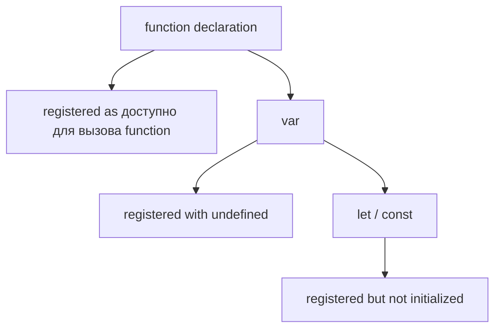

Теперь появляется последний вопрос в этой цепочке:

> Если engine уже знает identifier `let` или `const`, почему access все равно запрещен?

Эта глава объясняет Temporal Dead Zone как естественное следствие уже изученной модели:

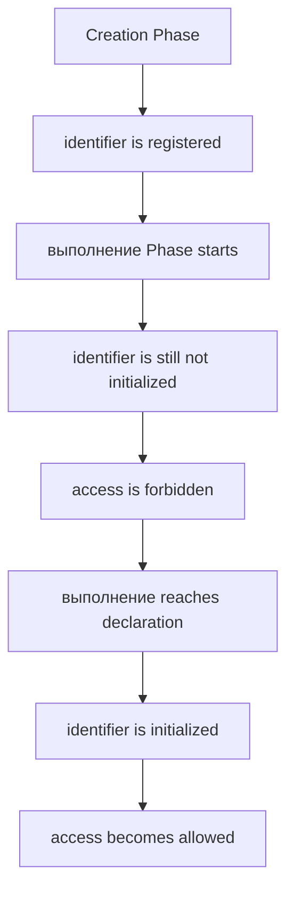

Главная модель главы:

```text
The identifier already exists.
The engine already knows about it.
Access is temporarily forbidden until initialization.
```

---

## Предварительные требования

Для этой главы нужно понимать:

* что Execution Context имеет Creation Phase и Execution Phase;
* что Lexical Environment содержит Environment Record;
* что Hoisting — результат подготовки declarations during Creation Phase;
* что `let` и `const` registered during Creation Phase;
* что `let` и `const` are not initialized immediately;
* что `var` registered with `undefined`.

Не требуется знать Closures, modules, детали спецификации ECMAScript или optimization details. Эти темы будут изучаться позже.

---

## Время изучения

Ориентировочное время:

```text
Чтение главы:            100-130 минут
Разбор схем:              45-60 минут
Запуск примеров:          25-35 минут
Практика:                 90-120 минут
Повторение материала:     30 минут
```

Уровень сложности: **L3**.

L3 означает фундаментальный уровень: TDZ объясняет поведение `let` и `const` до initialization и завершает связку Creation Phase → Lexical Environment → Hoisting.

---

## Навигация

Предыдущая глава:

```text
docs/01-javascript/09-hoisting.md
```

Следующая глава:

```text
docs/01-javascript/11-primitive-types.md
```

Следующая глава начнет раздел о значения and types. Функции как отдельная большая тема будут изучаться позже в разделе Functions; в этой главе function declarations используются только как уже знакомое сравнение с `let`, `const` и `var`.

---

## Цели обучения

После изучения этой главы вы будете понимать:

* что такое Temporal Dead Zone;
* почему TDZ существует;
* почему `let` и `const` не нужно называть "not hoisted";
* чем registration отличается от initialization;
* когда TDZ begins;
* когда TDZ ends;
* как TDZ работает для `let`;
* как TDZ работает для `const`;
* почему `var` behaves differently;
* почему access before initialization дает ReferenceError;
* как читать TDZ errors в helper files;
* почему modern Playwright code предпочитает `const`;
* как избегать declaration order mistakes.

---

## Мотивация

Начнем с наблюдаемого поведения.

```javascript
// console.log(user);

let user = 'Anna';

console.log(user);
```

Если оставить код как есть, результат:

```text
Anna
```

Если раскомментировать первую строку:

```javascript
console.log(user);

let user = 'Anna';
```

программа завершится ошибкой:

```text
ReferenceError
```

Теперь сравним с `var`:

```javascript
console.log(user);

var user = 'Anna';
```

Результат:

```text
undefined
```

Вопрос:

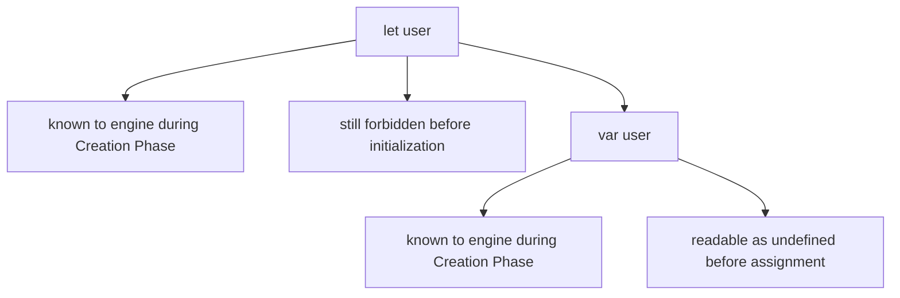

Что отличается?

Не нужно отвечать "let не hoisted". Это неточно.

Более правильный вопрос:

> В каком состоянии находится identifier прямо сейчас?

---

## Теория

### Наблюдаемое поведение

Сначала посмотрим на три cases.

`var`:

```javascript
console.log(status);

var status = 'ready';
```

```text
undefined
```

`let`:

```javascript
// console.log(status);

let status = 'ready';
```

Если раскомментировать read before initialization:

```text
ReferenceError
```

`const`:

```javascript
// console.log(baseUrl);

const baseUrl = 'https://example.com';
```

Если раскомментировать read before initialization:

```text
ReferenceError
```

Наблюдение:

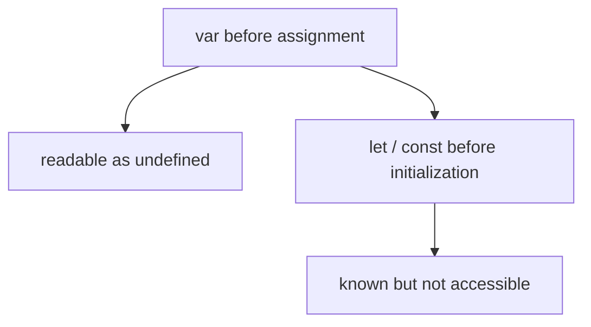

### Почему простое объяснение "not hoisted" неверно

Если сказать:

```text
let and const are not hoisted
```

то возникает неправильная модель:

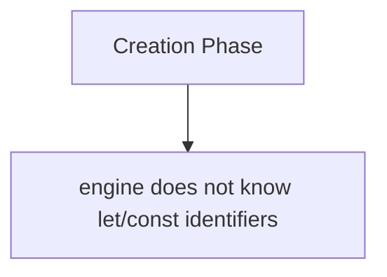

Но это не та модель, которую мы строили в Hoisting.

Более точная модель:

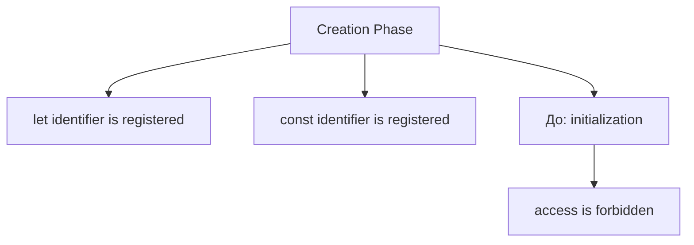

То есть проблема не в том, что identifier неизвестен. Проблема в его состояние.

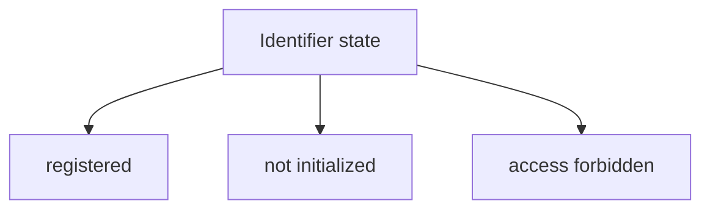

### Что такое Temporal Dead Zone

Теперь можно ввести термин.

Temporal Dead Zone, или TDZ, — период от начала scope до initialization `let` или `const`, когда identifier already exists in Environment Record, but access is forbidden.

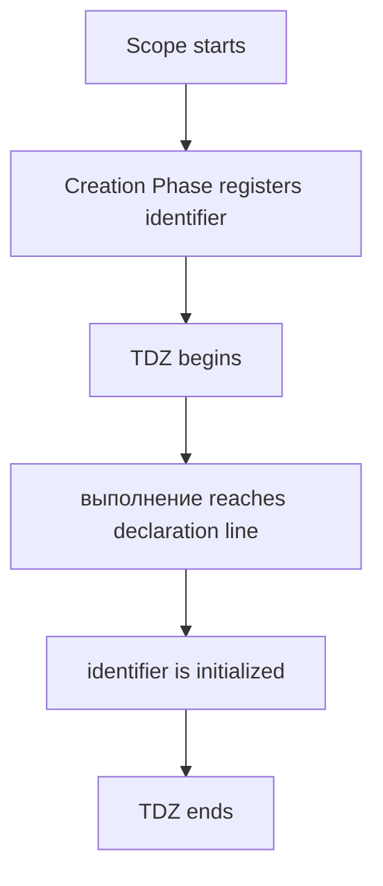

Важно:

```text
TDZ is not about code movement.
TDZ is about identifier state before initialization.
```

### Почему существует TDZ

TDZ exists to prevent reading `let` and `const` before the program has explicitly initialized them.

Без TDZ:

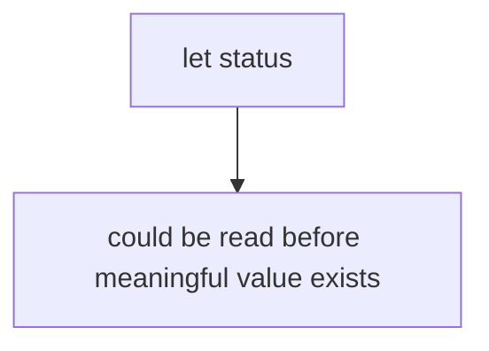

С TDZ:

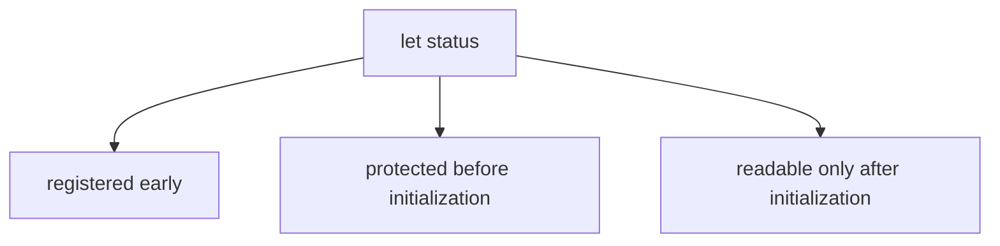

TDZ делает ошибки заметнее.

```javascript
// console.log(baseUrl);

const baseUrl = 'https://example.com';
```

Если `baseUrl` нужен до declaration line, программа должна явно показать проблему, а не silently return `undefined`.

Что состояние identifier прямо сейчас:

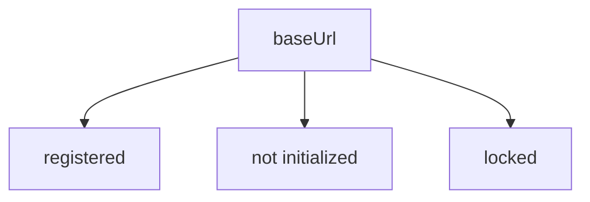

### Registration vs initialization

Registration:

```text
Engine creates identifier record.
```

Инициализация:

```text
Engine gives identifier its first usable value.
```

Диаграмма registration:

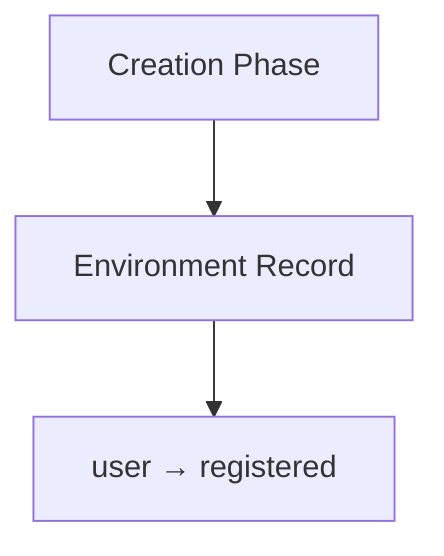

Диаграмма initialization:

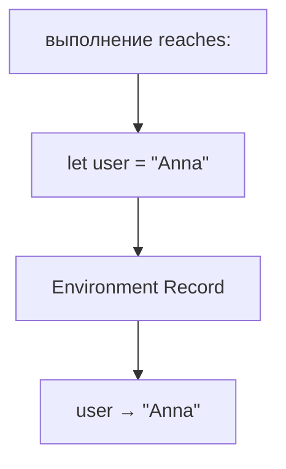

TDZ существует между этими двумя состояниями.

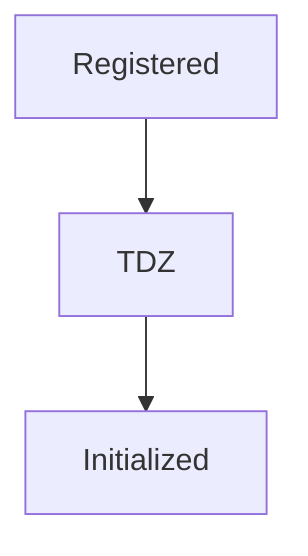

### When TDZ begins

TDZ начинается, когда выполнение входит в scope, содержащий объявление `let` или `const`.

Для global scope:

```javascript
// console.log(user);

let user = 'Anna';
```

Временная шкала:

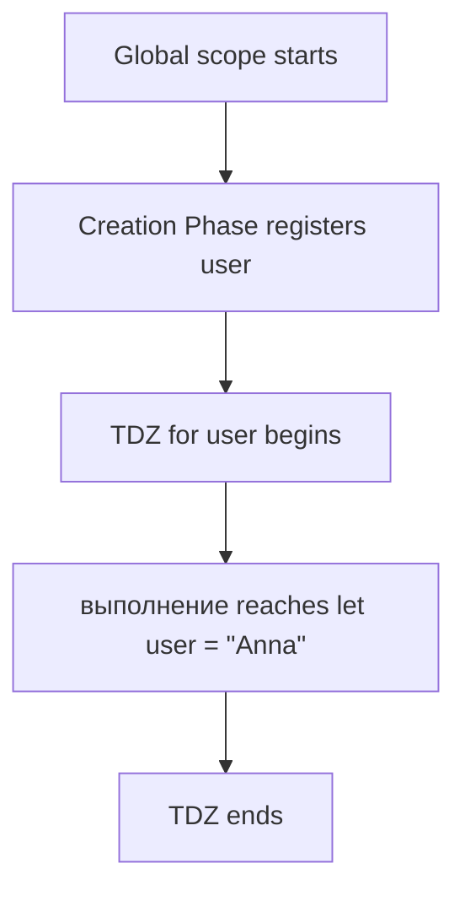

Для block scope:

```javascript
if (true) {
  // console.log(status);

  let status = 'active';
}
```

Временная шкала:

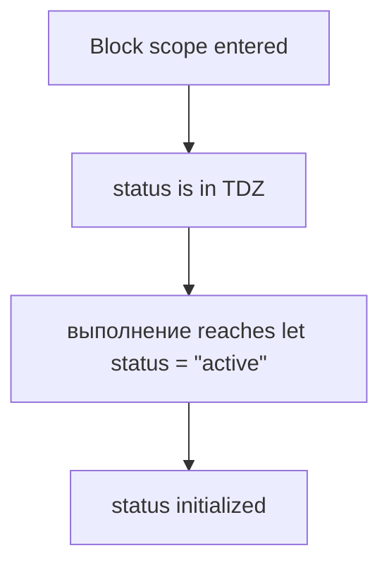

### When TDZ ends

TDZ заканчивается, когда выполнение доходит до объявления и происходит initialization.

```javascript
let user = 'Anna';

console.log(user);
```

Временная шкала:

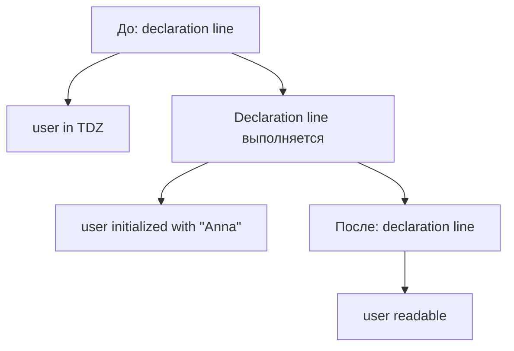

В каком состоянии этот identifier прямо сейчас:

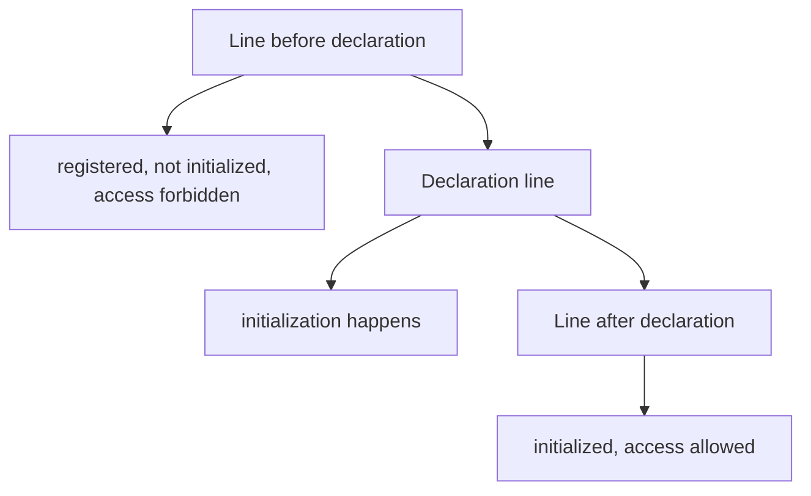

### TDZ for let

`let` can be declared without immediate meaningful value:

```javascript
let user;

console.log(user);
```

Результат:

```text
undefined
```

Почему это не TDZ error?

Потому что execution reached declaration line. `user` was initialized, even if its value is `undefined`.

let lifecycle:

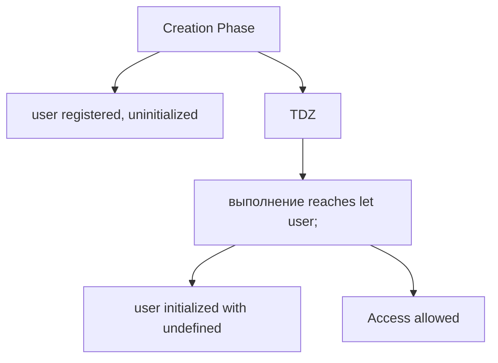

Для `let user = 'Anna'`:

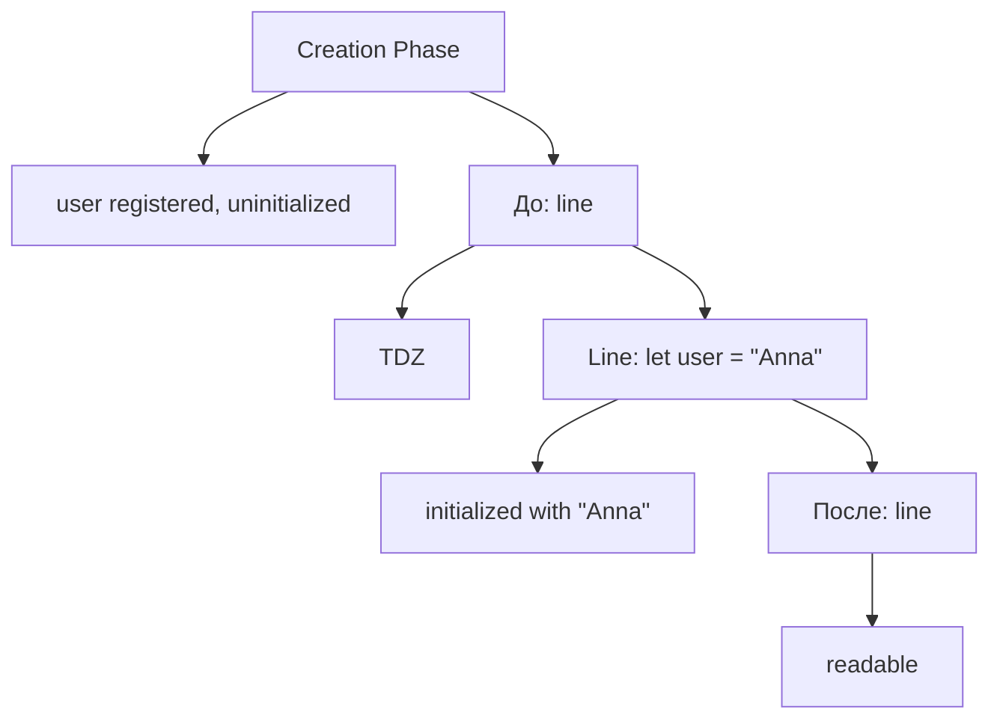

### TDZ for const

`const` must be initialized at declaration.

```javascript
const baseUrl = 'https://example.com';

console.log(baseUrl);
```

const lifecycle:

```mermaid
flowchart TD
    N1["Creation Phase"]
    N2["baseUrl registered, uninitialized"]
    N3["До: declaration line"]
    N4["TDZ"]
    N5["Line: const baseUrl = &quot;https://example.com&quot;"]
    N6["initialized with value"]
    N7["После: line"]
    N8["readable, reassignment forbidden"]
    N1 --> N2
    N1 --> N3
    N3 --> N4
    N3 --> N5
    N5 --> N6
    N5 --> N7
    N7 --> N8
```

Нельзя:

```javascript
// const baseUrl;
```

Это syntax error, потому что `const` требует initialization at declaration.

TDZ для `const` похож на TDZ для `let`, но есть дополнительное правило:

```mermaid
flowchart TD
    N1["const"]
    N2["access forbidden before initialization"]
    N3["must initialize at declaration"]
    N4["reassignment forbidden after initialization"]
    N1 --> N2
    N1 --> N3
    N1 --> N4
```

### Почему var ведёт себя иначе

`var` ведёт себя иначе, потому что Creation Phase инициализирует его значением `undefined`.

```javascript
console.log(user);

var user = 'Anna';
```

var lifecycle comparison:

```mermaid
flowchart TD
    N1["Creation Phase"]
    N2["user registered and initialized with undefined"]
    N3["До: assignment line"]
    N4["user readable as undefined"]
    N5["Assignment line"]
    N6["user assigned &quot;Anna&quot;"]
    N7["После: assignment line"]
    N8["user readable as &quot;Anna&quot;"]
    N1 --> N2
    N1 --> N3
    N3 --> N4
    N3 --> N5
    N5 --> N6
    N5 --> N7
    N7 --> N8
```

Сравнение:

```mermaid
flowchart TD
    N1["var"]
    N2["registered + initialized with undefined during Creation Phase"]
    N3["let / const"]
    N4["registered but not initialized during Creation Phase"]
    N1 --> N2
    N1 --> N3
    N3 --> N4
```

Именно поэтому:

```mermaid
flowchart TD
    N1["var before line → undefined"]
    N2["let/const before line → ReferenceError"]
    N1 --> N2
```

### ReferenceError before initialization

Когда code пытается access `let` / `const` before initialization, engine throws ReferenceError.

```javascript
// console.log(user);

let user = 'Anna';
```

Если раскомментировать:

```text
ReferenceError: Cannot access 'user' before initialization
```

Что состояние identifier прямо сейчас:

```mermaid
flowchart TD
    N1["user"]
    N2["registered in Environment Record"]
    N3["not initialized"]
    N4["access forbidden"]
    N1 --> N2
    N1 --> N3
    N1 --> N4
```

Это важный момент: ReferenceError здесь не означает, что engine вообще не знает identifier. Он знает identifier, но запрещает доступ к нему до initialization.

### Lexical Environment during TDZ

Во время TDZ Environment Record уже содержит identifier record.

```mermaid
flowchart TD
    N1["Lexical Environment"]
    N2["Environment Record"]
    N3["user → uninitialized"]
    N1 --> N2
    N2 --> N3
```

Access attempt:

```mermaid
flowchart TD
    N1["console.log(user)"]
    N2["lookup user"]
    N3["Environment Record has user"]
    N4["state: uninitialized"]
    N5["throw ReferenceError"]
    N1 --> N2
    N2 --> N3
    N3 --> N4
    N4 --> N5
```

Это отличается от missing identifier:

```mermaid
flowchart TD
    N1["lookup unknownName"]
    N2["not found in Environment Record"]
    N3["not found outward"]
    N4["ReferenceError"]
    N1 --> N2
    N2 --> N3
    N3 --> N4
```

Обе ситуации могут быть ReferenceError, но причины разные:

```mermaid
flowchart TD
    N1["TDZ ReferenceError"]
    N2["identifier exists but is not initialized"]
    N3["значение отсутствует identifier ReferenceError"]
    N4["identifier not found"]
    N1 --> N2
    N1 --> N3
    N3 --> N4
```

### Environment Record before initialization

Для кода:

```javascript
// console.log(user);

let user = 'Anna';
const role = 'admin';
var status = 'created';
```

До выполнения:

```mermaid
flowchart TD
    N1["Environment Record"]
    N2["user → uninitialized"]
    N3["role → uninitialized"]
    N4["status → undefined"]
    N1 --> N2
    N1 --> N3
    N1 --> N4
```

Before initialization line:

```mermaid
flowchart TD
    N1["user"]
    N2["TDZ"]
    N3["role"]
    N4["TDZ"]
    N5["status"]
    N6["readable as undefined"]
    N1 --> N2
    N1 --> N3
    N3 --> N4
    N3 --> N5
    N5 --> N6
```

After initialization lines:

```mermaid
flowchart TD
    N1["Environment Record"]
    N2["user → &quot;Anna&quot;"]
    N3["role → &quot;admin&quot;"]
    N4["status → &quot;created&quot;"]
    N1 --> N2
    N1 --> N3
    N1 --> N4
```

### Identifier состояние transitions

Identifier состояние transitions:

```mermaid
flowchart TD
    N1["let / const"]
    N2["registered"]
    N3["uninitialized"]
    N4["TDZ access forbidden"]
    N5["initialized"]
    N6["access allowed"]
    N1 --> N2
    N1 --> N3
    N1 --> N4
    N1 --> N5
    N1 --> N6
```

Для `var`:

```mermaid
flowchart TD
    N1["var"]
    N2["registered"]
    N3["initialized with undefined"]
    N4["access allowed"]
    N5["assigned later"]
    N6["access возвращает assigned value"]
    N1 --> N2
    N1 --> N3
    N1 --> N4
    N1 --> N5
    N1 --> N6
```

Comparison table:

```text
Declaration | Creation Phase state     | Before line access | Initialization
------------|--------------------------|--------------------|----------------
var         | initialized as undefined | allowed            | assignment line
let         | uninitialized            | ReferenceError     | declaration line
const       | uninitialized            | ReferenceError     | declaration line
```

### Complete execution movie

Для кода:

```javascript
// console.log(user);

let user = 'Anna';
const role = 'admin';
var status = 'created';

console.log(user);
console.log(role);
console.log(status);
```

Movie:

```mermaid
flowchart TD
    N1["Engine receives исходный код"]
    N2["Creation Phase starts"]
    N3["Environment Record prepared"]
    N4["user → uninitialized"]
    N5["role → uninitialized"]
    N6["status → undefined"]
    N7["выполнение Phase starts"]
    N8["line before let user"]
    N9["user is still in TDZ"]
    N10["line: let user = &quot;Anna&quot;"]
    N11["user initialized"]
    N12["line: const role = &quot;admin&quot;"]
    N13["role initialized"]
    N14["line: var status = &quot;created&quot;"]
    N15["status assigned"]
    N16["console.log reads initialized identifiers"]
    N1 --> N2
    N2 --> N3
    N3 --> N4
    N3 --> N5
    N3 --> N6
    N3 --> N7
    N7 --> N8
    N8 --> N9
    N8 --> N10
    N10 --> N11
    N10 --> N12
    N12 --> N13
    N12 --> N14
    N14 --> N15
    N14 --> N16
```

### Текущее место в модели JavaScript

Текущая позиция:

```mermaid
flowchart TD
    N1["Execution Context"]
    N2["Creation Phase"]
    N3["registers identifiers"]
    N4["выполнение Phase"]
    N5["initializes let/const when declaration line выполняется"]
    N1 --> N2
    N1 --> N3
    N1 --> N4
    N4 --> N5
```

Full path:

```mermaid
flowchart TD
    N1["Execution Context"]
    N2["Lexical Environment"]
    N3["Hoisting"]
    N4["Temporal Dead Zone"]
    N1 --> N2
    N2 --> N3
    N3 --> N4
```

TDZ completes the explanation of `let` and `const` Hoisting:

```text
They are registered.
They are known.
They are temporarily locked.
They become usable after initialization.
```

### Переход к Functions

Следующая большая группа тем постепенно приведет к значения, types, operators and functions. Functions will later explain how parameters, return значения and function calls create more situations where Scope and Lexical Environment matter.

Мост:

```mermaid
flowchart TD
    N1["TDZ"]
    N2["explains identifier state before initialization"]
    N3["Functions"]
    N4["will создать new выполнение contexts and new environments"]
    N1 --> N2
    N1 --> N3
    N3 --> N4
```

Функции как отдельная тема будут изучаться позже; сейчас достаточно помнить, что every function call can create its own execution environment.

---

## Внутренний механизм

TDZ mechanism на conceptual level:

```mermaid
flowchart TD
    N1["Creation Phase"]
    N2["let/const identifier registered"]
    N3["identifier state: uninitialized"]
    N4["выполнение Phase starts"]
    N5["until declaration line:"]
    N6["access forbidden"]
    N7["declaration line выполняется"]
    N8["identifier initialized"]
    N9["access allowed"]
    N1 --> N2
    N2 --> N3
    N3 --> N4
    N4 --> N5
    N6 --> N7
    N7 --> N8
    N8 --> N9
    N5 --> N6
```

В каком состоянии этот identifier прямо сейчас:

```mermaid
flowchart TD
    N1["До: declaration line"]
    N2["registered + uninitialized + locked"]
    N3["On declaration line"]
    N4["initialization happens"]
    N5["После: declaration line"]
    N6["initialized + readable"]
    N1 --> N2
    N1 --> N3
    N3 --> N4
    N3 --> N5
    N5 --> N6
```

Для `var`:

```mermaid
flowchart TD
    N1["Creation Phase"]
    N2["registered + initialized with undefined"]
    N3["До: assignment"]
    N4["readable as undefined"]
    N5["После: assignment"]
    N6["readable as assigned value"]
    N1 --> N2
    N1 --> N3
    N3 --> N4
    N3 --> N5
    N5 --> N6
```

TDZ is not a place in memory. It is a period of execution where an identifier has a restricted состояние.

---

## Ментальная модель

### Reserved parking place

`let` / `const` похожи на reserved parking place.

```mermaid
flowchart TD
    N1["Creation Phase"]
    N2["parking place reserved for user"]
    N3["До: initialization"]
    N4["car is not allowed to use it yet"]
    N5["Initialization"]
    N6["permission activated"]
    N1 --> N2
    N1 --> N3
    N3 --> N4
    N3 --> N5
    N5 --> N6
```

Identifier exists, но access forbidden.

### Locked room

TDZ похож на locked room.

```text
Room exists.
Name is on the door.
Engine knows the room.
Door is locked until initialization.
```

```mermaid
flowchart TD
    N1["До: initialization"]
    N2["locked room"]
    N3["После: initialization"]
    N4["unlocked room"]
    N1 --> N2
    N1 --> N3
    N3 --> N4
```

### Sealed storage box

Environment Record has a sealed box.

```mermaid
flowchart TD
    N1["Environment Record"]
    N2["user → sealed box"]
    N1 --> N2
```

Reading before initialization:

```mermaid
flowchart TD
    N1["Open box?"]
    N2["forbidden"]
    N1 --> N2
```

After initialization:

```mermaid
flowchart LR
    N1["user"]
    N2["&quot;Anna&quot;"]
    N1 --> N2
```

### Registration before permission

```mermaid
flowchart TD
    N1["Registration"]
    N2["identifier is known"]
    N3["Permission"]
    N4["access allowed after initialization"]
    N1 --> N2
    N1 --> N3
    N3 --> N4
```

TDZ lives between registration and permission.

### Waiting until activation

```mermaid
flowchart TD
    N1["registered"]
    N2["waiting for activation"]
    N3["initialized"]
    N4["usable"]
    N1 --> N2
    N2 --> N3
    N3 --> N4
```

Итоговая модель:

```text
The identifier already exists.
The engine already knows about it.
Access is temporarily forbidden until initialization.
```

---

## Примеры кода

Примеры к этой главе находятся в папке:

```text
examples/01-javascript/chapter-10/
```

Запускайте их из корня проекта.

### Пример 1. let TDZ

Файл:

```text
examples/01-javascript/chapter-10/01-let-tdz.js
```

Показывает safe access after initialization и содержит закомментированный unsafe access.

### Пример 2. const TDZ

Файл:

```text
examples/01-javascript/chapter-10/02-const-tdz.js
```

Показывает, что `const` becomes readable only after initialization.

### Пример 3. var comparison

Файл:

```text
examples/01-javascript/chapter-10/03-var-comparison.js
```

Показывает, что `var` readable as `undefined` before assignment.

### Пример 4. Initialization

Файл:

```text
examples/01-javascript/chapter-10/04-initialization.js
```

Показывает момент, когда `let` declaration without value still initializes identifier with `undefined`.

### Пример 5. Safe access

Файл:

```text
examples/01-javascript/chapter-10/05-safe-access.js
```

Показывает безопасный порядок declaration before read.

### Пример 6. Типичные ошибки

Файл:

```text
examples/01-javascript/chapter-10/06-common-mistakes.js
```

Показывает common TDZ mistakes через comments and corrected code.

---

## Частые вопросы

### `let` и `const` hoisted?

Да, если под Hoisting понимать registration during Creation Phase. Но они не initialized like `var`, поэтому access before initialization forbidden.

### Почему тогда говорят "let is not hoisted"?

Так иногда упрощают для новичков. В этой книге мы используем более точную модель: registered but not initialized.

### TDZ — это ошибка?

Нет. TDZ — это период. Ошибка появляется, если code tries to access identifier during that period.

### Почему `var` не имеет TDZ в таком же смысле?

Потому что `var` initialized with `undefined` during Creation Phase, so access is allowed before assignment.

### TDZ есть только в global scope?

Нет. TDZ применяется к `let` / `const` в их scope: global, function или block.

---

## Распространенные мифы

### Миф 1. `let` и `const` не hoisted

Реальность:

Они registered during Creation Phase, but access is forbidden until initialization.

### Миф 2. ReferenceError значит, что engine не знает identifier

Реальность:

В TDZ engine знает identifier, но запрещает доступ потому что он не инициализирован.

### Миф 3. TDZ — это физическая зона в памяти

Реальность:

TDZ — период between registration and initialization.

### Миф 4. `let user;` остается в TDZ навсегда, пока нет value

Реальность:

Когда execution reaches `let user;`, identifier initializes with `undefined`, and TDZ ends.

---

## Типичные ошибки

### Ошибка 1. Читать `let` до declaration line

Неправильный код:

```javascript
// console.log(user);

let user = 'Anna';
```

Что произошло:

Access before initialization would throw ReferenceError.

Исправленный вариант:

```javascript
let user = 'Anna';

console.log(user);
```

### Ошибка 2. Ожидать `undefined` от `const`

Неправильная модель:

```text
const before initialization behaves like var.
```

Реальность:

`const` is registered but uninitialized until declaration line.

Исправленный вариант:

```javascript
const baseUrl = 'https://example.com';

console.log(baseUrl);
```

### Ошибка 3. Говорить "not hoisted"

Неправильная формулировка:

```text
let and const are not hoisted.
```

Исправленная формулировка:

```text
let and const are registered during Creation Phase,
but access before initialization is forbidden.
```

### Ошибка 4. Путать missing identifier и TDZ

Missing identifier:

```javascript
// console.log(unknownUser);
```

TDZ:

```javascript
// console.log(user);

let user = 'Anna';
```

Оба могут дать ReferenceError, но причины разные.

---

## Практическое использование

Правило для чтения кода:

```mermaid
flowchart TD
    N1["When you see let/const:"]
    N2["before declaration line → TDZ"]
    N3["after declaration line → safe access"]
    N1 --> N2
    N1 --> N3
```

Порядок анализа:

```text
1. Найдите scope.
2. Найдите let/const declaration.
3. Определите начало scope.
4. От начала scope до declaration line — TDZ.
5. После declaration line — identifier initialized.
```

Таблица анализа:

```text
Identifier | Scope starts | Declaration line | Before line state | After line state
-----------|--------------|------------------|-------------------|-----------------
user       | line 1       | line 4           | TDZ               | initialized
baseUrl    | line 1       | line 6           | TDZ               | initialized
status     | line 1       | line 8 var       | undefined         | assigned later
```

Практическое правило:

```text
Declare before read.
Initialize before use.
Prefer const when reassignment is not needed.
Use let only when state changes.
```

---

## Использование в Automation QA

### Почему modern Playwright code prefers const

В тестах значения often should not be reassigned:

```javascript
const baseUrl = 'https://example.com';
const expectedStatus = 'active';
```

`const` делает intention explicit:

```text
This identifier is initialized here.
This identifier will not be reassigned.
```

TDZ помогает: access before initialization fails loudly вместо silently returning `undefined`.

### Interpreting ReferenceError correctly

Если Playwright helper падает с:

```text
ReferenceError: Cannot access 'baseUrl' before initialization
```

Это не значит:

```text
baseUrl does not exist anywhere.
```

Более точная модель:

```text
baseUrl is registered.
baseUrl is in TDZ.
Code reads it before initialization.
```

### Reading TDZ errors in helper files

Ошибка часто выглядит так:

```javascript
// const loginUrl = baseUrl + '/login';

const baseUrl = 'https://example.com';
```

Проблема — declaration order.

Исправление:

```javascript
const baseUrl = 'https://example.com';
const loginUrl = baseUrl + '/login';
```

### Avoiding declaration order mistakes

В test code лучше располагать dependencies before usage:

```mermaid
flowchart TD
    N1["configuration"]
    N2["test data"]
    N3["derived values"]
    N4["actions"]
    N5["assertions"]
    N1 --> N2
    N2 --> N3
    N3 --> N4
    N4 --> N5
```

Так reader and engine see initialized значения before access.

---

## Итоги

Temporal Dead Zone объясняет, почему `let` и `const` known to engine but inaccessible before initialization.

Главная модель:

```text
The identifier already exists.
The engine already knows about it.
Access is temporarily forbidden until initialization.
```

TDZ начинается, когда scope стартует и identifier зарегистрирован, но ещё не инициализирован. TDZ заканчивается, когда выполнение доходит до строки объявления и происходит initialization.

`var` ведёт себя иначе, потому что инициализируется значением `undefined` во время Creation Phase.

```mermaid
flowchart TD
    N1["var"]
    N2["registered + initialized with undefined"]
    N3["let / const"]
    N4["registered + uninitialized + locked until declaration line"]
    N1 --> N2
    N1 --> N3
    N3 --> N4
```

Do not say `let` and `const` are "not hoisted." A more precise model is: they are registered during Creation Phase, but access before initialization is forbidden.

---

## Что нужно запомнить

✓ TDZ is a period, not a physical place.

✓ TDZ начинается при старте scope.

✓ TDZ заканчивается при initialization.

✓ `let` and `const` are registered during Creation Phase.

✓ `let` and `const` are not initialized immediately.

✓ Access before initialization throws ReferenceError.

✓ `var` is initialized with `undefined` during Creation Phase.

✓ `let user;` завершает TDZ, когда выполняется строка объявления.

✓ `const` must be initialized at declaration.

✓ Do not say `let` / `const` are "not hoisted."

---

## Проверьте себя

1. Что такое Temporal Dead Zone?

2. Почему TDZ существует?

3. Когда TDZ begins?

4. Когда TDZ ends?

5. Что значит registration?

6. Что значит initialization?

7. Почему `let` before initialization gives ReferenceError?

8. Почему `const` before initialization gives ReferenceError?

9. Почему `var` behaves differently?

10. Почему фраза "let/const are not hoisted" неточная?

---

## Практика

Практика к этой главе находится в файле:

```text
practice/01-javascript/10-temporal-dead-zone.md
```

Перед практикой запустите примеры из `examples/01-javascript/chapter-10/` и для каждого identifier выпишите состояние: registered, uninitialized, initialized, readable.

---

## Решения

Решения находятся в файле:

```text
solutions/01-javascript/10-temporal-dead-zone.md
```

Открывайте решения после самостоятельной попытки. В этой главе важно сравнивать не только вывод, но и состояние identifier на каждой строке.
