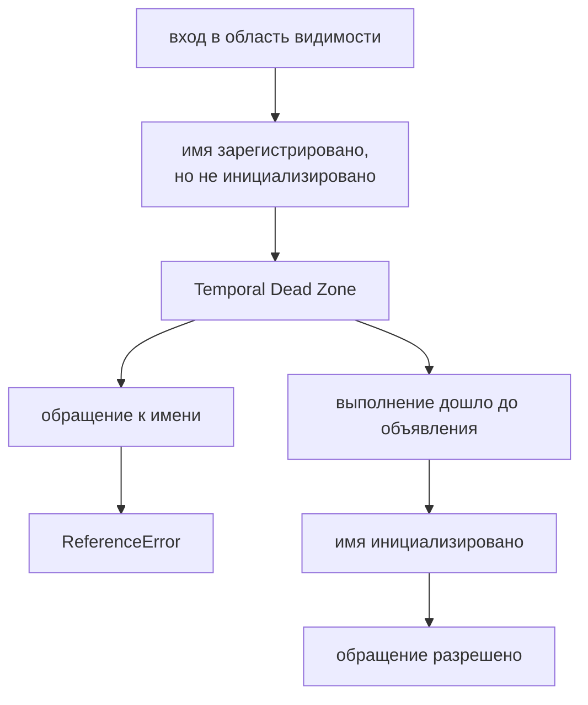

# Временная мёртвая зона

## Связь с предыдущей главой

Предыдущая глава объяснила Hoisting без мифа о переносе кода:

```text
Hoisting is NOT moving code.

Hoisting is the observable result
of the engine preparing declarations
during the Creation Phase.
```

Мы увидели важное различие:

Теперь появляется последний вопрос в этой цепочке:

> Если engine уже знает identifier `let` или `const`, почему access все равно запрещен?

Эта глава объясняет Temporal Dead Zone как естественное следствие уже изученной модели:

Главная модель главы:

```text
Имя уже существует.
Движок уже знает о нём.
Обращение временно запрещено — до инициализации.
```

---

## Предварительные требования

Для этой главы нужно понимать:

* что Execution Context имеет Creation Phase и Execution Phase;
* что Lexical Environment содержит Environment Record;
* что Hoisting — результат подготовки declarations during Creation Phase;
* что `let` и `const` registered during Creation Phase;
* что `let` и `const` are not initialized immediately;
* что `var` registered with `undefined`.

Не требуется знать Closures, modules, детали спецификации ECMAScript или optimization details. Эти темы будут изучаться позже.

---

## Время изучения

Ориентировочное время:

```text
Чтение главы:            100-130 минут
Разбор схем:              45-60 минут
Запуск примеров:          25-35 минут
Практика:                 90-120 минут
Повторение материала:     30 минут
```

Уровень сложности: **L3**.

L3 означает фундаментальный уровень: TDZ объясняет поведение `let` и `const` до initialization и завершает связку Creation Phase → Lexical Environment → Hoisting.

---

## Навигация

Предыдущая глава:

```text
docs/01-javascript/09-hoisting.md
```

Следующая глава:

```text
docs/01-javascript/11-primitive-types.md
```

Следующая глава начнет раздел о значения and types. Функции как отдельная большая тема будут изучаться позже в разделе Functions; в этой главе function declarations используются только как уже знакомое сравнение с `let`, `const` и `var`.

---

## Цели обучения

После изучения этой главы вы будете понимать:

* что такое Temporal Dead Zone;
* почему TDZ существует;
* почему `let` и `const` не нужно называть "not hoisted";
* чем registration отличается от initialization;
* когда TDZ begins;
* когда TDZ ends;
* как TDZ работает для `let`;
* как TDZ работает для `const`;
* почему `var` behaves differently;
* почему access before initialization дает ReferenceError;
* как читать TDZ errors в helper files;
* почему modern Playwright code предпочитает `const`;
* как избегать declaration order mistakes.

---

## Мотивация

Начнем с наблюдаемого поведения.

```javascript
// console.log(user);

let user = 'Anna';

console.log(user);
```

Если оставить код как есть, результат:

```text
Anna
```

Если раскомментировать первую строку:

```javascript
console.log(user);

let user = 'Anna';
```

программа завершится ошибкой:

```text
ReferenceError
```

Теперь сравним с `var`:

```javascript
console.log(user);

var user = 'Anna';
```

Результат:

```text
undefined
```

Вопрос:

Что отличается?

Не нужно отвечать "let не hoisted". Это неточно.

Более правильный вопрос:

> В каком состоянии находится identifier прямо сейчас?

---

## Теория

### Наблюдаемое поведение

Сначала посмотрим на три случая.

`var`:

```javascript
console.log(status);

var status = 'ready';
```

```text
undefined
```

`let`:

```javascript
// console.log(status);

let status = 'ready';
```

Если раскомментировать чтение до инициализации:

```text
ReferenceError
```

`const`:

```javascript
// console.log(baseUrl);

const baseUrl = 'https://example.com';
```

Если раскомментировать чтение до инициализации:

```text
ReferenceError
```

Наблюдение:

```text
var  до объявления  →  undefined     (ошибки нет, значение бессмысленное)
let  до объявления  →  ReferenceError (ошибка сразу, на первой же попытке)
```

### Почему простое объяснение «не поднимаются» неверно

Если сказать:

```text
let и const не поднимаются
```

то возникает неправильная модель: будто `let` и `const` вообще неизвестны движку до строки объявления.

Но это не та модель, которую мы строили в главе про подъём объявлений.

Более точная модель: имя зарегистрировано в фазе подготовки, но помечено как недоступное до инициализации.

То есть проблема не в том, что имя неизвестно. Проблема в его состоянии.

### Что такое временная мёртвая зона

Теперь можно ввести термин.

Временная мёртвая зона — период от начала области видимости до инициализации `let` или `const`, когда имя уже существует в записи окружения, но доступ к нему запрещён.

Важно:

```text
Мёртвая зона — не про перемещение кода.
Мёртвая зона — про состояние имени до инициализации.
```

### Почему существует TDZ

Она существует, чтобы нельзя было прочитать `let` и `const` до того, как программа явно задала им значение.

Без TDZ:

```text
чтение до инициализации вернуло бы undefined,
и тест упал бы где-то дальше — на сравнении или на запросе
```

С TDZ:

```text
чтение до инициализации останавливает программу на самой строке чтения
```

TDZ делает ошибки заметнее.

```javascript
// console.log(baseUrl);

const baseUrl = 'https://example.com';
```

Если `baseUrl` нужен до строки объявления, программа должна явно показать проблему, а не тихо вернуть `undefined`.

В каком состоянии имя прямо сейчас:

```text
имя baseUrl         — существует в записях окружения
значение            — ещё не задано
доступ на чтение    — запрещён до строки объявления
```

### Регистрация и инициализация

Регистрация:

```text
Engine creates identifier record.
```

Инициализация:

```text
Движок даёт имени первое пригодное значение.
```

Схема регистрации:

```text
Creation Phase:  userName зарегистрирован, значения нет, доступ запрещён
```

Схема инициализации:

```text
строка объявления:  userName  ──→  [ 'Anna' ]   доступ открыт
```

TDZ существует между этими двумя состояниями.

### Когда начинается мёртвая зона

Зона начинается, когда выполнение входит в область видимости, содержащую объявление `let` или `const`.

Для глобальной области:

```javascript
// console.log(user);

let user = 'Anna';
```

Временная шкала:

```text
начало программы     →  user зарегистрирован, TDZ началась
строка console.log   →  попытка чтения внутри TDZ → ReferenceError
строка let user      →  инициализация, TDZ закончилась бы здесь
```

Для области блока:

```javascript
if (true) {
  // console.log(status);

  let status = 'active';
}
```

Временная шкала:

```text
вход в блок          →  status зарегистрирован, TDZ началась
строка console.log   →  попытка чтения внутри TDZ → ReferenceError
строка let status    →  инициализация, TDZ закончилась
```

TDZ блока начинается не с начала программы, а со входа в сам блок.

### Когда заканчивается мёртвая зона

Зона заканчивается, когда выполнение доходит до объявления и происходит инициализация.

```javascript
let user = 'Anna';

console.log(user);
```

Временная шкала:

```text
начало scope       →  TDZ
строка let user    →  инициализация значением 'Anna', TDZ закончилась
строка console.log →  чтение разрешено, выводится 'Anna'
```

В каком состоянии это имя прямо сейчас:

```text
на момент console.log — имя существует, значение задано, доступ открыт
```

### Мёртвая зона для `let`

`let` можно объявить без осмысленного начального значения:

```javascript
let user;

console.log(user);
```

Результат:

```text
undefined
```

Почему это не ошибка временной мёртвой зоны?

Потому что выполнение дошло до строки объявления. Имя `user` было инициализировано, пусть и значением `undefined`.

Время жизни `let`:

```text
для `let user;`
регистрация  →  TDZ  →  строка объявления: инициализация значением undefined
```

Для `let user = 'Anna'`:

```text
регистрация  →  TDZ  →  строка объявления: инициализация значением 'Anna'
```

Разница только в том, какое значение получает имя: TDZ заканчивается в обоих
случаях на строке объявления.

### Мёртвая зона для `const`

`const` обязан получить значение при объявлении.

```javascript
const baseUrl = 'https://example.com';

console.log(baseUrl);
```

Время жизни `const` в этом примере:

```text
начало области │ имя baseUrl зарегистрировано, доступа НЕТ
строка const   │ имя инициализировано, доступ открыт
console.log    │ значение прочитано
```

Нельзя:

```javascript
// const baseUrl;
```

Это синтаксическая ошибка, потому что `const` требует инициализации прямо при объявлении.

TDZ для `const` похож на TDZ для `let`, но есть дополнительное правило: объявление без инициализации недопустимо вовсе — это ошибка синтаксиса, а не выполнения.

### Почему `var` ведёт себя иначе

`var` ведёт себя иначе, потому что фаза подготовки инициализирует его значением `undefined`.

```javascript
console.log(user);

var user = 'Anna';
```

Сравнение жизненного цикла:

| | `var` | `let` и `const` |
| --- | --- | --- |
| после фазы подготовки | `undefined` | доступа нет |
| чтение до объявления | возвращает `undefined` | `ReferenceError` |
| ошибка заметна | нет | сразу |

Именно поэтому:

```text
`var` прячет ошибку за значением undefined,
`let` и `const` показывают её на той строке, где она допущена
```

### Ошибка при обращении до инициализации

Когда код пытается обратиться к `let` или `const` до инициализации, движок выбрасывает `ReferenceError`.

```javascript
// console.log(user);

let user = 'Anna';
```

Если раскомментировать:

```text
ReferenceError: Cannot access 'user' before initialization
```

В каком состоянии имя прямо сейчас:

```text
имя user существует, но помечено как неинициализированное
```

Об этом говорит и текст ошибки: `cannot access 'user'`, а не `'user' is not defined`.

Это важный момент: `ReferenceError` здесь не означает, что движок вообще не знает имени. Он знает имя, но запрещает доступ к нему до инициализации.

### Лексическое окружение во время зоны

Во время зоны запись окружения уже содержит запись об имени.

Попытка обращения:

```text
имя найдено в Environment Record  →  запись не инициализирована  →  ReferenceError
```

Это отличается от случая, когда имени нет вовсе:

```text
имя не найдено ни в одном environment цепочки  →  ReferenceError
```

Обе ситуации дают `ReferenceError`, но причины разные:

| | до инициализации | имени нет вообще |
| --- | --- | --- |
| запись в окружении | есть | нет |
| текст ошибки | `Cannot access 'user' before initialization` | `user is not defined` |
| что исправлять | порядок строк | опечатку или отсутствующее объявление |

### Запись окружения до инициализации

Для кода:

```javascript
// console.log(user);

let user = 'Anna';
const role = 'admin';
var status = 'created';
```

До выполнения:

```text
user   → не инициализировано (доступ запрещён)
role   → не инициализировано (доступ запрещён)
status → undefined
```

До строки инициализации:

```text
чтение user   → ReferenceError
чтение role   → ReferenceError
чтение status → undefined
```

После строк инициализации:

```text
user   → 'Anna'
role   → 'admin'
status → 'created'
```

### Смена состояний имени

Смена состояний имени для `let` и `const`:

```text
зарегистрировано без значения  →  инициализировано  →  доступно
        ▲                              ▲
   начало области              строка объявления
```

Для `var` состояний на одно меньше: он получает `undefined` уже при регистрации,
поэтому «недоступного» периода у него нет.

Таблица сравнения:

| Объявление | Состояние в фазе подготовки | Обращение до строки | Инициализация |
| --- | --- | --- | --- |
| `var` | инициализировано как `undefined` | разрешено | строка присваивания |
| `let` | не инициализировано | `ReferenceError` | строка объявления |
| `const` | не инициализировано | `ReferenceError` | строка объявления |

### Полный фильм выполнения

Для кода:

```javascript
// console.log(user);

let user = 'Anna';
const role = 'admin';
var status = 'created';

console.log(user);
console.log(role);
console.log(status);
```

Фильм:

```text
подготовка   user и role заведены без доступа, status заведён как undefined
строка 1     let user = 'Anna'   — доступ к user открыт
строка 2     const role = 'admin' — доступ к role открыт
строка 3     var status = ...     — status получил 'created'
строки 4-6   все три имени читаются без ошибок
```

### Текущее место в модели JavaScript

Текущая позиция:

```text
Hoisting  →  записи об объявлениях готовятся заранее
TDZ       →  часть этих записей заранее недоступна
```

Полный путь:

```text
Execution Context → Creation Phase → Environment Record →
состояние записи → доступ разрешён или ReferenceError
```

Временная мёртвая зона достраивает объяснение подъёма `let` и `const`:

```text
Они зарегистрированы.
Они известны движку.
Они временно закрыты.
Они становятся пригодны после инициализации.
```

### Переход к функциям

Следующая большая группа тем постепенно приведёт к значениям, типам, операторам и функциям. Функции позже объяснят, как параметры, возвращаемые значения и вызовы создают новые ситуации, где важны область видимости и лексическое окружение.

Мост:

Функции как отдельная тема будут изучаться позже; сейчас достаточно помнить, что каждый вызов функции может создавать собственную среду выполнения.

---

Имя уже есть, но обращаться к нему ещё нельзя:


```mermaid
flowchart TD
    A["вход в область видимости"] --> B["имя зарегистрировано,<br/>но не инициализировано"]
    B --> C["Temporal Dead Zone"]
    C --> D["обращение к имени"]
    D --> E["ReferenceError"]
    C --> F["выполнение дошло до объявления"]
    F --> G["имя инициализировано"]
    G --> H["обращение разрешено"]
```

## Внутренний механизм

Механизм зоны на концептуальном уровне состоит из двух состояний имени:

```text
let / const │ зарегистрировано, НЕ инициализировано  →  обращение даёт ReferenceError
            │ инициализировано                        →  обращение разрешено

var         │ зарегистрировано и инициализировано как undefined с самого начала
```

Именно поэтому `typeof` не спасает: у имени в зоне уже есть состояние, и
обращение к нему — ошибка, а не «имя не найдено».

Временная мёртвая зона — не место в памяти. Это период выполнения, в котором у имени ограниченное состояние.

---

### Почему зона существует

```javascript
{
  // здесь baseUrl уже зарегистрирован, но обращаться нельзя
  const baseUrl = 'http://127.0.0.1:4310';
}
```

У `var` обращение до объявления даёт `undefined` — то есть ошибка превращается в
значение и проявляется позже. Зона делает это ошибкой сразу, в той строке, где
обращение написано.

### Что наблюдаемо

| Обращение | Результат |
| --- | --- |
| к `let`/`const` до объявления | `ReferenceError: Cannot access … before initialization` |
| `typeof` от имени в зоне | **тоже** `ReferenceError` |
| `typeof` от необъявленного имени | строка `'undefined'` |
| к `var` до объявления | `undefined` |

Вторая и третья строки вместе — единственный надёжный способ увидеть зону
изнутри кода: `typeof` защищает от необъявленного имени, но не от имени, которое
объявлено ниже.

`class` ведёт себя как `let`: обращение к классу выше его объявления даёт ту же
ошибку.

## Ментальная модель

### Забронированное парковочное место

`let` и `const` похожи на забронированное парковочное место.

Имя существует, но доступ запрещён.

### Запертая комната

Зона похожа на запертую комнату.

```text
Room exists.
Имя написано на двери.
Движок знает о комнате.
Дверь закрыта до инициализации.
```

### Запечатанная коробка

В записи окружения лежит запечатанная коробка.

Чтение до инициализации:

```text
коробка стоит на полке и подписана, но запечатана — открыть нельзя
```

После инициализации:

```text
на строке объявления печать снята: содержимое доступно
```

### Регистрация до разрешения

Зона живёт между регистрацией и разрешением доступа.

### Ожидание активации

Итоговая модель:

```text
Имя уже существует.
Движок уже знает о нём.
Обращение временно запрещено — до инициализации.
```

---

## Примеры кода

Примеры к этой главе находятся в папке:

```text
examples/01-javascript/chapter-10/
```

Запускайте их из корня проекта.

### Пример 1. Зона у `let`

Файл:

```text
examples/01-javascript/chapter-10/01-let-tdz.js
```

Показывает безопасный доступ после инициализации и содержит закомментированное небезопасное обращение.

### Пример 2. Зона у `const`

Файл:

```text
examples/01-javascript/chapter-10/02-const-tdz.js
```

Показывает, что `const` становится читаемым только после инициализации.

### Пример 3. Сравнение с `var`

Файл:

```text
examples/01-javascript/chapter-10/03-var-comparison.js
```

Показывает, что `var` читается как `undefined` до присваивания.

### Пример 4. Инициализация

Файл:

```text
examples/01-javascript/chapter-10/04-initialization.js
```

Показывает момент, когда объявление `let` без значения всё равно инициализирует имя значением `undefined`.

### Пример 5. Безопасный доступ

Файл:

```text
examples/01-javascript/chapter-10/05-safe-access.js
```

Показывает безопасный порядок: объявление раньше чтения.

### Пример 6. Типичные ошибки

Файл:

```text
examples/01-javascript/chapter-10/06-common-mistakes.js
```

Показывает типичные ошибки через комментарии и исправленный код.

---

## Частые вопросы

### `let` и `const` поднимаются?

Да, если под подъёмом понимать регистрацию в фазе подготовки. Но они не инициализируются, как `var`, поэтому доступ до инициализации запрещён.

### Почему тогда говорят «`let` не поднимается»?

Так иногда упрощают для новичков. В этой книге мы используем более точную модель: зарегистрирован, но не инициализирован.

### TDZ — это ошибка?

Нет. Это период. Ошибка появляется, если код пытается обратиться к имени в течение этого периода.

### Почему `var` не имеет TDZ в таком же смысле?

Потому что `var` инициализируется значением `undefined` в фазе подготовки, поэтому доступ до присваивания разрешён.

### Зона есть только в глобальной области?

Нет. Она действует для `let` и `const` в их области: глобальной, функции или блока.

---

## Распространённые мифы

### Миф 1. `let` и `const` не поднимаются

Реальность:

Они регистрируются в фазе подготовки, но доступ запрещён до инициализации.

### Миф 2. `ReferenceError` значит, что движок не знает имени

Реальность:

В зоне движок знает имя, но запрещает доступ, потому что оно не инициализировано.

### Миф 3. TDZ — это физическая зона в памяти

Реальность:

Зона — это период между регистрацией и инициализацией.

### Миф 4. `let user;` остаётся в зоне навсегда, пока нет значения

Реальность:

Когда выполнение доходит до `let user;`, имя инициализируется значением `undefined`, и зона заканчивается.

---

## Распространённые ошибки

### Ошибка 1. Читать `let` до строки объявления

Неправильный код:

```javascript
// console.log(user);

let user = 'Anna';
```

Что произошло:

Обращение до инициализации выбросило бы `ReferenceError`.

Исправленный вариант:

```javascript
let user = 'Anna';

console.log(user);
```

### Ошибка 2. Ожидать `undefined` от `const`

Неправильная модель:

```text
const before initialization behaves like var.
```

Реальность:

`const` зарегистрирован, но не инициализирован до строки объявления.

Исправленный вариант:

```javascript
const baseUrl = 'https://example.com';

console.log(baseUrl);
```

### Ошибка 3. Говорить «не поднимается»

Неправильная формулировка:

```text
let и const не поднимаются.
```

Исправленная формулировка:

```text
let и const регистрируются в фазе подготовки,
но обращение до инициализации запрещено.
```

### Ошибка 4. Путать отсутствующее имя и временную мёртвую зону

Отсутствующее имя:

```javascript
// console.log(unknownUser);
```

TDZ:

```javascript
// console.log(user);

let user = 'Anna';
```

Оба случая дают `ReferenceError`, но причины разные.

---

## Практическое использование

Правило для чтения кода: увидев ошибку с формулировкой `cannot access before initialization`, ищите объявление **ниже** по тексту — имя существует, но ещё недоступно.

Порядок анализа:

```text
1. Найдите scope.
2. Найдите let/const declaration.
3. Определите начало scope.
4. От начала scope до declaration line — TDZ.
5. После declaration line — identifier initialized.
```

Таблица анализа:

```text
Identifier | Scope starts | Declaration line | Before line state | After line state
-----------|--------------|------------------|-------------------|-----------------
user       | line 1       | line 4           | TDZ               | initialized
baseUrl    | line 1       | line 6           | TDZ               | initialized
status     | line 1       | line 8 var       | undefined         | assigned later
```

Практическое правило:

```text
Declare before read.
Инициализируйте до использования.
Выбирайте const, когда переприсваивание не нужно.
Берите let только там, где состояние меняется.
```

---

## Использование в Automation QA

### Почему в современном коде тестов предпочитают `const`

В тестах значения часто не должны переназначаться:

```javascript
const baseUrl = 'https://example.com';
const expectedStatus = 'active';
```

`const` делает намерение явным:

```text
Это имя инициализировано здесь.
Это имя не будет переприсвоено.
```

Временная мёртвая зона помогает: обращение до инициализации падает громко, а не возвращает тихий `undefined`.

### Как правильно читать `ReferenceError`

Если вспомогательная функция Playwright падает с сообщением:

```text
ReferenceError: Cannot access 'baseUrl' before initialization
```

Это не значит:

```text
baseUrl не существует нигде.
```

Более точная модель:

```text
baseUrl is registered.
baseUrl is in TDZ.
Код читает его до инициализации.
```

### Чтение таких ошибок во вспомогательных файлах

Ошибка часто выглядит так:

```javascript
// const loginUrl = baseUrl + '/login';

const baseUrl = 'https://example.com';
```

Проблема — порядок объявлений.

Исправление:

```javascript
const baseUrl = 'https://example.com';
const loginUrl = baseUrl + '/login';
```

### Как избегать ошибок в порядке объявлений

В коде тестов лучше располагать зависимости до места использования:

Так и читатель, и движок видят инициализированные значения раньше обращения.

---

## Итоги

Временная мёртвая зона объясняет, почему `let` и `const` известны движку, но недоступны до инициализации.

Главная модель:

```text
Имя уже существует.
Движок уже знает о нём.
Обращение временно запрещено — до инициализации.
```

Зона начинается, когда область видимости стартует и имя зарегистрировано, но ещё не инициализировано. Заканчивается, когда выполнение доходит до строки объявления и происходит инициализация.

`var` ведёт себя иначе, потому что инициализируется значением `undefined` во время фазы подготовки.

Не говорите, что `let` и `const` «не поднимаются». Более точная модель: они регистрируются в фазе подготовки, но доступ до инициализации запрещён.

---

## Что нужно запомнить

✓ Временная мёртвая зона — это период, а не место в памяти.

✓ Зона начинается при старте области видимости.

✓ Зона заканчивается при инициализации.

✓ `let` и `const` регистрируются в фазе подготовки.

✓ `let` и `const` не инициализируются сразу.

✓ Обращение до инициализации выбрасывает `ReferenceError`.

✓ `var` инициализируется значением `undefined` в фазе подготовки.

✓ `let user;` завершает TDZ, когда выполняется строка объявления.

✓ `const` обязан быть инициализирован при объявлении.

✓ Не говорите, что `let` и `const` «не поднимаются».

---

## Проверьте себя

1. Что такое временная мёртвая зона?

2. Почему TDZ существует?

3. Когда зона начинается?

4. Когда зона заканчивается?

5. Что значит регистрация?

6. Что значит инициализация?

7. Почему обращение к `let` до инициализации даёт `ReferenceError`?

8. Почему обращение к `const` до инициализации даёт `ReferenceError`?

9. Почему `var` ведёт себя иначе?

10. Почему фраза «`let` и `const` не поднимаются» неточная?

### Ответы

1. Промежуток от входа в область видимости до строки объявления `let` или `const`, в котором имя уже существует, но доступ к нему запрещён.
2. Чтобы чтение значения до его задания было ошибкой, а не тихим `undefined`. Ошибка возникает там, где допущена, а не проявляется позже искажённым результатом.
3. При входе в область видимости, содержащую объявление: для глобальных имён — в начале программы, для имён блока — при входе в блок.
4. На строке объявления, когда происходит инициализация. С этого момента имя можно читать.
5. Имя заведено в записях окружения. Движок знает о его существовании, но значения у него ещё нет.
6. Имени впервые сопоставлено значение. Только после этого чтение разрешено.
7. Запись существует, но помечена как неинициализированная, и движок запрещает доступ. Текст ошибки это и говорит: `cannot access ... before initialization`.
8. По той же причине: запись заведена без значения. Дополнительно `const` требует задать значение прямо в объявлении.
9. `var` инициализируется при подготовке значением `undefined`, поэтому запрета на чтение нет — есть бессмысленный результат.
10. Регистрация у них происходит так же заранее, как у `var`. Отличается не регистрация, а состояние записи: она заведена, но недоступна. Фраза «не поднимаются» подсказывает, будто имя вообще неизвестно, — и тогда непонятно, почему ошибка говорит о доступе, а не об отсутствии.

---

## Практика

Практика к этой главе находится в файле:

```text
practice/01-javascript/10-temporal-dead-zone.md
```

Перед практикой запустите примеры из раздела «Примеры кода» и для каждого имени выпишите состояние: зарегистрировано, не инициализировано, инициализировано, доступно для чтения.

---

## Решения

Решения находятся в файле:

```text
solutions/01-javascript/10-temporal-dead-zone.md
```

Открывайте решения после самостоятельной попытки. В этой главе важно сравнивать не только вывод, но и состояние имени на каждой строке.
