# Primitive Types

## Связь с предыдущей главой

Предыдущие главы объяснили, как JavaScript Engine выполняет программу:

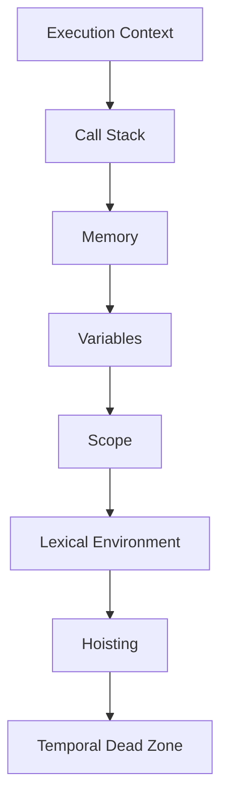

Теперь начинается новый блок:

> С какими значения работает JavaScript?

До этого мы говорили, что engine хранит информацию, identifiers дают named access, Scope определяет visibility, а Lexical Environment помогает lookup. Но сама информация тоже бывает разной.

```javascript
const age = 30;
const userName = 'Anna';
const isActive = true;
```

Вопрос:

> С каким видом значения engine работает прямо сейчас?

Эта глава вводит primitive значения — фундаментальные, indivisible значения JavaScript. Objects будут изучаться отдельно в следующих главах.

---

## Предварительные требования

Для этой главы нужно понимать:

* что value — информация, с которой работает программа;
* что variable дает named access к value;
* что `const` запрещает reassignment identifier;
* что `let` позволяет reassignment;
* что engine работает с значения during execution;
* что `console.log` выводит переданное value.

Не требуется знать Object Type internals, References, Stack & Heap, Garbage Collector, Object wrappers, Prototype или Classes. Эти темы будут изучаться позже.

---

## Время изучения

Ориентировочное время:

```text
Чтение главы:            90-120 минут
Разбор схем:             35-45 минут
Запуск примеров:         20-30 минут
Практика:                80-110 минут
Повторение материала:    25 минут
```

Уровень сложности: **L2-L3**.

Тема выглядит простой, но ошибки с `null`, `undefined`, `typeof`, number значения and string значения часто приводят к неверным assertions in Automation QA.

---

## Навигация

Предыдущая глава:

```text
docs/01-javascript/10-temporal-dead-zone.md
```

Следующая глава:

```text
docs/01-javascript/12-object-type.md
```

Следующая глава объяснит Object Type. Objects are different from primitive значения and will be studied separately.

---

## Цели обучения

После изучения этой главы вы будете понимать:

* что такое value;
* почему JavaScript делит значения на primitive and object значения;
* что primitive значения are fundamental indivisible значения;
* как работают Number, String, Boolean, Undefined, Null, Symbol and BigInt;
* что показывает `typeof`;
* почему primitive значения immutable;
* почему `const` and primitive immutability are different ideas;
* какие misconceptions встречаются чаще всего;
* как primitive значения используются in assertions;
* как читать JSON primitive значения;
* как выбирать correct assertion types in Automation QA.

---

## Мотивация

Начнем с наблюдаемого поведения.

```javascript
const age = 30;

console.log(age);
```

Результат:

```text
30
```

Что произошло?

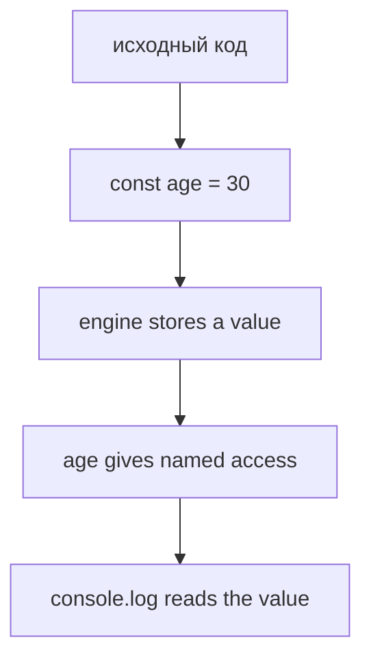

Но что такое `30` для engine?

Теперь другой код:

```javascript
const userName = 'Anna';
const isActive = true;
const deletedAt = null;
```

Все это значения, но они are not the same kind of value.

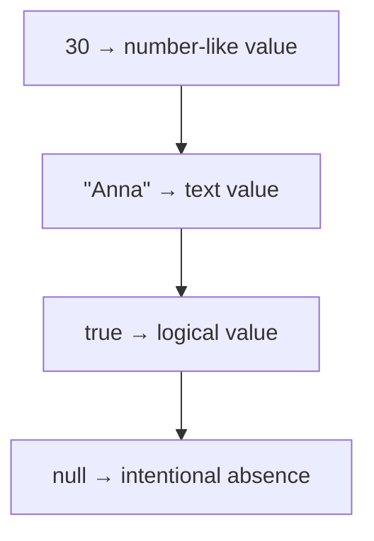

Если automation test получает API response, difference matters:

```json
{
  "age": 30,
  "name": "Anna",
  "active": true,
  "deletedAt": null
}
```

Тест должен понимать, какие значения он сравнивает. Иначе assertion может быть формально написан, но смысл проверки будет неправильным.

Главный вопрос главы:

> С каким видом значения engine работает прямо сейчас?

---

## Теория

### Что такое value

Value — конкретная информация, с которой работает JavaScript program.

```javascript
const testName = 'login';
const retryCount = 2;
const isPassed = true;
```

Здесь значения:

```text
"login"
2
true
```

Variable names:

```text
testName
retryCount
isPassed
```

Не путайте:

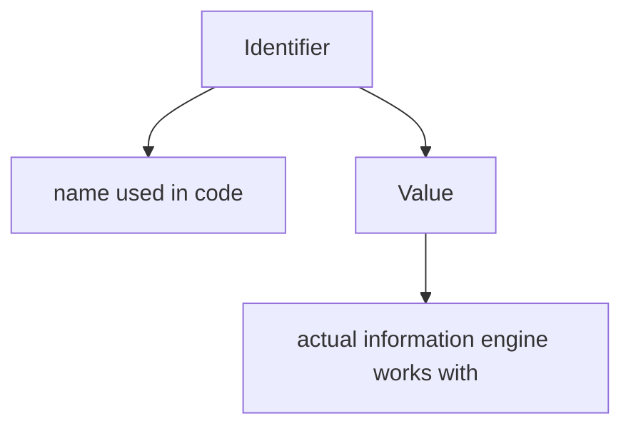

Что engine делает прямо сейчас:

```text
Engine reads a value.
Engine stores a value.
Engine compares a value.
Engine passes a value to console.log or assertion.
```

### Почему JavaScript делит значения на primitive and object значения

JavaScript значения делятся на две большие группы:

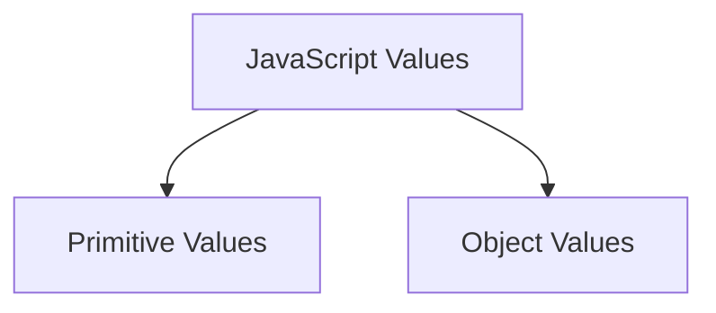

Диаграмма value hierarchy:

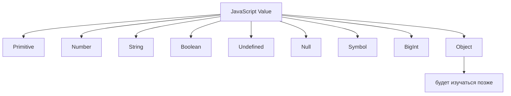

Почему деление важно:

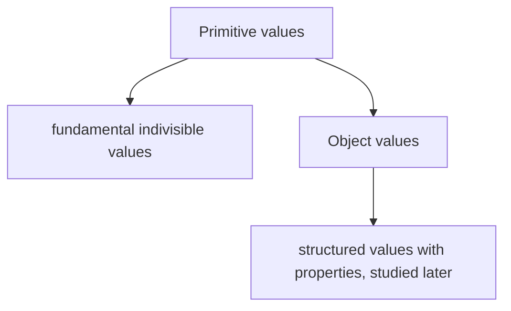

Objects, arrays, functions, dates and references will be studied later. Сейчас важно понять primitive значения before structured значения.

### Primitive vs Object overview

Primitive значения are atomic for our current mental model.

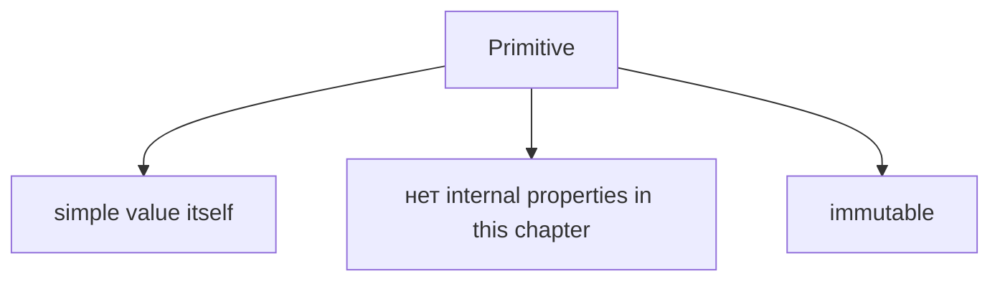

Object значения are different:

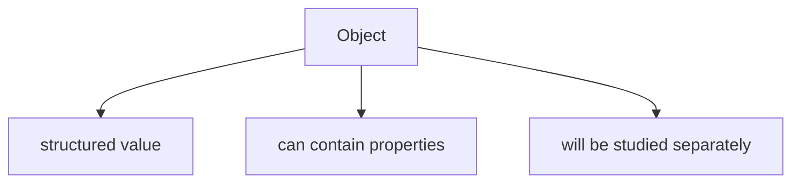

Не нужно сейчас объяснять objects через memory, references or heap. Это будущие главы.

Сейчас достаточно:

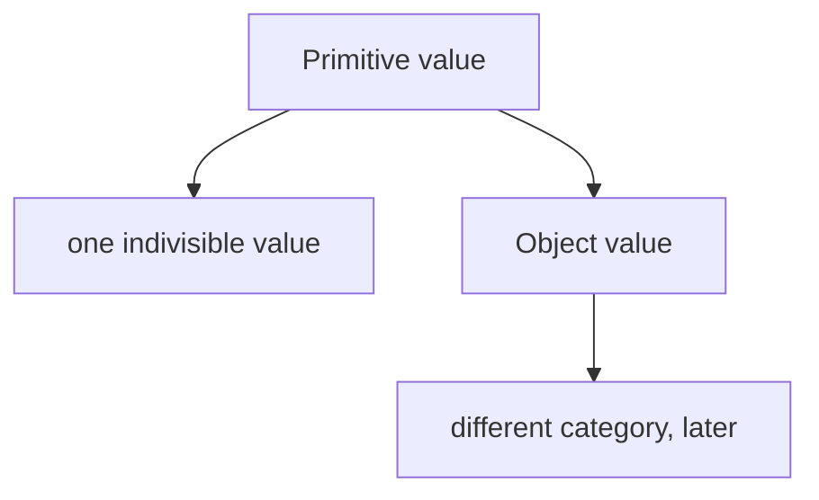

### Primitive categories

JavaScript has seven primitive types:

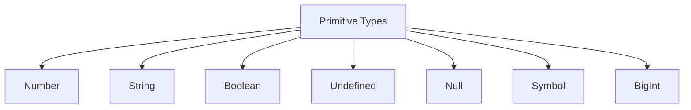

Каждый отвечает на свой вопрос:

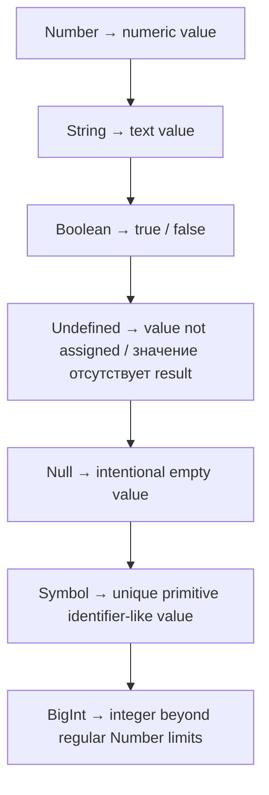

### Number

Number — primitive type для numeric значения.

```javascript
const age = 30;
const price = 19.99;
const retryCount = 2;
```

Диаграмма Number:

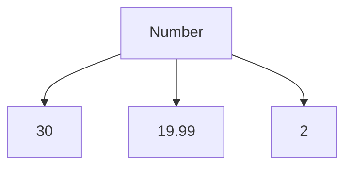

JavaScript uses Number for integers and fractional значения.

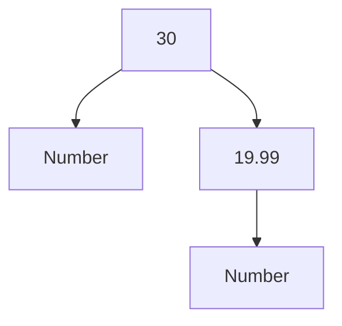

Special numeric значения like `NaN` and `Infinity` exist, but detailed number поведение will be studied later with operators and comparisons.

Automation QA:

```javascript
const expectedStatusCode = 200;
const actualStatusCode = 200;
```

Если API returns status code as number, assertion should compare number with number, not string with number.

### String

String — primitive type для text значения.

```javascript
const userName = 'Anna';
const baseUrl = 'https://example.com';
const status = 'active';
```

Диаграмма String:

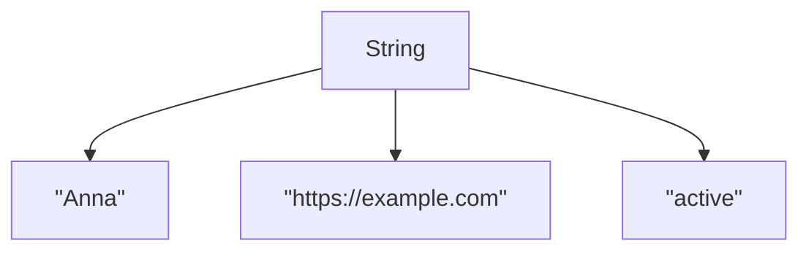

String value is text.

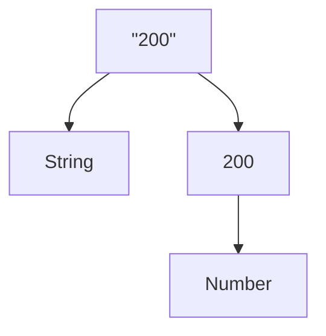

Это разные значения.

В Automation QA это часто важно:

```javascript
const statusCodeFromText = '200';
const statusCodeFromResponse = 200;
```

Они look similar, but they are different primitive types.

### Boolean

Boolean — primitive type with only two значения:

```text
true
false
```

Примеры:

```javascript
const isActive = true;
const isDeleted = false;
```

Диаграмма Boolean:

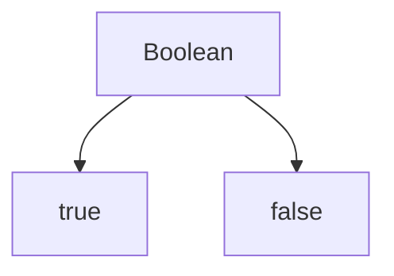

Boolean значения are used for yes/no, enabled/disabled, passed/failed, exists/not exists.

Automation QA:

```javascript
const expectedIsActive = true;
const actualIsActive = true;
```

Do not compare boolean with string `"true"` unless API really returns string.

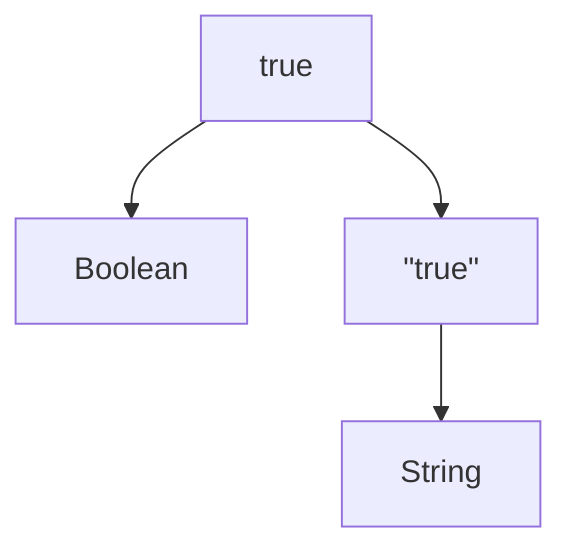

### Undefined

`undefined` — primitive value that often means value was not assigned or result is missing.

```javascript
let userName;

console.log(userName);
```

Результат:

```text
undefined
```

Диаграмма Undefined:

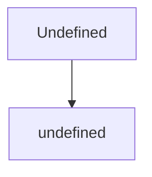

There is one `undefined` value.

Common situation:

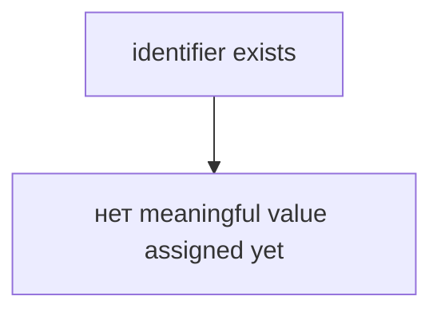

Automation QA:

```javascript
const responseField = undefined;
```

If a поле is `undefined`, it may mean the поле was not present or was not assigned. JSON itself does not represent `undefined`; JSON details will be studied later with API testing.

### Null

`null` — primitive value for intentional absence.

```javascript
const deletedAt = null;
```

Диаграмма Null:

```mermaid
flowchart TD
    N1["Null"]
    N2["null"]
    N1 --> N2
```

Разница:

```mermaid
flowchart TD
    N1["undefined"]
    N2["value значение отсутствует / not assigned"]
    N3["null"]
    N4["intentionally empty"]
    N1 --> N2
    N1 --> N3
    N3 --> N4
```

Automation QA:

```json
{
  "deletedAt": null
}
```

This usually means system intentionally says: there is no deletion date.

Важное замечание про `typeof`:

```javascript
typeof null;
```

возвращает:

```text
object
```

This is a historical JavaScript поведение. It does not mean `null` is an object. `null` is a primitive value.

### Symbol

Symbol — primitive type for unique значения.

```javascript
const firstId = Symbol('id');
const secondId = Symbol('id');
```

Even with same description, symbols are different:

```text
Symbol("id") !== Symbol("id")
```

Диаграмма Symbol:

```mermaid
flowchart TD
    N1["Symbol"]
    N2["unique value #1"]
    N3["unique value #2"]
    N1 --> N2
    N1 --> N3
```

Symbol is less common in everyday Automation QA code than Number, String, Boolean, Null and Undefined. Но его нужно знать как часть primitive types.

Object property symbols and advanced use cases will be studied later with objects.

### BigInt

BigInt — primitive type for very large integers.

```javascript
const largeId = 9007199254740993n;
```

`n` at the end marks BigInt literal.

Диаграмма BigInt:

```mermaid
flowchart TD
    N1["BigInt"]
    N2["9007199254740993n"]
    N1 --> N2
```

BigInt is not the same as Number:

```mermaid
flowchart TD
    N1["10"]
    N2["Number"]
    N3["10n"]
    N4["BigInt"]
    N1 --> N2
    N1 --> N3
    N3 --> N4
```

Automation QA:

BigInt can appear around very large IDs, but many APIs send large IDs как строки to avoid precision problems.

Detailed numeric limits and conversions will be studied later.

### typeof

`typeof` returns a string describing the type category of a value.

```javascript
typeof 30;
typeof 'Anna';
typeof true;
```

Диаграмма typeof results:

```text
Value       | typeof result
------------|--------------
30          | "number"
"Anna"      | "string"
true        | "boolean"
undefined   | "undefined"
null        | "object"
Symbol()    | "symbol"
10n         | "bigint"
```

Важно:

```text
typeof null === "object"
```

This is historical поведение. In the mental model of this chapter:

```text
null is primitive
typeof null is "object"
```

Do not use `typeof null` as proof that null is object.

### Primitive immutability

Primitive значения are immutable.

This means the value itself cannot be changed.

```javascript
const userName = 'Anna';
```

The string value `'Anna'` cannot be modified internally.

If you create another value:

```javascript
const upperName = 'ANNA';
```

You now have another string value.

Диаграмма primitive immutability:

```mermaid
flowchart TD
    N1["&quot;Anna&quot;"]
    N2["immutable primitive value"]
    N3["&quot;ANNA&quot;"]
    N4["different primitive value"]
    N1 --> N2
    N1 --> N3
    N3 --> N4
```

Do not confuse:

```mermaid
flowchart TD
    N1["const"]
    N2["prevents reassignment of identifier"]
    N3["primitive immutability"]
    N4["value itself cannot be changed"]
    N1 --> N2
    N1 --> N3
    N3 --> N4
```

With `let`:

```javascript
let status = 'created';
status = 'ready';
```

The primitive value `'created'` was not mutated into `'ready'`. The identifier `status` now points to a different primitive value.

```mermaid
flowchart TD
    N1["status → &quot;created&quot;"]
    N2["status → &quot;ready&quot;"]
    N1 --> N2
```

### Labels pointing to значения

Use the mental model from Variables carefully:

```mermaid
flowchart TD
    N1["identifier"]
    N2["primitive value"]
    N1 --> N2
```

Пример:

```javascript
const status = 'active';
```

Схема:

```mermaid
flowchart TD
    N1["status"]
    N2["&quot;active&quot;"]
    N3["String primitive"]
    N1 --> N2
    N2 --> N3
```

If reassignment is allowed:

```javascript
let status = 'created';
status = 'active';
```

Схема:

```mermaid
flowchart TD
    N1["Before"]
    N2["status → &quot;created&quot;"]
    N3["After"]
    N4["status → &quot;active&quot;"]
    N2 --> N3
    N1 --> N2
    N3 --> N4
```

Primitive value did not change. The label now refers to another primitive value.

### Текущее место в модели JavaScript

Теперь курс переходит от execution model к value model.

```mermaid
flowchart TD
    N1["выполнение model"]
    N2["Engine"]
    N3["Execution Context"]
    N4["Call Stack"]
    N5["Memory"]
    N6["Variables"]
    N7["Scope"]
    N8["Lexical Environment"]
    N9["Hoisting"]
    N10["TDZ"]
    N11["Value model"]
    N12["Primitive Types starts here"]
    N1 --> N2
    N1 --> N3
    N1 --> N4
    N1 --> N5
    N1 --> N6
    N1 --> N7
    N1 --> N8
    N1 --> N9
    N1 --> N10
    N1 --> N11
    N11 --> N12
```

Current position:

```mermaid
flowchart TD
    N1["JavaScript works with values"]
    N2["Primitive Values"]
    N3["Object Values"]
    N1 --> N2
    N1 --> N3
```

Эта глава:

```mermaid
flowchart TD
    N1["Primitive Values"]
    N2["Number"]
    N3["String"]
    N4["Boolean"]
    N5["Undefined"]
    N6["Null"]
    N7["Symbol"]
    N8["BigInt"]
    N1 --> N2
    N1 --> N3
    N1 --> N4
    N1 --> N5
    N1 --> N6
    N1 --> N7
    N1 --> N8
```

### Переход к Object Type

Primitive значения are fundamental indivisible значения.

Objects are different.

```mermaid
flowchart TD
    N1["Primitive"]
    N2["indivisible value"]
    N3["Object"]
    N4["structured value with properties"]
    N1 --> N2
    N1 --> N3
    N3 --> N4
```

Do not try to explain object поведение through primitive rules.

Next chapter will answer:

> Каким видом значения является object и почему он ведёт себя иначе?

### Complete primitive overview

```mermaid
flowchart TD
    N1["Primitive Values"]
    N2["Number"]
    N3["30, 19.99"]
    N4["String"]
    N5["&quot;Anna&quot;, &quot;active&quot;"]
    N6["Boolean"]
    N7["true, false"]
    N8["Undefined"]
    N9["undefined"]
    N10["Null"]
    N11["null"]
    N12["Symbol"]
    N13["Symbol(&quot;id&quot;)"]
    N14["BigInt"]
    N15["10n"]
    N1 --> N2
    N1 --> N3
    N1 --> N4
    N1 --> N5
    N1 --> N6
    N1 --> N7
    N1 --> N8
    N1 --> N9
    N1 --> N10
    N1 --> N11
    N1 --> N12
    N1 --> N13
    N1 --> N14
    N14 --> N15
```

---

## Внутренний механизм

At this stage we keep the mechanism conceptual.

When engine sees a literal:

```javascript
const age = 30;
```

It works with a Number primitive value.

```mermaid
flowchart TD
    N1["исходный код"]
    N2["literal 30"]
    N3["Number primitive value"]
    N4["identifier age gives named access"]
    N1 --> N2
    N2 --> N3
    N3 --> N4
```

When engine sees:

```javascript
const userName = 'Anna';
```

It works with a String primitive value.

```mermaid
flowchart TD
    N1["literal &quot;Anna&quot;"]
    N2["String primitive value"]
    N1 --> N2
```

When engine compares primitive значения, it сравнивает значения themselves. Equality details will be studied later, but the basic mental model is:

```mermaid
flowchart TD
    N1["Primitive comparison"]
    N2["compare primitive values"]
    N1 --> N2
```

С каким видом значения engine работает прямо сейчас:

```mermaid
flowchart TD
    N1["30 → Number"]
    N2["&quot;Anna&quot; → String"]
    N3["true → Boolean"]
    N4["undefined → Undefined"]
    N5["null → Null"]
    N6["Symbol() → Symbol"]
    N7["10n → BigInt"]
    N1 --> N2
    N2 --> N3
    N3 --> N4
    N4 --> N5
    N5 --> N6
    N6 --> N7
```

No memory layout, Stack & Heap, wrappers or references are needed for this chapter.

---

## Ментальная модель

### Atoms

Primitive значения are like atoms in the current model.

```mermaid
flowchart TD
    N1["Primitive atom"]
    N2["indivisible value"]
    N1 --> N2
```

Примеры:

```text
30
"Anna"
true
null
```

### Indivisible значения

Primitive value is not a structure you open in this chapter.

```mermaid
flowchart TD
    N1["&quot;active&quot;"]
    N2["one string primitive value"]
    N1 --> N2
```

Objects will be different.

### Immutable значения

Primitive значения do not change internally.

```mermaid
flowchart TD
    N1["&quot;created&quot;"]
    N2["immutable"]
    N3["&quot;ready&quot;"]
    N4["another immutable value"]
    N1 --> N2
    N1 --> N3
    N3 --> N4
```

### Labels pointing to значения

Variables are labels pointing to primitive значения.

```mermaid
flowchart TD
    N1["expectedStatus"]
    N2["&quot;active&quot;"]
    N3["String primitive"]
    N1 --> N2
    N2 --> N3
```

### Catalog of value types

Think of primitive types as catalog categories.

```mermaid
flowchart TD
    N1["Catalog"]
    N2["Number shelf"]
    N3["String shelf"]
    N4["Boolean shelf"]
    N5["Undefined shelf"]
    N6["Null shelf"]
    N7["Symbol shelf"]
    N8["BigInt shelf"]
    N1 --> N2
    N1 --> N3
    N1 --> N4
    N1 --> N5
    N1 --> N6
    N1 --> N7
    N1 --> N8
```

When reading code, classify the value:

```text
What kind of value is this?
```

---

## Примеры кода

Примеры к этой главе находятся в папке:

```text
examples/01-javascript/chapter-11/
```

Запускайте их из корня проекта.

### Пример 1. Number

Файл:

```text
examples/01-javascript/chapter-11/01-number.js
```

Показывает Number значения in test-like data.

### Пример 2. String

Файл:

```text
examples/01-javascript/chapter-11/02-string.js
```

Показывает String значения.

### Пример 3. Boolean

Файл:

```text
examples/01-javascript/chapter-11/03-boolean.js
```

Показывает Boolean значения for flags.

### Пример 4. Null and Undefined

Файл:

```text
examples/01-javascript/chapter-11/04-null-undefined.js
```

Показывает difference between `null` and `undefined`.

### Пример 5. Symbol and BigInt

Файл:

```text
examples/01-javascript/chapter-11/05-symbol-bigint.js
```

Показывает less common primitive значения.

### Пример 6. typeof

Файл:

```text
examples/01-javascript/chapter-11/06-typeof.js
```

Показывает `typeof` results, including historical `typeof null`.

---

## Частые вопросы

### Primitive value — это просто маленькое значение?

Нет. Primitive means fundamental indivisible value category. String can be long, but still primitive.

### `null` — object?

Нет. `null` является primitive. `typeof null` возвращает `"object"` из-за исторического поведения JavaScript.

### `undefined` и `null` одно и то же?

Нет. `undefined` often means not assigned / missing. `null` usually means intentional absence.

### `const` делает primitive immutable?

Primitive значения immutable by nature. `const` prevents reassignment of identifier. Это разные идеи.

### Нужно ли часто использовать Symbol and BigInt in tests?

Не часто. But they are part of the language and may appear in libraries, IDs or advanced code.

---

## Распространенные мифы

### Миф 1. Primitive значения are stored like small objects

Реальность:

Do not explain primitives through objects. Objects are different and will be studied later.

### Миф 2. `typeof null` proves null is object

Реальность:

`typeof null` returns `"object"`, but `null` is primitive.

### Миф 3. `const status = "active"` means string became protected by const

Реальность:

String primitive is immutable already. `const` protects identifier from reassignment.

### Миф 4. `"200"` and `200` are basically same

Реальность:

They may look similar, but one is String and one is Number.

---

## Типичные ошибки

### Ошибка 1. Comparing number with string

Неправильная модель:

```text
"200" and 200 mean same status code.
```

Что произошло:

Types are different.

Исправленный подход:

```javascript
const expectedStatusCode = 200;
const actualStatusCode = 200;
```

### Ошибка 2. Treating null and undefined as identical

Неправильная модель:

```text
null and undefined both mean nothing, so they are same.
```

Исправленная модель:

```mermaid
flowchart TD
    N1["undefined → not assigned / значение отсутствует"]
    N2["null → intentional absence"]
    N1 --> N2
```

### Ошибка 3. Trusting typeof null too much

Неправильный вывод:

```text
typeof null is "object", so null is object.
```

Исправленный вывод:

```text
typeof null is historical behavior.
null is primitive.
```

### Ошибка 4. Confusing reassignment with mutation

Код:

```javascript
let status = 'created';
status = 'ready';
```

Что произошло:

Identifier now refers to another primitive value. The string `'created'` was not mutated.

---

## Практическое использование

When reading code, classify значения:

```text
1. Is this value primitive or object?
2. If primitive, which primitive type?
3. Does assertion compare same kind of values?
4. Is absence represented as null or undefined?
5. Does typeof give expected result?
```

Таблица:

```text
Value       | Type category | typeof
------------|---------------|----------
200         | Number        | "number"
"200"       | String        | "string"
true        | Boolean       | "boolean"
undefined   | Undefined     | "undefined"
null        | Null          | "object"
10n         | BigInt        | "bigint"
Symbol()    | Symbol        | "symbol"
```

Practical rule:

```text
Assertions should compare values intentionally,
not only visually similar output.
```

---

## Использование в Automation QA

### Expected значения in assertions

Assertions often compare primitive значения:

```javascript
const expectedStatus = 'active';
const actualStatus = 'active';
```

Both are String primitive значения.

```mermaid
flowchart TD
    N1["expectedStatus → &quot;active&quot;"]
    N2["actualStatus → &quot;active&quot;"]
    N1 --> N2
```

### API response validation

API response значения may be numbers, strings, booleans or null.

```javascript
const expectedStatusCode = 200;
const expectedIsActive = true;
const expectedDeletedAt = null;
```

QA engineer should know what kind of value is expected.

### Comparing primitive значения

Before comparing:

```mermaid
flowchart TD
    N1["expected value type"]
    N2["actual value type"]
    N3["comparison makes sense?"]
    N1 --> N2
    N2 --> N3
```

Do not compare:

```text
expected: 200
actual: "200"
```

unless the system intentionally returns string.

### Test data preparation

Good test data shows value type through naming:

```javascript
const expectedUserName = 'Anna';
const expectedAge = 30;
const expectedIsActive = true;
const expectedDeletedAt = null;
```

### Reading JSON значения

JSON commonly contains:

```json
{
  "name": "Anna",
  "age": 30,
  "active": true,
  "deletedAt": null
}
```

These correspond to primitive значения in JavaScript after parsing. `undefined` is not a JSON value.

### Choosing correct assertion types

Assertion should match type intent:

```mermaid
flowchart TD
    N1["status code"]
    N2["Number"]
    N3["user name"]
    N4["String"]
    N5["active flag"]
    N6["Boolean"]
    N7["deleted date absence"]
    N8["Null"]
    N1 --> N2
    N1 --> N3
    N3 --> N4
    N3 --> N5
    N5 --> N6
    N5 --> N7
    N7 --> N8
```

This prevents false confidence in tests.

---

## Итоги

Primitive значения are the fundamental indivisible значения of JavaScript.

JavaScript значения divide into:

```mermaid
flowchart TD
    N1["JavaScript Values"]
    N2["Primitive Values"]
    N3["Object Values"]
    N1 --> N2
    N1 --> N3
```

Эта глава изучила примитивные значения:

```text
Number
String
Boolean
Undefined
Null
Symbol
BigInt
```

Primitive значения are immutable. Reassignment changes which value an identifier refers to; it does not mutate the primitive value itself.

Objects are different and will be studied separately in the next chapter.

---

## Что нужно запомнить

✓ Value is the actual information JavaScript works with.

✓ Primitive значения are fundamental indivisible значения.

✓ JavaScript has primitive значения and object значения.

✓ Number represents numeric значения.

✓ String represents text значения.

✓ Boolean has only `true` and `false`.

✓ `undefined` often means not assigned / missing.

✓ `null` usually means intentional absence.

✓ `Symbol` creates unique primitive значения.

✓ `BigInt` represents large integer значения.

✓ `typeof null` returns `"object"`, but `null` is primitive.

✓ Primitive значения are immutable.

---

## Проверьте себя

1. Что такое value?

2. Почему JavaScript divides значения into primitive and object значения?

3. Какие primitive types есть в JavaScript?

4. Чем Number отличается от String?

5. Чем Boolean отличается от string `"true"`?

6. Чем `undefined` отличается от `null`?

7. Почему `typeof null` can be confusing?

8. Что означает primitive immutability?

9. Почему `"200"` и `200` не одно и то же?

10. Почему objects will be studied separately?

---

## Практика

Практика к этой главе находится в файле:

```text
practice/01-javascript/11-primitive-types.md
```

Перед практикой запустите примеры из `examples/01-javascript/chapter-11/` и для каждого value запишите primitive type and `typeof` result.

---

## Решения

Решения находятся в файле:

```text
solutions/01-javascript/11-primitive-types.md
```

Открывайте решения после самостоятельной попытки. В этой главе важно сравнивать не только вывод, но и kind of value.
