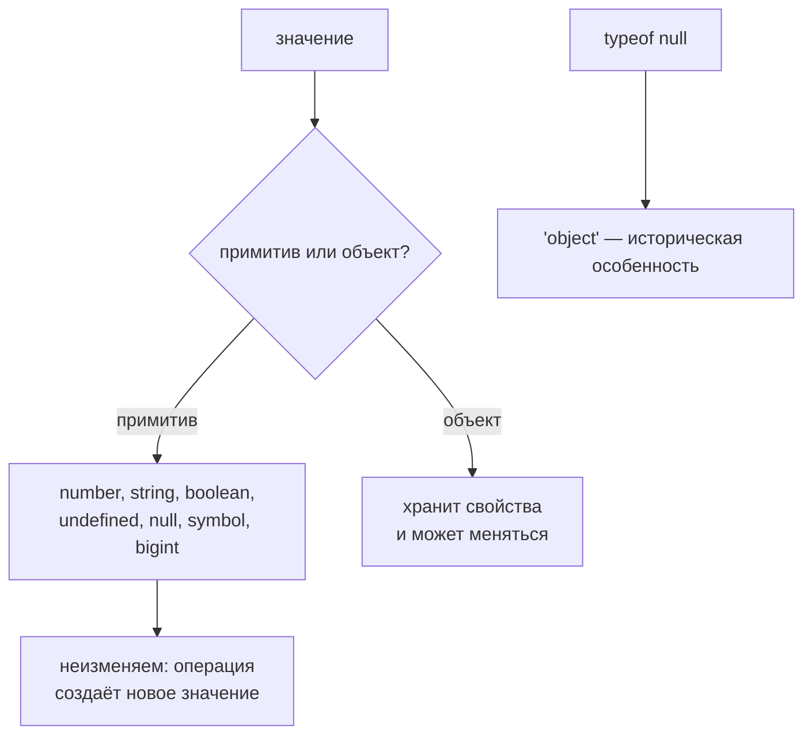

# Примитивные типы

## Связь с предыдущей главой

Предыдущие главы объяснили, как JavaScript Engine выполняет программу:

Теперь начинается новый блок:

> С какими значения работает JavaScript?

До этого мы говорили, что engine хранит информацию, identifiers дают named access, Scope определяет visibility, а Lexical Environment помогает lookup. Но сама информация тоже бывает разной.

```javascript
const age = 30;
const userName = 'Anna';
const isActive = true;
```

Вопрос:

> С каким видом значения engine работает прямо сейчас?

Эта глава вводит primitive значения — фундаментальные, indivisible значения JavaScript. Objects будут изучаться отдельно в следующих главах.

---

## Предварительные требования

Для этой главы нужно понимать:

* что value — информация, с которой работает программа;
* что variable дает named access к value;
* что `const` запрещает reassignment identifier;
* что `let` позволяет reassignment;
* что engine работает с значения during execution;
* что `console.log` выводит переданное value.

Не требуется знать Object Type internals, References, Stack & Heap, Garbage Collector, Object wrappers, Prototype или Classes. Эти темы будут изучаться позже.

---

## Время изучения

Ориентировочное время:

```text
Чтение главы:            90-120 минут
Разбор схем:             35-45 минут
Запуск примеров:         20-30 минут
Практика:                80-110 минут
Повторение материала:    25 минут
```

Уровень сложности: **L2-L3**.

Тема выглядит простой, но ошибки с `null`, `undefined`, `typeof`, number значения and string значения часто приводят к неверным assertions in Automation QA.

---

## Навигация

Предыдущая глава:

```text
docs/01-javascript/10-temporal-dead-zone.md
```

Следующая глава:

```text
docs/01-javascript/12-object-type.md
```

Следующая глава объяснит Object Type. Objects are different from primitive значения and will be studied separately.

---

## Цели обучения

После изучения этой главы вы будете понимать:

* что такое value;
* почему JavaScript делит значения на primitive and object значения;
* что primitive значения are fundamental indivisible значения;
* как работают Number, String, Boolean, Undefined, Null, Symbol and BigInt;
* что показывает `typeof`;
* почему primitive значения immutable;
* почему `const` and primitive immutability are different ideas;
* какие misconceptions встречаются чаще всего;
* как primitive значения используются in assertions;
* как читать JSON primitive значения;
* как выбирать correct assertion types in Automation QA.

---

## Мотивация

Начнем с наблюдаемого поведения.

```javascript
const age = 30;

console.log(age);
```

Результат:

```text
30
```

Что произошло?

Но что такое `30` для engine?

Теперь другой код:

```javascript
const userName = 'Anna';
const isActive = true;
const deletedAt = null;
```

Все это значения, но они are not the same kind of value.

Если automation test получает API response, difference matters:

```json
{
  "age": 30,
  "name": "Anna",
  "active": true,
  "deletedAt": null
}
```

Тест должен понимать, какие значения он сравнивает. Иначе assertion может быть формально написан, но смысл проверки будет неправильным.

Главный вопрос главы:

> С каким видом значения engine работает прямо сейчас?

---

## Теория

### Что такое значение

Значение — конкретная информация, с которой работает программа.

```javascript
const testName = 'login';
const retryCount = 2;
const isPassed = true;
```

Здесь значения:

```text
"login"
2
true
```

Имена переменных:

```text
testName
retryCount
isPassed
```

Не путайте имя и значение: `testName` — это имя, `'login'` — значение, на которое
имя указывает.

Что движок делает прямо сейчас:

```text
движок читает значение
движок сохраняет значение
движок сравнивает значения
движок передаёт значение в console.log или в проверку
```

### Почему JavaScript делит значения на примитивные и объектные

JavaScript значения делятся на две большие группы:

```text
значения JavaScript
├── примитивные: Number, String, Boolean, Null, Undefined, Symbol, BigInt
└── объектные:   Object, Array, Function, Date, ...
```

Почему деление важно:

Объекты, массивы, функции, даты и ссылки будут изучаться позже. Сейчас важно понять примитивные значения до составных.

### Примитивы и объекты: общий взгляд

Примитивные значения в нашей текущей модели неделимы.

Объектные значения устроены иначе:

```text
примитив  —  одно неделимое значение: 30, 'active', true
объект    —  набор значений под общим именем: { status: 'active', code: 200 }
```

Не нужно сейчас объяснять объекты через память, ссылки или кучу. Это будущие главы.

Сейчас достаточно:

```text
примитив нельзя разобрать на части — его можно только заменить целиком
```

### Категории примитивов

В JavaScript семь примитивных типов:

```text
number     bigint     string     boolean
undefined  null       symbol
```

Каждый отвечает на свой вопрос:

| Тип | Вопрос, на который отвечает значение |
| --- | --- |
| `number` | сколько, какой размер, какой код ответа |
| `bigint` | сколько, если число не помещается в `number` |
| `string` | какой текст |
| `boolean` | да или нет |
| `undefined` | значение не задавали |
| `null` | значение задали намеренно пустым |
| `symbol` | уникальный ключ, который нельзя повторить случайно |

### Тип `number`

`number` — примитивный тип для числовых значений.

```javascript
const age = 30;
const price = 19.99;
const retryCount = 2;
```

```text
Number  →  30      целое
        →  19.99   дробное
        →  NaN     не число
        →  Infinity
```

JavaScript использует `number` и для целых, и для дробных значений.

Особые числовые значения вроде `NaN` и `Infinity` существуют, но подробное поведение чисел будет изучаться позже, вместе с операторами и сравнениями.

Automation QA:

```javascript
const expectedStatusCode = 200;
const actualStatusCode = 200;
```

Если API возвращает код ответа числом, проверка должна сравнивать число с числом, а не строку с числом.

### Тип `string`

`string` — примитивный тип для текстовых значений.

```javascript
const userName = 'Anna';
const baseUrl = 'https://example.com';
const status = 'active';
```

```text
String  →  'Anna'
        →  'https://example.com'
        →  ''      пустая строка — тоже значение
```

Значение типа `string` — это текст.

Это разные значения.

В Automation QA это часто важно:

```javascript
const statusCodeFromText = '200';
const statusCodeFromResponse = 200;
```

Они выглядят похоже, но это разные примитивные типы.

### Тип `boolean`

`boolean` — примитивный тип, у которого всего два значения:

```text
true
false
```

Примеры:

```javascript
const isActive = true;
const isDeleted = false;
```

```text
Boolean  →  true
         →  false
```

Булевы значения используют для пар «да/нет», «включено/выключено», «прошло/упало», «есть/нет».

Automation QA:

```javascript
const expectedIsActive = true;
const actualIsActive = true;
```

Не сравнивайте булево значение со строкой `"true"`, если только API действительно не возвращает строку.

### Тип `undefined`

`undefined` — примитивное значение, которое обычно означает, что значение не задано или результат отсутствует.

```javascript
let userName;

console.log(userName);
```

Результат:

```text
undefined
```

```text
объявили без значения  →  [ undefined ]
```

Значение `undefined` существует в единственном экземпляре.

Обычная ситуация: переменную объявили, но значение ещё не присвоили.

В автотестах `undefined` чаще всего приходит из ответа сервиса — поля просто нет:

```javascript
const responseField = undefined;
```

Если поле равно `undefined`, это может означать, что поля не было или значение ему не присвоили. Сам JSON не умеет представлять `undefined`; детали JSON будут изучаться позже, вместе с тестированием API.

### Значение `null`

`null` — примитивное значение для намеренного отсутствия.

```javascript
const deletedAt = null;
```

```text
null       →  значение отсутствует намеренно
undefined  →  значение ещё не задано
```

Разница проявляется в источнике: `null` кто-то записал намеренно, `undefined`
означает, что значения не было вовсе.

В ответе сервиса встречаются оба варианта:

```json
{
  "deletedAt": null
}
```

Обычно это означает, что система намеренно сообщает: даты удаления нет.

Важное замечание про `typeof`:

```javascript
typeof null;
```

возвращает:

```text
object
```

Это историческое поведение JavaScript. Оно не означает, что `null` является объектом. `null` — примитивное значение.

### Symbol

`symbol` — примитивный тип для уникальных значений.

```javascript
const firstId = Symbol('id');
const secondId = Symbol('id');
```

Даже с одинаковым описанием символы различны:

```text
Symbol("id") !== Symbol("id")
```

```text
Symbol('id')  ≠  Symbol('id')    два разных значения
```

`symbol` встречается в повседневном коде автоматизации реже, чем число, строка, булево значение, `null` и `undefined`. Но его нужно знать как часть примитивных типов.

Символы как ключи свойств и более сложные случаи будут изучаться позже, вместе с объектами.

### Тип `bigint`

`bigint` — примитивный тип для очень больших целых чисел.

```javascript
const largeId = 9007199254740993n;
```

Буква `n` в конце помечает литерал `bigint`.

```text
Number  →  ограничен по точности для больших целых
BigInt  →  9007199254740993n    произвольно большие целые
```

`bigint` — это не то же самое, что `number`: сложение значений разных типов
запрещено и даёт `TypeError` прямо во время выполнения.

```javascript
10n + 5;   // TypeError: Cannot mix BigInt and other types
```

`bigint` может встретиться рядом с очень большими идентификаторами, но многие API присылают такие идентификаторы строками, чтобы не терять точность.

Подробные числовые пределы и преобразования будут изучаться позже.

### Оператор `typeof`

`typeof` возвращает строку с названием категории типа значения.

```javascript
typeof 30;
typeof 'Anna';
typeof true;
```

Схема результатов `typeof`:

```text
Value       | typeof result
------------|--------------
30          | "number"
"Anna"      | "string"
true        | "boolean"
undefined   | "undefined"
null        | "object"
Symbol()    | "symbol"
10n         | "bigint"
```

Важно:

```text
typeof null === "object"
```

Это историческое поведение. В модели этой главы:

```text
null is primitive
typeof null is "object"
```

Не используйте `typeof null` как доказательство того, что `null` — объект.

### Неизменяемость примитивов

Примитивные значения неизменяемы.

Это означает, что само значение нельзя изменить.

```javascript
const userName = 'Anna';
```

Строковое значение `'Anna'` нельзя изменить изнутри.

Если создать другое значение:

```javascript
const upperName = 'ANNA';
```

Теперь у вас есть другое строковое значение.

```text
'Anna'  →  toUpperCase()  →  'ANNA'    новое значение
'Anna'  остаётся прежним
```

Не путайте изменение значения и замену значения: примитив изменить нельзя,
можно только связать имя с другим значением.

С `let`:

```javascript
let status = 'created';
status = 'ready';
```

Примитивное значение `'created'` не превратилось в `'ready'`. Имя `status` теперь указывает на другое примитивное значение.

### Имена, указывающие на значения

Аккуратно используйте модель из главы про переменные: имя указывает на значение,
а не содержит его.

Пример:

```javascript
const status = 'active';
```

```text
status  ──→  [ 'active' ]    связь зафиксирована через const
```

Если повторное присваивание разрешено:

```javascript
let status = 'created';
status = 'active';
```

```text
было:  status  ──→  [ 'created' ]
стало: status  ──→  [ 'active' ]

оба значения существуют независимо, изменилась только связь
```

Примитивное значение не изменилось. Имя теперь указывает на другое примитивное значение.

### Текущее место в модели JavaScript

Теперь курс переходит от модели выполнения к модели значений.

Текущая позиция:

```text
главы 02-10  —  как выполняется код
глава 11     —  из чего состоят значения, с которыми он работает
```

Эта глава:

```text
отвечает на вопрос «какие бывают неделимые значения»
и готовит вопрос следующей главы: «а как устроены составные»
```

### Переход к объектам

Примитивные значения — основные неделимые значения.

Объекты устроены иначе.

Не пытайтесь объяснить поведение объектов правилами примитивов.

Следующая глава ответит на вопрос:

> Каким видом значения является объект и почему он ведёт себя иначе?

### Полный обзор примитивов

---

Две категории значений ведут себя по-разному:


```mermaid
flowchart TD
    A["значение"] --> B{"примитив или объект?"}
    B -- "примитив" --> C["number, string, boolean,<br/>undefined, null, symbol, bigint"]
    C --> D["неизменяем: операция<br/>создаёт новое значение"]
    B -- "объект" --> E["хранит свойства<br/>и может меняться"]
    F["typeof null"] --> G["'object' — историческая особенность"]
```

## Внутренний механизм

На этом этапе мы держим механизм концептуальным.

Когда движок видит литерал:

```javascript
const age = 30;
```

Он работает с примитивным числовым значением.

Когда движок видит:

```javascript
const userName = 'Anna';
```

Он работает с примитивным строковым значением.

Когда движок сравнивает примитивные значения, он сравнивает сами значения. Детали равенства будут изучаться позже, но базовая модель такая:

С каким видом значения движок работает прямо сейчас:

Ни устройство памяти, ни стек с кучей, ни обёртки и ссылки для этой главы не нужны.

---

## Ментальная модель

### Атомы

Примитивные значения в текущей модели похожи на атомы.

Примеры:

```text
30
"Anna"
true
null
```

### Неделимые значения

Примитивное значение в этой главе — не структура, которую можно открыть.

С объектами будет иначе.

### Неизменяемые значения

Примитивные значения не меняются изнутри.

### Имена, указывающие на значения

Переменные — это имена, указывающие на примитивные значения.

### Каталог типов значений

Представьте примитивные типы как категории каталога.

Читая код, определяйте категорию значения:

```text
What kind of value is this?
```

---

## Примеры кода

Примеры к этой главе находятся в папке:

```text
examples/01-javascript/chapter-11/
```

Запускайте их из корня проекта.

### Пример 1. Числа

Файл:

```text
examples/01-javascript/chapter-11/01-number.js
```

Показывает числовые значения в данных, похожих на тестовые.

### Пример 2. Строки

Файл:

```text
examples/01-javascript/chapter-11/02-string.js
```

Показывает строковые значения.

### Пример 3. Булевы значения

Файл:

```text
examples/01-javascript/chapter-11/03-boolean.js
```

Показывает булевы значения в роли флагов.

### Пример 4. `null` и `undefined`

Файл:

```text
examples/01-javascript/chapter-11/04-null-undefined.js
```

Показывает разницу между `null` и `undefined`.

### Пример 5. `symbol` и `bigint`

Файл:

```text
examples/01-javascript/chapter-11/05-symbol-bigint.js
```

Показывает менее распространённые примитивные значения.

### Пример 6. `typeof`

Файл:

```text
examples/01-javascript/chapter-11/06-typeof.js
```

Показывает результаты `typeof`, включая исторический случай с `null`.

---

## Частые вопросы

### Примитивное значение — это просто маленькое значение?

Нет. Примитивное означает основную неделимую категорию значения. Строка может быть длинной и всё равно остаётся примитивом.

### `null` — это объект?

Нет. `null` является примитивом. `typeof null` возвращает `"object"` из-за исторического поведения JavaScript.

### `undefined` и `null` одно и то же?

Нет. `undefined` обычно означает «не задано» или «отсутствует». `null` обычно означает намеренное отсутствие.

### `const` делает примитив неизменяемым?

Примитивные значения неизменяемы по своей природе. `const` запрещает повторное присваивание имени. Это разные идеи.

### Нужно ли часто использовать `symbol` и `bigint` в тестах?

Не часто. Но они являются частью языка и могут встретиться в библиотеках, идентификаторах или сложном коде.

---

## Распространённые мифы

### Миф 1. Примитивные значения хранятся как маленькие объекты

Реальность:

Не объясняйте примитивы через объекты. Объекты устроены иначе и будут изучаться позже.

### Миф 2. `typeof null` доказывает, что `null` — объект

Реальность:

`typeof null` возвращает `"object"`, но `null` является примитивом.

### Миф 3. `const status = "active"` делает строку защищённой

Реальность:

Строковый примитив и так неизменяем. `const` защищает имя от повторного присваивания.

### Миф 4. `"200"` и `200` — практически одно и то же

Реальность:

Они могут выглядеть похоже, но одно является строкой, а другое числом.

---

## Распространённые ошибки

### Ошибка 1. Сравнивать число со строкой

Неправильная модель:

```text
"200" and 200 mean same status code.
```

Что произошло:

Типы разные.

Исправленный подход:

```javascript
const expectedStatusCode = 200;
const actualStatusCode = 200;
```

### Ошибка 2. Считать `null` и `undefined` одинаковыми

Неправильная модель:

```text
null and undefined both mean nothing, so they are same.
```

Исправленная модель: `undefined` означает «значение ещё не задано», `null` — «отсутствие задано намеренно». Это разные факты, и различать их полезно при проверке данных.

### Ошибка 3. Слишком доверять `typeof null`

Неправильный вывод:

```text
typeof null is "object", so null is object.
```

Исправленный вывод:

```text
typeof null is historical behavior.
null is primitive.
```

### Ошибка 4. Путать повторное присваивание с изменением

Код:

```javascript
let status = 'created';
status = 'ready';
```

Что произошло:

Имя теперь указывает на другое примитивное значение. Строка `'created'` не изменилась.

---

## Практическое использование

Читая код, определяйте категорию значения:

```text
1. Is this value primitive or object?
2. If primitive, which primitive type?
3. Does assertion compare same kind of values?
4. Is absence represented as null or undefined?
5. Does typeof give expected result?
```

Таблица:

```text
Value       | Type category | typeof
------------|---------------|----------
200         | Number        | "number"
"200"       | String        | "string"
true        | Boolean       | "boolean"
undefined   | Undefined     | "undefined"
null        | Null          | "object"
10n         | BigInt        | "bigint"
Symbol()    | Symbol        | "symbol"
```

Практическое правило:

```text
Assertions should compare values intentionally,
not only visually similar output.
```

---

## Использование в Automation QA

### Ожидаемые значения в проверках

Проверки часто сравнивают примитивные значения:

```javascript
const expectedStatus = 'active';
const actualStatus = 'active';
```

Оба являются строковыми примитивами.

### Проверка ответа API

Значения в ответе API могут быть числами, строками, булевыми значениями или `null`.

```javascript
const expectedStatusCode = 200;
const expectedIsActive = true;
const expectedDeletedAt = null;
```

Инженер по автоматизации должен знать, какого вида значение ожидается.

### Сравнение примитивных значений

Перед сравнением убедитесь, что оба значения одного вида. Число `200` и строка
`'200'` — разные примитивные значения, и строгое сравнение даст `false`.

Не сравнивайте:

```text
expected: 200
actual: "200"
```

если только система намеренно не возвращает строку.

### Подготовка тестовых данных

Хорошие тестовые данные показывают тип значения через имя:

```javascript
const expectedUserName = 'Anna';
const expectedAge = 30;
const expectedIsActive = true;
const expectedDeletedAt = null;
```

### Чтение значений из JSON

JSON обычно содержит:

```json
{
  "name": "Anna",
  "age": 30,
  "active": true,
  "deletedAt": null
}
```

После разбора они соответствуют примитивным значениям JavaScript. Значения `undefined` в JSON не существует.

### Выбор правильного типа проверки

Проверка должна соответствовать замыслу:

Это избавляет от ложной уверенности в тестах.

---

## Итоги

Примитивные значения — основные неделимые значения JavaScript.

Значения делятся на две группы: примитивные (неделимые) и объектные
(составные).

Эта глава изучила примитивные значения:

```text
Number
String
Boolean
Undefined
Null
Symbol
BigInt
```

Примитивные значения неизменяемы. Повторное присваивание меняет то, на какое значение указывает имя; само примитивное значение при этом не меняется.

Объекты устроены иначе и будут изучаться отдельно в следующей главе.

---

## Что нужно запомнить

✓ Значение — это та информация, с которой работает JavaScript.

✓ Примитивные значения — основные неделимые значения.

✓ Значения делятся на примитивные и объектные.

✓ `number` представляет числовые значения.

✓ `string` представляет текстовые значения.

✓ `boolean` имеет только `true` и `false`.

✓ `undefined` обычно означает «не задано» или «отсутствует».

✓ `null` обычно означает намеренное отсутствие.

✓ `symbol` создаёт уникальные примитивные значения.

✓ `bigint` представляет большие целые значения.

✓ `typeof null` возвращает `"object"`, но `null` является примитивом.

✓ Примитивные значения неизменяемы.

---

## Проверьте себя

1. Что такое значение?

2. Почему JavaScript делит значения на примитивные и объектные?

3. Какие примитивные типы есть в JavaScript?

4. Чем число отличается от строки?

5. Чем булево значение отличается от строки `"true"`?

6. Чем `undefined` отличается от `null`?

7. Почему `typeof null` сбивает с толку?

8. Что означает неизменяемость примитивов?

9. Почему `"200"` и `200` не одно и то же?

10. Почему объекты изучаются отдельно?

### Ответы

1. Единица данных, с которой работает программа: число, строка, булево значение, объект. Всё, что можно сохранить под именем и передать дальше.
2. Потому что они ведут себя по-разному. Примитив неделим и копируется целиком; объект состоит из свойств, и имена хранят ссылку на него, а не сам объект.
3. `number`, `bigint`, `string`, `boolean`, `undefined`, `null` и `symbol`.
4. Число описывает количество и участвует в арифметике; строка описывает текст. `200` и `'200'` могут выглядеть одинаково в выводе, но это разные значения разных типов.
5. `true` — булево значение, с ним работают условия. `"true"` — текст из четырёх символов, и он остаётся текстом, даже если пришёл из ответа сервера. Сравнение с булевым значением через `===` даст `false`.
6. `undefined` означает, что значение не задавали: переменная объявлена без значения, свойства нет, функция ничего не вернула. `null` задают намеренно как «значение есть, и оно пустое».
7. `typeof null` возвращает `'object'` — это давняя ошибка языка, сохранённая ради совместимости. `null` остаётся примитивом.
8. Примитив нельзя изменить по частям — его можно только заменить целиком. Операции над строкой не меняют её, а создают новую.
9. Это значения разных типов. `'200'` — текст, сравнение через `===` с числом даст `false`, а сложение с числом даст строку, а не сумму. В тестах это частая причина расхождения с кодом ответа.
10. У объектов другая модель: имена хранят ссылки, изменение через одно имя видно через другое, а сравнение сравнивает не содержимое. Это отдельная тема, которую нельзя объяснить на примитивах.

---

## Практика

Практика к этой главе находится в файле:

```text
practice/01-javascript/11-primitive-types.md
```

Перед практикой запустите примеры из раздела «Примеры кода» и для каждого значения запишите примитивный тип и результат `typeof`.

---

## Решения

Решения находятся в файле:

```text
solutions/01-javascript/11-primitive-types.md
```

Открывайте решения после самостоятельной попытки. В этой главе важно сравнивать не только вывод, но и вид значения.
