# Object Type

## Связь с предыдущей главой

Предыдущая глава начала блок **Values and Types** и объяснила primitive значения:

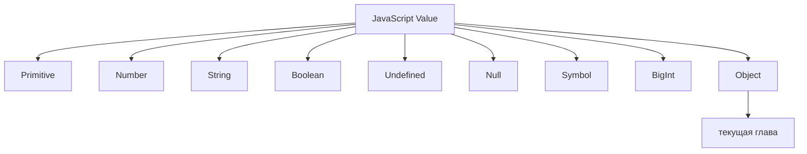

Primitive value представляет одно indivisible value:

```javascript
const age = 30;
const userName = 'Anna';
const isActive = true;
```

Но реальные программы редко работают только с отдельными значения. В тестах, API responses, конфигурации и UI-состояниях данные почти всегда связаны между собой.

Например:

```javascript
const firstName = 'Anna';
const lastName = 'Smith';
const age = 30;
const isActive = true;
```

Каждое value понятно отдельно. Но вместе они описывают одного пользователя.

Главный вопрос этой главы:

> Что происходит, когда одного primitive value уже недостаточно?

И дополнительный вопрос, который будет повторяться дальше:

> Какая информация сгруппирована прямо сейчас?

Object Type отвечает именно на это.

---

## Предварительные требования

Для этой главы нужно понимать:

* что value - информация, с которой работает JavaScript;
* что primitive value представляет одно indivisible value;
* что variable дает named access к value;
* что `const` запрещает reassignment identifier;
* что `console.log` выводит value;
* что `undefined` часто появляется при обращении к отсутствующей информации.

Не требуется знать References, Stack & Heap, Prototype, Prototype Chain, Classes, Object descriptors, Object wrappers или Garbage Collector. Эти темы будут изучаться в отдельных главах.

---

## Время изучения

Ориентировочное время:

```text
Чтение главы:            100-130 минут
Разбор схем:             35-50 минут
Запуск примеров:         20-30 минут
Практика:                90-120 минут
Повторение материала:    25 минут
```

Уровень сложности: **L2-L3**.

Тема кажется простой, потому что syntax object literals выглядит дружелюбно. Но большинство ошибок с test data, API responses and configuration начинается не с синтаксиса, а с неверного понимания того, какая информация должна быть grouped together.

---

## Навигация

Предыдущая глава:

```text
docs/01-javascript/11-primitive-types.md
```

Текущая глава:

```text
docs/01-javascript/12-object-type.md
```

Следующая глава:

```text
docs/01-javascript/13-references.md
```

Следующая глава объяснит References. Это будет ответ на вопрос: если Object value может содержать много related значения, как JavaScript работает с таким value internally? В этой главе этот механизм не разбирается.

---

## Цели обучения

После изучения этой главы вы будете понимать:

* почему primitive значения иногда insufficient;
* зачем JavaScript нужен Object Type;
* что Object value groups related information;
* что такое property;
* чем property name отличается от property value;
* как читать property value;
* как updating property меняет grouped information;
* как adding property расширяет object;
* что означает deleting property на базовом уровне;
* как читать nested objects conceptually;
* почему arrays и functions тоже относятся к object значениям, но требуют отдельных глав;
* как objects используются в API responses, JSON, test data and configuration;
* как отличать expected object structure from actual object structure.

---

## Мотивация

Начнем с проблемы.

Допустим, тест проверяет профиль пользователя:

```javascript
const firstName = 'Anna';
const lastName = 'Smith';
const age = 30;
const isActive = true;
```

Все значения корректны:

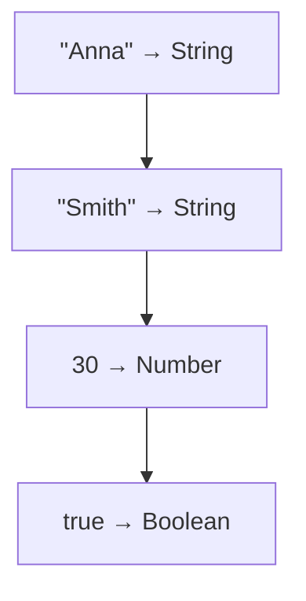

Но в программе отсутствует важная идея:

```text
firstName
lastName
age
isActive
```

Эти значения are related. Они описывают одну entity: user.

Диаграмма проблемы:

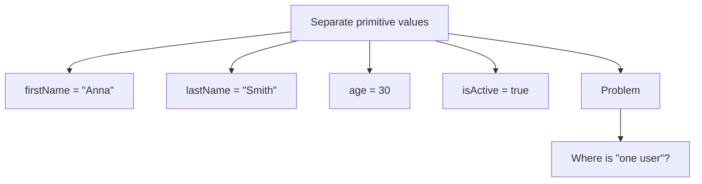

Engine видит отдельные значения. Читатель понимает, что они связаны. Код пока не выражает эту связь.

Object решает эту проблему:

```javascript
const user = {
  firstName: 'Anna',
  lastName: 'Smith',
  age: 30,
  isActive: true,
};
```

Теперь программа говорит явно:

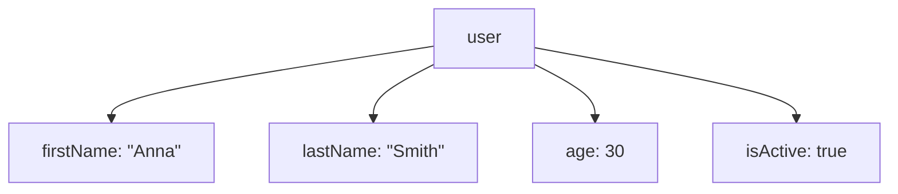

Что information is grouped together right now?

Ответ:

```text
All user-related information is grouped inside one Object value.
```

В Automation QA это встречается постоянно:

```javascript
const expectedUser = {
  firstName: 'Anna',
  lastName: 'Smith',
  age: 30,
  isActive: true,
};
```

Такой код легче читать, проще передавать в helper, удобнее сравнивать с API response и безопаснее поддерживать.

---

## Теория

### Primitive vs Object

Primitive value представляет одно indivisible value.

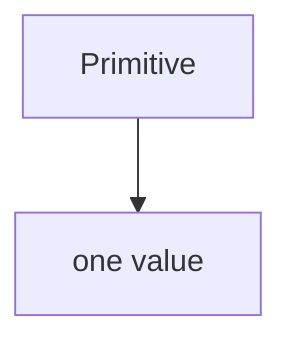

Object value groups multiple related значения under one entity.

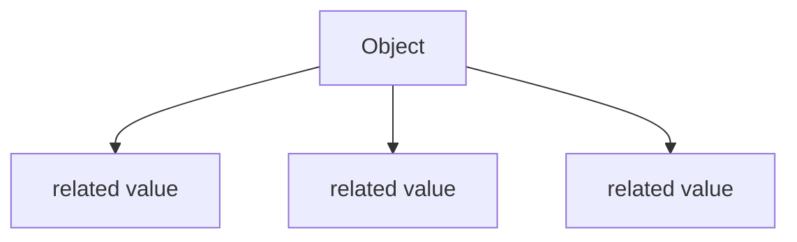

Диаграмма Primitive vs Объект:

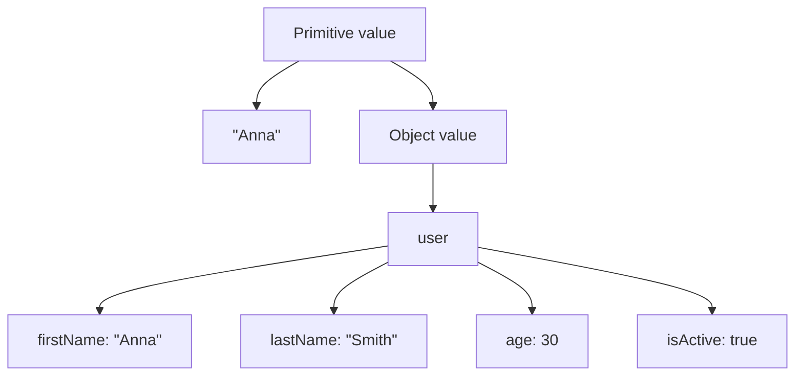

Важно:

Object is also a value.

То есть `user` не является набором случайных variables. `user` gives named access to one Object value, а внутри этого Object value есть related information.

### Почему primitive значения становятся недостаточными

Primitive значения хороши, когда нужно выразить одну вещь:

```javascript
const statusCode = 200;
const userName = 'Anna';
const isActive = true;
```

Но они становятся неудобными, когда появляется entity:

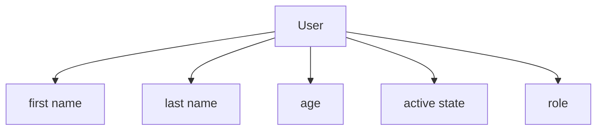

Если хранить все отдельно, связь существует только в голове программиста:

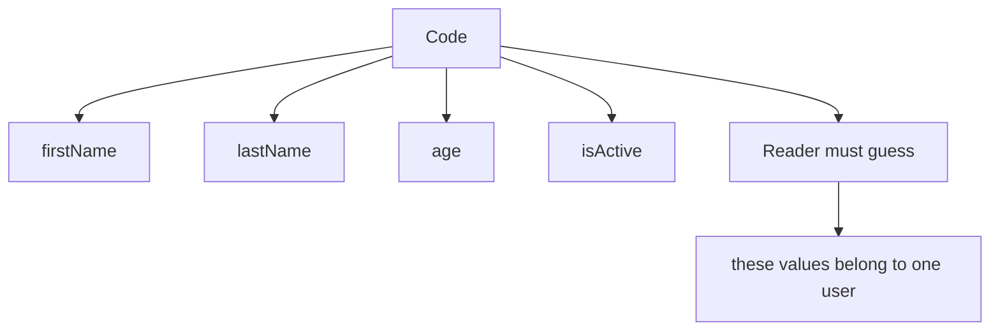

Object делает связь частью кода:

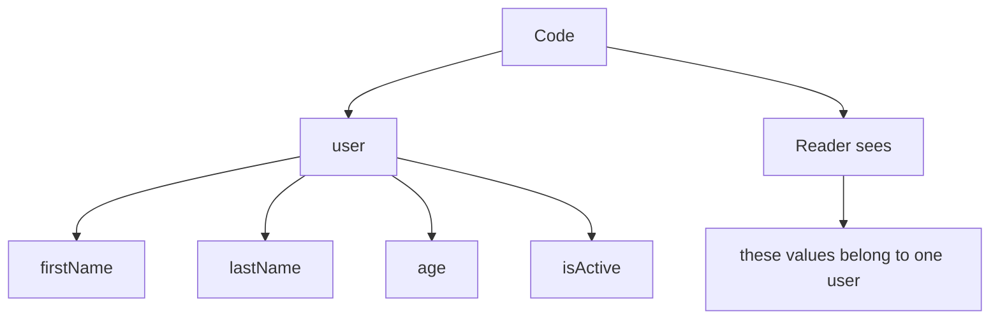

Диаграмма why primitives become insufficient:

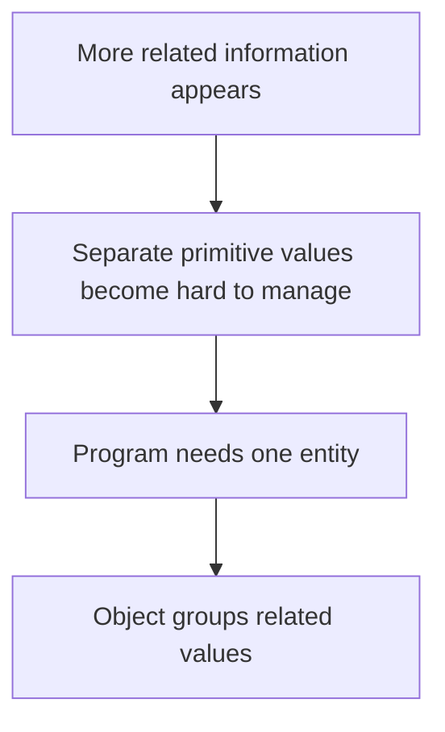

### Что такое Object value

Object value - structured value that contains properties.

Но лучше начать не с определения, а с наблюдения:

```javascript
const user = {
  firstName: 'Anna',
  lastName: 'Smith',
  age: 30,
};
```

Что information is grouped together right now?

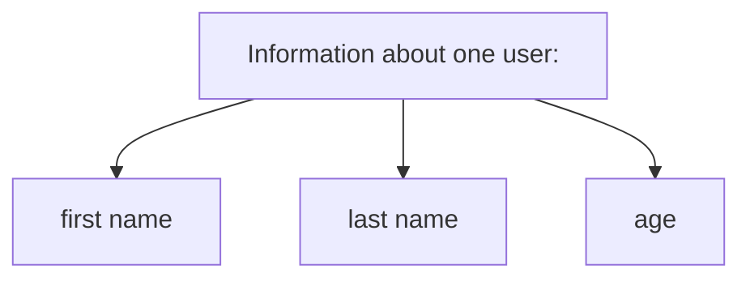

Object structure:

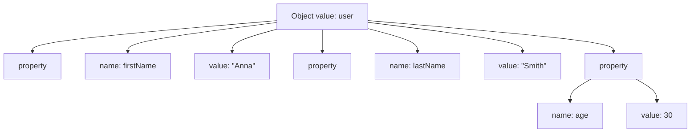

Object полезен, потому что позволяет программе представить одну концептуальную сущность:

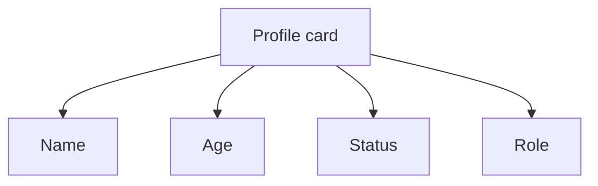

В коде:

```javascript
const user = {
  firstName: 'Anna',
  age: 30,
  isActive: true,
  role: 'admin',
};
```

### Properties

Property - элемент object, состоящий из property name and property value.

```javascript
const user = {
  firstName: 'Anna',
};
```

Диаграмма property:

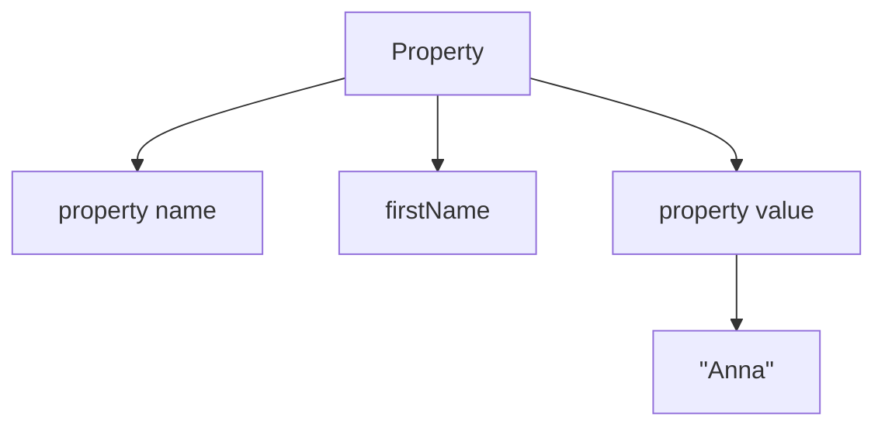

В object literal это выглядит так:

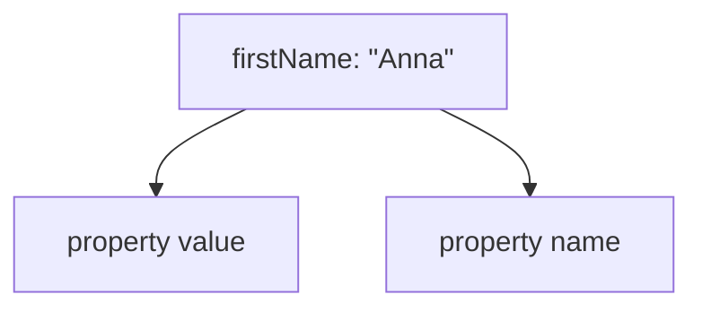

Property name отвечает:

```text
What is this piece of information called?
```

Property value отвечает:

```text
What information is stored under this name?
```

### Property names

Property name is the name used to access information inside object.

```javascript
const user = {
  firstName: 'Anna',
  lastName: 'Smith',
};
```

Property names:

```text
firstName
lastName
```

Ментальная модель dictionary:

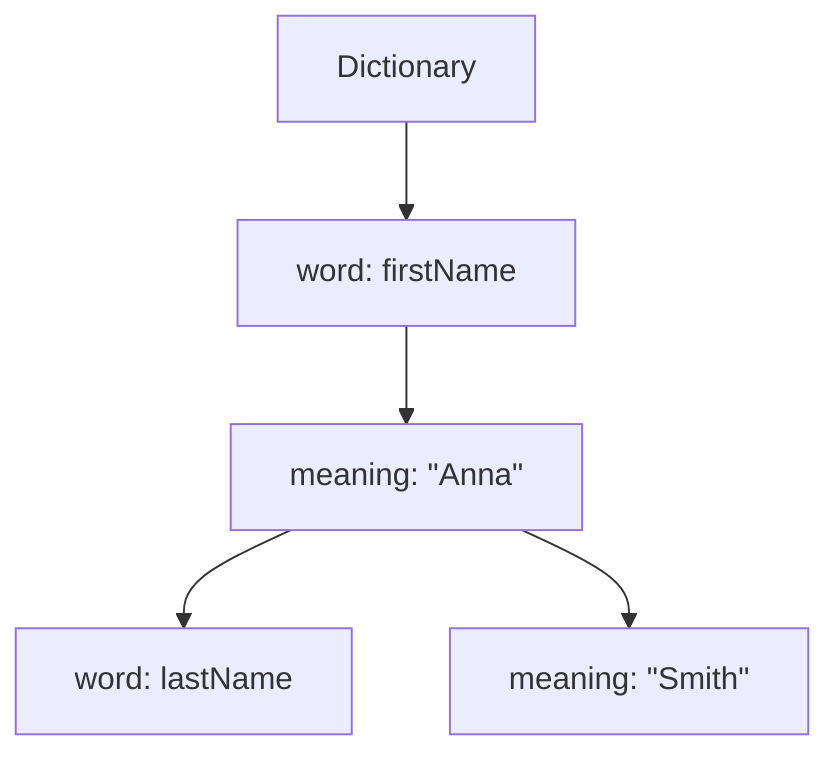

Property name is not the same thing as variable identifier.

```javascript
const user = {
  firstName: 'Anna',
};
```

Здесь:

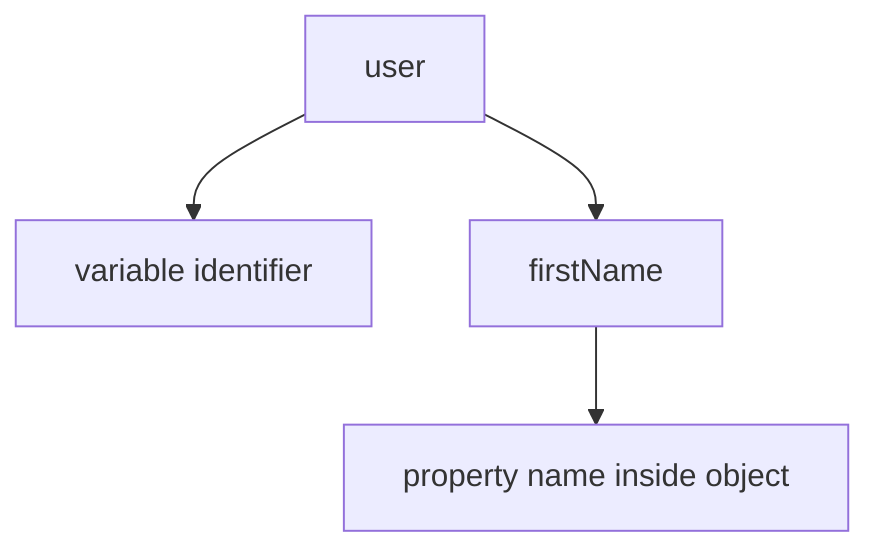

### Property значения

Property value is the actual value stored under property name.

```javascript
const user = {
  firstName: 'Anna',
  age: 30,
  isActive: true,
};
```

Property значения:

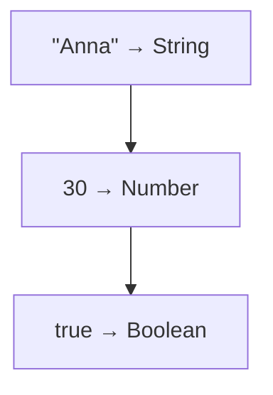

Object может group primitive значения:

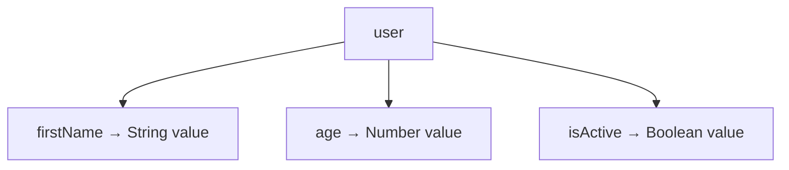

Позже object может group other objects too. Nested objects are introduced conceptually in this chapter, but detailed internal поведение will be studied later.

### Reading properties

Чтобы прочитать information inside object, используем property access:

```javascript
const user = {
  firstName: 'Anna',
  age: 30,
};

console.log(user.firstName);
console.log(user.age);
```

Диаграмма reading property:

```mermaid
flowchart TD
    N1["user.firstName"]
    N2["find object value named user"]
    N3["look for property name firstName"]
    N4["read property value &quot;Anna&quot;"]
    N1 --> N2
    N1 --> N3
    N1 --> N4
```

Что engine делает прямо сейчас?

```mermaid
flowchart TD
    N1["Engine has Object value"]
    N2["Engine receives property name"]
    N3["Engine retrieves matching property value"]
    N4["Value is passed to console.log"]
    N1 --> N2
    N2 --> N3
    N3 --> N4
```

Если property does not exist, result is `undefined`:

```javascript
const user = {
  firstName: 'Anna',
};

console.log(user.role);
```

Концептуальный результат:

```mermaid
flowchart TD
    N1["user"]
    N2["firstName: &quot;Anna&quot;"]
    N3["Lookup"]
    N4["role?"]
    N5["нет such property"]
    N6["undefined"]
    N1 --> N2
    N1 --> N3
    N3 --> N4
    N4 --> N5
    N5 --> N6
```

Это не означает, что object исчез или сломался. Это означает: under requested property name, value was not found.

### Updating properties

Object can represent changing состояние of the same entity.

```javascript
const user = {
  firstName: 'Anna',
  age: 30,
};

user.age = 31;

console.log(user.age);
```

Диаграмма updating property:

```mermaid
flowchart TD
    N1["Before"]
    N2["user"]
    N3["age: 30"]
    N4["Operation"]
    N5["user.age = 31"]
    N6["After"]
    N7["user"]
    N8["age: 31"]
    N1 --> N2
    N2 --> N3
    N1 --> N4
    N4 --> N5
    N4 --> N6
    N6 --> N7
    N7 --> N8
```

Что information is grouped together right now?

```mermaid
flowchart TD
    N1["Same user"]
    N2["updated age"]
    N1 --> N2
```

Важно:

```javascript
const user = {
  age: 30,
};

user.age = 31;
```

`const` prevents reassignment of the `user` identifier. It does not mean every property of the object is frozen. Почему так происходит internally, будет объяснено в главе про References. Сейчас достаточно понимать поведение: object property can be updated.

### Adding properties

Object can be extended with new information.

```javascript
const user = {
  firstName: 'Anna',
};

user.role = 'admin';

console.log(user.role);
```

Диаграмма adding property:

```mermaid
flowchart TD
    N1["Before"]
    N2["user"]
    N3["firstName: &quot;Anna&quot;"]
    N4["Operation"]
    N5["user.role = &quot;admin&quot;"]
    N6["After"]
    N7["user"]
    N8["firstName: &quot;Anna&quot;"]
    N9["role: &quot;admin&quot;"]
    N1 --> N2
    N2 --> N3
    N1 --> N4
    N4 --> N5
    N4 --> N6
    N6 --> N7
    N7 --> N8
    N7 --> N9
```

Это полезно, когда информация появляется по шагам:

```mermaid
flowchart TD
    N1["Initial user data"]
    N2["firstName"]
    N3["После: login"]
    N4["role appears"]
    N5["После: API call"]
    N6["permissions appear"]
    N1 --> N2
    N1 --> N3
    N3 --> N4
    N3 --> N5
    N5 --> N6
```

Но adding properties should be used carefully. В test code чаще лучше создавать object with expected structure explicitly, чтобы reader сразу видел required shape.

### Deleting properties

Property can be removed from object:

```javascript
const user = {
  firstName: 'Anna',
  temporaryCode: '1234',
};

delete user.temporaryCode;

console.log(user.temporaryCode);
```

Диаграмма removing property:

```mermaid
flowchart TD
    N1["Before"]
    N2["user"]
    N3["firstName: &quot;Anna&quot;"]
    N4["temporaryCode: &quot;1234&quot;"]
    N5["Operation"]
    N6["delete user.temporaryCode"]
    N7["After"]
    N8["user"]
    N9["firstName: &quot;Anna&quot;"]
    N1 --> N2
    N2 --> N3
    N2 --> N4
    N1 --> N5
    N5 --> N6
    N5 --> N7
    N7 --> N8
    N8 --> N9
```

At a high level, `delete` removes property from object. Это не глава про memory cleanup and Garbage Collector. Garbage Collector will be studied later.

Что information is grouped together right now?

```mermaid
flowchart TD
    N1["User information remains"]
    N2["temporaryCode нет longer belongs to this object"]
    N1 --> N2
```

### Nested objects

Sometimes one grouped entity contains another grouped entity.

```javascript
const user = {
  profile: {
    firstName: 'Anna',
    lastName: 'Smith',
  },
  settings: {
    theme: 'dark',
    emailNotifications: true,
  },
};
```

Диаграмма nested object:

```mermaid
flowchart TD
    N1["user"]
    N2["profile"]
    N3["firstName: &quot;Anna&quot;"]
    N4["lastName: &quot;Smith&quot;"]
    N5["settings"]
    N6["theme: &quot;dark&quot;"]
    N7["emailNotifications: true"]
    N1 --> N2
    N1 --> N3
    N1 --> N4
    N1 --> N5
    N5 --> N6
    N5 --> N7
```

Какая информация сгруппирована прямо сейчас?

```mermaid
flowchart TD
    N1["user"]
    N2["profile information"]
    N3["settings information"]
    N1 --> N2
    N1 --> N3
```

Reading nested property:

```javascript
console.log(user.profile.firstName);
```

Концептуально:

```mermaid
flowchart TD
    N1["user.profile.firstName"]
    N2["read user"]
    N3["inside user read profile"]
    N4["inside profile read firstName"]
    N1 --> N2
    N1 --> N3
    N1 --> N4
```

Nested objects are common in API responses:

```json
{
  "user": {
    "profile": {
      "firstName": "Anna"
    }
  }
}
```

В этой главе nested object is only a grouping model. References and deeper internal поведение will be studied later.

### Arrays and functions are also objects

JavaScript has many object значения.

```mermaid
flowchart TD
    N1["Object Values"]
    N2["Plain Object"]
    N3["Array"]
    N4["Function"]
    N5["Date"]
    N6["other built-in objects"]
    N1 --> N2
    N1 --> N3
    N1 --> N4
    N1 --> N5
    N1 --> N6
```

Array is an object-like value for ordered collections. Functions are callable object значения. Date and other built-in objects provide specialized поведение.

Подробно arrays, functions, Date, prototypes and built-in object поведение will be studied later. Сейчас важно не перегружать главу: current object model is about grouping related information with properties.

Диаграмма object hierarchy:

```mermaid
flowchart TD
    N1["JavaScript Value"]
    N2["Primitive"]
    N3["Object"]
    N4["Plain Object"]
    N5["Array"]
    N6["Function"]
    N7["Date"]
    N8["Other built-in objects"]
    N1 --> N2
    N1 --> N3
    N3 --> N4
    N3 --> N5
    N3 --> N6
    N3 --> N7
    N3 --> N8
```

---

## Внутренний механизм

Эта глава не объясняет References, Stack & Heap или Garbage Collector. Но нужно понять conceptual internal mechanism: что engine делает с grouped information.

### Object creation

Когда engine выполняет object literal:

```javascript
const user = {
  firstName: 'Anna',
  age: 30,
};
```

Он создает Object value with properties.

```mermaid
flowchart TD
    N1["Object literal"]
    N2["Create Object value"]
    N3["Add property firstName with value &quot;Anna&quot;"]
    N4["Add property age with value 30"]
    N5["Identifier user gives access to this Object value"]
    N1 --> N2
    N2 --> N3
    N3 --> N4
    N4 --> N5
```

Object lifecycle:

```mermaid
flowchart TD
    N1["Create object"]
    N2["Fill with properties"]
    N3["Read properties"]
    N4["Update / add / remove properties"]
    N5["Use object in program"]
    N1 --> N2
    N2 --> N3
    N3 --> N4
    N4 --> N5
```

### Property lookup inside object

Когда code reads `user.firstName`, engine does not read all properties. It looks for one property name.

```mermaid
flowchart TD
    N1["Object value: user"]
    N2["firstName: &quot;Anna&quot;"]
    N3["lastName: &quot;Smith&quot;"]
    N4["age: 30"]
    N5["Request"]
    N6["property name: firstName"]
    N7["Результат"]
    N8["property value: &quot;Anna&quot;"]
    N1 --> N2
    N1 --> N3
    N1 --> N4
    N1 --> N5
    N5 --> N6
    N5 --> N7
    N7 --> N8
```

Полный процесс поиска:

```mermaid
flowchart TD
    N1["Read user.firstName"]
    N2["Get Object value accessible through user"]
    N3["Search for property name &quot;firstName&quot;"]
    N4["Property exists?"]
    N5["да → вернуть property value"]
    N6["нет → вернуть undefined"]
    N1 --> N2
    N2 --> N3
    N3 --> N4
    N4 --> N5
    N4 --> N6
```

This is the mechanism behind many beginner errors:

```javascript
const user = {
  firstName: 'Anna',
};

console.log(user.firstname);
```

`firstName` and `firstname` are different property names.

```mermaid
flowchart TD
    N1["Object has"]
    N2["firstName"]
    N3["Code asks for"]
    N4["firstname"]
    N5["Результат"]
    N6["undefined"]
    N1 --> N2
    N1 --> N3
    N3 --> N4
    N3 --> N5
    N5 --> N6
```

### Updating grouped information

When property is updated, object still represents the same conceptual entity.

```mermaid
flowchart TD
    N1["user"]
    N2["firstName: &quot;Anna&quot;"]
    N3["age: 30"]
    N1 --> N2
    N1 --> N3
```

После:

```text
user.age = 31
```

Концептуальный объект:

```mermaid
flowchart TD
    N1["user"]
    N2["firstName: &quot;Anna&quot;"]
    N3["age: 31"]
    N1 --> N2
    N1 --> N3
```

Какая информация сгруппирована прямо сейчас?

```text
Information about the same user,
but one property value changed.
```

### Текущее место в модели JavaScript

К этому моменту модель курса выглядит так:

```mermaid
flowchart TD
    N1["JavaScript Engine"]
    N2["выполняется code"]
    N3["создает Execution Context"]
    N4["uses Call Stack to manage active contexts"]
    N5["stores information in Memory"]
    N6["gives named access through Variables"]
    N7["controls visibility through Scope"]
    N8["registers identifiers through Lexical Environment"]
    N9["explains early access behavior through Hoisting and TDZ"]
    N10["now works with different kinds of Values"]
    N11["Primitive"]
    N12["Object"]
    N1 --> N2
    N1 --> N3
    N1 --> N4
    N1 --> N5
    N1 --> N6
    N1 --> N7
    N1 --> N8
    N1 --> N9
    N1 --> N10
    N10 --> N11
    N10 --> N12
```

Primitive chapter answered:

```text
What kind of single value is this?
```

Object chapter отвечает:

```text
What related information belongs together?
```

### Переход к References

Object creates the next natural question.

```mermaid
flowchart TD
    N1["Primitive"]
    N2["one indivisible value"]
    N3["Object"]
    N4["grouped information"]
    N1 --> N2
    N1 --> N3
    N3 --> N4
```

But if Object value can contain multiple properties:

```mermaid
flowchart TD
    N1["Question"]
    N2["How does JavaScript work with such values internally?"]
    N1 --> N2
```

This is the bridge to References:

```mermaid
flowchart TD
    N1["Object Type"]
    N2["groups information"]
    N3["References"]
    N4["explain how JavaScript works with object values internally"]
    N1 --> N2
    N1 --> N3
    N3 --> N4
```

References будут изучены в следующей главе. Эта глава намеренно останавливается до этого механизма.

---

## Ментальная модель

### Folder with documents

Object похож на folder with documents.

```mermaid
flowchart TD
    N1["Folder: user"]
    N2["document: firstName → &quot;Anna&quot;"]
    N3["document: lastName → &quot;Smith&quot;"]
    N4["document: age → 30"]
    N5["document: isActive → true"]
    N1 --> N2
    N1 --> N3
    N1 --> N4
    N1 --> N5
```

Каждый document имеет name и content. Вместе они относятся к одной folder.

### Profile card

Object can be seen as a profile card:

```mermaid
flowchart TD
    N1["User Profile Card"]
    N2["First name: Anna"]
    N3["Last name: Smith"]
    N4["Age: 30"]
    N5["Active: да"]
    N1 --> N2
    N1 --> N3
    N1 --> N4
    N1 --> N5
```

Это особенно близко к API and UI testing. UI often displays profile card; API often returns profile object.

### Dictionary

Object also works like dictionary:

```text
Key        Value
--------- -----------
firstName Anna
lastName  Smith
age       30
isActive  true
```

Property name is like key. Property value is like dictionary value.

### Database record

Object can represent one record:

```mermaid
flowchart TD
    N1["users table record"]
    N2["id: 101"]
    N3["email: &quot;anna@example.com&quot;"]
    N4["role: &quot;admin&quot;"]
    N5["isActive: true"]
    N1 --> N2
    N1 --> N3
    N1 --> N4
    N1 --> N5
```

In tests, this mental model helps compare expected object with API response or database row.

### Temporary grouping

Object can also be temporary workspace:

```mermaid
flowchart TD
    N1["Temporary test data"]
    N2["email"]
    N3["password"]
    N4["expectedStatusCode"]
    N5["expectedRole"]
    N1 --> N2
    N1 --> N3
    N1 --> N4
    N1 --> N5
```

This is useful in helpers:

```javascript
const loginData = {
  email: 'anna@example.com',
  password: 'secure-password',
};
```

Object отвечает:

```text
Which pieces of information should travel together?
```

---

## Примеры кода

Все примеры находятся в:

```text
examples/01-javascript/chapter-12/
```

Запуск:

```bash
node examples/01-javascript/chapter-12/01-create-object.js
node examples/01-javascript/chapter-12/02-read-properties.js
node examples/01-javascript/chapter-12/03-update-properties.js
node examples/01-javascript/chapter-12/04-add-properties.js
node examples/01-javascript/chapter-12/05-delete-properties.js
node examples/01-javascript/chapter-12/06-nested-object.js
```

### 01-create-object.js

Этот пример показывает creation of one Object value:

```javascript
const user = {
  firstName: 'Anna',
  lastName: 'Smith',
  age: 30,
  isActive: true,
};

console.log(user);
```

Что information is grouped together right now?

```text
All basic user profile information.
```

### 02-read-properties.js

Этот пример показывает reading properties:

```javascript
console.log(user.firstName);
console.log(user.age);
```

Engine reads one property value at a time.

### 03-update-properties.js

Этот пример показывает updating existing properties:

```javascript
user.age = 31;
user.isActive = false;
```

Object still represents the same user, but grouped information changed.

### 04-add-properties.js

Этот пример показывает adding properties:

```javascript
user.role = 'admin';
user.deletedAt = null;
```

Object now contains more information about the same entity.

### 05-delete-properties.js

Этот пример показывает удаление property на высоком уровне:

```javascript
delete user.temporaryCode;
```

Property больше не принадлежит object.

### 06-nested-object.js

Этот пример показывает вложенную группировку:

```javascript
const user = {
  profile: {
    firstName: 'Anna',
    lastName: 'Smith',
  },
  settings: {
    theme: 'dark',
  },
};
```

Object содержит grouped information, а некоторые properties сами являются grouped objects.

---

## Частые вопросы

### `Object` и `object` означают одно и то же?

В тексте курса `Object` чаще всего означает JavaScript Object Type. В обычном тексте `object` может означать конкретное object value.

```mermaid
flowchart TD
    N1["Object Type"]
    N2["категория JavaScript values"]
    N3["object value"]
    N4["конкретное value в коде"]
    N1 --> N2
    N1 --> N3
    N3 --> N4
```

### Почему `const user = {}` позволяет менять `user.age`?

`const` защищает identifier от reassignment.

```javascript
const user = {
  age: 30,
};

user.age = 31;
```

Этот код обновляет property внутри object. Почему это возможно internally, будет объяснено в главе про References. Сейчас важно запомнить observable поведение: `const` не означает immutable object.

### Чем object отличается от JSON?

JavaScript object — это runtime value внутри JavaScript-программы. JSON — это текстовый формат данных, который часто используется в API-коммуникации.

JSON will be studied later in API testing. Сейчас достаточно понимать, что API responses often look like object structures, but JSON itself is text before it is parsed.

### Что произойдет при чтении отсутствующего property?

На этом уровне:

```javascript
const user = {
  firstName: 'Anna',
};

console.log(user.role);
```

Результат:

```text
undefined
```

Engine did not find property name `role` inside object.

### Arrays and functions are objects too?

Yes, arrays и functions относятся к object значениям в JavaScript. But arrays are for ordered collections, and functions are callable значения. Dedicated chapters will explain them later.

---

## Распространенные мифы

### Миф: Object is just many variables

Реальность:

Object is one value that groups related properties.

```mermaid
flowchart TD
    N1["Wrong mental model"]
    N2["many separate variables"]
    N3["Better mental model"]
    N4["one grouped value with properties"]
    N1 --> N2
    N1 --> N3
    N3 --> N4
```

### Миф: `const` makes object immutable

Реальность:

`const` prevents reassignment of identifier, not property updates.

```javascript
const user = {
  age: 30,
};

user.age = 31; // works
```

Техники неизменяемости объектов существуют, но относятся к будущим главам.

### Миф: Missing property means object is broken

Реальность:

Missing property means requested property name was not found.

```mermaid
flowchart TD
    N1["Object"]
    N2["firstName"]
    N3["Request"]
    N4["role"]
    N5["Результат"]
    N6["undefined"]
    N1 --> N2
    N1 --> N3
    N3 --> N4
    N3 --> N5
    N5 --> N6
```

### Миф: Nested object must be understood through Stack & Heap immediately

Реальность:

For this chapter, nested object is simply grouped information inside grouped information. Stack & Heap and References will come later.

---

## Типичные ошибки

### Ошибка 1. Хранить связанную информацию в отдельных variables

Плохо:

```javascript
const firstName = 'Anna';
const lastName = 'Smith';
const age = 30;
const isActive = true;
```

Лучше:

```javascript
const user = {
  firstName: 'Anna',
  lastName: 'Smith',
  age: 30,
  isActive: true,
};
```

Почему:

```text
Object makes relationship explicit.
```

### Ошибка 2. Путать property name with value

```javascript
const user = {
  role: 'admin',
};
```

Здесь:

```mermaid
flowchart TD
    N1["role → property name"]
    N2["&quot;admin&quot; → property value"]
    N1 --> N2
```

### Ошибка 3. Ошибиться в регистре property name

```javascript
const user = {
  firstName: 'Anna',
};

console.log(user.firstname);
```

Результат:

```text
undefined
```

`firstName` and `firstname` are different property names.

### Ошибка 4. Добавлять properties неявно и усложнять shape

```javascript
const user = {
  firstName: 'Anna',
};

user.role = 'admin';
user.permissions = ['read'];
user.lastLoginAt = null;
```

Иногда это нормально. Но в тестах expected object часто понятнее, когда shape виден при создании:

```javascript
const expectedUser = {
  firstName: 'Anna',
  role: 'admin',
  permissions: ['read'],
  lastLoginAt: null,
};
```

Arrays will be studied later. Here the point is object shape readability.

### Ошибка 5. Объяснять object через references слишком рано

References are important, but not the first question. First understand what Object does conceptually:

```text
Object groups related information.
```

Then next chapter will explain how JavaScript works with object значения internally.

---

## Практическое использование

Objects appear whenever code needs to represent an entity.

### User profile

```javascript
const user = {
  firstName: 'Anna',
  lastName: 'Smith',
  age: 30,
  isActive: true,
};
```

Какая информация сгруппирована прямо сейчас?

```text
Information about one user.
```

### Test configuration

```javascript
const config = {
  baseUrl: 'https://example.com',
  retries: 2,
  headless: true,
};
```

Object groups settings that should be read together.

### Ожидаемый API-результат

```javascript
const expectedUser = {
  id: 101,
  email: 'anna@example.com',
  role: 'admin',
  isActive: true,
};
```

Object makes expected structure visible.

### Complete object overview

```mermaid
flowchart TD
    N1["Object value"]
    N2["groups related information"]
    N3["contains properties"]
    N4["property name"]
    N5["property value"]
    N6["supports reading"]
    N7["supports updating"]
    N8["supports adding"]
    N9["supports deleting"]
    N10["can contain nested objects"]
    N1 --> N2
    N1 --> N3
    N1 --> N4
    N1 --> N5
    N1 --> N6
    N1 --> N7
    N1 --> N8
    N1 --> N9
    N1 --> N10
```

---

## Использование в Automation QA

Automation QA code works with objects постоянно.

### API response objects

API response often describes one entity:

```javascript
const responseUser = {
  id: 101,
  email: 'anna@example.com',
  role: 'admin',
  isActive: true,
};
```

Диаграмма Automation QA object example:

```mermaid
flowchart TD
    N1["API response object"]
    N2["id: 101"]
    N3["email: &quot;anna@example.com&quot;"]
    N4["role: &quot;admin&quot;"]
    N5["isActive: true"]
    N6["Test checks"]
    N7["property exists"]
    N8["property value is correct"]
    N9["object shape matches expectation"]
    N1 --> N2
    N1 --> N3
    N1 --> N4
    N1 --> N5
    N1 --> N6
    N6 --> N7
    N6 --> N8
    N6 --> N9
```

### JSON objects

REST API often sends JSON that looks like object structure:

```json
{
  "id": 101,
  "email": "anna@example.com",
  "isActive": true
}
```

After parsing, test code usually works with a JavaScript object value. JSON parsing details will be studied later in API testing.

### User profile objects

UI tests often compare displayed profile with expected object:

```javascript
const expectedProfile = {
  firstName: 'Anna',
  lastName: 'Smith',
  role: 'admin',
};
```

This is easier to maintain than separate expected variables.

### Configuration objects

Test frameworks use objects for configuration:

```javascript
const browserConfig = {
  headless: true,
  viewportWidth: 1280,
  viewportHeight: 720,
};
```

Even before learning Playwright configuration deeply, the shape is understandable:

```mermaid
flowchart TD
    N1["browserConfig"]
    N2["headless"]
    N3["viewportWidth"]
    N4["viewportHeight"]
    N1 --> N2
    N1 --> N3
    N1 --> N4
```

### Test data objects

```javascript
const registrationData = {
  email: 'anna@example.com',
  password: 'secure-password',
  firstName: 'Anna',
};
```

Object keeps related вход значения together.

### Expected vs actual object structure

Many test failures are not about one wrong primitive value. They are about wrong structure.

```mermaid
flowchart TD
    N1["Expected"]
    N2["user"]
    N3["id"]
    N4["email"]
    N5["role"]
    N6["Actual"]
    N7["user"]
    N8["id"]
    N9["email"]
    N10["permissions"]
    N1 --> N2
    N2 --> N3
    N2 --> N4
    N2 --> N5
    N1 --> N6
    N6 --> N7
    N7 --> N8
    N7 --> N9
    N7 --> N10
```

The tester must ask:

```text
Which properties should this object have?
Which values should be under these property names?
Which nested objects are expected?
```

That is object thinking.

---

## Итоги

Primitive значения represent one indivisible value.

Object значения group multiple related значения under one entity.

```mermaid
flowchart TD
    N1["Primitive Types"]
    N2["one value"]
    N3["Object Type"]
    N4["grouped information"]
    N1 --> N2
    N1 --> N3
    N3 --> N4
```

Object содержит properties:

```mermaid
flowchart TD
    N1["Property"]
    N2["property name"]
    N3["property value"]
    N1 --> N2
    N1 --> N3
```

С object можно выполнять базовые операции:

```mermaid
flowchart TD
    N1["Object operations"]
    N2["прочитать property"]
    N3["обновить property"]
    N4["добавить property"]
    N5["удалить property"]
    N1 --> N2
    N1 --> N3
    N1 --> N4
    N1 --> N5
```

Nested objects представляют grouped information внутри grouped information:

```mermaid
flowchart TD
    N1["user"]
    N2["profile"]
    N3["profile data"]
    N4["settings"]
    N5["settings data"]
    N1 --> N2
    N1 --> N3
    N1 --> N4
    N4 --> N5
```

Arrays и functions тоже относятся к object значения, но их детали будут разобраны в отдельных главах.

Следующая глава отвечает на следующий естественный вопрос:

```text
If objects contain multiple values,
how does JavaScript work with them internally?
```

That is the topic of References.

---

## Что нужно запомнить

* Object is a JavaScript value.
* Object groups related information.
* Property consists of property name and property value.
* Property names are used to read information from object.
* Missing property access produces `undefined` at this level.
* Updating property changes grouped information.
* Adding property expands object shape.
* Deleting property removes information from object at a high level.
* Nested object means grouped information inside grouped information.
* `const` does not make object properties immutable.
* Arrays and functions are object значения, but they will be studied separately.
* Do not explain objects through References before understanding why objects exist.

---

## Проверьте себя

Ответьте без запуска кода.

1. Почему four separate primitive значения may be worse than one object?
2. Что такое property?
3. Чем property name отличается от property value?
4. Что произойдет при чтении missing property?
5. Что меняется после `user.age = 31`?
6. Что делает `delete user.temporaryCode` на базовом уровне?
7. Почему nested object полезен для API response?
8. Почему `const user = {}` does not make object immutable?
9. Какие QA-сценарии чаще всего используют objects?
10. Какой вопрос будет отвечать следующая глава про References?

---

## Практика

Практика находится в файле:

```text
practice/01-javascript/12-object-type.md
```

Выполняйте задания после чтения главы и запуска examples.

Сначала отвечайте без решений. Цель практики - научиться видеть object shape and grouped information, а не просто повторить syntax.

---

## Решения

Решения находятся в файле:

```text
solutions/01-javascript/12-object-type.md
```

Читайте решения после самостоятельной попытки. В этой теме важно сравнивать не только final answer, но и reasoning: какая информация сгруппирована, какие property names используются и где object shape отличается от ожидания.
