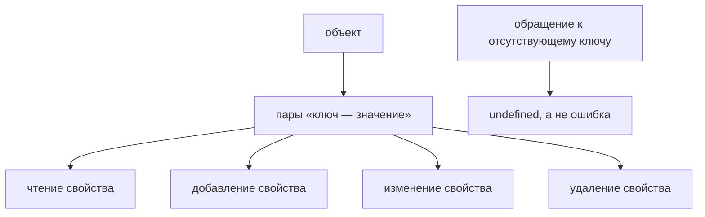

# Объектный тип

## Связь с предыдущей главой

Предыдущая глава начала блок **Values and Types** и объяснила primitive значения:

Primitive value представляет одно indivisible value:

```javascript
const age = 30;
const userName = 'Anna';
const isActive = true;
```

Но реальные программы редко работают только с отдельными значения. В тестах, API responses, конфигурации и UI-состояниях данные почти всегда связаны между собой.

Например:

```javascript
const firstName = 'Anna';
const lastName = 'Smith';
const age = 30;
const isActive = true;
```

Каждое value понятно отдельно. Но вместе они описывают одного пользователя.

Главный вопрос этой главы:

> Что происходит, когда одного primitive value уже недостаточно?

И дополнительный вопрос, который будет повторяться дальше:

> Какая информация сгруппирована прямо сейчас?

Object Type отвечает именно на это.

---

## Предварительные требования

Для этой главы нужно понимать:

* что value - информация, с которой работает JavaScript;
* что primitive value представляет одно indivisible value;
* что variable дает named access к value;
* что `const` запрещает reassignment identifier;
* что `console.log` выводит value;
* что `undefined` часто появляется при обращении к отсутствующей информации.

Не требуется знать References, Stack & Heap, Prototype, Prototype Chain, Classes, Object descriptors, Object wrappers или Garbage Collector. Эти темы будут изучаться в отдельных главах.

---

## Время изучения

Ориентировочное время:

```text
Чтение главы:            100-130 минут
Разбор схем:             35-50 минут
Запуск примеров:         20-30 минут
Практика:                90-120 минут
Повторение материала:    25 минут
```

Уровень сложности: **L2-L3**.

Тема кажется простой, потому что syntax object literals выглядит дружелюбно. Но большинство ошибок с test data, API responses and configuration начинается не с синтаксиса, а с неверного понимания того, какая информация должна быть grouped together.

---

## Навигация

Предыдущая глава:

```text
docs/01-javascript/11-primitive-types.md
```

Текущая глава:

```text
docs/01-javascript/12-object-type.md
```

Следующая глава:

```text
docs/01-javascript/13-references.md
```

Следующая глава объяснит References. Это будет ответ на вопрос: если Object value может содержать много related значения, как JavaScript работает с таким value internally? В этой главе этот механизм не разбирается.

---

## Цели обучения

После изучения этой главы вы будете понимать:

* почему primitive значения иногда insufficient;
* зачем JavaScript нужен Object Type;
* что Object value groups related information;
* что такое property;
* чем property name отличается от property value;
* как читать property value;
* как updating property меняет grouped information;
* как adding property расширяет object;
* что означает deleting property на базовом уровне;
* как читать nested objects conceptually;
* почему arrays и functions тоже относятся к object значениям, но требуют отдельных глав;
* как objects используются в API responses, JSON, test data and configuration;
* как отличать expected object structure from actual object structure.

---

## Мотивация

Начнем с проблемы.

Допустим, тест проверяет профиль пользователя:

```javascript
const firstName = 'Anna';
const lastName = 'Smith';
const age = 30;
const isActive = true;
```

Все значения корректны:

Но в программе отсутствует важная идея:

```text
firstName
lastName
age
isActive
```

Эти значения are related. Они описывают одну entity: user.

```text
firstName  ──→  [ 'Anna' ]
lastName   ──→  [ 'Ivanova' ]
age        ──→  [ 30 ]
isActive   ──→  [ true ]

связь между ними нигде не выражена
```

Engine видит отдельные значения. Читатель понимает, что они связаны. Код пока не выражает эту связь.

Object решает эту проблему:

```javascript
const user = {
  firstName: 'Anna',
  lastName: 'Smith',
  age: 30,
  isActive: true,
};
```

Теперь программа говорит явно:

Что information is grouped together right now?

Ответ:

```text
All user-related information is grouped inside one Object value.
```

В Automation QA это встречается постоянно:

```javascript
const expectedUser = {
  firstName: 'Anna',
  lastName: 'Smith',
  age: 30,
  isActive: true,
};
```

Такой код легче читать, проще передавать в helper, удобнее сравнивать с API response и безопаснее поддерживать.

---

## Теория

### Примитив и объект

Примитивное значение представляет одно неделимое значение.

Объектное значение группирует несколько связанных значений в одну сущность.

```text
примитив:  status  ──→  [ 'active' ]

объект:    user    ──→  ┌ firstName: 'Anna'
                        │ age:       30
                        └ isActive:  true
```

Важно:

Объект — тоже значение.

То есть `user` не является набором случайных переменных. `user` даёт именованный доступ к одному объектному значению, а внутри этого значения лежит связанная информация.

### Почему примитивных значений становится недостаточно

Примитивные значения хороши, когда нужно выразить одну вещь:

```javascript
const statusCode = 200;
const userName = 'Anna';
const isActive = true;
```

Но они становятся неудобными, когда появляется сущность — пользователь, ответ
сервиса, запись в базе. У сущности несколько признаков, и они связаны между
собой.

Если хранить всё отдельно, связь существует только в голове программиста:
передать «пользователя» в функцию нельзя, придётся передавать четыре аргумента и
следить за их порядком.

Объект делает связь частью кода:

```text
было:  четыре независимых имени
стало: одно имя user, внутри — четыре свойства
```

### Что такое объектное значение

Объектное значение — составное значение, которое содержит свойства.

Но лучше начать не с определения, а с наблюдения:

```javascript
const user = {
  firstName: 'Anna',
  lastName: 'Smith',
  age: 30,
};
```

Какая информация сгруппирована прямо сейчас? Имя, фамилия и возраст — три
признака одного человека.

Структура объекта:

```text
user
 ├─ firstName : 'Anna'
 ├─ lastName  : 'Ivanova'
 └─ age       : 30
```

Объект полезен тем, что даёт программе одно имя для целой сущности: его можно
передать, вернуть, сравнить и записать в массив как единое значение.

В коде:

```javascript
const user = {
  firstName: 'Anna',
  age: 30,
  isActive: true,
  role: 'admin',
};
```

### Свойства

Свойство — элемент объекта, состоящий из имени свойства и его значения.

```javascript
const user = {
  firstName: 'Anna',
};
```

```text
property = имя + значение

firstName  :  'Anna'
   имя        значение
```

В литерале объекта это выглядит так:

```javascript
const user = {
  firstName: 'Anna',
  //  ↑ имя      ↑ значение
};
```

Имя свойства отвечает на вопрос:

```text
как называется эта часть информации?
```

Значение свойства отвечает на вопрос:

```text
What information is stored under this name?
```

### Имена свойств

Имя свойства — то, по чему обращаются к информации внутри объекта.

```javascript
const user = {
  firstName: 'Anna',
  lastName: 'Smith',
};
```

Имена свойств:

```text
firstName
lastName
```

Мысленная модель словаря: объект — это словарь, где по имени свойства находится значение, как слово и его перевод.

Имя свойства — не то же самое, что имя переменной.

```javascript
const user = {
  firstName: 'Anna',
};
```

Здесь:

```text
user       — имя переменной, по нему находят объект
firstName  — имя свойства, оно существует только внутри объекта
```

Имя свойства не участвует в поиске по цепочке окружений: его ищут в самом
объекте.

### Значения свойств

Значение свойства — те данные, которые лежат под этим именем.

```javascript
const user = {
  firstName: 'Anna',
  age: 30,
  isActive: true,
};
```

Значения свойств могут быть любого типа:

```text
firstName : 'Anna'   строка
age       : 30       число
isActive  : true     булево значение
```

Объект здесь группирует три примитивных значения — по отдельности они ничего не
сообщают друг о друге, вместе описывают одного пользователя.

Позже объект сможет группировать и другие объекты. Вложенные объекты вводятся в этой главе концептуально, а их внутреннее поведение будет изучаться позже.

### Чтение свойств

Чтобы прочитать информацию внутри объекта, используют обращение к свойству:

```javascript
const user = {
  firstName: 'Anna',
  age: 30,
};

console.log(user.firstName);
console.log(user.age);
```

```text
user.firstName  →  найти свойство firstName  →  'Anna'
```

Что движок делает прямо сейчас?

Если свойства не существует, результатом будет `undefined`:

```javascript
const user = {
  firstName: 'Anna',
};

console.log(user.role);
```

```text
user.role  →  свойство role не найдено  →  undefined
```

Это не означает, что объект исчез или сломался. Это означает: под запрошенным именем свойства значение не найдено.

### Обновление свойств

Объект может представлять меняющееся состояние одной и той же сущности.

```javascript
const user = {
  firstName: 'Anna',
  age: 30,
};

user.age = 31;

console.log(user.age);
```

```text
было:  age: 30
стало: age: 31

объект тот же, изменилось значение свойства
```

Какая информация сгруппирована прямо сейчас?

Важно:

```javascript
const user = {
  age: 30,
};

user.age = 31;
```

`const` запрещает повторное присваивание имени `user`. Он не означает, что каждое свойство объекта заморожено. Почему так происходит внутри, будет объяснено в главе про ссылки. Сейчас достаточно понимать поведение: свойство объекта можно изменить.

### Добавление свойств

Объект можно дополнить новой информацией.

```javascript
const user = {
  firstName: 'Anna',
};

user.role = 'admin';

console.log(user.role);
```

```text
было:  firstName, age
стало: firstName, age, role
```

Это полезно, когда информация появляется по шагам: часть данных известна сразу, часть — после ответа сервиса.

Но добавлять свойства нужно осторожно. В коде тестов чаще лучше создавать объект с ожидаемой структурой явно, чтобы читатель сразу видел нужную форму.

### Удаление свойств

Свойство можно удалить из объекта:

```javascript
const user = {
  firstName: 'Anna',
  temporaryCode: '1234',
};

delete user.temporaryCode;

console.log(user.temporaryCode);
```

```text
было:  firstName, temporaryCode
стало: firstName

обращение к удалённому свойству даёт undefined
```

На высоком уровне `delete` удаляет свойство из объекта. Это не глава про очистку памяти и сборщик мусора — он будет изучаться позже.

Какая информация сгруппирована прямо сейчас?

### Вложенные объекты

Иногда одна сгруппированная сущность содержит внутри другую.

```javascript
const user = {
  profile: {
    firstName: 'Anna',
    lastName: 'Smith',
  },
  settings: {
    theme: 'dark',
    emailNotifications: true,
  },
};
```

```text
user
├── firstName: 'Anna'
└── settings
    ├── theme: 'dark'
    └── emailNotifications: true
```

Какая информация сгруппирована прямо сейчас?

Чтение вложенного свойства:

```javascript
console.log(user.profile.firstName);
```

Концептуально это два шага чтения: сначала из `user` берётся свойство `profile`
(само объектное значение), затем из него — `firstName`.

```text
user . profile . firstName
└──┘   └─────┘   └───────┘
объект  объект    строка
```

Вложенные объекты часто встречаются в ответах API:

```json
{
  "user": {
    "profile": {
      "firstName": "Anna"
    }
  }
}
```

В этой главе вложенный объект — только модель группировки. Ссылки и более глубокое внутреннее поведение будут изучаться позже.

### Массивы и функции — тоже объекты

В JavaScript много разновидностей объектных значений.

Массив — объектное значение для упорядоченных коллекций. Функции — вызываемые объектные значения. Даты и другие встроенные объекты дают специализированное поведение.

Подробно массивы, функции, даты, прототипы и поведение встроенных объектов будут изучаться позже. Сейчас важно не перегружать главу: текущая модель объекта — про группировку связанной информации в свойствах.

Схема разновидностей объектов:

```text
объектное значение
├── обычный объект   { id: 1 }        группировка свойств
├── массив           [1, 2, 3]        упорядоченная коллекция
├── функция          () => {}         вызываемый объект
└── встроенные       new Date()       специализированное поведение
```

Все четыре строки — объектные значения: они живут в куче и доступны по ссылке.
Различается только поведение, которое к ним добавлено.

---

Объект — набор пар, доступных четырьмя операциями:


```mermaid
flowchart TD
    A["объект"] --> B["пары «ключ — значение»"]
    B --> C["чтение свойства"]
    B --> D["добавление свойства"]
    B --> E["изменение свойства"]
    B --> F["удаление свойства"]
    G["обращение к отсутствующему ключу"] --> H["undefined, а не ошибка"]
```

## Внутренний механизм

Эта глава не объясняет ссылки, стек с кучей и сборку мусора. Но нужно понять концептуальный внутренний механизм: что движок делает со сгруппированной информацией.

### Создание объекта

Когда движок выполняет литерал объекта:

```javascript
const user = {
  firstName: 'Anna',
  age: 30,
};
```

Он создаёт объектное значение со свойствами.

Время жизни объекта:

```text
1. вычисляются значения свойств: 'Anna', 30
2. создаётся объект с двумя свойствами
3. имя user связывается с этим объектом
4. объект живёт, пока на него ссылается хотя бы одно имя
```

### Поиск свойства внутри объекта

Когда код читает `user.firstName`, движок не просматривает все свойства. Он ищет одно имя.

Полный процесс поиска:

```text
1. по имени user найти объект
2. в объекте найти свойство с именем firstName
3. свойство есть  → вернуть его значение
4. свойства нет   → вернуть undefined, без ошибки
```

Отсутствующее свойство не ошибка — в отличие от отсутствующего имени
переменной.

Это механизм, стоящий за множеством ошибок новичков:

```javascript
const user = {
  firstName: 'Anna',
};

console.log(user.firstname);
```

`firstName` и `firstname` — разные имена свойств.

### Обновление сгруппированной информации

Когда свойство обновляется, объект по-прежнему представляет ту же смысловую сущность.

После:

```text
user.age = 31
```

Концептуальный объект:

Какая информация сгруппирована прямо сейчас?

```text
Information about the same user,
but one property value changed.
```

### Текущее место в модели JavaScript

```text
примитив  →  одно неделимое значение
объект    →  структура из связанных значений
```

Глава про примитивы отвечала на вопрос:

```text
What kind of single value is this?
```

Глава про объекты отвечает:

```text
What related information belongs together?
```

### Переход к ссылкам

Объект порождает следующий естественный вопрос.

Если объектное значение может содержать несколько свойств, то что именно хранит
переменная — сам объект или способ его найти?

Это мост к теме ссылок: две переменные могут указывать на один и тот же объект, и
тогда изменение через одну будет видно через другую.

Ссылки будут изучены в следующей главе. Эта глава намеренно останавливается перед этим механизмом.

---

## Ментальная модель

### Папка с документами

Объект похож на папку с документами.

У каждого документа есть имя и содержимое. Вместе они относятся к одной папке.

### Карточка профиля

Объект можно представить как карточку профиля:

Это особенно близко к тестированию интерфейса и API. Интерфейс часто показывает карточку профиля, API часто возвращает объект профиля.

### Словарь

Объект работает и как словарь:

```text
Key        Value
--------- -----------
firstName Anna
lastName  Smith
age       30
isActive  true
```

Имя свойства похоже на ключ. Значение свойства — на перевод слова.

### Запись в базе данных

Объект может представлять одну запись — строку таблицы, элемент списка, ответ на
один запрос:

```javascript
const workItem = { id: 'T-1', title: 'Отчёт', status: 'NEW' };
```

В тестах эта модель помогает сравнивать ожидаемый объект с ответом API или строкой базы данных.

### Временная группировка

Объект может быть и временным рабочим местом: он собирает вместе данные, которые
нужны одному шагу, и дальше не используется.

Это полезно во вспомогательных функциях — вместо четырёх параметров функция
принимает один объект, и вызов становится читаемым:

```javascript
const loginData = {
  email: 'anna@example.com',
  password: 'secure-password',
};
```

Объект отвечает:

```text
Which pieces of information should travel together?
```

---

## Примеры кода

Все примеры находятся в:

```text
examples/01-javascript/chapter-12/
```

Запуск:

```bash
node examples/01-javascript/chapter-12/01-create-object.js
node examples/01-javascript/chapter-12/02-read-properties.js
node examples/01-javascript/chapter-12/03-update-properties.js
node examples/01-javascript/chapter-12/04-add-properties.js
node examples/01-javascript/chapter-12/05-delete-properties.js
node examples/01-javascript/chapter-12/06-nested-object.js
```

### 01-create-object.js

Этот пример показывает создание одного объектного значения:

```javascript
const user = {
  firstName: 'Anna',
  lastName: 'Smith',
  age: 30,
  isActive: true,
};

console.log(user);
```

Какая информация сгруппирована прямо сейчас?

```text
All basic user profile information.
```

### 02-read-properties.js

Этот пример показывает чтение свойств:

```javascript
console.log(user.firstName);
console.log(user.age);
```

Движок читает по одному значению свойства за раз.

### 03-update-properties.js

Этот пример показывает обновление существующих свойств:

```javascript
user.age = 31;
user.isActive = false;
```

Объект по-прежнему представляет того же пользователя, но сгруппированная информация изменилась.

### 04-add-properties.js

Этот пример показывает добавление свойств:

```javascript
user.role = 'admin';
user.deletedAt = null;
```

Теперь объект содержит больше информации о той же сущности.

### 05-delete-properties.js

Этот пример показывает удаление свойства на высоком уровне:

```javascript
delete user.temporaryCode;
```

Свойство больше не принадлежит объекту.

### 06-nested-object.js

Этот пример показывает вложенную группировку:

```javascript
const user = {
  profile: {
    firstName: 'Anna',
    lastName: 'Smith',
  },
  settings: {
    theme: 'dark',
  },
};
```

Объект содержит сгруппированную информацию, а некоторые свойства сами являются сгруппированными объектами.

---

## Частые вопросы

### `Object` и `object` означают одно и то же?

В тексте курса «Объект» с большой буквы означает тип объекта в JavaScript. В обычном тексте «объект» может означать конкретное объектное значение.

### Почему `const user = {}` позволяет менять `user.age`?

`const` защищает имя от повторного присваивания.

```javascript
const user = {
  age: 30,
};

user.age = 31;
```

Этот код обновляет свойство внутри объекта. Почему это возможно внутри, будет объяснено в главе про ссылки. Сейчас важно запомнить наблюдаемое поведение: `const` не делает объект неизменяемым.

### Чем объект отличается от JSON?

Объект JavaScript — это значение внутри работающей программы. JSON — текстовый формат данных, который часто используется при обмене через API.

JSON будет изучаться позже, вместе с тестированием API. Сейчас достаточно понимать, что ответы API часто выглядят как структуры объектов, но сам JSON до разбора является текстом.

### Что произойдёт при чтении отсутствующего свойства?

На этом уровне:

```javascript
const user = {
  firstName: 'Anna',
};

console.log(user.role);
```

Результат:

```text
undefined
```

Движок не нашёл имя свойства `role` внутри объекта.

### Массивы и функции — тоже объекты?

Да, массивы и функции относятся к объектным значениям. Но массивы нужны для упорядоченных коллекций, а функции — вызываемые значения. Отдельные главы объяснят их позже.

---

## Распространённые мифы

### Миф: объект — это просто много переменных

Реальность:

Объект — одно значение, которое группирует связанные свойства.

### Миф: `const` делает объект неизменяемым

Реальность:

`const` запрещает повторное присваивание имени, а не изменение свойств.

```javascript
const user = {
  age: 30,
};

user.age = 31; // works
```

Техники неизменяемости объектов существуют, но относятся к будущим главам.

### Миф: отсутствующее свойство означает, что объект сломан

Реальность:

Отсутствующее свойство означает, что запрошенное имя не найдено.

### Миф: вложенный объект нужно сразу объяснять через стек и кучу

Реальность:

Для этой главы вложенный объект — просто сгруппированная информация внутри сгруппированной информации. Стек, куча и ссылки придут позже.

---

## Распространённые ошибки

### Ошибка 1. Хранить связанную информацию в отдельных переменных

Плохо:

```javascript
const firstName = 'Anna';
const lastName = 'Smith';
const age = 30;
const isActive = true;
```

Лучше:

```javascript
const user = {
  firstName: 'Anna',
  lastName: 'Smith',
  age: 30,
  isActive: true,
};
```

Почему:

```text
Object makes relationship explicit.
```

### Ошибка 2. Путать имя свойства и его значение

```javascript
const user = {
  role: 'admin',
};
```

Здесь:

```text
role     — имя свойства, по нему ищут значение
'admin'  — само значение, оно хранится под этим именем
```

Путаница видна в коде вида `user.admin`: так ищут свойство с именем `admin`,
которого в объекте нет, и получают `undefined`.

### Ошибка 3. Ошибиться в регистре имени свойства

```javascript
const user = {
  firstName: 'Anna',
};

console.log(user.firstname);
```

Результат:

```text
undefined
```

`firstName` и `firstname` — разные имена свойств.

### Ошибка 4. Добавлять свойства неявно и усложнять структуру

```javascript
const user = {
  firstName: 'Anna',
};

user.role = 'admin';
user.permissions = ['read'];
user.lastLoginAt = null;
```

Иногда это нормально. Но в тестах ожидаемый объект часто понятнее, когда его структура видна при создании:

```javascript
const expectedUser = {
  firstName: 'Anna',
  role: 'admin',
  permissions: ['read'],
  lastLoginAt: null,
};
```

Массивы будут изучаться позже. Здесь важна читаемость структуры объекта.

### Ошибка 5. Объяснять объект через ссылки слишком рано

Ссылки важны, но это не первый вопрос. Сначала нужно понять, что объект делает концептуально:

```text
Object groups related information.
```

Затем следующая глава объяснит, как JavaScript работает с объектными значениями внутри.

---

## Практическое использование

Объекты появляются всюду, где коду нужно представить сущность.

### Профиль пользователя

```javascript
const user = {
  firstName: 'Anna',
  lastName: 'Smith',
  age: 30,
  isActive: true,
};
```

Какая информация сгруппирована прямо сейчас?

```text
Information about one user.
```

### Конфигурация теста

```javascript
const config = {
  baseUrl: 'https://example.com',
  retries: 2,
  headless: true,
};
```

Объект группирует настройки, которые читаются вместе.

### Ожидаемый API-результат

```javascript
const expectedUser = {
  id: 101,
  email: 'anna@example.com',
  role: 'admin',
  isActive: true,
};
```

Объект делает ожидаемую структуру видимой.

### Полный обзор объекта

---

## Использование в Automation QA

Код автоматизации тестов работает с объектами постоянно.

### Объекты ответа API

Ответ API часто описывает одну сущность:

```javascript
const responseUser = {
  id: 101,
  email: 'anna@example.com',
  role: 'admin',
  isActive: true,
};
```

```text
user
├── id:       42
├── email:    'anna@example.com'
├── role:     'admin'
└── isActive: true
```

### Объекты JSON

REST API часто присылает JSON, который выглядит как структура объекта:

```json
{
  "id": 101,
  "email": "anna@example.com",
  "isActive": true
}
```

После разбора код теста обычно работает с объектным значением JavaScript. Детали разбора JSON будут изучаться позже, вместе с тестированием API.

### Объекты профиля пользователя

Тесты интерфейса часто сравнивают показанный профиль с ожидаемым объектом:

```javascript
const expectedProfile = {
  firstName: 'Anna',
  lastName: 'Smith',
  role: 'admin',
};
```

Такой код поддерживать проще, чем набор отдельных ожидаемых переменных.

### Объекты конфигурации

Тестовые фреймворки используют объекты для настройки:

```javascript
const browserConfig = {
  headless: true,
  viewportWidth: 1280,
  viewportHeight: 720,
};
```

Даже до подробного изучения настроек Playwright форма понятна:

```text
один объект — одна настройка запуска
имя свойства  — что настраиваем
значение      — как именно
```

Такую настройку можно передать одним аргументом и прочитать целиком, не
разбирая её на отдельные переменные.

### Объекты тестовых данных

```javascript
const registrationData = {
  email: 'anna@example.com',
  password: 'secure-password',
  firstName: 'Anna',
};
```

Объект держит связанные входные значения вместе.

### Ожидаемая и фактическая структура объекта

Многие падения тестов связаны не с одним неверным примитивным значением, а с неверной структурой.

Тестировщик должен спросить себя:

```text
Which properties should this object have?
Which values should be under these property names?
Which nested objects are expected?
```

Это и есть мышление в терминах объектов.

---

## Итоги

Примитивные значения представляют одно неделимое значение.

Объектные значения группируют несколько связанных значений в одну сущность.

Объект содержит свойства — пары «имя и значение».

С объектом можно выполнять базовые операции: читать свойство, добавлять новое,
изменять существующее, удалять.

Вложенные объекты представляют сгруппированную информацию внутри сгруппированной
информации: `user.profile.firstName` — три уровня одной записи.

Массивы и функции тоже относятся к объектным значениям, но их детали будут разобраны в отдельных главах.

Следующая глава отвечает на следующий естественный вопрос:

```text
If objects contain multiple values,
how does JavaScript work with them internally?
```

Это тема главы про ссылки.

---

## Что нужно запомнить

* Объект — это значение JavaScript.
* Объект группирует связанную информацию.
* Свойство состоит из имени и значения.
* Имена свойств используют, чтобы читать информацию из объекта.
* Обращение к отсутствующему свойству на этом уровне даёт `undefined`.
* Обновление свойства меняет сгруппированную информацию.
* Добавление свойства расширяет структуру объекта.
* Удаление свойства убирает информацию из объекта на высоком уровне.
* Вложенный объект — это сгруппированная информация внутри сгруппированной информации.
* `const` не делает свойства объекта неизменяемыми.
* Массивы и функции — объектные значения, но они будут изучаться отдельно.
* Не объясняйте объекты через ссылки раньше, чем станет понятно, зачем объекты нужны.

---

## Проверьте себя

Ответьте без запуска кода.

1. Почему четыре отдельных примитивных значения могут быть хуже одного объекта?
2. Что такое свойство?
3. Чем имя свойства отличается от его значения?
4. Что произойдёт при чтении отсутствующего свойства?
5. Что меняется после `user.age = 31`?
6. Что делает `delete user.temporaryCode` на базовом уровне?
7. Почему вложенный объект полезен для ответа API?
8. Почему `const user = {}` не делает объект неизменяемым?
9. Какие сценарии автоматизации чаще всего используют объекты?
10. На какой вопрос будет отвечать следующая глава про ссылки?

### Ответы

1. Четыре переменные об одной сущности легко рассинхронизировать: одну обновили, другую забыли. Объект делает их одним значением — его целиком передают, возвращают и сравнивают.
2. Пара «имя — значение» внутри объекта. Имя свойства существует только внутри этого объекта.
3. Имя свойства — способ найти значение внутри объекта, значение — сами данные. `user.role` — обращение по имени `role`, а `'admin'` — то, что под ним лежит.
4. Вернётся `undefined`, ошибки не будет. Отсутствующее свойство — обычный результат, в отличие от отсутствующего имени переменной.
5. Если свойство `age` было, его значение заменяется; если не было, оно добавляется в объект. Само имя `user` при этом не меняется — оно по-прежнему ведёт к тому же объекту.
6. Удаляет свойство из объекта. После этого чтение по тому же имени даёт `undefined`, как будто свойства никогда не было.
7. Ответ API сам по себе вложенный: у заказа есть покупатель, у покупателя — адрес. Вложенный объект сохраняет эту структуру, вместо того чтобы разворачивать её в плоский набор имён.
8. `const` запрещает присвоить переменной другой объект, но не запрещает менять свойства этого объекта. Запрет относится к имени, а не к содержимому.
9. Тело запроса, ответ API, тестовые данные, настройки запуска, описание ожидаемого результата — почти всё, кроме отдельных чисел и строк.
10. Что на самом деле хранит имя, когда речь идёт об объекте, и почему изменение через одно имя видно через другое.

---

## Практика

Практика находится в файле:

```text
practice/01-javascript/12-object-type.md
```

Выполняйте задания после чтения главы и запуска примеров.

Сначала отвечайте без решений. Цель практики — научиться видеть структуру объекта и сгруппированную информацию, а не просто повторить синтаксис.

---

## Решения

Решения находятся в файле:

```text
solutions/01-javascript/12-object-type.md
```

Читайте решения после самостоятельной попытки. В этой теме важно сравнивать не только итоговый ответ, но и рассуждение: какая информация сгруппирована, какие имена свойств используются и где структура объекта отличается от ожидания.
