# References

## Связь с предыдущей главой

Предыдущая глава объяснила, зачем JavaScript нужен Object Type.

Primitive value представляет одно indivisible value:

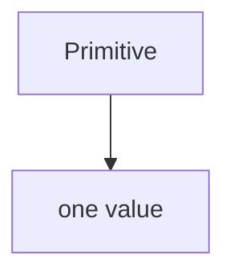

Object value groups related information:

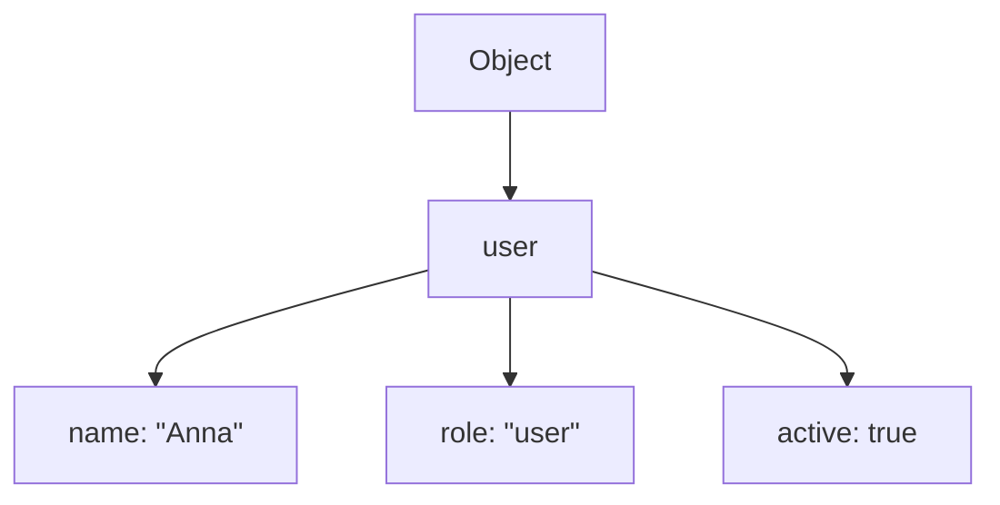

Теперь появляется следующий вопрос.

Если object содержит много related значения, как несколько variables могут работать with the same object?

Начнем с поведения, которое часто удивляет:

```javascript
const user = {
  name: 'Anna',
};

const admin = user;

admin.name = 'Kate';

console.log(user.name);
```

Результат:

```text
Kate
```

Вопрос:

> Почему изменился `user`, если мы меняли `admin`?

Эта глава отвечает на него через references.

Главный вопрос главы:

> На какой object эта переменная ссылается прямо сейчас?

---

## Предварительные требования

Для этой главы нужно понимать:

* что variable дает named access к value;
* что primitive значения are indivisible;
* что object value groups related information;
* что object contains properties;
* что property can be read and updated;
* что `const` prevents reassignment of identifier, but does not freeze object properties.

Не требуется знать Stack & Heap, Garbage Collector, memory addresses, engine optimizations, pointer implementation, Prototype Chain или object freezing. Эти темы будут изучаться позже.

Важно: в этой главе reference объясняется conceptually. Мы не описываем implementation details.

---

## Время изучения

Ориентировочное время:

```text
Чтение главы:            110-140 минут
Разбор схем:             40-55 минут
Запуск примеров:         20-30 минут
Практика:                90-120 минут
Повторение материала:    25 минут
```

Уровень сложности: **L3**.

Это одна из ключевых тем для Automation QA. Ошибки с shared test data, expected objects and helper functions often come from misunderstanding references.

---

## Навигация

Предыдущая глава:

```text
docs/01-javascript/12-object-type.md
```

Текущая глава:

```text
docs/01-javascript/13-references.md
```

Следующая глава:

```text
docs/01-javascript/14-stack-and-heap.md
```

Следующая глава объяснит commonly used conceptual memory model: Stack & Heap. В этой главе мы не используем эту модель, потому что сначала нужно понять observable поведение references.

---

## Цели обучения

После изучения этой главы вы будете понимать:

* почему references exist;
* что reference означает conceptually;
* чем reference отличается от object;
* почему multiple variables can refer to one object;
* что происходит при reading through a reference;
* что происходит при updating through a reference;
* что означает assigning one reference to another variable;
* почему primitive assignment behaves differently;
* чем identity отличается от copied primitive значения на концептуальном уровне;
* почему unexpected object changes часто возникают in Automation QA;
* как helper functions can modify shared objects;
* как безопаснее работать with expected test data.

---

## Мотивация

Начнем не с определения.

Посмотрите на код:

```javascript
const user = {
  name: 'Anna',
};

const admin = user;

admin.name = 'Kate';

console.log(user.name);
```

Если думать, что variable contains object, хочется ожидать:

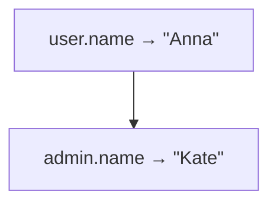

Но результат другой:

```text
Kate
```

Диаграмма удивительного поведения:

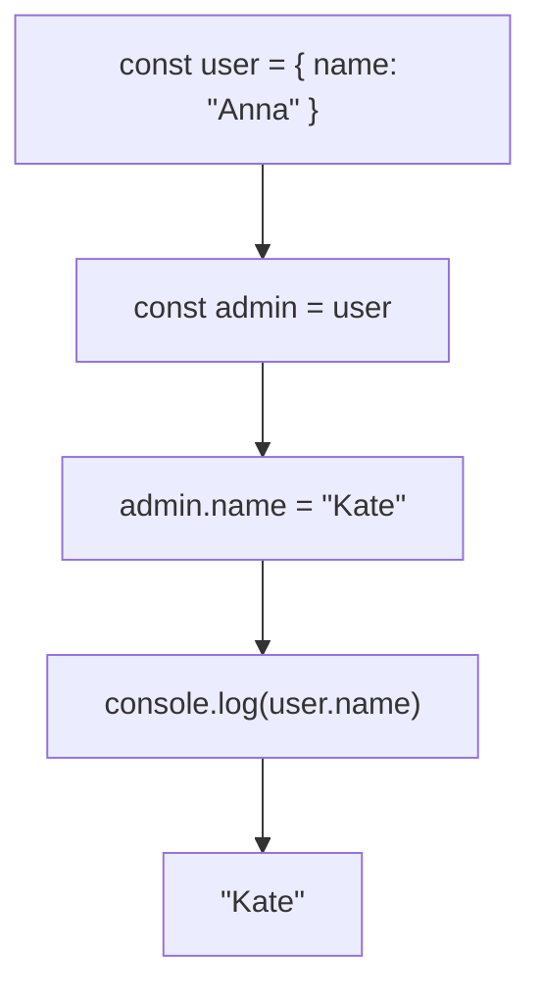

Это невозможно объяснить моделью "каждая variable содержит собственный object".

Нужна другая модель:

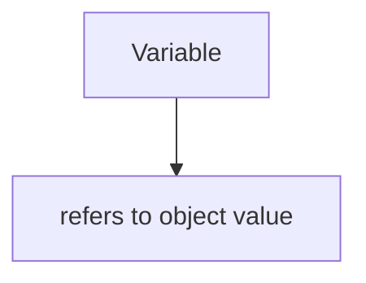

`user` and `admin` are two ways to reach the same object.

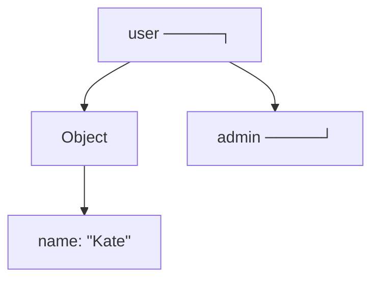

Главный вопрос:

> На какой object эта переменная ссылается прямо сейчас?

---

## Теория

### Почему references exist

Objects can be large, structured and mutable.

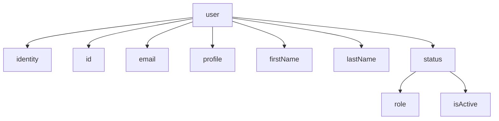

Если бы every assignment of object created a full independent copy, JavaScript programs became harder to reason about and less practical:

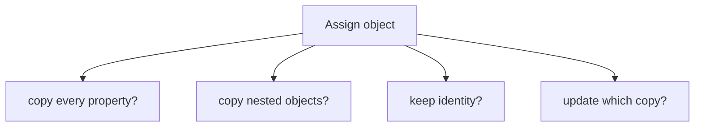

Instead JavaScript allows variables to refer to object значения.

Концептуальная идея:

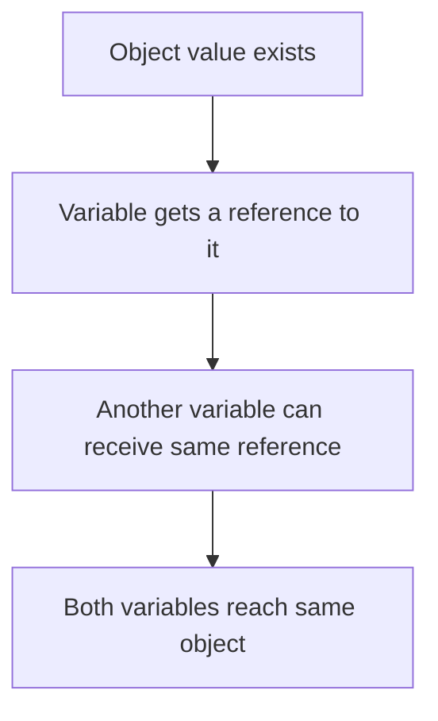

Reference exists to let code work with object значения without treating every object assignment as independent duplication.

### Что такое reference conceptually

Reference is a conceptual connection from a variable to an object value.

Не запоминайте это как implementation detail. В этой главе reference means:

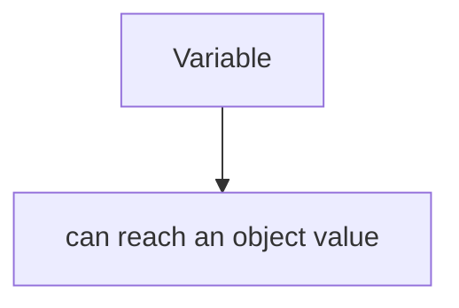

Диаграмма Object + Reference:

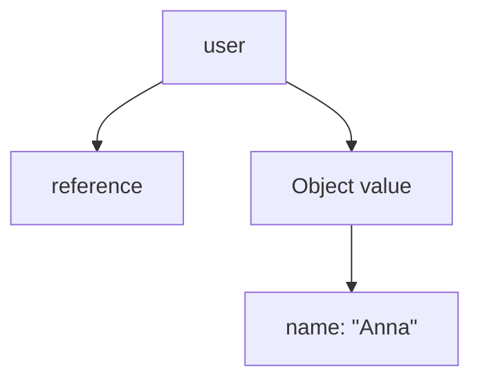

Reference is not the object itself.

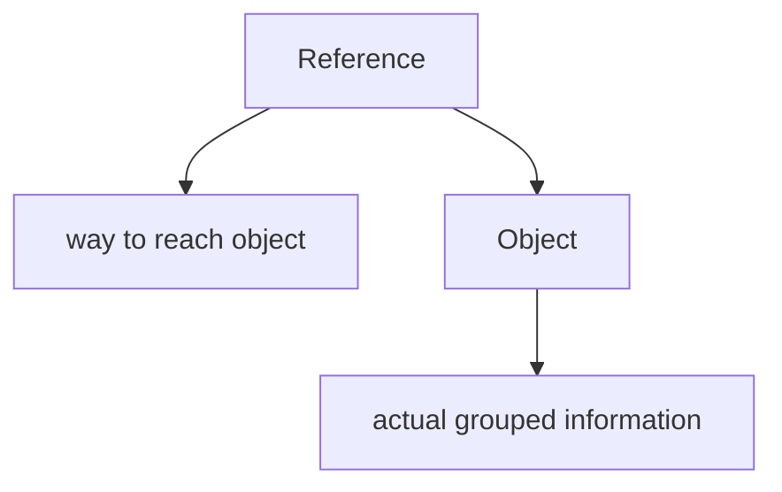

Ментальная модель bookmark:

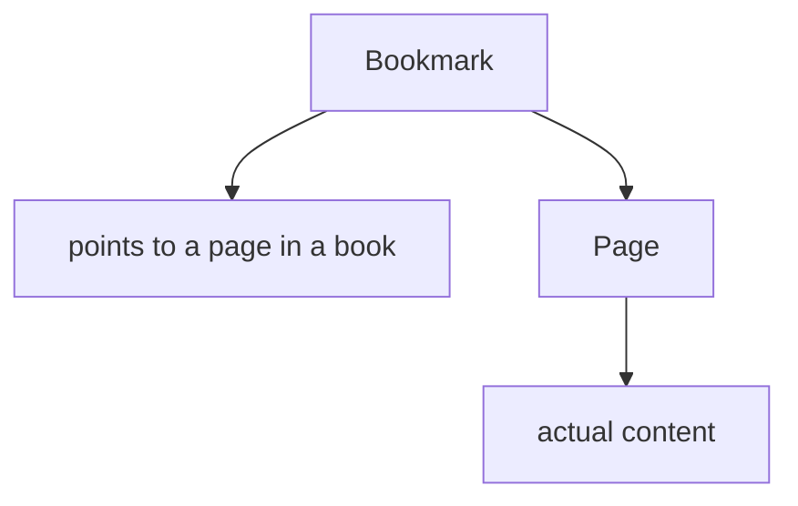

Bookmark is not the page. Reference is not the object.

### Reference vs object

Object is the value with properties.

Reference is how variable reaches that object.

```javascript
const user = {
  name: 'Anna',
};
```

Концептуально:

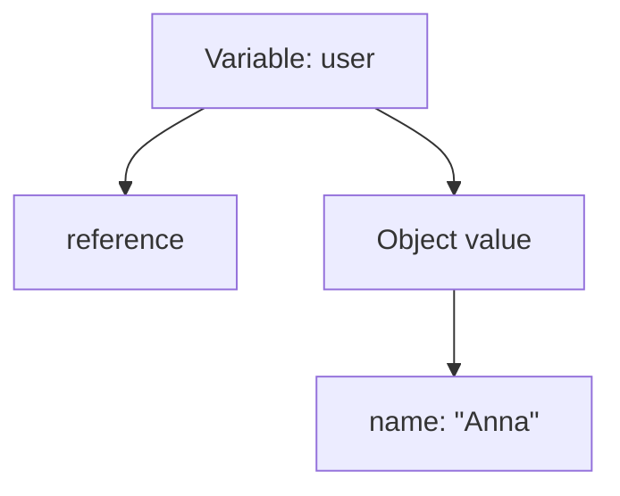

Object отвечает:

```text
What information is grouped together?
```

Reference отвечает:

```text
Which object does this variable refer to?
```

### Primitive assignment

Primitive значения behave differently.

```javascript
let userName = 'Anna';
let adminName = userName;

adminName = 'Kate';

console.log(userName);
console.log(adminName);
```

Вывод:

```text
Anna
Kate
```

Диаграмма primitive assignment:

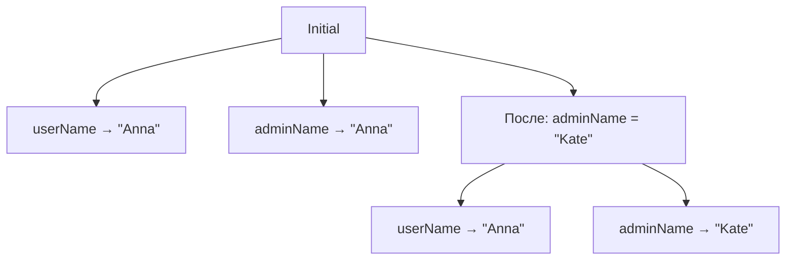

At this conceptual level, assignment of primitive value gives another variable its own primitive value.

Primitive comparison:

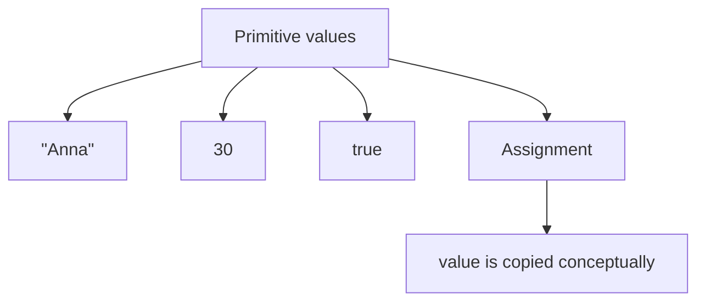

This is why changing `adminName` does not affect `userName`.

### Object assignment

Object assignment behaves differently.

```javascript
const user = {
  name: 'Anna',
};

const admin = user;
```

Диаграмма object assignment:

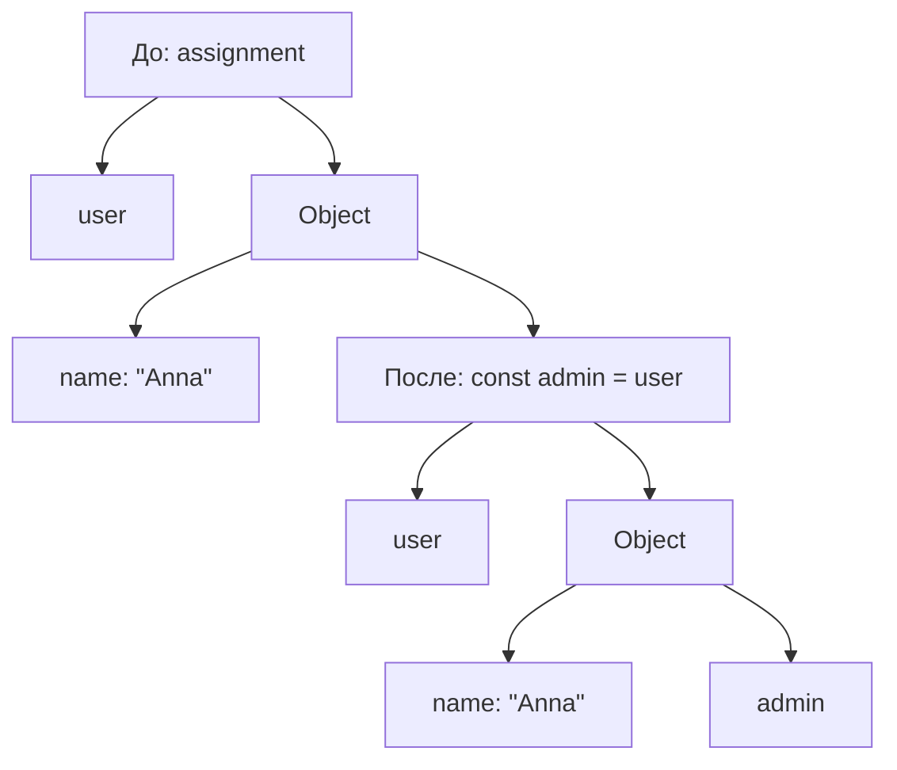

One object, two variables:

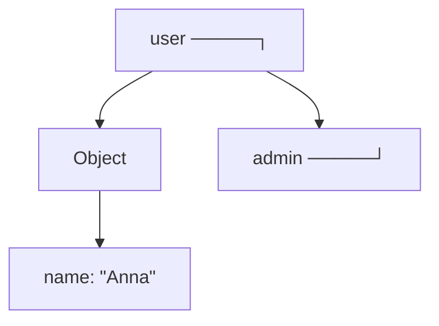

На какой object сейчас ссылается `admin`?

```text
The same object as user.
```

### Multiple variables referring to one object

Several variables can refer to one object:

```javascript
const user = {
  name: 'Anna',
  role: 'user',
};

const admin = user;
const currentUser = user;
```

Shared object схема:

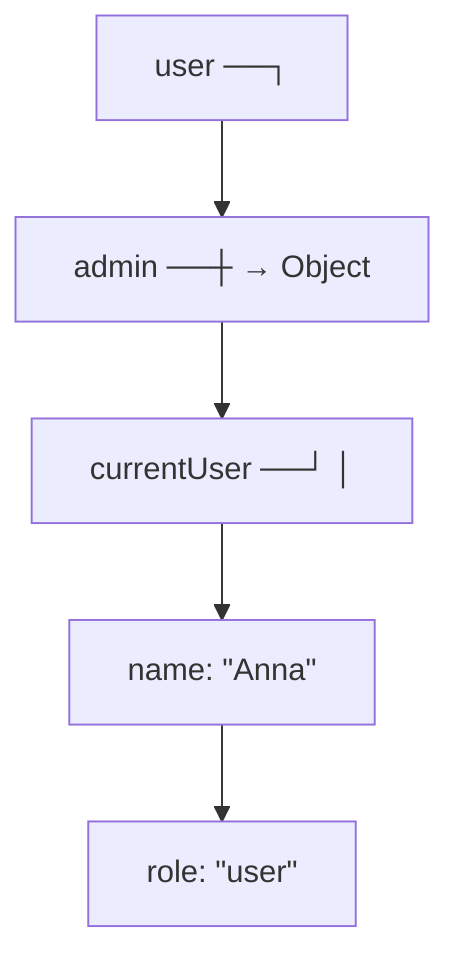

This is not three users.

This is:

```text
one object
three variables referring to it
```

Ментальная модель multiple labels pointing to one folder:

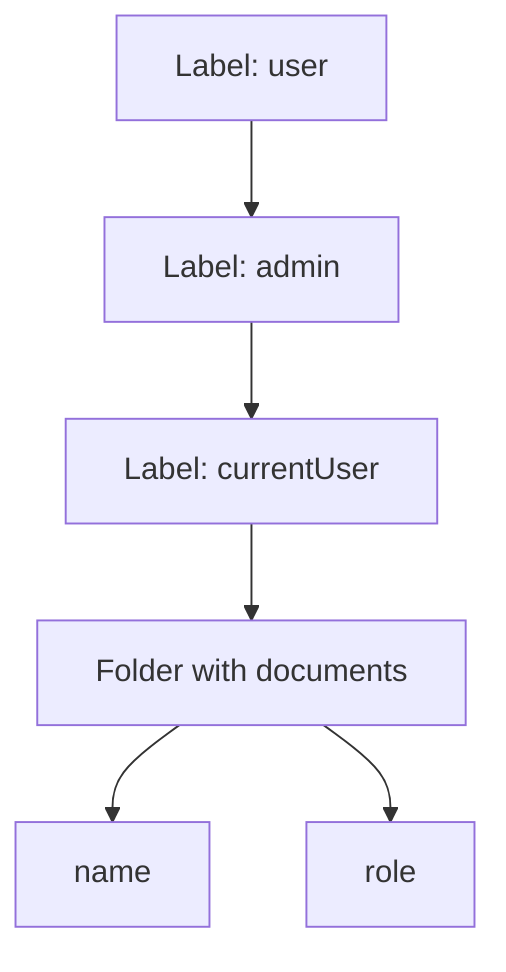

### Reading through a reference

When code reads:

```javascript
console.log(admin.name);
```

Engine conceptually does:

```mermaid
flowchart TD
    N1["admin"]
    N2["follow reference to object"]
    N3["find property name"]
    N4["read property value"]
    N1 --> N2
    N2 --> N3
    N3 --> N4
```

Диаграмма reading through reference:

```mermaid
flowchart TD
    N1["admin.name"]
    N2["admin refers to Object"]
    N3["Object has property name"]
    N4["возвращённое значение: &quot;Anna&quot;"]
    N1 --> N2
    N1 --> N3
    N1 --> N4
```

Вопрос:

> На какой object сейчас ссылается `admin`?

Ответ:

```text
The object that contains name: "Anna".
```

### Updating through a reference

When code updates:

```javascript
admin.name = 'Kate';
```

Engine conceptually does:

```mermaid
flowchart TD
    N1["admin"]
    N2["follow reference to object"]
    N3["find property name"]
    N4["replace property value"]
    N1 --> N2
    N2 --> N3
    N3 --> N4
```

Диаграмма updating through reference:

```mermaid
flowchart TD
    N1["Before"]
    N2["user ──┐"]
    N3["admin ──┼ → Object"]
    N4["name: &quot;Anna&quot;"]
    N5["Operation"]
    N6["admin.name = &quot;Kate&quot;"]
    N7["After"]
    N8["user ──┐"]
    N9["admin ──┼ → Object"]
    N10["name: &quot;Kate&quot;"]
    N1 --> N2
    N1 --> N3
    N1 --> N5
    N5 --> N6
    N5 --> N7
    N7 --> N8
    N7 --> N9
    N3 --> N4
    N9 --> N10
```

`user.name` тоже показывает `"Kate"`, потому что `user` ссылается на тот же object.

### Assigning one reference to another variable

This line:

```javascript
const admin = user;
```

does not create a new object.

It makes `admin` refer to the same object as `user`.

Variables + References:

```mermaid
flowchart TD
    N1["Variable user"]
    N2["reference to Object A"]
    N3["const admin = user"]
    N4["Variable admin"]
    N5["reference to Object A"]
    N1 --> N2
    N1 --> N3
    N3 --> N4
    N4 --> N5
```

This is the central idea of the chapter:

```text
Variables do not contain objects.
Variables refer to object values.
Multiple variables can refer to the same object.
```

### Reference reassignment

If variable is declared with `let`, it can later refer to another object.

```javascript
let currentUser = {
  name: 'Anna',
};

const admin = currentUser;

currentUser = {
  name: 'Kate',
};

console.log(admin.name);
console.log(currentUser.name);
```

Вывод:

```text
Anna
Kate
```

Диаграмма reference reassignment:

```mermaid
flowchart TD
    N1["Step 1"]
    N2["currentUser ──┐"]
    N3["admin ──┘"]
    N4["Object A"]
    N5["name: &quot;Anna&quot;"]
    N6["Step 2: currentUser = { name: &quot;Kate&quot; }"]
    N7["admin → Object A"]
    N8["name: &quot;Anna&quot;"]
    N9["currentUser → Object B"]
    N10["name: &quot;Kate&quot;"]
    N1 --> N2
    N1 --> N3
    N1 --> N4
    N4 --> N5
    N1 --> N6
    N6 --> N7
    N6 --> N8
    N6 --> N9
    N9 --> N10
```

Вопрос:

> На какой object сейчас ссылается `currentUser`?

After reassignment:

```text
Object B.
```

Вопрос:

> На какой object сейчас ссылается `admin`?

Ответ:

```text
Object A.
```

### Identity vs copied primitive значения

Primitive значения are compared as значения.

```javascript
const firstName = 'Anna';
const secondName = 'Anna';

console.log(firstName === secondName);
```

Концептуально:

```mermaid
flowchart TD
    N1["&quot;Anna&quot; compared with &quot;Anna&quot;"]
    N2["same primitive value"]
    N1 --> N2
```

Object значения are different. Two objects with same properties are still two different objects.

```javascript
const firstUser = {
  name: 'Anna',
};

const secondUser = {
  name: 'Anna',
};

console.log(firstUser === secondUser);
```

Концептуальное сравнение объектов:

```mermaid
flowchart TD
    N1["firstUser → Object A"]
    N2["name: &quot;Anna&quot;"]
    N3["secondUser → Object B"]
    N4["name: &quot;Anna&quot;"]
    N5["Object A and Object B are not the same object."]
    N1 --> N3
    N3 --> N5
    N1 --> N2
    N3 --> N4
```

Object comparison here is about identity:

```text
Do both variables refer to the same object?
```

not:

```text
Do both objects have same-looking properties?
```

Detailed equality rules will be studied in a later chapter. Сейчас важно понять identity concept.

### Почему примитивы ведут себя иначе

Primitive значения are indivisible.

```mermaid
flowchart TD
    N1["Primitive"]
    N2["one value"]
    N1 --> N2
```

Object значения are structured and can be updated through properties.

```mermaid
flowchart TD
    N1["Object"]
    N2["property"]
    N3["property"]
    N4["property"]
    N1 --> N2
    N1 --> N3
    N1 --> N4
```

Because objects are worked with through references, changing property through one variable can be observed through another variable referring to the same object.

Common comparison:

```mermaid
flowchart TD
    N1["Primitive assignment"]
    N2["let a = &quot;Anna&quot;"]
    N3["let b = a"]
    N4["b = &quot;Kate&quot;"]
    N5["a remains &quot;Anna&quot;"]
    N6["Object assignment"]
    N7["const a = { name: &quot;Anna&quot; }"]
    N8["const b = a"]
    N9["b.name = &quot;Kate&quot;"]
    N10["a.name is &quot;Kate&quot;"]
    N1 --> N2
    N1 --> N3
    N1 --> N4
    N4 --> N5
    N1 --> N6
    N6 --> N7
    N6 --> N8
    N6 --> N9
    N9 --> N10
```

---

## Внутренний механизм

В этой главе internal mechanism remains conceptual.

Мы не говорим, где именно находятся objects physically. Мы не используем Stack & Heap. Мы не называем reference address. Это будет позже.

Сейчас механизм такой:

```mermaid
flowchart TD
    N1["Object value is created"]
    N2["Variable receives a reference to it"]
    N3["Another variable can receive same reference"]
    N4["Property read follows reference"]
    N5["Property update follows reference"]
    N1 --> N2
    N2 --> N3
    N3 --> N4
    N4 --> N5
```

### Complete reference flow

```javascript
const user = {
  name: 'Anna',
};

const admin = user;

admin.name = 'Kate';

console.log(user.name);
```

Complete execution схема:

```mermaid
flowchart TD
    N1["1. Create Object"]
    N2["Object A"]
    N3["name: &quot;Anna&quot;"]
    N4["2. user refers to Object A"]
    N5["user → Object A"]
    N6["3. admin receives same reference"]
    N7["user ──┐"]
    N8["admin ──┘ → Object A"]
    N9["4. admin.name = &quot;Kate&quot;"]
    N10["user ──┐"]
    N11["admin ──┘ → Object A"]
    N12["name: &quot;Kate&quot;"]
    N13["5. user.name"]
    N14["read name from Object A"]
    N15["&quot;Kate&quot;"]
    N1 --> N2
    N2 --> N3
    N2 --> N4
    N4 --> N5
    N5 --> N6
    N6 --> N7
    N8 --> N9
    N9 --> N10
    N11 --> N13
    N13 --> N14
    N14 --> N15
    N7 --> N8
    N10 --> N11
    N11 --> N12
```

### Текущее место в модели JavaScript

```mermaid
flowchart TD
    N1["JavaScript Engine"]
    N2["выполняется code"]
    N3["создает Execution Context"]
    N4["uses Call Stack"]
    N5["stores information"]
    N6["exposes named access through Variables"]
    N7["works with Primitive values"]
    N8["works with Object values"]
    N9["uses References to let variables reach objects"]
    N1 --> N2
    N1 --> N3
    N1 --> N4
    N1 --> N5
    N1 --> N6
    N1 --> N7
    N1 --> N8
    N1 --> N9
```

The current block:

```mermaid
flowchart TD
    N1["Primitive Types"]
    N2["Object Type"]
    N3["References"]
    N4["Stack &amp; Heap"]
    N1 --> N2
    N2 --> N3
    N3 --> N4
```

### Схема типичных ошибок

```mermaid
flowchart TD
    N1["Mistake"]
    N2["&quot;admin got its own object&quot;"]
    N3["Reality"]
    N4["admin refers to same object as user"]
    N5["Consequence"]
    N6["admin.name update is visible through user.name"]
    N1 --> N2
    N1 --> N3
    N3 --> N4
    N3 --> N5
    N5 --> N6
```

### Переход к Stack & Heap

References explain поведение:

```text
Several variables can refer to one object.
```

But they do not yet explain the common memory picture:

```text
Where are primitive values conceptually placed?
Where are object values conceptually placed?
Why do diagrams often show Stack and Heap?
```

Next chapter answers those questions. It will introduce Stack & Heap as a conceptual model, not as a precise engine implementation.

Bridge схема:

```mermaid
flowchart TD
    N1["References"]
    N2["explain observable object sharing"]
    N3["Stack &amp; Heap"]
    N4["explain common conceptual memory diagram"]
    N1 --> N2
    N1 --> N3
    N3 --> N4
```

---

## Ментальная модель

### Library catalog card

Reference похожа на library catalog card.

```mermaid
flowchart TD
    N1["Catalog card: user"]
    N2["points to Book A"]
    N3["Catalog card: admin"]
    N4["points to Book A"]
    N5["Book A"]
    N6["actual content"]
    N1 --> N2
    N1 --> N3
    N3 --> N4
    N3 --> N5
    N5 --> N6
```

Two cards can point to the same book. Editing the book changes what both cards lead to.

### Bookmark in a book

Bookmark tells you where to go. It is not the page.

```mermaid
flowchart TD
    N1["Bookmark"]
    N2["leads to page"]
    N3["Page"]
    N4["contains text"]
    N1 --> N2
    N1 --> N3
    N3 --> N4
```

Variable reference leads to object. It is not the object itself.

### Address written on paper

Use this only as a conceptual navigation metaphor, not as implementation.

```mermaid
flowchart TD
    N1["Paper note: &quot;Room 204&quot;"]
    N2["helps find room"]
    N3["Room 204"]
    N4["actual place with objects inside"]
    N1 --> N2
    N1 --> N3
    N3 --> N4
```

The note is not the room. Reference is not the object.

### Shared key to one room

Several people can have keys to the same room.

```mermaid
flowchart TD
    N1["key user ──┐"]
    N2["key admin ──┼ → one room"]
    N3["key owner ──┘"]
    N1 --> N2
    N2 --> N3
```

If one person changes the whiteboard in that room, everyone entering the same room sees the change.

### Multiple labels pointing to one folder

```mermaid
flowchart TD
    N1["Label: user"]
    N2["Label: admin"]
    N3["Label: currentUser"]
    N4["Folder"]
    N5["name: &quot;Kate&quot;"]
    N6["role: &quot;admin&quot;"]
    N3 --> N4
    N4 --> N5
    N4 --> N6
    N1 --> N2
    N2 --> N3
```

This model is useful for test data:

```text
expectedUser and actualUser should not accidentally point to the same mutable object.
```

---

## Примеры кода

Все примеры находятся в:

```text
examples/01-javascript/chapter-13/
```

Запуск:

```bash
node examples/01-javascript/chapter-13/01-primitive-copy.js
node examples/01-javascript/chapter-13/02-object-reference.js
node examples/01-javascript/chapter-13/03-two-variables.js
node examples/01-javascript/chapter-13/04-update-through-reference.js
node examples/01-javascript/chapter-13/05-reference-reassignment.js
node examples/01-javascript/chapter-13/06-common-mistakes.js
```

### 01-primitive-copy.js

Показывает primitive assignment:

```javascript
let userName = 'Anna';
let adminName = userName;

adminName = 'Kate';

console.log(userName);
console.log(adminName);
```

`userName` remains `'Anna'`.

### 02-object-reference.js

Показывает object assignment:

```javascript
const user = {
  name: 'Anna',
};

const admin = user;

admin.name = 'Kate';

console.log(user.name);
```

`user` and `admin` refer to the same object.

### 03-two-variables.js

Показывает one object, two variables:

```javascript
const user = {
  name: 'Anna',
  role: 'user',
};

const currentUser = user;
```

Both variables read from the same object.

### 04-update-through-reference.js

Показывает updating through reference:

```javascript
currentUser.role = 'admin';
```

Свойство относится к общему объекту.

### 05-reference-reassignment.js

Показывает reference reassignment with `let`:

```javascript
let currentUser = { name: 'Anna' };
const firstUser = currentUser;

currentUser = { name: 'Kate' };
```

`currentUser` now refers to another object.

### 06-common-mistakes.js

Показывает common mistake with expected object mutation:

```javascript
const expectedUser = {
  name: 'Anna',
};

const actualUser = expectedUser;
actualUser.name = 'Kate';
```

Both variables refer to one object.

---

## Частые вопросы

### Reference is the same as object?

No.

```mermaid
flowchart TD
    N1["Reference"]
    N2["way to reach object"]
    N3["Object"]
    N4["value with properties"]
    N1 --> N2
    N1 --> N3
    N3 --> N4
```

### Reference is a pointer?

This course does not use pointer implementation here. Reference is introduced as a language concept and mental model. Implementation details and engine internals are not needed for this chapter.

### Does `const` protect object from changes?

No.

```javascript
const user = {
  name: 'Anna',
};

user.name = 'Kate';
```

`const` prevents reassignment of `user`, not updating object properties.

### Как избежать случайной мутации в тестах?

At a simple level, create a new object for expected data вместо reusing a shared mutable object.

```javascript
const defaultUser = {
  name: 'Anna',
  role: 'user',
};

const expectedAdmin = {
  ...defaultUser,
  role: 'admin',
};
```

Object spread syntax creates a new object at the first level. Spread will be studied later in detail.

### Are arrays affected by references too?

Yes. Arrays are object значения, so variables can refer to the same array. Arrays will be studied in a dedicated chapter.

---

## Распространенные мифы

### Миф: variable contains object

Реальность:

Variable refers to object value.

```mermaid
flowchart TD
    N1["Wrong"]
    N2["user contains full object"]
    N3["Better"]
    N4["user refers to object"]
    N1 --> N2
    N1 --> N3
    N3 --> N4
```

### Миф: assigning object creates independent copy

Реальность:

Assigning object reference to another variable makes both variables refer to the same object.

```javascript
const admin = user;
```

means conceptually:

```text
admin refers to same object as user
```

### Миф: if objects look the same, they are the same

Реальность:

Two different object значения may have same properties but different identity.

```text
Object A { name: "Anna" }
Object B { name: "Anna" }
```

They are not the same object.

### Миф: references require Stack & Heap knowledge first

Реальность:

References can be understood from observable поведение first. Stack & Heap will make the memory diagram clearer later.

---

## Типичные ошибки

### Ошибка 1. Неожиданно изменить shared object

```javascript
const expectedUser = {
  name: 'Anna',
};

const actualUser = expectedUser;

actualUser.name = 'Kate';

console.log(expectedUser.name);
```

Результат:

```text
Kate
```

Problem:

```text
expectedUser and actualUser refer to the same object.
```

### Ошибка 2. Думать, что object assignment copies properties

```javascript
const user = {
  name: 'Anna',
};

const admin = user;
```

This does not create a second object.

### Ошибка 3. Сравнивать object identity вместо structure

```javascript
const expectedUser = {
  name: 'Anna',
};

const actualUser = {
  name: 'Anna',
};

console.log(expectedUser === actualUser);
```

Conceptually these are two different objects.

Detailed equality and assertion strategies will be studied later.

### Ошибка 4. Mutate helper вход

```javascript
function markAsAdmin(user) {
  user.role = 'admin';
}
```

This helper changes the object it receives. Functions will be studied later, but the reference поведение is already visible: if вызывающий код and helper work with same object, mutation is shared.

### Ошибка 5. Hide shared mutable test data

```javascript
const defaultUser = {
  name: 'Anna',
  role: 'user',
};

const testUser = defaultUser;
```

If `testUser` is changed, `defaultUser` is changed too.

---

## Практическое использование

References matter whenever objects are assigned, passed or reused.

### Shared configuration

```javascript
const config = {
  retries: 2,
};

const localConfig = config;

localConfig.retries = 3;

console.log(config.retries);
```

`config.retries` is `3`, потому что обе переменные ссылаются на один object.

### Preparing new object from existing data

Sometimes you want a new object вместо shared reference.

```javascript
const defaultUser = {
  name: 'Anna',
  role: 'user',
};

const adminUser = {
  ...defaultUser,
  role: 'admin',
};
```

This uses object spread to create a new first-level object. Detailed spread поведение will be studied later.

### Complete reference overview

```mermaid
flowchart TD
    N1["References"]
    N2["connect variables with object values"]
    N3["allow multiple variables to refer to same object"]
    N4["make shared updates observable"]
    N5["differ from primitive assignment"]
    N6["explain object identity"]
    N7["prepare for Stack &amp; Heap model"]
    N1 --> N2
    N1 --> N3
    N1 --> N4
    N1 --> N5
    N1 --> N6
    N1 --> N7
```

---

## Использование в Automation QA

### Shared test data

Shared test data is convenient but risky:

```javascript
const defaultUser = {
  email: 'anna@example.com',
  role: 'user',
};

const adminUser = defaultUser;

adminUser.role = 'admin';
```

Now `defaultUser.role` is also `'admin'`.

In tests, this can make one test affect another.

### Accidental mutation of expected objects

```javascript
const expectedUser = {
  email: 'anna@example.com',
  role: 'user',
};

const actualUser = expectedUser;
actualUser.role = 'admin';
```

This destroys the meaning of `expectedUser`.

Лучше:

```javascript
const expectedUser = {
  email: 'anna@example.com',
  role: 'user',
};

const actualUser = {
  email: 'anna@example.com',
  role: 'admin',
};
```

Now they are separate objects.

### Copying test data safely

For simple first-level objects:

```javascript
const defaultUser = {
  email: 'anna@example.com',
  role: 'user',
};

const adminUser = {
  ...defaultUser,
  role: 'admin',
};
```

This reduces accidental mutation of shared object. It is a first-level copy technique; nested object copying will be studied later.

### Helper functions modifying objects

```javascript
function addRole(user) {
  user.role = 'admin';
}

const testUser = {
  email: 'anna@example.com',
  role: 'user',
};

addRole(testUser);

console.log(testUser.role);
```

Вывод:

```text
admin
```

The helper modified the object that `testUser` refers to.

Functions will be studied later. Here the important part is reference поведение.

### Отладка unexpected object changes

When object changes unexpectedly, ask:

```text
Which variables refer to this object?
Which helper received this object?
Which line updated a property?
Was object copied or only reference assigned?
```

This mental checklist helps debug Playwright fixtures, request payload builders, shared configs and API expected objects.

---

## Итоги

References explain why object assignment behaves differently from primitive assignment.

Присваивание примитива:

```text
let a = "Anna"
let b = a
b = "Kate"

a remains "Anna"
```

Присваивание объекта:

```text
const user = { name: "Anna" }
const admin = user
admin.name = "Kate"

user.name becomes "Kate"
```

Основная модель:

```text
Variables do not contain objects.
Variables refer to object values.
Multiple variables can refer to the same object.
```

Reference is not the object. It is the conceptual connection that lets a variable reach an object.

The next chapter will explain Stack & Heap as the common conceptual memory model behind this поведение.

---

## Что нужно запомнить

* Object assignment does not create an independent copy.
* Variables refer to object значения.
* Multiple variables can refer to the same object.
* Updating property through one variable affects the shared object.
* Other variables referring to that object observe the update.
* Primitive assignment behaves differently at this conceptual level.
* Object identity asks whether variables refer to the same object.
* Same-looking objects may still be different objects.
* Shared test data can be accidentally mutated.
* Helper functions can change objects they receive.
* Stack & Heap will be studied next; references should first be understood through поведение.

---

## Проверьте себя

Ответьте без запуска кода.

1. Почему `admin.name = 'Kate'` can change `user.name`?
2. Reference and object are the same thing?
3. Что означает `const admin = user` for object значения?
4. Что происходит при primitive assignment?
5. Что означает object identity?
6. Почему two same-looking objects may not be equal by identity?
7. Что такое reference reassignment?
8. Почему shared expected object is risky in tests?
9. Какой вопрос помогает debug references?
10. Почему Stack & Heap не нужны для первого понимания references?

---

## Практика

Практика находится в файле:

```text
practice/01-javascript/13-references.md
```

Сначала решайте задания самостоятельно. Для этой темы особенно важно рисовать diagrams by hand: какая variable refers to which object right now.

---

## Решения

Решения находятся в файле:

```text
solutions/01-javascript/13-references.md
```

Читайте решения после самостоятельной попытки. Проверяйте не только вывод, но и reasoning: какой object общий, какой object новый, где произошло property update, где произошло reassignment.
