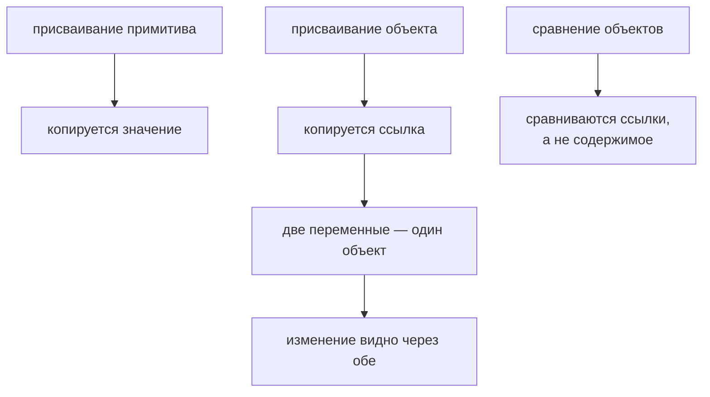

# Ссылки

## Связь с предыдущей главой

Предыдущая глава объяснила, зачем JavaScript нужен Object Type.

Primitive value представляет одно indivisible value:

Object value groups related information:

Теперь появляется следующий вопрос.

Если object содержит много related значения, как несколько variables могут работать with the same object?

Начнем с поведения, которое часто удивляет:

```javascript
const user = {
  name: 'Anna',
};

const admin = user;

admin.name = 'Kate';

console.log(user.name);
```

Результат:

```text
Kate
```

Вопрос:

> Почему изменился `user`, если мы меняли `admin`?

Эта глава отвечает на него через references.

Главный вопрос главы:

> На какой object эта переменная ссылается прямо сейчас?

---

## Предварительные требования

Для этой главы нужно понимать:

* что variable дает named access к value;
* что primitive значения are indivisible;
* что object value groups related information;
* что object contains properties;
* что property can be read and updated;
* что `const` prevents reassignment of identifier, but does not freeze object properties.

Не требуется знать Stack & Heap, Garbage Collector, memory addresses, engine optimizations, pointer implementation, Prototype Chain или object freezing. Эти темы будут изучаться позже.

Важно: в этой главе reference объясняется conceptually. Мы не описываем implementation details.

---

## Время изучения

Ориентировочное время:

```text
Чтение главы:            110-140 минут
Разбор схем:             40-55 минут
Запуск примеров:         20-30 минут
Практика:                90-120 минут
Повторение материала:    25 минут
```

Уровень сложности: **L3**.

Это одна из ключевых тем для Automation QA. Ошибки с shared test data, expected objects and helper functions often come from misunderstanding references.

---

## Навигация

Предыдущая глава:

```text
docs/01-javascript/12-object-type.md
```

Текущая глава:

```text
docs/01-javascript/13-references.md
```

Следующая глава:

```text
docs/01-javascript/14-stack-and-heap.md
```

Следующая глава объяснит commonly used conceptual memory model: Stack & Heap. В этой главе мы не используем эту модель, потому что сначала нужно понять observable поведение references.

---

## Цели обучения

После изучения этой главы вы будете понимать:

* почему references exist;
* что reference означает conceptually;
* чем reference отличается от object;
* почему multiple variables can refer to one object;
* что происходит при reading through a reference;
* что происходит при updating through a reference;
* что означает assigning one reference to another variable;
* почему primitive assignment behaves differently;
* чем identity отличается от copied primitive значения на концептуальном уровне;
* почему unexpected object changes часто возникают in Automation QA;
* как helper functions can modify shared objects;
* как безопаснее работать with expected test data.

---

## Мотивация

Начнем не с определения.

Посмотрите на код:

```javascript
const user = {
  name: 'Anna',
};

const admin = user;

admin.name = 'Kate';

console.log(user.name);
```

Если думать, что variable contains object, хочется ожидать:

Но результат другой:

```text
Kate
```

Диаграмма удивительного поведения:

```text
user  ──┐
        ├──→  [ { name: 'Anna' } ]
admin ──┘
```

Это невозможно объяснить моделью "каждая variable содержит собственный object".

Нужна другая модель:

```text
переменная хранит НЕ объект, а ссылку на него
```

`user` and `admin` are two ways to reach the same object.

Главный вопрос:

> На какой object эта переменная ссылается прямо сейчас?

---

## Теория

### Почему ссылки существуют

Объекты могут быть большими, составными и изменяемыми.

Если бы каждое присваивание объекта создавало полную независимую копию, программы стало бы труднее понимать, а работа с ними стала бы непрактичной:

Вместо этого JavaScript позволяет переменным ссылаться на объектные значения.

Концептуальная идея:

Ссылка существует, чтобы код мог работать с объектными значениями, не превращая каждое присваивание в копирование.

### Что такое ссылка на концептуальном уровне

Ссылка — это концептуальная связь между переменной и объектным значением.

Не запоминайте это как деталь реализации. В этой главе ссылка означает: переменная
не содержит объект, а указывает на него.

Схема «объект и ссылка»:

```text
user  ──→  ref#1  ──→  [ { name: 'Anna' } ]
```

Ссылка — это не сам объект.

Мысленная модель закладки: закладка указывает на страницу, но сама страницей не является.

Закладка — не страница. Ссылка — не объект.

### Ссылка и объект

Объект — это значение со свойствами.

Ссылка — это то, как переменная до него добирается.

```javascript
const user = {
  name: 'Anna',
};
```

Концептуально здесь два разных явления: сам объект со свойствами и имя, которое
на него указывает.

Объект отвечает на вопрос:

```text
What information is grouped together?
```

Ссылка отвечает на вопрос:

```text
Which object does this variable refer to?
```

### Присваивание примитива

Примитивные значения ведут себя иначе.

```javascript
let userName = 'Anna';
let adminName = userName;

adminName = 'Kate';

console.log(userName);
console.log(adminName);
```

Вывод:

```text
Anna
Kate
```

Схема присваивания примитива:

```text
a  ──→  [ 1 ]
b  ──→  [ 1 ]   собственная копия значения
```

На этом концептуальном уровне присваивание примитивного значения даёт другой переменной её собственное значение.

Сравнение примитивов:

Именно поэтому изменение `adminName` не влияет на `userName`.

### Присваивание объекта

Присваивание объекта ведёт себя иначе.

```javascript
const user = {
  name: 'Anna',
};

const admin = user;
```

Схема присваивания объекта:

```text
user   ──┐
         ├──→  [ один объект ]
admin  ──┘
```

Один объект, две переменные:

На какой объект сейчас ссылается `admin`?

```text
The same object as user.
```

### Несколько переменных, ссылающихся на один объект

На один объект могут ссылаться несколько переменных:

```javascript
const user = {
  name: 'Anna',
  role: 'user',
};

const admin = user;
const currentUser = user;
```

Схема общего объекта:

```text
user     ──┐
admin    ──┼──→  [ один объект ]
current  ──┘
```

Это не три пользователя.

Это:

```text
one object
three variables referring to it
```

Мысленная модель нескольких ярлыков на одну папку: ярлыков может быть много, но папка остаётся одна.

### Чтение через ссылку

Когда код читает:

```javascript
console.log(admin.name);
```

Движок концептуально делает так: читает значение имени `admin` (это ссылка),
переходит по ней к объекту и берёт из него свойство `name`.

Схема чтения через ссылку:

```text
admin.name  →  пройти по ссылке  →  прочитать свойство name
```

Вопрос:

> На какой объект сейчас ссылается `admin`?

Ответ:

```text
The object that contains name: "Anna".
```

### Изменение через ссылку

Когда код изменяет:

```javascript
admin.name = 'Kate';
```

Движок концептуально делает так: переходит по ссылке к объекту и записывает новое
значение в его свойство. Сама ссылка при этом не меняется.

Схема изменения через ссылку:

```text
admin.name = 'Kate'

user  ──┐
        ├──→  [ { name: 'Kate' } ]
admin ──┘
```

`user.name` тоже показывает `"Kate"`, потому что `user` ссылается на тот же объект.

### Присваивание одной ссылки другой переменной

Эта строка:

```javascript
const admin = user;
```

не создаёт нового объекта.

Оно делает так, что `admin` ссылается на тот же объект, что и `user`.

```text
user   ──┐
         ├──→  [ { name: 'Anna' } ]
admin  ──┘
```

Это центральная идея главы:

```text
Переменные не содержат объекты.
Переменные ссылаются на объектные значения.
Несколько переменных могут ссылаться на один и тот же объект.
```

### Смена ссылки

Если переменная объявлена через `let`, позже она может начать ссылаться на другой объект.

```javascript
let currentUser = {
  name: 'Anna',
};

const admin = currentUser;

currentUser = {
  name: 'Kate',
};

console.log(admin.name);
console.log(currentUser.name);
```

Вывод:

```text
Anna
Kate
```

Схема смены ссылки:

```text
было:   currentUser ──→ [ объект A ]
стало:  currentUser ──→ [ объект B ]

объект A не изменился, изменилась ссылка
```

Вопрос:

> На какой объект сейчас ссылается `currentUser`?

После повторного присваивания:

```text
Object B.
```

Вопрос:

> На какой объект сейчас ссылается `admin`?

Ответ:

```text
Object A.
```

### Тождественность и копии примитивов

Примитивные значения сравниваются как значения.

```javascript
const firstName = 'Anna';
const secondName = 'Anna';

console.log(firstName === secondName);
```

Концептуально:

С объектами иначе. Два объекта с одинаковыми свойствами остаются двумя разными объектами.

```javascript
const firstUser = {
  name: 'Anna',
};

const secondUser = {
  name: 'Anna',
};

console.log(firstUser === secondUser);
```

Концептуальное сравнение объектов:

```text
{ a: 1 } === { a: 1 }   →  false   разные объекты
user === admin          →  true    одна ссылка
```

Сравнение объектов здесь — вопрос тождественности:

```text
Do both variables refer to the same object?
```

а не:

```text
Do both objects have same-looking properties?
```

Подробные правила равенства будут изучаться в отдельной главе. Сейчас важно понять саму идею тождественности.

### Почему примитивы ведут себя иначе

Примитивные значения неделимы.

Объектные значения составные, и их можно изменять через свойства.

Поскольку с объектами работают через ссылки, изменение свойства через одну переменную видно через другую, которая ссылается на тот же объект.

Частое сравнение:

| | Примитив | Объект |
| --- | --- | --- |
| Что хранит имя | само значение | ссылку на значение |
| Присваивание другой переменной | копирует значение | копирует ссылку |
| Изменение через вторую переменную | первую не затрагивает | видно через первую |

Отсюда правило для тестов: если проверка сравнивает объект, полученный из
подготовки, и объект из ответа, нужно решить заранее — сравнивается
содержимое или идентичность.

---

Копируется не объект, а ссылка на него:


```mermaid
flowchart TD
    A["присваивание примитива"] --> B["копируется значение"]
    C["присваивание объекта"] --> D["копируется ссылка"]
    D --> E["две переменные — один объект"]
    E --> F["изменение видно через обе"]
    G["сравнение объектов"] --> H["сравниваются ссылки,<br/>а не содержимое"]
```

## Внутренний механизм

В этой главе внутренний механизм остаётся концептуальным.

Мы не говорим, где именно объекты находятся физически. Мы не используем стек и кучу. Мы не называем ссылку адресом. Это будет позже.

Сейчас механизм такой:

```text
1. литерал объекта создаёт один объект
2. имя хранит не объект, а ссылку на него
3. присваивание имени копирует ссылку, а не объект
4. обращение к свойству идёт по ссылке к тому же объекту
```

### Полный путь ссылки

```javascript
const user = {
  name: 'Anna',
};

const admin = user;

admin.name = 'Kate';

console.log(user.name);
```

Полная схема выполнения:

```text
1. создан объект              [ { name: 'Anna' } ]
2. user получил ссылку        user  ──→ объект
3. admin получил ту же ссылку admin ──→ объект
4. изменение через admin      видно через user
```

### Текущее место в модели JavaScript

Текущий блок:

```text
Primitive Types  —  значения, которые копируются целиком
Object Type      —  значения, состоящие из свойств
References       —  как имена связаны с такими значениями
```

### Схема типичных ошибок

Все типичные ошибки этой главы растут из одного места: имя считают
владельцем объекта, а не ссылкой на него.

| Ожидание | Что происходит на самом деле |
| --- | --- |
| присваивание объекта делает копию | копируется ссылка, объект остаётся один |
| изменение через второе имя не заденет первое | изменение видно через оба имени |
| два одинаковых по виду объекта равны | сравниваются ссылки, и результат `false` |
| функция не может изменить переданный объект | внутри функции та же ссылка, изменение остаётся после возврата |

### Переход к стеку и куче

Ссылки объясняют поведение:

```text
Several variables can refer to one object.
```

Но они пока не объясняют привычную картину памяти:

```text
Where are primitive values conceptually placed?
Where are object values conceptually placed?
Why do diagrams often show Stack and Heap?
```

Следующая глава отвечает на эти вопросы. Она введёт стек и кучу как концептуальную модель, а не как точную реализацию движка.

---

## Ментальная модель

### Карточка библиотечного каталога

Ссылка похожа на карточку библиотечного каталога.

Две карточки могут указывать на одну книгу. Правка в книге меняет то, к чему ведут обе.

### Закладка в книге

Закладка говорит, куда идти. Она не является страницей.

Ссылка переменной ведёт к объекту. Она не является самим объектом.

### Адрес, записанный на бумаге

Используйте это только как метафору навигации, а не как описание реализации.

Записка — не комната. Ссылка — не объект.

### Общий ключ от одной комнаты

Ключи от одной комнаты могут быть у нескольких человек.

Если один из них что-то напишет на доске в этой комнате, это увидят все, кто туда войдёт.

### Несколько ярлыков на одну папку

Эта модель полезна для тестовых данных:

```text
expectedUser and actualUser should not accidentally point to the same mutable object.
```

---

## Примеры кода

Все примеры находятся в:

```text
examples/01-javascript/chapter-13/
```

Запуск:

```bash
node examples/01-javascript/chapter-13/01-primitive-copy.js
node examples/01-javascript/chapter-13/02-object-reference.js
node examples/01-javascript/chapter-13/03-two-variables.js
node examples/01-javascript/chapter-13/04-update-through-reference.js
node examples/01-javascript/chapter-13/05-reference-reassignment.js
node examples/01-javascript/chapter-13/06-common-mistakes.js
```

### 01-primitive-copy.js

Показывает присваивание примитива:

```javascript
let userName = 'Anna';
let adminName = userName;

adminName = 'Kate';

console.log(userName);
console.log(adminName);
```

`userName` остаётся `'Anna'`.

### 02-object-reference.js

Показывает присваивание объекта:

```javascript
const user = {
  name: 'Anna',
};

const admin = user;

admin.name = 'Kate';

console.log(user.name);
```

`user` и `admin` ссылаются на один и тот же объект.

### 03-two-variables.js

Показывает один объект и две переменные:

```javascript
const user = {
  name: 'Anna',
  role: 'user',
};

const currentUser = user;
```

Обе переменные читают из одного объекта.

### 04-update-through-reference.js

Показывает изменение через ссылку:

```javascript
currentUser.role = 'admin';
```

Свойство относится к общему объекту.

### 05-reference-reassignment.js

Показывает смену ссылки через `let`:

```javascript
let currentUser = { name: 'Anna' };
const firstUser = currentUser;

currentUser = { name: 'Kate' };
```

Теперь `currentUser` ссылается на другой объект.

### 06-common-mistakes.js

Показывает типичную ошибку — изменение ожидаемого объекта:

```javascript
const expectedUser = {
  name: 'Anna',
};

const actualUser = expectedUser;
actualUser.name = 'Kate';
```

Обе переменные ссылаются на один объект.

---

## Частые вопросы

### Ссылка — это то же самое, что объект?

Нет.

### Ссылка — это указатель?

В этом курсе мы не разбираем здесь реализацию указателей. Ссылка вводится как понятие языка и мысленная модель. Детали реализации и устройство движка для этой главы не нужны.

### Защищает ли `const` объект от изменений?

Нет.

```javascript
const user = {
  name: 'Anna',
};

user.name = 'Kate';
```

`const` запрещает повторное присваивание `user`, а не изменение свойств объекта.

### Как избежать случайной мутации в тестах?

На простом уровне — создавать новый объект для ожидаемых данных вместо переиспользования общего изменяемого объекта.

```javascript
const defaultUser = {
  name: 'Anna',
  role: 'user',
};

const expectedAdmin = {
  ...defaultUser,
  role: 'admin',
};
```

Раскрытие объекта создаёт новый объект на первом уровне. Подробно раскрытие будет изучаться позже.

### Относится ли это и к массивам?

Да. Массивы — объектные значения, поэтому несколько переменных могут ссылаться на один массив. Массивы будут изучаться в отдельной главе.

---

## Распространённые мифы

### Миф: переменная содержит объект

Реальность:

Переменная ссылается на объектное значение.

### Миф: присваивание объекта создаёт независимую копию

Реальность:

Присваивание ссылки другой переменной делает так, что обе ссылаются на один и тот же объект.

```javascript
const admin = user;
```

концептуально означает:

```text
admin refers to same object as user
```

### Миф: если объекты выглядят одинаково, это один объект

Реальность:

Два разных объектных значения могут иметь одинаковые свойства и при этом быть разными объектами.

```text
Object A { name: "Anna" }
Object B { name: "Anna" }
```

Это не один и тот же объект.

### Миф: ссылки требуют сначала знать стек и кучу

Реальность:

Ссылки можно понять по наблюдаемому поведению. Стек и куча позже сделают схему памяти нагляднее.

---

## Распространённые ошибки

### Ошибка 1. Неожиданно изменить общий объект

```javascript
const expectedUser = {
  name: 'Anna',
};

const actualUser = expectedUser;

actualUser.name = 'Kate';

console.log(expectedUser.name);
```

Результат:

```text
Kate
```

Проблема:

```text
expectedUser and actualUser refer to the same object.
```

### Ошибка 2. Думать, что присваивание объекта копирует свойства

```javascript
const user = {
  name: 'Anna',
};

const admin = user;
```

Второго объекта при этом не появляется.

### Ошибка 3. Сравнивать тождественность объектов вместо структуры

```javascript
const expectedUser = {
  name: 'Anna',
};

const actualUser = {
  name: 'Anna',
};

console.log(expectedUser === actualUser);
```

Концептуально это два разных объекта.

Подробные правила равенства и приёмы проверок будут изучаться позже.

### Ошибка 4. Изменять объект, переданный во вспомогательную функцию

```javascript
function markAsAdmin(user) {
  user.role = 'admin';
}
```

Эта функция изменяет полученный объект. Функции будут изучаться позже, но поведение ссылок видно уже сейчас: если вызывающий код и функция работают с одним объектом, изменение общее.

### Ошибка 5. Прятать общие изменяемые тестовые данные

```javascript
const defaultUser = {
  name: 'Anna',
  role: 'user',
};

const testUser = defaultUser;
```

Если изменить `testUser`, изменится и `defaultUser`.

---

## Практическое использование

Ссылки важны везде, где объекты присваивают, передают или переиспользуют.

### Общая конфигурация

```javascript
const config = {
  retries: 2,
};

const localConfig = config;

localConfig.retries = 3;

console.log(config.retries);
```

`config.retries` равно `3`, потому что обе переменные ссылаются на один объект.

### Как подготовить новый объект на основе существующих данных

Иногда нужен новый объект вместо общей ссылки.

```javascript
const defaultUser = {
  name: 'Anna',
  role: 'user',
};

const adminUser = {
  ...defaultUser,
  role: 'admin',
};
```

Здесь используется раскрытие объекта, которое создаёт новый объект первого уровня. Подробное поведение раскрытия будет изучаться позже.

### Полный обзор ссылок

---

## Использование в Automation QA

### Общие тестовые данные

Общие тестовые данные удобны, но рискованны:

```javascript
const defaultUser = {
  email: 'anna@example.com',
  role: 'user',
};

const adminUser = defaultUser;

adminUser.role = 'admin';
```

Теперь `defaultUser.role` тоже равно `'admin'`.

В тестах из-за этого один тест может повлиять на другой.

### Случайное изменение ожидаемых объектов

```javascript
const expectedUser = {
  email: 'anna@example.com',
  role: 'user',
};

const actualUser = expectedUser;
actualUser.role = 'admin';
```

Это уничтожает смысл `expectedUser`.

Лучше:

```javascript
const expectedUser = {
  email: 'anna@example.com',
  role: 'user',
};

const actualUser = {
  email: 'anna@example.com',
  role: 'admin',
};
```

Теперь это отдельные объекты.

### Как безопасно копировать тестовые данные

Для простых объектов первого уровня:

```javascript
const defaultUser = {
  email: 'anna@example.com',
  role: 'user',
};

const adminUser = {
  ...defaultUser,
  role: 'admin',
};
```

Это снижает риск случайного изменения общего объекта. Приём копирует только первый уровень; копирование вложенных объектов будет изучаться позже.

### Вспомогательные функции, изменяющие объекты

```javascript
function addRole(user) {
  user.role = 'admin';
}

const testUser = {
  email: 'anna@example.com',
  role: 'user',
};

addRole(testUser);

console.log(testUser.role);
```

Вывод:

```text
admin
```

Функция изменила объект, на который ссылается `testUser`.

Функции будут изучаться позже. Здесь важно именно поведение ссылок.

### Разбор неожиданных изменений объекта

Когда объект меняется неожиданно, спросите:

```text
Which variables refer to this object?
Which helper received this object?
Which line updated a property?
Was object copied or only reference assigned?
```

Этот мысленный список помогает разбирать фикстуры Playwright, сборщики тел запросов, общие настройки и ожидаемые объекты API.

---

## Итоги

Ссылки объясняют, почему присваивание объекта ведёт себя иначе, чем присваивание примитива.

Присваивание примитива:

```text
let a = "Anna"
let b = a
b = "Kate"

a remains "Anna"
```

Присваивание объекта:

```text
const user = { name: "Anna" }
const admin = user
admin.name = "Kate"

user.name becomes "Kate"
```

Основная модель:

```text
Variables do not contain objects.
Variables refer to object values.
Multiple variables can refer to the same object.
```

Ссылка — не объект. Это концептуальная связь, которая позволяет переменной до объекта добраться.

Следующая глава объяснит стек и кучу как привычную концептуальную модель памяти за этим поведением.

---

## Что нужно запомнить

* Присваивание объекта не создаёт независимой копии.
* Переменные ссылаются на объектные значения.
* На один объект могут ссылаться несколько переменных.
* Изменение свойства через одну переменную меняет общий объект.
* Другие переменные, ссылающиеся на этот объект, видят изменение.
* Присваивание примитива на этом концептуальном уровне ведёт себя иначе.
* Тождественность объектов отвечает на вопрос, ссылаются ли переменные на один объект.
* Одинаково выглядящие объекты всё равно могут быть разными.
* Общие тестовые данные можно изменить случайно.
* Вспомогательные функции могут менять полученные объекты.
* Стек и куча изучаются дальше; ссылки сначала стоит понять через поведение.

---

## Проверьте себя

Ответьте без запуска кода.

1. Почему `admin.name = 'Kate'` может изменить `user.name`?
2. Ссылка и объект — одно и то же?
3. Что означает `const admin = user` для объектных значений?
4. Что происходит при присваивании примитива?
5. Что означает тождественность объекта?
6. Почему два одинаково выглядящих объекта могут быть не равны?
7. Что такое смена ссылки?
8. Почему общий ожидаемый объект опасен в тестах?
9. Какой вопрос помогает разобраться со ссылками?
10. Почему стек и куча не нужны для первого понимания ссылок?

### Ответы

1. Потому что `admin` и `user` ведут к одному и тому же объекту. Присваивание объекта копирует ссылку, а не содержимое.
2. Нет. Объект — это сами данные, ссылка — способ до них добраться. Ссылок на один объект может быть несколько.
3. Что `admin` получает ту же ссылку, что и `user`. Новый объект не создаётся, копирования свойств не происходит.
4. Копируется само значение. Две переменные становятся независимыми: изменение одной не касается другой.
5. Тождественность объекта — вопрос «это тот же самый объект или другой». Он не зависит от того, совпадают ли свойства.
6. Потому что сравниваются ссылки, а не содержимое. Два отдельно созданных объекта с одинаковыми свойствами — разные объекты, и `===` даёт `false`.
7. Присваивание имени другой ссылки. Само имя начинает вести к другому объекту, а прежний объект не меняется — просто на него стало на одну ссылку меньше.
8. Тест, изменивший общий объект ожидаемых данных, меняет его и для остальных. Падение возникает в другом тесте, и его причина не видна в том месте, где он упал.
9. «Это тот же объект или другой?» Ответ на него объясняет и неожиданное изменение, и неожиданное `false` при сравнении.
10. Ссылки объясняются поведением: одно изменение видно через два имени. Для этого достаточно модели «имя ведёт к объекту». Схема памяти отвечает на другой вопрос — где что лежит — и на первом шаге только отвлекает.

---

## Практика

Практика находится в файле:

```text
practice/01-javascript/13-references.md
```

Сначала решайте задания самостоятельно. Для этой темы особенно важно рисовать схемы от руки: какая переменная на какой объект ссылается прямо сейчас.

---

## Решения

Решения находятся в файле:

```text
solutions/01-javascript/13-references.md
```

Читайте решения после самостоятельной попытки. Проверяйте не только вывод, но и рассуждение: какой объект общий, какой новый, где изменилось свойство, а где сменилась ссылка.
