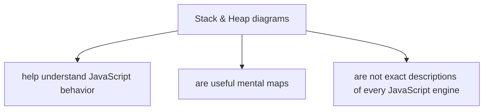
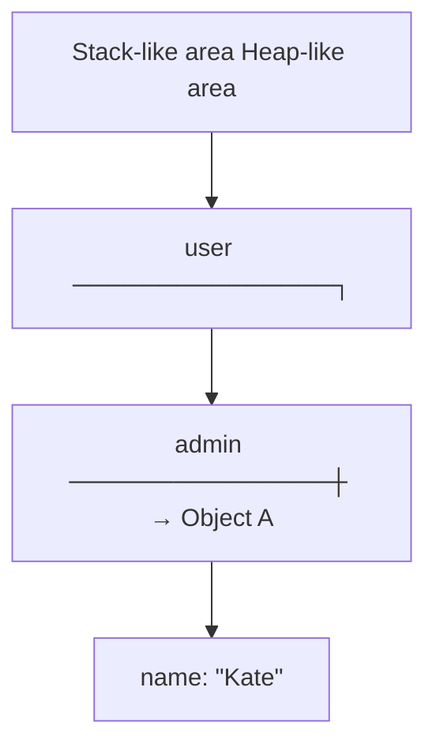
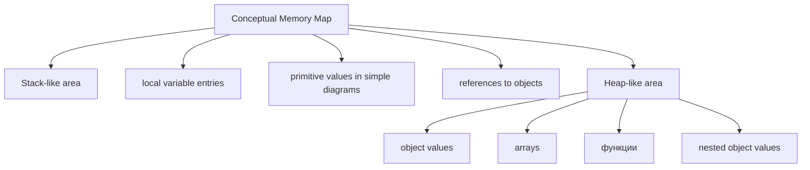
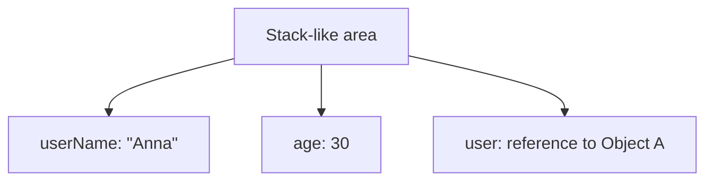
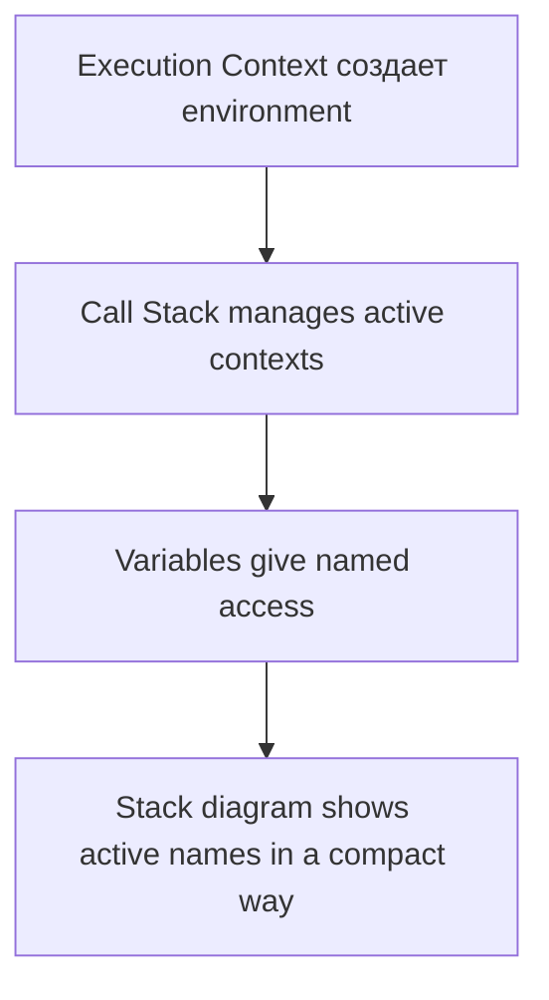
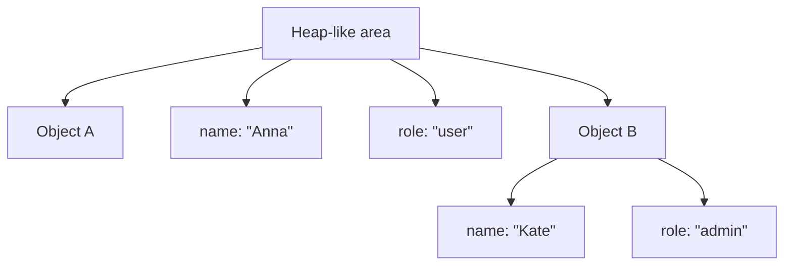

# Stack & Heap

## Связь с предыдущей главой

Предыдущая глава объяснила references через observable поведение:

```javascript
const user = {
  name: 'Anna',
};

const admin = user;

admin.name = 'Kate';

console.log(user.name);
```

Результат:

```text
Kate
```

Мы уже понимаем основную идею:

```text
Variables do not contain objects.
Variables refer to object values.
Multiple variables can refer to the same object.
```

Теперь появляется следующий вопрос:

> Почему почти все книги, статьи и схемы рисуют Stack and Heap?

Ответ: Stack & Heap diagrams are conceptual tools. Они помогают визуализировать поведение with primitive значения, object значения and references.

Важно:



Главный вопрос этой главы:

> Что помогает понять эта схема?

---

## Предварительные требования

Для этой главы нужно понимать:

* что primitive значения are indivisible;
* что Object значения group related information;
* что variables give named access;
* что references connect variables with object значения conceptually;
* что multiple variables can refer to the same object;
* что property update through one reference is visible through another reference.

Не требуется знать Garbage Collector internals, memory allocation algorithms, engine optimizations, V8 implementation details, SpiderMonkey implementation or JavaScript specification internals. Эти темы не разбираются в этой главе.

---

## Время изучения

Ориентировочное время:

```text
Чтение главы:            110-140 минут
Разбор схем:             45-60 минут
Запуск примеров:         20-30 минут
Практика:                90-120 минут
Повторение материала:    25 минут
```

Уровень сложности: **L3**.

Тема опасна не сложностью синтаксиса, а неправильной уверенностью. Диаграмма помогает, но если воспринимать ее как буквальное устройство каждого engine, она начинает мешать.

---

## Навигация

Предыдущая глава:

```text
docs/01-javascript/13-references.md
```

Текущая глава:

```text
docs/01-javascript/14-stack-and-heap.md
```

Следующая глава:

```text
docs/01-javascript/15-type-conversion.md
```

Следующая глава сменит фокус с memory model на value transformations: как JavaScript converts значения between types.

---

## Цели обучения

После изучения этой главы вы будете понимать:

* зачем programmers use Stack & Heap diagrams;
* что Stack means in this conceptual model;
* что Heap means in this conceptual model;
* как primitive значения обычно показывают на таких диаграммах;
* как object значения обычно показывают на таких диаграммах;
* как references связывают Stack side and Heap side conceptually;
* как function calls relate to Stack на высоком уровне;
* как visual diagrams explain object sharing;
* как visual diagrams explain reassignment;
* какие misconceptions возникают вокруг Stack & Heap;
* почему эта модель полезна in Automation QA debugging;
* почему real JavaScript engines are more sophisticated than the diagram.

---

## Мотивация

Мы уже знаем поведение:

```javascript
const user = {
  name: 'Anna',
};

const admin = user;

admin.name = 'Kate';

console.log(user.name);
```

Но когда программа становится больше, одной фразы "оба variables refer to same object" недостаточно. Нужно видеть картину.

Без диаграммы:

```text
user and admin refer to the same object,
then admin mutates property,
then user sees updated property.
```

С диаграммой:



Что эта диаграмма помогает понять?

```text
There is one object.
There are two variable entries.
Both entries lead to the same object.
Property update changes the shared object.
```

Это и есть причина, почему Stack & Heap diagrams are popular: they make reference поведение visible.

---

## Теория

### Почему programmers use Stack & Heap diagrams

Stack & Heap diagrams answer practical questions:

```text
Where do I draw variable names?
Where do I draw object values?
How do I show references?
Why did object change through another variable?
Why did reassignment not change old object?
```

Концептуальный обзор:



Важно:

```text
This is a conceptual map.
It explains behavior.
It is not a promise of exact engine layout.
```

### Stack as a conceptual model

Stack in this chapter is a conceptual area where we draw active execution data: variable entries, primitive значения and references.

Stack concept:



Что помогает понять эта схема?

```text
Which names are active right now.
Which primitive values are easy to show directly.
Which variables point to objects elsewhere in the diagram.
```

This continues earlier chapters:



Function call details are still high-level in this chapter. Execution Context and Call Stack internals were introduced earlier; here we only connect them to the conceptual memory picture.

### Heap as a conceptual model

Heap in this chapter is a conceptual area where we draw object значения.

Heap concept:



Что помогает понять эта схема?

```text
Objects can be shared.
Objects can be mutated through references.
Objects can outlive one specific variable entry while still reachable.
```

Do not read this as:

```text
Every engine physically stores every object exactly here.
```

Read it as:

```text
The conceptual model represents object values separately from variable entries.
```

### Primitive значения in the conceptual model

Primitive value схема:

```javascript
let userName = 'Anna';
let adminName = userName;

adminName = 'Kate';
```

Концептуальная схема:

Что помогает понять эта схема?

```text
Changing adminName does not change userName.
Primitive assignment is shown as independent values in this model.
```

Присваивание примитива:

### Object значения in the conceptual model

Object value схема:

```javascript
const user = {
  name: 'Anna',
  role: 'user',
};
```

Концептуальная схема:

Что помогает понять эта схема?

```text
Variable entry is drawn separately.
Object value is drawn as grouped information.
Reference connects them.
```

### Variable → Reference → Object

The core схема:

Expanded:

Что помогает понять эта схема?

```text
The variable is not the object.
The reference is not the object.
The object is the grouped value reached through reference.
```

### Object assignment

```javascript
const user = {
  name: 'Anna',
};

const admin = user;
```

Object assignment схема:

Что помогает понять эта схема?

```text
There is one object.
There are two variable entries.
Both references lead to the same object.
```

### Shared object

Shared object схема:

Что помогает понять эта схема?

```text
Mutating through any of these variables affects Object A.
All other variables that refer to Object A observe the change.
```

### Mutation

```javascript
adminUser.role = 'admin';
```

Mutation схема:

Что помогает понять эта схема?

```text
The reference did not change.
The object property changed.
```

### Reassignment

```javascript
let currentUser = {
  name: 'Anna',
};

const firstUser = currentUser;

currentUser = {
  name: 'Kate',
};
```

Reassignment схема:

Что помогает понять эта схема?

```text
Reassignment changes what currentUser refers to.
It does not mutate Object A.
It does not move firstUser.
```

### Function calls and Stack at a high level

Function calls create active work. Earlier chapters explained Execution Context and Call Stack. Here we draw a simplified memory map.

```javascript
function updateRole(user) {
  user.role = 'admin';
}

const testUser = {
  role: 'user',
};

updateRole(testUser);
```

Function call high-level схема:

After mutation:

Что помогает понять эта схема?

```text
Function parameter can refer to same object as outer variable.
Mutation inside function changes shared object.
```

Function internals, parameters and return поведение will be studied in detail later. This is only high-level connection.

### Nested object

Nested object conceptual схема:

```javascript
const user = {
  profile: {
    name: 'Anna',
  },
};
```

Схема:

Что помогает понять эта схема?

```text
Nested object is also an object value in the conceptual map.
Several levels can be connected.
Changing nested property may affect shared nested object.
```

Detailed copying of nested objects will be studied later with spread, structured data and immutability patterns.

### Identity

Object identity схема:

```javascript
const firstUser = { name: 'Anna' };
const secondUser = { name: 'Anna' };
const sameUser = firstUser;
```

Схема:

Что помогает понять эта схема?

```text
firstUser and sameUser refer to same object.
firstUser and secondUser refer to different objects.
Same-looking properties do not mean same identity.
```

### Complete execution picture

For the common example:

```javascript
const user = {
  name: 'Anna',
};

const admin = user;

admin.name = 'Kate';

console.log(user.name);
```

Полная картина выполнения:

---

## Внутренний механизм

Эта глава не описывает точные внутренние детали JavaScript engine.

Real engines are sophisticated:

The model in this chapter is intentionally conceptual:

### Текущее место в модели JavaScript

Что помогает понять эта схема?

```text
We are not learning a new syntax feature.
We are learning a map for previously observed behavior.
```

### Myth vs reality

Myth vs reality схема:

### Переход к Type Conversion

Stack & Heap explains how we visualize значения and object references.

Next, the course shifts to another kind of поведение:

Переход к Equality and Type Conversion:

---

## Ментальная модель

### Desk and archive

Stack-like area is like a desk. Heap-like area is like an archive.

Что помогает понять эта модель?

```text
Active variables are easy to see on the desk.
Larger grouped information lives in folders.
Notes point from desk to folders.
```

### Sticky notes pointing to folders

Multiple sticky notes can point to one folder:

### Workspace and storage

The workspace shows what is active. Storage shows grouped objects.

### Index cards

Reference is like an index card:

### Концептуальная карта

Best mental model:

The map helps navigate. It is not the full physical world.

---

## Примеры кода

Все примеры находятся в:

```text
examples/01-javascript/chapter-14/
```

Запуск:

```bash
node examples/01-javascript/chapter-14/01-primitive-memory.js
node examples/01-javascript/chapter-14/02-object-memory.js
node examples/01-javascript/chapter-14/03-reference-sharing.js
node examples/01-javascript/chapter-14/04-reassignment.js
node examples/01-javascript/chapter-14/05-function-call.js
node examples/01-javascript/chapter-14/06-common-mistakes.js
```

### 01-primitive-memory.js

Показывает conceptual primitive assignment.

### 02-object-memory.js

Показывает object value as grouped information reached through variable.

### 03-reference-sharing.js

Показывает shared object through two variables.

### 04-reassignment.js

Показывает difference between mutation and reassignment.

### 05-function-call.js

Показывает high-level function call and object mutation through parameter.

### 06-common-mistakes.js

Показывает accidental shared request body mutation.

---

## Частые вопросы

### Is Stack & Heap the real engine implementation?

No. It is a conceptual model used to understand поведение. Real engines are more sophisticated.

### Are primitives always physically on Stack?

Эта глава не делает физических утверждений. На схемах primitive значения часто рисуются в Stack-like области, потому что это помогает объяснить поведение присваивания.

### Are objects always physically on Heap?

Эта глава не учит физические правила хранения. Она говорит: object значения рисуются в Heap-like области в концептуальной модели.

### Зачем использовать модель, если она не точная?

Because it explains observable поведение well enough for reasoning, debugging and learning references.

### Does this chapter teach Garbage Collector?

No. Garbage Collector internals will be studied later. Here we only discuss diagrams for значения, references and objects.

---

## Распространенные мифы

### Миф: The diagram is the engine

Реальность:

The diagram is a conceptual map.

### Миф: Objects are literally always in the exact same place shown by the drawing

Реальность:

The conceptual model represents objects separately from variable entries. Real engine layout can differ.

### Миф: Stack & Heap explains all JavaScript поведение

Реальность:

It explains a subset: references, sharing, mutation, reassignment and identity. It does not explain all language semantics.

### Миф: If I know Stack & Heap, I know Garbage Collector

Реальность:

Garbage Collector is a separate topic with its own mechanisms.

---

## Типичные ошибки

### Ошибка 1. Treat conceptual diagram as physical truth

Правильный взгляд:

```text
Use diagram to reason.
Do not overclaim implementation.
```

### Ошибка 2. Draw two objects after direct assignment

Неправильно:

Для:

```javascript
const admin = user;
```

Лучше:

### Ошибка 3. Confuse reassignment with mutation

Mutation:

```text
same reference
same object
changed property
```

Переназначение:

```text
same variable name
new reference
different object
```

### Ошибка 4. Ignore shared nested objects

Nested object can also be shared in conceptual diagrams.

### Ошибка 5. Debug flaky tests without drawing shared состояние

If shared request body changes unexpectedly, draw:

```text
which variables point to which object
which helper changed which property
```

---

## Практическое использование

Stack & Heap diagrams are useful when:

* object is changed unexpectedly;
* helper mutates вход;
* test data is reused;
* expected and actual objects look suspiciously connected;
* reassignment does not affect old variable;
* same-looking objects compare unexpectedly.

Практический чек-лист:

```text
1. Draw variable names.
2. Draw object values separately.
3. Connect variables to objects.
4. Mark shared references.
5. Mark mutation lines.
6. Mark reassignment lines.
7. Ask what each variable refers to after each step.
```

---

## Использование в Automation QA

### Shared request bodies

```javascript
const defaultPayload = {
  role: 'user',
};

const adminPayload = defaultPayload;
adminPayload.role = 'admin';
```

Схема:

This explains why default request body changed unexpectedly.

### Fixture mutation

A fixture may return object. If test mutates it, another part of setup may observe changed состояние if same object is reused.

### Object reuse

Переиспользование object не плохо само по себе. Риск появляется, когда изменяется mutable shared object.

### Payload preparation

Safer first-level preparation:

```javascript
const adminPayload = {
  ...defaultPayload,
  role: 'admin',
};
```

Spread details will be studied later. Here it means: create a new first-level object вместо assigning same reference.

### Отладка shared состояние

When Playwright test is flaky, ask:

```text
Was the same object reused?
Did a helper mutate it?
Did fixture return shared object?
Did one test change data used by another test?
```

Схемы памяти помогают, потому что flaky-поведение часто возникает из скрытого общего состояния.

---

## Итоги

Stack & Heap diagrams are conceptual tools.

They help visualize:

```text
Primitive values
Object values
References
Shared objects
Mutation
Reassignment
Function calls at a high level
Identity
```

They do not precisely describe every JavaScript engine.

Core mental model:

Use this model as a map:

Next chapter moves from memory visualization to value transformation: Type Conversion.

---

## Что нужно запомнить

* Stack & Heap diagrams are conceptual tools.
* They explain observable JavaScript поведение.
* They are not exact descriptions of every JavaScript engine.
* Stack-like area shows active names and references in diagrams.
* Heap-like area shows object значения in diagrams.
* Primitive значения are often drawn directly in stack-like area.
* Object variables are drawn as references to object значения.
* Direct object assignment shares reference.
* Mutation changes shared object.
* Reassignment changes what variable refers to.
* Function parameters can refer to the same object as вызывающий код variables.
* Рисуйте схемы при отладке общего состояния в тестах.

---

## Проверьте себя

Ответьте без запуска кода.

1. Зачем программисты используют схемы Stack и Heap?
2. Что означает Stack в этой концептуальной главе?
3. Что означает Heap в этой концептуальной главе?
4. Почему нельзя считать схему точной реализацией engine?
5. Как нарисовать primitive assignment?
6. Как нарисовать object assignment?
7. Что меняется при mutation?
8. Что меняется при reassignment?
9. Почему helper function может изменить объект вызывающего кода?
10. Как схемы памяти помогают отлаживать flaky tests?

---

## Практика

Практика находится в файле:

```text
practice/01-javascript/14-stack-and-heap.md
```

Рисуйте схемы вручную. Для этой главы это не дополнительное упражнение, а основной способ проверить понимание.

---

## Решения

Решения находятся в файле:

```text
solutions/01-javascript/14-stack-and-heap.md
```

Читайте решения после самостоятельной попытки и сравнивайте не только вывод, но и diagram reasoning.
