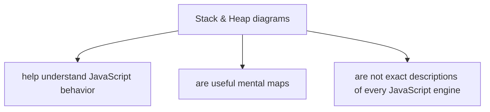
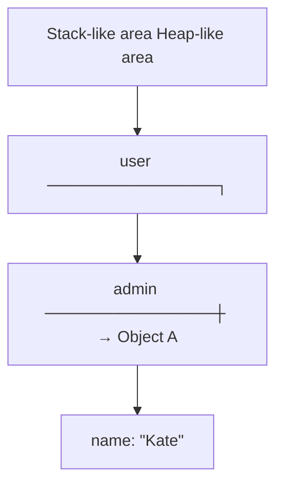
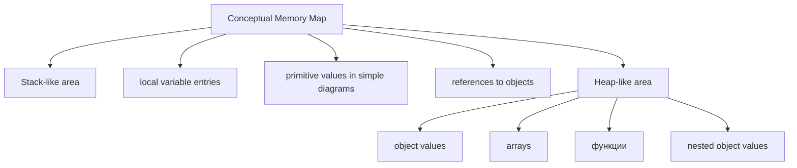
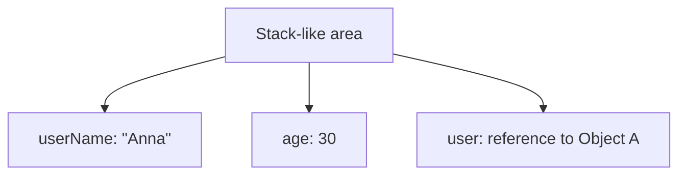
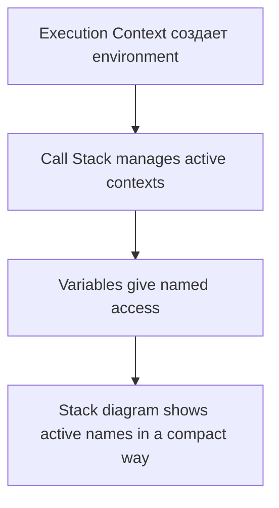
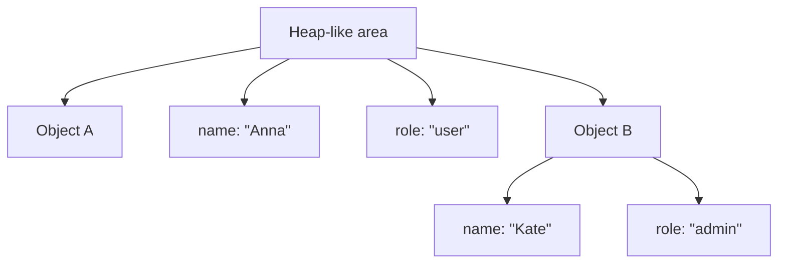

# Стек и куча

## Связь с предыдущей главой

Предыдущая глава объяснила references через observable поведение:

```javascript
const user = {
  name: 'Anna',
};

const admin = user;

admin.name = 'Kate';

console.log(user.name);
```

Результат:

```text
Kate
```

Мы уже понимаем основную идею:

```text
Variables do not contain objects.
Variables refer to object values.
Multiple variables can refer to the same object.
```

Теперь появляется следующий вопрос:

> Почему почти все книги, статьи и схемы рисуют Stack and Heap?

Ответ: Stack & Heap diagrams are conceptual tools. Они помогают визуализировать поведение with primitive значения, object значения and references.

Важно:


```mermaid
flowchart TD
    N1["Stack &amp; Heap diagrams"]
    N2["help understand JavaScript behavior"]
    N3["are useful mental maps"]
    N4["are not exact descriptions of every JavaScript engine"]
    N1 --> N2
    N1 --> N3
    N1 --> N4
```

Главный вопрос этой главы:

> Что помогает понять эта схема?

---

## Предварительные требования

Для этой главы нужно понимать:

* что primitive значения are indivisible;
* что Object значения group related information;
* что variables give named access;
* что references connect variables with object значения conceptually;
* что multiple variables can refer to the same object;
* что property update through one reference is visible through another reference.

Не требуется знать Garbage Collector internals, memory allocation algorithms, engine optimizations, V8 implementation details, SpiderMonkey implementation or JavaScript specification internals. Эти темы не разбираются в этой главе.

---

## Время изучения

Ориентировочное время:

```text
Чтение главы:            110-140 минут
Разбор схем:             45-60 минут
Запуск примеров:         20-30 минут
Практика:                90-120 минут
Повторение материала:    25 минут
```

Уровень сложности: **L3**.

Тема опасна не сложностью синтаксиса, а неправильной уверенностью. Диаграмма помогает, но если воспринимать ее как буквальное устройство каждого engine, она начинает мешать.

---

## Навигация

Предыдущая глава:

```text
docs/01-javascript/13-references.md
```

Текущая глава:

```text
docs/01-javascript/14-stack-and-heap.md
```

Следующая глава:

```text
docs/01-javascript/15-type-conversion.md
```

Следующая глава сменит фокус с memory model на value transformations: как JavaScript converts значения between types.

---

## Цели обучения

После изучения этой главы вы будете понимать:

* зачем programmers use Stack & Heap diagrams;
* что Stack means in this conceptual model;
* что Heap means in this conceptual model;
* как primitive значения обычно показывают на таких диаграммах;
* как object значения обычно показывают на таких диаграммах;
* как references связывают Stack side and Heap side conceptually;
* как function calls relate to Stack на высоком уровне;
* как visual diagrams explain object sharing;
* как visual diagrams explain reassignment;
* какие misconceptions возникают вокруг Stack & Heap;
* почему эта модель полезна in Automation QA debugging;
* почему real JavaScript engines are more sophisticated than the diagram.

---

## Мотивация

Мы уже знаем поведение:

```javascript
const user = {
  name: 'Anna',
};

const admin = user;

admin.name = 'Kate';

console.log(user.name);
```

Но когда программа становится больше, одной фразы "оба variables refer to same object" недостаточно. Нужно видеть картину.

Без диаграммы:

```text
user and admin refer to the same object,
then admin mutates property,
then user sees updated property.
```

С диаграммой:


```mermaid
flowchart TD
    N1["Stack-like area Heap-like area"]
    N2["user ───────────────┐"]
    N3["admin ───────────────┼ → Object A"]
    N4["name: &quot;Kate&quot;"]
    N1 --> N2
    N2 --> N3
    N3 --> N4
```

Что эта диаграмма помогает понять?

```text
There is one object.
There are two variable entries.
Both entries lead to the same object.
Property update changes the shared object.
```

Это и есть причина, почему Stack & Heap diagrams are popular: they make reference поведение visible.

---

## Теория

### Зачем программисты рисуют схемы стека и кучи

Такие схемы отвечают на практические вопросы:

```text
Where do I draw variable names?
Where do I draw object values?
How do I show references?
Why did object change through another variable?
Why did reassignment not change old object?
```

Концептуальный обзор:


```mermaid
flowchart TD
    N1["Conceptual Memory Map"]
    N2["Stack-like area"]
    N3["local variable entries"]
    N4["primitive values in simple diagrams"]
    N5["references to objects"]
    N6["Heap-like area"]
    N7["object values"]
    N8["arrays"]
    N9["функции"]
    N10["nested object values"]
    N1 --> N2
    N1 --> N3
    N1 --> N4
    N1 --> N5
    N1 --> N6
    N6 --> N7
    N6 --> N8
    N6 --> N9
    N6 --> N10
```

Важно:

```text
This is a conceptual map.
It explains behavior.
It is not a promise of exact engine layout.
```

### Стек как концептуальная модель

Стек в этой главе — концептуальная область, где мы рисуем данные активного выполнения: записи о переменных, примитивные значения и ссылки.

Понятие стека:


```mermaid
flowchart TD
    N1["Stack-like area"]
    N2["userName: &quot;Anna&quot;"]
    N3["age: 30"]
    N4["user: reference to Object A"]
    N1 --> N2
    N1 --> N3
    N1 --> N4
```

Что помогает понять эта схема?

```text
Which names are active right now.
Which primitive values are easy to show directly.
Which variables point to objects elsewhere in the diagram.
```

Это продолжает предыдущие главы:


```mermaid
flowchart TD
    N1["Execution Context создает environment"]
    N2["Call Stack manages active contexts"]
    N3["Variables give named access"]
    N4["Stack diagram shows active names in a compact way"]
    N1 --> N2
    N2 --> N3
    N3 --> N4
```

Детали вызова функции в этой главе остаются на высоком уровне. Контекст выполнения и устройство стека вызовов вводились раньше; здесь мы лишь связываем их с концептуальной картиной памяти.

### Куча как концептуальная модель

Куча в этой главе — концептуальная область, где мы рисуем объектные значения.

Понятие кучи:


```mermaid
flowchart TD
    N1["Heap-like area"]
    N2["Object A"]
    N3["name: &quot;Anna&quot;"]
    N4["role: &quot;user&quot;"]
    N5["Object B"]
    N6["name: &quot;Kate&quot;"]
    N7["role: &quot;admin&quot;"]
    N1 --> N2
    N1 --> N3
    N1 --> N4
    N1 --> N5
    N5 --> N6
    N5 --> N7
```

Что помогает понять эта схема?

```text
Objects can be shared.
Objects can be mutated through references.
Objects can outlive one specific variable entry while still reachable.
```

Не читайте это как:

```text
Every engine physically stores every object exactly here.
```

Читайте это как:

```text
The conceptual model represents object values separately from variable entries.
```

### Примитивные значения в концептуальной модели

Схема примитивного значения:

```javascript
let userName = 'Anna';
let adminName = userName;

adminName = 'Kate';
```

Концептуальная схема:

```text
Stack — короткие записи выполнения и простые значения
Heap  — объекты и структуры
```

Что помогает понять эта схема?

```text
Changing adminName does not change userName.
Primitive assignment is shown as independent values in this model.
```

Присваивание примитива:

```text
Stack
  userName   [ 'Anna' ]
  adminName  [ 'Anna' ]   ← отдельная запись с такой же копией значения
```

Две независимые записи: изменение одной не касается другой.

### Объектные значения в концептуальной модели

Схема объектного значения:

```javascript
const user = {
  name: 'Anna',
  role: 'user',
};
```

Концептуальная схема:

```text
stack:  status  ──→  [ 'active' ]     значение прямо здесь
heap:   user    ──→  ref  ──→  [ { ... } ]
```

Что помогает понять эта схема?

```text
Variable entry is drawn separately.
Object value is drawn as grouped information.
Reference connects them.
```

### Переменная → ссылка → объект

Главная схема:

```text
переменная  →  ссылка  →  объект в heap
```

После раскрытия:

Что помогает понять эта схема?

```text
The variable is not the object.
The reference is not the object.
The object is the grouped value reached through reference.
```

### Присваивание объекта

```javascript
const user = {
  name: 'Anna',
};

const admin = user;
```

Схема присваивания объекта:

```text
stack                      heap
user  ──→ ref#1  ───────→  [ { name: 'Anna' } ]
```

Что помогает понять эта схема?

```text
There is one object.
There are two variable entries.
Both references lead to the same object.
```

### Общий объект

Схема общего объекта:

```text
stack                      heap
user  ──→ ref#1  ──┐
admin ──→ ref#1  ──┴────→  [ { name: 'Anna' } ]
```

Что помогает понять эта схема?

```text
Mutating through any of these variables affects Object A.
All other variables that refer to Object A observe the change.
```

### Изменение объекта

```javascript
adminUser.role = 'admin';
```

Схема изменения:

```text
изменение свойства меняет объект в heap,
ссылки в stack остаются прежними
```

Что помогает понять эта схема?

```text
The reference did not change.
The object property changed.
```

### Повторное присваивание

```javascript
let currentUser = {
  name: 'Anna',
};

const firstUser = currentUser;

currentUser = {
  name: 'Kate',
};
```

Схема смены ссылки:

```text
было:  currentUser ──→ ref#1 ──→ [ объект A ]
стало: currentUser ──→ ref#2 ──→ [ объект B ]
```

Что помогает понять эта схема?

```text
Reassignment changes what currentUser refers to.
It does not mutate Object A.
It does not move firstUser.
```

### Вызовы функций и стек на высоком уровне

Вызовы функций создают активную работу. Предыдущие главы объяснили контекст выполнения и стек вызовов. Здесь мы рисуем упрощённую карту памяти.

```javascript
function updateRole(user) {
  user.role = 'admin';
}

const testUser = {
  role: 'user',
};

updateRole(testUser);
```

Схема вызова функции на высоком уровне:

```text
вызов функции  →  новая запись в stack
                  локальные имена живут в ней
возврат        →  запись снимается
```

После изменения:

Что помогает понять эта схема?

```text
Function parameter can refer to same object as outer variable.
Mutation inside function changes shared object.
```

Внутреннее устройство функций, параметры и возврат будут подробно изучаться позже. Здесь только связь на высоком уровне.

### Вложенный объект

Концептуальная схема вложенного объекта:

```javascript
const user = {
  profile: {
    name: 'Anna',
  },
};
```

Схема:

```text
примитив  →  значение хранится в записи выполнения
объект    →  в записи хранится ссылка, объект лежит в heap
```

Что помогает понять эта схема?

```text
Nested object is also an object value in the conceptual map.
Several levels can be connected.
Changing nested property may affect shared nested object.
```

Подробное копирование вложенных объектов будет изучаться позже, вместе с раскрытием, структурами данных и неизменяемостью.

### Идентичность

Схема тождественности объектов:

```javascript
const firstUser = { name: 'Anna' };
const secondUser = { name: 'Anna' };
const sameUser = firstUser;
```

Схема:

```text
запись выполнения исчезает после возврата,
объект в heap живёт, пока на него есть ссылки
```

Что помогает понять эта схема?

```text
firstUser and sameUser refer to same object.
firstUser and secondUser refer to different objects.
Same-looking properties do not mean same identity.
```

### Полная картина выполнения

Для типичного примера:

```javascript
const user = {
  name: 'Anna',
};

const admin = user;

admin.name = 'Kate';

console.log(user.name);
```

Полная картина выполнения:

```text
Stack                    Heap
  user   ──────┐
               ├───────→ { name: 'Anna' }   создан один объект
  admin  ──────┘         { name: 'Kate' }   свойство изменено через admin

console.log(user.name)  →  'Kate'
```

В стеке две записи, в куче — один объект: поэтому изменение через одно имя
видно через другое.

---

## Внутренний механизм

Эта глава не описывает точное внутреннее устройство движка JavaScript.

Настоящие движки устроены сложнее:

```text
настоящие движки оптимизируют размещение значений,
могут хранить объект не в куче, переиспользовать строки
и перемещать данные во время сборки мусора
```

Модель в этой главе намеренно концептуальна:

```text
схема нужна, чтобы объяснить наблюдаемое поведение —
почему примитивы независимы, а объекты общие, —
а не чтобы описать реальное устройство памяти движка
```

### Текущее место в модели JavaScript

Что помогает понять эта схема?

```text
We are not learning a new syntax feature.
We are learning a map for previously observed behavior.
```

### Миф и реальность

Схема «миф и реальность»:

```text
миф:      «примитивы всегда в stack, объекты всегда в heap»
реальность: это учебная модель; конкретное размещение решает движок
```

### Переход к преобразованию типов

Стек и куча объясняют, как мы представляем значения и ссылки на объекты.

---

## Ментальная модель

### Стол и архив

Область стека похожа на рабочий стол. Область кучи — на архив.

Что помогает понять эта модель?

```text
Active variables are easy to see on the desk.
Larger grouped information lives in folders.
Notes point from desk to folders.
```

### Записки, указывающие на папки

Несколько записок могут указывать на одну папку:

```text
записка user   ──→ папка «данные пользователя»
записка admin  ──→ та же папка
```

Выбросить одну записку — не то же самое, что выбросить папку.

### Рабочее место и хранилище

Рабочее место показывает, что активно сейчас. Хранилище — сгруппированные объекты.

### Карточки картотеки

Ссылка похожа на картотечную карточку:

```text
на карточке написано не содержимое, а то, где содержимое лежит
```

Скопировать карточку — значит получить второй способ дойти до того же места.

### Концептуальная карта

Лучшая мысленная модель:

Карта помогает ориентироваться. Она не является самим миром.

---

## Примеры кода

Все примеры находятся в:

```text
examples/01-javascript/chapter-14/
```

Запуск:

```bash
node examples/01-javascript/chapter-14/01-primitive-memory.js
node examples/01-javascript/chapter-14/02-object-memory.js
node examples/01-javascript/chapter-14/03-reference-sharing.js
node examples/01-javascript/chapter-14/04-reassignment.js
node examples/01-javascript/chapter-14/05-function-call.js
node examples/01-javascript/chapter-14/06-common-mistakes.js
```

### 01-primitive-memory.js

Показывает концептуальное присваивание примитива.

### 02-object-memory.js

Показывает объектное значение как сгруппированную информацию, доступную через переменную.

### 03-reference-sharing.js

Показывает общий объект, доступный через две переменные.

### 04-reassignment.js

Показывает разницу между изменением объекта и сменой ссылки.

### 05-function-call.js

Показывает вызов функции на высоком уровне и изменение объекта через параметр.

### 06-common-mistakes.js

Показывает случайное изменение общего тела запроса.

---

## Частые вопросы

### Стек и куча — это настоящая реализация движка?

Нет. Это концептуальная модель для понимания поведения. Настоящие движки устроены сложнее.

### Примитивы всегда физически лежат в стеке?

Эта глава не делает физических утверждений. На схемах примитивные значения часто рисуют в области стека, потому что это помогает объяснить поведение присваивания.

### Объекты всегда физически лежат в куче?

Эта глава не учит физическим правилам хранения. Она говорит: объектные значения рисуют в области кучи в концептуальной модели.

### Зачем использовать модель, если она не точная?

Потому что она достаточно хорошо объясняет наблюдаемое поведение для рассуждения, разбора ошибок и изучения ссылок.

### Эта глава объясняет сборщик мусора?

Нет. Устройство сборщика мусора будет изучаться позже. Здесь мы говорим только о схемах для значений, ссылок и объектов.

---

## Распространённые мифы

### Миф: схема — это и есть движок

Реальность:

Схема — концептуальная карта.

### Миф: объекты всегда лежат ровно там, где нарисованы

Реальность:

Концептуальная модель показывает объекты отдельно от записей о переменных. Настоящее размещение в движке может отличаться.

### Миф: стек и куча объясняют всё поведение JavaScript

Реальность:

Они объясняют часть: ссылки, общие объекты, изменение, смену ссылки и тождественность. Всю семантику языка они не описывают.

### Миф: если я знаю стек и кучу, я знаю сборщик мусора

Реальность:

Сборка мусора — отдельная тема со своими механизмами.

---

## Распространённые ошибки

### Ошибка 1. Считать концептуальную схему физической правдой

Правильный взгляд:

```text
Use diagram to reason.
Do not overclaim implementation.
```

### Ошибка 2. Рисовать два объекта после прямого присваивания

Неправильно:

```text
Stack          Heap
  user   ────→ { name: 'Anna' }
  admin  ────→ { name: 'Anna' }   ← второго объекта здесь нет
```

Для:

```javascript
const admin = user;
```

Лучше:

```text
Stack          Heap
  user   ──┐
           ├─→ { name: 'Anna' }
  admin  ──┘
```

### Ошибка 3. Путать смену ссылки с изменением объекта

Изменение объекта:

```text
same reference
same object
changed property
```

Переназначение:

```text
same variable name
new reference
different object
```

### Ошибка 4. Не замечать общие вложенные объекты

Вложенный объект в концептуальных схемах тоже может быть общим.

### Ошибка 5. Разбирать нестабильные тесты, не рисуя общее состояние

Если общее тело запроса меняется неожиданно, нарисуйте:

```text
which variables point to which object
which helper changed which property
```

---

## Практическое использование

Схемы стека и кучи полезны, когда:

* объект изменился неожиданно;
* вспомогательная функция изменяет то, что ей передали;
* тестовые данные переиспользуются;
* ожидаемый и фактический объекты выглядят подозрительно связанными;
* смена ссылки не влияет на прежнюю переменную;
* одинаково выглядящие объекты сравниваются неожиданным образом.

Практический чек-лист:

```text
1. Draw variable names.
2. Draw object values separately.
3. Connect variables to objects.
4. Mark shared references.
5. Mark mutation lines.
6. Mark reassignment lines.
7. Ask what each variable refers to after each step.
```

---

## Использование в Automation QA

### Общие тела запросов

```javascript
const defaultPayload = {
  role: 'user',
};

const adminPayload = defaultPayload;
adminPayload.role = 'admin';
```

Схема:

```text
stack   →  что выполняется и какие имена активны
heap    →  сами объекты
ссылка  →  мост между ними
```

Это объясняет, почему тело запроса по умолчанию изменилось неожиданно.

### Изменение данных фикстуры

Фикстура может вернуть объект. Если тест его изменит, другая часть подготовки увидит изменённое состояние — при условии, что используется тот же объект.

### Переиспользование объекта

Переиспользовать объект не плохо само по себе. Риск появляется, когда изменяется общий изменяемый объект.

### Подготовка тела запроса

Более безопасная подготовка первого уровня:

```javascript
const adminPayload = {
  ...defaultPayload,
  role: 'admin',
};
```

Детали раскрытия будут изучаться позже. Здесь оно означает: создать новый объект первого уровня вместо присваивания той же ссылки.

### Разбор общего состояния

Когда тест Playwright нестабилен, спросите:

```text
Was the same object reused?
Did a helper mutate it?
Did fixture return shared object?
Did one test change data used by another test?
```

Схемы памяти помогают, потому что нестабильность часто возникает из скрытого общего состояния.

---

## Итоги

Схемы стека и кучи — концептуальные инструменты.

Они помогают представить:

```text
Primitive values
Object values
References
Shared objects
Mutation
Reassignment
Function calls at a high level
Identity
```

Они не описывают точно устройство каждого движка.

Основная мысленная модель: примитивные значения удобно представлять лежащими
рядом с именем, а объектные — отдельно, с именем-указателем на них.

```text
стек (кадры вызовов)          куча (объекты)
 ├─ statusCode: 200
 └─ user: ссылка ──────────→  { name: 'Anna' }
```

Используйте эту модель как карту:

Следующая глава переходит от изображения памяти к преобразованию значений — к приведению типов.

---

## Что нужно запомнить

* Схемы стека и кучи — концептуальные инструменты.
* Они объясняют наблюдаемое поведение JavaScript.
* Они не являются точным описанием каждого движка.
* Область стека на схемах показывает активные имена и ссылки.
* Область кучи на схемах показывает объектные значения.
* Примитивные значения часто рисуют прямо в области стека.
* Переменные с объектами рисуют как ссылки на объектные значения.
* Прямое присваивание объекта делает ссылку общей.
* Изменение меняет общий объект.
* Смена ссылки меняет то, на что указывает переменная.
* Параметры функции могут ссылаться на тот же объект, что и переменные вызывающего кода.
* Рисуйте схемы при отладке общего состояния в тестах.

---

## Проверьте себя

Ответьте без запуска кода.

1. Зачем программисты используют схемы стека и кучи?
2. Что означает стек в этой концептуальной главе?
3. Что означает куча в этой концептуальной главе?
4. Почему нельзя считать схему точной реализацией движка?
5. Как нарисовать присваивание примитива?
6. Как нарисовать присваивание объекта?
7. Что меняется при изменении объекта?
8. Что меняется при смене ссылки?
9. Почему вспомогательная функция может изменить объект вызывающего кода?
10. Как схемы памяти помогают разбирать нестабильные тесты?

### Ответы

1. Чтобы объяснить наблюдаемую разницу между примитивами и объектами: почему одни независимы, а другие общие. Схема — инструмент рассуждения, а не описание устройства движка.
2. Место коротких записей выполнения: имена текущих вызовов и простые значения.
3. Место, где живут объекты и структуры, на которые эти записи ссылаются.
4. Реальные движки оптимизируют размещение значений, переиспользуют строки и перемещают данные при сборке мусора. Схема нужна для объяснения поведения, а не для описания реализации.
5. Две независимые записи в стеке, в каждой своя копия значения.
6. Две записи в стеке и одна стрелка от каждой к одному объекту в куче.
7. Меняется содержимое объекта в куче. Стрелки остаются прежними, поэтому изменение видно через все имена.
8. Меняется стрелка: имя начинает указывать на другой объект. Прежний объект не изменился, и другие имена по-прежнему ведут к нему.
9. Потому что внутрь функции передаётся ссылка, а не копия объекта. Функция работает с тем же объектом, и изменение остаётся после возврата.
10. Нестабильный тест часто возникает из общего изменяемого состояния: один прогон изменил объект, на который смотрит другой. Схема показывает, где стрелки ведут в одно место, и подсказывает, что копировать.

---

## Практика

Практика находится в файле:

```text
practice/01-javascript/14-stack-and-heap.md
```

Рисуйте схемы вручную. Для этой главы это не дополнительное упражнение, а основной способ проверить понимание.

---

## Решения

Решения находятся в файле:

```text
solutions/01-javascript/14-stack-and-heap.md
```

Читайте решения после самостоятельной попытки и сравнивайте не только вывод, но и рассуждение по схеме.
