# Type Conversion

## Связь с предыдущей главой

Предыдущие главы построили основу блока **Values and Types**:

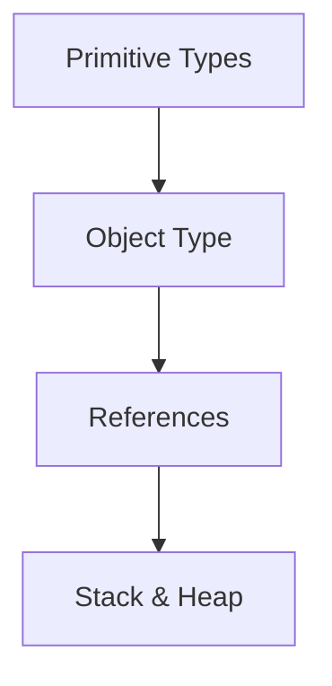

Мы уже понимаем:

* JavaScript работает с значения;
* значения имеют types;
* primitive and object значения behave differently;
* references explain object sharing;
* Stack & Heap diagrams are conceptual tools for visualizing значения and references.

Теперь вопрос меняется.

До этого мы спрашивали:

```text
What kind of value is this?
Where is this value shown in the conceptual diagram?
What object does this variable refer to?
```

В этой главе главный вопрос другой:

> Какой тип ожидает эта операция?

Начнем с наблюдаемого поведения:

```javascript
console.log('5' + 1);
console.log('5' - 1);
```

Результат:

```text
51
4
```

Одна и та же string value `'5'` в одном выражении стала частью string result, а в другом участвовала как number.

Вопрос:

> Почему JavaScript treat the same string differently?

Ответ этой главы: потому что операции ожидают определённые типы, и JavaScript может преобразовать значения под эти ожидания.

---

## Предварительные требования

Для этой главы нужно понимать:

* что value - информация, с которой работает программа;
* какие primitive types есть в JavaScript;
* чем String отличается from Number;
* что Boolean имеет значения `true` and `false`;
* что `null`, `undefined` and `NaN` are important значения;
* что object значения are different, but object-to-primitive details are not part of this chapter;
* что `console.log` помогает observe result.

Не требуется знать `==`, `===`, `Object.is()`, abstract equality algorithm, operator specification details, object-to-primitive algorithm or Symbol conversion internals. Equality has its own chapter.

---

## Время изучения

Ориентировочное время:

```text
Чтение главы:            120-150 минут
Разбор схем:             45-60 минут
Запуск примеров:         25-35 минут
Практика:                100-130 минут
Повторение материала:    30 минут
```

Уровень сложности: **L3**.

Type conversion кажется хаотичной только тогда, когда ее учат как набор странных результатов. В этой главе conversion объясняется как ответ на требование операции.

---

## Навигация

Предыдущая глава:

```text
docs/01-javascript/14-stack-and-heap.md
```

Текущая глава:

```text
docs/01-javascript/15-type-conversion.md
```

Следующая глава:

```text
docs/01-javascript/16-equality.md
```

Следующая глава ответит на вопрос:

> Что происходит, когда JavaScript сравнивает два значения?

В этой главе equality algorithms не изучаются.

---

## Цели обучения

После изучения этой главы вы будете понимать:

* why type conversion exists;
* чем implicit conversion differs from explicit conversion;
* когда использовать `Number()`;
* когда использовать `String()`;
* когда использовать `Boolean()`;
* common conversion rules;
* что такое truthy and falsy значения;
* почему `NaN` appears during number conversion;
* что такое conversion chain на высоком уровне;
* почему conversion is not random;
* почему hidden conversion bugs appear in Automation QA;
* как работать with API strings, form значения and environment variables.

---

## Мотивация

Начнем с кода:

```javascript
console.log('5' + 1);
console.log('5' - 1);
```

Результат:

```text
51
4
```

Если смотреть только на значения, поведение кажется странным:

```text
"5" is String
1 is Number
```

Почему в первом случае result is `"51"`, а во втором `4`?

Секрет не в том, что JavaScript "случайно" выбирает поведение. Секрет в operation expectation.

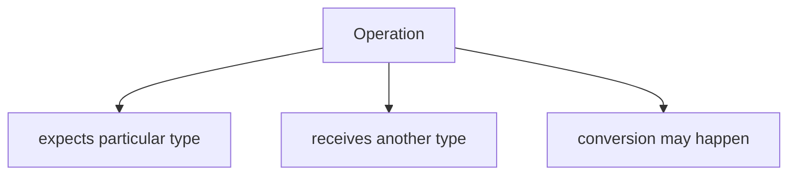

Conversion overview:

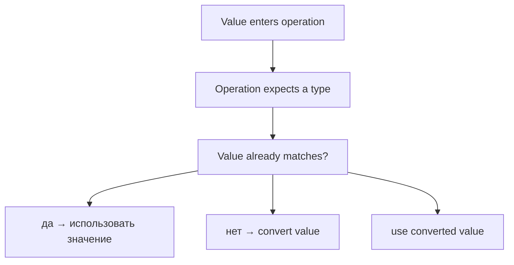

Главный вопрос:

> Какой тип ожидает эта операция?

---

## Теория

### Почему type conversion exists

JavaScript receives значения from many sources:

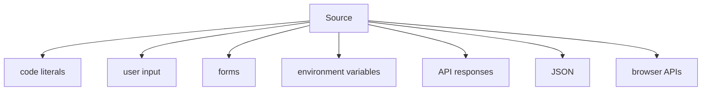

These значения do not always have the type your operation expects.

Example from Automation QA:

```javascript
const retriesFromEnv = '3';
const nextRetry = retriesFromEnv + 1;

console.log(nextRetry);
```

Результат:

```text
31
```

If you expected numeric addition, this is a bug. The operation did not receive the type you intended.

Conversion существует, потому что JavaScript часто пытается адаптировать значения под операции.

Ментальная модель: translator.

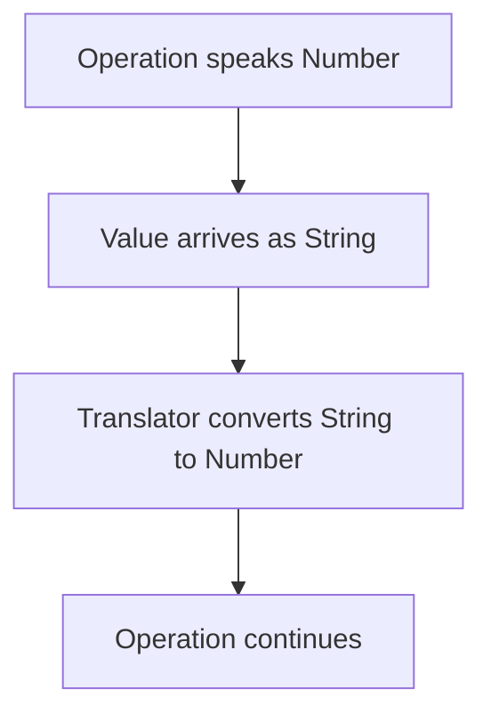

### Implicit conversion

Implicit conversion происходит, когда JavaScript преобразует value автоматически.

```javascript
console.log('5' - 1);
```

The `-` operation expects numeric поведение.

Implicit conversion схема:

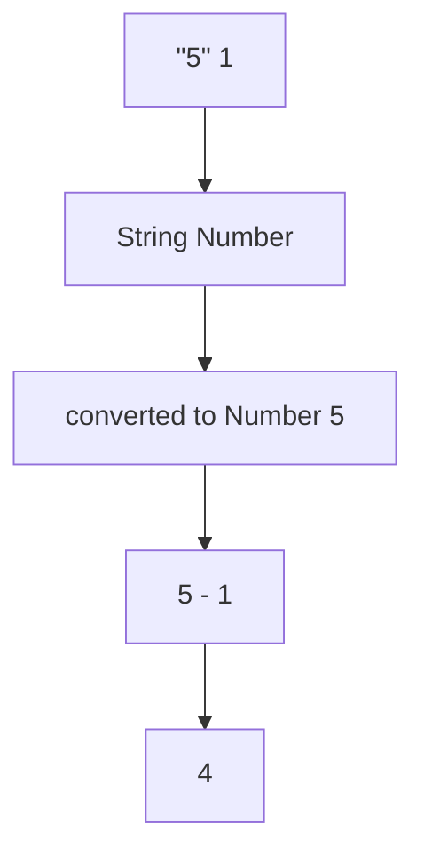

Какой тип ожидает эта операция?

```text
The subtraction operation expects Number-like values.
```

Implicit conversion не всегда плоха. Она опасна, когда незаметна и неожиданна.

### Explicit conversion

Explicit conversion происходит, когда программист явно просит выполнить conversion.

```javascript
const retriesFromEnv = '3';
const retries = Number(retriesFromEnv);

console.log(retries + 1);
```

Explicit conversion схема:

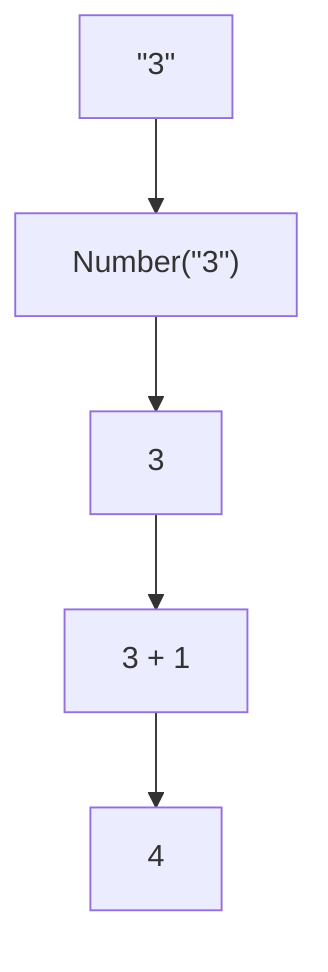

Какой тип ожидает эта операция?

```text
Numeric addition expects Number values.
```

Explicit conversion обычно лучше в тестах, потому что документирует намерение.

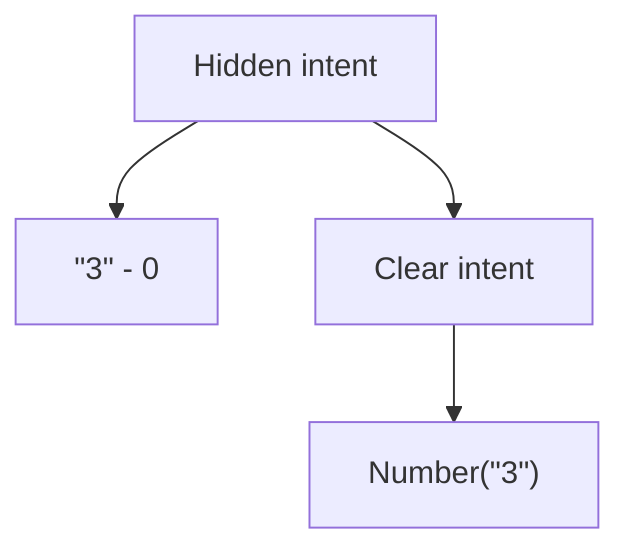

### Number conversion

`Number()` converts value to Number.

```javascript
console.log(Number('5'));
console.log(Number('5.5'));
console.log(Number(''));
console.log(Number(true));
console.log(Number(false));
console.log(Number(null));
console.log(Number(undefined));
```

Number conversion схема:

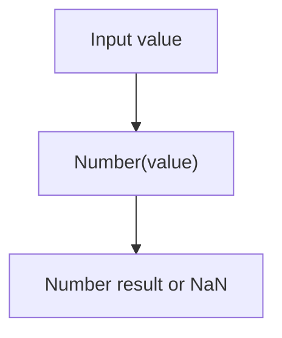

Частые результаты:

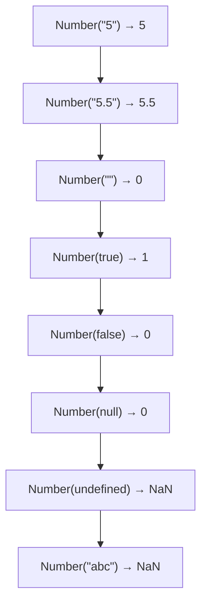

Operation expects Number:

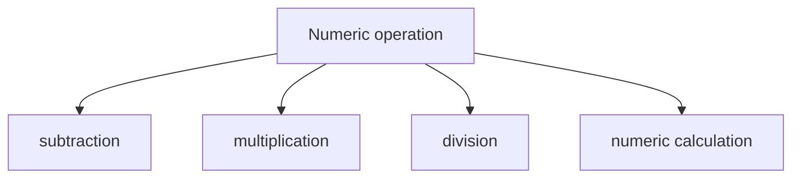

Схема:

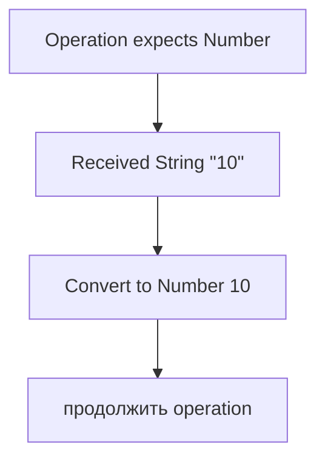

### NaN during conversion

`NaN` означает Not-a-Number. Он появляется, когда JavaScript пытается создать Number, но не может получить осмысленное числовое значение.

```javascript
console.log(Number('abc'));
console.log(Number(undefined));
```

NaN схема:

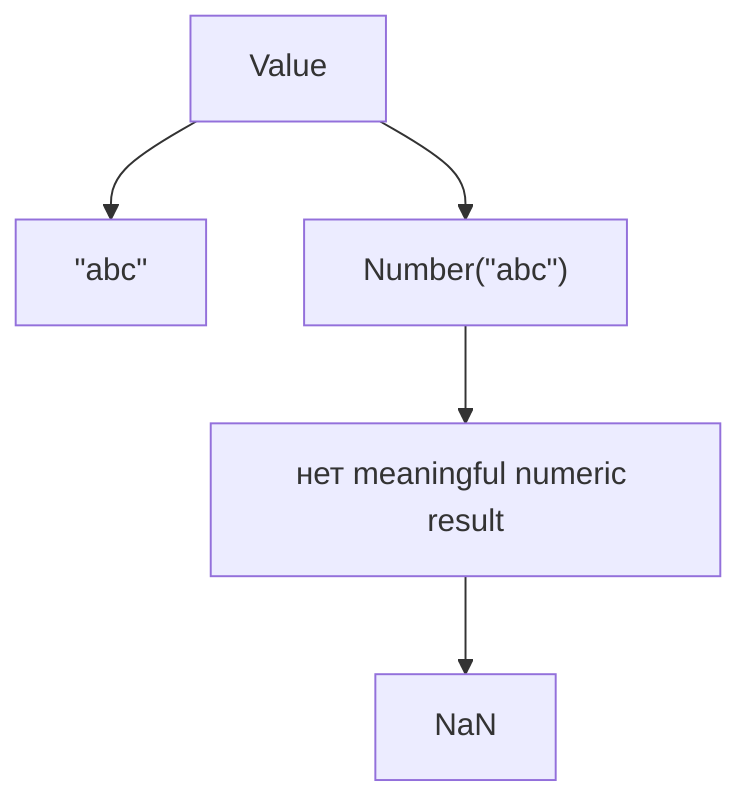

Какой тип ожидает эта операция?

```text
Number conversion expects value that can become a Number.
```

In Automation QA, `NaN` often means test parsed wrong поле:

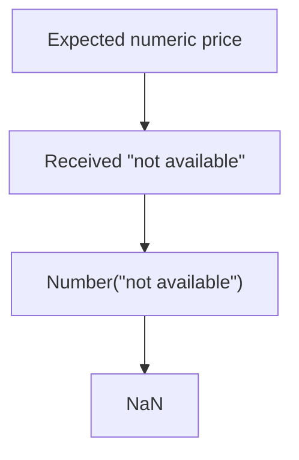

### String conversion

`String()` converts value to String.

```javascript
console.log(String(5));
console.log(String(true));
console.log(String(false));
console.log(String(null));
console.log(String(undefined));
```

String conversion схема:

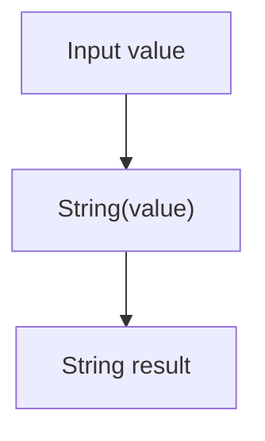

Частые результаты:

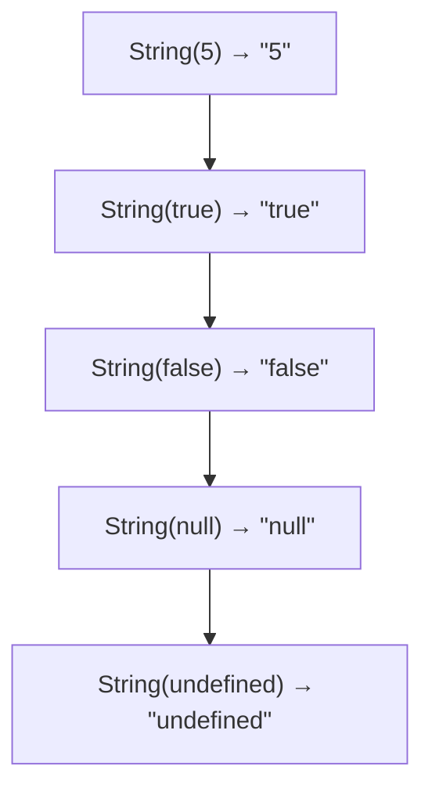

Operation expects String:

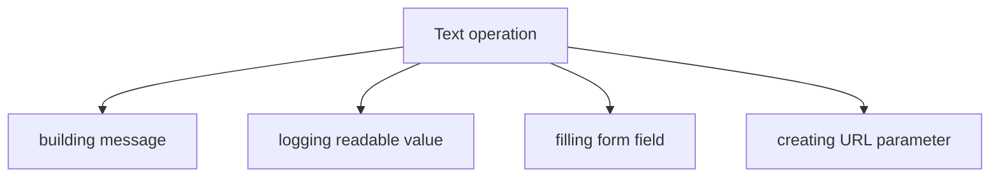

Схема:

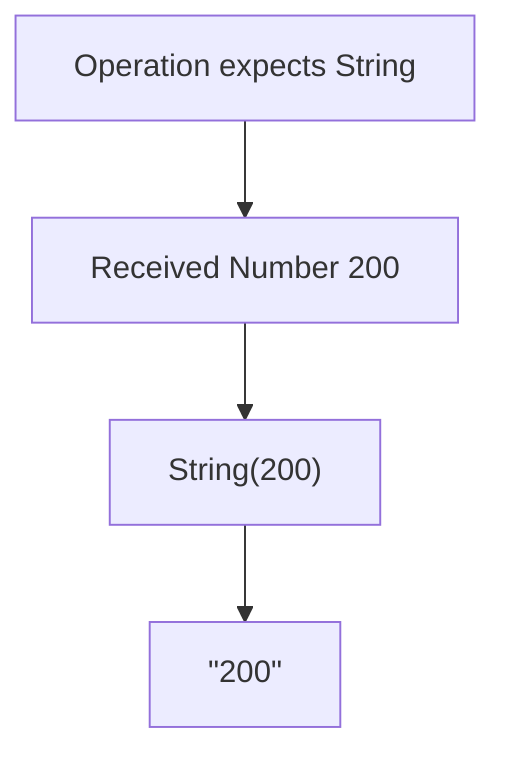

### Boolean conversion

`Boolean()` converts value to Boolean.

```javascript
console.log(Boolean('text'));
console.log(Boolean(''));
console.log(Boolean(1));
console.log(Boolean(0));
console.log(Boolean(null));
```

Boolean conversion схема:

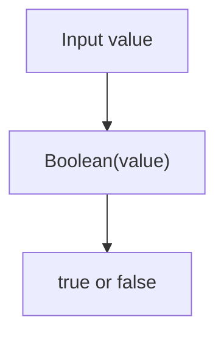

Boolean conversion используется, когда операция ожидает значение, похожее на условие.

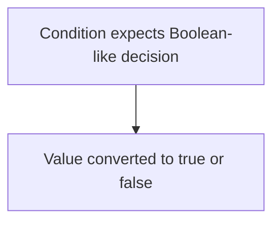

Detailed conditionals will be studied later. Here we only need conversion model.

### Truthy значения

Truthy value is a value that becomes `true` in Boolean conversion.

Truthy значения схема:

```mermaid
flowchart TD
    N1["Truthy examples"]
    N2["&quot;hello&quot;"]
    N3["&quot;0&quot;"]
    N4["&quot;false&quot;"]
    N5["1"]
    N6["-1"]
    N7["[]"]
    N8["{}"]
    N1 --> N2
    N1 --> N3
    N1 --> N4
    N1 --> N5
    N1 --> N6
    N1 --> N7
    N1 --> N8
```

Важно:

```javascript
console.log(Boolean('false'));
console.log(Boolean('0'));
```

Результат:

```text
true
true
```

Why?

```mermaid
flowchart TD
    N1["Non-empty string"]
    N2["Boolean conversion"]
    N3["true"]
    N1 --> N2
    N2 --> N3
```

This matters for environment variables:

```javascript
const headlessFromEnv = 'false';

console.log(Boolean(headlessFromEnv));
```

Результат:

```text
true
```

The string `'false'` is not Boolean `false`.

### Falsy значения

Falsy value is a value that becomes `false` in Boolean conversion.

Falsy значения схема:

```mermaid
flowchart TD
    N1["Falsy values"]
    N2["false"]
    N3["0"]
    N4["-0"]
    N5["0n"]
    N6["&quot;&quot;"]
    N7["null"]
    N8["undefined"]
    N9["NaN"]
    N1 --> N2
    N1 --> N3
    N1 --> N4
    N1 --> N5
    N1 --> N6
    N1 --> N7
    N1 --> N8
    N1 --> N9
```

Примеры:

```javascript
console.log(Boolean(false));
console.log(Boolean(0));
console.log(Boolean(''));
console.log(Boolean(null));
console.log(Boolean(undefined));
console.log(Boolean(NaN));
```

Falsy does not mean "bad". It means:

```text
Boolean(value) produces false.
```

### Conversion chains at a high level

Sometimes conversion happens in steps.

```javascript
console.log('Total: ' + 5);
```

Концептуальная цепочка:

```mermaid
flowchart TD
    N1["String operation"]
    N2["Number 5 converted to String &quot;5&quot;"]
    N3["&quot;Total: &quot; + &quot;5&quot;"]
    N4["&quot;Total: 5&quot;"]
    N1 --> N2
    N2 --> N3
    N3 --> N4
```

Another chain:

```javascript
console.log(Number(String(5)));
```

Схема:

```mermaid
flowchart TD
    N1["5"]
    N2["String(5)"]
    N3["&quot;5&quot;"]
    N4["Number(&quot;5&quot;)"]
    N5["5"]
    N1 --> N2
    N2 --> N3
    N3 --> N4
    N4 --> N5
```

Эта глава оставляет цепочки преобразований высокоуровневыми. Детали спецификации операторов здесь не нужны.

### Conversion table

Common conversion table:

```text
Value        Number(value)   String(value)     Boolean(value)
-----------  --------------  ----------------  --------------
"5"          5               "5"               true
"abc"        NaN             "abc"             true
""           0               ""                false
0            0               "0"               false
1            1               "1"               true
true         1               "true"            true
false        0               "false"           false
null         0               "null"            false
undefined    NaN             "undefined"       false
NaN          NaN             "NaN"             false
```

Do not memorize the table mechanically. Use the question:

> Какой тип ожидает эта операция?

---

## Внутренний механизм

At a conceptual level, conversion follows a decision flow.

Conversion decision поток:

```mermaid
flowchart TD
    N1["Operation begins"]
    N2["Operation expects type"]
    N3["Value has expected type?"]
    N4["да"]
    N5["использовать значение directly"]
    N6["нет"]
    N7["convert value according to rules"]
    N8["use converted value"]
    N1 --> N2
    N2 --> N3
    N3 --> N4
    N3 --> N5
    N3 --> N6
    N6 --> N7
    N3 --> N8
```

### Implicit mechanism

Implicit conversion is triggered by operation.

```mermaid
flowchart TD
    N1["&quot;5&quot; - 1"]
    N2["Subtraction expects Number"]
    N3["&quot;5&quot; converted to 5"]
    N4["5 - 1"]
    N5["4"]
    N1 --> N2
    N2 --> N3
    N3 --> N4
    N4 --> N5
```

### Explicit mechanism

Explicit conversion is triggered by programmer.

```mermaid
flowchart TD
    N1["Number(&quot;5&quot;)"]
    N2["Programmer asks for Number conversion"]
    N3["Conversion rules are applied"]
    N4["5"]
    N1 --> N2
    N2 --> N3
    N3 --> N4
```

### Текущее место в модели JavaScript

```mermaid
flowchart TD
    N1["JavaScript model so far"]
    N2["Values have types"]
    N3["Objects can be referenced"]
    N4["Stack &amp; Heap diagrams visualize references"]
    N5["Type Conversion adapts values for operations"]
    N1 --> N2
    N1 --> N3
    N1 --> N4
    N1 --> N5
```

Current position схема:

```mermaid
flowchart TD
    N1["Primitive Types"]
    N2["Object Type"]
    N3["References"]
    N4["Stack &amp; Heap"]
    N5["Type Conversion"]
    N1 --> N2
    N2 --> N3
    N3 --> N4
    N4 --> N5
```

### Complete conversion picture

```mermaid
flowchart TD
    N1["Input value"]
    N2["has current type"]
    N3["Operation"]
    N4["expects Number / String / Boolean"]
    N5["Conversion needed?"]
    N6["нет → использовать значение"]
    N7["да"]
    N8["implicit conversion"]
    N9["explicit conversion"]
    N10["converted value"]
    N11["operation result"]
    N1 --> N2
    N1 --> N3
    N3 --> N4
    N3 --> N5
    N5 --> N6
    N5 --> N7
    N7 --> N8
    N7 --> N9
    N5 --> N10
    N5 --> N11
```

---

## Ментальная модель

### Переводчик

Conversion is like translator:

```text
Operation language: Number
Incoming value:     String
Translator:         Number()
Result:             Number value
```

### Адаптер

Conversion is like adapter:

```text
Device expects Type A
Cable has Type B
Adapter converts connection
```

В JavaScript:

```text
Operation expects Number
Value is String
Conversion adapts value
```

### Electrical plug adapter

```text
Socket expects one plug shape
Device has another plug shape
Adapter makes it fit
```

The adapter is not random. It follows a physical rule. Conversion also follows rules.

### Currency exchange

```text
You have USD
Store expects EUR
Exchange converts amount
```

Conversion rate matters. JavaScript conversion rules matter too.

### Universal connector

JavaScript tries to be flexible:

```mermaid
flowchart TD
    N1["Value from form"]
    N2["Value from API"]
    N3["Value from env"]
    N4["Value from code"]
    N5["Operations need usable types"]
    N4 --> N5
    N1 --> N2
    N2 --> N3
    N3 --> N4
```

Flexibility is useful, but hidden conversion can create bugs.

---

## Примеры кода

Все примеры находятся в:

```text
examples/01-javascript/chapter-15/
```

Запуск:

```bash
node examples/01-javascript/chapter-15/01-number-conversion.js
node examples/01-javascript/chapter-15/02-string-conversion.js
node examples/01-javascript/chapter-15/03-boolean-conversion.js
node examples/01-javascript/chapter-15/04-implicit-conversion.js
node examples/01-javascript/chapter-15/05-explicit-conversion.js
node examples/01-javascript/chapter-15/06-common-mistakes.js
```

### 01-number-conversion.js

Shows `Number()` conversion for API-like значения.

### 02-string-conversion.js

Shows `String()` conversion for logs and form-like значения.

### 03-boolean-conversion.js

Shows truthy and falsy поведение.

### 04-implicit-conversion.js

Shows operation-driven conversion.

### 05-explicit-conversion.js

Shows programmer-driven conversion.

### 06-common-mistakes.js

Shows hidden conversion bug with environment-like value.

---

## Частые вопросы

### Is conversion random?

Нет. Conversion следует правилам. Она выглядит случайной, когда неясен ожидаемый тип операции.

### Should I avoid all implicit conversion?

В production-коде и тестовом коде explicit conversion часто понятнее. Но implicit conversion существует, и её нужно понимать, потому что JavaScript использует её во многих операциях.

### Is `Boolean('false')` false?

No.

```javascript
Boolean('false');
```

возвращает:

```text
true
```

потому что непустые строки являются truthy.

### Почему `Number('abc')` даёт `NaN`?

Because JavaScript tried to convert string to Number but could not produce meaningful numeric value.

### Will equality explain more conversion?

Да. Equality имеет отдельную главу. Эта глава не учит `==`, `===`, `Object.is()` или equality algorithms.

---

## Распространенные мифы

### Миф: JavaScript converts значения randomly

Реальность:

Conversion происходит, потому что операция ожидает конкретный тип и применяются правила.

### Миф: `Boolean(value)` checks whether value is meaningful

Реальность:

It checks truthiness according to JavaScript rules. A string like `'false'` is truthy.

### Миф: `Number()` always produces useful number

Реальность:

If conversion fails, result can be `NaN`.

### Миф: Type conversion and equality are the same topic

Реальность:

Equality uses conversion in some cases, but comparisons have their own rules and will be studied next.

---

## Типичные ошибки

### Ошибка 1. Add number to numeric string

```javascript
const retries = '3';

console.log(retries + 1);
```

Результат:

```text
31
```

The operation did not do numeric addition.

### Ошибка 2. Treat env string `'false'` as Boolean false

```javascript
const headless = 'false';

console.log(Boolean(headless));
```

Результат:

```text
true
```

### Ошибка 3. Ignore `NaN`

```javascript
const price = Number('not available');

console.log(price);
```

Результат:

```text
NaN
```

### Ошибка 4. Convert too late

If API returns string `"200"` but test expects Number `200`, decide conversion point explicitly.

### Ошибка 5. Memorize results without operation expectation

Более точный вопрос:

```text
What type does this operation expect?
```

---

## Практическое использование

Используйте explicit conversion, когда входной тип неясен.

### API numeric поле as string

```javascript
const responseStatus = '200';
const statusCode = Number(responseStatus);
```

### Form значения

Form вход значения often arrive как строки:

```javascript
const ageFromForm = '30';
const age = Number(ageFromForm);
```

### Environment variables

Environment variables are commonly strings:

```javascript
const retries = Number('3');
const booleanTextMap = {
  true: true,
  false: false,
};

const headless = booleanTextMap.false;
```

This example uses an object as a simple lookup table. Equality rules will be studied next.

### Conversion checklist

```text
1. What value did I receive?
2. What type is it now?
3. What type does the operation expect?
4. Should conversion be explicit?
5. What happens if conversion produces NaN?
6. Is Boolean conversion using truthy/falsy rules?
```

---

## Использование в Automation QA

### API returns strings вместо numbers

```json
{
  "statusCode": "200"
}
```

Test may need:

```javascript
const statusCode = Number(response.statusCode);
```

Automation QA example схема:

```mermaid
flowchart TD
    N1["API response field"]
    N2["&quot;200&quot; as String"]
    N3["Test expects Number"]
    N4["Number(&quot;200&quot;)"]
    N5["200"]
    N1 --> N2
    N1 --> N3
    N3 --> N4
    N4 --> N5
```

### Comparing JSON значения

JSON can contain numbers, strings, booleans and null. Tests should not assume visually similar значения are same type:

```text
"200"  is String
200    is Number
true   is Boolean
"true" is String
```

### Form значения

Browser form входs usually provide text-like значения. If test reads `"30"` from вход, numeric calculation needs conversion.

### Environment variables

Environment значения often arrive как строки:

```text
HEADLESS="false"
RETRIES="3"
BASE_URL="https://example.com"
```

`HEADLESS="false"` is a non-empty string. Boolean conversion makes it `true`, so parse it intentionally.

### Avoiding hidden conversion bugs

Prefer:

```javascript
const retries = Number(retriesFromEnv);
```

over relying on implicit поведение.

When test fails unexpectedly, ask:

```text
What type did this value have before assertion?
What type did operation expect?
Did JavaScript convert it implicitly?
Should the test convert explicitly?
```

---

## Итоги

Type conversion отвечает:

```text
What happens when operation expects one type but receives another?
```

Core idea:

```text
JavaScript converts values because operations expect particular types.
Conversion follows rules.
It is not random.
```

Main conversion forms:

```mermaid
flowchart TD
    N1["Type Conversion"]
    N2["Implicit"]
    N3["operation triggers conversion"]
    N4["Explicit"]
    N5["programmer calls Number(), String(), Boolean()"]
    N1 --> N2
    N1 --> N3
    N1 --> N4
    N4 --> N5
```

Важные категории:

```mermaid
flowchart TD
    N1["Number conversion → may produce NaN"]
    N2["String conversion → produces text representation"]
    N3["Boolean conversion → uses truthy/falsy rules"]
    N1 --> N2
    N2 --> N3
```

Next chapter explains Equality:

```text
What happens when JavaScript compares two values?
```

---

## Что нужно запомнить

* Conversion происходит, потому что операция ожидает определённый тип.
* Implicit conversion is triggered by JavaScript operation.
* Explicit conversion is requested by programmer.
* `Number()` can produce `NaN`.
* `String()` produces string representation.
* `Boolean()` uses truthy/falsy rules.
* Non-empty strings are truthy, including `'false'` and `'0'`.
* Falsy значения include `false`, `0`, `''`, `null`, `undefined`, `NaN`.
* Hidden conversion bugs are common in tests.
* Environment variables and form значения often arrive как строки.
* Equality has its own chapter.

---

## Проверьте себя

Ответьте без запуска кода.

1. Почему существует type conversion?
2. Что такое implicit conversion?
3. Что такое explicit conversion?
4. Что возвращает `Number('abc')`?
5. Is `Boolean('false')` true or false?
6. Почему `'5' + 1` отличается от `'5' - 1`?
7. Какой тип ожидает subtraction?
8. Почему environment variables опасны для Boolean conversion?
9. Что такое `NaN` в контексте conversion?
10. На какой вопрос ответит следующая глава?

---

## Практика

Практика находится в файле:

```text
practice/01-javascript/15-type-conversion.md
```

Решайте задания без запуска там, где требуется predict вывод. Главная цель - научиться видеть expected type of operation.

---

## Решения

Решения находятся в файле:

```text
solutions/01-javascript/15-type-conversion.md
```

Читайте решения после самостоятельной попытки. Проверяйте reasoning: какая операция ожидала какой type and which conversion happened.
