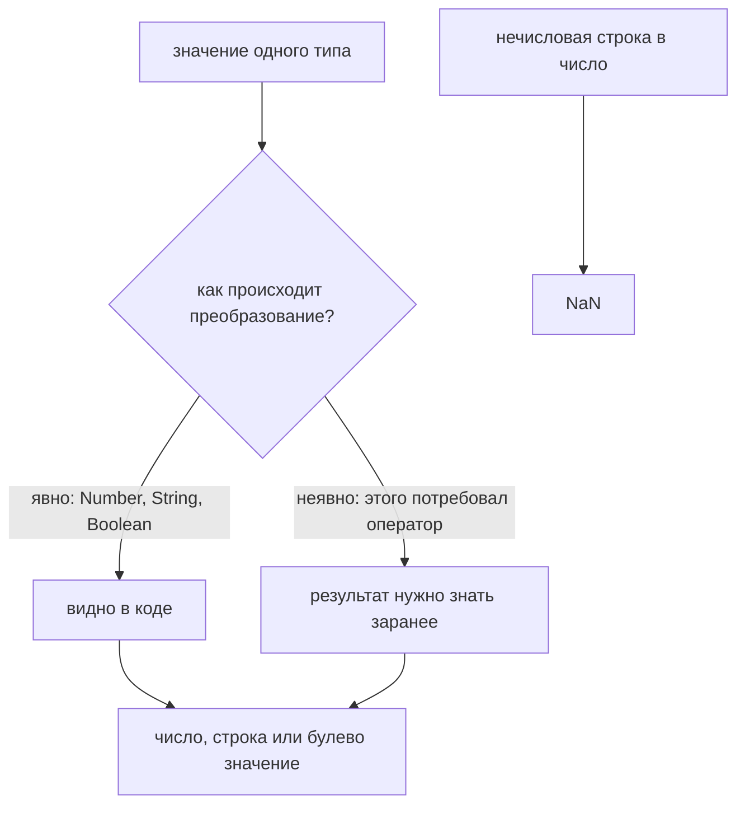

# Преобразование типов

## Связь с предыдущей главой

Предыдущие главы построили основу блока **Values and Types**:

Мы уже понимаем:

* JavaScript работает с значения;
* значения имеют types;
* primitive and object значения behave differently;
* references explain object sharing;
* Stack & Heap diagrams are conceptual tools for visualizing значения and references.

Теперь вопрос меняется.

До этого мы спрашивали:

```text
What kind of value is this?
Where is this value shown in the conceptual diagram?
What object does this variable refer to?
```

В этой главе главный вопрос другой:

> Какой тип ожидает эта операция?

Начнем с наблюдаемого поведения:

```javascript
console.log('5' + 1);
console.log('5' - 1);
```

Результат:

```text
51
4
```

Одна и та же string value `'5'` в одном выражении стала частью string result, а в другом участвовала как number.

Вопрос:

> Почему JavaScript treat the same string differently?

Ответ этой главы: потому что операции ожидают определённые типы, и JavaScript может преобразовать значения под эти ожидания.

---

## Предварительные требования

Для этой главы нужно понимать:

* что value - информация, с которой работает программа;
* какие primitive types есть в JavaScript;
* чем String отличается from Number;
* что Boolean имеет значения `true` and `false`;
* что `null`, `undefined` and `NaN` are important значения;
* что object значения are different, but object-to-primitive details are not part of this chapter;
* что `console.log` помогает observe result.

Не требуется знать `==`, `===`, `Object.is()`, abstract equality algorithm, operator specification details, object-to-primitive algorithm or Symbol conversion internals. Equality has its own chapter.

---

## Время изучения

Ориентировочное время:

```text
Чтение главы:            120-150 минут
Разбор схем:             45-60 минут
Запуск примеров:         25-35 минут
Практика:                100-130 минут
Повторение материала:    30 минут
```

Уровень сложности: **L3**.

Type conversion кажется хаотичной только тогда, когда ее учат как набор странных результатов. В этой главе conversion объясняется как ответ на требование операции.

---

## Навигация

Предыдущая глава:

```text
docs/01-javascript/14-stack-and-heap.md
```

Текущая глава:

```text
docs/01-javascript/15-type-conversion.md
```

Следующая глава:

```text
docs/01-javascript/16-equality.md
```

Следующая глава ответит на вопрос:

> Что происходит, когда JavaScript сравнивает два значения?

В этой главе equality algorithms не изучаются.

---

## Цели обучения

После изучения этой главы вы будете понимать:

* why type conversion exists;
* чем implicit conversion differs from explicit conversion;
* когда использовать `Number()`;
* когда использовать `String()`;
* когда использовать `Boolean()`;
* common conversion rules;
* что такое truthy and falsy значения;
* почему `NaN` appears during number conversion;
* что такое conversion chain на высоком уровне;
* почему conversion is not random;
* почему hidden conversion bugs appear in Automation QA;
* как работать with API strings, form значения and environment variables.

---

## Мотивация

Начнем с кода:

```javascript
console.log('5' + 1);
console.log('5' - 1);
```

Результат:

```text
51
4
```

Если смотреть только на значения, поведение кажется странным:

```text
"5" is String
1 is Number
```

Почему в первом случае result is `"51"`, а во втором `4`?

Секрет не в том, что JavaScript "случайно" выбирает поведение. Секрет в operation expectation.

Conversion overview:

Главный вопрос:

> Какой тип ожидает эта операция?

---

## Теория

### Почему преобразование типов существует

JavaScript получает значения из многих источников:

Эти значения не всегда имеют тот тип, которого ждёт операция.

Пример из автоматизации тестов:

```javascript
const retriesFromEnv = '3';
const nextRetry = retriesFromEnv + 1;

console.log(nextRetry);
```

Результат:

```text
31
```

Если вы ожидали сложение чисел, это ошибка. Операция получила не тот тип, который вы имели в виду.

Преобразование существует, потому что JavaScript часто пытается приспособить значения под операции.

Мысленная модель: переводчик.

### Неявное преобразование

Неявное преобразование происходит, когда JavaScript преобразует значение автоматически.

```javascript
console.log('5' - 1);
```

Операция `-` ожидает числового поведения.

Схема неявного преобразования:

```text
'5' - 1   →  движок сам приводит строку к числу  →  4
```

Какой тип ожидает эта операция?

```text
The subtraction operation expects Number-like values.
```

Неявное преобразование не всегда плохо. Оно опасно, когда незаметно и неожиданно.

### Явное преобразование

Явное преобразование происходит, когда программист просит выполнить его сам.

```javascript
const retriesFromEnv = '3';
const retries = Number(retriesFromEnv);

console.log(retries + 1);
```

Схема явного преобразования:

```text
Number('5')  →  5      преобразование запрошено явно
```

Какой тип ожидает эта операция?

```text
Numeric addition expects Number values.
```

Явное преобразование обычно лучше в тестах, потому что документирует намерение.

### Преобразование к числу

`Number()` преобразует значение в число.

```javascript
console.log(Number('5'));
console.log(Number('5.5'));
console.log(Number(''));
console.log(Number(true));
console.log(Number(false));
console.log(Number(null));
console.log(Number(undefined));
```

Схема преобразования к числу:

| Значение | `Number(...)` |
| --- | --- |
| `'42'` | `42` |
| `''` | `0` |
| `'abc'` | `NaN` |
| `true` | `1` |
| `null` | `0` |
| `undefined` | `NaN` |

Частые результаты: пустая строка и `null` дают `0`, а `undefined` и нечисловая строка — `NaN`.

Операция ожидает число — например, вычитание, умножение или деление. Тогда
приведение выполняется автоматически, по правилам из таблицы выше.

Схема:

```text
'abc'  →  Number(...)  →  NaN
```

### `NaN` при преобразовании

`NaN` означает «не число». Он появляется, когда JavaScript пытается получить число, но осмысленного числового значения не выходит.

```javascript
console.log(Number('abc'));
console.log(Number(undefined));
```

Схема `NaN`:

```text
NaN — это значение типа Number, означающее «не число»
NaN !== NaN
```

Какой тип ожидает эта операция?

```text
Number conversion expects value that can become a Number.
```

В автоматизации тестов `NaN` часто означает, что разобрали не то поле:

```javascript
const price = Number('19.99 USD');

console.log(price); // NaN
```

`NaN` в тесте почти всегда означает не «число неверное», а «взяли не то поле
или не очистили его от лишнего текста».

### Преобразование к строке

`String()` преобразует значение в строку.

```javascript
console.log(String(5));
console.log(String(true));
console.log(String(false));
console.log(String(null));
console.log(String(undefined));
```

Схема преобразования к строке:

| Значение | `String(...)` |
| --- | --- |
| `42` | `'42'` |
| `null` | `'null'` |
| `undefined` | `'undefined'` |
| `[1, 2]` | `'1,2'` |
| `{}` | `'[object Object]'` |

Частые результаты: массив склеивается через запятую, а обычный объект даёт `[object Object]` — по этой строке в логах узнают случайное приведение объекта к строке.

Операция ожидает строку — например, склейка через `+` или подстановка в шаблон.
Тогда значение приводится к строке.

Схема:

```text
42  →  String(...)  →  '42'
```

### Преобразование к логическому значению

`Boolean()` преобразует значение в булево.

```javascript
console.log(Boolean('text'));
console.log(Boolean(''));
console.log(Boolean(1));
console.log(Boolean(0));
console.log(Boolean(null));
```

Схема преобразования к булеву значению:

```text
значение  →  Boolean(...)  →  true или false
```

Преобразование к булеву значению используется, когда операция ожидает значение, похожее на условие.

Условные конструкции будут изучаться позже. Здесь нужна только модель преобразования.

### Истинные значения

Истинное значение — то, которое при преобразовании становится `true`.

Схема истинных значений:

```text
непустая строка, любое число кроме 0, объект, массив — даже пустой
```

Важно:

```javascript
console.log(Boolean('false'));
console.log(Boolean('0'));
```

Результат:

```text
true
true
```

Почему?

Это важно для переменных окружения:

```javascript
const headlessFromEnv = 'false';

console.log(Boolean(headlessFromEnv));
```

Результат:

```text
true
```

Строка `'false'` — это не булево `false`.

### Ложные значения

Ложное значение — то, которое при преобразовании становится `false`.

Схема ложных значений:

```text
falsy: false, 0, '', null, undefined, NaN
всё остальное — truthy
```

Примеры:

```javascript
console.log(Boolean(false));
console.log(Boolean(0));
console.log(Boolean(''));
console.log(Boolean(null));
console.log(Boolean(undefined));
console.log(Boolean(NaN));
```

«Ложное» не означает «плохое». Это означает:

```text
Boolean(value) produces false.
```

### Цепочки преобразований на высоком уровне

Иногда преобразование происходит в несколько шагов.

```javascript
console.log('Total: ' + 5);
```

Концептуальная цепочка здесь такая: один из операндов `+` — строка, поэтому
второй приводится к строке, и результатом становится `'Total: 5'`.

Другая цепочка:

```javascript
console.log(Number(String(5)));
```

Схема:

```text
примитив  →  преобразование  →  примитив другого типа
```

Эта глава оставляет цепочки преобразований высокоуровневыми. Детали спецификации операторов здесь не нужны.

### Таблица преобразований

Сводная таблица преобразований:

```text
Value        Number(value)   String(value)     Boolean(value)
-----------  --------------  ----------------  --------------
"5"          5               "5"               true
"abc"        NaN             "abc"             true
""           0               ""                false
0            0               "0"               false
1            1               "1"               true
true         1               "true"            true
false        0               "false"           false
null         0               "null"            false
undefined    NaN             "undefined"       false
NaN          NaN             "NaN"             false
```

Не заучивайте таблицу механически. Пользуйтесь вопросом:

> Какой тип ожидает эта операция?

---

Преобразование бывает видимым и незаметным:


```mermaid
flowchart TD
    A["значение одного типа"] --> B{"как происходит преобразование?"}
    B -- "явно: Number, String, Boolean" --> C["видно в коде"]
    B -- "неявно: этого потребовал оператор" --> D["результат нужно знать заранее"]
    C --> E["число, строка или булево значение"]
    D --> E
    F["нечисловая строка в число"] --> G["NaN"]
```

## Внутренний механизм

На концептуальном уровне преобразование идёт по схеме выбора.

Схема выбора преобразования:

```text
1. операция сообщает, значение какого типа ей нужно
2. значение уже нужного типа  →  преобразование не требуется
3. иначе                      →  применяется правило приведения для этого типа
4. правило не даёт осмысленного результата  →  NaN (для чисел)
```

### Неявный механизм

Неявное преобразование запускает операция.

### Явный механизм

Явное преобразование запускает программист.

### Текущее место в модели JavaScript

Схема текущего места:

```text
типы значений  →  правила преобразования  →  поведение операторов
```

### Полная картина преобразования

---

## Ментальная модель

### Переводчик

Преобразование похоже на переводчика:

```text
Operation language: Number
Incoming value:     String
Translator:         Number()
Result:             Number value
```

### Адаптер

Преобразование похоже на переходник:

```text
Device expects Type A
Cable has Type B
Adapter converts connection
```

В JavaScript:

```text
Operation expects Number
Value is String
Conversion adapts value
```

### Переходник для розетки

```text
Socket expects one plug shape
Device has another plug shape
Adapter makes it fit
```

Переходник не произволен. Он следует физическому правилу. Преобразование тоже следует правилам.

### Обмен валюты

```text
You have USD
Store expects EUR
Exchange converts amount
```

Курс обмена имеет значение. Правила преобразования в JavaScript — тоже.

### Универсальный переходник

JavaScript старается быть гибким:

Гибкость полезна, но скрытое преобразование порождает ошибки.

---

## Примеры кода

Все примеры находятся в:

```text
examples/01-javascript/chapter-15/
```

Запуск:

```bash
node examples/01-javascript/chapter-15/01-number-conversion.js
node examples/01-javascript/chapter-15/02-string-conversion.js
node examples/01-javascript/chapter-15/03-boolean-conversion.js
node examples/01-javascript/chapter-15/04-implicit-conversion.js
node examples/01-javascript/chapter-15/05-explicit-conversion.js
node examples/01-javascript/chapter-15/06-common-mistakes.js
```

### 01-number-conversion.js

Показывает преобразование через `Number()` для значений, похожих на ответы API.

### 02-string-conversion.js

Показывает преобразование через `String()` для журналов и полей формы.

### 03-boolean-conversion.js

Показывает поведение истинных и ложных значений.

### 04-implicit-conversion.js

Показывает преобразование, запущенное операцией.

### 05-explicit-conversion.js

Показывает преобразование, запущенное программистом.

### 06-common-mistakes.js

Показывает скрытую ошибку преобразования со значением из окружения.

---

## Частые вопросы

### Преобразование происходит случайно?

Нет. Преобразование следует правилам. Оно выглядит случайным, когда неясно, какого типа значение ждёт операция.

### Нужно ли избегать всех неявных преобразований?

И в рабочем, и в тестовом коде явное преобразование обычно понятнее. Но неявное существует, и его нужно понимать, потому что JavaScript использует его во многих операциях.

### Равен ли `Boolean('false')` значению `false`?

Нет.

```javascript
Boolean('false');
```

возвращает:

```text
true
```

потому что непустые строки являются истинными.

### Почему `Number('abc')` даёт `NaN`?

Потому что JavaScript попытался преобразовать строку в число, но осмысленного числа не получилось.

### Объяснит ли глава про равенство больше о преобразованиях?

Да. Равенство разбирается в отдельной главе. Эта глава не учит `==`, `===`, `Object.is()` и алгоритмам сравнения.

---

## Распространённые мифы

### Миф: JavaScript преобразует значения случайно

Реальность:

Преобразование происходит, потому что операция ожидает конкретный тип, и применяются правила.

### Миф: `Boolean(value)` проверяет, осмысленно ли значение

Реальность:

Он проверяет истинность по правилам JavaScript. Строка вроде `'false'` является истинной.

### Миф: `Number()` всегда даёт полезное число

Реальность:

Если преобразование не удалось, результатом может быть `NaN`.

### Миф: преобразование типов и равенство — одна тема

Реальность:

Равенство в некоторых случаях использует преобразование, но у сравнений свои правила, и они изучаются дальше.

---

## Распространённые ошибки

### Ошибка 1. Складывать число с числовой строкой

```javascript
const retries = '3';

console.log(retries + 1);
```

Результат:

```text
31
```

Операция выполнила не сложение чисел.

### Ошибка 2. Считать строку `'false'` булевым `false`

```javascript
const headless = 'false';

console.log(Boolean(headless));
```

Результат:

```text
true
```

### Ошибка 3. Не замечать `NaN`

```javascript
const price = Number('not available');

console.log(price);
```

Результат:

```text
NaN
```

### Ошибка 4. Преобразовывать слишком поздно

Если API возвращает строку `"200"`, а тест ожидает число `200`, решите явно, в какой точке выполняется преобразование.

### Ошибка 5. Заучивать результаты, не думая об ожиданиях операции

Более точный вопрос:

```text
What type does this operation expect?
```

---

## Практическое использование

Используйте явное преобразование, когда тип входного значения неясен.

### Числовое поле API приходит строкой

```javascript
const responseStatus = '200';
const statusCode = Number(responseStatus);
```

### Значения из формы

Значения из формы часто приходят строками:

```javascript
const ageFromForm = '30';
const age = Number(ageFromForm);
```

### Переменные окружения

Переменные окружения почти всегда строки:

```javascript
const retries = Number('3');
const booleanTextMap = {
  true: true,
  false: false,
};

const headless = booleanTextMap.false;
```

В этом примере объект используется как простая таблица соответствий. Правила равенства изучаются дальше.

### Памятка по преобразованиям

```text
1. What value did I receive?
2. What type is it now?
3. What type does the operation expect?
4. Should conversion be explicit?
5. What happens if conversion produces NaN?
6. Is Boolean conversion using truthy/falsy rules?
```

---

## Использование в Automation QA

### API возвращает строки вместо чисел

```json
{
  "statusCode": "200"
}
```

Тесту может понадобиться:

```javascript
const statusCode = Number(response.statusCode);
```

Схема примера из автоматизации тестов:

```text
ответ API:  '0'   →  Boolean('0')  →  true
ожидание:   ложь
```

### Сравнение значений из JSON

JSON может содержать числа, строки, булевы значения и `null`. Тесты не должны считать, что похожие на вид значения имеют один тип:

```text
"200"  is String
200    is Number
true   is Boolean
"true" is String
```

### Значения из формы

Поля формы в браузере обычно дают текстовые значения. Если тест читает `"30"` из поля, для вычислений нужно преобразование.

### Переменные окружения

Значения окружения часто приходят строками:

```text
HEADLESS="false"
RETRIES="3"
BASE_URL="https://example.com"
```

`HEADLESS="false"` — непустая строка. Преобразование к булеву значению даст `true`, поэтому разбирать её нужно намеренно.

### Как избегать скрытых ошибок преобразования

Предпочтительнее:

```javascript
const retries = Number(retriesFromEnv);
```

вместо того чтобы полагаться на неявное поведение.

Когда тест падает неожиданно, спросите:

```text
What type did this value have before assertion?
What type did operation expect?
Did JavaScript convert it implicitly?
Should the test convert explicitly?
```

---

## Итоги

Преобразование типов отвечает:

```text
что происходит, когда операция ожидает один тип, а получает другой?
```

Основная идея:

```text
JavaScript приводит значения потому, что операции ожидают определённые типы.
Приведение подчиняется правилам.
Оно не случайно.
```

Основные формы преобразования — к числу, к строке и к булеву значению.

Важные категории значений, где приведение чаще всего удивляет: пустая строка,
`null`, `undefined`, `NaN`, массив и обычный объект.

Следующая глава объясняет равенство:

```text
что происходит, когда JavaScript сравнивает два значения?
```

---

## Что нужно запомнить

* Преобразование происходит, потому что операция ожидает определённый тип.
* Неявное преобразование запускает операция JavaScript.
* Явное преобразование запрашивает программист.
* `Number()` может дать `NaN`.
* `String()` даёт строковое представление.
* `Boolean()` использует правила истинности и ложности.
* Непустые строки истинны, включая `'false'` и `'0'`.
* К ложным значениям относятся `false`, `0`, `''`, `null`, `undefined`, `NaN`.
* Скрытые ошибки преобразования часто встречаются в тестах.
* Переменные окружения и значения форм часто приходят строками.
* У равенства есть своя глава.

---

## Проверьте себя

Ответьте без запуска кода.

1. Почему существует преобразование типов?
2. Что такое неявное преобразование?
3. Что такое явное преобразование?
4. Что возвращает `Number('abc')`?
5. Что даст `Boolean('false')` — истину или ложь?
6. Почему `'5' + 1` отличается от `'5' - 1`?
7. Какой тип ожидает вычитание?
8. Почему переменные окружения опасны при преобразовании к булеву значению?
9. Что такое `NaN` в контексте преобразования?
10. На какой вопрос ответит следующая глава?

### Ответы

1. Операции требуют значений определённого типа, а данные приходят другими: из ответа сервера, из переменных окружения, из полей ввода — почти всегда текстом.
2. Преобразование, которое выполняет сама операция, без явного указания: сравнение, сложение, условие.
3. Преобразование, записанное в коде явно: `Number(value)`, `String(value)`, `Boolean(value)`.
4. `NaN` — результат, который означает «привести к числу не удалось».
5. `true`. Непустая строка считается истинной независимо от того, что в ней написано; слово `false` здесь обычный текст.
6. `+` работает и со строками: если один операнд строка, выполняется склейка, и получается `'51'`. У `-` строкового смысла нет, поэтому строка приводится к числу и получается `4`.
7. Числа. Поэтому оба операнда приводятся к числу, а нечисловая строка даёт `NaN`.
8. Переменные окружения всегда строки. `'false'`, `'0'` и `''` — разные строки, но `Boolean('false')` и `Boolean('0')` дают `true`. Настройку надо сравнивать явно, а не превращать в булево значение.
9. Значение типа `number`, означающее «результат числовой операции не определён». В тестах оно почти всегда означает, что разобрали не то поле или не очистили его от лишнего текста.
10. Как сравниваются значения — и что происходит, когда операторы сравнения встречают разные типы.

---

## Практика

Практика находится в файле:

```text
practice/01-javascript/15-type-conversion.md
```

Решайте задания без запуска там, где требуется предсказать вывод. Главная цель — научиться видеть, какого типа значение ждёт операция.

---

## Решения

Решения находятся в файле:

```text
solutions/01-javascript/15-type-conversion.md
```

Читайте решения после самостоятельной попытки. Проверяйте рассуждение: какая операция какого типа ожидала и какое преобразование произошло.
