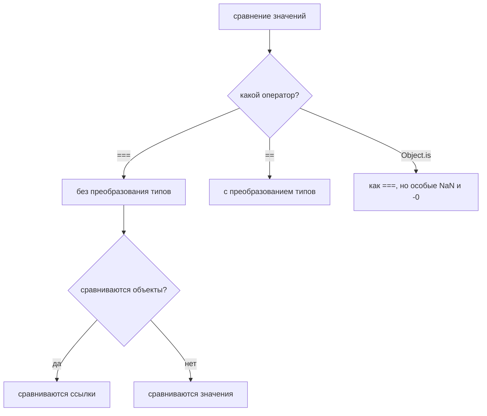

# Равенство

## Связь с предыдущей главой

Предыдущая глава объяснила Type Conversion:

Теперь появляется следующий вопрос:

> Как JavaScript решает, равны ли два значения?

Начнем с наблюдаемого поведения:

```javascript
console.log(5 == '5');
console.log(5 === '5');
```

Результат:

```text
true
false
```

Обе строки сравнивают same visible значения: `5` and `'5'`.

Но ответы разные.

Вопрос:

> Почему ответы отличаются?

В предыдущей главе мы узнали: JavaScript sometimes converts значения. В этой главе мы увидим, что different equality operators answer different questions.

Главный вопрос главы:

> Что именно сравнивается?

---

## Предварительные требования

Для этой главы нужно понимать:

* что значения have types;
* чем Number differs from String;
* что Type Conversion может произойти, когда операция ожидает другой тип;
* что objects are compared differently from primitive значения;
* что references explain object identity;
* что `NaN` can appear during number conversion;
* что `+0` and `-0` are numeric значения with a special edge case.

Не требуется знать SameValue algorithm details, SameValueZero, Map/Set comparison rules, deep equality libraries, JSON comparison or testing frameworks. Эти темы будут упоминаться только как future topics.

---

## Время изучения

Ориентировочное время:

```text
Чтение главы:            120-150 минут
Разбор схем:             45-60 минут
Запуск примеров:         25-35 минут
Практика:                100-130 минут
Повторение материала:    30 минут
```

Уровень сложности: **L3**.

Equality опасно, потому что синтаксис маленький, а семантика важная. Один лишний `=` может изменить, произойдёт ли conversion перед сравнением.

---

## Навигация

Предыдущая глава:

```text
docs/01-javascript/15-type-conversion.md
```

Текущая глава:

```text
docs/01-javascript/16-equality.md
```

Следующая глава:

```text
docs/01-javascript/17-operators.md
```

Следующая глава расширит тему operations and operators. Здесь мы изучаем only equality operators.

---

## Цели обучения

После изучения этой главы вы будете понимать:

* why equality is needed;
* why JavaScript has multiple equality operators;
* how strict equality `===` works at a conceptual level;
* how loose equality `==` works at a conceptual level;
* what `Object.is()` is for;
* difference between identity and value;
* how primitive comparison works;
* how object comparison works;
* why `NaN` is special;
* why `+0` and `-0` are special for `Object.is()`;
* practical comparison strategy for everyday code;
* why Automation QA usually prefers strict equality.

---

## Мотивация

Начнем with observable поведение:

```javascript
console.log(5 == '5');
console.log(5 === '5');
```

Вывод:

```text
true
false
```

If equality meant only "look the same", both answers would be the same.

But JavaScript has different equality questions:

Equality overview:

Главный вопрос:

> Что именно сравнивается?

---

## Теория

### Зачем нужно равенство

Программы постоянно принимают решения:

```text
Is response status expected?
Is user role admin?
Is API field missing?
Is parsed value equal to expected value?
Is this object the same object as before?
```

В коде:

```javascript
const statusCode = 200;
const expectedStatusCode = 200;

console.log(statusCode === expectedStatusCode);
```

Равенство нужно, чтобы ответить на вопрос:

```text
Do these two values match according to this comparison rule?
```

### Почему в JavaScript несколько операторов равенства

JavaScript задумывался гибким к значениям из разных источников. Эта гибкость породила два распространённых режима сравнения:

Позже для нескольких особых случаев стал полезен `Object.is()`.

Вопросы сравнения:

| Оператор | Вопрос, на который он отвечает |
| --- | --- |
| `===` | одинаковы ли тип и значение |
| `==` | можно ли привести значения к общему типу так, чтобы они совпали |
| `Object.is()` | то же, что `===`, но `NaN` равен `NaN`, а `0` и `-0` различны |

### Строгое равенство `===`

Строгое равенство не выполняет преобразования типов.

```javascript
console.log(5 === '5');
```

Результат:

```text
false
```

Поток `===`:

```text
5 === '5'
 │      │
 │      └─ тип: string
 └──────── тип: number
типы разные → результат false, значения даже не сравниваются
```

Преобразования здесь не происходит вовсе — это главное свойство строгого
сравнения.

`===` спрашивает:

> Совпадают ли у них уже сейчас и тип, и значение?

### Нестрогое равенство `==`

Нестрогое равенство может выполнить преобразование перед сравнением.

```javascript
console.log(5 == '5');
```

Результат:

```text
true
```

Поток `==`:

```text
5 == '5'
типы разные → привести к сравнимому виду
'5' → 5
5 == 5 → true
```

Преобразование выполняется автоматически и по правилам, которые нужно помнить —
именно поэтому в тестах предпочитают `===`.

`==` спрашивает:

> Можно ли привести эти значения к сравнимому виду?

Это полезно только когда преобразование действительно нужно. Большей части тестового кода стоит избегать скрытого преобразования при сравнении.

### `Object.is()`

`Object.is()` — функция сравнения со своей точной семантикой.

```javascript
console.log(Object.is(5, 5));
console.log(Object.is(NaN, NaN));
console.log(Object.is(+0, -0));
```

Схема `Object.is()`:

```text
Object.is(a, b)  →  сравнение без преобразований,
                    с особыми правилами для NaN и нулей
```

`Object.is()` спрашивает:

> Совпадают ли они точно по правилам `Object.is()`?

Подробный алгоритм сравнения не входит в эту главу.

### Сравнение примитивов

Примитивные значения сравниваются по значению.

```javascript
console.log(200 === 200);
console.log('admin' === 'admin');
console.log(true === true);
```

Схема сравнения примитивов:

```text
'active' === 'active'  →  true    одно и то же значение
1 === '1'              →  false   разные типы
```

Примеры: `2 === 2` истинно, `2 === '2'` ложно, `true === 1` ложно.

Что именно сравнивается?

```text
For primitives with ===:
type and value.
```

### Сравнение объектов

Объекты сравниваются по тождественности, а не по структуре.

```javascript
const firstUser = {
  name: 'Anna',
};

const secondUser = {
  name: 'Anna',
};

console.log(firstUser === secondUser);
```

Результат:

```text
false
```

Схема сравнения объектов:

```text
{ a: 1 } === { a: 1 }   →  false   два разных объекта
```

Та же ссылка:

```javascript
const firstUser = {
  name: 'Anna',
};

const sameUser = firstUser;

console.log(firstUser === sameUser);
```

Схема:

```text
user === admin  →  true, если обе переменные хранят одну ссылку
```

Результат:

```text
true
```

Что именно сравнивается?

```text
For objects:
whether both variables refer to the same object.
```

Библиотеки глубокого сравнения, сравнение JSON и сопоставители объектов в тестовых фреймворках будут изучаться позже.

### Тождественность и значение

Тождественность и значение — разные вопросы.

Схема «тождественность против значения»:

```text
identity  →  это один и тот же объект?
value     →  одинаково ли содержимое?

=== отвечает только на первый вопрос
```

Мысленная модель близнецов:

Два объекта могут выглядеть одинаково и при этом иметь разную тождественность.

### Сравнение с `NaN`

`NaN` — особый случай.

```javascript
console.log(NaN === NaN);
console.log(Object.is(NaN, NaN));
```

Результаты:

```text
false
true
```

Схема сравнения `NaN`:

```text
NaN === NaN        →  false
Object.is(NaN, NaN) →  true
```

Что именно сравнивается?

```text
=== follows strict equality behavior.
Object.is() has special NaN semantics.
```

На практике для проверки на `NaN` часто используют `Number.isNaN()`. Подробно числовые функции будут разобраны позже.

### `+0` и `-0`

В большинстве повседневного кода `+0` и `-0` ведут себя как равные при сравнении через `===`.

```javascript
console.log(+0 === -0);
console.log(Object.is(+0, -0));
```

Результаты:

```text
true
false
```

Схема «`+0` против `-0`»:

```text
+0 === -0            →  true
Object.is(+0, -0)    →  false
```

Это одно из немногих мест, где поведение `Object.is()` заметно отличается.

### Дерево решений

Рекомендуемая стратегия сравнения:

```text
Что сравниваем?
├── примитивы одного типа        →  ===
├── примитивы разных типов       →  привести явно, затем ===
├── «есть ли значение вообще»    →  value == null   (ловит null и undefined)
├── объекты по содержимому       →  сравнить поля или глубокое сравнение
└── объекты по идентичности      →  ===
```

Единственное оправданное применение `==` — строка `value == null`: она
короче и честнее, чем две проверки подряд. Во всех остальных случаях
нестрогое равенство прячет расхождение типов, которое тест обязан заметить.

---

Три оператора сравнения решают разные задачи:



## Внутренний механизм

На концептуальном уровне равенство — это операция с выбранным правилом сравнения.

### Полная картина сравнения

```text
1. выбран оператор сравнения
2. === и Object.is  →  типы разные, результат false, преобразований нет
3. ==               →  типы разные, значения приводятся к общему типу
4. оба значения — объекты  →  сравниваются ссылки, а не свойства
5. оба значения — примитивы →  сравниваются сами значения
```

### Текущее место в модели JavaScript

Что именно сравнивается?

```text
примитивы  —  сами значения
объекты    —  ссылки: один и тот же объект или разные
```

### Переход к операторам

Операторы равенства — лишь одна группа операторов.

Следующая глава расширяет вопрос:

```text
How do JavaScript operators transform, combine and evaluate values?
```

Переход к операторам:

```text
Equality   —  один вопрос: совпадают ли значения
Operators  —  весь набор операций над значениями, сравнение лишь его часть
```

---

## Ментальная модель

### Проверка паспорта

`===` похож на проверку паспорта:

Если тип отличается, `===` отвечает «нет».

### Переводчик перед сравнением

`==` похож на переводчика перед сравнением:

```text
'5' == 5  →  переводчик приводит строку к числу, затем сравнивает
```

Переводчик удобен, пока вы точно знаете правила перевода; в тестах это редко
так, поэтому по умолчанию берут `===`.

### Отпечаток пальца

`Object.is()` похож на отпечаток пальца для особых точных случаев:

```text
Object.is(NaN, NaN)  →  true   (=== даёт false)
Object.is(0, -0)     →  false  (=== даёт true)
```

Отпечаток различает то, что обычное сравнение считает одинаковым, и наоборот.

### Однояйцевые близнецы

Объекты одинаковой формы похожи на близнецов:

Два объекта могут выглядеть одинаково и не быть одним объектом.

### Подписи на коробках

Переменные — это подписи. Объекты — коробки.

Если две подписи указывают на одну коробку, объекты равны по тождественности.

---

## Примеры кода

Все примеры находятся в:

```text
examples/01-javascript/chapter-16/
```

Запуск:

```bash
node examples/01-javascript/chapter-16/01-strict-equality.js
node examples/01-javascript/chapter-16/02-loose-equality.js
node examples/01-javascript/chapter-16/03-object-is.js
node examples/01-javascript/chapter-16/04-object-comparison.js
node examples/01-javascript/chapter-16/05-nan.js
node examples/01-javascript/chapter-16/06-common-mistakes.js
```

### 01-strict-equality.js

Показывает `===` без преобразования.

### 02-loose-equality.js

Показывает `==` с преобразованием.

### 03-object-is.js

Показывает особые случаи `Object.is()`.

### 04-object-comparison.js

Показывает сравнение объектов по тождественности.

### 05-nan.js

Показывает, почему `NaN` требует особого внимания.

### 06-common-mistakes.js

Показывает скрытую ошибку преобразования на данных, похожих на тестовые.

---

## Частые вопросы

### Всегда ли использовать `===`?

По умолчанию — да. Он избавляет от скрытого преобразования типов и делает сравнения понятнее.

### `==` всегда плох?

Нет. Он опасен при случайном использовании. Применяйте его только тогда, когда правила преобразования действительно нужны и понятны.

### Зачем существует `Object.is()`?

Он иначе обрабатывает несколько точных случаев сравнения, прежде всего `NaN` и `+0` с `-0`.

### Почему два одинаково выглядящих объекта не равны?

Потому что сравнение объектов проверяет тождественность, а не структуру.

### Как тестовые фреймворки глубоко сравнивают объекты?

У тестовых фреймворков и инструментов глубокого сравнения свои механизмы. Они будут разобраны позже, когда дойдём до фреймворков.

---

## Распространённые мифы

### Миф: `==` означает «неправильно», а `===` — «правильно»

Реальность:

`==` означает сравнение с возможным преобразованием. `===` — сравнение без преобразования. Практическая рекомендация — предпочитать `===`, но настоящая разница смысловая.

### Миф: объекты с одинаковыми свойствами равны

Реальность:

Объекты сравниваются по тождественности.

### Миф: `Object.is()` — просто другая запись для `===`

Реальность:

В большинстве обычных случаев они похожи, но различаются для `NaN` и для `+0` с `-0`.

### Миф: равенство можно выучить по таблице

Реальность:

Таблицы помогают, но рассуждение начинается с вопроса: что именно сравнивается?

---

## Распространённые ошибки

### Ошибка 1. Случайно положиться на `==`

```javascript
const expectedStatus = 200;
const actualStatus = '200';

console.log(expectedStatus == actualStatus);
```

Результат:

```text
true
```

Тест может пройти, хотя фактический тип неверен.

### Ошибка 2. Сравнивать объекты по структуре через `===`

```javascript
const expectedUser = {
  name: 'Anna',
};

const actualUser = {
  name: 'Anna',
};

console.log(expectedUser === actualUser);
```

Результат:

```text
false
```

### Ошибка 3. Забыть про `NaN`

```javascript
console.log(NaN === NaN);
```

Результат:

```text
false
```

### Ошибка 4. Использовать `Object.is()` везде

`Object.is()` полезен, но он не инструмент сравнения по умолчанию для всего кода.

### Ошибка 5. Сравнивать до разбора значения

Если API возвращает `"200"`, а тест ожидает `200`, разберите значение намеренно перед сравнением или проверьте, что API действительно возвращает строку.

---

## Практическое использование

Практическая стратегия сравнения:

```text
1. Prefer === by default.
2. Convert explicitly before comparison if needed.
3. Use == only when conversion is intentional.
4. Use Object.is() for special semantics.
5. For objects, know whether you need identity or structure.
```

Пример проверки:

```javascript
const actualStatusCode = Number('200');
const expectedStatusCode = 200;

console.log(actualStatusCode === expectedStatusCode);
```

Схема:

```text
Number('200')  ──► 200          приведение выполнено осознанно
     200       ──► 200          ожидаемое значение
                   │
                   ▼
              200 === 200  ──►  true
```

Приведение сделано до сравнения и видно в коде. Сравнение остаётся строгим,
поэтому строка, случайно попавшая в ответ вместо числа, тест не пройдёт.

## Использование в Automation QA

### Почему проверки обычно используют строгое равенство

Тесты должны выявлять несовпадение типов, а не прятать его.

```javascript
const expectedStatusCode = 200;
const actualStatusCode = '200';

console.log(expectedStatusCode === actualStatusCode);
```

Результат:

```text
false
```

Это полезно, потому что API вернул строку, а не число.

### Сравнение значений из API

Если контракт API говорит, что это число:

```text
Expected: 200 as Number
Actual:   "200" as String
```

Не позволяйте `==` скрыть это несовпадение.

### Сравнение разобранных значений

Если API намеренно возвращает строку, а тесту нужно число для вычисления:

```javascript
const actualStatusCode = Number('200');
const expectedStatusCode = 200;

console.log(actualStatusCode === expectedStatusCode);
```

### Сравнение ссылок на объекты

```javascript
const expectedUser = {
  name: 'Anna',
};

const actualUser = {
  name: 'Anna',
};
```

`expectedUser === actualUser` проверяет тождественность, а не структуру. Тестовые фреймворки дают сопоставители для сравнения структуры. Они будут изучаться позже.

### Как избегать скрытых ошибок преобразования

Чек-лист:

```text
1. What are the types of both values?
2. Is conversion intentional?
3. Is comparison checking value or identity?
4. Should parsing happen before comparison?
5. Is Object.is() needed for NaN or +0/-0?
```

---

## Итоги

Равенство отвечает:

```text
How does JavaScript decide whether two values are equal?
```

Основная модель: `===` сравнивает значения примитивов и идентичность объектов, а сравнение содержимого объектов нужно писать самому.

Примитивные значения сравниваются по типу и значению через `===`.

Объекты сравниваются по тождественности.

Рекомендуемая стратегия:

```text
Prefer === by default.
Use == only when conversion rules are intentionally desired.
Use Object.is() for the few cases where its semantics are specifically needed.
```

---

## Что нужно запомнить

* Равенство — это операция сравнения.
* Всегда спрашивайте: что именно сравнивается?
* `==` может преобразовать значения перед сравнением.
* `===` никогда не выполняет преобразования типов.
* У `Object.is()` своя семантика сравнения.
* Примитивные значения сравниваются по значению и типу через `===`.
* Объекты сравниваются по тождественности.
* Одинаково выглядящие объекты не обязательно равны.
* `NaN === NaN` даёт `false`.
* `Object.is(NaN, NaN)` даёт `true`.
* `+0 === -0` даёт `true`.
* `Object.is(+0, -0)` даёт `false`.
* В коде тестов по умолчанию предпочитайте `===`.

---

## Проверьте себя

Ответьте без запуска кода.

1. Почему `5 == '5'` отличается от `5 === '5'`?
2. Какой вопрос задаёт `==`?
3. Какой вопрос задаёт `===`?
4. Какой вопрос задаёт `Object.is()`?
5. Объекты сравниваются по структуре или по тождественности?
6. Почему два одинаково выглядящих объекта могут быть не равны?
7. Что особенного в `NaN === NaN`?
8. Что особенного в `Object.is(+0, -0)`?
9. Почему в проверках обычно предпочитают строгое равенство?
10. Когда `==` допустим?

### Ответы

1. `==` приводит значения к общему типу и потому считает их равными. `===` сравнивает без преобразования: типы разные — результат `false`.
2. «Можно ли привести эти значения к общему типу так, чтобы они совпали?»
3. «Одинаковы ли у них тип и значение?»
4. То же, что `===`, но с двумя исключениями: `NaN` считается равным `NaN`, а `0` и `-0` — различными.
5. По тождественности. Сравнивается, один это объект или разные, а не совпадают ли свойства.
6. Потому что это два разных объекта. Совпадение свойств не делает их одним значением.
7. Результат `false`. `NaN` не равен ничему, включая самого себя, — поэтому проверять на `NaN` сравнением бесполезно.
8. Результат `false`. Это одно из двух мест, где `Object.is()` строже обычного сравнения: `+0 === -0` даёт `true`.
9. Потому что проверка не должна проходить из-за приведения типов. Если сервер вернул `'200'` вместо `200`, тест обязан это заметить, а не счесть значения равными.
10. Когда намеренно проверяют «значение отсутствует» сразу для `null` и `undefined`: `value == null`. В остальных случаях лучше выразить намерение явно.

---

## Практика

Практика находится в файле:

```text
practice/01-javascript/16-equality.md
```

Сначала решайте без запуска. Главная цель — рассуждение, а не заученные таблицы.

---

## Решения

Решения находятся в файле:

```text
solutions/01-javascript/16-equality.md
```

Читайте решения после самостоятельной попытки. Проверяйте вопрос: что именно сравнивается?
