# Operators

## Связь с предыдущей главой

Предыдущие главы объяснили значения, types, references, conceptual memory model, type conversion and equality.

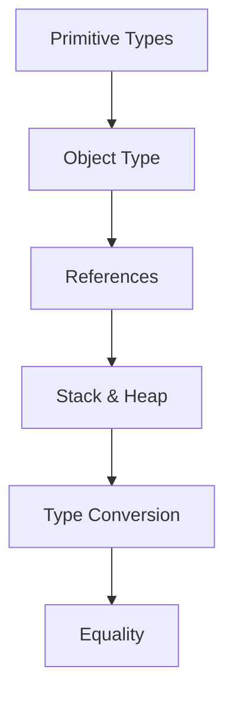

Теперь начинается новый блок: **Program Control**.

До этого мы изучали, что такое значения and how they compare. Теперь вопрос другой:

> Как JavaScript выполняет операции над значениями?

Начнем с простого выражения:

```javascript
2 + 3
```

Вопрос:

> Что такое `+`?

`2` and `3` are значения. `+` is the action performed on them.

Главный вопрос этой главы:

> Какая операция выполняется?

---

## Предварительные требования

Для этой главы нужно понимать:

* что value is information JavaScript works with;
* что значения have types;
* что type conversion может произойти, когда операция ожидает другой тип;
* что equality operators compare значения;
* что objects contain properties;
* что variables give named access to значения.

Не требуется знать bitwise operators, optional chaining, nullish coalescing, destructuring, spread, rest, precedence tables or short-circuit evaluation details. Эти темы будут изучаться позже.

---

## Время изучения

Ориентировочное время:

```text
Чтение главы:            100-130 минут
Разбор схем:             35-50 минут
Запуск примеров:         20-30 минут
Практика:                90-120 минут
Повторение материала:    25 минут
```

Уровень сложности: **L2-L3**.

Operators выглядят знакомо, потому что `+`, `-`, `=`, `&&`, `typeof` короткие. Но короткий синтаксис не означает простое поведение. Каждый operator performs an operation and produces a result.

---

## Навигация

Предыдущая глава:

```text
docs/01-javascript/16-equality.md
```

Текущая глава:

```text
docs/01-javascript/17-operators.md
```

Следующая глава:

```text
docs/01-javascript/18-conditionals.md
```

Следующая глава объяснит Conditionals: how programs choose different paths based on evaluated results.

---

## Цели обучения

После изучения этой главы вы будете понимать:

* what an operator is;
* what operands are;
* difference between unary, binary and ternary operators;
* why operators are grouped into categories;
* what arithmetic operators do at a high level;
* what comparison operators do;
* what logical operators do at a high level;
* what assignment operators do;
* how `typeof` helps inspect значения;
* what `delete`, `in` and `instanceof` mean at a high level;
* what operator result means;
* why operator precedence exists conceptually;
* how operators appear in Automation QA code.

---

## Мотивация

Посмотрите на выражение:

```javascript
2 + 3
```

Здесь есть значения:

```text
2
3
```

И есть action:

```text
+
```

Диаграмма Operator overview:

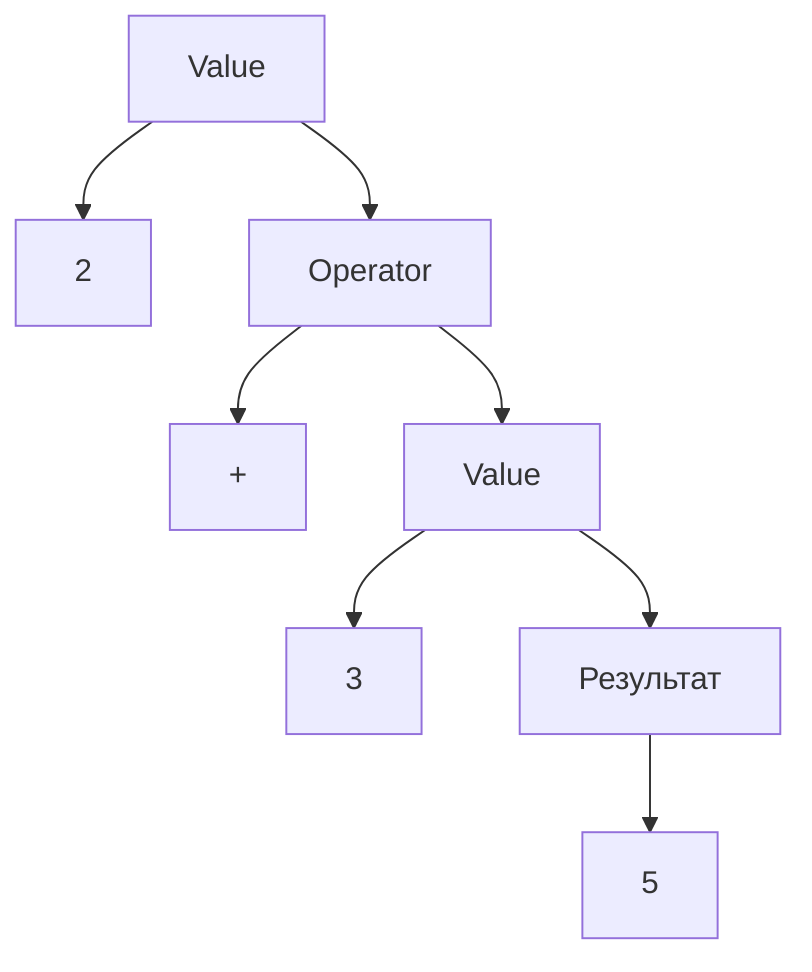

Operators are the language mechanism that transforms, combines and evaluates значения.

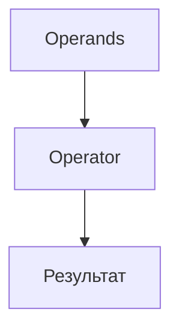

Главный вопрос:

> Какая операция выполняется?

---

## Теория

### Operator, operand, result

Do not start with syntax. Start with поведение.

```javascript
const total = 2 + 3;
```

Какая операция выполняется?

```text
Addition.
```

Operand → Operator → Result:

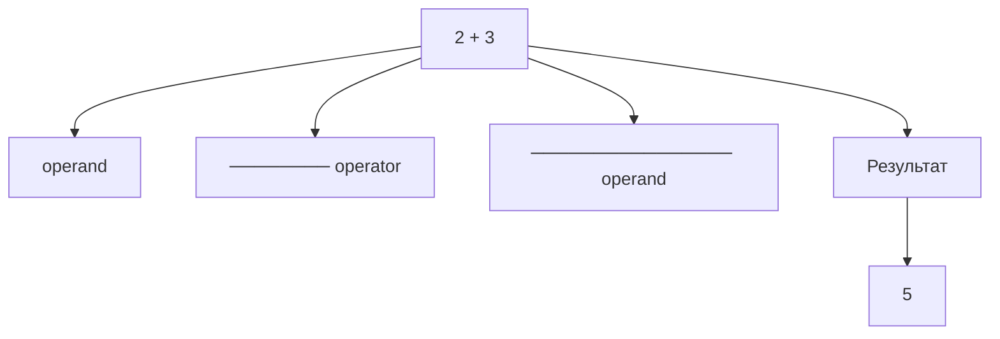

Operator receives operands and produces a result.

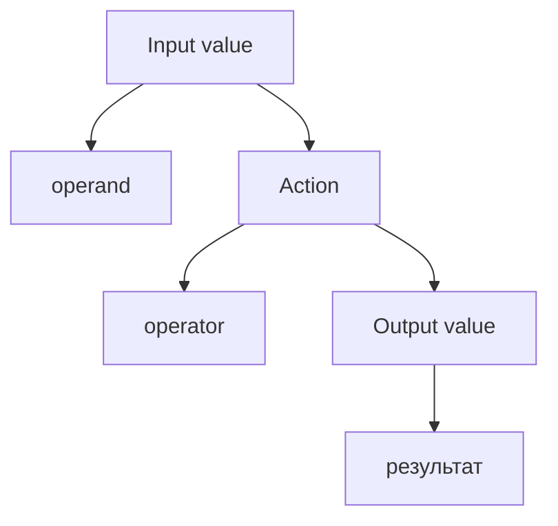

### Unary operators

Unary operator works with one operand.

```javascript
const valueType = typeof 'Anna';
```

Unary operator схема:

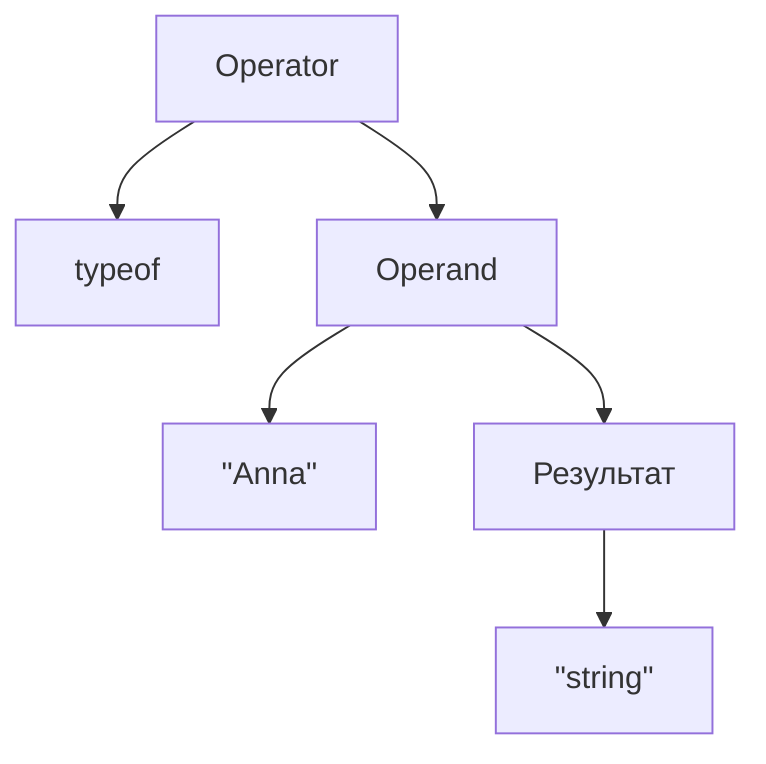

Other unary examples:

```javascript
!true;
-5;
typeof 200;
```

Эта глава не перечисляет все unary operators. Она строит модель:

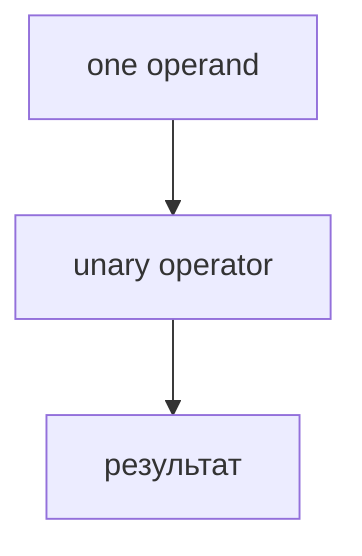

### Binary operators

Binary operator works with two operands.

```javascript
const total = 2 + 3;
const isExpected = 200 === 200;
```

Binary operator схема:

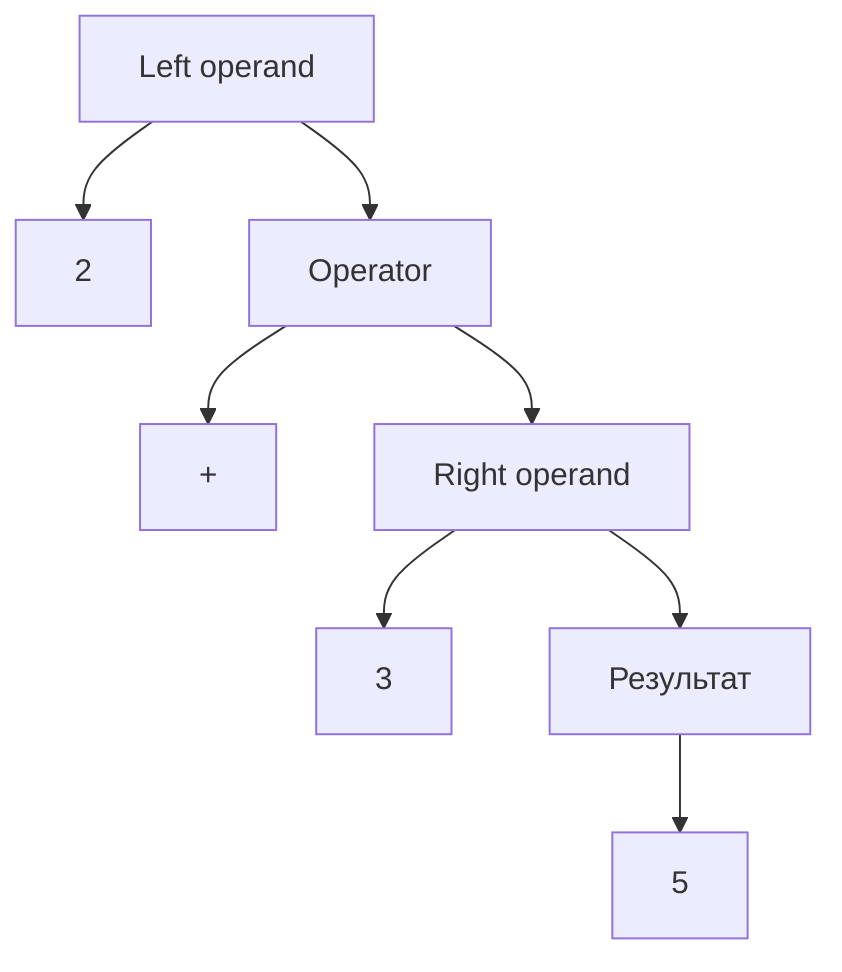

Equality is also binary:

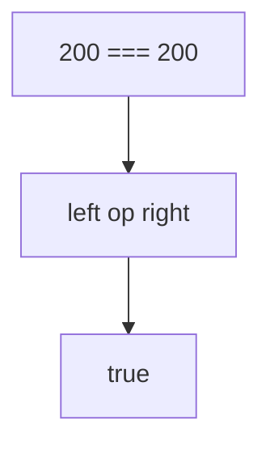

### Ternary operator

JavaScript has one common ternary operator:

```javascript
const label = isActive ? 'active' : 'inactive';
```

Ternary means three operands.

Ternary operator схема:

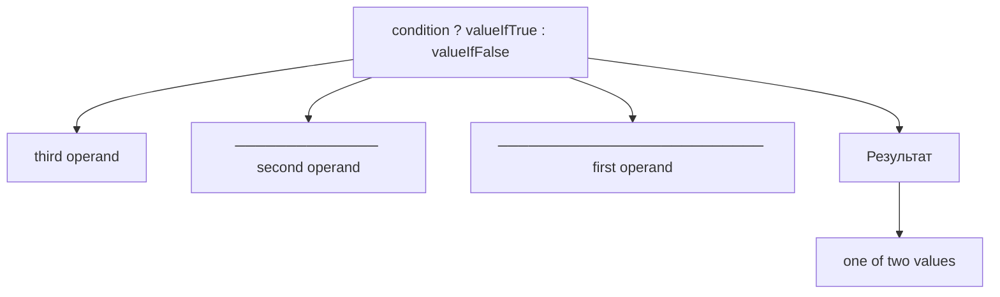

Эта глава только вводит форму. Conditionals позже подробно объяснит принятие решений.

### Operator categories

Operators are grouped by the kind of operation they perform.

Operator categories:

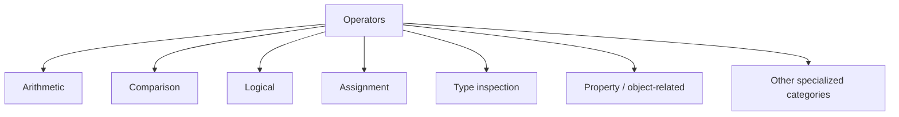

Какая операция выполняется?

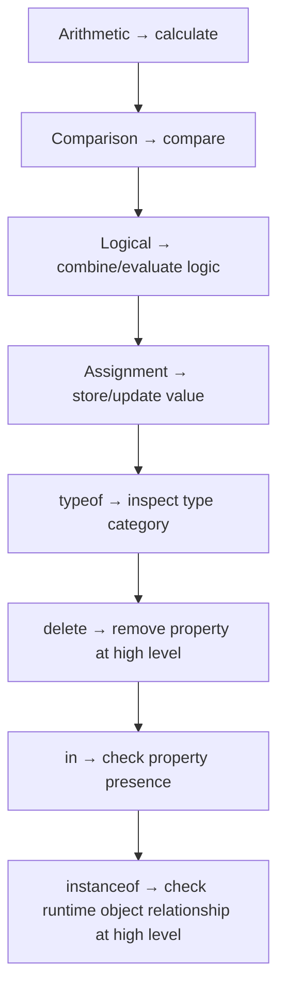

### Arithmetic operators

Arithmetic operators perform numeric-like calculations.

```javascript
const itemPrice = 100;
const itemCount = 3;
const totalPrice = itemPrice * itemCount;
```

Arithmetic operators схема:

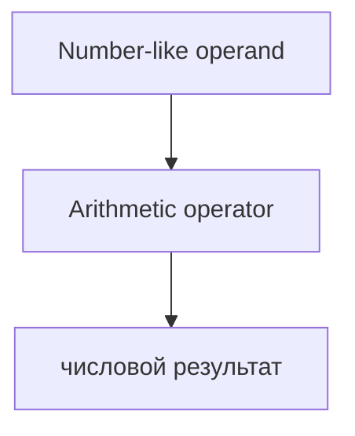

Примеры:

```text
+  addition
-  subtraction
*  multiplication
/  division
%  remainder
```

Эта глава не учит каждый арифметический оператор отдельно. Достаточно ментальной модели:

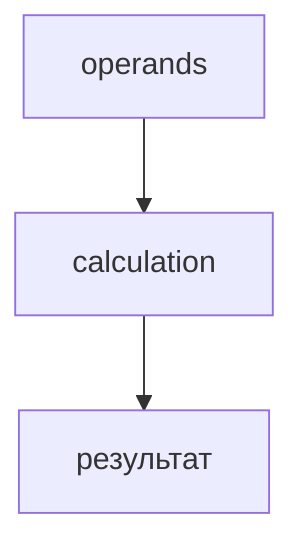

Type conversion may happen if operands are not the expected type. Type Conversion chapter explained why.

### Comparison operators

Comparison operators compare значения and produce Boolean result.

```javascript
const statusCode = 200;
const isSuccess = statusCode === 200;
```

Comparison operators схема:

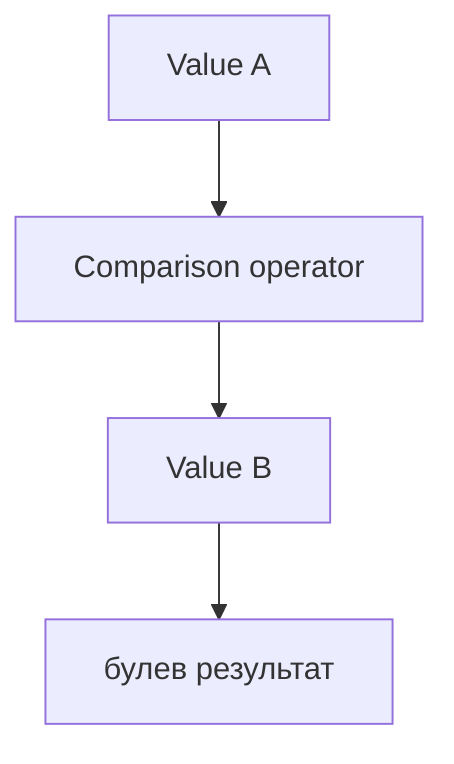

Примеры:

```text
===  strict equality
!==  strict inequality
>    greater than
<    less than
>=   greater than or equal
<=   less than or equal
```

Equality was studied in the previous chapter. Other comparison operators will appear naturally in conditionals and loops.

### Logical operators

Logical operators work with значения used as logical decisions.

```javascript
const isStatusOk = statusCode === 200;
const hasUser = true;
const canContinue = isStatusOk && hasUser;
```

Logical operators схема:

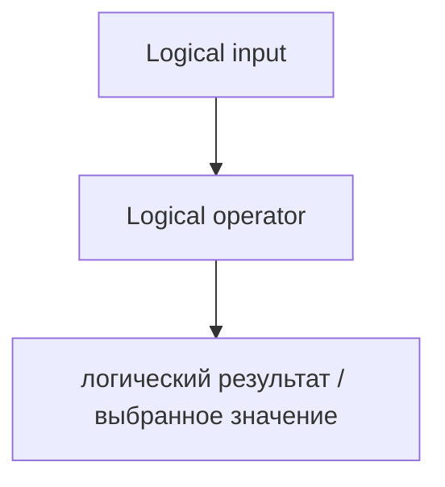

Common logical operators:

```text
&&  AND
||  OR
!   NOT
```

Эта глава не разбирает детали short-circuit evaluation. Они будут объяснены позже, когда понадобятся в условиях.

На этом уровне:

```text
&& combines conditions
|| combines alternatives
!  negates a condition-like value
```

### Assignment operators

Assignment operators store or update значения through identifiers or properties.

```javascript
let retryCount = 0;
retryCount = 1;
```

Assignment operators схема:

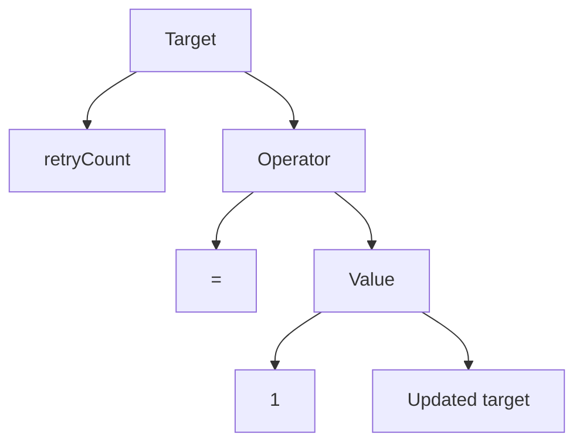

Other assignment-like forms exist:

```javascript
retryCount += 1;
```

На высоком уровне:

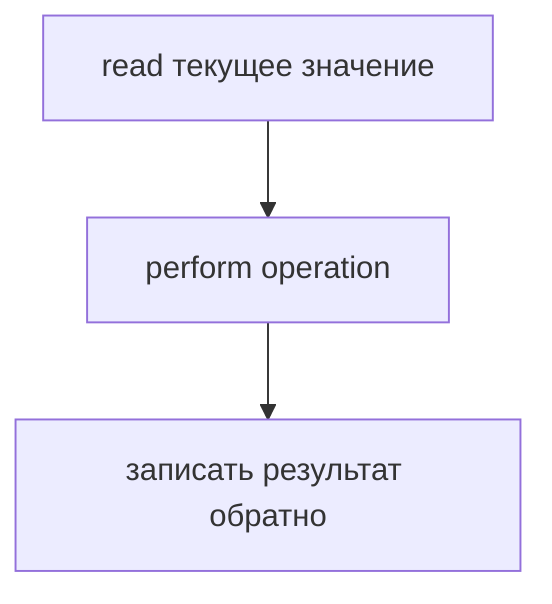

Подробные варианты operators будут изучаться по мере необходимости.

### `typeof`

`typeof` is a unary operator that returns a string describing type category.

```javascript
console.log(typeof 200);
console.log(typeof 'Anna');
console.log(typeof true);
```

`typeof` схема:

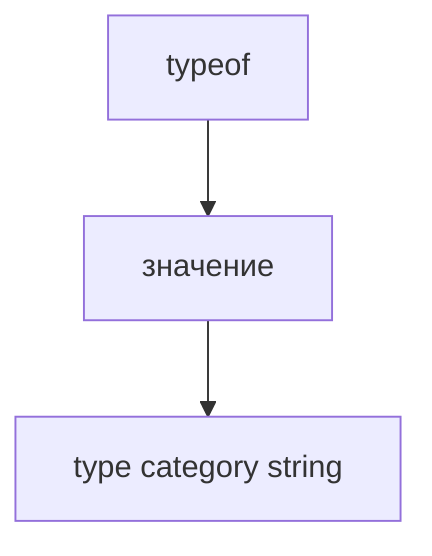

Automation QA uses `typeof` for debugging unexpected API значения:

```javascript
const statusCode = '200';

console.log(typeof statusCode);
```

Результат:

```text
string
```

### `delete`

`delete` removes a property from an object at a high level.

```javascript
const user = {
  name: 'Anna',
  temporaryCode: '1234',
};

delete user.temporaryCode;
```

`delete` схема:

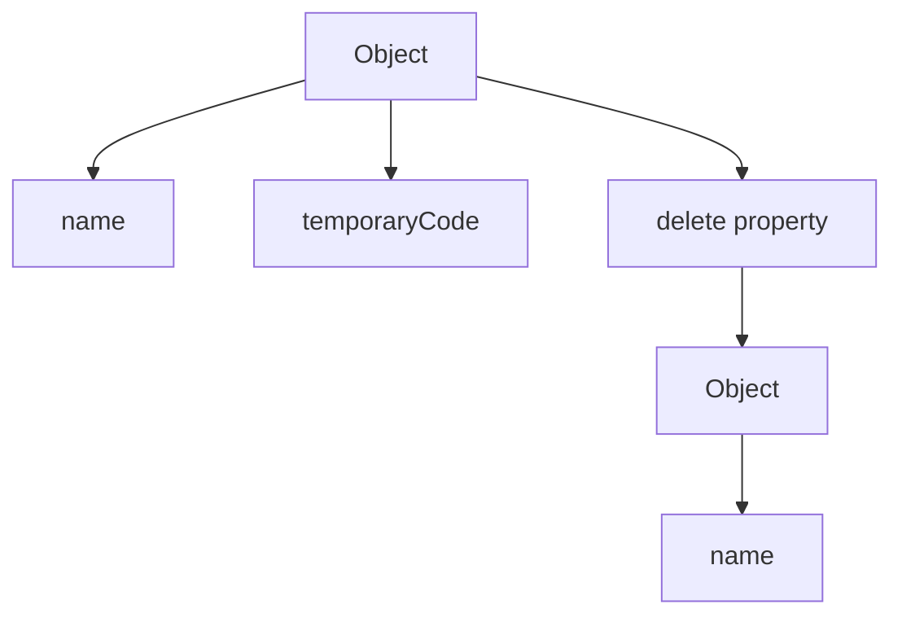

Эта глава не разбирает низкоуровневое поведение памяти или детали performance.

### `in`

`in` checks whether a property is present in an object.

```javascript
const user = {
  name: 'Anna',
};

console.log('name' in user);
console.log('role' in user);
```

`in` схема:

```mermaid
flowchart TD
    N1["property name"]
    N2["in"]
    N3["объект"]
    N4["булев результат"]
    N1 --> N2
    N2 --> N3
    N3 --> N4
```

Результат:

```text
true
false
```

At this level, `in` means:

```text
Does this object have this property available?
```

Prototype-related details will be studied later.

### `instanceof`

`instanceof` checks runtime relationship between object and constructor-like function at a high level.

```javascript
const createdAt = new Date();

console.log(createdAt instanceof Date);
```

`instanceof` схема:

```mermaid
flowchart TD
    N1["объект"]
    N2["instanceof"]
    N3["constructor-like value"]
    N4["булев результат"]
    N1 --> N2
    N2 --> N3
    N3 --> N4
```

Эта глава только вводит оператор. Prototypes, constructors и classes будут изучены позже.

### Operator result

Every operator produces a result.

```mermaid
flowchart TD
    N1["2 + 3"]
    N2["результат: 5"]
    N3["statusCode === 200"]
    N4["результат: true"]
    N5["typeof value"]
    N6["результат: &quot;string&quot;"]
    N1 --> N2
    N1 --> N3
    N3 --> N4
    N3 --> N5
    N5 --> N6
```

Operator result схема:

```mermaid
flowchart TD
    N1["Operation"]
    N2["operands"]
    N3["operator"]
    N4["результат"]
    N1 --> N2
    N1 --> N3
    N1 --> N4
```

This result can be:

```text
stored in variable
passed to function
used in condition
combined with another operator
```

### Operator precedence

When expression has multiple operators, JavaScript needs an order.

```javascript
const result = 2 + 3 * 4;
```

Концептуальная схема приоритета:

```mermaid
flowchart TD
    N1["Expression"]
    N2["2 + 3 * 4"]
    N3["* happens before +"]
    N4["2 + 12"]
    N5["14"]
    N1 --> N2
    N1 --> N3
    N1 --> N4
    N1 --> N5
```

Эта глава не учит таблицы приоритета. Практическое правило пока такое:

```text
If expression is not obvious, use parentheses.
```

```javascript
const result = 2 + (3 * 4);
```

---

## Внутренний механизм

At a conceptual level, an operator is an instruction to the engine:

```mermaid
flowchart TD
    N1["Read operand(s)"]
    N2["Apply operator rules"]
    N3["Produce result"]
    N1 --> N2
    N2 --> N3
```

Complete operator picture:

```mermaid
flowchart TD
    N1["исходный код expression"]
    N2["Engine identifies operator"]
    N3["Engine identifies operands"]
    N4["Engine applies category rules"]
    N5["arithmetic"]
    N6["comparison"]
    N7["logical"]
    N8["assignment"]
    N9["specialized"]
    N10["Engine produces result"]
    N11["Result is used by surrounding code"]
    N1 --> N2
    N2 --> N3
    N3 --> N4
    N4 --> N5
    N4 --> N6
    N4 --> N7
    N4 --> N8
    N4 --> N9
    N4 --> N10
    N10 --> N11
```

Текущее место в модели JavaScript:

```mermaid
flowchart TD
    N1["Values and Types"]
    N2["Primitive Types"]
    N3["Object Type"]
    N4["References"]
    N5["Stack &amp; Heap"]
    N6["Type Conversion"]
    N7["Equality"]
    N8["Program Control"]
    N9["Operators"]
    N1 --> N2
    N1 --> N3
    N1 --> N4
    N1 --> N5
    N1 --> N6
    N1 --> N7
    N1 --> N8
    N8 --> N9
```

Operators — первый шаг к control flow, потому что conditionals зависят от результатов expressions.

Переход к Conditionals:

```mermaid
flowchart TD
    N1["результат оператора"]
    N2["Boolean-like decision"]
    N3["Conditional chooses path"]
    N1 --> N2
    N2 --> N3
```

---

## Ментальная модель

### Калькулятор

Arithmetic operator is like a calculator:

```text
Input:  2 and 3
Action: +
Output: 5
```

### Machine processing входs

```mermaid
flowchart TD
    N1["Input value(s)"]
    N2["Machine: operator"]
    N3["вывести результат"]
    N1 --> N2
    N2 --> N3
```

### Factory conveyor

```mermaid
flowchart TD
    N1["Operand enters conveyor"]
    N2["Operator station transforms it"]
    N3["Result leaves conveyor"]
    N1 --> N2
    N2 --> N3
```

### Recipe step

```mermaid
flowchart TD
    N1["Ingredients"]
    N2["Recipe action"]
    N3["подготовленный результат"]
    N1 --> N2
    N2 --> N3
```

Operator is the recipe action.

### Function-like mental model

An operator is not literally a function in syntax, but it can be imagined like:

```mermaid
flowchart LR
    N1["operator(left, right)"]
    N2["результат"]
    N1 --> N2
```

Пример:

```mermaid
flowchart LR
    N1["(2, 3) through +"]
    N2["5"]
    N1 --> N2
```

This model helps remember:

```text
Operator receives operands and produces result.
```

---

## Примеры кода

Все примеры находятся в:

```text
examples/01-javascript/chapter-17/
```

Запуск:

```bash
node examples/01-javascript/chapter-17/01-arithmetic.js
node examples/01-javascript/chapter-17/02-comparison.js
node examples/01-javascript/chapter-17/03-logical.js
node examples/01-javascript/chapter-17/04-assignment.js
node examples/01-javascript/chapter-17/05-special-operators.js
node examples/01-javascript/chapter-17/06-common-mistakes.js
```

### 01-arithmetic.js

Shows arithmetic operators as calculations.

### 02-comparison.js

Shows comparison operators producing Boolean results.

### 03-logical.js

Shows logical operators combining condition-like значения.

### 04-assignment.js

Shows assignment and assignment update.

### 05-special-operators.js

Shows `typeof`, `delete`, `in` and `instanceof` at a high level.

### 06-common-mistakes.js

Shows unclear precedence and type-related operator mistake.

---

## Частые вопросы

### Is an operator the same as a function?

No. Operator has its own syntax. But as a mental model, it is useful to imagine an action that receives operands and produces result.

### Do all operators return Boolean?

No. Comparison operators often return Boolean. Arithmetic operators return numeric-like results. `typeof` returns string. Assignment returns a value but its main purpose is updating target.

### Should I memorize precedence tables now?

Нет. Эта глава вводит precedence только концептуально. Используйте скобки, когда порядок expression неочевиден.

### Are `delete`, `in` and `instanceof` important for QA?

Yes, but at different levels. `in` helps verify object properties, `typeof` helps debugging, and `instanceof` can help runtime validation. Their deeper mechanics come later.

---

## Распространенные мифы

### Миф: Operators are just symbols

Реальность:

Operators are actions performed on значения.

### Миф: All operators behave like arithmetic

Реальность:

Different categories have different purposes and results.

### Миф: Precedence should always be memorized

Реальность:

Understanding precedence concept is important, but readable code often uses parentheses.

### Миф: `typeof` is a function

Реальность:

`typeof` is an operator.

---

## Типичные ошибки

### Ошибка 1. Ignore operator result

```javascript
200 === 200;
```

This produces `true`, but if result is not used, nothing visible happens.

### Ошибка 2. Mix string and number with `+`

```javascript
const retryCount = '3';
console.log(retryCount + 1);
```

Результат:

```text
31
```

Type Conversion chapter explains why.

### Ошибка 3. Misread precedence

```javascript
const result = 2 + 3 * 4;
```

If not sure, write:

```javascript
const result = 2 + (3 * 4);
```

### Ошибка 4. Use `delete` without understanding object shape

Deleting property changes object structure.

### Ошибка 5. Use `in` as value comparison

`in` checks property presence, not property value.

---

## Практическое использование

Operators appear everywhere:

```javascript
const total = price * count;
const isSuccess = statusCode === 200;
const canRetry = isFailed && retryCount < 3;
retryCount += 1;
const valueType = typeof value;
```

Практический чек-лист чтения:

```text
1. Find the operator.
2. Identify operands.
3. Identify operator category.
4. Ask what operation is being performed.
5. Determine result.
6. Check whether type conversion may be involved.
```

---

## Использование в Automation QA

### Assertions

Assertions are built on comparison results.

```javascript
const isStatusExpected = statusCode === 200;
```

### Conditional checks

Conditionals use results of expressions:

```javascript
const canContinue = isStatusExpected && hasUser;
```

Detailed conditional поведение comes next.

### Response validation

```javascript
const hasId = 'id' in responseBody;
```

`in` checks property presence.

### `typeof` in debugging

```javascript
console.log(typeof responseBody.statusCode);
```

This helps detect `"200"` vs `200`.

### `instanceof` in runtime validation

```javascript
const startedAt = new Date();
console.log(startedAt instanceof Date);
```

Useful at runtime, but detailed constructor/prototype поведение will be studied later.

---

## Итоги

Operators are actions that receive operands and produce results.

```mermaid
flowchart TD
    N1["Operand(s)"]
    N2["Operator"]
    N3["Результат"]
    N1 --> N2
    N2 --> N3
```

Operators относятся к категориям:

```text
Arithmetic
Comparison
Logical
Assignment
Type inspection
Object/property-related
```

Эта глава является обзором. Будущие главы объяснят многие категории подробнее.

The key question:

```text
What operation is being performed?
```

The next chapter uses operator results to explain Conditionals.

---

## Что нужно запомнить

* Operator performs an operation on operands.
* Operand is a value used by operator.
* Every operator produces a result.
* Unary operators work with one operand.
* Binary operators work with two operands.
* Ternary operator works with three operands.
* Operators относятся к категориям.
* Arithmetic operators calculate.
* Comparison operators compare.
* Logical operators combine/evaluate condition-like значения.
* Assignment operators update targets.
* `typeof` inspects type category.
* `delete`, `in` and `instanceof` are specialized operators.
* Precedence определяет порядок, когда в expression несколько operators.
* Используйте скобки, когда порядок expression неочевиден.

---

## Проверьте себя

Ответьте без запуска кода.

1. Что такое operator?
2. Что такое operand?
3. Что такое результат operator?
4. Какая операция выполняется в `2 + 3`?
5. К какой категории относится `===`?
6. К какой категории относится `typeof`?
7. Что проверяет `in`?
8. Что делает `delete` на высоком уровне?
9. Зачем существует precedence?
10. Как operators готовят нас к conditionals?

---

## Практика

Практика находится в файле:

```text
practice/01-javascript/17-operators.md
```

Сначала решайте predict вывод задания без запуска. Главная цель - определить operator, operands, category and result.

---

## Решения

Решения находятся в файле:

```text
solutions/01-javascript/17-operators.md
```

Читайте решения после самостоятельной попытки. Проверяйте reasoning: what operation is being performed?
