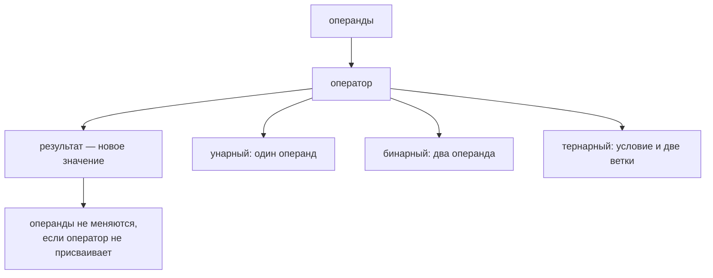

# Операторы

## Связь с предыдущей главой

Предыдущие главы объяснили значения, types, references, conceptual memory model, type conversion and equality.

Теперь начинается новый блок: **Program Control**.

До этого мы изучали, что такое значения and how they compare. Теперь вопрос другой:

> Как JavaScript выполняет операции над значениями?

Начнем с простого выражения:

```javascript
2 + 3
```

Вопрос:

> Что такое `+`?

`2` and `3` are значения. `+` is the action performed on them.

Главный вопрос этой главы:

> Какая операция выполняется?

---

## Предварительные требования

Для этой главы нужно понимать:

* что value is information JavaScript works with;
* что значения have types;
* что type conversion может произойти, когда операция ожидает другой тип;
* что equality operators compare значения;
* что objects contain properties;
* что variables give named access to значения.

Не требуется знать bitwise operators, optional chaining, nullish coalescing, destructuring, spread, rest, precedence tables or short-circuit evaluation details. Эти темы будут изучаться позже.

---

## Время изучения

Ориентировочное время:

```text
Чтение главы:            100-130 минут
Разбор схем:             35-50 минут
Запуск примеров:         20-30 минут
Практика:                90-120 минут
Повторение материала:    25 минут
```

Уровень сложности: **L2-L3**.

Operators выглядят знакомо, потому что `+`, `-`, `=`, `&&`, `typeof` короткие. Но короткий синтаксис не означает простое поведение. Каждый operator performs an operation and produces a result.

---

## Навигация

Предыдущая глава:

```text
docs/01-javascript/16-equality.md
```

Текущая глава:

```text
docs/01-javascript/17-operators.md
```

Следующая глава:

```text
docs/01-javascript/18-conditionals.md
```

Следующая глава объяснит Conditionals: how programs choose different paths based on evaluated results.

---

## Цели обучения

После изучения этой главы вы будете понимать:

* what an operator is;
* what operands are;
* difference between unary, binary and ternary operators;
* why operators are grouped into categories;
* what arithmetic operators do at a high level;
* what comparison operators do;
* what logical operators do at a high level;
* what assignment operators do;
* how `typeof` helps inspect значения;
* what `delete`, `in` and `instanceof` mean at a high level;
* what operator result means;
* why operator precedence exists conceptually;
* how operators appear in Automation QA code.

---

## Мотивация

Посмотрите на выражение:

```javascript
2 + 3
```

Здесь есть значения:

```text
2
3
```

И есть action:

```text
+
```

Диаграмма Operator overview:

```text
операторы
├── по числу операндов: унарные, бинарные, тернарный
└── по задаче: арифметика, сравнение, логика, присваивание, служебные
```

Operators are the language mechanism that transforms, combines and evaluates значения.

Главный вопрос:

> Какая операция выполняется?

---

## Теория

### Оператор, операнд, результат

Не начинайте с синтаксиса. Начните с поведения.

```javascript
const total = 2 + 3;
```

Какая операция выполняется?

```text
Addition.
```

Операнд → оператор → результат:

Оператор получает операнды и производит результат.

### Унарные операторы

Унарный оператор работает с одним операндом.

```javascript
const valueType = typeof 'Anna';
```

Схема унарного оператора:

```text
-x        один операнд
typeof x  один операнд
```

Другие унарные примеры:

```javascript
!true;
-5;
typeof 200;
```

Эта глава не перечисляет все унарные операторы. Она строит модель: у унарного оператора один операнд, и результат зависит только от него.

### Бинарные операторы

Бинарный оператор работает с двумя операндами.

```javascript
const total = 2 + 3;
const isExpected = 200 === 200;
```

Схема бинарного оператора:

```text
a + b     два операнда
a === b   два операнда
```

Сравнение тоже бинарно:

```text
200 === 200   →  два операнда, результат true
200 !== 404   →  два операнда, результат true
```

Сравнение отличается от арифметики только тем, какой результат получается:
не число, а булево значение.

### Тернарный оператор

В JavaScript есть один распространённый тернарный оператор:

```javascript
const label = isActive ? 'active' : 'inactive';
```

Тернарный означает «с тремя операндами».

Схема тернарного оператора:

```text
условие ? значение1 : значение2     три операнда
```

Эта глава только вводит форму. Условные конструкции позже подробно объяснят принятие решений.

### Категории операторов

Операторы группируют по виду выполняемой операции.

Категории операторов:

Какая операция выполняется?

### Арифметические операторы

Арифметические операторы выполняют вычисления над числами.

```javascript
const itemPrice = 100;
const itemCount = 3;
const totalPrice = itemPrice * itemCount;
```

Схема арифметических операторов:

| Оператор | Значение |
| --- | --- |
| `+` | сложение или склейка строк |
| `-`, `*`, `/` | вычитание, умножение, деление |
| `%` | остаток от деления |
| `**` | возведение в степень |

Примеры:

```text
+  addition
-  subtraction
*  multiplication
/  division
%  remainder
```

Эта глава не учит каждый арифметический оператор отдельно. Достаточно ментальной модели:

Если операнды не того типа, может произойти преобразование. Глава про преобразование типов объяснила, почему.

### Операторы сравнения

Операторы сравнения сравнивают значения и дают булев результат.

```javascript
const statusCode = 200;
const isSuccess = statusCode === 200;
```

Схема операторов сравнения:

| Оператор | Значение |
| --- | --- |
| `===`, `!==` | сравнение без приведения типов |
| `==`, `!=` | сравнение с приведением типов |
| `<`, `>`, `<=`, `>=` | сравнение по порядку |

Примеры:

```text
===  strict equality
!==  strict inequality
>    greater than
<    less than
>=   greater than or equal
<=   less than or equal
```

Равенство изучалось в предыдущей главе. Остальные операторы сравнения естественно появятся в условиях и циклах.

### Логические операторы

Логические операторы работают со значениями, используемыми как логические решения.

```javascript
const isStatusOk = statusCode === 200;
const hasUser = true;
const canContinue = isStatusOk && hasUser;
```

Схема логических операторов:

| Оператор | Результат |
| --- | --- |
| `&&` | первое ложное значение или последнее |
| `\|\|` | первое истинное значение или последнее |
| `!` | логическое отрицание |

Распространённые логические операторы:

```text
&&  AND
||  OR
!   NOT
```

Эта глава не разбирает детали короткого замыкания. Они будут объяснены позже, когда понадобятся в условиях.

На этом уровне:

```text
&& combines conditions
|| combines alternatives
!  negates a condition-like value
```

### Операторы присваивания

Операторы присваивания сохраняют или обновляют значения через имена и свойства.

```javascript
let retryCount = 0;
retryCount = 1;
```

Схема операторов присваивания:

| Оператор | Эквивалент |
| --- | --- |
| `=` | присвоить |
| `+=` | `a = a + b` |
| `??=` | присвоить, если `null` или `undefined` |

Существуют и другие формы присваивания:

```javascript
retryCount += 1;
```

На высоком уровне:

Подробные варианты операторов будут изучаться по мере необходимости.

### `typeof`

`typeof` — унарный оператор, который возвращает строку с названием категории типа.

```javascript
console.log(typeof 200);
console.log(typeof 'Anna');
console.log(typeof true);
```

`typeof` схема:

```text
typeof 'a'      →  'string'
typeof 42       →  'number'
typeof undefined →  'undefined'
```

В автоматизации тестов `typeof` используют для разбора неожиданных значений из API:

```javascript
const statusCode = '200';

console.log(typeof statusCode);
```

Результат:

```text
string
```

### `delete`

`delete` на высоком уровне удаляет свойство из объекта.

```javascript
const user = {
  name: 'Anna',
  temporaryCode: '1234',
};

delete user.temporaryCode;
```

`delete` схема:

```text
delete user.role  →  свойство удалено из объекта
```

Эта глава не разбирает низкоуровневое поведение памяти и вопросы производительности.

### `in`

`in` проверяет, есть ли у объекта свойство с таким именем.

```javascript
const user = {
  name: 'Anna',
};

console.log('name' in user);
console.log('role' in user);
```

`in` схема:

```text
'role' in user  →  есть ли такое свойство
```

Результат:

```text
true
false
```

На этом уровне `in` означает:

```text
Does this object have this property available?
```

Детали, связанные с прототипами, будут изучаться позже.

### `instanceof`

`instanceof` на высоком уровне проверяет связь между объектом и функцией-конструктором во время выполнения.

```javascript
const createdAt = new Date();

console.log(createdAt instanceof Date);
```

`instanceof` схема:

```text
value instanceof Error  →  создан ли объект этим классом
```

Эта глава только вводит оператор. Прототипы, конструкторы и классы будут изучены позже.

### Результат оператора

Каждый оператор производит результат.

Схема результата оператора:

```text
любой оператор  →  выражение  →  значение
```

Этот результат может быть:

```text
stored in variable
passed to function
used in condition
combined with another operator
```

### Приоритет операторов

Когда в выражении несколько операторов, JavaScript нужен порядок.

```javascript
const result = 2 + 3 * 4;
```

Концептуальная схема приоритета:

```text
1 + 2 * 3   →  умножение выполняется раньше  →  7
(1 + 2) * 3 →  скобки меняют порядок         →  9
```

Эта глава не учит таблицы приоритета. Практическое правило пока такое:

```text
If expression is not obvious, use parentheses.
```

```javascript
const result = 2 + (3 * 4);
```

---

Оператор получает операнды и порождает новое значение:


```mermaid
flowchart TD
    A["операнды"] --> B["оператор"]
    B --> C["результат — новое значение"]
    B --> D["унарный: один операнд"]
    B --> E["бинарный: два операнда"]
    B --> F["тернарный: условие и две ветки"]
    C --> G["операнды не меняются,<br/>если оператор не присваивает"]
```

## Внутренний механизм

На концептуальном уровне оператор — это указание движку выполнить одно
конкретное действие над значениями и вернуть результат.

```text
5 + 3
│ │ │
│ │ └─ операнд
│ └─── оператор: указание «сложить»
└───── операнд
результат: 8 — новое значение, которое можно использовать дальше
```

Полная картина операторов главы:

| Группа | Примеры | Что даёт |
| --- | --- | --- |
| арифметические | `+`, `-`, `*`, `/`, `%` | число |
| сравнения | `<`, `>`, `===`, `!==` | булево значение |
| логические | `&&`, `\|\|`, `!` | значение одного из операндов |
| присваивания | `=`, `+=` | записывает и возвращает значение |

Операторы — первый шаг к управлению потоком, потому что условные конструкции зависят от результатов выражений.

---

## Ментальная модель

### Калькулятор

Арифметический оператор похож на калькулятор:

```text
Input:  2 and 3
Action: +
Output: 5
```

### Станок, обрабатывающий вход

Оператор похож на станок: у него есть вход, одно действие и выход. Станок не
помнит предыдущие детали и не зависит от того, откуда пришёл вход — только от
самих значений.

```text
вход:     'qa-' и 'user'
действие: +
выход:    'qa-user'
```

### Заводской конвейер

Выражение — это цепочка станков: выход одного становится входом следующего.

```text
2 + 3 * 4

3 * 4   →  12        первый станок
2 + 12  →  14        второй станок
```

Порядок станков на конвейере задают приоритет операторов и скобки.

### Шаг рецепта

Оператор — это действие из рецепта.

### Модель «оператор как функция»

Оператор не является функцией синтаксически, но его можно представить так:

Например, `a === b || c === d` читается однозначно, а `a === b || c && d` уже требует знания приоритетов — и скобки здесь дешевле памяти.

Эта модель помогает запомнить:

```text
Operator receives operands and produces result.
```

---

## Примеры кода

Все примеры находятся в:

```text
examples/01-javascript/chapter-17/
```

Запуск:

```bash
node examples/01-javascript/chapter-17/01-arithmetic.js
node examples/01-javascript/chapter-17/02-comparison.js
node examples/01-javascript/chapter-17/03-logical.js
node examples/01-javascript/chapter-17/04-assignment.js
node examples/01-javascript/chapter-17/05-special-operators.js
node examples/01-javascript/chapter-17/06-common-mistakes.js
```

### 01-arithmetic.js

Показывает арифметические операторы как вычисления.

### 02-comparison.js

Показывает операторы сравнения, дающие булев результат.

### 03-logical.js

Показывает логические операторы, объединяющие значения-условия.

### 04-assignment.js

Показывает присваивание и обновление значения.

### 05-special-operators.js

Показывает `typeof`, `delete`, `in` и `instanceof` на высоком уровне.

### 06-common-mistakes.js

Показывает неочевидный приоритет и ошибку, связанную с типами.

---

## Частые вопросы

### Оператор — это то же самое, что функция?

Нет. У оператора свой синтаксис. Но как мысленная модель полезно представлять действие, которое получает операнды и даёт результат.

### Все ли операторы возвращают булево значение?

Нет. Операторы сравнения часто возвращают булево значение. Арифметические дают числовой результат. `typeof` возвращает строку. Присваивание возвращает значение, но его главная задача — обновить цель.

### Нужно ли сейчас заучивать таблицы приоритетов?

Нет. Эта глава вводит приоритет только концептуально. Используйте скобки, когда порядок вычисления неочевиден.

### Важны ли `delete`, `in` и `instanceof` для автоматизации тестов?

Да, но по-разному. `in` помогает проверять свойства объекта, `typeof` — разбирать неожиданные значения, а `instanceof` — проверять тип во время выполнения. Их устройство разбирается позже.

---

## Распространённые мифы

### Миф: операторы — это просто символы

Реальность:

Операторы — это действия над значениями.

### Миф: все операторы ведут себя как арифметические

Реальность:

У разных категорий разные назначения и результаты.

### Миф: приоритет нужно всегда заучивать

Реальность:

Понимать идею приоритета важно, но читаемый код чаще использует скобки.

### Миф: `typeof` — это функция

Реальность:

`typeof` — это оператор.

---

## Распространённые ошибки

### Ошибка 1. Не использовать результат оператора

```javascript
200 === 200;
```

Это даёт `true`, но если результат не использован, ничего видимого не происходит.

### Ошибка 2. Смешивать строку и число через `+`

```javascript
const retryCount = '3';
console.log(retryCount + 1);
```

Результат:

```text
31
```

Глава про преобразование типов объясняет, почему.

### Ошибка 3. Неверно прочитать приоритет

```javascript
const result = 2 + 3 * 4;
```

Если не уверены, пишите так:

```javascript
const result = 2 + (3 * 4);
```

### Ошибка 4. Использовать `delete`, не понимая структуру объекта

Удаление свойства меняет структуру объекта.

### Ошибка 5. Использовать `in` как сравнение значений

`in` проверяет наличие свойства, а не его значение.

---

## Практическое использование

Операторы встречаются повсюду:

```javascript
const total = price * count;
const isSuccess = statusCode === 200;
const canRetry = isFailed && retryCount < 3;
retryCount += 1;
const valueType = typeof value;
```

Практический чек-лист чтения:

```text
1. Find the operator.
2. Identify operands.
3. Identify operator category.
4. Ask what operation is being performed.
5. Determine result.
6. Check whether type conversion may be involved.
```

---

## Использование в Automation QA

### Проверки

Проверки строятся на результатах сравнения.

```javascript
const isStatusExpected = statusCode === 200;
```

### Условные проверки

Условные конструкции используют результаты выражений:

```javascript
const canContinue = isStatusExpected && hasUser;
```

Подробное поведение условий разбирается дальше.

### Проверка ответа

```javascript
const hasId = 'id' in responseBody;
```

`in` проверяет наличие свойства.

### `typeof` при отладке

```javascript
console.log(typeof responseBody.statusCode);
```

Это помогает заметить `"200"` вместо `200`.

### `instanceof` при проверке во время выполнения

```javascript
const startedAt = new Date();
console.log(startedAt instanceof Date);
```

Полезно во время выполнения, но подробное поведение конструкторов и прототипов будет изучаться позже.

---

## Итоги

Операторы — действия, которые получают операнды и дают результат.

Операторы делятся на категории:

```text
Arithmetic
Comparison
Logical
Assignment
Type inspection
Object/property-related
```

Эта глава является обзором. Будущие главы объяснят многие категории подробнее.

Ключевой вопрос:

```text
What operation is being performed?
```

Следующая глава использует результаты операторов, чтобы объяснить условные конструкции.

---

## Что нужно запомнить

* Оператор выполняет операцию над операндами.
* Операнд — значение, которое использует оператор.
* Каждый оператор производит результат.
* Унарные операторы работают с одним операндом.
* Бинарные операторы работают с двумя операндами.
* Тернарный оператор работает с тремя операндами.
* Операторы делятся на категории.
* Арифметические операторы вычисляют.
* Операторы сравнения сравнивают.
* Логические операторы объединяют и вычисляют значения-условия.
* Операторы присваивания обновляют цель.
* `typeof` сообщает категорию типа.
* `delete`, `in` и `instanceof` — специализированные операторы.
* Приоритет определяет порядок, когда в выражении несколько операторов.
* Используйте скобки, когда порядок вычисления неочевиден.

---

## Проверьте себя

Ответьте без запуска кода.

1. Что такое оператор?
2. Что такое операнд?
3. Что такое результат оператора?
4. Какая операция выполняется в `2 + 3`?
5. К какой категории относится `===`?
6. К какой категории относится `typeof`?
7. Что проверяет `in`?
8. Что делает `delete` на высоком уровне?
9. Зачем существует приоритет операторов?
10. Как операторы готовят нас к условным конструкциям?

### Ответы

1. Знак или слово, обозначающее операцию над значениями: сложение, сравнение, проверку типа.
2. Значение, над которым выполняется операция. У `a + b` два операнда, у `typeof a` — один.
3. Новое значение, которое операция возвращает. Операнды при этом не меняются.
4. Сложение двух чисел, результат — новое число `5`.
5. К операторам сравнения: он проверяет равенство и возвращает булево значение.
6. К унарным операторам: у него один операнд, а результат — строка с названием типа.
7. Есть ли свойство с таким именем у объекта, включая унаследованные по цепочке прототипов.
8. Удаляет свойство из объекта. После этого чтение по тому же имени даёт `undefined`.
9. Приоритет задаёт порядок, в котором применяются операторы в одном выражении. Без него `2 + 3 * 4` не имело бы однозначного значения.
10. Операторы сравнения дают булево значение, а условная конструкция — это место, где такое значение используется для выбора ветки выполнения.

---

## Практика

Практика находится в файле:

```text
practice/01-javascript/17-operators.md
```

Сначала решайте задания на предсказание вывода без запуска. Главная цель — определить оператор, операнды, категорию и результат.

---

## Решения

Решения находятся в файле:

```text
solutions/01-javascript/17-operators.md
```

Читайте решения после самостоятельной попытки. Проверяйте рассуждение: какая операция выполняется?
