# Conditionals

## Связь с предыдущей главой

Предыдущая глава объяснила operators.

Operators receive operands and produce results:

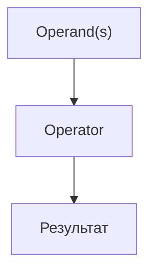

Теперь появляется следующий вопрос:

> Что программа может сделать с этими результатами?

Например, API вернул:

```javascript
const statusCode = 500;
```

Тест должен решить:

```text
Should the test continue?
Should it stop?
Should it report server error?
```

JavaScript не угадывает. Program evaluates an expression first, then chooses an execution path.

Главный вопрос этой главы:

> Какое решение принимает программа?

---

## Предварительные требования

Для этой главы нужно понимать:

* что значения have types;
* что comparison operators produce Boolean results;
* что logical operators combine condition-like значения;
* что truthy and falsy значения exist;
* что expressions produce results;
* что operators are actions performed on operands.

Не требуется знать ternary operator in depth, short-circuit evaluation, nullish coalescing, optional chaining, pattern matching or advanced switch поведение. Эти темы будут изучаться позже.

---

## Время изучения

Ориентировочное время:

```text
Чтение главы:            100-130 минут
Разбор схем:             35-50 минут
Запуск примеров:         20-30 минут
Практика:                90-120 минут
Повторение материала:    25 минут
```

Уровень сложности: **L2-L3**.

Conditionals выглядят как простая синтаксическая тема, но на практике ошибки возникают из-за неверного понимания evaluated result and selected path.

---

## Навигация

Предыдущая глава:

```text
docs/01-javascript/17-operators.md
```

Текущая глава:

```text
docs/01-javascript/18-conditionals.md
```

Следующая глава:

```text
docs/01-javascript/19-loops.md
```

Следующая глава ответит:

> Что если одно и то же решение нужно принимать много раз?

---

## Цели обучения

После изучения этой главы вы будете понимать:

* why conditionals exist;
* how Boolean decision making works;
* how `if` chooses a path;
* how `else` provides alternative path;
* how `else if` builds a decision chain;
* why nested conditions should be used carefully;
* how `switch` works at a high level;
* what default branch means;
* how readable conditional logic is written;
* how conditionals are used in Automation QA.

---

## Мотивация

Начнем с реального решения.

API returned:

```javascript
const statusCode = 500;
```

Вопрос:

```text
Should the test continue?
```

The program needs a decision:

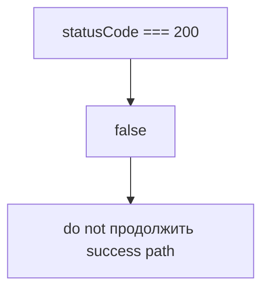

Decision overview:

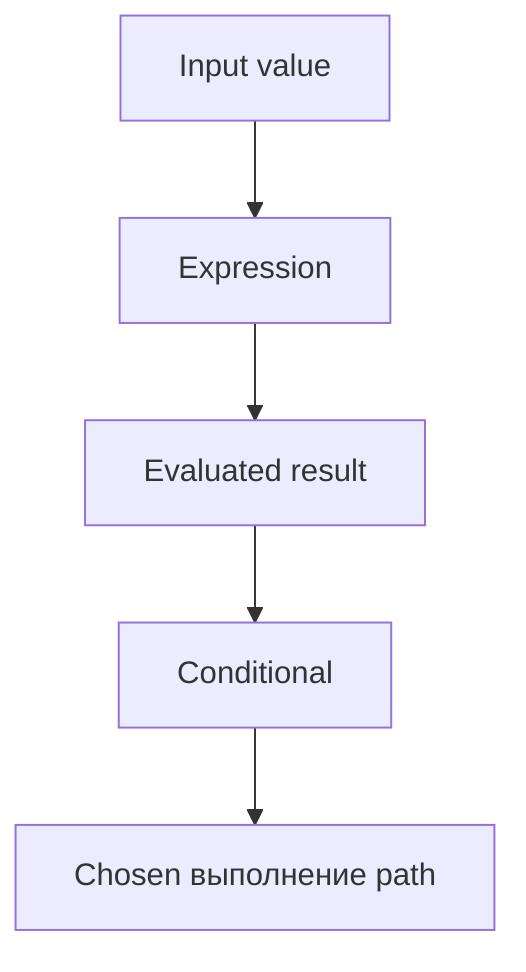

Programs do not guess:

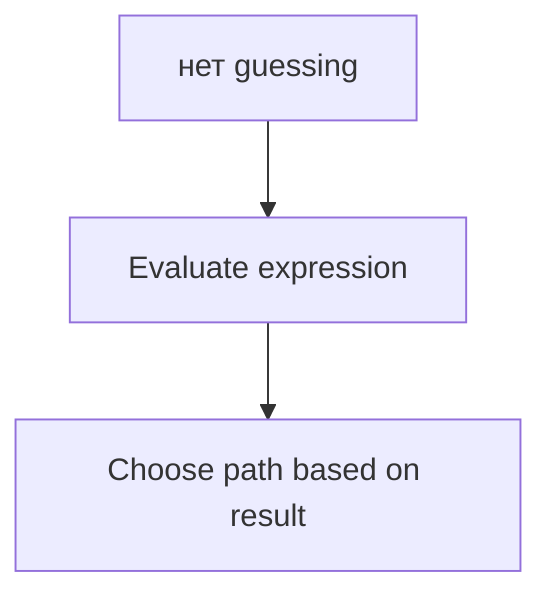

Главный вопрос:

> Какое решение принимает программа?

---

## Теория

### Зачем существуют conditionals

Without conditionals, program would execute every line in the same order.

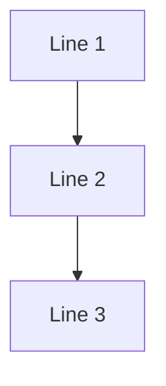

But real programs need decisions:

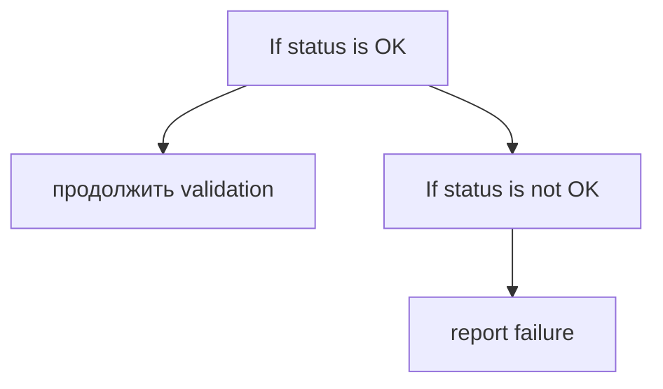

Conditionals существуют, потому что программам нужно выбирать пути выполнения.

Decision tree:

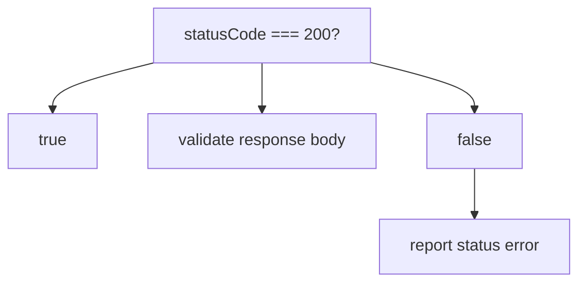

### Expression → Boolean

Condition usually starts with expression.

```javascript
const statusCode = 500;
const isSuccess = statusCode === 200;
```

Expression → Boolean:

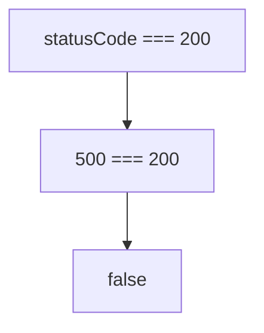

Operator → Условие:

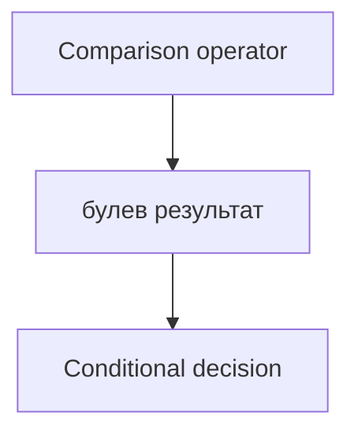

Какое решение принимает программа?

```text
Is statusCode equal to expected success code?
```

### `if`

`if` выполняет block только когда результат condition это позволяет.

```javascript
const statusCode = 200;

if (statusCode === 200) {
  console.log('Status is OK');
}
```

`if` схема:

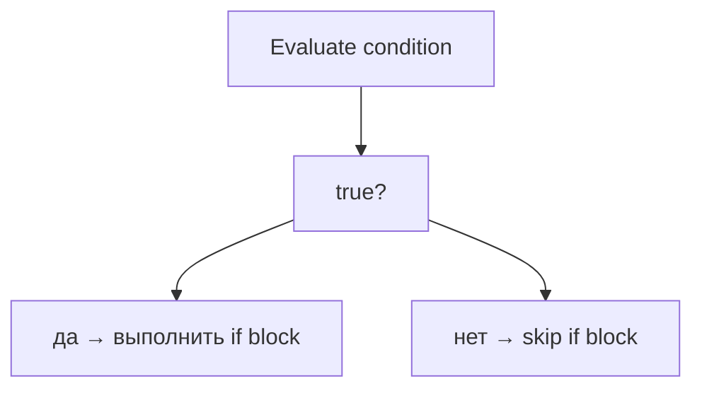

Execution path:

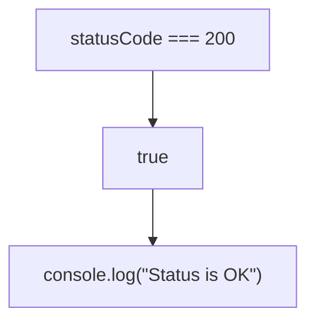

### `if / else`

`else` provides an alternative path.

```javascript
const statusCode = 500;

if (statusCode === 200) {
  console.log('Status is OK');
} else {
  console.log('Status is not OK');
}
```

`if / else` схема:

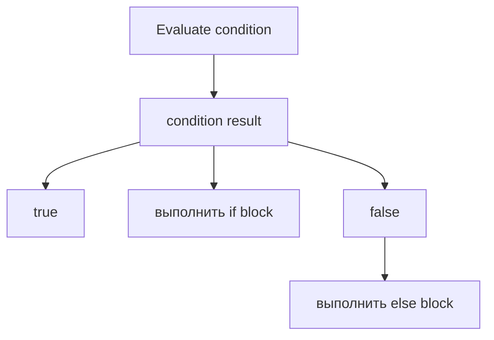

Exactly one path is chosen.

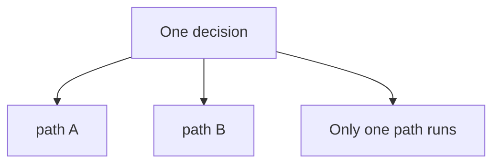

### `else if`

`else if` creates a decision chain.

```javascript
const statusCode = 404;

if (statusCode === 200) {
  console.log('Success');
} else if (statusCode === 404) {
  console.log('Not found');
} else if (statusCode >= 500) {
  console.log('Server error');
} else {
  console.log('Unexpected status');
}
```

`else if` chain:

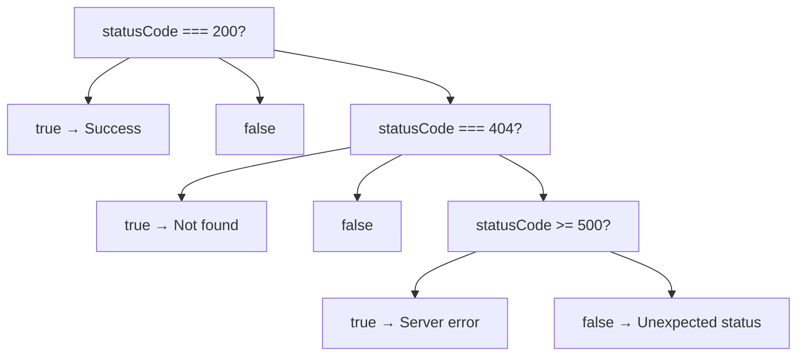

Какое решение принимает программа?

```text
Which status category does this response belong to?
```

### Nested conditions

Nested condition means condition inside another condition.

```javascript
const statusCode = 200;
const hasUserId = true;

if (statusCode === 200) {
  if (hasUserId) {
    console.log('Valid user response');
  }
}
```

Nested conditions схема:

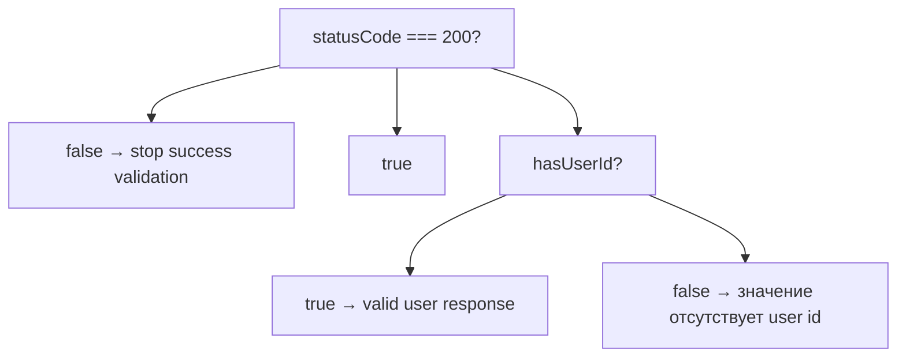

Вложенные условия полезны, когда второе решение имеет смысл только внутри первого.

Предупреждение о читаемости:

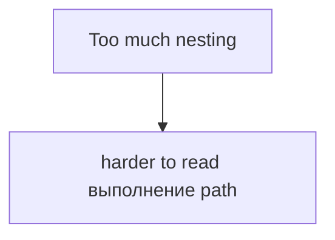

### `switch` overview

`switch` chooses branch based on one expression value.

```javascript
const environment = 'staging';

switch (environment) {
  case 'local':
    console.log('Use local URL');
    break;
  case 'staging':
    console.log('Use staging URL');
    break;
  default:
    console.log('Use production URL');
}
```

Switch overview:

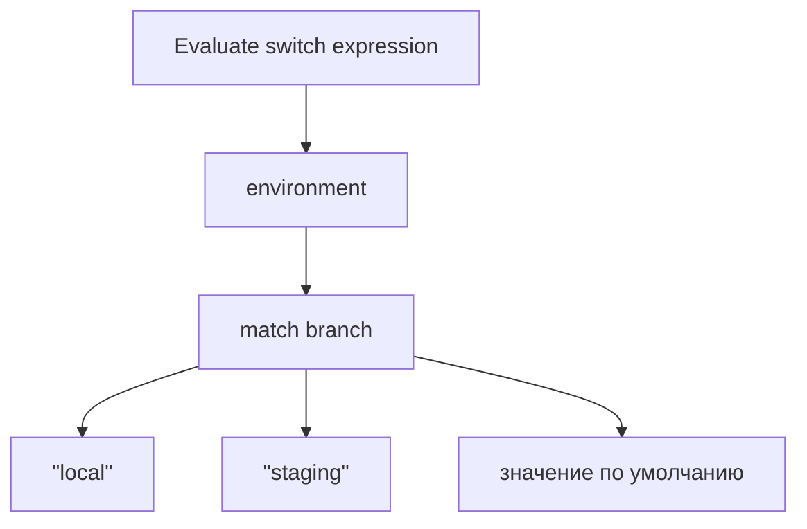

Switch branches:

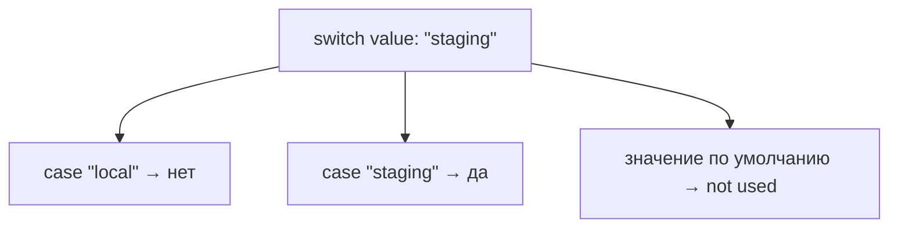

Эта глава оставляет `switch` на высоком уровне. Продвинутое поведение switch будет изучено позже при необходимости.

### Default branch

`default` is fallback branch.

Default branch схема:

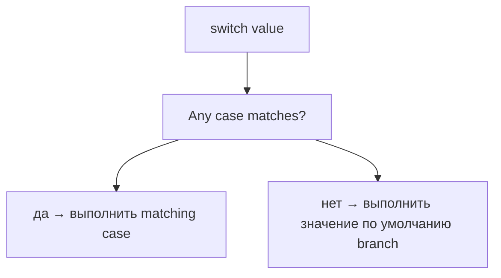

Default branch полезна, когда программа должна обработать неожиданные значения:

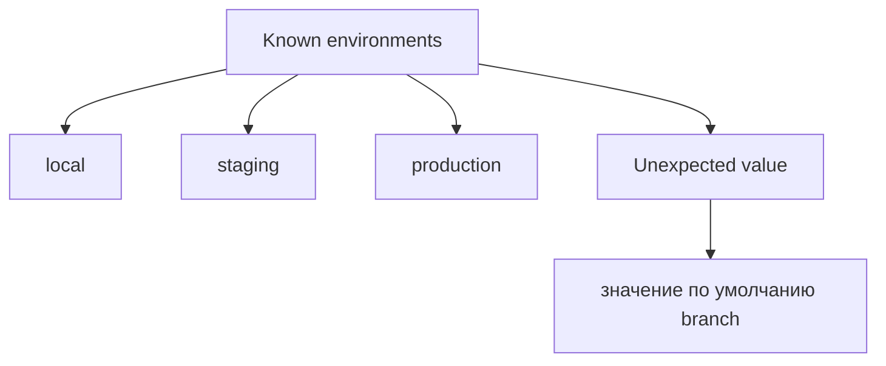

### Choosing execution path

Conditional execution means:

```mermaid
flowchart TD
    N1["Evaluate first"]
    N2["Choose second"]
    N3["Execute selected path third"]
    N1 --> N2
    N2 --> N3
```

Execution path схема:

```mermaid
flowchart TD
    N1["Start"]
    N2["Evaluate condition"]
    N3["Choose path"]
    N4["path A"]
    N5["path B"]
    N6["продолжить after conditional"]
    N1 --> N2
    N2 --> N3
    N3 --> N4
    N3 --> N5
    N3 --> N6
```

Program does not run all branches in one decision.

### Readable conditional logic

Readable conditional answers one clear question.

Poor readability:

```javascript
if (statusCode === 200 && hasUserId && !isDeleted && responseTimeMs < 500) {
  console.log('Valid');
}
```

More readable:

```javascript
const isStatusOk = statusCode === 200;
const hasValidUser = hasUserId && !isDeleted;
const isFastEnough = responseTimeMs < 500;

if (isStatusOk && hasValidUser && isFastEnough) {
  console.log('Valid');
}
```

Пример читаемости:

```mermaid
flowchart TD
    N1["Named expressions"]
    N2["explain decisions"]
    N3["reduce mental load"]
    N4["make QA intent visible"]
    N1 --> N2
    N1 --> N3
    N1 --> N4
```

Short-circuit evaluation details will be studied later. Here the goal is readable decision-making.

---

## Внутренний механизм

На концептуальном уровне:

```mermaid
flowchart TD
    N1["Conditional statement"]
    N2["Evaluate expression"]
    N3["Convert/evaluate result as decision"]
    N4["Choose выполнение path"]
    N5["Execute selected block"]
    N6["продолжить program"]
    N1 --> N2
    N2 --> N3
    N3 --> N4
    N4 --> N5
    N5 --> N6
```

Complete conditional picture:

```mermaid
flowchart TD
    N1["Input data"]
    N2["Expression"]
    N3["Результат"]
    N4["Conditional"]
    N5["if"]
    N6["else"]
    N7["else if"]
    N8["switch"]
    N9["Chosen path"]
    N10["Executed statements"]
    N1 --> N2
    N2 --> N3
    N3 --> N4
    N4 --> N5
    N4 --> N6
    N4 --> N7
    N4 --> N8
    N4 --> N9
    N9 --> N10
```

Текущее место в модели JavaScript:

```mermaid
flowchart TD
    N1["Operators"]
    N2["получить результатs"]
    N3["Conditionals"]
    N4["choose выполнение path based on result"]
    N1 --> N2
    N1 --> N3
    N3 --> N4
```

Переход к Loops:

```mermaid
flowchart TD
    N1["Conditional"]
    N2["makes one decision"]
    N3["Loop"]
    N4["repeats decisions/actions many times"]
    N1 --> N2
    N1 --> N3
    N3 --> N4
```

---

## Ментальная модель

### Railway switch

```mermaid
flowchart TD
    N1["Train arrives"]
    N2["Switch position"]
    N3["left track"]
    N4["right track"]
    N1 --> N2
    N2 --> N3
    N2 --> N4
```

Conditional is the switch. Expression result sets the direction.

### Crossroads

```mermaid
flowchart TD
    N1["Crossroads"]
    N2["go left"]
    N3["go right"]
    N4["go straight"]
    N1 --> N2
    N1 --> N3
    N1 --> N4
```

Program reaches decision point and chooses one route.

### Traffic light

```mermaid
flowchart TD
    N1["green → продолжить"]
    N2["yellow → caution"]
    N3["red → stop"]
    N1 --> N2
    N2 --> N3
```

Status code decision is similar:

```mermaid
flowchart TD
    N1["200 → продолжить"]
    N2["404 → report not found"]
    N3["500 → report server error"]
    N1 --> N2
    N2 --> N3
```

### Decision tree

```mermaid
flowchart TD
    N1["Question 1"]
    N2["да → Question 2"]
    N3["нет → Alternative path"]
    N1 --> N2
    N1 --> N3
```

### Security checkpoint

```mermaid
flowchart TD
    N1["Has valid badge?"]
    N2["да → enter"]
    N3["нет → reject"]
    N1 --> N2
    N1 --> N3
```

Programs do not guess. They check a result and choose path.

---

## Примеры кода

Все примеры находятся в:

```text
examples/01-javascript/chapter-18/
```

Запуск:

```bash
node examples/01-javascript/chapter-18/01-if.js
node examples/01-javascript/chapter-18/02-if-else.js
node examples/01-javascript/chapter-18/03-else-if.js
node examples/01-javascript/chapter-18/04-switch.js
node examples/01-javascript/chapter-18/05-nested.js
node examples/01-javascript/chapter-18/06-common-mistakes.js
```

### 01-if.js

Shows one success path.

### 02-if-else.js

Shows success path and failure path.

### 03-else-if.js

Shows status code decision chain.

### 04-switch.js

Shows environment selection.

### 05-nested.js

Shows nested response validation.

### 06-common-mistakes.js

Shows assignment inside condition mistake.

---

## Частые вопросы

### Does JavaScript randomly choose a branch?

No. It evaluates expression first, then chooses path based on result.

### Does every condition have to be Boolean?

Condition is evaluated as a decision. Boolean значения are clearest. Truthy/falsy поведение exists, but explicit Boolean expressions are usually more readable.

### Should I avoid nested conditions?

Не всегда. Используйте вложенность, когда внутреннее решение имеет смысл только внутри внешнего. Избегайте глубокой вложенности, когда named expressions или ранняя структура читаются понятнее.

### Is `switch` better than `else if`?

Не всегда. `switch` полезен, когда одно значение сравнивается с несколькими известными cases. `else if` гибче для разных expressions.

### Is ternary a conditional?

It is conditional expression syntax, but this chapter does not teach ternary in depth. It will be used later where appropriate.

---

## Распространенные мифы

### Миф: `if` checks a line of code

Реальность:

`if` evaluates an expression result.

### Миф: All branches run and JavaScript chooses вывод

Реальность:

Only selected path runs.

### Миф: More nesting means more precise code

Реальность:

More nesting often makes decision path harder to read.

### Миф: `switch` is only old syntax

Реальность:

`switch` is useful for choosing among known cases of one value.

Схема типичных ошибок:

```mermaid
flowchart TD
    N1["Mistake"]
    N2["unclear condition"]
    N3["assignment instead of comparison"]
    N4["значение отсутствует значение по умолчанию path"]
    N5["deeply nested logic"]
    N1 --> N2
    N1 --> N3
    N1 --> N4
    N1 --> N5
```

---

## Типичные ошибки

### Ошибка 1. Assignment вместо comparison

```javascript
let statusCode = 500;

if (statusCode = 200) {
  console.log('Success');
}
```

This updates `statusCode` вместо comparing it.

Правильно:

```javascript
if (statusCode === 200) {
  console.log('Success');
}
```

### Ошибка 2. Unclear truthy/falsy condition

```javascript
if (responseBody.id) {
  console.log('Has id');
}
```

Если `id` может быть `0`, это condition может вводить в заблуждение. Используйте явные проверки, когда это нужно.

### Ошибка 3. Missing `else`

If failure path matters, write it.

```javascript
if (statusCode === 200) {
  console.log('Success');
} else {
  console.log('Unexpected status');
}
```

### Ошибка 4. Deep nesting

```mermaid
flowchart TD
    N1["if"]
    N2["if"]
    N3["if"]
    N4["if"]
    N1 --> N2
    N2 --> N3
    N3 --> N4
```

Hard to read, hard to debug.

### Ошибка 5. Missing `default` in switch

If unexpected value is possible, default branch makes поведение explicit.

---

## Практическое использование

Conditionals используются, когда программе нужно выбрать:

```text
Continue or stop
Retry or fail
Use staging or production config
Validate body or report status error
Run assertion A or assertion B
```

Практический чек-лист чтения:

```text
1. What decision is being made?
2. What expression is evaluated?
3. What result does expression produce?
4. Which path is chosen?
5. What happens after the conditional?
```

---

## Использование в Automation QA

### Status code validation

```javascript
if (statusCode === 200) {
  console.log('Validate response body');
} else {
  console.log('Report status error');
}
```

QA decision example:

```mermaid
flowchart TD
    N1["statusCode === 200?"]
    N2["true → validate body"]
    N3["false → report status error"]
    N1 --> N2
    N1 --> N3
```

### Retry logic

```javascript
if (statusCode >= 500) {
  console.log('Retry may be needed');
}
```

Full retry loops will be studied in the next chapter.

### Environment selection

```javascript
switch (environment) {
  case 'local':
    console.log('Local config');
    break;
  case 'staging':
    console.log('Staging config');
    break;
  default:
    console.log('Production config');
}
```

### Skipping tests

На высоком уровне:

```mermaid
flowchart TD
    N1["feature enabled?"]
    N2["да → run test"]
    N3["нет → skip or report unavailable"]
    N1 --> N2
    N1 --> N3
```

Framework-specific skipping will be studied later.

### Choosing assertions

```javascript
if (responseType === 'user') {
  console.log('Assert user fields');
} else {
  console.log('Assert generic response');
}
```

---

## Итоги

Conditionals answer:

```text
What can a program do with operator results?
```

Основная модель:

```text
Expression produces a result.
Conditional evaluates that result.
Exactly one execution path is chosen.
```

Main forms:

```text
if
if / else
else if chain
nested conditions
switch
default branch
```

The next chapter, Loops, отвечает:

```text
What if the same decision has to be made many times?
```

---

## Что нужно запомнить

* Conditional execution starts with evaluated expression.
* Program does not guess.
* `if` выполняет block, когда выбран путь condition.
* `else` provides alternative path.
* `else if` builds decision chain.
* Nested conditions represent decisions inside decisions.
* `switch` chooses among cases for one value.
* `default` handles fallback path.
* Exactly one path is chosen in one `if / else` decision.
* Readable conditions use clear names and explicit intent.
* Conditionals are central to Automation QA decisions.

---

## Проверьте себя

Ответьте без запуска кода.

1. Почему существуют conditionals?
2. Что происходит до того, как JavaScript выбирает ветку?
3. Что делает `if`?
4. Что добавляет `else`?
5. When is `else if` useful?
6. When is nesting useful?
7. Что вычисляет `switch`?
8. Что такое `default` branch?
9. Почему conditions должны быть читаемыми?
10. Как эта глава ведёт к Loops?

---

## Практика

Практика находится в файле:

```text
practice/01-javascript/18-conditionals.md
```

Сначала отвечайте без запуска там, где нужно predict вывод. Главная цель - определить evaluated expression and chosen path.

---

## Решения

Решения находятся в файле:

```text
solutions/01-javascript/18-conditionals.md
```

Читайте решения после самостоятельной попытки. Проверяйте reasoning: what decision is the program making?
