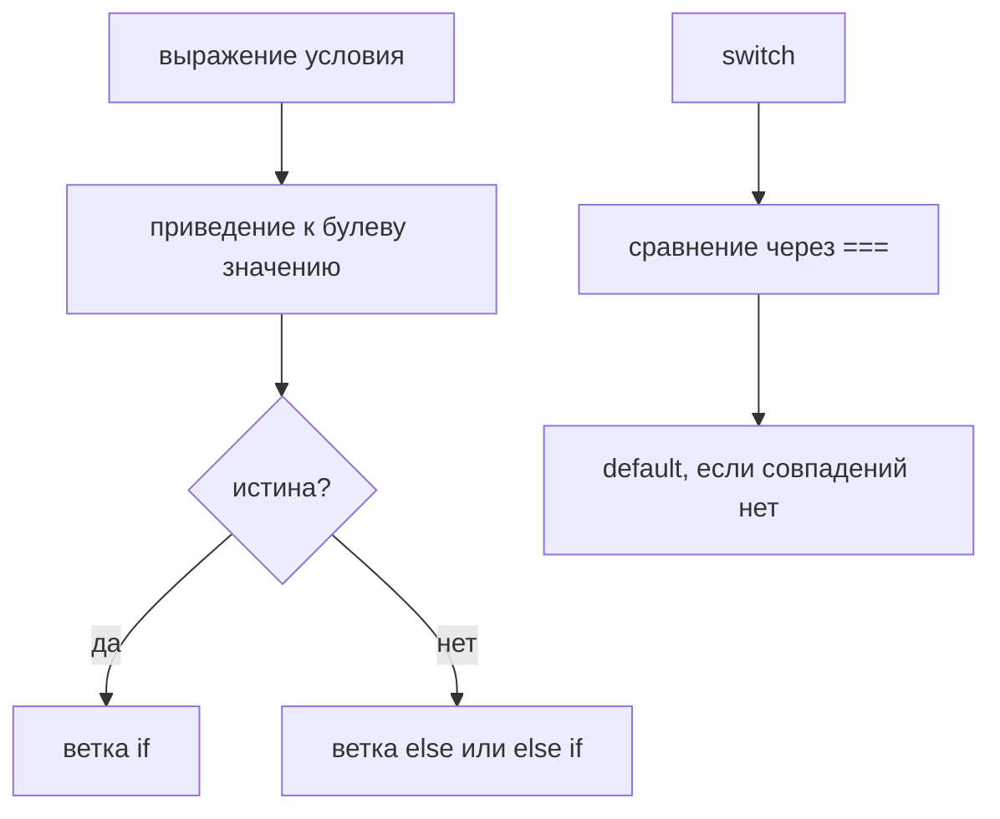

# Conditionals

## Связь с предыдущей главой

Предыдущая глава объяснила operators.

Operators receive operands and produce results:

Теперь появляется следующий вопрос:

> Что программа может сделать с этими результатами?

Например, API вернул:

```javascript
const statusCode = 500;
```

Тест должен решить:

```text
Should the test continue?
Should it stop?
Should it report server error?
```

JavaScript не угадывает. Program evaluates an expression first, then chooses an execution path.

Главный вопрос этой главы:

> Какое решение принимает программа?

---

## Предварительные требования

Для этой главы нужно понимать:

* что значения have types;
* что comparison operators produce Boolean results;
* что logical operators combine condition-like значения;
* что truthy and falsy значения exist;
* что expressions produce results;
* что operators are actions performed on operands.

Не требуется знать ternary operator in depth, short-circuit evaluation, nullish coalescing, optional chaining, pattern matching or advanced switch поведение. Эти темы будут изучаться позже.

---

## Время изучения

Ориентировочное время:

```text
Чтение главы:            100-130 минут
Разбор схем:             35-50 минут
Запуск примеров:         20-30 минут
Практика:                90-120 минут
Повторение материала:    25 минут
```

Уровень сложности: **L2-L3**.

Conditionals выглядят как простая синтаксическая тема, но на практике ошибки возникают из-за неверного понимания evaluated result and selected path.

---

## Навигация

Предыдущая глава:

```text
docs/01-javascript/17-operators.md
```

Текущая глава:

```text
docs/01-javascript/18-conditionals.md
```

Следующая глава:

```text
docs/01-javascript/19-loops.md
```

Следующая глава ответит:

> Что если одно и то же решение нужно принимать много раз?

---

## Цели обучения

После изучения этой главы вы будете понимать:

* why conditionals exist;
* how Boolean decision making works;
* how `if` chooses a path;
* how `else` provides alternative path;
* how `else if` builds a decision chain;
* why nested conditions should be used carefully;
* how `switch` works at a high level;
* what default branch means;
* how readable conditional logic is written;
* how conditionals are used in Automation QA.

---

## Мотивация

Начнем с реального решения.

API returned:

```javascript
const statusCode = 500;
```

Вопрос:

```text
Should the test continue?
```

The program needs a decision:

Decision overview:

Programs do not guess:

Главный вопрос:

> Какое решение принимает программа?

---

## Теория

### Зачем существуют conditionals

Without conditionals, program would execute every line in the same order.

But real programs need decisions:

Conditionals существуют, потому что программам нужно выбирать пути выполнения.

Decision tree:

### Expression → Boolean

Condition usually starts with expression.

```javascript
const statusCode = 500;
const isSuccess = statusCode === 200;
```

Expression → Boolean:

Operator → Условие:

Какое решение принимает программа?

```text
Is statusCode equal to expected success code?
```

### `if`

`if` выполняет block только когда результат condition это позволяет.

```javascript
const statusCode = 200;

if (statusCode === 200) {
  console.log('Status is OK');
}
```

`if` схема:

```text
условие истинно  →  выполнить блок
условие ложно    →  пропустить блок
```

Execution path:

### `if / else`

`else` provides an alternative path.

```javascript
const statusCode = 500;

if (statusCode === 200) {
  console.log('Status is OK');
} else {
  console.log('Status is not OK');
}
```

`if / else` схема:

```text
условие истинно  →  блок if
условие ложно    →  блок else
```

Exactly one path is chosen.

### `else if`

`else if` creates a decision chain.

```javascript
const statusCode = 404;

if (statusCode === 200) {
  console.log('Success');
} else if (statusCode === 404) {
  console.log('Not found');
} else if (statusCode >= 500) {
  console.log('Server error');
} else {
  console.log('Unexpected status');
}
```

`else if` chain:

Какое решение принимает программа?

```text
Which status category does this response belong to?
```

### Nested conditions

Nested condition means condition inside another condition.

```javascript
const statusCode = 200;
const hasUserId = true;

if (statusCode === 200) {
  if (hasUserId) {
    console.log('Valid user response');
  }
}
```

Nested conditions схема:

```text
внешнее условие
├── истинно → внутреннее условие
│             ├── истинно → ветка A
│             └── ложно   → ветка B
└── ложно   → ветка C
```

Вложенные условия полезны, когда второе решение имеет смысл только внутри первого.

Предупреждение о читаемости:

### `switch` overview

`switch` chooses branch based on one expression value.

```javascript
const environment = 'staging';

switch (environment) {
  case 'local':
    console.log('Use local URL');
    break;
  case 'staging':
    console.log('Use staging URL');
    break;
  default:
    console.log('Use production URL');
}
```

Switch overview:

Switch branches:

Эта глава оставляет `switch` на высоком уровне. Продвинутое поведение switch будет изучено позже при необходимости.

### Default branch

`default` is fallback branch.

Default branch схема:

```text
ни одно условие не подошло  →  ветка по умолчанию
```

Default branch полезна, когда программа должна обработать неожиданные значения:

### Choosing execution path

Conditional execution means:

Execution path схема:

```text
выполняется РОВНО ОДНА ветка из цепочки
```

Program does not run all branches in one decision.

### Readable conditional logic

Readable conditional answers one clear question.

Poor readability:

```javascript
if (statusCode === 200 && hasUserId && !isDeleted && responseTimeMs < 500) {
  console.log('Valid');
}
```

More readable:

```javascript
const isStatusOk = statusCode === 200;
const hasValidUser = hasUserId && !isDeleted;
const isFastEnough = responseTimeMs < 500;

if (isStatusOk && hasValidUser && isFastEnough) {
  console.log('Valid');
}
```

Пример читаемости: цепочка `if / else if / else` с короткими условиями читается сверху вниз как список правил, а глубокая вложенность заставляет удерживать в голове несколько условий сразу.

Short-circuit evaluation details will be studied later. Here the goal is readable decision-making.

---

Условие всегда приводится к булеву значению:



## Внутренний механизм

На концептуальном уровне:

Complete conditional picture:

Текущее место в модели JavaScript:

Переход к Loops:

---

## Ментальная модель

### Railway switch

Conditional is the switch. Expression result sets the direction.

### Crossroads

Program reaches decision point and chooses one route.

### Traffic light

Status code decision is similar:

### Decision tree

### Security checkpoint

Programs do not guess. They check a result and choose path.

---

## Примеры кода

Все примеры находятся в:

```text
examples/01-javascript/chapter-18/
```

Запуск:

```bash
node examples/01-javascript/chapter-18/01-if.js
node examples/01-javascript/chapter-18/02-if-else.js
node examples/01-javascript/chapter-18/03-else-if.js
node examples/01-javascript/chapter-18/04-switch.js
node examples/01-javascript/chapter-18/05-nested.js
node examples/01-javascript/chapter-18/06-common-mistakes.js
```

### 01-if.js

Shows one success path.

### 02-if-else.js

Shows success path and failure path.

### 03-else-if.js

Shows status code decision chain.

### 04-switch.js

Shows environment selection.

### 05-nested.js

Shows nested response validation.

### 06-common-mistakes.js

Shows assignment inside condition mistake.

---

## Частые вопросы

### Does JavaScript randomly choose a branch?

No. It evaluates expression first, then chooses path based on result.

### Does every condition have to be Boolean?

Condition is evaluated as a decision. Boolean значения are clearest. Truthy/falsy поведение exists, but explicit Boolean expressions are usually more readable.

### Should I avoid nested conditions?

Не всегда. Используйте вложенность, когда внутреннее решение имеет смысл только внутри внешнего. Избегайте глубокой вложенности, когда named expressions или ранняя структура читаются понятнее.

### Is `switch` better than `else if`?

Не всегда. `switch` полезен, когда одно значение сравнивается с несколькими известными cases. `else if` гибче для разных expressions.

### Is ternary a conditional?

It is conditional expression syntax, but this chapter does not teach ternary in depth. It will be used later where appropriate.

---

## Распространённые мифы

### Миф: `if` checks a line of code

Реальность:

`if` evaluates an expression result.

### Миф: All branches run and JavaScript chooses вывод

Реальность:

Only selected path runs.

### Миф: More nesting means more precise code

Реальность:

More nesting often makes decision path harder to read.

### Миф: `switch` is only old syntax

Реальность:

`switch` is useful for choosing among known cases of one value.

Схема типичных ошибок:

---

## Распространённые ошибки

### Ошибка 1. Assignment вместо comparison

```javascript
let statusCode = 500;

if (statusCode = 200) {
  console.log('Success');
}
```

This updates `statusCode` вместо comparing it.

Правильно:

```javascript
if (statusCode === 200) {
  console.log('Success');
}
```

### Ошибка 2. Unclear truthy/falsy condition

```javascript
if (responseBody.id) {
  console.log('Has id');
}
```

Если `id` может быть `0`, это condition может вводить в заблуждение. Используйте явные проверки, когда это нужно.

### Ошибка 3. Missing `else`

If failure path matters, write it.

```javascript
if (statusCode === 200) {
  console.log('Success');
} else {
  console.log('Unexpected status');
}
```

### Ошибка 4. Deep nesting

Hard to read, hard to debug.

### Ошибка 5. Missing `default` in switch

If unexpected value is possible, default branch makes поведение explicit.

---

## Практическое использование

Conditionals используются, когда программе нужно выбрать:

```text
Continue or stop
Retry or fail
Use staging or production config
Validate body or report status error
Run assertion A or assertion B
```

Практический чек-лист чтения:

```text
1. What decision is being made?
2. What expression is evaluated?
3. What result does expression produce?
4. Which path is chosen?
5. What happens after the conditional?
```

---

## Использование в Automation QA

### Status code validation

```javascript
if (statusCode === 200) {
  console.log('Validate response body');
} else {
  console.log('Report status error');
}
```

QA decision example:

### Retry logic

```javascript
if (statusCode >= 500) {
  console.log('Retry may be needed');
}
```

Full retry loops will be studied in the next chapter.

### Environment selection

```javascript
switch (environment) {
  case 'local':
    console.log('Local config');
    break;
  case 'staging':
    console.log('Staging config');
    break;
  default:
    console.log('Production config');
}
```

### Skipping tests

На высоком уровне:

Framework-specific skipping will be studied later.

### Choosing assertions

```javascript
if (responseType === 'user') {
  console.log('Assert user fields');
} else {
  console.log('Assert generic response');
}
```

---

## Итоги

Conditionals answer:

```text
What can a program do with operator results?
```

Основная модель:

```text
Expression produces a result.
Conditional evaluates that result.
Exactly one execution path is chosen.
```

Main forms:

```text
if
if / else
else if chain
nested conditions
switch
default branch
```

The next chapter, Loops, отвечает:

```text
What if the same decision has to be made many times?
```

---

## Что нужно запомнить

* Conditional execution starts with evaluated expression.
* Program does not guess.
* `if` выполняет block, когда выбран путь condition.
* `else` provides alternative path.
* `else if` builds decision chain.
* Nested conditions represent decisions inside decisions.
* `switch` chooses among cases for one value.
* `default` handles fallback path.
* Exactly one path is chosen in one `if / else` decision.
* Readable conditions use clear names and explicit intent.
* Conditionals are central to Automation QA decisions.

---

## Проверьте себя

Ответьте без запуска кода.

1. Почему существуют conditionals?
2. Что происходит до того, как JavaScript выбирает ветку?
3. Что делает `if`?
4. Что добавляет `else`?
5. When is `else if` useful?
6. When is nesting useful?
7. Что вычисляет `switch`?
8. Что такое `default` branch?
9. Почему conditions должны быть читаемыми?
10. Как эта глава ведёт к Loops?

---

## Практика

Практика находится в файле:

```text
practice/01-javascript/18-conditionals.md
```

Сначала отвечайте без запуска там, где нужно predict вывод. Главная цель - определить evaluated expression and chosen path.

---

## Решения

Решения находятся в файле:

```text
solutions/01-javascript/18-conditionals.md
```

Читайте решения после самостоятельной попытки. Проверяйте reasoning: what decision is the program making?
