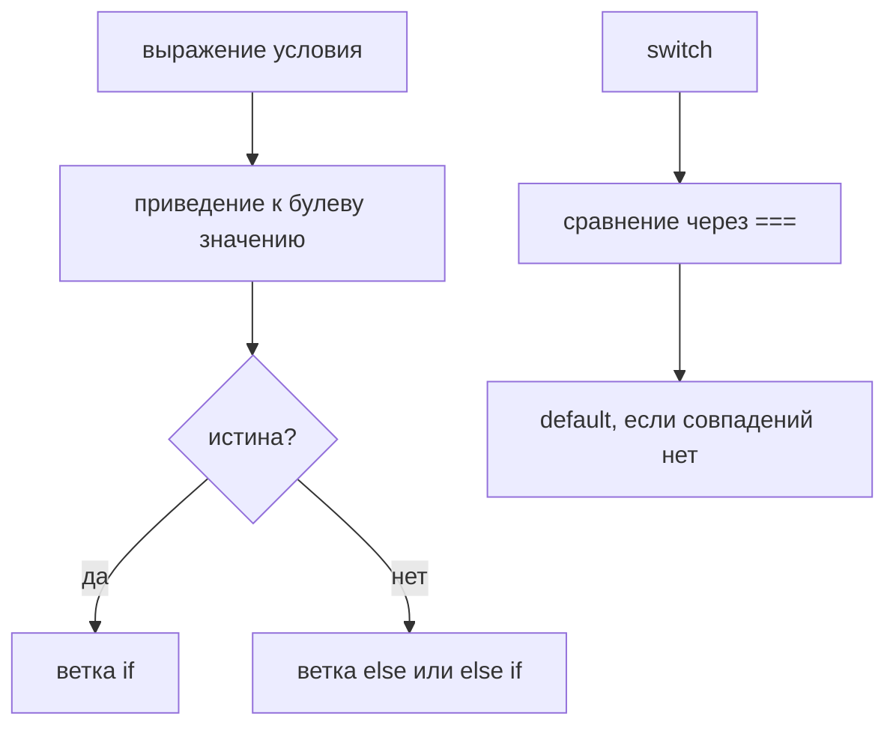

# Условные конструкции

## Связь с предыдущей главой

Предыдущая глава объяснила operators.

Operators receive operands and produce results:

Теперь появляется следующий вопрос:

> Что программа может сделать с этими результатами?

Например, API вернул:

```javascript
const statusCode = 500;
```

Тест должен решить:

```text
Should the test continue?
Should it stop?
Should it report server error?
```

JavaScript не угадывает. Program evaluates an expression first, then chooses an execution path.

Главный вопрос этой главы:

> Какое решение принимает программа?

---

## Предварительные требования

Для этой главы нужно понимать:

* что значения have types;
* что comparison operators produce Boolean results;
* что logical operators combine condition-like значения;
* что truthy and falsy значения exist;
* что expressions produce results;
* что operators are actions performed on operands.

Не требуется знать ternary operator in depth, short-circuit evaluation, nullish coalescing, optional chaining, pattern matching or advanced switch поведение. Эти темы будут изучаться позже.

---

## Время изучения

Ориентировочное время:

```text
Чтение главы:            100-130 минут
Разбор схем:             35-50 минут
Запуск примеров:         20-30 минут
Практика:                90-120 минут
Повторение материала:    25 минут
```

Уровень сложности: **L2-L3**.

Conditionals выглядят как простая синтаксическая тема, но на практике ошибки возникают из-за неверного понимания evaluated result and selected path.

---

## Навигация

Предыдущая глава:

```text
docs/01-javascript/17-operators.md
```

Текущая глава:

```text
docs/01-javascript/18-conditionals.md
```

Следующая глава:

```text
docs/01-javascript/19-loops.md
```

Следующая глава ответит:

> Что если одно и то же решение нужно принимать много раз?

---

## Цели обучения

После изучения этой главы вы будете понимать:

* why conditionals exist;
* how Boolean decision making works;
* how `if` chooses a path;
* how `else` provides alternative path;
* how `else if` builds a decision chain;
* why nested conditions should be used carefully;
* how `switch` works at a high level;
* what default branch means;
* how readable conditional logic is written;
* how conditionals are used in Automation QA.

---

## Мотивация

Начнем с реального решения.

API returned:

```javascript
const statusCode = 500;
```

Вопрос:

```text
Should the test continue?
```

The program needs a decision:

Decision overview:

Programs do not guess:

Главный вопрос:

> Какое решение принимает программа?

---

## Теория

### Зачем существуют условные конструкции

Без условий программа выполняла бы все строки в одном и том же порядке.

Но настоящим программам нужно принимать решения:

```text
ответ 200  →  проверять тело ответа
ответ 500  →  сообщить об ошибке, тело уже не важно
```

Условные конструкции существуют, потому что программам нужно выбирать пути выполнения.

Дерево решений:

```text
            условие
            ├── истинно → одна ветка кода
            └── ложно   → другая ветка кода
```

### Выражение → логическое значение

Условие обычно начинается с выражения.

```javascript
const statusCode = 500;
const isSuccess = statusCode === 200;
```

Выражение → логическое значение:

```text
statusCode === 200   →   true или false
```

Оператор → условие:

```text
оператор сравнения даёт булево значение,
а условие — это место, где такое значение используют для выбора ветки
```

Какое решение принимает программа?

```text
Равен ли statusCode ожидаемому успешному коду?
```

### `if`

`if` выполняет блок только когда результат условия это позволяет.

```javascript
const statusCode = 200;

if (statusCode === 200) {
  console.log('Status is OK');
}
```

`if` схема:

```text
условие истинно  →  выполнить блок
условие ложно    →  пропустить блок
```

Путь выполнения:

```text
statusCode равен 200  →  строка console.log выполняется
statusCode иной        →  выполнение продолжается после блока
```

### `if / else`

`else` даёт запасной путь.

```javascript
const statusCode = 500;

if (statusCode === 200) {
  console.log('Status is OK');
} else {
  console.log('Status is not OK');
}
```

`if / else` схема:

```text
условие истинно  →  блок if
условие ложно    →  блок else
```

Выполняется ровно один путь.

### `else if`

`else if` создаёт цепочку решений.

```javascript
const statusCode = 404;

if (statusCode === 200) {
  console.log('Success');
} else if (statusCode === 404) {
  console.log('Not found');
} else if (statusCode >= 500) {
  console.log('Server error');
} else {
  console.log('Unexpected status');
}
```

Цепочка `else if`:

Какое решение принимает программа?

```text
К какой категории статусов относится этот ответ?
```

### Вложенные условия

Вложенное условие — условие внутри другого условия.

```javascript
const statusCode = 200;
const hasUserId = true;

if (statusCode === 200) {
  if (hasUserId) {
    console.log('Valid user response');
  }
}
```

Схема вложенных условий:

```text
внешнее условие
├── истинно → внутреннее условие
│             ├── истинно → ветка A
│             └── ложно   → ветка B
└── ложно   → ветка C
```

Вложенные условия полезны, когда второе решение имеет смысл только внутри первого.

Предупреждение о читаемости:

```text
два уровня вложенности читаются,
три и больше — почти всегда признак того,
что условие стоит вынести в отдельную функцию или переписать цепочкой else if
```

### Обзор `switch`

`switch` выбирает ветку по значению одного выражения.

```javascript
const environment = 'staging';

switch (environment) {
  case 'local':
    console.log('Use local URL');
    break;
  case 'staging':
    console.log('Use staging URL');
    break;
  default:
    console.log('Use production URL');
}
```

Обзор `switch`:

```text
значение выражения сравнивается с каждым case по очереди,
пока не найдено совпадение
```

Ветки `switch`:

```text
environment === 'local'    →  ветка 'local'
environment === 'staging'  →  ветка 'staging'   ← совпало здесь
ни одно не совпало         →  ветка default
```

`break` завершает выбранную ветку: без него выполнение продолжится в
следующей.

Эта глава оставляет `switch` на высоком уровне. Более сложное его поведение будет изучено позже, при необходимости.

### Ветка по умолчанию

`default` — запасная ветка.

Схема запасной ветки:

```text
ни одно условие не подошло  →  ветка по умолчанию
```

Запасная ветка полезна, когда программа должна обработать неожиданные значения:

```javascript
switch (environment) {
  case 'staging':
    console.log('Use staging URL');
    break;
  default:
    console.log('Unknown environment: ' + environment);
}
```

Без `default` неизвестное окружение прошло бы молча, и тест запустился бы не
там, где ожидалось.

### Выбор пути выполнения

Условное выполнение означает, что движок выбирает **одну** ветку по результату
проверки, а остальные пропускает целиком — их код не выполняется вовсе.

Схема пути выполнения:

```text
выполняется РОВНО ОДНА ветка из цепочки
```

Программа не выполняет все ветки одного решения.

### Читаемая условная логика

Читаемое условие отвечает на один ясный вопрос.

Плохая читаемость:

```javascript
if (statusCode === 200 && hasUserId && !isDeleted && responseTimeMs < 500) {
  console.log('Valid');
}
```

Читается лучше:

```javascript
const isStatusOk = statusCode === 200;
const hasValidUser = hasUserId && !isDeleted;
const isFastEnough = responseTimeMs < 500;

if (isStatusOk && hasValidUser && isFastEnough) {
  console.log('Valid');
}
```

Пример читаемости: цепочка `if / else if / else` с короткими условиями читается сверху вниз как список правил, а глубокая вложенность заставляет удерживать в голове несколько условий сразу.

Детали короткого замыкания будут изучаться позже. Здесь цель — понятное принятие решений.

---

Условие всегда приводится к булеву значению:


```mermaid
flowchart TD
    A["выражение условия"] --> B["приведение к булеву значению"]
    B --> C{"истина?"}
    C -- "да" --> D["ветка if"]
    C -- "нет" --> E["ветка else или else if"]
    F["switch"] --> G["сравнение через ==="]
    G --> H["default, если совпадений нет"]
```

## Внутренний механизм

Условная конструкция выполняется в два шага, и первый из них часто упускают.

```text
1. вычислить выражение в скобках          →  получить значение
2. привести это значение к логическому    →  true или false
3. выполнить ТУ ЖЕ ОДНУ ветку, что выбрана; остальные пропустить
```

Шаг 2 — источник самых неожиданных результатов: в условие можно поставить любое
значение, и движок сам решит, истинное оно или ложное.

```text
ложные значения:  false, 0, -0, '', null, undefined, NaN
всё остальное:    истинно — включая '0', 'false', [], {}
```

Две правые записи в нижней строке встречаются в тестах чаще всего: пустой массив
истинен, поэтому `if (items)` не проверяет, что элементы есть, а строка `'0'`,
пришедшая из параметра запроса, истинна, хотя число `0` — нет.

### Что происходит с непройденными ветками

Код непройденной ветки не выполняется вовсе — он даже не вычисляет свои
выражения. Поэтому вызов функции внутри такой ветки не произойдёт, а ошибка в её
теле не проявится до того прогона, в котором ветка будет выбрана.

```javascript
if (response.ok) {
  save(response.body);       // выполнится только при истинном условии
} else {
  reportFailure(response);   // а это — только при ложном
}
```

Для тестов отсюда следует практическое: ветка, которая никогда не выбирается,
молча остаётся непроверенной. Ветвление в теле теста именно поэтому и опасно —
тест может оказаться зелёным, не выполнив ни одной проверки.

### `switch` сравнивает строго

```javascript
switch (statusCode) {
  case 200: … break;
  case '200': … break;   // другая ветка: сравнение строгое
}
```

`switch` сопоставляет значения так же, как `===`: без приведения типов. Поэтому
строка `'200'` не попадёт в ветку `case 200`, а пропущенный `break` продолжит
выполнение в следующую ветку — это называют «проваливанием».

## Ментальная модель

### Железнодорожная стрелка

Условие — это стрелка. Результат выражения задаёт направление.

### Развилка

Программа доходит до точки решения и выбирает один маршрут.

### Светофор

Решение по коду ответа устроено так же:

```text
зелёный  →  ехать         200  →  проверять тело ответа
красный  →  стоять        500  →  сообщить об ошибке
```

### Дерево решений

Цепочка условий — это дерево: каждая развилка отсекает часть путей, и до
конца доходит ровно одна ветка.

```text
statusCode
├── 200        → успех
├── 400…499    → ошибка запроса
└── 500 и выше → ошибка сервера
```

### Пункт контроля

Программы не угадывают. Они проверяют результат и выбирают путь.

---

## Примеры кода

Все примеры находятся в:

```text
examples/01-javascript/chapter-18/
```

Запуск:

```bash
node examples/01-javascript/chapter-18/01-if.js
node examples/01-javascript/chapter-18/02-if-else.js
node examples/01-javascript/chapter-18/03-else-if.js
node examples/01-javascript/chapter-18/04-switch.js
node examples/01-javascript/chapter-18/05-nested.js
node examples/01-javascript/chapter-18/06-common-mistakes.js
```

### 01-if.js

Показывает один успешный путь.

### 02-if-else.js

Показывает успешный путь и путь отказа.

### 03-else-if.js

Показывает цепочку решений по коду ответа.

### 04-switch.js

Показывает выбор окружения.

### 05-nested.js

Показывает вложенную проверку ответа.

### 06-common-mistakes.js

Показывает ошибку с присваиванием внутри условия.

---

## Частые вопросы

### JavaScript выбирает ветку случайно?

Нет. Сначала вычисляется выражение, затем по результату выбирается путь.

### Каждое условие обязано быть булевым?

Условие вычисляется как решение. Булевы значения понятнее всего. Истинность и ложность работают и для других значений, но явные булевы выражения обычно читаются лучше.

### Нужно ли избегать вложенных условий?

Не всегда. Используйте вложенность, когда внутреннее решение имеет смысл только внутри внешнего. Избегайте глубокой вложенности, когда именованные выражения или ранний выход читаются понятнее.

### `switch` лучше, чем `else if`?

Не всегда. `switch` полезен, когда одно значение сравнивается с несколькими известными вариантами. `else if` гибче для разных выражений.

### Тернарный оператор — это условная конструкция?

Это условное выражение, но подробно тернарный оператор в этой главе не разбирается. Он будет использоваться дальше там, где уместен.

---

## Распространённые мифы

### Миф: `if` проверяет строку кода

Реальность:

`if` вычисляет результат выражения.

### Миф: выполняются все ветки, а JavaScript выбирает вывод

Реальность:

Выполняется только выбранный путь.

### Миф: чем больше вложенности, тем точнее код

Реальность:

Чем глубже вложенность, тем труднее прочитать путь решения.

### Миф: `switch` — устаревший синтаксис

Реальность:

`switch` полезен для выбора среди известных вариантов одного значения.

---

## Распространённые ошибки

### Ошибка 1. Присваивание вместо сравнения

```javascript
let statusCode = 500;

if (statusCode = 200) {
  console.log('Success');
}
```

Это обновляет `statusCode`, а не сравнивает его.

Правильно:

```javascript
if (statusCode === 200) {
  console.log('Success');
}
```

### Ошибка 2. Неясное условие на истинность

```javascript
if (responseBody.id) {
  console.log('Has id');
}
```

Если `id` может быть равен `0`, такое условие вводит в заблуждение. Используйте явные проверки там, где это нужно.

### Ошибка 3. Пропущенный `else`

Если путь отказа важен, опишите его.

```javascript
if (statusCode === 200) {
  console.log('Success');
} else {
  console.log('Unexpected status');
}
```

### Ошибка 4. Глубокая вложенность

Трудно читать и трудно разбирать при падении.

### Ошибка 5. Пропущенный `default` в `switch`

Если неожиданное значение возможно, запасная ветка делает поведение явным.

---

## Практическое использование

Условные конструкции используются, когда программе нужно выбрать:

```text
Continue or stop
Retry or fail
взять конфигурацию стенда или промышленной среды
проверить тело или сообщить об ошибке статуса
выполнить проверку A или проверку B
```

Практический чек-лист чтения:

```text
1. Какое решение принимается?
2. Какое выражение вычисляется?
3. Какой результат даёт выражение?
4. Какая ветка выбрана?
5. Что происходит после условной конструкции?
```

---

## Использование в Automation QA

### Проверка кода ответа

```javascript
if (statusCode === 200) {
  console.log('Validate response body');
} else {
  console.log('Report status error');
}
```

Пример решения:

```text
проверка тела ответа имеет смысл только при коде 200 —
иначе тест проверял бы содержимое страницы ошибки
```

### Логика повторов

```javascript
if (statusCode >= 500) {
  console.log('Retry may be needed');
}
```

Полные циклы повторов будут изучаться в следующей главе.

### Выбор окружения

```javascript
switch (environment) {
  case 'local':
    console.log('Local config');
    break;
  case 'staging':
    console.log('Staging config');
    break;
  default:
    console.log('Production config');
}
```

### Пропуск тестов

На высоком уровне:

Пропуск тестов средствами фреймворка будет изучаться позже.

### Выбор проверок

```javascript
if (responseType === 'user') {
  console.log('Assert user fields');
} else {
  console.log('Assert generic response');
}
```

---

## Итоги

Условия отвечают:

```text
Что программа может делать с результатами операторов?
```

Основная модель:

```text
Выражение даёт результат.
Условная конструкция вычисляет этот результат.
Выбирается ровно одна ветка выполнения.
```

Основные формы:

```text
if
if / else
else if chain
nested conditions
switch
default branch
```

Следующая глава, про циклы, отвечает:

```text
А если одно и то же решение нужно принимать много раз?
```

---

## Что нужно запомнить

* Условное выполнение начинается с вычисленного выражения.
* Программа не угадывает.
* `if` выполняет блок, когда выбран путь условия.
* `else` даёт запасной путь.
* `else if` строит цепочку решений.
* Вложенные условия описывают решения внутри решений.
* `switch` выбирает среди вариантов для одного значения.
* `default` обрабатывает запасной путь.
* В одном решении `if / else` выполняется ровно один путь.
* Читаемые условия используют ясные имена и явно выраженное намерение.
* Условные конструкции лежат в основе решений в автоматизации тестов.

---

## Проверьте себя

Ответьте без запуска кода.

1. Почему существуют условные конструкции?
2. Что происходит до того, как JavaScript выбирает ветку?
3. Что делает `if`?
4. Что добавляет `else`?
5. Когда полезен `else if`?
6. Когда полезна вложенность?
7. Что вычисляет `switch`?
8. Что такое ветка `default`?
9. Почему условия должны быть читаемыми?
10. Как эта глава ведёт к циклам?

### Ответы

1. Программе нужно выбирать путь: при коде ответа 200 проверять тело, при 500 — сообщать об ошибке. Без условий все строки выполнялись бы подряд всегда.
2. Вычисляется выражение условия, и его результат определяет выбор. Ветка выбирается по значению, а не по тексту условия.
3. Выполняет блок, если условие истинно, и пропускает его, если ложно.
4. Запасной путь: блок, который выполняется, когда условие оказалось ложным. Без него при ложном условии не выполняется ничего.
5. Когда вариантов больше двух и они проверяются по очереди: код ответа 200, затем диапазон 400, затем 500.
6. Когда второе решение имеет смысл только внутри первого: например, проверять тело ответа есть смысл лишь после того, как код ответа оказался успешным.
7. Значение одного выражения, которое затем по очереди сравнивается с вариантами `case`.
8. Ветка, которая выполняется, если ни один вариант не совпал. Без неё неизвестное значение проходит молча.
9. Условие описывает решение, которое принимает программа. Если его нельзя прочитать вслух одной фразой, при разборе падения придётся заново выводить его смысл.
10. Условие выбирает путь один раз. Дальше возникает вопрос, как повторять действие, пока условие выполняется, — это и есть циклы.

---

## Практика

Практика находится в файле:

```text
practice/01-javascript/18-conditionals.md
```

Сначала отвечайте без запуска там, где нужно предсказать вывод. Главная цель — определить вычисляемое выражение и выбранный путь.

---

## Решения

Решения находятся в файле:

```text
solutions/01-javascript/18-conditionals.md
```

Читайте решения после самостоятельной попытки. Проверяйте рассуждение: какое решение принимает программа?
