# Loops

## Связь с предыдущей главой

Предыдущая глава объяснила conditionals.

Conditional makes one decision:

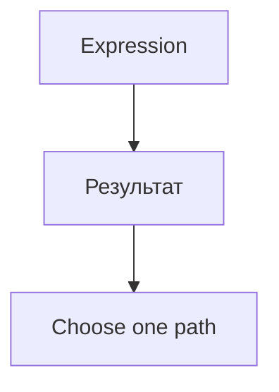

Теперь появляется следующий вопрос:

> Что если одно и то же решение или действие нужно выполнить много раз?

Представьте, что нужно validate 100 API responses.

Можно написать:

```text
check response 1
check response 2
check response 3
...
check response 100
```

Но это не engineering solution. Программа должна repeat the same algorithm.

Главный вопрос этой главы:

> Что повторяется?

---

## Предварительные требования

Для этой главы нужно понимать:

* что conditionals choose execution path;
* что expressions produce results;
* что comparison operators produce Boolean results;
* что variables can store changing значения;
* что assignment can update значения;
* что readable code should make intent visible.

Не требуется знать `for...of`, `for...in`, iterators, generators, array iteration methods, asynchronous loops or labeled break. Эти темы будут изучаться позже.

---

## Время изучения

Ориентировочное время:

```text
Чтение главы:            110-140 минут
Разбор схем:             40-55 минут
Запуск примеров:         25-35 минут
Практика:                100-130 минут
Повторение материала:    30 минут
```

Уровень сложности: **L3**.

Loops сложны не из-за синтаксиса. Они сложны потому, что один пропущенный update step может заставить программу повторяться бесконечно.

---

## Навигация

Предыдущая глава:

```text
docs/01-javascript/18-conditionals.md
```

Текущая глава:

```text
docs/01-javascript/19-loops.md
```

Следующая глава:

```text
docs/01-javascript/20-error-handling.md
```

Следующая глава ответит:

> Что должно происходить при ошибке во время выполнения?

---

## Цели обучения

После изучения этой главы вы будете понимать:

* why loops exist;
* what repeated execution means;
* what loop condition is;
* what iteration is;
* what loop body is;
* what initialization does;
* what update step does;
* how `while` works;
* how `do...while` works;
* how `for` works;
* what `break` does;
* what `continue` does;
* how to avoid infinite loops;
* how to choose appropriate loop type.

---

## Мотивация

Реальная задача:

```text
Validate 100 API responses.
```

Плохой подход:

```text
write 100 identical if statements
```

Лучший подход:

```text
repeat one validation algorithm
until all responses are checked
```

Зачем существуют loops:

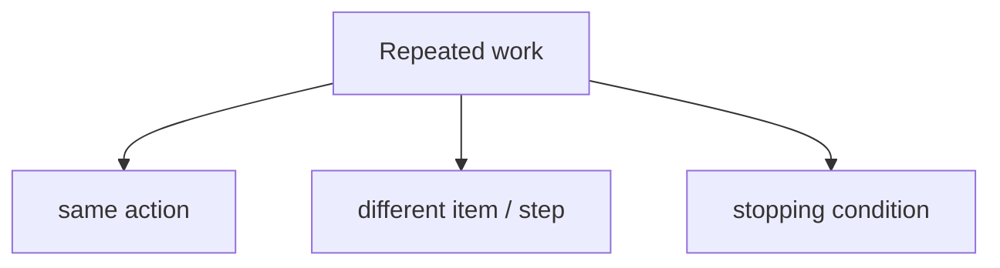

Repetition overview:

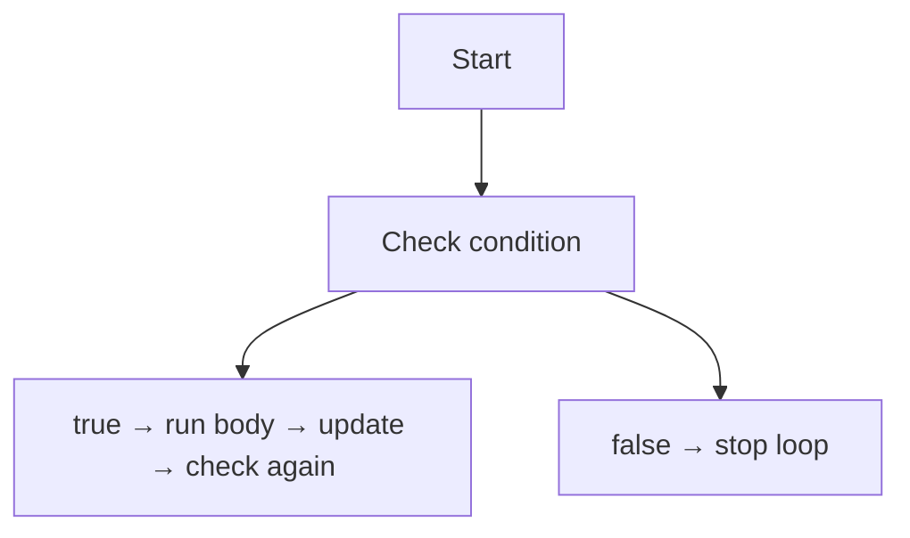

Главный вопрос:

> Что повторяется?

---

## Теория

### Зачем существуют loops

Loops существуют, потому что программам часто нужно повторять алгоритм.

Примеры:

```text
Validate many API responses.
Check table rows.
Process test data.
Retry while server is unavailable.
Poll until status changes.
```

Without loop:

```text
check response 1
check response 2
check response 3
```

With loop:

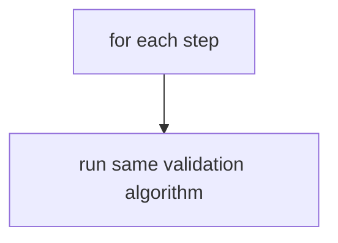

Loop = repeated execution until stopping condition is reached.

### Loop lifecycle

Every loop has a lifecycle.

Loop lifecycle схема:

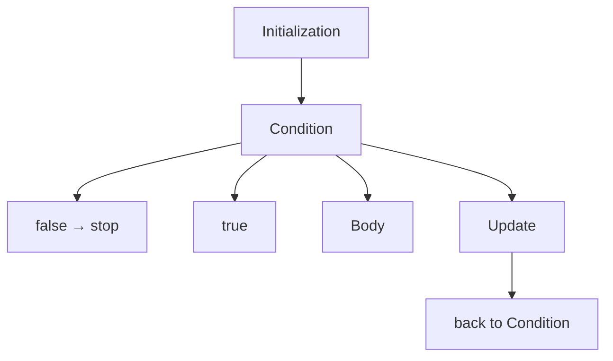

Four core parts:

```text
1. initialization
2. condition
3. body
4. update
```

### Initialization

Initialization prepares loop состояние.

```javascript
let responseIndex = 0;
```

Initialization схема:

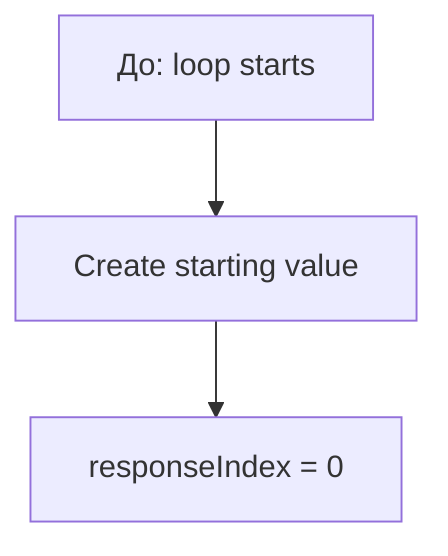

Что повторяется?

```text
Not initialization.
It usually happens once before repetition.
```

### Condition

Condition decides whether loop continues.

```javascript
responseIndex < totalResponses
```

Condition схема:

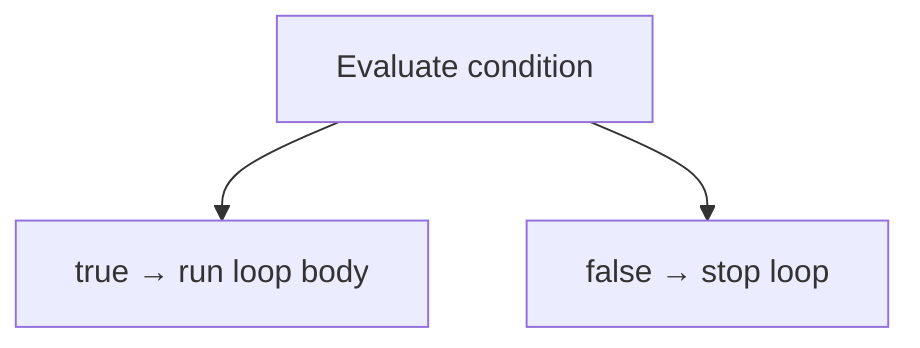

Loop decision:

```text
Should repetition continue?
```

### Body

Loop body is the repeated work.

```javascript
console.log('Validate response');
```

Body схема:

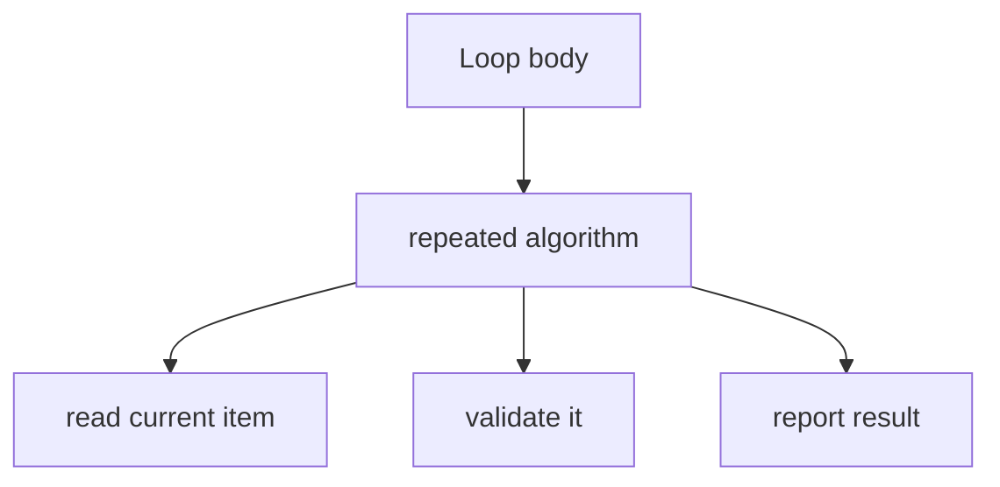

Что повторяется?

```text
The body.
```

### Update

Update moves loop toward stopping condition.

```javascript
responseIndex += 1;
```

Update схема:

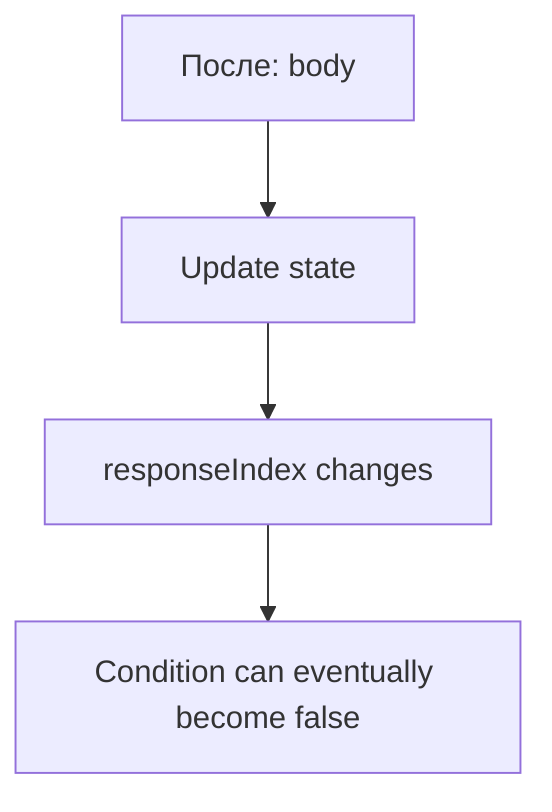

Without update, loop may never stop.

### Iteration

One iteration is one complete pass through loop body.

Iteration временная шкала:

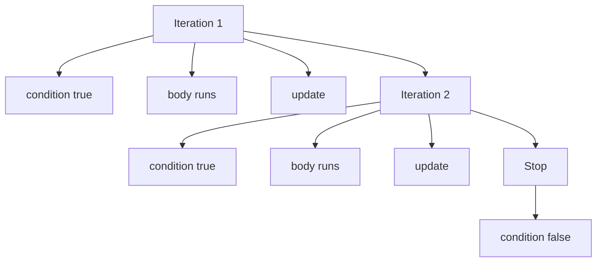

Iteration отвечает:

```text
Which repetition are we on?
```

### `while`

`while` repeats while condition is true.

```javascript
let responseIndex = 0;
const totalResponses = 3;

while (responseIndex < totalResponses) {
  console.log('Validate response', responseIndex);
  responseIndex += 1;
}
```

`while` схема:

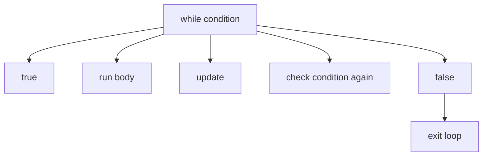

Используйте `while`, когда количество повторений заранее неизвестно.

### `do...while`

`do...while` runs body first, then checks condition.

```javascript
let attempt = 1;

do {
  console.log('Run attempt', attempt);
  attempt += 1;
} while (attempt <= 1);
```

`do...while` схема:

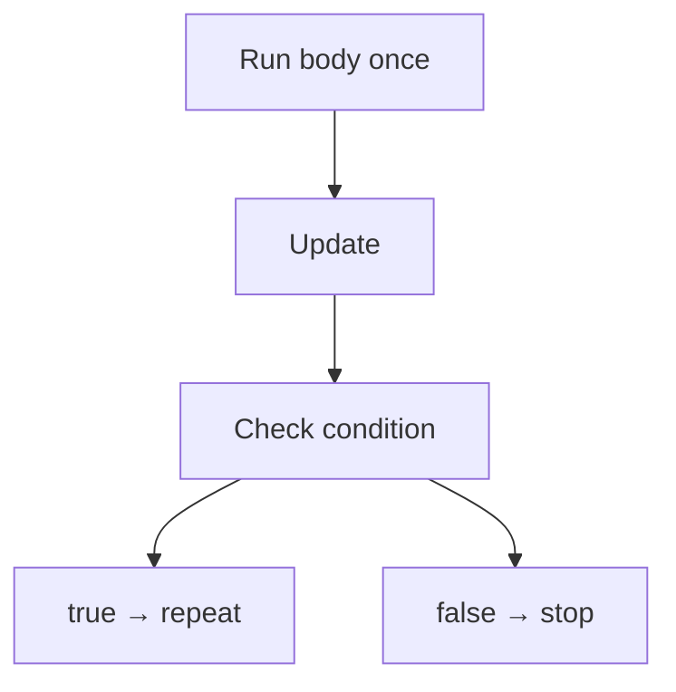

Key idea:

```text
Body runs at least once.
```

Используйте его, когда действие должно выполниться до решения о повторе.

### `for`

`for` puts initialization, condition and update in one line.

```javascript
for (let responseIndex = 0; responseIndex < 3; responseIndex += 1) {
  console.log('Validate response', responseIndex);
}
```

`for` схема:

```text
for (
  initialization;
  condition;
  update
) {
  body
}
```

Expanded lifecycle:

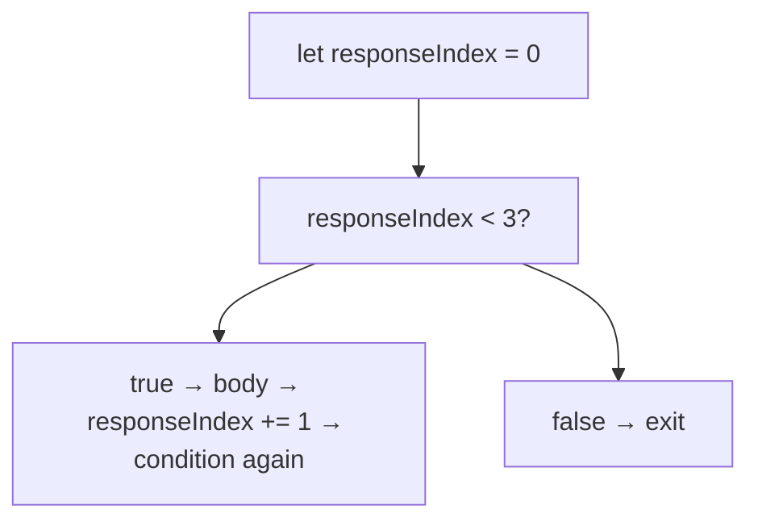

Используйте `for`, когда у loop есть понятный counter-like lifecycle.

### `break`

`break` stops loop early.

```javascript
for (let attempt = 1; attempt <= 3; attempt += 1) {
  console.log('Attempt', attempt);

  if (attempt === 2) {
    break;
  }
}
```

`break` схема:

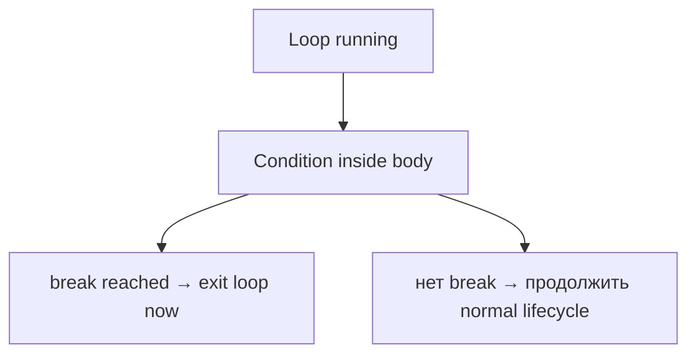

Используйте `break`, когда loop нашёл нужное или должен остановиться раньше.

### `continue`

`continue` skips current iteration and moves to next one.

```javascript
for (let responseIndex = 0; responseIndex < 3; responseIndex += 1) {
  if (responseIndex === 1) {
    continue;
  }

  console.log('Validate response', responseIndex);
}
```

`continue` схема:

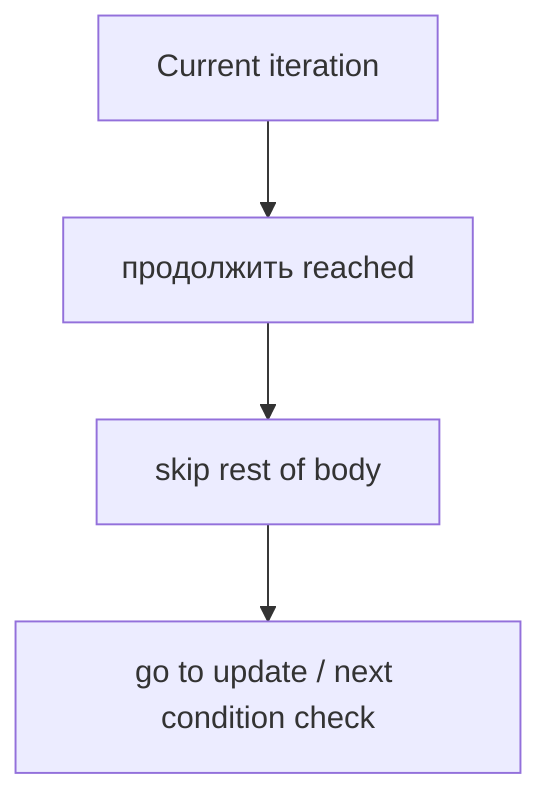

Используйте `continue`, когда текущий item нужно пропустить, но loop должен продолжаться.

### Avoiding infinite loops

Infinite loop возникает, когда stopping condition никогда не достигается.

```javascript
let attempt = 1;

while (attempt <= 3) {
  console.log('Attempt', attempt);
}
```

Infinite loop схема:

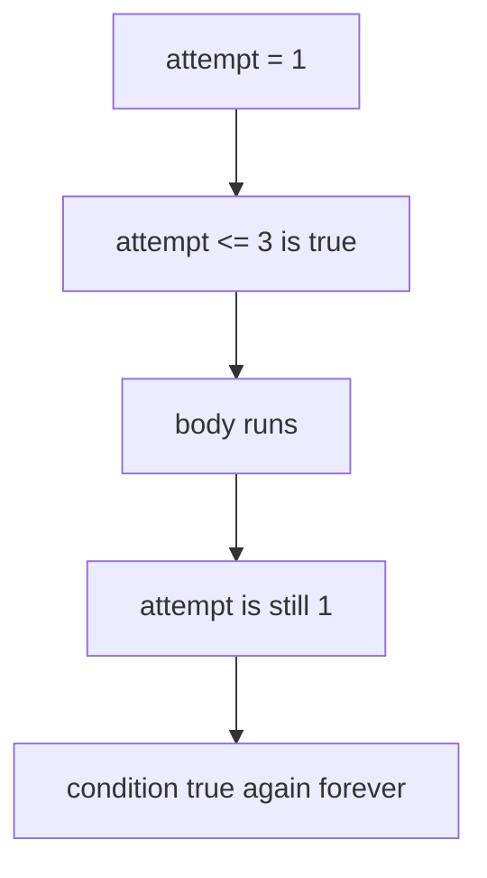

Avoid it by ensuring update changes loop состояние:

```javascript
attempt += 1;
```

### Choosing the appropriate loop

Choosing loop type:

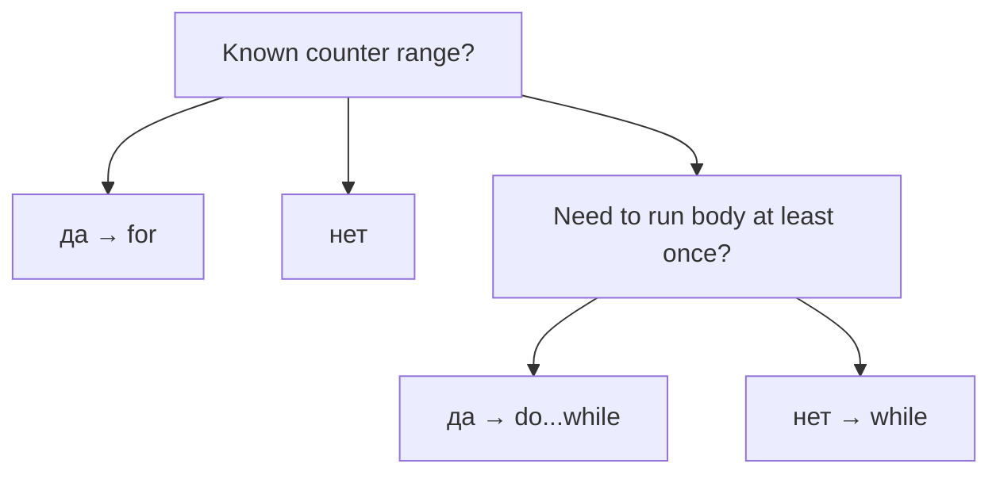

This is a guideline, not a law.

Future chapters will introduce `for...of`, `for...in`, array iteration methods and asynchronous loops.

---

## Внутренний механизм

На концептуальном уровне:

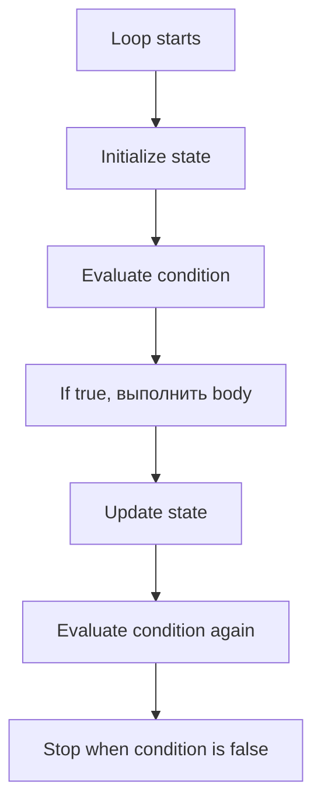

Complete loop picture:

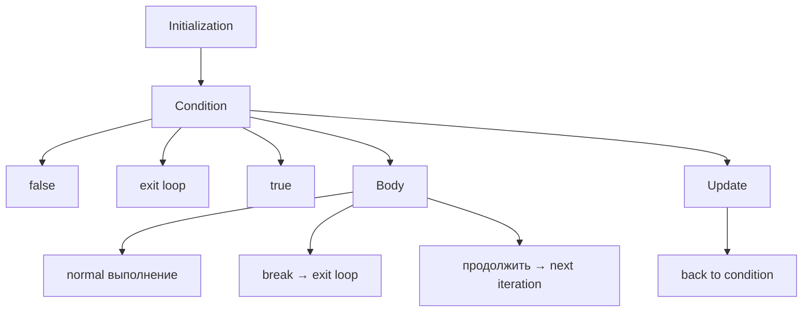

Текущее место в модели JavaScript:

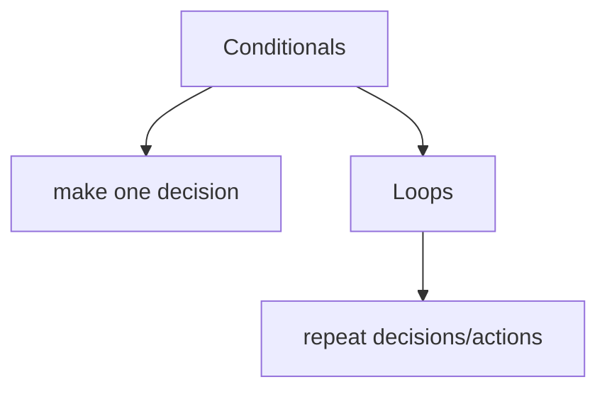

Переход к Error Handling:

```mermaid
flowchart TD
    N1["Loop body runs"]
    N2["Something can fail"]
    N3["Next chapter:"]
    N4["What should happen if an error occurs during выполнение?"]
    N1 --> N2
    N2 --> N3
    N3 --> N4
```

---

## Ментальная модель

### Factory conveyor

```mermaid
flowchart TD
    N1["Item enters conveyor"]
    N2["Inspection step repeats"]
    N3["Next item"]
    N1 --> N2
    N2 --> N3
```

Loop is the conveyor that keeps processing items until there are no more items.

### Checklist

```mermaid
flowchart TD
    N1["Checklist"]
    N2["item 1 checked"]
    N3["item 2 checked"]
    N4["item 3 checked"]
    N5["stop when list ends"]
    N1 --> N2
    N1 --> N3
    N1 --> N4
    N1 --> N5
```

### Assembly line

```mermaid
flowchart TD
    N1["Same operation"]
    N2["applied to item A"]
    N3["applied to item B"]
    N4["applied to item C"]
    N1 --> N2
    N1 --> N3
    N1 --> N4
```

### Repeated inspection

QA loop:

```mermaid
flowchart TD
    N1["Response 1 → validate"]
    N2["Response 2 → validate"]
    N3["Response 3 → validate"]
    N1 --> N2
    N2 --> N3
```

### Security gate checking many visitors

```mermaid
flowchart TD
    N1["Visitor arrives"]
    N2["Check badge"]
    N3["Allow or reject"]
    N4["Next visitor"]
    N1 --> N2
    N2 --> N3
    N3 --> N4
```

Loop = repeated execution until stopping condition is reached.

---

## Примеры кода

Все примеры находятся в:

```text
examples/01-javascript/chapter-19/
```

Запуск:

```bash
node examples/01-javascript/chapter-19/01-while.js
node examples/01-javascript/chapter-19/02-do-while.js
node examples/01-javascript/chapter-19/03-for.js
node examples/01-javascript/chapter-19/04-break-continue.js
node examples/01-javascript/chapter-19/05-common-mistakes.js
node examples/01-javascript/chapter-19/06-qa-example.js
```

### 01-while.js

Shows repetition while condition remains true.

### 02-do-while.js

Shows body running at least once.

### 03-for.js

Shows counter-based loop.

### 04-break-continue.js

Shows early stop and skipping current iteration.

### 05-common-mistakes.js

Shows a guarded version of missing update problem.

### 06-qa-example.js

Shows validation of multiple API-like responses.

---

## Частые вопросы

### Is loop just repeated `if`?

No. A loop repeats body and condition evaluation. `if` makes one decision.

### Какой loop использовать чаще всего?

For counter-based repetition, `for` is common. For unknown repetition count, `while` is often clearer.

### Is `do...while` common?

Менее распространён, но полезен, когда body должен выполниться хотя бы один раз.

### Should I use `break` and `continue`?

Используйте их, когда они делают loop понятнее. Не злоупотребляйте ими так, чтобы скрывать control flow.

### Почему не изучать array methods сейчас?

Array iteration methods are important, but they rely on arrays and functions. They will be studied later.

---

## Распространенные мифы

### Миф: Loop repeats automatically until data ends

Реальность:

Loop repeats according to its condition and update logic.

### Миф: `while` and `for` are completely different ideas

Реальность:

They both express repeated execution with condition and update. Syntax differs.

### Миф: Infinite loop is random

Реальность:

Infinite loop usually means stopping condition never becomes false.

### Миф: `break` and `continue` are bad

Реальность:

Это инструменты. Используйте их, когда они делают намерение понятнее.

---

## Типичные ошибки

### Ошибка 1. Missing update

```javascript
let attempt = 1;

while (attempt <= 3) {
  console.log(attempt);
}
```

`attempt` never changes.

### Ошибка 2. Wrong condition

```javascript
for (let index = 0; index <= 3; index += 1) {
  console.log(index);
}
```

This runs for `0`, `1`, `2`, `3`. If you wanted three iterations, condition should be `index < 3`.

### Ошибка 3. Update in wrong direction

```javascript
let attempt = 1;

while (attempt <= 3) {
  attempt -= 1;
}
```

Condition moves away from stopping.

### Ошибка 4. Confuse `break` and `continue`

```mermaid
flowchart TD
    N1["break → stop loop"]
    N2["продолжить → skip current iteration"]
    N1 --> N2
```

### Ошибка 5. Put too much logic inside one loop

If loop body becomes large, future functions can help organize logic. Functions are a future section.

---

## Практическое использование

Loops are useful when:

```text
same action repeats
state changes each iteration
condition decides when to stop
```

Практический чек-лист чтения:

```text
1. What is repeated?
2. What is initialized?
3. What condition controls repetition?
4. What body runs?
5. What update moves loop toward stop?
6. Can break or continue change normal flow?
7. Can the loop become infinite?
```

---

## Использование в Automation QA

### Validating many API responses

```javascript
for (let index = 0; index < responses.length; index += 1) {
  const response = responses[index];
  console.log(response.statusCode === 200);
}
```

QA validation example:

```mermaid
flowchart TD
    N1["responses"]
    N2["response 0 → validate"]
    N3["response 1 → validate"]
    N4["response 2 → validate"]
    N1 --> N2
    N1 --> N3
    N1 --> N4
```

### Checking table rows

Loop can check row by row:

```text
row 1
row 2
row 3
```

Detailed DOM and Playwright APIs will be studied later.

### Processing test data

```mermaid
flowchart TD
    N1["user 1 → создать test data"]
    N2["user 2 → создать test data"]
    N3["user 3 → создать test data"]
    N1 --> N2
    N2 --> N3
```

### Polling until condition changes

Polling means repeat check until status changes or max attempts reached.

```mermaid
flowchart TD
    N1["attempt 1 → status pending"]
    N2["attempt 2 → status pending"]
    N3["attempt 3 → status ready"]
    N1 --> N2
    N2 --> N3
```

Asynchronous polling will be studied later.

### Avoiding endless retries

Always have a stopping condition:

```text
retry while not ready
but stop after max attempts
```

---

## Итоги

Loops answer:

```text
What if the same decision or action must happen many times?
```

Основная модель:

```mermaid
flowchart TD
    N1["A loop repeats an algorithm."]
    N2["Each iteration evaluates whether repetition should продолжить."]
    N3["Every loop consists of:"]
    N4["initialization"]
    N5["condition"]
    N6["body"]
    N7["update"]
    N3 --> N4
    N3 --> N5
    N3 --> N6
    N3 --> N7
    N1 --> N2
    N2 --> N3
```

Main loop forms:

```text
while
do...while
for
```

Control tools:

```mermaid
flowchart TD
    N1["break → stop loop"]
    N2["продолжить → skip current iteration"]
    N1 --> N2
```

Next chapter explains Error Handling:

```text
What should happen if an error occurs during execution?
```

---

## Что нужно запомнить

* Loop repeats execution.
* Loop repeats until stopping condition is reached.
* Iteration is one pass through loop body.
* Initialization prepares loop состояние.
* Condition decides whether to continue.
* Body contains repeated work.
* Update moves loop toward stopping.
* `while` checks condition before body.
* `do...while` runs body at least once.
* `for` is useful for clear counter lifecycle.
* `break` stops loop.
* `continue` skips current iteration.
* Infinite loops обычно возникают, когда condition никогда не становится false.

---

## Проверьте себя

Ответьте без запуска кода.

1. Почему существуют loops?
2. Что повторяется в loop?
3. Что такое iteration?
4. Какие четыре основные части есть у loop?
5. When does `while` stop?
6. В чём особенность `do...while`?
7. When is `for` useful?
8. Что делает `break`?
9. Что делает `continue`?
10. Как эта глава ведёт к Error Handling?

---

## Практика

Практика находится в файле:

```text
practice/01-javascript/19-loops.md
```

Сначала решайте predict вывод задания без запуска. Главная цель - видеть lifecycle: initialization, condition, body, update.

---

## Решения

Решения находятся в файле:

```text
solutions/01-javascript/19-loops.md
```

Читайте решения после самостоятельной попытки. Проверяйте ход рассуждения: что повторяется и когда повторение останавливается?
