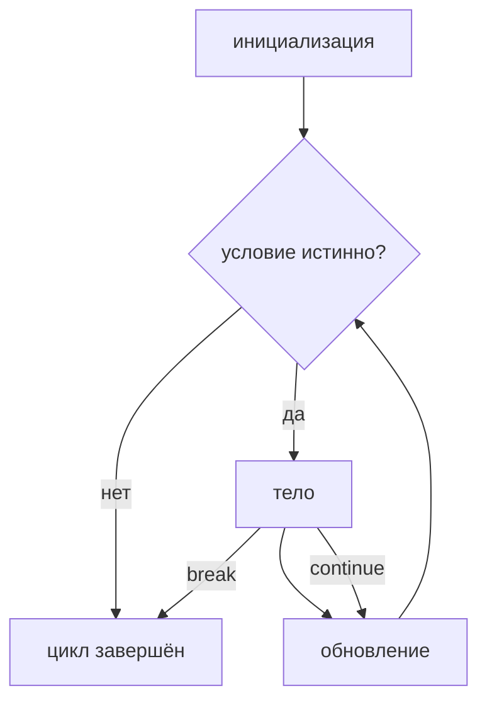

# Циклы

## Связь с предыдущей главой

Предыдущая глава объяснила conditionals.

Conditional makes one decision:

Теперь появляется следующий вопрос:

> Что если одно и то же решение или действие нужно выполнить много раз?

Представьте, что нужно validate 100 API responses.

Можно написать:

```text
check response 1
check response 2
check response 3
...
check response 100
```

Но это не engineering solution. Программа должна repeat the same algorithm.

Главный вопрос этой главы:

> Что повторяется?

---

## Предварительные требования

Для этой главы нужно понимать:

* что conditionals choose execution path;
* что expressions produce results;
* что comparison operators produce Boolean results;
* что variables can store changing значения;
* что assignment can update значения;
* что readable code should make intent visible.

Не требуется знать `for...of`, `for...in`, iterators, generators, array iteration methods, asynchronous loops or labeled break. Эти темы будут изучаться позже.

---

## Время изучения

Ориентировочное время:

```text
Чтение главы:            110-140 минут
Разбор схем:             40-55 минут
Запуск примеров:         25-35 минут
Практика:                100-130 минут
Повторение материала:    30 минут
```

Уровень сложности: **L3**.

Loops сложны не из-за синтаксиса. Они сложны потому, что один пропущенный update step может заставить программу повторяться бесконечно.

---

## Навигация

Предыдущая глава:

```text
docs/01-javascript/18-conditionals.md
```

Текущая глава:

```text
docs/01-javascript/19-loops.md
```

Следующая глава:

```text
docs/01-javascript/20-error-handling.md
```

Следующая глава ответит:

> Что должно происходить при ошибке во время выполнения?

---

## Цели обучения

После изучения этой главы вы будете понимать:

* why loops exist;
* what repeated execution means;
* what loop condition is;
* what iteration is;
* what loop body is;
* what initialization does;
* what update step does;
* how `while` works;
* how `do...while` works;
* how `for` works;
* what `break` does;
* what `continue` does;
* how to avoid infinite loops;
* how to choose appropriate loop type.

---

## Мотивация

Реальная задача:

```text
Validate 100 API responses.
```

Плохой подход:

```text
write 100 identical if statements
```

Лучший подход:

```text
repeat one validation algorithm
until all responses are checked
```

Зачем существуют loops:

Repetition overview:

Главный вопрос:

> Что повторяется?

---

## Теория

### Зачем существуют циклы

Циклы существуют, потому что программам часто нужно повторять одно и то же действие.

Примеры:

```text
Validate many API responses.
Check table rows.
Process test data.
Повторять, пока сервер недоступен.
Опрашивать, пока статус не изменится.
```

Без цикла:

```text
check response 1
check response 2
check response 3
```

С циклом:

Цикл — это повторяющееся выполнение, пока не достигнуто условие остановки.

### Время жизни цикла

У каждого цикла есть свой жизненный цикл.

Схема жизненного цикла:

```text
инициализация → проверка условия → тело → обновление → проверка условия → ...
```

Четыре основные части:

```text
1. initialization
2. condition
3. body
4. update
```

### Инициализация

Начальная установка готовит состояние цикла.

```javascript
let responseIndex = 0;
```

Схема начальной установки:

```text
let i = 0        выполняется один раз перед циклом
```

Что повторяется?

```text
Not initialization.
Обычно выполняется один раз до повторов.
```

### Условие

Условие решает, продолжается ли цикл.

```javascript
responseIndex < totalResponses
```

Схема условия:

```text
i < items.length   проверяется перед каждой итерацией
```

Решение о цикле:

```text
Продолжать ли повторы?
```

### Тело

Тело цикла — повторяемая работа.

```javascript
console.log('Validate response');
```

Схема тела:

```text
тело выполняется только если условие истинно
```

Что повторяется?

```text
The body.
```

### Обновление

Изменение состояния двигает цикл к условию остановки.

```javascript
responseIndex += 1;
```

Схема изменения состояния:

```text
i++              выполняется после каждой итерации
```

Без изменения состояния цикл может не остановиться никогда.

### Итерация

Одна итерация — один полный проход по телу цикла.

Временная шкала итерации:

```text
проверка условия → выполнение тела → шаг обновления → снова проверка условия
```

Итерация отвечает на вопрос:

```text
на каком повторе мы находимся?
```

### `while`

`while` повторяется, пока условие истинно.

```javascript
let responseIndex = 0;
const totalResponses = 3;

while (responseIndex < totalResponses) {
  console.log('Validate response', responseIndex);
  responseIndex += 1;
}
```

`while` схема:

```text
проверить условие → выполнить тело → повторить
```

Используйте `while`, когда количество повторений заранее неизвестно.

### `do...while`

`do...while` сначала выполняет тело, затем проверяет условие.

```javascript
let attempt = 1;

do {
  console.log('Run attempt', attempt);
  attempt += 1;
} while (attempt <= 1);
```

`do...while` схема:

```text
выполнить тело → проверить условие → повторить

тело выполняется минимум один раз
```

Ключевая идея:

```text
Тело выполняется хотя бы один раз.
```

Используйте его, когда действие должно выполниться до решения о повторе.

### `for`

`for` собирает начальную установку, условие и изменение состояния в одну строку.

```javascript
for (let responseIndex = 0; responseIndex < 3; responseIndex += 1) {
  console.log('Validate response', responseIndex);
}
```

`for` схема:

```text
for (
  initialization;
  condition;
  update
) {
  body
}
```

Расширенное время жизни:

Используйте `for`, когда у цикла есть понятный счётчик.

### `break`

`break` останавливает цикл досрочно.

```javascript
for (let attempt = 1; attempt <= 3; attempt += 1) {
  console.log('Attempt', attempt);

  if (attempt === 2) {
    break;
  }
}
```

`break` схема:

```text
break  →  выйти из цикла целиком
```

Используйте `break`, когда цикл нашёл нужное или должен остановиться раньше.

### `continue`

`continue` пропускает текущую итерацию и переходит к следующей.

```javascript
for (let responseIndex = 0; responseIndex < 3; responseIndex += 1) {
  if (responseIndex === 1) {
    continue;
  }

  console.log('Validate response', responseIndex);
}
```

`continue` схема:

```text
continue  →  пропустить остаток тела и перейти к следующей итерации
```

Используйте `continue`, когда текущий элемент нужно пропустить, но цикл должен продолжаться.

### Как избегать бесконечных циклов

Бесконечный цикл возникает, когда условие остановки никогда не достигается.

```javascript
let attempt = 1;

while (attempt <= 3) {
  console.log('Attempt', attempt);
}
```

Схема бесконечного цикла:

```text
условие никогда не становится ложным  →  цикл не завершается
```

Избежать этого можно, убедившись, что состояние цикла действительно меняется:

```javascript
attempt += 1;
```

### Выбор подходящего цикла

Как выбирать тип цикла:

Это ориентир, а не закон.

Будущие главы введут `for...of`, `for...in`, методы перебора массивов и асинхронные циклы.

---

Один оборот цикла состоит из четырёх шагов:


```mermaid
flowchart TD
    A["инициализация"] --> B{"условие истинно?"}
    B -- "нет" --> C["цикл завершён"]
    B -- "да" --> D["тело"]
    D --> E["обновление"]
    E --> B
    D -- "break" --> C
    D -- "continue" --> E
```

## Внутренний механизм

На концептуальном уровне движок выполняет один и тот же набор шагов:

```text
1. вычислить условие
2. если ложно — выйти из цикла
3. выполнить тело
4. выполнить шаг обновления (если он есть)
5. вернуться к шагу 1
```

Отсюда и различие между видами циклов: `while` начинает с шага 1, `do...while` —
с шага 3 (поэтому его тело выполняется хотя бы раз), а `for` собирает
инициализацию, условие и обновление в одну строку.

```text
Loops           —  повторение, пока выполняется условие
Error Handling  —  что делать, если один из повторов упал
```

---

## Ментальная модель

### Заводской конвейер

Цикл — это конвейер, который обрабатывает элементы, пока они не закончатся.

### Чек-лист

Цикл — это чек-лист: один и тот же вопрос задают каждому пункту, пока пункты
не закончатся.

```text
пункт 1  →  проверен
пункт 2  →  проверен
пункт 3  →  проверен
пунктов больше нет  →  цикл закончился
```

### Сборочная линия

Тело цикла — одна и та же операция над разными деталями. Меняются только
входные данные, а действие остаётся прежним.

### Повторный осмотр

Цикл в тестах:

```text
для каждого ответа из списка    →  проверить код ответа
для каждой строки таблицы       →  сравнить с ожидаемым значением
```

Один цикл — одна повторяемая проверка.

### Охрана, проверяющая много посетителей

Цикл — это повторяющееся выполнение, пока не достигнуто условие остановки.

---

## Примеры кода

Все примеры находятся в:

```text
examples/01-javascript/chapter-19/
```

Запуск:

```bash
node examples/01-javascript/chapter-19/01-while.js
node examples/01-javascript/chapter-19/02-do-while.js
node examples/01-javascript/chapter-19/03-for.js
node examples/01-javascript/chapter-19/04-break-continue.js
node examples/01-javascript/chapter-19/05-common-mistakes.js
node examples/01-javascript/chapter-19/06-qa-example.js
```

### 01-while.js

Показывает повторение, пока условие остаётся истинным.

### 02-do-while.js

Показывает тело, которое выполняется хотя бы один раз.

### 03-for.js

Показывает цикл со счётчиком.

### 04-break-continue.js

Показывает досрочную остановку и пропуск текущей итерации.

### 05-common-mistakes.js

Показывает безопасный вариант задачи с пропущенным изменением состояния.

### 06-qa-example.js

Показывает проверку нескольких ответов, похожих на ответы API.

---

## Частые вопросы

### Цикл — это просто повторённый `if`?

Нет. Цикл повторяет и тело, и вычисление условия. `if` принимает одно решение.

### Какой цикл использовать чаще всего?

Для повторения со счётчиком обычно берут `for`. Когда число повторов заранее неизвестно, часто понятнее `while`.

### Часто ли встречается `do...while`?

Менее распространён, но полезен, когда тело должно выполниться хотя бы один раз.

### Стоит ли использовать `break` и `continue`?

Используйте их, когда они делают цикл понятнее. Не злоупотребляйте так, чтобы прятать за ними ход выполнения.

### Почему не изучать методы массивов сейчас?

Методы перебора массивов важны, но они опираются на массивы и функции. Они будут изучаться позже.

---

## Распространённые мифы

### Миф: цикл повторяется сам, пока не кончатся данные

Реальность:

Цикл повторяется согласно своему условию и изменению состояния.

### Миф: `while` и `for` — совершенно разные идеи

Реальность:

Оба выражают повторение с условием и изменением состояния. Отличается запись.

### Миф: бесконечный цикл возникает случайно

Реальность:

Бесконечный цикл обычно означает, что условие остановки никогда не становится ложным.

### Миф: `break` и `continue` — это плохо

Реальность:

Это инструменты. Используйте их, когда они делают намерение понятнее.

---

## Распространённые ошибки

### Ошибка 1. Пропущенное изменение состояния

```javascript
let attempt = 1;

while (attempt <= 3) {
  console.log(attempt);
}
```

`attempt` не меняется.

### Ошибка 2. Неверное условие

```javascript
for (let index = 0; index <= 3; index += 1) {
  console.log(index);
}
```

Этот цикл выполнится для `0`, `1`, `2` и `3`. Если нужно было три итерации, условием должно быть `index < 3`.

### Ошибка 3. Изменение состояния в другую сторону

```javascript
let attempt = 1;

while (attempt <= 3) {
  attempt -= 1;
}
```

Условие отдаляется от остановки.

### Ошибка 4. Путать `break` и `continue`

```javascript
for (let index = 0; index < responses.length; index += 1) {
  if (responses[index].statusCode !== 200) {
    break;    // выходит из цикла: остальные ответы не проверены
  }
}
```

```text
break     —  выйти из цикла целиком
continue  —  пропустить текущий шаг и перейти к следующему
```

Подмена одного другим меняет не стиль, а количество проверенных элементов.

### Ошибка 5. Класть слишком много логики в один цикл

Если тело цикла разрастается, организовать логику помогут функции. Это тема следующего раздела.

---

## Практическое использование

Циклы полезны, когда:

```text
одно и то же действие повторяется
состояние меняется на каждом повторе
условие решает, когда остановиться
```

Практический чек-лист чтения:

```text
1. What is repeated?
2. What is initialized?
3. Какое условие управляет повторами?
4. Какое тело выполняется?
5. Какой шаг приближает цикл к остановке?
6. Могут ли break или continue изменить обычный ход?
7. Может ли цикл стать бесконечным?
```

---

## Использование в Automation QA

### Проверка множества ответов API

```javascript
for (let index = 0; index < responses.length; index += 1) {
  const response = responses[index];
  console.log(response.statusCode === 200);
}
```

Пример проверки данных:

```text
один ответ проверяют один раз,
а цикл превращает эту проверку в проверку всего списка
```

### Проверка строк таблицы

Цикл может проверять строку за строкой:

```text
row 1
row 2
row 3
```

Подробно DOM и API Playwright будут изучаться позже.

### Обработка тестовых данных

Один и тот же сценарий часто нужно прогнать на нескольких наборах данных.

```javascript
const users = ['qa-user', 'qa-admin', 'qa-guest'];

for (let index = 0; index < users.length; index += 1) {
  console.log('Проверяем вход для: ' + users[index]);
}
```

Набор данных лежит в одном месте, а шаги проверки описаны один раз.

### Опрос до изменения состояния

Опрос означает повторять проверку, пока состояние не изменится или не кончатся попытки.

Асинхронный опрос будет изучаться позже.

### Как избегать бесконечных повторов

Всегда задавайте условие остановки:

```text
повторять, пока не готово
but stop after max attempts
```

---

## Итоги

Циклы отвечают:

```text
А если одно и то же решение или действие нужно выполнять много раз?
```

Основная модель: цикл — это условие плюс тело, и выполнение повторяется ровно до тех пор, пока условие остаётся истинным.

Основные формы циклов:

```text
while
do...while
for
```

Средства управления ходом цикла — `break` (выйти сразу) и `continue` (перейти к
следующему повтору).

Следующая глава объясняет обработку ошибок:

```text
что должно происходить, если во время выполнения возникла ошибка?
```

---

## Что нужно запомнить

* Цикл повторяет выполнение.
* Цикл повторяется, пока не достигнуто условие остановки.
* Итерация — один проход по телу цикла.
* Начальная установка готовит состояние цикла.
* Условие решает, продолжать ли.
* Тело содержит повторяемую работу.
* Изменение состояния двигает цикл к остановке.
* `while` проверяет условие до тела.
* `do...while` выполняет тело хотя бы один раз.
* `for` удобен, когда у цикла понятный счётчик.
* `break` прекращает цикл.
* `continue` пропускает текущую итерацию.
* Бесконечные циклы обычно возникают, когда условие никогда не становится ложным.

---

## Проверьте себя

Ответьте без запуска кода.

1. Почему существуют циклы?
2. Что повторяется в цикле?
3. Что такое итерация?
4. Какие четыре основные части есть у цикла?
5. Когда останавливается `while`?
6. В чём особенность `do...while`?
7. Когда полезен `for`?
8. Что делает `break`?
9. Что делает `continue`?
10. Как эта глава ведёт к обработке ошибок?

### Ответы

1. Одно и то же действие часто нужно выполнить для многих значений или повторять, пока не выполнится условие. Без циклов это пришлось бы писать вручную столько раз, сколько элементов.
2. Тело цикла — блок кода, который выполняется заново на каждом шаге.
3. Один проход по телу цикла.
4. Начальное состояние, условие продолжения, тело и изменение состояния, которое приближает условие к завершению.
5. Когда условие перестаёт выполняться — проверка происходит перед каждым шагом.
6. Тело выполняется хотя бы один раз: условие проверяется после шага, а не до него.
7. Когда все четыре части цикла удобно держать рядом: обход по индексам, известное число повторений.
8. Полностью выходит из цикла: оставшиеся шаги не выполняются.
9. Пропускает текущий шаг и переходит к следующему. Цикл при этом продолжается.
10. Цикл повторяет действие много раз, и любой из повторов может упасть. Отсюда вопрос, что делать с ошибкой: остановить весь прогон или обработать шаг и продолжить.

---

## Практика

Практика находится в файле:

```text
practice/01-javascript/19-loops.md
```

Сначала решайте задания на предсказание вывода без запуска. Главная цель — видеть четыре части цикла: установку, условие, тело и изменение состояния.

---

## Решения

Решения находятся в файле:

```text
solutions/01-javascript/19-loops.md
```

Читайте решения после самостоятельной попытки. Проверяйте ход рассуждения: что повторяется и когда повторение останавливается?
