# Error Handling

## Связь с предыдущей главой

Предыдущие главы раздела **Program Control** объяснили:

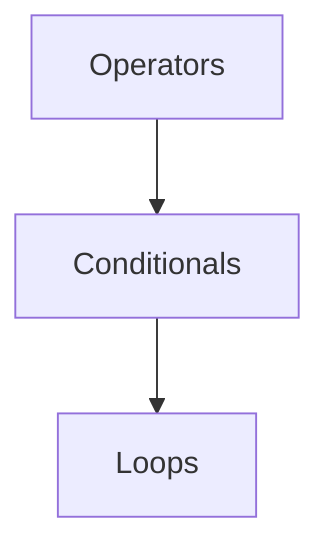

Теперь программа может выполнять алгоритмы:

```text
calculate
decide
repeat
```

Но остается последний вопрос раздела:

> Что происходит, когда выполнение не может продолжаться нормально?

Например, тест requests user profile. Server returns invalid JSON.

Вопрос:

```text
Should program continue as if data is valid?
Should it stop?
Should it report error?
Should it clean up resources?
```

Главный вопрос этой главы:

> Что теперь происходит с выполнением?

---

## Предварительные требования

Для этой главы нужно понимать:

* что JavaScript executes code line by line in normal flow;
* что conditionals choose paths;
* что loops repeat actions;
* что functions will be studied next;
* что `JSON.parse` converts JSON text into JavaScript value at a high level;
* что invalid data can make operation fail.

Не требуется знать custom Error classes, async error handling, Promise rejection, Event Loop interaction, Node.js process errors, browser global handlers or stack trace internals. Эти темы будут изучаться позже.

---

## Время изучения

Ориентировочное время:

```text
Чтение главы:            110-140 минут
Разбор схем:             40-55 минут
Запуск примеров:         25-35 минут
Практика:                100-130 минут
Повторение материала:    30 минут
```

Уровень сложности: **L3**.

Error handling не про скрытие failures. Он про решение, что должно произойти, когда normal execution прерывается.

---

## Навигация

Предыдущая глава:

```text
docs/01-javascript/19-loops.md
```

Текущая глава:

```text
docs/01-javascript/20-error-handling.md
```

Следующая глава:

```text
docs/01-javascript/21-function-declaration.md
```

Следующая глава begins Functions: the next abstraction for grouping reusable поведение.

---

## Цели обучения

После изучения этой главы вы будете понимать:

* what an error is;
* difference between normal execution and abnormal execution;
* what runtime errors are;
* why programs stop;
* what `throw` does;
* what `try` marks;
* what `catch` handles;
* what `finally` guarantees at a high level;
* how errors propagate conceptually;
* how to choose where to handle errors;
* common mistakes in error handling;
* how error handling appears in Automation QA.

---

## Мотивация

Начнем with real QA problem.

Test requests user profile. Server возвращает:

```text
{ "id": 101, "name": "Anna"
```

This text is invalid JSON.

Program tries to parse it:

```javascript
JSON.parse('{ "id": 101, "name": "Anna"');
```

Вопрос:

```text
Should program continue?
```

If parsing failed, there is no valid object to validate.

Normal execution:

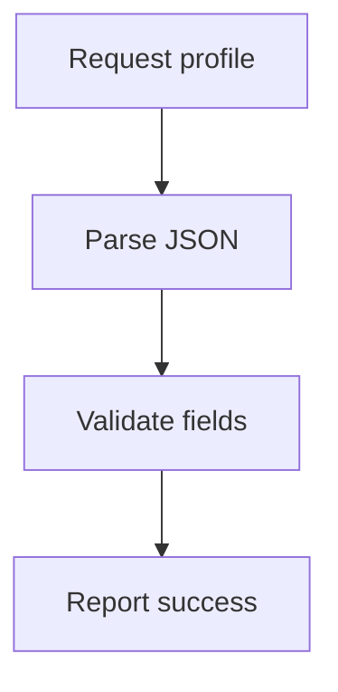

Error during execution:

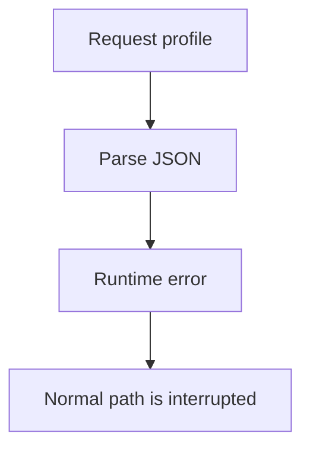

Что теперь происходит с выполнением?

That is the purpose of error handling.

---

## Теория

### Normal execution

Normal execution means code can continue step by step.

Normal execution схема:

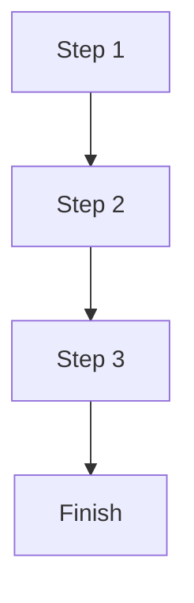

Пример:

```javascript
const rawBody = '{ "id": 101 }';
const body = JSON.parse(rawBody);

console.log(body.id);
```

Safe execution model:

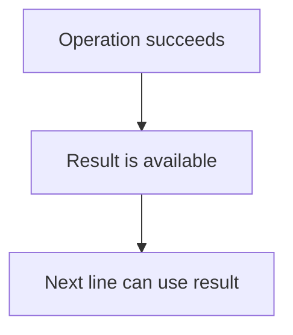

### Что такое error

An error is a signal that normal execution cannot continue as expected.

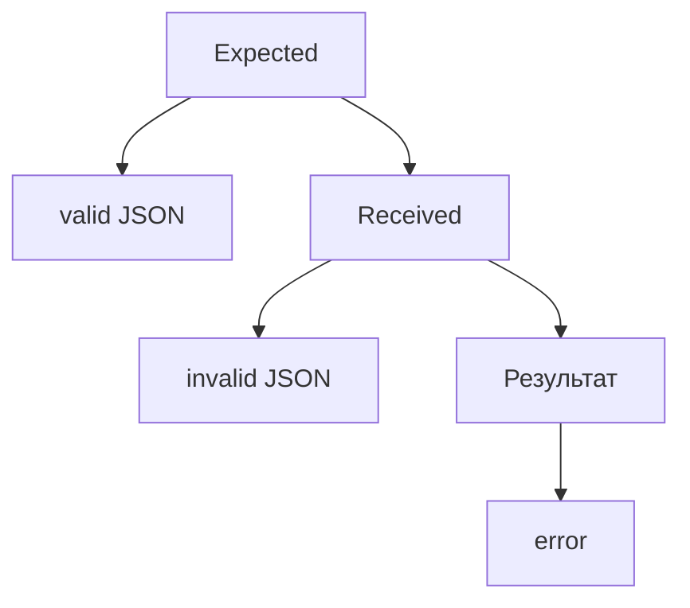

Error is not just "bad вывод". It changes execution flow.

### Abnormal execution

Abnormal execution происходит, когда операция падает и normal path прерывается.

Abnormal execution схема:

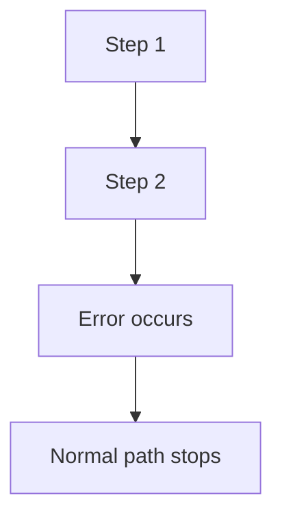

Что теперь происходит с выполнением?

```text
Either error is handled
or it continues upward and program/test stops.
```

### Runtime errors

Runtime error happens while program is running.

```javascript
JSON.parse('not valid json');
```

Runtime error схема:

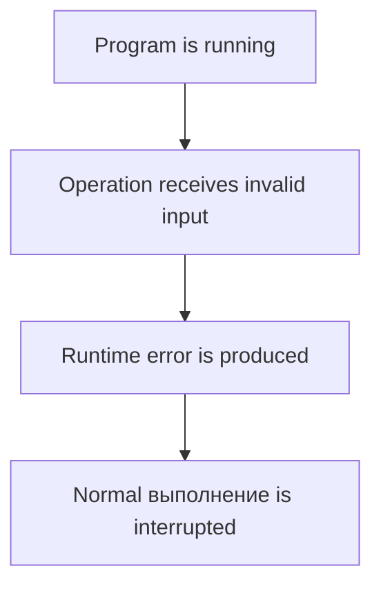

Эта глава не объясняет внутреннее устройство stack trace. Stack traces будут изучены позже, когда отладка станет глубже.

### Почему программы останавливаются

If an error is not handled, JavaScript cannot safely continue the normal path.

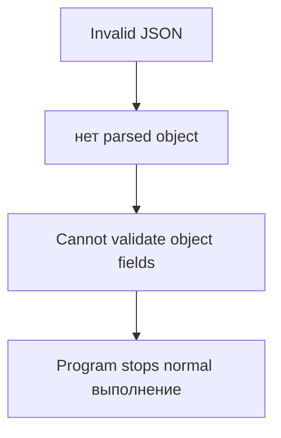

Continue vs stop:

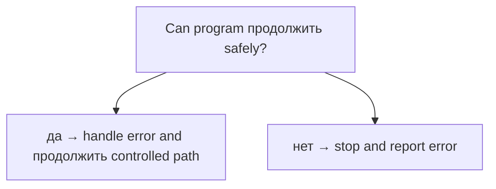

### `throw`

`throw` creates an error path intentionally.

```javascript
const statusCode = 500;

if (statusCode !== 200) {
  throw new Error('Expected status 200');
}
```

`throw` схема:

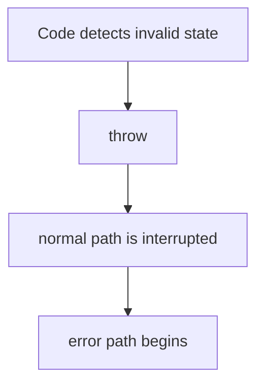

Что теперь происходит с выполнением?

```text
Statements after throw in the same normal path do not run.
```

Custom Error classes — будущая тема. Эта глава использует встроенный `Error`.

### `try`

`try` marks a block where an error may happen.

```javascript
try {
  const body = JSON.parse(rawBody);
  console.log(body.id);
}
```

`try` схема:

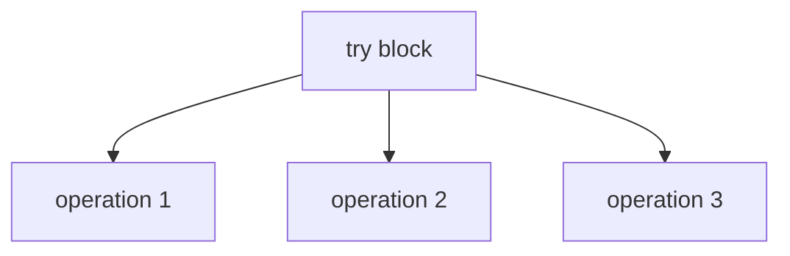

`try` alone is not enough. It needs `catch` or `finally`.

### `catch`

`catch` handles error from `try`.

```javascript
try {
  const body = JSON.parse(rawBody);
  console.log(body.id);
} catch (error) {
  console.log('Could not parse response');
}
```

`catch` схема:

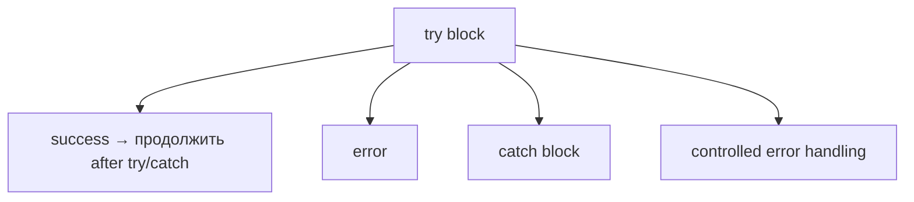

Что теперь происходит с выполнением?

```text
Error is handled by catch block.
Program can continue after catch if appropriate.
```

### `finally`

`finally` runs after `try` / `catch`, whether error happened or not.

```javascript
try {
  console.log('Start validation');
} catch (error) {
  console.log('Handle error');
} finally {
  console.log('Cleanup');
}
```

`finally` схема:

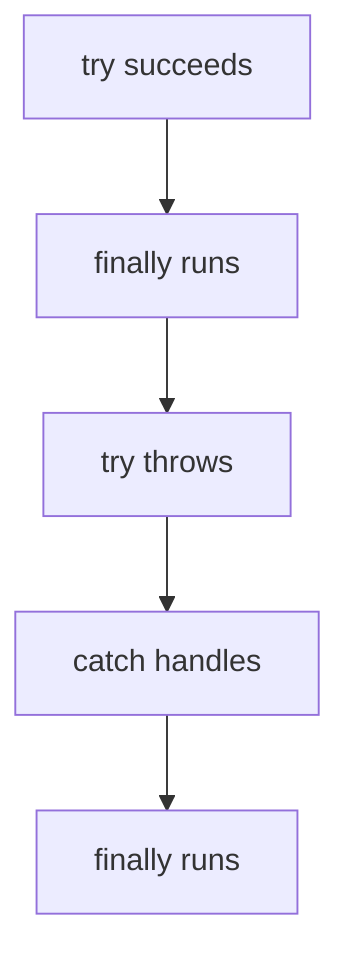

At a high level, `finally` is used for cleanup-like work.

### try/catch flow

Try/catch поток:

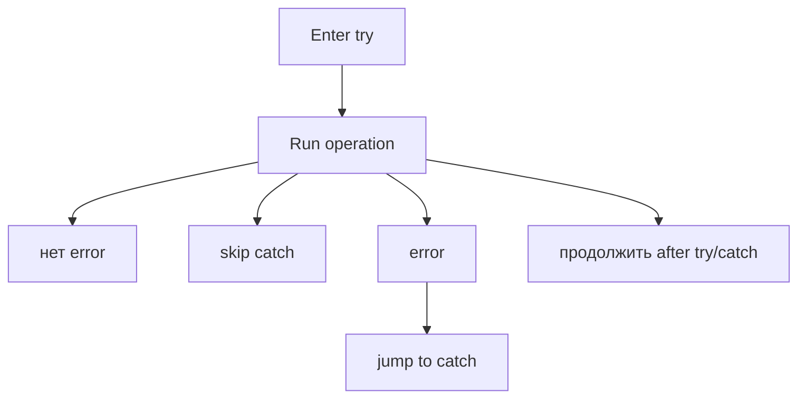

Exception path:

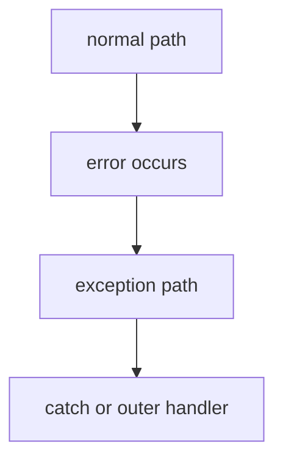

### Error propagation

If current place does not handle error, error propagates upward conceptually.

Error propagation схема:

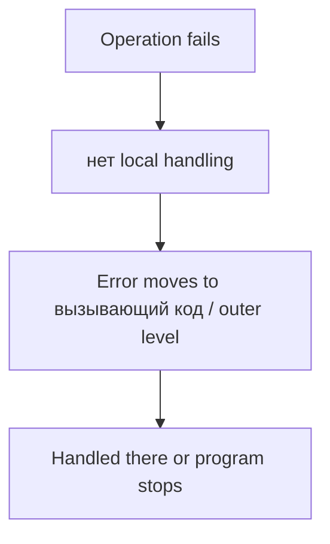

Functions will make this model more important. They are the next chapter block.

### Choosing where to handle errors

Not every error should be handled immediately.

Decision after error:

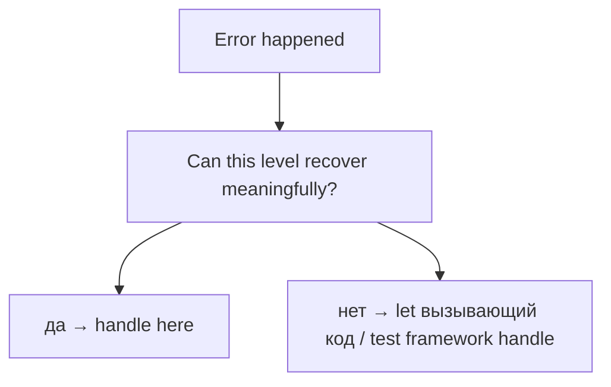

In Automation QA:

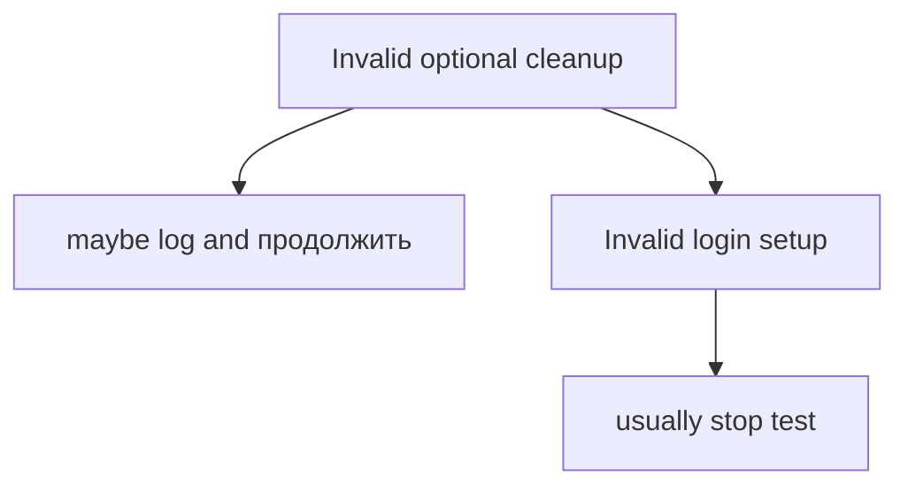

### Multiple operations

Multiple operations in `try`:

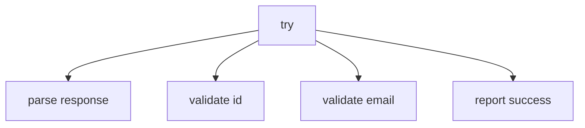

If parse fails:

```mermaid
flowchart TD
    N1["parse response"]
    N2["error"]
    N3["validate id does not run"]
    N4["catch handles"]
    N1 --> N2
    N2 --> N3
    N3 --> N4
```

Что теперь происходит с выполнением?

```text
Execution jumps from failing operation to error handling path.
```

---

## Внутренний механизм

Концептуально:

```text
Normal execution flows forward.
Error interrupts normal execution.
Error handling decides what happens next.
```

Error lifecycle:

```mermaid
flowchart TD
    N1["Operation starts"]
    N2["Failure occurs"]
    N3["Error is created / thrown"]
    N4["Normal path interrupted"]
    N5["Handler searched conceptually"]
    N6["found → catch runs"]
    N7["not found → program/test stops"]
    N8["finally may run"]
    N1 --> N2
    N2 --> N3
    N3 --> N4
    N4 --> N5
    N5 --> N6
    N5 --> N7
    N5 --> N8
```

Complete error handling picture:

```mermaid
flowchart TD
    N1["try"]
    N2["normal operation"]
    N3["success → skip catch"]
    N4["failing operation"]
    N5["error → catch"]
    N6["handle/log/decide"]
    N7["finally"]
    N8["продолжить or stop"]
    N1 --> N2
    N1 --> N3
    N1 --> N4
    N4 --> N5
    N1 --> N6
    N1 --> N7
    N7 --> N8
```

Текущее место в модели JavaScript:

```mermaid
flowchart TD
    N1["Values"]
    N2["Operators"]
    N3["Conditionals"]
    N4["Loops"]
    N5["Error Handling"]
    N6["Functions"]
    N1 --> N2
    N2 --> N3
    N3 --> N4
    N4 --> N5
    N5 --> N6
```

Переход к Functions:

```mermaid
flowchart TD
    N1["Repeated or grouped behavior"]
    N2["Needs a name and reusable boundary"]
    N3["Functions"]
    N1 --> N2
    N2 --> N3
```

Functions сделают error propagation понятнее, потому что errors часто проходят через границы функций.

---

## Ментальная модель

### Emergency stop button

```mermaid
flowchart TD
    N1["Factory line running"]
    N2["Emergency stop pressed"]
    N3["Normal production stops"]
    N4["Safety procedure starts"]
    N1 --> N2
    N2 --> N3
    N3 --> N4
```

Error is the emergency stop for normal execution.

### Factory failure

```mermaid
flowchart TD
    N1["Machine expects valid part"]
    N2["Broken part arrives"]
    N3["Machine cannot продолжить normal operation"]
    N4["Failure handling needed"]
    N1 --> N2
    N2 --> N3
    N3 --> N4
```

### Blocked railway

```mermaid
flowchart TD
    N1["Train moves forward"]
    N2["Track blocked"]
    N3["Train cannot продолжить normal route"]
    N4["Dispatcher chooses next action"]
    N1 --> N2
    N2 --> N3
    N3 --> N4
```

### Airport security stop

```mermaid
flowchart TD
    N1["Passenger proceeds normally"]
    N2["Problem detected"]
    N3["Normal flow interrupted"]
    N4["Security handling path"]
    N1 --> N2
    N2 --> N3
    N3 --> N4
```

### Interrupted conveyor

```mermaid
flowchart TD
    N1["Item moves on conveyor"]
    N2["Invalid item detected"]
    N3["Conveyor pauses or redirects"]
    N1 --> N2
    N2 --> N3
```

Program execution normally flows forward. Errors interrupt normal execution. Error handling decides what happens next.

---

## Примеры кода

Все примеры находятся в:

```text
examples/01-javascript/chapter-20/
```

Запуск:

```bash
node examples/01-javascript/chapter-20/01-runtime-error.js
node examples/01-javascript/chapter-20/02-throw.js
node examples/01-javascript/chapter-20/03-try-catch.js
node examples/01-javascript/chapter-20/04-finally.js
node examples/01-javascript/chapter-20/05-common-mistakes.js
node examples/01-javascript/chapter-20/06-qa-example.js
```

### 01-runtime-error.js

Shows runtime error caused by invalid JSON, handled so example can continue.

### 02-throw.js

Shows intentional error path with `throw`.

### 03-try-catch.js

Shows controlled handling of parsing failure.

### 04-finally.js

Shows cleanup path.

### 05-common-mistakes.js

Shows catching error but hiding useful information.

### 06-qa-example.js

Shows API validation scenario.

---

## Частые вопросы

### Should every error be caught?

Нет. Ловите errors, когда текущий уровень может осмысленно их обработать. Иначе дайте им уронить тест или распространиться дальше.

### Is catch for ignoring errors?

No. Catch is for handling errors. Ignoring errors usually hides real problems.

### Does finally mean success?

No. `finally` runs after success or failure. It does not mean operation succeeded.

### Are assertion failures errors?

In test frameworks, assertion failures are represented as failures/errors. Framework-specific mechanics will be studied later.

### Как работают async errors?

Async error handling, Promise rejection and Event Loop interaction will be studied later.

---

## Распространенные мифы

### Миф: Error handling makes errors disappear

Реальность:

Error handling decides what to do with errors.

### Миф: catch should always continue execution

Реальность:

Sometimes correct поведение is to stop.

### Миф: finally выполняется только когда есть error

Реальность:

`finally` runs after both success and failure paths.

### Миф: All errors should be handled at the place they happen

Реальность:

Handle errors where meaningful action can be taken.

Типичные ошибки:

```mermaid
flowchart TD
    N1["Mistake"]
    N2["swallow error"]
    N3["catch too broadly"]
    N4["продолжить after critical failure"]
    N5["forget cleanup"]
    N6["hide original error message"]
    N1 --> N2
    N1 --> N3
    N1 --> N4
    N1 --> N5
    N1 --> N6
```

---

## Типичные ошибки

### Ошибка 1. Swallow error

```javascript
try {
  JSON.parse(rawBody);
} catch (error) {
}
```

The test loses information.

### Ошибка 2. Continue after critical setup failure

If login setup failed, continuing test may produce misleading failures.

### Ошибка 3. Catch too much

One large `try` block around unrelated operations makes it hard to know what failed.

### Ошибка 4. Forget finally cleanup

If setup created temporary data, cleanup may be needed even after error.

### Ошибка 5. Throw unclear error

```javascript
throw new Error('Failed');
```

Лучше:

```javascript
throw new Error('Expected status 200, received 500');
```

---

## Практическое использование

Use error handling when:

```text
operation can fail
failure has a meaningful recovery/reporting path
cleanup must happen
error message should be improved
```

Практический чек-лист:

```text
1. What operation can fail?
2. Can current code handle it meaningfully?
3. Should execution continue or stop?
4. What should be logged?
5. Is cleanup needed?
6. Should error propagate?
```

---

## Использование в Automation QA

### Assertion failures

Assertions падают, когда expected condition не выполнено. Test frameworks обрабатывают такие failures. Детали framework будут позже.

### API validation

```javascript
if (statusCode !== 200) {
  throw new Error(`Expected status 200, received ${statusCode}`);
}
```

QA failure example:

```mermaid
flowchart TD
    N1["API response"]
    N2["statusCode = 500"]
    N3["throw error"]
    N4["test stops with clear message"]
    N1 --> N2
    N2 --> N3
    N3 --> N4
```

### Parsing JSON

```javascript
try {
  const body = JSON.parse(rawBody);
  console.log(body.id);
} catch (error) {
  console.log('Invalid JSON response');
}
```

### Failing test setup

If setup cannot create user, test should usually stop.

```mermaid
flowchart TD
    N1["setup failed"]
    N2["нет valid test data"]
    N3["stop test"]
    N1 --> N2
    N2 --> N3
```

### Logging errors

Log enough context:

```text
which operation failed
what input was used
what was expected
what error message appeared
```

### Cleanup in finally

```javascript
try {
  console.log('Create temporary user');
} finally {
  console.log('Delete temporary user');
}
```

Cleanup logic in real frameworks will be studied later.

### Deciding whether test should stop

```mermaid
flowchart TD
    N1["Can test still validate target behavior?"]
    N2["да → handle and продолжить carefully"]
    N3["нет → stop with clear error"]
    N1 --> N2
    N1 --> N3
```

---

## Итоги

Error Handling completes the Program Control section.

Основная модель:

```text
Programs execute normally until an error interrupts execution.
Errors do not disappear automatically.
JavaScript provides mechanisms for deciding how execution continues.
```

Main constructs:

```text
throw
try
catch
finally
```

Final section bridge:

```mermaid
flowchart TD
    N1["Values"]
    N2["Operators"]
    N3["Conditionals"]
    N4["Loops"]
    N5["Error Handling"]
    N6["Functions"]
    N1 --> N2
    N2 --> N3
    N3 --> N4
    N4 --> N5
    N5 --> N6
```

Functions are the next abstraction: they let us give names to reusable поведение and create clearer boundaries for execution and errors.

---

## Что нужно запомнить

* Normal execution flows forward.
* Runtime errors interrupt normal execution.
* Error handling decides what happens next.
* `throw` starts error path intentionally.
* `try` marks code that may fail.
* `catch` handles error.
* `finally` runs after success or failure.
* Errors can propagate conceptually to outer levels.
* Do not catch errors just to hide them.
* In QA, errors should produce useful failure information.
* Cleanup часто относится к `finally`.
* Functions are the next abstraction after program control.

---

## Проверьте себя

Ответьте без запуска кода.

1. Что такое normal execution?
2. Что такое abnormal execution?
3. Что такое runtime error?
4. Почему программа может остановиться после error?
5. Что делает `throw`?
6. Что отмечает `try`?
7. Что делает `catch`?
8. Что гарантирует `finally` на высоком уровне?
9. When should error be handled locally?
10. Как эта глава ведёт к Functions?

---

## Практика

Практика находится в файле:

```text
practice/01-javascript/20-error-handling.md
```

Сначала решайте predict вывод задания без запуска. Главная цель - понять execution поток: normal path, error path, catch, finally.

---

## Решения

Решения находятся в файле:

```text
solutions/01-javascript/20-error-handling.md
```

Читайте решения после самостоятельной попытки. Проверяйте reasoning: what happens to execution now?
