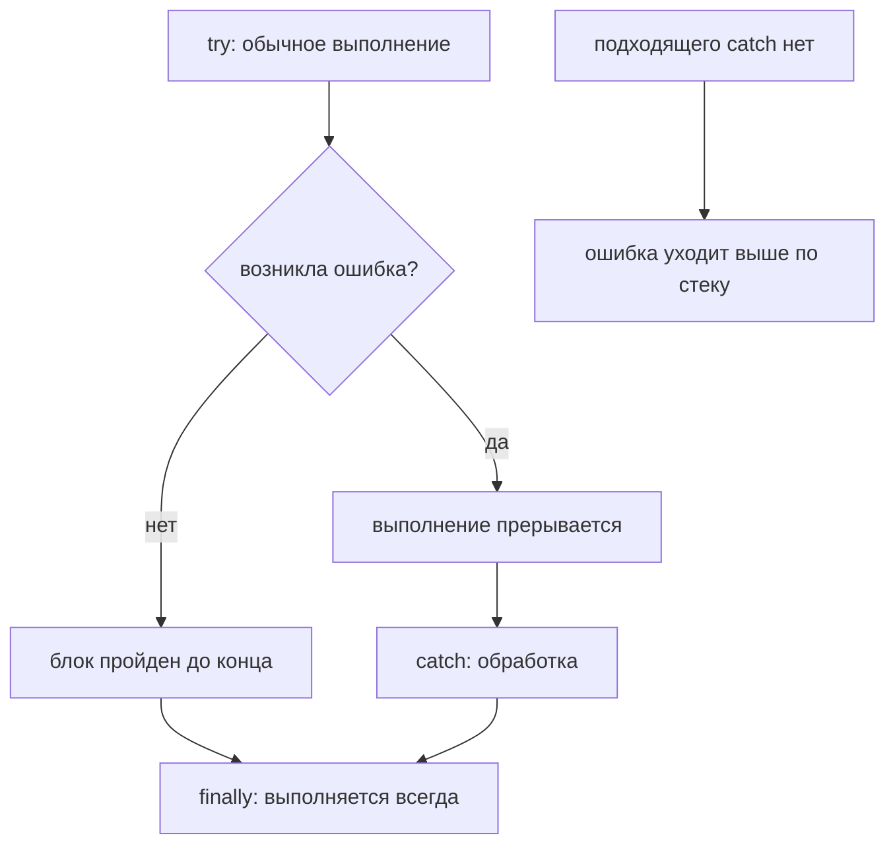

# Обработка ошибок

## Связь с предыдущей главой

Предыдущие главы раздела **Program Control** объяснили:

Теперь программа может выполнять алгоритмы:

```text
calculate
decide
repeat
```

Но остается последний вопрос раздела:

> Что происходит, когда выполнение не может продолжаться нормально?

Например, тест requests user profile. Server returns invalid JSON.

Вопрос:

```text
Should program continue as if data is valid?
Should it stop?
Should it report error?
Should it clean up resources?
```

Главный вопрос этой главы:

> Что теперь происходит с выполнением?

---

## Предварительные требования

Для этой главы нужно понимать:

* что JavaScript executes code line by line in normal flow;
* что conditionals choose paths;
* что loops repeat actions;
* что functions will be studied next;
* что `JSON.parse` converts JSON text into JavaScript value at a high level;
* что invalid data can make operation fail.

Не требуется знать custom Error classes, async error handling, Promise rejection, Event Loop interaction, Node.js process errors, browser global handlers or stack trace internals. Эти темы будут изучаться позже.

---

## Время изучения

Ориентировочное время:

```text
Чтение главы:            110-140 минут
Разбор схем:             40-55 минут
Запуск примеров:         25-35 минут
Практика:                100-130 минут
Повторение материала:    30 минут
```

Уровень сложности: **L3**.

Error handling не про скрытие failures. Он про решение, что должно произойти, когда normal execution прерывается.

---

## Навигация

Предыдущая глава:

```text
docs/01-javascript/19-loops.md
```

Текущая глава:

```text
docs/01-javascript/20-error-handling.md
```

Следующая глава:

```text
docs/01-javascript/21-function-declaration.md
```

Следующая глава begins Functions: the next abstraction for grouping reusable поведение.

---

## Цели обучения

После изучения этой главы вы будете понимать:

* what an error is;
* difference between normal execution and abnormal execution;
* what runtime errors are;
* why programs stop;
* what `throw` does;
* what `try` marks;
* what `catch` handles;
* what `finally` guarantees at a high level;
* how errors propagate conceptually;
* how to choose where to handle errors;
* common mistakes in error handling;
* how error handling appears in Automation QA.

---

## Мотивация

Начнем with real QA problem.

Test requests user profile. Server возвращает:

```text
{ "id": 101, "name": "Anna"
```

This text is invalid JSON.

Program tries to parse it:

```javascript
JSON.parse('{ "id": 101, "name": "Anna"');
```

Вопрос:

```text
Should program continue?
```

If parsing failed, there is no valid object to validate.

Normal execution:

Error during execution:

Что теперь происходит с выполнением?

That is the purpose of error handling.

---

## Теория

### Обычное выполнение

Нормальное выполнение означает, что код может продолжаться шаг за шагом.

Схема нормального выполнения:

```text
строка 1 → строка 2 → строка 3 → результат
```

Пример:

```javascript
const rawBody = '{ "id": 101 }';
const body = JSON.parse(rawBody);

console.log(body.id);
```

Модель безопасного выполнения:

```text
тело ответа — валидный JSON   →  разбор удался, строка console.log выполняется
тело ответа — не JSON          →  разбор падает, следующая строка не выполняется
```

Безопасное выполнение означает не «ошибок не будет», а «для ошибки заранее
описан путь».

### Что такое ошибка

Ошибка — сигнал о том, что нормальное выполнение не может продолжаться как задумано.

Ошибка — это не просто «плохой вывод». Она меняет ход выполнения.

### Аварийное выполнение

Аварийное выполнение происходит, когда операция падает и нормальный путь прерывается.

Схема аварийного выполнения:

```text
строка 1 → строка 2 → ОШИБКА
           оставшиеся строки не выполняются
```

Что теперь происходит с выполнением?

```text
Either error is handled
or it continues upward and program/test stops.
```

### Ошибки времени выполнения

Ошибка времени выполнения возникает во время работы программы.

```javascript
JSON.parse('not valid json');
```

Схема ошибки времени выполнения:

```text
ошибка возникает во время выполнения,
а не при разборе синтаксиса
```

Эта глава не объясняет внутреннее устройство трассировки стека. Трассировки будут изучены позже, когда разбор падений станет глубже.

### Почему программы останавливаются

Если ошибка не обработана, JavaScript не может безопасно продолжать нормальный путь.

Продолжить или остановиться:

```text
ошибка обработана     →  выполнение продолжается по запасному пути
ошибка не обработана  →  выполнение текущего пути прекращается
```

Продолжать нормальный путь после ошибки означало бы работать с данными,
которых нет.

### `throw`

`throw` намеренно создаёт путь ошибки.

```javascript
const statusCode = 500;

if (statusCode !== 200) {
  throw new Error('Expected status 200');
}
```

`throw` схема:

```text
throw new Error('...')  →  выполнение прерывается,
                           ошибка поднимается наверх
```

Что теперь происходит с выполнением?

```text
Statements after throw in the same normal path do not run.
```

Собственные классы ошибок — будущая тема. Эта глава использует встроенный `Error`.

### `try`

`try` помечает блок, в котором может возникнуть ошибка.

```javascript
try {
  const body = JSON.parse(rawBody);
  console.log(body.id);
}
```

`try` схема:

```text
try { код, который может упасть }
```

Одного `try` недостаточно. Ему нужен `catch` или `finally`.

### `catch`

`catch` обрабатывает ошибку из `try`.

```javascript
try {
  const body = JSON.parse(rawBody);
  console.log(body.id);
} catch (error) {
  console.log('Could not parse response');
}
```

`catch` схема:

```text
ошибка внутри try  →  управление переходит в catch
```

Что теперь происходит с выполнением?

```text
Error is handled by catch block.
Program can continue after catch if appropriate.
```

### `finally`

`finally` выполняется после `try` и `catch` независимо от того, была ли ошибка.

```javascript
try {
  console.log('Start validation');
} catch (error) {
  console.log('Handle error');
} finally {
  console.log('Cleanup');
}
```

`finally` схема:

```text
finally выполняется всегда:
и при успехе, и при ошибке
```

На высоком уровне `finally` используют для завершающих действий вроде очистки.

### Ход выполнения `try` и `catch`

Поток `try` и `catch`:

```text
try      →  код выполнился без ошибок  →  catch пропускается
         →  finally выполняется
```

Путь исключения:

```text
try      →  строка упала  →  оставшиеся строки try пропускаются
         →  catch получает объект ошибки и выполняется
         →  finally выполняется
```

`finally` выполняется в обоих случаях — на этом и строится очистка.

### Распространение ошибки

Если текущее место не обрабатывает ошибку, она концептуально поднимается выше.

Схема подъёма ошибки:

```text
ошибка не обработана здесь  →  поднимается к вызывающему коду
не обработана нигде         →  программа завершается
```

Функции сделают эту модель важнее. Они идут следующим блоком.

### Где обрабатывать ошибки

Не каждую ошибку нужно обрабатывать немедленно.

Решение после ошибки:

```text
здесь известно, что делать дальше   →  обработать ошибку на месте
здесь известно только, что упало    →  дать ошибке подняться выше
```

В автоматизации тестов:

```text
ошибка разбора ответа  →  обработать: тест может сообщить понятную причину
ошибка сети в шаге     →  обычно пропустить наверх: тест должен упасть
```

Поглощённая ошибка опаснее упавшего теста: тест продолжается на неверных
данных и падает позже, в неочевидном месте.

### Несколько операций

```javascript
try {
  const raw = readResponse();      // 1
  const data = JSON.parse(raw);    // 2 — здесь возможна ошибка
  saveReport(data);                // 3
} catch (error) {
  console.log('не удалось обработать ответ');
}
```

Если разбор на шаге 2 не удался, шаг 3 **не выполняется**: управление сразу
переходит в `catch`.

```text
Выполнение переходит от упавшей операции к обработчику ошибки.
```

---

Ошибка меняет маршрут выполнения, а не завершает его сразу:


```mermaid
flowchart TD
    A["try: обычное выполнение"] --> B{"возникла ошибка?"}
    B -- "нет" --> C["блок пройден до конца"]
    B -- "да" --> D["выполнение прерывается"]
    D --> E["catch: обработка"]
    C --> F["finally: выполняется всегда"]
    E --> F
    G["подходящего catch нет"] --> H["ошибка уходит выше по стеку"]
```

## Внутренний механизм

Концептуально:

```text
Обычное выполнение идёт вперёд.
Ошибка прерывает обычное выполнение.
Обработка ошибки решает, что произойдёт дальше.
```

Время жизни ошибки:

```text
1. операция не может выполниться → создан объект ошибки
2. выполнение прерывается на этой строке
3. ищется ближайший подходящий catch
4. нашли    → выполняется catch, затем finally, дальше код продолжается
   не нашли  → ошибка уходит выше по стеку вызовов
5. не поймали нигде → программа завершается с ненулевым кодом
```

Шаг 5 объясняет, почему необработанная ошибка в тестовом прогоне роняет весь
процесс, а не один шаг.

Функции сделают подъём ошибок понятнее, потому что ошибки часто проходят через границы функций.

---

## Ментальная модель

### Кнопка аварийной остановки

Ошибка — аварийная остановка нормального выполнения.

### Остановка на производстве

Неисправная деталь останавливает линию, а не едет дальше по конвейеру: иначе
брак попадёт в готовое изделие.

### Перекрытый путь

Ошибка перекрывает основной путь выполнения. `catch` — это стрелка на запасную
ветку: если её нет, состав просто не едет дальше.

### Досмотр в аэропорту

Проверка либо пропускает дальше, либо останавливает — промежуточного
«пропустим и разберёмся потом» нет.

### Остановленный конвейер

Обычно выполнение программы движется вперёд. Ошибки его прерывают. Обработка ошибок решает, что будет дальше.

---

## Примеры кода

Все примеры находятся в:

```text
examples/01-javascript/chapter-20/
```

Запуск:

```bash
node examples/01-javascript/chapter-20/01-runtime-error.js
node examples/01-javascript/chapter-20/02-throw.js
node examples/01-javascript/chapter-20/03-try-catch.js
node examples/01-javascript/chapter-20/04-finally.js
node examples/01-javascript/chapter-20/05-common-mistakes.js
node examples/01-javascript/chapter-20/06-qa-example.js
```

### 01-runtime-error.js

Показывает ошибку времени выполнения из-за неверного JSON, обработанную так, чтобы пример мог продолжиться.

### 02-throw.js

Показывает намеренный путь ошибки через `throw`.

### 03-try-catch.js

Показывает контролируемую обработку неудачного разбора.

### 04-finally.js

Показывает путь очистки.

### 05-common-mistakes.js

Показывает перехват ошибки с потерей полезной информации.

### 06-qa-example.js

Показывает сценарий проверки API.

---

## Частые вопросы

### Нужно ли ловить каждую ошибку?

Нет. Ловите ошибки, когда текущий уровень может осмысленно их обработать. Иначе дайте им уронить тест или подняться выше.

### `catch` нужен, чтобы игнорировать ошибки?

Нет. `catch` нужен, чтобы их обрабатывать. Игнорирование обычно прячет настоящие проблемы.

### `finally` означает успех?

Нет. `finally` выполняется и после успеха, и после ошибки. Он не означает, что операция удалась.

### Падение проверки — это ошибка?

В тестовых фреймворках падение проверки представлено как ошибка. Механика конкретных фреймворков будет изучаться позже.

### Как работают ошибки в асинхронном коде?

Обработка асинхронных ошибок, отклонение промисов и взаимодействие с событийным циклом будут изучаться позже.

---

## Распространённые мифы

### Миф: обработка ошибок заставляет ошибки исчезнуть

Реальность:

Обработка ошибок решает, что с ними делать.

### Миф: `catch` всегда должен продолжать выполнение

Реальность:

Иногда правильное поведение — остановиться.

### Миф: `finally` выполняется, только когда есть ошибка

Реальность:

`finally` выполняется и после успеха, и после отказа.

### Миф: все ошибки нужно обрабатывать там, где они произошли

Реальность:

Обрабатывайте ошибки там, где можно предпринять осмысленное действие.

---

## Распространённые ошибки

### Ошибка 1. Проглотить ошибку

```javascript
try {
  JSON.parse(rawBody);
} catch (error) {
}
```

Тест теряет информацию.

### Ошибка 2. Продолжать после отказа в критичной подготовке

Если подготовка входа не удалась, продолжение теста даст вводящие в заблуждение падения.

### Ошибка 3. Ловить слишком много

Один большой блок `try` вокруг несвязанных операций мешает понять, что именно упало.

### Ошибка 4. Забыть про очистку в `finally`

Если подготовка создала временные данные, очистка может понадобиться даже после ошибки.

### Ошибка 5. Бросить непонятную ошибку

```javascript
throw new Error('Failed');
```

Лучше:

```javascript
throw new Error('Expected status 200, received 500');
```

---

## Практическое использование

Используйте обработку ошибок, когда:

```text
operation can fail
failure has a meaningful recovery/reporting path
cleanup must happen
error message should be improved
```

Практический чек-лист:

```text
1. What operation can fail?
2. Can current code handle it meaningfully?
3. Should execution continue or stop?
4. What should be logged?
5. Is cleanup needed?
6. Should error propagate?
```

---

## Использование в Automation QA

### Непройденные проверки

Проверки падают, когда ожидаемое условие не выполнено. Тестовые фреймворки обрабатывают такие падения. Детали фреймворков будут позже.

### Проверка ответа API

```javascript
if (statusCode !== 200) {
  throw new Error(`Expected status 200, received ${statusCode}`);
}
```

Пример падения:

```text
без throw:  тест продолжится и будет искать поля в теле ошибки
с throw:    тест останавливается там, где ответ впервые оказался не тем
```

### Разбор JSON

```javascript
try {
  const body = JSON.parse(rawBody);
  console.log(body.id);
} catch (error) {
  console.log('Invalid JSON response');
}
```

### Отказ при подготовке теста

Если подготовка не может создать пользователя, тест обычно должен остановиться.

### Запись ошибок в журнал

Записывайте достаточно контекста:

```text
which operation failed
what input was used
what was expected
what error message appeared
```

### Очистка в `finally`

```javascript
try {
  console.log('Create temporary user');
} finally {
  console.log('Delete temporary user');
}
```

Очистка в настоящих фреймворках будет изучаться позже.

### Как решить, должен ли тест остановиться

---

## Итоги

Обработка ошибок завершает раздел про управление ходом программы.

Основная модель:

```text
Programs execute normally until an error interrupts execution.
Errors do not disappear automatically.
JavaScript provides mechanisms for deciding how execution continues.
```

Основные конструкции:

```text
throw
try
catch
finally
```

Переход к следующему разделу:

Функции — следующая ступень абстракции: они позволяют давать имена переиспользуемому поведению и создают более чёткие границы для выполнения и ошибок.

---

## Что нужно запомнить

* Нормальное выполнение движется вперёд.
* Ошибки времени выполнения его прерывают.
* Обработка ошибок решает, что будет дальше.
* `throw` намеренно начинает путь ошибки.
* `try` помечает код, который может упасть.
* `catch` обрабатывает ошибку.
* `finally` выполняется и после успеха, и после отказа.
* Ошибки концептуально поднимаются на внешние уровни.
* Не ловите ошибки только для того, чтобы их спрятать.
* В тестах ошибки должны давать полезную информацию о падении.
* Очистка часто относится к `finally`.
* Функции — следующая абстракция после управления ходом программы.

---

## Проверьте себя

Ответьте без запуска кода.

1. Что такое нормальное выполнение?
2. Что такое аварийное выполнение?
3. Что такое ошибка времени выполнения?
4. Почему программа может остановиться после ошибки?
5. Что делает `throw`?
6. Что отмечает `try`?
7. Что делает `catch`?
8. Что гарантирует `finally` на высоком уровне?
9. Когда ошибку стоит обработать на месте?
10. Как эта глава ведёт к функциям?

### Ответы

1. Выполнение, при котором строки идут по порядку и каждая операция завершается ожидаемо.
2. Выполнение, прерванное ошибкой: оставшиеся строки текущего пути не выполняются.
3. Ошибка, возникшая во время выполнения, а не при разборе кода: неверный JSON, обращение к свойству отсутствующего объекта, недоступная сеть.
4. Продолжать нормальный путь после ошибки означало бы работать с данными, которых нет. Если ошибка нигде не обработана, выполнение прекращается.
5. Намеренно создаёт ошибку и прерывает нормальный путь выполнения с этого места.
6. Участок кода, во время которого ошибка должна быть перехвачена, а не уйти выше.
7. Получает объект ошибки и выполняет запасной путь.
8. Что его блок выполнится в обоих случаях — и при успехе, и при ошибке. На этом строится освобождение ресурсов.
9. Когда в этом месте известно, что делать дальше: подставить значение по умолчанию или сообщить понятную причину. Если известно только то, что упало, ошибку лучше пропустить выше.
10. Ошибка редко остаётся в одной строке: она поднимается через вызовы. Чтобы понять этот путь, нужно понимать, что такое вызов функции и как он возвращает управление.

---

## Практика

Практика находится в файле:

```text
practice/01-javascript/20-error-handling.md
```

Сначала решайте задания на предсказание вывода без запуска. Главная цель — понять ход выполнения: нормальный путь, путь ошибки, `catch`, `finally`.

---

## Решения

Решения находятся в файле:

```text
solutions/01-javascript/20-error-handling.md
```

Читайте решения после самостоятельной попытки. Проверяйте рассуждение: что происходит с выполнением сейчас?
