# Function Declaration

## Связь с предыдущей главой

Предыдущие главы объяснили, как JavaScript выполняет код, принимает решения, повторяет действия и обрабатывает ошибки.

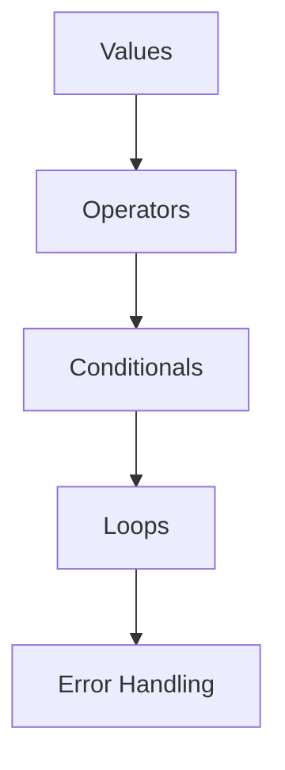

Теперь появляется следующий вопрос:

> Что делать, если один и тот же алгоритм нужно использовать много раз?

Например, проект проверяет API response. Одна и та же логика проверки появляется в десяти тестах.

Вопрос:

```text
Нужно ли копировать этот код десять раз?
```

Нет. Нужен переиспользуемый алгоритм с понятным именем.

Главный вопрос этой главы:

> Какой переиспользуемый алгоритм мы создаем?

---

## Предварительные требования

Для этой главы нужно понимать:

* что код выполняется шаг за шагом;
* что операторы производят результаты;
* что условные конструкции выбирают путь выполнения;
* что циклы повторяют алгоритмы;
* что обработка ошибок управляет ненормальным ходом выполнения;
* что дублированный код сложнее поддерживать.

Не требуется знать параметры, `return`, область видимости внутри функций, function expression, arrow functions, closures, `this`, рекурсию, default parameters или rest parameters. Эти темы будут изучаться в следующих главах.

---

## Время изучения

Ориентировочное время:

```text
Чтение главы:            100-130 минут
Разбор схем:             35-50 минут
Запуск примеров:         20-30 минут
Практика:                90-120 минут
Повторение материала:    25 минут
```

Уровень сложности: **L2-L3**.

Функции выглядят как синтаксис, но настоящая идея архитектурная: функция дает имя переиспользуемому поведению.

---

## Навигация

Предыдущая глава:

```text
docs/01-javascript/20-error-handling.md
```

Текущая глава:

```text
docs/01-javascript/21-function-declaration.md
```

Следующая глава:

```text
docs/01-javascript/22-function-expression.md
```

Следующая глава ответит:

> Бывают ли функции только объявлениями?

---

## Цели обучения

После изучения этой главы вы будете понимать:

* зачем существуют функции;
* почему дублирование кода опасно;
* что означает переиспользуемое поведение;
* как функции дают имена алгоритмам;
* что такое function declaration;
* что означает вызов функции;
* что такое тело функции;
* почему выполнение начинается только после вызова;
* как работают многократные вызовы;
* как функции улучшают читаемость;
* как функции улучшают поддерживаемость;
* как Automation QA использует переиспользуемые helper-функции.

---

## Мотивация

Реальная проблема:

```text
Десять тестов проверяют статус API response.
```

Без функций:

```javascript
const statusCode1 = 200;
if (statusCode1 !== 200) {
  throw new Error('Expected status 200');
}

const statusCode2 = 200;
if (statusCode2 !== 200) {
  throw new Error('Expected status 200');
}
```

Схема дублирования кода:

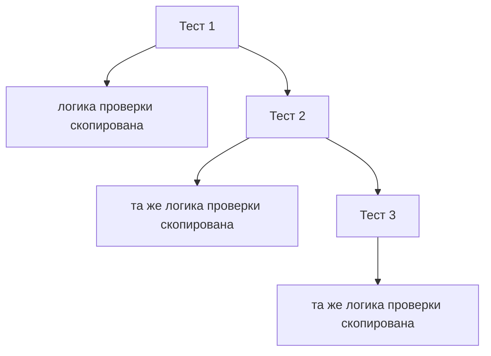

Проблема:

```text
Если правило проверки изменится,
придется обновить каждую копию.
```

Функция решает эту проблему: алгоритм получает имя один раз.

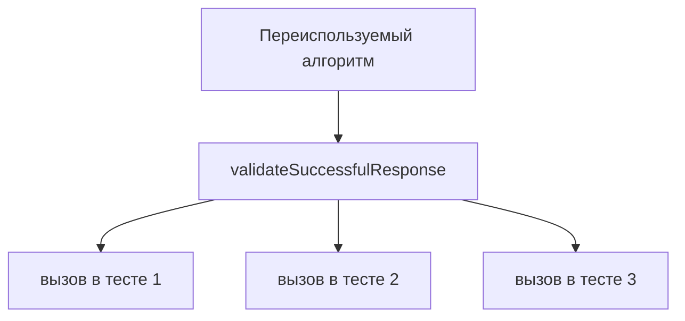

Какой переиспользуемый алгоритм мы создаем?

```text
Проверить, что статус ответа успешный.
```

---

## Теория

### Зачем существуют функции

Функции существуют потому, что программам нужно переиспользуемое поведение.

Без функций:

```text
один и тот же алгоритм скопирован
одна и та же ошибка скопирована
одно и то же будущее изменение повторяется вручную
```

Схема причины появления функций:

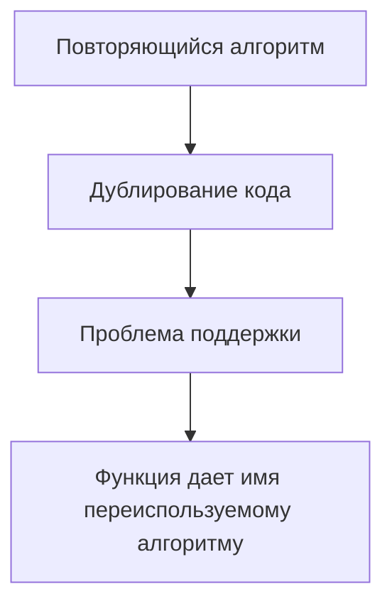

Функция - это именованный переиспользуемый алгоритм.

### Дублирование кода

Дублирование означает, что одна и та же логика появляется в нескольких местах.

Программа до функций:

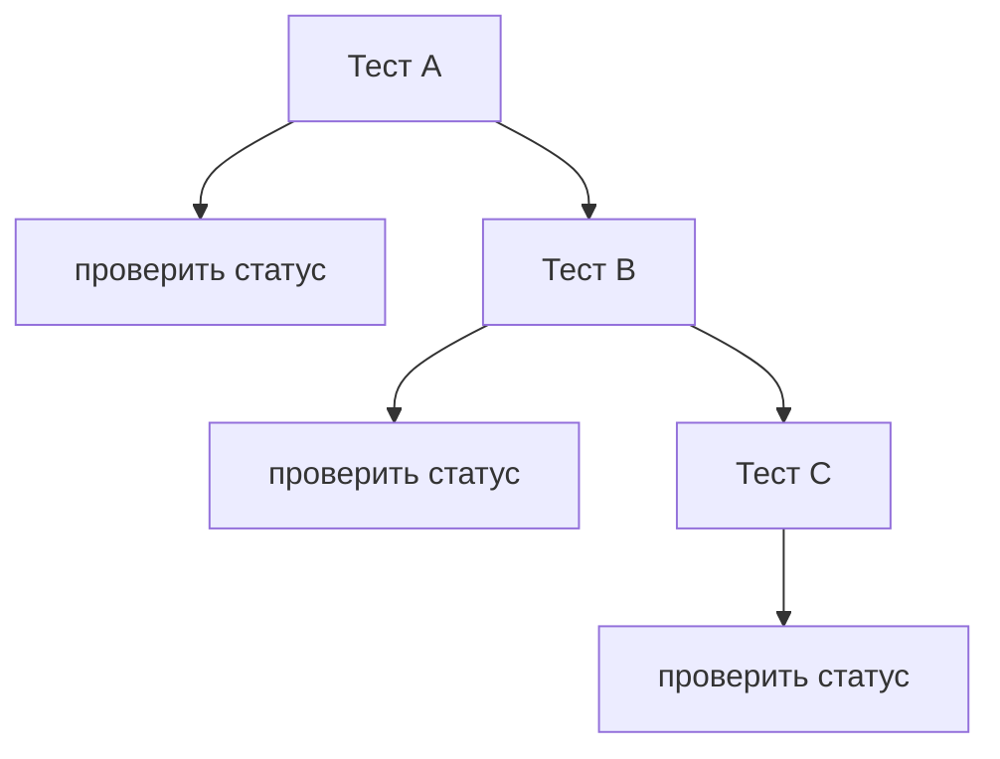

Проблема:

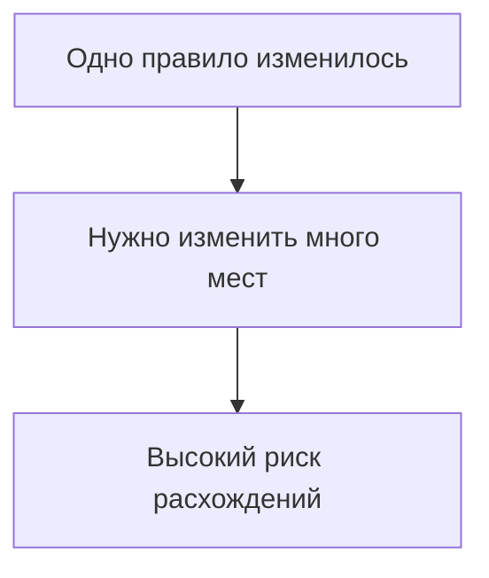

В Automation QA дублированная проверка делает тесты хрупкими.

### Переиспользуемое поведение

Переиспользуемое поведение означает, что один алгоритм можно запускать из разных мест.

Схема переиспользуемого алгоритма:

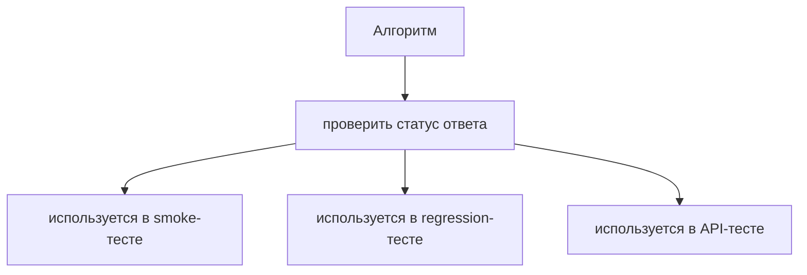

Какой переиспользуемый алгоритм мы создаем?

```text
Одно именованное поведение, которое можно вызывать много раз.
```

### Именование алгоритмов

Хорошее имя функции описывает, что делает алгоритм.

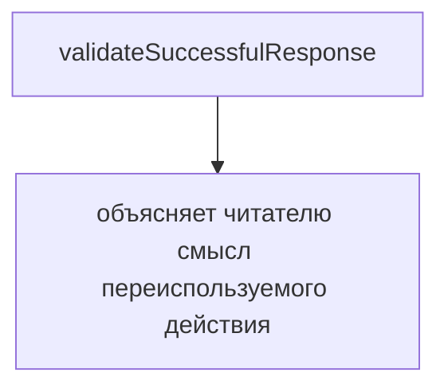

Схема читаемости:

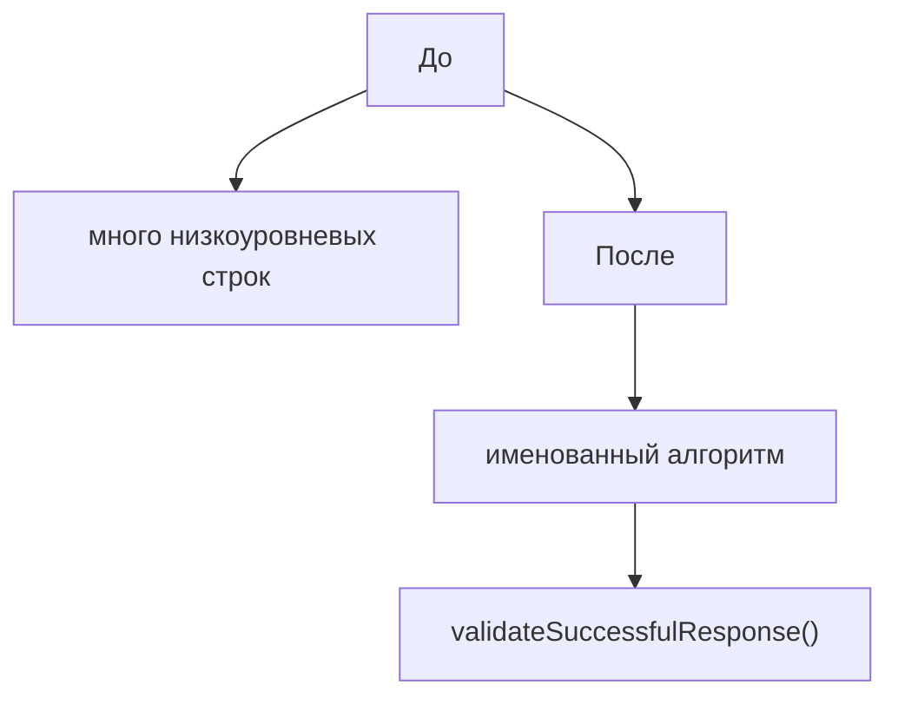

Имя должно выражать намерение, а не деталь реализации.

### Function declaration

Function declaration создает именованную функцию.

```javascript
function validateSuccessfulResponse() {
  const statusCode = 200;

  if (statusCode !== 200) {
    throw new Error('Expected status 200');
  }

  console.log('Response status is valid');
}
```

Схема function declaration:

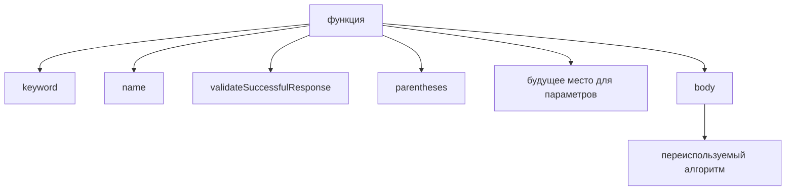

Эта глава не учит параметрам. Скобки уже есть в синтаксисе, но параметры будут изучаться позже.

### Тело функции

Тело функции - это код внутри `{ ... }`.

Схема тела функции:

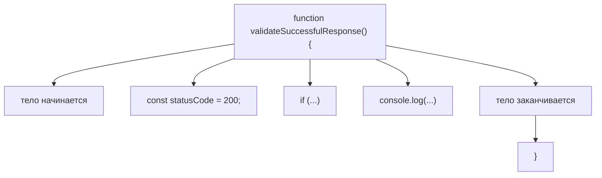

Какой переиспользуемый алгоритм мы создаем?

```text
Все, что находится внутри тела функции.
```

### Объявление и выполнение

Объявление функции не выполняет ее тело.

```javascript
function validateSuccessfulResponse() {
  console.log('Validation runs');
}
```

Объявление и выполнение:

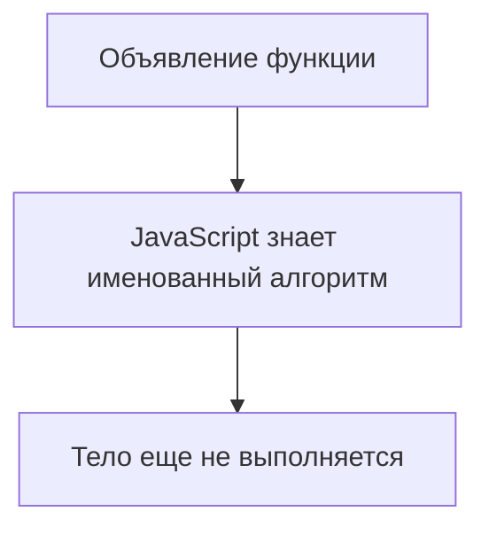

Выполнение начинается только после вызова.

```javascript
validateSuccessfulResponse();
```

Схема вызова функции:

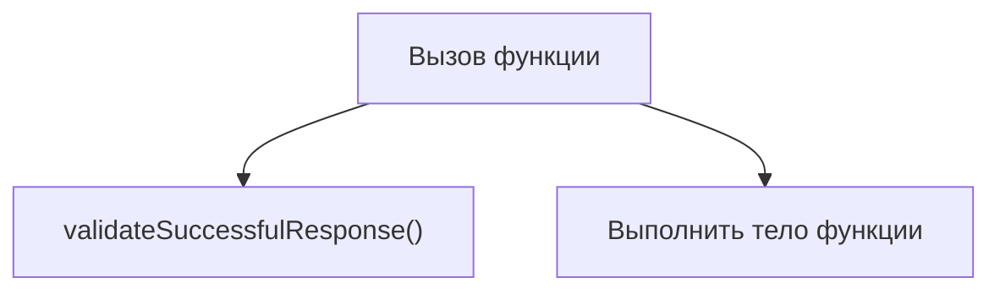

### Вызов функции

Вызвать функцию - значит попросить JavaScript выполнить этот алгоритм.

```javascript
function validateSuccessfulResponse() {
  console.log('Response status is valid');
}

validateSuccessfulResponse();
```

Поток выполнения:

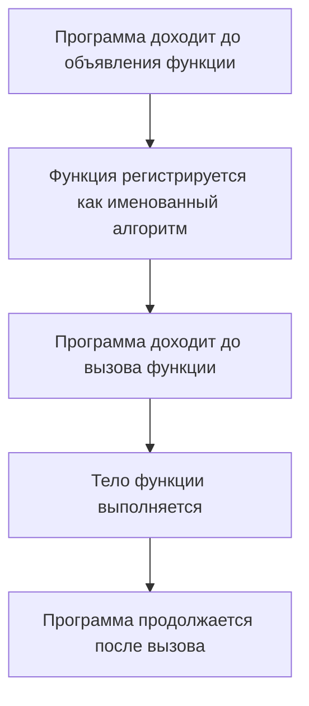

### Многократные вызовы

Одну функцию можно вызвать много раз.

```javascript
function validateSuccessfulResponse() {
  console.log('Response status is valid');
}

validateSuccessfulResponse();
validateSuccessfulResponse();
validateSuccessfulResponse();
```

Схема многократных вызовов:

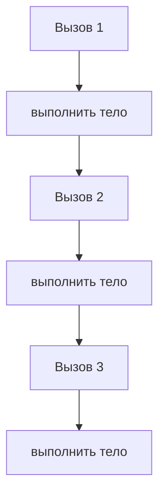

Одно объявление. Много выполнений.

### Поддерживаемость

Поддерживаемость означает, что код легче безопасно изменять.

Схема поддерживаемости:

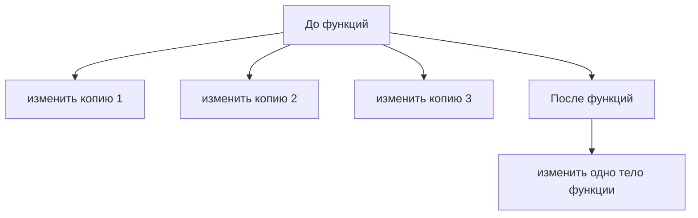

Если сообщение проверки изменится, достаточно обновить функцию один раз.

### Программа до и после функций

Программа до функций:

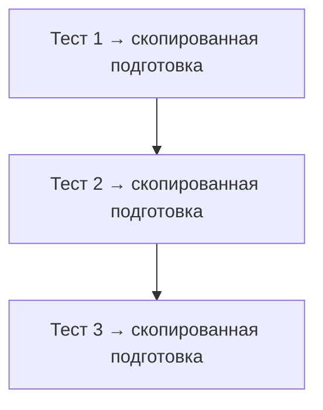

Программа после функций:

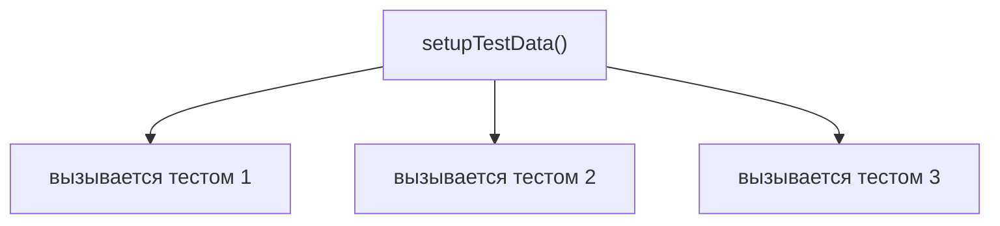

Полная картина функции:

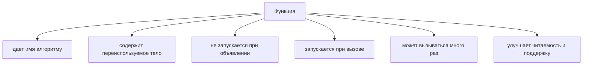

---

## Внутренний механизм

На концептуальном уровне:

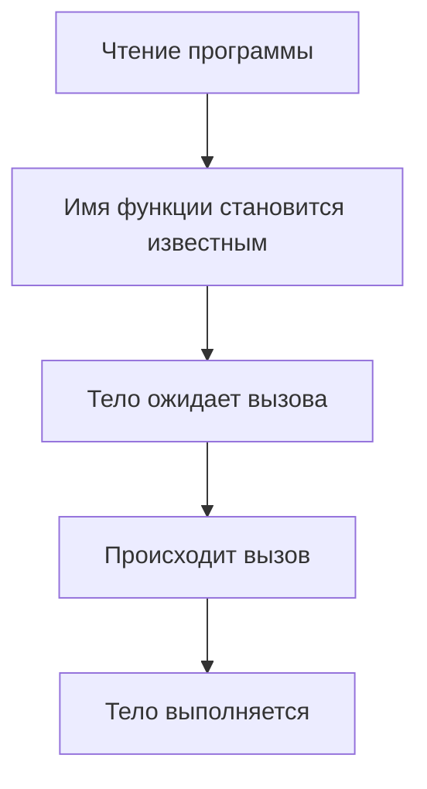

Жизненный цикл функции:

```mermaid
flowchart TD
    N1["Объявить функцию"]
    N2["Имя доступно в коде"]
    N3["Вызвать функцию"]
    N4["Выполнить тело"]
    N5["Вернуться к месту вызова после завершения тела"]
    N1 --> N2
    N2 --> N3
    N3 --> N4
    N4 --> N5
```

Эта глава не объясняет внутреннее устройство Execution Context для функций, область видимости внутри функций и возвращаемые значения. Эти идеи будут изучаться позже.

Текущее место в модели JavaScript:

```mermaid
flowchart TD
    N1["Values"]
    N2["Operators"]
    N3["Conditionals"]
    N4["Loops"]
    N5["Error Handling"]
    N6["Functions"]
    N1 --> N2
    N2 --> N3
    N3 --> N4
    N4 --> N5
    N5 --> N6
```

Мост к параметрам:

```mermaid
flowchart TD
    N1["Функция без параметров"]
    N2["один алгоритм, фиксированные внутренние данные"]
    N3["Следующая потребность"]
    N4["один алгоритм с разными входными значениями"]
    N5["Parameters"]
    N1 --> N2
    N1 --> N3
    N3 --> N4
    N3 --> N5
```

Параметры будут изучаться позже. Следующая глава сначала ответит, бывают ли функции только объявлениями.

---

## Ментальная модель

### Рецепт

Функция похожа на рецепт:

```mermaid
flowchart TD
    N1["Название рецепта"]
    N2["Проверить успешный ответ"]
    N3["Шаги рецепта"]
    N4["проверить статус"]
    N5["сообщить результат"]
    N1 --> N2
    N1 --> N3
    N3 --> N4
    N3 --> N5
```

Вызов функции означает выполнение рецепта.

### Машина с именем

```mermaid
flowchart TD
    N1["Машина: validateSuccessfulResponse"]
    N2["при запуске выполняет алгоритм проверки"]
    N1 --> N2
```

Машина существует после объявления, но работает только после запуска.

### Переиспользуемая инструкция

```mermaid
flowchart TD
    N1["Инструкция"]
    N2["написана один раз"]
    N3["используется много раз"]
    N1 --> N2
    N1 --> N3
```

### Производственная операция

```mermaid
flowchart TD
    N1["Производственное действие: очистить рабочее место"]
    N2["используется после теста A"]
    N3["используется после теста B"]
    N4["используется после теста C"]
    N1 --> N2
    N1 --> N3
    N1 --> N4
```

### Именованное действие в наборе инструментов

```mermaid
flowchart TD
    N1["Набор инструментов"]
    N2["setupTestData()"]
    N3["cleanupTestData()"]
    N4["validateResponse()"]
    N1 --> N2
    N1 --> N3
    N1 --> N4
```

Модель именованного алгоритма:

```mermaid
flowchart TD
    N1["Имя"]
    N2["Переиспользуемый алгоритм"]
    N3["Вызов выполняет его"]
    N1 --> N2
    N2 --> N3
```

---

## Примеры кода

Все примеры находятся в:

```text
examples/01-javascript/chapter-21/
```

Запуск:

```bash
node examples/01-javascript/chapter-21/01-duplication.js
node examples/01-javascript/chapter-21/02-first-function.js
node examples/01-javascript/chapter-21/03-call-function.js
node examples/01-javascript/chapter-21/04-multiple-calls.js
node examples/01-javascript/chapter-21/05-common-mistakes.js
node examples/01-javascript/chapter-21/06-qa-example.js
```

### 01-duplication.js

Показывает повторяющуюся проверку без функции.

### 02-first-function.js

Показывает первое объявление функции.

### 03-call-function.js

Показывает, что тело функции выполняется только после вызова.

### 04-multiple-calls.js

Показывает одно объявление и несколько вызовов.

### 05-common-mistakes.js

Показывает объявление функции без вызова.

### 06-qa-example.js

Показывает переиспользуемые helper-функции для подготовки, проверки и очистки.

---

## Частые вопросы

### Функция запускается при объявлении?

Нет. Объявление создает именованный алгоритм. Выполнение начинается после вызова.

### Зачем использовать функцию, если код занимает всего две строки?

Используйте функцию, когда имя улучшает смысл или поведение переиспользуется. Не создавайте функции механически ради каждых двух строк.

### Может ли функция получать разные значения?

Да, через параметры. Параметры - тема будущей главы.

### Может ли функция вернуть значение?

Да, через `return`. Возвращаемые значения - тема будущей главы.

### Function declaration - единственный способ создать функцию?

Нет. Function expressions и arrow functions будут изучаться дальше.

---

## Распространенные мифы

### Миф: функция - это просто синтаксическая обертка

Реальность:

Функция - это именованный переиспользуемый алгоритм.

### Миф: объявление выполняет тело

Реальность:

Тело выполняется только при вызове функции.

### Миф: чем больше функций, тем лучше код

Реальность:

Функция должна называть осмысленное переиспользуемое поведение.

### Миф: функции нужны только для сокращения количества строк

Реальность:

Они также улучшают читаемость, поддерживаемость и структуру.

Схема типичных ошибок:

```mermaid
flowchart TD
    N1["Ошибка"]
    N2["объявить, но не вызвать"]
    N3["копировать код вместо именования алгоритма"]
    N4["использовать расплывчатое имя функции"]
    N5["поместить несвязанные действия в одну функцию"]
    N1 --> N2
    N1 --> N3
    N1 --> N4
    N1 --> N5
```

---

## Типичные ошибки

### Ошибка 1. Объявить, но не вызвать

```javascript
function validateSuccessfulResponse() {
  console.log('Validation runs');
}
```

Ничего не выводится, потому что функция не вызвана.

### Ошибка 2. Расплывчатое имя

```javascript
function doStuff() {
  console.log('Validate response');
}
```

Лучше:

```javascript
function validateSuccessfulResponse() {
  console.log('Validate response');
}
```

### Ошибка 3. Функция делает слишком много несвязанных вещей

```text
setup user
validate response
delete data
send report
```

Если это отдельные алгоритмы, им могут понадобиться отдельные функции.

### Ошибка 4. Копировать код вместо именования поведения

Дублированная проверка часто должна стать именованным helper.

### Ошибка 5. Ждать разного поведения без параметров

Без параметров функция использует фиксированные данные внутри тела. Разные входные значения потребуют параметров, которые будут изучаться позже.

---

## Практическое использование

Функции полезны, когда:

```text
один алгоритм появляется больше одного раза
у алгоритма есть ясное имя
читаемость теста улучшается
будущие изменения должны происходить в одном месте
```

Практический чек-лист чтения:

```text
1. Какой переиспользуемый алгоритм мы создаем?
2. Описывает ли имя функции поведение?
3. Сфокусировано ли тело функции?
4. Где функция вызывается?
5. Не перепутано ли объявление с вызовом?
```

---

## Использование в Automation QA

### Переиспользуемые проверки

```javascript
function assertStatusIsSuccessful() {
  const statusCode = 200;

  if (statusCode !== 200) {
    throw new Error('Expected status 200');
  }
}
```

### Переиспользуемая валидация

```javascript
function validateUserResponse() {
  console.log('Validate user response shape');
}
```

Пример QA-валидации:

```mermaid
flowchart TD
    N1["validateUserResponse()"]
    N2["используется в smoke-тесте"]
    N3["используется в regression-тесте"]
    N4["используется в API contract-тесте"]
    N1 --> N2
    N1 --> N3
    N1 --> N4
```

### Setup helpers

```javascript
function setupTestData() {
  console.log('Create test user');
}
```

### Cleanup helpers

```javascript
function cleanupTestData() {
  console.log('Delete test user');
}
```

### Устранение дублирования в тестах

```mermaid
flowchart TD
    N1["До"]
    N2["одна и та же подготовка скопирована"]
    N3["одна и та же проверка скопирована"]
    N4["одна и та же очистка скопирована"]
    N5["После"]
    N6["setupTestData()"]
    N7["validateUserResponse()"]
    N8["cleanupTestData()"]
    N1 --> N2
    N1 --> N3
    N1 --> N4
    N1 --> N5
    N5 --> N6
    N5 --> N7
    N5 --> N8
```

Тесты становится проще поддерживать, потому что поведение получает имена.

---

## Итоги

Эта глава начинает раздел Functions.

Главная модель:

```text
Функция - это именованный переиспользуемый алгоритм.
Объявление функции не выполняет ее тело.
Выполнение начинается только тогда, когда функция вызвана.
```

Function Declaration:

```text
function name() {
  body
}
```

Вызов функции:

```text
name()
```

Следующая глава спрашивает:

```text
Бывают ли функции только объявлениями?
```

Она вводит Function Expression.

---

## Что нужно запомнить

* Функции существуют, чтобы давать имена переиспользуемым алгоритмам.
* Дублирование усложняет поддержку кода.
* Function declaration создает именованную функцию.
* Тело функции содержит переиспользуемый алгоритм.
* Объявление не выполняет тело функции.
* Вызов выполняет тело функции.
* Одну функцию можно вызвать много раз.
* Имя функции должно описывать поведение.
* Automation QA использует функции для helpers, setup, cleanup и переиспользуемой валидации.
* Параметры, `return`, область видимости, function expressions и arrow functions будут изучаться позже.

---

## Проверьте себя

Ответьте без запуска кода.

1. Зачем существуют функции?
2. Что такое дублирование кода?
3. Что такое переиспользуемое поведение?
4. Что создает function declaration?
5. Выполняет ли объявление тело функции?
6. Что такое вызов функции?
7. Что такое тело функции?
8. Почему имена важны?
9. Как функции улучшают поддерживаемость?
10. На какой вопрос отвечает следующая глава?

---

## Практика

Практика находится в файле:

```text
practice/01-javascript/21-function-declaration.md
```

Сначала решайте задания на предсказание вывода без запуска. Главная цель - отличать объявление от вызова.

---

## Решения

Решения находятся в файле:

```text
solutions/01-javascript/21-function-declaration.md
```

Читайте решения после самостоятельной попытки. Проверяйте рассуждение: какой переиспользуемый алгоритм мы создаем?
