# Function Expression

## Связь с предыдущей главой

В предыдущей главе функция была представлена как именованный переиспользуемый алгоритм.

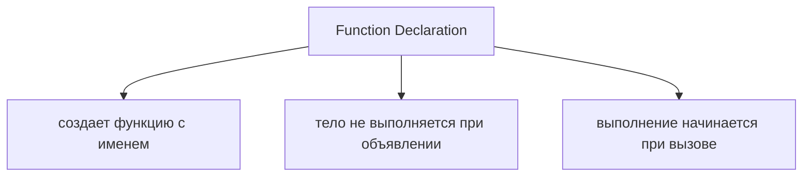

Теперь появляется следующий вопрос:

> Может ли сама функция быть значением?

Мы уже знаем, что переменные могут хранить значения:

```text
number
string
boolean
object
```

Но JavaScript идет дальше:

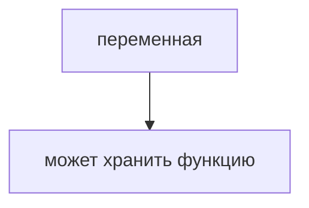

Главный вопрос этой главы:

> Какое значение хранит эта переменная?

---

## Предварительные требования

Для этой главы нужно понимать:

* что функция - это переиспользуемый алгоритм;
* что объявление функции не запускает ее тело;
* что переменная может хранить значение;
* что объектные значения отличаются от примитивных;
* что имя помогает читать код;
* что вызов функции выполняет ее тело.

Не требуется знать arrow functions, callbacks, higher-order functions, closures, `this`, IIFE, параметры в глубину или возвращаемые значения в глубину. Эти темы будут изучаться позже.

---

## Время изучения

Ориентировочное время:

```text
Чтение главы:            110-140 минут
Разбор схем:             40-55 минут
Запуск примеров:         20-30 минут
Практика:                90-120 минут
Повторение материала:    25 минут
```

Уровень сложности: **L3**.

Function Expression кажется небольшим изменением синтаксиса, но на самом деле это переход к важной идее JavaScript: функция может быть значением.

---

## Навигация

Предыдущая глава:

```text
docs/01-javascript/21-function-declaration.md
```

Текущая глава:

```text
docs/01-javascript/22-function-expression.md
```

Следующая глава:

```text
docs/01-javascript/23-arrow-functions.md
```

Следующая глава ответит:

> Есть ли более короткий синтаксис для создания function object?

---

## Цели обучения

После изучения этой главы вы будете понимать:

* зачем существуют Function Expressions;
* что функция может быть значением;
* как переменная может хранить функцию;
* что такое anonymous function expression;
* что такое named function expression на высоком уровне;
* чем function declaration отличается от function expression;
* как создать и вызвать Function Expression;
* почему вызов идет через переменную;
* как выбирать читаемый вариант;
* какие ошибки чаще всего встречаются;
* как эта идея применяется в Automation QA.

---

## Мотивация

Начнем не с синтаксиса, а с уже знакомой идеи.

Переменная может хранить число:

```javascript
const statusCode = 200;
```

Переменная может хранить строку:

```javascript
const userRole = 'admin';
```

Переменная может хранить object:

```javascript
const user = {
  name: 'Anna'
};
```

Возникает вопрос:

```text
Если функция тоже значение,
может ли переменная хранить функцию?
```

Ответ JavaScript:

```text
да
```

Это и приводит к Function Expression.

Проблема:

```text
Мы хотим создать функцию
и сохранить ее как значение
под именем переменной.
```

Схема мотивации:

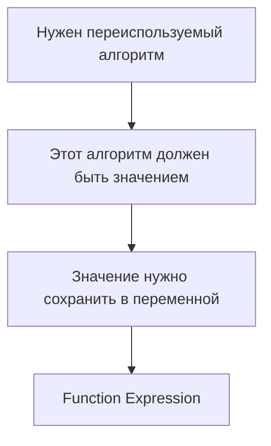

Главный вопрос остается тем же:

> Какое значение хранит эта переменная?

---

## Теория

### Зачем существуют Function Expressions

Function Expressions существуют потому, что JavaScript позволяет обращаться с функциями как со значениями.

Это значит:

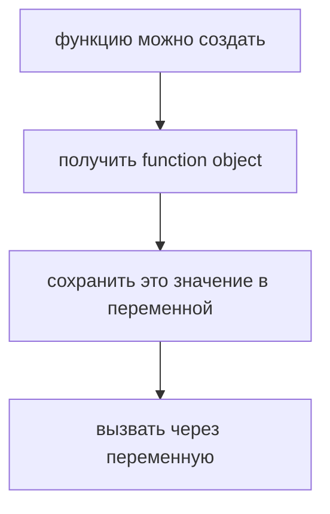

Схема "зачем expressions":

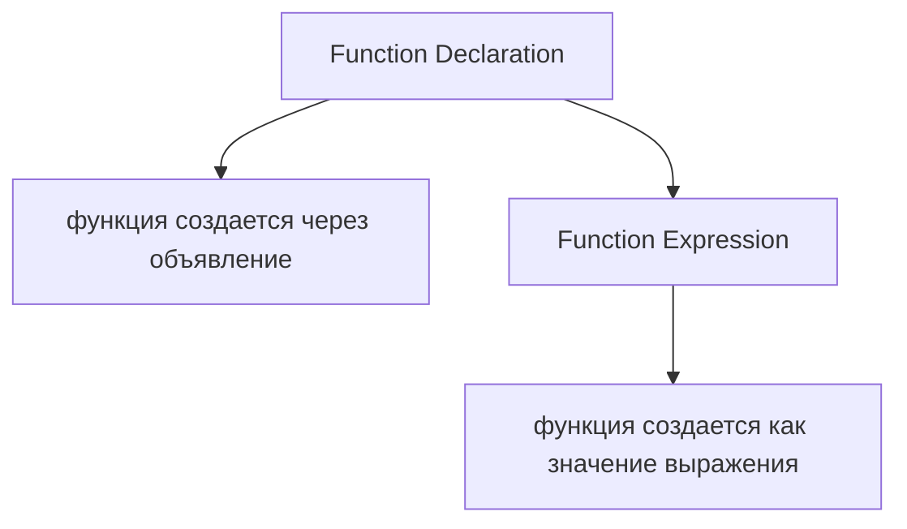

Function Expression не заменяет Function Declaration. Это другой способ создать function object.

### Функция как значение

В JavaScript функция - это специальный объект, который можно вызывать.

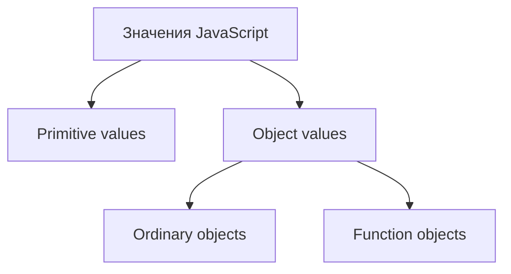

Функция остается алгоритмом, но теперь мы смотрим на нее с другой стороны:

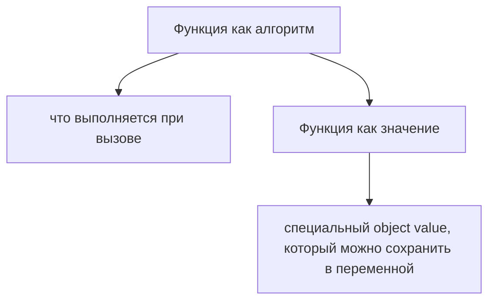

Function object model:

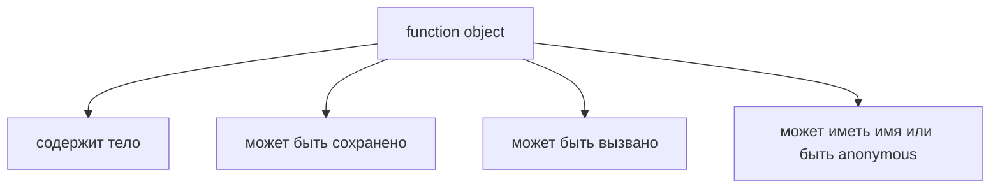

В этой главе мы не изучаем callbacks. Позже станет важно, что function object можно не только хранить, но и передавать в другие функции.

### Присваивание функции переменной

Function Expression часто выглядит так:

```javascript
const validateStatus = function () {
  console.log('Status is valid');
};
```

Здесь переменная `validateStatus` хранит function object.

Схема:

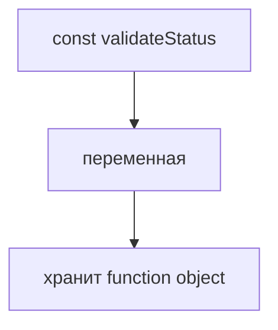

Variable storing function:

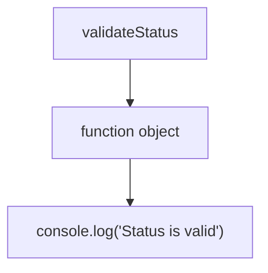

Важно:

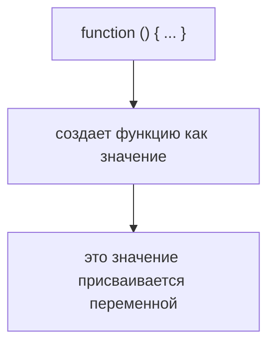

### Anonymous Function Expression

Anonymous Function Expression - это function expression без собственного имени после слова `function`.

```javascript
const validateStatus = function () {
  console.log('Status is valid');
};
```

Схема:

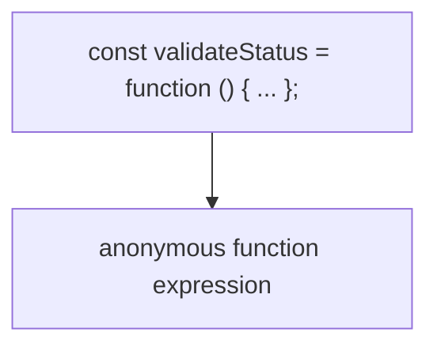

У function object нет собственного имени, но переменная дает доступ к нему.

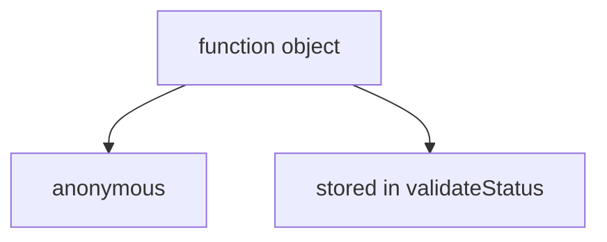

Когда мы пишем:

```javascript
validateStatus();
```

JavaScript берет function object из переменной и выполняет его тело.

### Named Function Expression

Named Function Expression содержит имя после `function`.

```javascript
const validateStatus = function validateSuccessfulStatus() {
  console.log('Status is valid');
};
```

Схема:

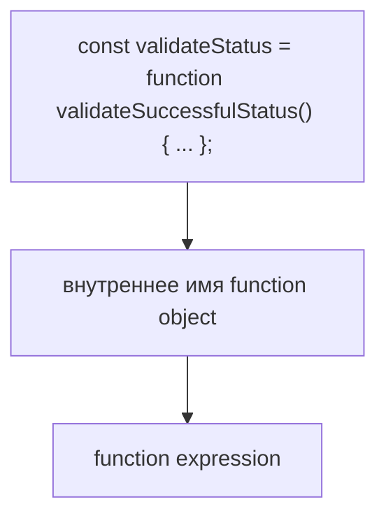

В этой главе достаточно понимать идею:

```text
переменная хранит function object
сам function object может иметь собственное имя
```

Подробные причины использования named function expressions будут понятнее после глав о функциях, `this`, closures и отладке.

### Declaration vs Expression

Function Declaration:

```javascript
function validateStatus() {
  console.log('Status is valid');
}
```

Function Expression:

```javascript
const validateStatus = function () {
  console.log('Status is valid');
};
```

Главное различие:

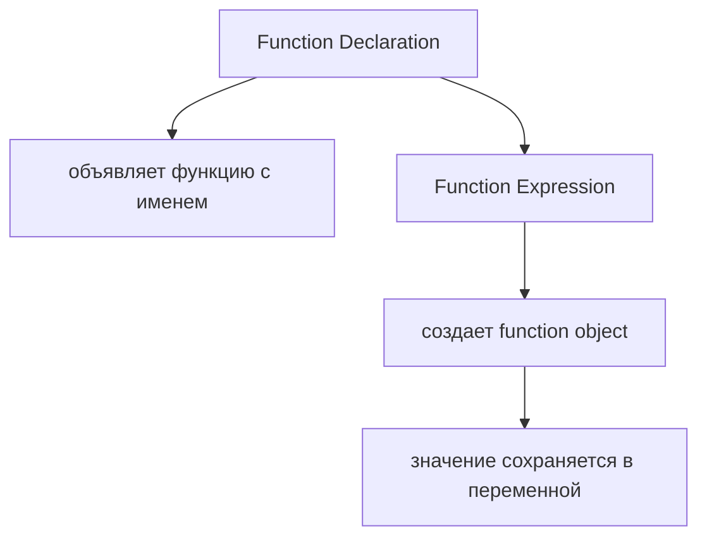

Declaration vs Expression:

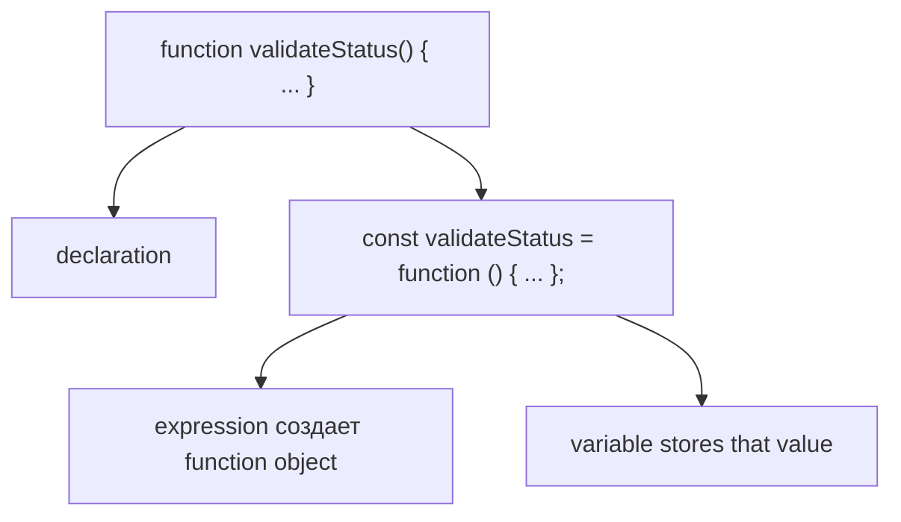

Обе формы позволяют получить функцию, которую можно вызвать:

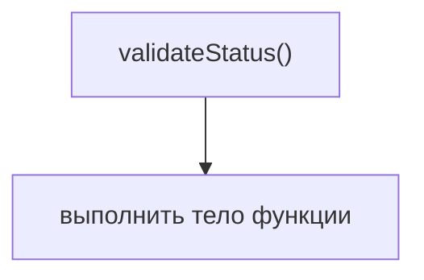

Но путь создания отличается.

### Создание и вызов Function Expression

Создание:

```javascript
const validateStatus = function () {
  console.log('Status is valid');
};
```

Вызов:

```javascript
validateStatus();
```

Invocation through variable:

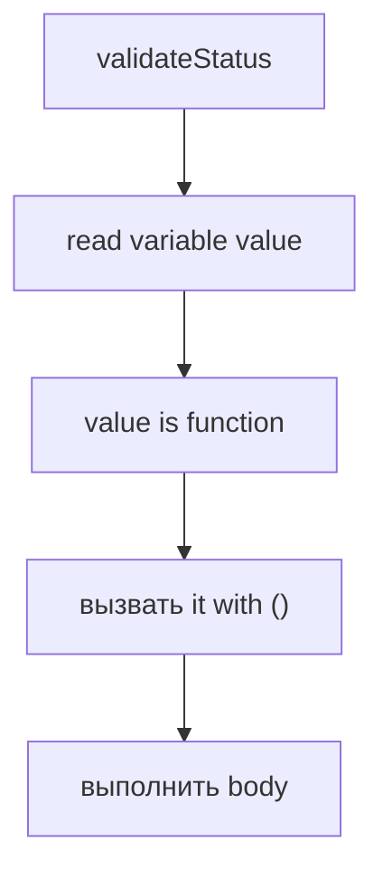

Функция выполняется не в момент присваивания, а в момент вызова.

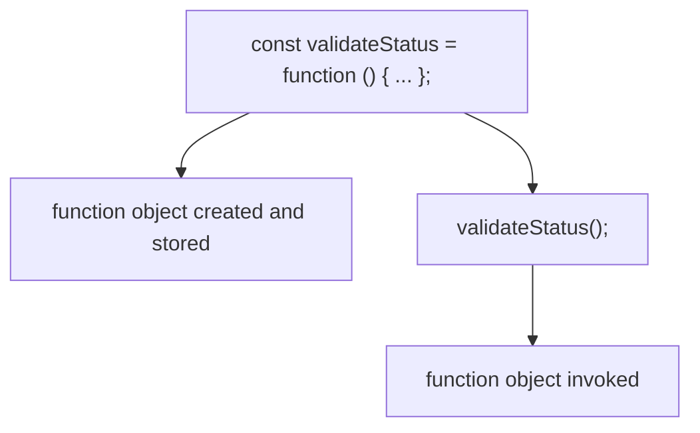

### Function Expression structure

Структура:

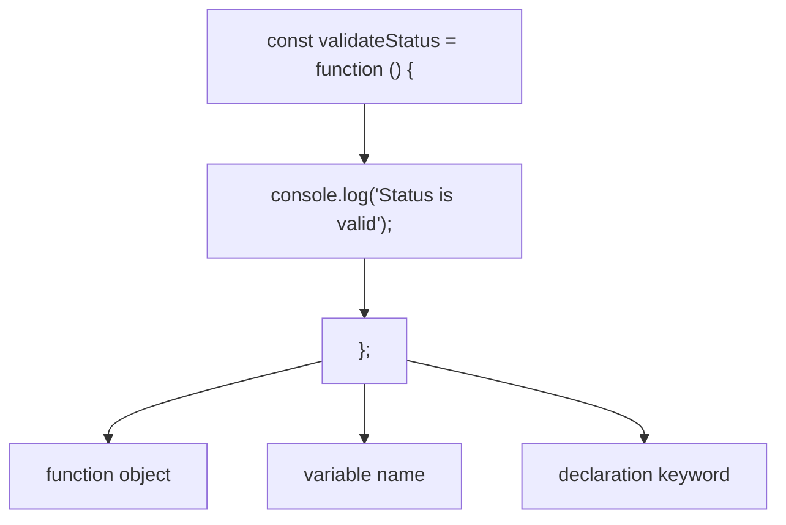

Еще одна схема:

```mermaid
flowchart TD
    N1["const validateStatus = function () { ... };"]
    N2["значение справа"]
    N3["имя переменной слева"]
    N1 --> N2
    N2 --> N3
```

Вопрос, который нужно задавать:

> Какое значение находится справа от `=`?

В данном случае справа находится function object.

### Multiple variables

Function object можно сохранить в одну переменную.

```javascript
const validateStatus = function () {
  console.log('Status is valid');
};
```

Концептуально несколько переменных могут указывать на одно function object:

```javascript
const validateStatus = function () {
  console.log('Status is valid');
};

const checkStatus = validateStatus;
```

Схема:

```mermaid
flowchart TD
    N1["validateStatus"]
    N2["function object"]
    N3["checkStatus"]
    N4["same function object"]
    N1 --> N2
    N1 --> N3
    N3 --> N4
```

Это связано с темой references и function objects. Подробное поведение будет глубже понятно после следующих глав о функциях.

### Читаемость

Function Expression полезен, но не каждый код становится лучше от его использования.

Сравнение читаемости:

```mermaid
flowchart TD
    N1["Function Declaration"]
    N2["хорошо подходит для именованного верхнеуровневого helper"]
    N3["Function Expression"]
    N4["хорошо показывает, что функция хранится как значение"]
    N1 --> N2
    N1 --> N3
    N3 --> N4
```

Пример:

```javascript
function validateStatus() {
  console.log('Status is valid');
}
```

и:

```javascript
const validateStatus = function () {
  console.log('Status is valid');
};
```

Оба варианта читаемы, но подчеркивают разные идеи.

```mermaid
flowchart TD
    N1["Declaration"]
    N2["&quot;в программе есть функция validateStatus&quot;"]
    N3["Expression"]
    N4["&quot;переменная validateStatus хранит function object&quot;"]
    N1 --> N2
    N1 --> N3
    N3 --> N4
```

---

## Внутренний механизм

Важно не запоминать форму, а видеть последовательность действий движка.

### Lifecycle Function Declaration

```mermaid
flowchart TD
    N1["Engine reads declaration"]
    N2["registers function name"]
    N3["function can be called by name"]
    N4["вызвать выполняется body"]
    N1 --> N2
    N2 --> N3
    N3 --> N4
```

На концептуальном уровне Function Declaration связывает имя функции с function object.

### Lifecycle Function Expression

```mermaid
flowchart TD
    N1["Engine reaches variable declaration"]
    N2["prepares variable"]
    N3["evaluates right side"]
    N4["создает function object"]
    N5["stores function object in variable"]
    N1 --> N2
    N2 --> N3
    N3 --> N4
    N4 --> N5
```

Expression lifecycle:

```mermaid
flowchart TD
    N1["const validateStatus = function () { ... };"]
    N2["создать variable name"]
    N3["создать function object"]
    N4["store value in variable"]
    N1 --> N2
    N1 --> N3
    N1 --> N4
```

Function creation временная шкала:

```mermaid
flowchart TD
    N1["Line with Function Expression"]
    N2["right side is evaluated"]
    N3["появляется объект функции"]
    N4["variable receives that value"]
    N5["later вызвать uses stored value"]
    N1 --> N2
    N2 --> N3
    N3 --> N4
    N4 --> N5
```

### Что делает движок прямо сейчас

Код:

```javascript
const validateStatus = function () {
  console.log('Status is valid');
};

validateStatus();
```

Мысленный дневник движка:

```mermaid
flowchart TD
    N1["Я вижу const validateStatus."]
    N2["Я подготавливаю переменную."]
    N3["Я вычисляю правую часть."]
    N4["Правая часть создает function object."]
    N5["Я сохраняю function object в validateStatus."]
    N6["Я дохожу до validateStatus()."]
    N7["Я читаю значение из validateStatus."]
    N8["Значение можно вызвать."]
    N9["Я выполняю его тело."]
    N1 --> N2
    N2 --> N3
    N3 --> N4
    N4 --> N5
    N5 --> N6
    N6 --> N7
    N7 --> N8
    N8 --> N9
```

### Текущее место в модели JavaScript

```mermaid
flowchart TD
    N1["Functions"]
    N2["Function Declaration"]
    N3["named reusable algorithm"]
    N4["Function Expression"]
    N5["function as value"]
    N1 --> N2
    N1 --> N3
    N1 --> N4
    N4 --> N5
```

Полная картина:

```mermaid
flowchart TD
    N1["Value model"]
    N2["Primitive values"]
    N3["Object values"]
    N4["Ordinary objects"]
    N5["Function objects"]
    N6["can be declared"]
    N7["can be stored in variables"]
    N8["can be invoked"]
    N1 --> N2
    N1 --> N3
    N3 --> N4
    N3 --> N5
    N5 --> N6
    N5 --> N7
    N5 --> N8
```

Переход к Arrow Functions:

```mermaid
flowchart TD
    N1["Function Expression"]
    N2["создает function object через function syntax"]
    N3["Next question"]
    N4["можно ли создать function object короче?"]
    N5["Arrow Functions"]
    N1 --> N2
    N1 --> N3
    N3 --> N4
    N3 --> N5
```

Arrow Functions будут изучаться в следующей главе.

---

## Ментальная модель

### Labeled toolbox

Представьте ящик инструментов:

```mermaid
flowchart TD
    N1["validateStatus"]
    N2["инструмент проверки статуса"]
    N1 --> N2
```

Переменная - это подпись на ящике. Function object - инструмент внутри.

### Value on a shelf

```mermaid
flowchart TD
    N1["Полка значений"]
    N2["200"]
    N3["'admin'"]
    N4["{ name: 'Anna' }"]
    N5["function object"]
    N1 --> N2
    N1 --> N3
    N1 --> N4
    N1 --> N5
```

Function Expression кладет function object на полку и подписывает его переменной.

### Tool stored in a drawer

```mermaid
flowchart TD
    N1["Drawer: validateStatus"]
    N2["stored tool: function object"]
    N1 --> N2
```

Вызов `validateStatus()` означает:

```mermaid
flowchart TD
    N1["open drawer"]
    N2["take сохраненный function object"]
    N3["run it"]
    N1 --> N2
    N2 --> N3
```

### Reusable machine stored under a name

```mermaid
flowchart TD
    N1["Name: validateStatus"]
    N2["Machine: function object"]
    N3["Start machine with ()"]
    N1 --> N2
    N2 --> N3
```

### Library catalog

```mermaid
flowchart TD
    N1["Catalog record"]
    N2["key: validateStatus"]
    N3["item: function object"]
    N1 --> N2
    N1 --> N3
```

Главная модель:

```text
Function Expression creates a function object.
Variable stores that value.
Invocation reads the value and executes it.
```

---

## Примеры кода

Все примеры находятся в:

```text
examples/01-javascript/chapter-22/
```

Запуск:

```bash
node examples/01-javascript/chapter-22/01-function-value.js
node examples/01-javascript/chapter-22/02-function-expression.js
node examples/01-javascript/chapter-22/03-call-expression.js
node examples/01-javascript/chapter-22/04-declaration-vs-expression.js
node examples/01-javascript/chapter-22/05-common-mistakes.js
node examples/01-javascript/chapter-22/06-qa-example.js
```

### 01-function-value.js

Показывает, что переменная может хранить function object.

### 02-function-expression.js

Показывает базовый Function Expression.

### 03-call-expression.js

Показывает вызов функции через переменную.

### 04-declaration-vs-expression.js

Сравнивает Function Declaration и Function Expression.

### 05-common-mistakes.js

Показывает частую ошибку: переменная хранит функцию, но функция не вызвана.

### 06-qa-example.js

Показывает хранение QA helper-функций в переменных.

---

## Частые вопросы

### Function Expression запускается сразу?

Нет. Function Expression создает function object. Тело выполняется только при вызове через `()`.

### Переменная хранит результат функции или саму функцию?

Если справа написано `function () { ... }`, переменная хранит сам function object. Если справа написан вызов `someFunction()`, это уже другая ситуация, которая будет изучаться глубже позже.

### Anonymous function хуже named function?

Не обязательно. Anonymous function expression часто читается нормально, если переменная имеет хорошее имя. Named function expression полезен в отдельных сценариях отладки и самоссылки, но подробно это будет изучаться позже.

### Нужно ли всегда использовать Function Expression?

Нет. Function Declaration остается хорошим выбором для обычных именованных helper-функций.

### Это уже callback?

Нет. В этой главе функция только хранится в переменной и вызывается. Callback - это функция, переданная в другую функцию; эта тема будет изучаться позже.

---

## Распространенные мифы

### Миф: функция не может быть значением

Реальность:

В JavaScript функция может быть значением.

### Миф: Function Expression всегда лучше Function Declaration

Реальность:

Это разные инструменты. Выбор зависит от читаемости и задачи.

### Миф: если функция сохранена в переменной, она уже выполнилась

Реальность:

Переменная хранит function object. Выполнение начинается только после вызова.

### Миф: anonymous значит непонятная

Реальность:

Если переменная названа хорошо, код может быть понятным.

Схема типичных ошибок:

```mermaid
flowchart TD
    N1["Ошибка"]
    N2["забыть ()"]
    N3["вызвать до присваивания"]
    N4["думать, что переменная хранит результат"]
    N5["дать переменной расплывчатое имя"]
    N6["путать declaration и expression"]
    N1 --> N2
    N1 --> N3
    N1 --> N4
    N1 --> N5
    N1 --> N6
```

---

## Типичные ошибки

### Ошибка 1. Забыть вызов

Неправильно:

```javascript
const validateStatus = function () {
  console.log('Status is valid');
};

validateStatus;
```

Что произошло:

```text
Переменная прочитана,
но function object не вызван.
```

Исправление:

```javascript
validateStatus();
```

### Ошибка 2. Думать, что функция выполнилась при присваивании

```javascript
const validateStatus = function () {
  console.log('Status is valid');
};
```

Этот код создает и сохраняет function object. Он не выводит текст.

### Ошибка 3. Путать Function Declaration и Function Expression

```javascript
function validateStatus() {}
```

и:

```javascript
const validateStatus = function () {};
```

Оба создают функцию, но делают это разными способами.

### Ошибка 4. Использовать плохое имя переменной

Плохо:

```javascript
const fn = function () {
  console.log('Validate user profile');
};
```

Лучше:

```javascript
const validateUserProfile = function () {
  console.log('Validate user profile');
};
```

### Ошибка 5. Объяснять Function Expression через callbacks

Callbacks будут позже. Сейчас достаточно модели:

```text
переменная хранит function object
```

---

## Практическое использование

Function Expression полезен, когда нужно явно показать, что функция является объектным значением, которое можно вызвать.

Практический чек-лист:

```text
1. Что находится справа от =?
2. Это function object?
3. В какую переменную он сохраняется?
4. Где эта переменная вызывается с ()?
5. Помогает ли имя переменной понять поведение?
```

Readability decision:

```mermaid
flowchart TD
    N1["Нужен обычный верхнеуровневый helper"]
    N2["Function Declaration часто подходит"]
    N3["Нужно подчеркнуть функцию как значение"]
    N4["Function Expression подходит"]
    N1 --> N2
    N1 --> N3
    N3 --> N4
```

---

## Использование в Automation QA

### Helper assignment

```javascript
const validateStatus = function () {
  console.log('Validate status code');
};

validateStatus();
```

Переменная `validateStatus` хранит helper-функцию.

### Reusable validators

```javascript
const validateUserProfile = function () {
  console.log('Validate user profile');
};
```

Пример QA-helper:

```mermaid
flowchart TD
    N1["validateUserProfile"]
    N2["function object"]
    N3["reusable validation"]
    N1 --> N2
    N2 --> N3
```

### Configurable поведение

На высоком уровне Function Expression помогает думать о поведении как о значении.

```mermaid
flowchart TD
    N1["validator variable"]
    N2["stores validation behavior"]
    N1 --> N2
```

Подробно передача поведения в другие функции будет изучаться в главах о callbacks и higher-order functions.

### Storing helper functions

```mermaid
flowchart TD
    N1["test utils"]
    N2["validateStatus"]
    N3["validateUserProfile"]
    N4["cleanupTestData"]
    N1 --> N2
    N1 --> N3
    N1 --> N4
```

Каждая переменная может хранить function object.

### Organizing test utilities

Function Expressions помогают видеть utilities как набор значений:

```mermaid
flowchart TD
    N1["utilities module"]
    N2["const validateStatus = function () { ... }"]
    N3["const openProfile = function () { ... }"]
    N4["const cleanupData = function () { ... }"]
    N1 --> N2
    N1 --> N3
    N1 --> N4
```

Модули и экспорт будут изучаться позже. Здесь важно только увидеть модель хранения функции в переменной.

---

## Итоги

Function Expression вводит новую важную идею:

```text
Функция может быть объектным значением.
```

Полная модель главы:

```mermaid
flowchart TD
    N1["Function Expression"]
    N2["создает function object"]
    N3["variable stores that value"]
    N4["invocation reads value from variable"]
    N5["тело функции выполняется"]
    N1 --> N2
    N2 --> N3
    N3 --> N4
    N4 --> N5
```

Function Declaration и Function Expression создают функции разными способами.

```mermaid
flowchart TD
    N1["Function Declaration"]
    N2["function validateStatus() { ... }"]
    N3["Function Expression"]
    N4["const validateStatus = function () { ... };"]
    N1 --> N2
    N1 --> N3
    N3 --> N4
```

Следующая глава естественно продолжит вопрос:

```text
Есть ли более короткий синтаксис
для создания function object?
```

Ответом будут Arrow Functions.

---

## Что нужно запомнить

* Function Expression создает function object.
* Function object относится к object значения, а не к отдельной третьей категории значений.
* Переменная может хранить function object.
* Тело функции не выполняется при присваивании.
* Вызов происходит через `variableName()`.
* Anonymous Function Expression не имеет собственного имени.
* Named Function Expression имеет имя function object.
* Function Declaration и Function Expression создают функции разными способами.
* Хорошее имя переменной критично для читаемости.
* В Automation QA Function Expressions могут использоваться для helper-функций и validators.
* Callbacks, arrow functions, closures и `this` будут изучаться позже.

---

## Проверьте себя

Ответьте без запуска кода.

1. Может ли функция быть значением?
2. Что хранит переменная в Function Expression?
3. Выполняется ли тело при присваивании Function Expression?
4. Что делает `validateStatus()`?
5. Чем anonymous function expression отличается от named function expression?
6. Чем Function Declaration отличается от Function Expression?
7. Почему хорошее имя переменной важно?
8. Почему это не callback?
9. Где Function Expression может использоваться в Automation QA?
10. Какая тема идет следующей?

---

## Практика

Практика находится в файле:

```text
practice/01-javascript/22-function-expression.md
```

Сначала решайте задания на предсказание вывода без запуска. Главная цель - видеть, где создается function object, где он хранится и где вызывается.

---

## Решения

Решения находятся в файле:

```text
solutions/01-javascript/22-function-expression.md
```

Читайте решения после самостоятельной попытки. Проверяйте главный вопрос: какое значение хранит переменная?
