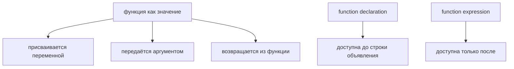

# Функциональное выражение

## Связь с предыдущей главой

В предыдущей главе функция была представлена как именованный переиспользуемый алгоритм.

Теперь появляется следующий вопрос:

> Может ли сама функция быть значением?

Мы уже знаем, что переменные могут хранить значения:

```text
number
string
boolean
object
```

Но JavaScript идет дальше:

Главный вопрос этой главы:

> Какое значение хранит эта переменная?

---

## Предварительные требования

Для этой главы нужно понимать:

* что функция - это переиспользуемый алгоритм;
* что объявление функции не запускает ее тело;
* что переменная может хранить значение;
* что объектные значения отличаются от примитивных;
* что имя помогает читать код;
* что вызов функции выполняет ее тело.

Не требуется знать arrow functions, callbacks, higher-order functions, closures, `this`, IIFE, параметры в глубину или возвращаемые значения в глубину. Эти темы будут изучаться позже.

---

## Время изучения

Ориентировочное время:

```text
Чтение главы:            110-140 минут
Разбор схем:             40-55 минут
Запуск примеров:         20-30 минут
Практика:                90-120 минут
Повторение материала:    25 минут
```

Уровень сложности: **L3**.

Function Expression кажется небольшим изменением синтаксиса, но на самом деле это переход к важной идее JavaScript: функция может быть значением.

---

## Навигация

Предыдущая глава:

```text
docs/01-javascript/21-function-declaration.md
```

Текущая глава:

```text
docs/01-javascript/22-function-expression.md
```

Следующая глава:

```text
docs/01-javascript/23-arrow-functions.md
```

Следующая глава ответит:

> Есть ли более короткий синтаксис для создания function object?

---

## Цели обучения

После изучения этой главы вы будете понимать:

* зачем существуют Function Expressions;
* что функция может быть значением;
* как переменная может хранить функцию;
* что такое anonymous function expression;
* что такое named function expression на высоком уровне;
* чем function declaration отличается от function expression;
* как создать и вызвать Function Expression;
* почему вызов идет через переменную;
* как выбирать читаемый вариант;
* какие ошибки чаще всего встречаются;
* как эта идея применяется в Automation QA.

---

## Мотивация

Начнем не с синтаксиса, а с уже знакомой идеи.

Переменная может хранить число:

```javascript
const statusCode = 200;
```

Переменная может хранить строку:

```javascript
const userRole = 'admin';
```

Переменная может хранить object:

```javascript
const user = {
  name: 'Anna'
};
```

Возникает вопрос:

```text
Если функция тоже значение,
может ли переменная хранить функцию?
```

Ответ JavaScript:

```text
да
```

Это и приводит к Function Expression.

Проблема:

```text
Мы хотим создать функцию
и сохранить ее как значение
под именем переменной.
```

Схема мотивации:

```text
функция — это значение,
значит её можно присвоить переменной
```

Главный вопрос остается тем же:

> Какое значение хранит эта переменная?

---

## Теория

### Зачем существуют выражения-функции

Выражения-функции существуют потому, что JavaScript позволяет обращаться с функциями как со значениями.

Это значит, что функцию можно положить в переменную, передать в другую функцию,
вернуть из функции и сохранить в массиве или свойстве объекта.

Схема «зачем нужны выражения»:

```text
функцию можно: присвоить, передать в другую функцию, вернуть из функции
```

Выражение-функция не заменяет объявление функции. Это другой способ создать объект функции.

### Функция как значение

В JavaScript функция - это специальный объект, который можно вызывать.

Функция остаётся алгоритмом, но теперь мы смотрим на неё с другой стороны: как на
значение, которое можно хранить и передавать.

```text
объект функции
 ├─ тело: что выполнить при вызове
 ├─ параметры
 └─ обычные свойства объекта (например, name и length)
```

В этой главе мы не изучаем обратные вызовы. Позже станет важно, что объект функции можно не только хранить, но и передавать в другие функции.

### Присваивание функции переменной

Выражение-функция часто выглядит так:

```javascript
const validateStatus = function () {
  console.log('Status is valid');
};
```

Здесь переменная `validateStatus` хранит объект функции.

Схема:

```text
validateStatus  ──→  [ function object ]
```

Переменная, хранящая функцию:

```text
переменная хранит не «код функции», а ссылку на объект функции —
ровно так же, как хранила бы ссылку на объект или массив
```

Важно:

```text
имя validateStatus подчиняется правилам переменных:
оно недоступно до строки объявления, как любой const
```

### Анонимное выражение-функция

Анонимное выражение-функция — это выражение-функция без собственного имени после слова `function`.

```javascript
const validateStatus = function () {
  console.log('Status is valid');
};
```

Схема:

```text
анонимная функция: имени после ключевого слова нет
```

У объекта функции нет собственного имени, но переменная даёт доступ к нему.

Когда мы пишем:

```javascript
validateStatus();
```

JavaScript берёт объект функции из переменной и выполняет его тело.

### Именованное выражение-функция

Именованное выражение-функция содержит имя после `function`.

```javascript
const validateStatus = function validateSuccessfulStatus() {
  console.log('Status is valid');
};
```

Схема:

```text
именованная функция в выражении:
имя видно в трассировке ошибок
```

В этой главе достаточно понимать идею:

```text
переменная хранит function object
сам function object может иметь собственное имя
```

Подробные причины использовать именованные выражения-функции станут понятнее после глав о функциях, `this`, замыканиях и разборе ошибок.

### Объявление и выражение

Объявление функции:

```javascript
function validateStatus() {
  console.log('Status is valid');
}
```

Функциональное выражение:

```javascript
const validateStatus = function () {
  console.log('Status is valid');
};
```

| | Объявление функции | Выражение-функция |
| --- | --- | --- |
| когда имя доступно | во всей области, включая строки выше | после строки присваивания |
| что создаётся | имя и функция сразу | значение, которое присваивают имени |
| можно вызвать до объявления | да | нет |

Обе формы дают функцию, которую можно вызвать. Но путь создания отличается, и из
этого следует разница в доступности.

### Создание и вызов выражения-функции

Создание:

```javascript
const validateStatus = function () {
  console.log('Status is valid');
};
```

Вызов:

```javascript
validateStatus();
```

Вызов через переменную:

Функция выполняется не в момент присваивания, а в момент вызова.

### Строение выражения-функции

Структура выражения-функции:

```text
const validateStatus = function () { … };
└───┬────┘   └───┬───┘   └──────┬──────┘
   имя      присваивание   значение-функция
```

Ещё одна схема:

```text
создание значения  →  присваивание  →  (позже) вызов
```

Вопрос, который нужно задавать:

> Какое значение находится справа от `=`?

В данном случае справа находится объект функции.

### Несколько переменных

Объект функции можно сохранить в одну переменную.

```javascript
const validateStatus = function () {
  console.log('Status is valid');
};
```

Концептуально несколько переменных могут указывать на один объект функции:

```javascript
const validateStatus = function () {
  console.log('Status is valid');
};

const checkStatus = validateStatus;
```

Схема:

```text
validateStatus  ──┐
                  ├──→  [ одна и та же функция ]
checkStatus     ──┘
```

Это связано с темой ссылок и объектов функций. Подробное поведение станет понятнее после следующих глав о функциях.

### Читаемость

Выражение-функция полезно, но не каждый код становится лучше от его использования.

Сравнение читаемости: объявление через `function` заметно в тексте и доступно выше по коду, а выражение подчёркивает, что функция — это значение, присвоенное имени.

Пример:

```javascript
function validateStatus() {
  console.log('Status is valid');
}
```

и:

```javascript
const validateStatus = function () {
  console.log('Status is valid');
};
```

Оба варианта читаемы, но подчеркивают разные идеи.

---

Функция — это значение, и это меняет доступность имени:


```mermaid
flowchart TD
    A["функция как значение"] --> B["присваивается переменной"]
    A --> C["передаётся аргументом"]
    A --> D["возвращается из функции"]
    E["function declaration"] --> F["доступна до строки объявления"]
    G["function expression"] --> H["доступна только после"]
```

## Внутренний механизм

Важно не запоминать форму, а видеть последовательность действий движка.

### Жизненный цикл объявления функции

На концептуальном уровне объявление функции связывает имя с объектом функции.

### Жизненный цикл выражения-функции

Время жизни выражения:

```text
1. имя переменной зарегистрировано при подготовке, но недоступно (TDZ)
2. выполнение доходит до строки объявления
3. создаётся объект функции
4. переменная связывается с этим объектом — только теперь вызов возможен
```

Временная шкала создания функции:

```text
до строки объявления   →  ReferenceError при вызове
строка объявления      →  объект функции создан
после строки           →  функция вызывается сколько угодно раз
```

### Что делает движок прямо сейчас

Код:

```javascript
const validateStatus = function () {
  console.log('Status is valid');
};

validateStatus();
```

Мысленный дневник движка:

```text
подготовка  имя validateStatus заведено, доступа нет
строка 1    выполняю выражение справа: создаю объект функции
строка 1    связываю validateStatus с этим объектом
строка 5    нахожу функцию по имени и выполняю её тело
```

### Текущее место в модели JavaScript

Полная картина:

```text
Function Declaration  —  имя и функция готовы до выполнения
Function Expression   —  функция создаётся во время выполнения,
                         а имя живёт по правилам переменных
```

Переход к стрелочным функциям:

```text
Arrow Functions — ещё одна форма выражения-функции,
с более коротким синтаксисом и другим поведением this
```

Стрелочные функции будут изучаться в следующей главе.

---

## Ментальная модель

### Подписанный ящик с инструментами

Представьте ящик инструментов:

```text
ящик       —  переменная
инструмент —  объект функции
```

Переменная — это подпись на ящике. Объект функции — инструмент внутри.

### Значение на полке

Выражение-функция кладёт объект функции на полку и подписывает его переменной.

### Инструмент в ящике стола

Вызов `validateStatus()` означает:

```text
1. открыть ящик с подписью validateStatus
2. достать лежащий там инструмент
3. применить его
```

Пустой ящик — это ошибка на шаге 2, а не на шаге 3.

### Машина, лежащая под именем

Один и тот же объект функции можно положить под несколько имён: это будет
одна машина с двумя подписями, а не две машины.

```javascript
const validateStatus = function () {
  console.log('Status is valid');
};

const checkStatus = validateStatus;
```

### Библиотечный каталог

Главная модель:

```text
Выражение-функция создаёт объект функции.
Переменная хранит это значение.
Вызов читает значение и выполняет его.
```

---

## Примеры кода

Все примеры находятся в:

```text
examples/01-javascript/chapter-22/
```

Запуск:

```bash
node examples/01-javascript/chapter-22/01-function-value.js
node examples/01-javascript/chapter-22/02-function-expression.js
node examples/01-javascript/chapter-22/03-call-expression.js
node examples/01-javascript/chapter-22/04-declaration-vs-expression.js
node examples/01-javascript/chapter-22/05-common-mistakes.js
node examples/01-javascript/chapter-22/06-qa-example.js
```

### 01-function-value.js

Показывает, что переменная может хранить объект функции.

### 02-function-expression.js

Показывает базовое выражение-функцию.

### 03-call-expression.js

Показывает вызов функции через переменную.

### 04-declaration-vs-expression.js

Сравнивает объявление функции и выражение-функцию.

### 05-common-mistakes.js

Показывает частую ошибку: переменная хранит функцию, но функция не вызвана.

### 06-qa-example.js

Показывает хранение вспомогательных функций тестов в переменных.

---

## Частые вопросы

### Выражение-функция запускается сразу?

Нет. Выражение-функция создаёт объект функции. Тело выполняется только при вызове через `()`.

### Переменная хранит результат функции или саму функцию?

Если справа написано `function () { ... }`, переменная хранит сам объект функции. Если справа написан вызов `someFunction()`, это уже другая ситуация, которая будет изучаться глубже позже.

### Анонимная функция хуже именованной?

Не обязательно. Анонимное выражение-функция часто читается нормально, если у переменной хорошее имя. Именованное полезно в отдельных сценариях разбора ошибок и самоссылки, но подробно это будет изучаться позже.

### Нужно ли всегда использовать выражение-функцию?

Нет. Объявление функции остаётся хорошим выбором для обычных именованных вспомогательных функций.

### Это уже обратный вызов?

Нет. В этой главе функция только хранится в переменной и вызывается. Обратный вызов — это функция, переданная в другую функцию; эта тема будет изучаться позже.

---

## Распространённые мифы

### Миф: функция не может быть значением

Реальность:

В JavaScript функция может быть значением.

### Миф: выражение-функция всегда лучше объявления

Реальность:

Это разные инструменты. Выбор зависит от читаемости и задачи.

### Миф: если функция сохранена в переменной, она уже выполнилась

Реальность:

Переменная хранит объект функции. Выполнение начинается только после вызова.

### Миф: анонимная значит непонятная

Реальность:

Если переменная названа хорошо, код может быть понятным.

---

## Распространённые ошибки

### Ошибка 1. Забыть вызов

Неправильно:

```javascript
const validateStatus = function () {
  console.log('Status is valid');
};

validateStatus;
```

Что произошло:

```text
Переменная прочитана,
но function object не вызван.
```

Исправление:

```javascript
validateStatus();
```

### Ошибка 2. Думать, что функция выполнилась при присваивании

```javascript
const validateStatus = function () {
  console.log('Status is valid');
};
```

Этот код создаёт и сохраняет объект функции. Он не выводит текст.

### Ошибка 3. Путать объявление функции и выражение-функцию

```javascript
function validateStatus() {}
```

и:

```javascript
const validateStatus = function () {};
```

Оба создают функцию, но делают это разными способами.

### Ошибка 4. Использовать плохое имя переменной

Плохо:

```javascript
const fn = function () {
  console.log('Validate user profile');
};
```

Лучше:

```javascript
const validateUserProfile = function () {
  console.log('Validate user profile');
};
```

### Ошибка 5. Объяснять выражение-функцию через обратные вызовы

Обратные вызовы будут позже. Сейчас достаточно модели:

```text
переменная хранит function object
```

---

## Практическое использование

Выражение-функция полезно, когда нужно явно показать, что функция является значением, которое можно вызвать.

Практический чек-лист:

```text
1. Что находится справа от =?
2. Это function object?
3. В какую переменную он сохраняется?
4. Где эта переменная вызывается с ()?
5. Помогает ли имя переменной понять поведение?
```

Пять вопросов выше ведут к одному решению: имя переменной должно объяснять
поведение функции. `const check = function () {}` не говорит ничего;
`const isSuccessfulStatus = function () {}` объясняет и без чтения тела.

---

## Использование в Automation QA

### Присваивание вспомогательной функции

```javascript
const validateStatus = function () {
  console.log('Validate status code');
};

validateStatus();
```

Переменная `validateStatus` хранит вспомогательную функцию.

### Переиспользуемые проверки

```javascript
const validateUserProfile = function () {
  console.log('Validate user profile');
};
```

Пример вспомогательной функции: `const buildUrl = function (path) { ... }` — функция хранится в константе и передаётся дальше как обычное значение.

### Настраиваемое поведение

На высоком уровне выражение-функция помогает думать о поведении как о значении.

Подробно передача поведения в другие функции будет изучаться в главах об обратных вызовах и функциях высшего порядка.

### Хранение вспомогательных функций

Каждая переменная может хранить объект функции.

### Организация тестовых утилит

Выражения-функции помогают видеть утилиты как набор значений:

Модули и экспорт будут изучаться позже. Здесь важно только увидеть модель хранения функции в переменной.

---

## Итоги

Выражение-функция вводит новую важную идею:

```text
Функция может быть объектным значением.
```

Полная модель главы: функция может быть значением, и тогда её создание, хранение и вызов — три разных момента.

Объявление функции и выражение-функция создают функции разными способами.

Следующая глава естественно продолжит вопрос:

```text
Есть ли более короткий синтаксис
для создания function object?
```

Ответом будут стрелочные функции.

---

## Что нужно запомнить

* Выражение-функция создаёт объект функции.
* Объект функции относится к объектным значениям, а не к отдельной третьей категории.
* Переменная может хранить объект функции.
* Тело функции не выполняется при присваивании.
* Вызов происходит через `variableName()`.
* Анонимное выражение-функция не имеет собственного имени.
* Именованное выражение-функция имеет имя объекта функции.
* Объявление функции и выражение-функция создают функции разными способами.
* Хорошее имя переменной критично для читаемости.
* В автоматизации тестов выражения-функции могут использоваться для вспомогательных функций и проверок.
* Обратные вызовы, стрелочные функции, замыкания и `this` будут изучаться позже.

---

## Проверьте себя

Ответьте без запуска кода.

1. Может ли функция быть значением?
2. Что хранит переменная в выражении-функции?
3. Выполняется ли тело при присваивании выражения-функции?
4. Что делает `validateStatus()`?
5. Чем анонимное выражение-функция отличается от именованного?
6. Чем объявление функции отличается от выражения-функции?
7. Почему хорошее имя переменной важно?
8. Почему это не обратный вызов?
9. Где выражение-функция может использоваться в автоматизации тестов?
10. Какая тема идет следующей?

### Ответы

1. Да. Функция — это объект, поэтому её можно положить в переменную, передать аргументом и вернуть из другой функции.
2. Ссылку на объект функции, а не «код функции». Ведёт себя это имя как любая переменная.
3. Нет. Присваивание создаёт объект функции и связывает его с именем; тело выполняется при вызове.
4. Вызывает функцию, лежащую в переменной `validateStatus`: движок находит объект функции по имени и выполняет его тело.
5. У анонимного нет имени после слова `function`; у именованного оно есть, и это имя видно внутри самой функции и в трассировке стека. Снаружи в обоих случаях обращаются по имени переменной.
6. Объявление готово до выполнения: функцию можно вызвать выше строки объявления. Выражение создаёт функцию во время выполнения, и до своей строки имя недоступно.
7. Имя переменной — это то, что читается на месте вызова. У анонимной функции другого имени нет, поэтому неудачное имя переменной нечем компенсировать.
8. Обратный вызов — это роль, а не форма записи: функция, переданную другой функции, чтобы та вызвала её позже. Выражение-функция — лишь способ создать функцию; она может никуда не передаваться.
9. Там, где функция — значение: обработчик, передаваемый в ожидание, функция сравнения для сортировки, шаг, который собирается по условию и хранится в переменной.
10. Стрелочные функции — более короткая форма выражения-функции.

---

## Практика

Практика находится в файле:

```text
practice/01-javascript/22-function-expression.md
```

Сначала решайте задания на предсказание вывода без запуска. Главная цель — видеть, где создаётся объект функции, где он хранится и где вызывается.

---

## Решения

Решения находятся в файле:

```text
solutions/01-javascript/22-function-expression.md
```

Читайте решения после самостоятельной попытки. Проверяйте главный вопрос: какое значение хранит переменная?
