# Arrow Functions

## Связь с предыдущей главой

Предыдущая глава ввела Function Expression.

Главная модель была такой:

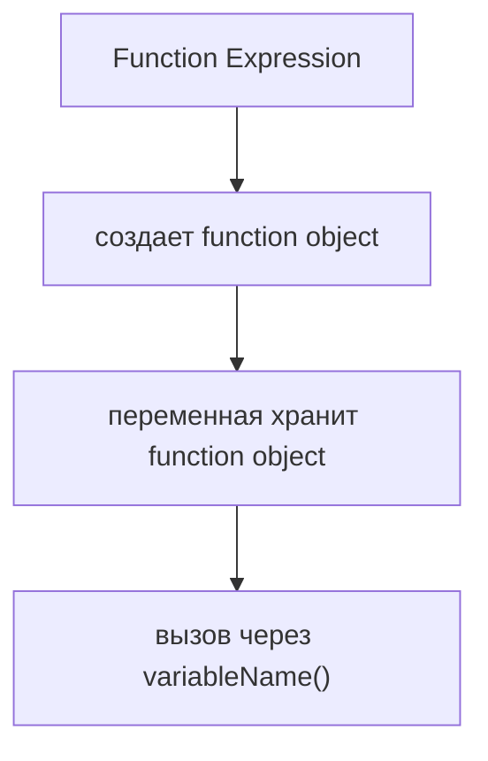

Теперь появляется следующий вопрос:

> Можно ли создать такой же function object более коротким синтаксисом?

Function Expression уже работает:

```javascript
const validateStatus = function () {
  console.log('Status is valid');
};
```

Но в JavaScript есть более компактная форма:

```javascript
const validateStatus = () => {
  console.log('Status is valid');
};
```

Главный вопрос этой главы:

> Какую проблему решает этот синтаксис?

---

## Предварительные требования

Для этой главы нужно понимать:

* что функция - это специальный object value, который можно вызывать;
* что Function Expression создает function object;
* что переменная может хранить function object;
* что вызов `name()` выполняет тело функции;
* что читаемость важнее механического сокращения кода.

Не требуется знать lexical `this`, constructors, prototype differences, `arguments`, callbacks, higher-order functions или async arrows. Эти темы будут изучаться позже.

---

## Время изучения

Ориентировочное время:

```text
Чтение главы:            110-140 минут
Разбор схем:             40-55 минут
Запуск примеров:         20-30 минут
Практика:                90-120 минут
Повторение материала:    25 минут
```

Уровень сложности: **L3**.

Arrow Functions выглядят как короткая запись, но важно увидеть не только форму, а смысл: в этой главе мы рассматриваем их как еще один способ создать function object. Другие особенности Arrow Functions будут разобраны позже.

---

## Навигация

Предыдущая глава:

```text
docs/01-javascript/22-function-expression.md
```

Текущая глава:

```text
docs/01-javascript/23-arrow-functions.md
```

Следующая глава:

```text
docs/01-javascript/24-parameters.md
```

Следующая глава ответит:

> Как передавать данные внутрь функции?

---

## Цели обучения

После изучения этой главы вы будете понимать:

* зачем появились Arrow Functions;
* что Arrow Function создает function object;
* чем Arrow Function похожа на Function Expression;
* как записывать пустой список параметров;
* как записывать один параметр;
* как записывать несколько параметров;
* что такое explicit return;
* что такое implicit return на высоком уровне;
* как вызвать Arrow Function;
* почему компактный синтаксис стал одной из причин появления Arrow Functions;
* когда короткая запись улучшает читаемость;
* когда короткая запись ухудшает читаемость;
* как Arrow Functions используются в Automation QA без callbacks.

---

## Мотивация

Начнем со сравнения.

Function Expression уже решает задачу:

```javascript
const validateStatus = function () {
  console.log('Status is valid');
};
```

Вопрос:

```text
Если Function Expression уже работает,
зачем понадобилась еще одна форма записи?
```

Ответ:

```text
Некоторые функции часто бывают короткими.
Для них длинная форма function () { ... }
может быть шумной.
```

Схема проблемы:

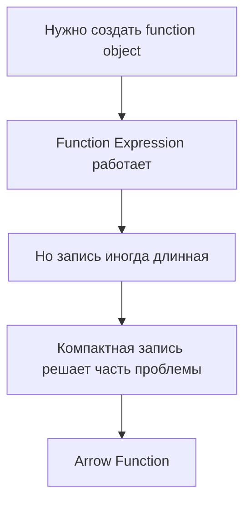

Arrow Function не отменяет Function Declaration и Function Expression.

В этой главе мы смотрим на нее через узкий вопрос:

> Можно ли создать function object короче?

---

## Теория

### Зачем появились Arrow Functions

Компактная запись была одной из причин появления Arrow Functions. В этой главе мы рассматриваем именно эту сторону: arrow-синтаксис как способ создать function object более короткой формой.

Эволюция синтаксиса:

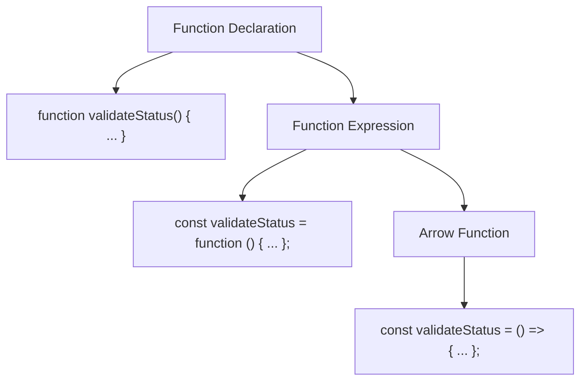

Почему компактная форма полезна:

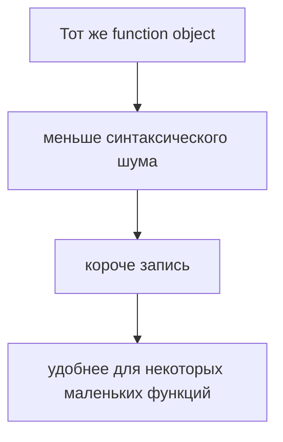

Важно:

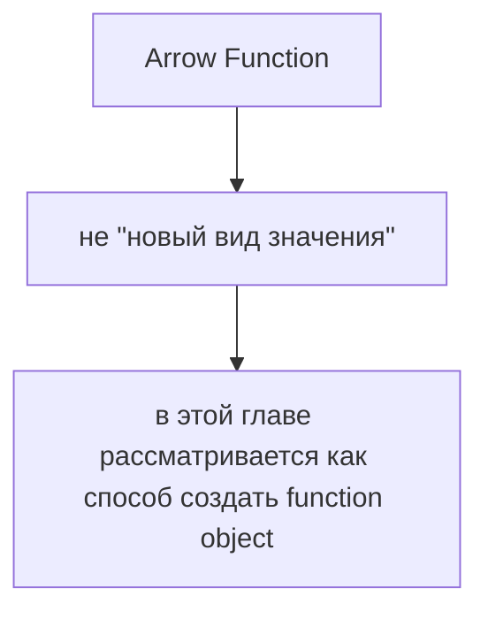

У Arrow Functions есть и другие особенности. Здесь они не раскрываются, потому что требуют отдельных тем: `this`, constructors, `arguments` и более сложные сценарии будут изучаться позже.

### Function Expression vs Arrow Function

Function Expression:

```javascript
const validateStatus = function () {
  console.log('Status is valid');
};
```

Arrow Function:

```javascript
const validateStatus = () => {
  console.log('Status is valid');
};
```

Сравнение:

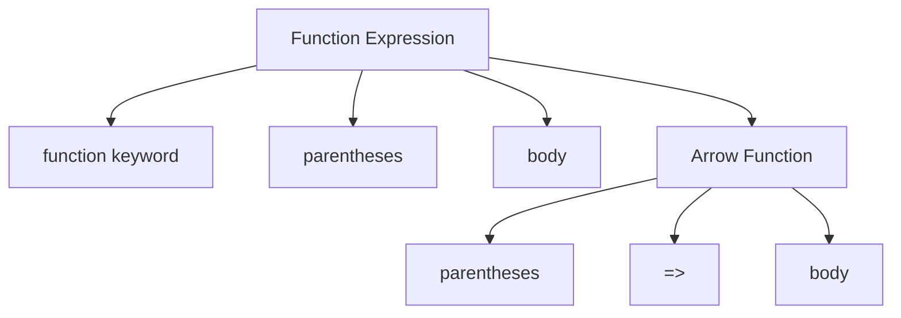

Главная замена:

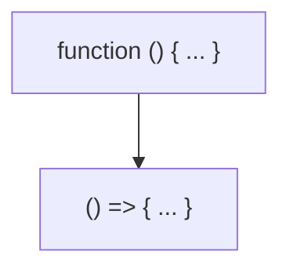

Обе формы создают function object, который можно сохранить в переменной.

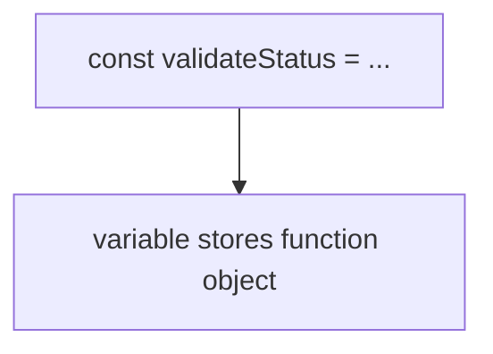

### Syntax simplification

Arrow Function убирает слово `function`.

```text
function () {
  ...
}
```

становится:

```text
() => {
  ...
}
```

Схема упрощения:

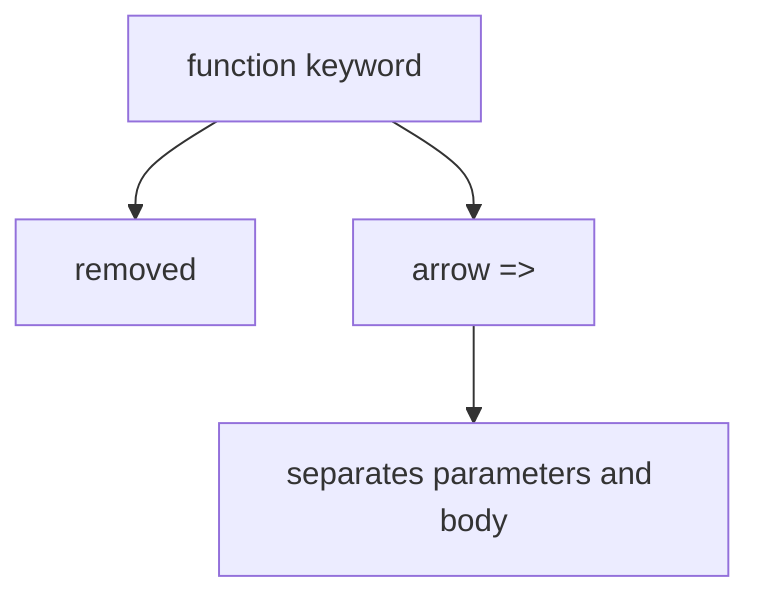

Compact syntax model:

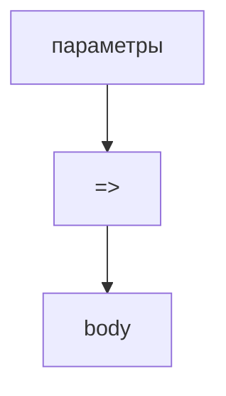

### Создание Arrow Function

Базовая форма:

```javascript
const validateStatus = () => {
  console.log('Status is valid');
};
```

Схема создания:

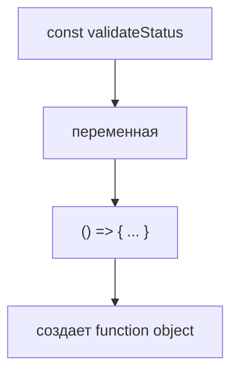

Arrow creation временная шкала:

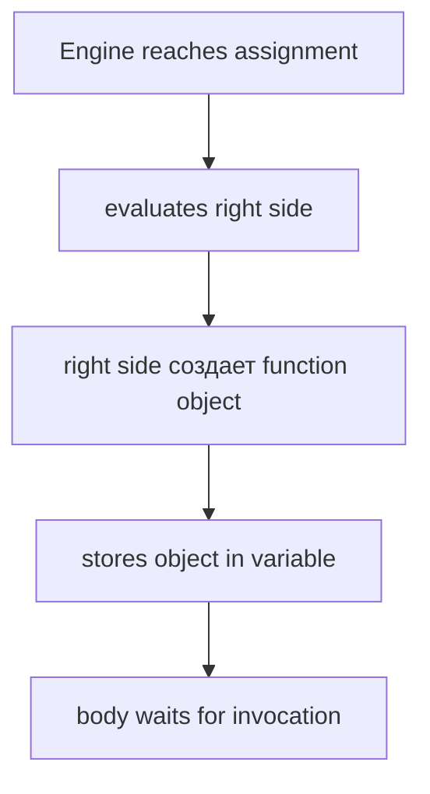

### Вызов Arrow Function

Arrow Function вызывается так же, как function object из Function Expression:

```javascript
validateStatus();
```

Invocation схема:

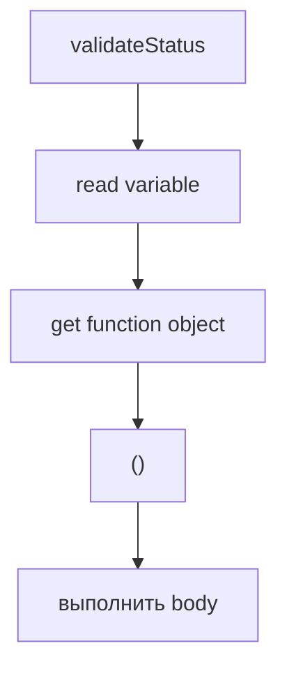

Объявление переменной с Arrow Function не выполняет тело.

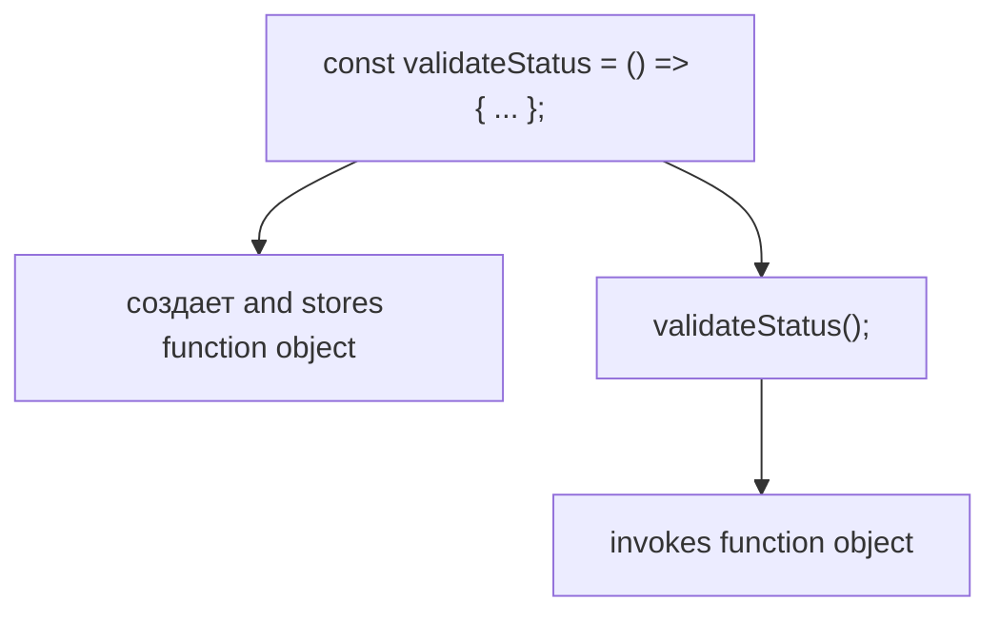

### Empty parameter list

Если функция не получает данные, пишутся пустые скобки:

```javascript
const validateStatus = () => {
  console.log('Status is valid');
};
```

Схема:

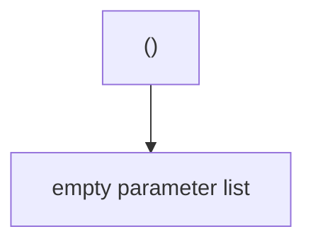

В этой главе параметры объясняются только на уровне формы записи. Следующая глава будет подробно отвечать, как данные попадают внутрь функции.

### One parameter

Если параметр один, скобки можно опустить:

```javascript
const validateStatus = statusCode => {
  console.log(statusCode);
};
```

Схема:

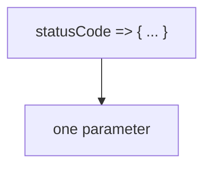

Также можно оставить скобки:

```javascript
const validateStatus = (statusCode) => {
  console.log(statusCode);
};
```

Оба варианта работают.

Важно:

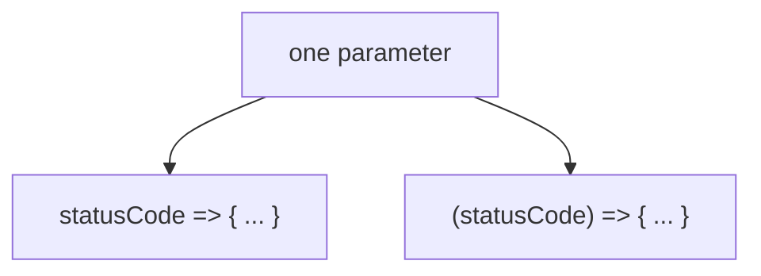

### Multiple parameters

Если параметров несколько, скобки обязательны:

```javascript
const compareStatus = (actualStatus, expectedStatus) => {
  console.log(actualStatus === expectedStatus);
};
```

Схема:

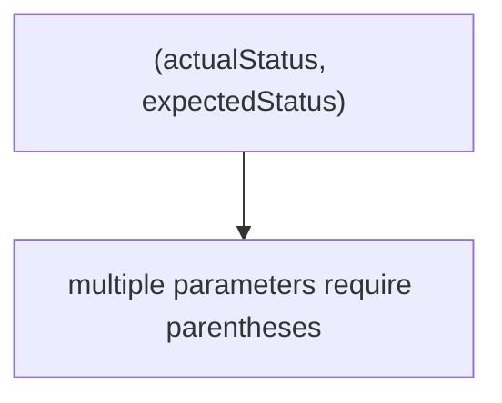

Подробная работа параметров будет изучаться в следующей главе.

### Explicit return

Explicit return означает, что значение возвращается через `return`.

```javascript
const isSuccessfulStatus = () => {
  return true;
};
```

Схема:

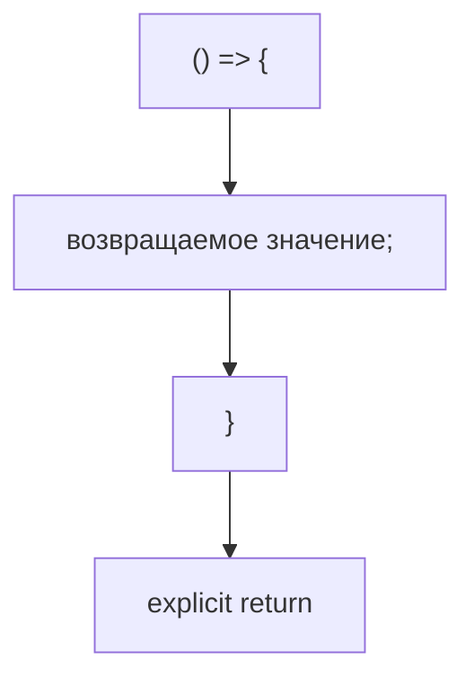

В этой главе `return` рассматривается только на высоком уровне. Отдельная глава о `return` будет позже.

### Implicit return

Implicit return означает, что короткая Arrow Function возвращает результат выражения без слова `return`.

```javascript
const isSuccessfulStatus = () => true;
```

Схема:

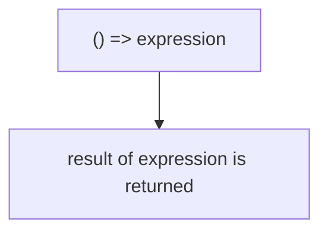

Сравнение:

```mermaid
flowchart TD
    N1["Explicit return"]
    N2["() =&gt; { вернуть true; }"]
    N3["Implicit return"]
    N4["() =&gt; true"]
    N1 --> N2
    N1 --> N3
    N3 --> N4
```

Важно не превращать implicit return в головоломку. Если короткая запись ухудшает читаемость, лучше использовать тело с `{}` и `return`.

### Читаемость

Arrow Function полезна, когда сокращение делает код яснее.

Сравнение читаемости:

```mermaid
flowchart TD
    N1["Хороший случай"]
    N2["короткая функция, понятное имя"]
    N3["Плохой случай"]
    N4["длинное тело, много условий, неочевидный implicit return"]
    N1 --> N2
    N1 --> N3
    N3 --> N4
```

Пример читаемой формы:

```javascript
const isSuccessfulStatus = () => true;
```

Пример, где лучше не сжимать:

```javascript
const validateStatus = () => {
  console.log('Read status');
  console.log('Compare status');
  console.log('Report result');
};
```

Arrow Function не требует всегда использовать самую короткую форму.

---

## Внутренний механизм

На концептуальном уровне Arrow Function проходит тот же путь, что и Function Expression:

```mermaid
flowchart TD
    N1["Arrow syntax"]
    N2["создает function object"]
    N3["function object stored in variable"]
    N4["function object invoked later"]
    N1 --> N2
    N2 --> N3
    N3 --> N4
```

Что делает движок:

```mermaid
flowchart TD
    N1["I see const validateStatus."]
    N2["I evaluate the right side."]
    N3["The right side is an Arrow Function."]
    N4["I создать a function object."]
    N5["I store it in validateStatus."]
    N6["я жду, пока появится validateStatus()."]
    N1 --> N2
    N2 --> N3
    N3 --> N4
    N4 --> N5
    N5 --> N6
```

Function object remains the same conceptual result:

```mermaid
flowchart TD
    N1["Function Expression"]
    N2["создает function object"]
    N3["Arrow Function"]
    N4["создает function object"]
    N1 --> N2
    N1 --> N3
    N3 --> N4
```

Эта глава не объясняет отличия Arrow Functions в поведении `this`, constructors, prototype и `arguments`. Эти темы требуют отдельной внутренней модели и будут изучаться позже.

### Текущее место в модели JavaScript

```mermaid
flowchart TD
    N1["Functions"]
    N2["Function Declaration"]
    N3["named reusable algorithm"]
    N4["Function Expression"]
    N5["function object stored in variable"]
    N6["Arrow Function"]
    N7["shorter syntax for function object"]
    N1 --> N2
    N1 --> N3
    N1 --> N4
    N1 --> N5
    N1 --> N6
    N6 --> N7
```

Модель значения остается такой:

```mermaid
flowchart TD
    N1["JavaScript values"]
    N2["Primitive values"]
    N3["Object values"]
    N4["Ordinary objects"]
    N5["Function objects"]
    N6["can be created with function syntax"]
    N7["can be created with arrow syntax"]
    N1 --> N2
    N1 --> N3
    N3 --> N4
    N3 --> N5
    N5 --> N6
    N5 --> N7
```

Переход к Parameters:

```mermaid
flowchart TD
    N1["Arrow Functions"]
    N2["show different parameter forms"]
    N3["Next question"]
    N4["how does data enter a function?"]
    N5["Parameters"]
    N1 --> N2
    N1 --> N3
    N3 --> N4
    N3 --> N5
```

---

## Ментальная модель

### Shorthand notation

Arrow Function похожа на сокращенную запись.

```mermaid
flowchart TD
    N1["Полная запись"]
    N2["function () { ... }"]
    N3["Сокращенная запись"]
    N4["() =&gt; { ... }"]
    N1 --> N2
    N1 --> N3
    N3 --> N4
```

Сокращение не меняет главную цель: создать function object.

### Compressed recipe

```mermaid
flowchart TD
    N1["Recipe"]
    N2["long form: function () { steps }"]
    N3["compact form: () =&gt; { steps }"]
    N1 --> N2
    N1 --> N3
```

Обе формы описывают инструкцию, которую можно выполнить позже.

### Simplified blueprint

```mermaid
flowchart TD
    N1["Blueprint"]
    N2["inputs"]
    N3["arrow"]
    N4["body"]
    N1 --> N2
    N1 --> N3
    N1 --> N4
```

Arrow Function - это упрощенный чертеж создания function object.

### Compact instruction card

```mermaid
flowchart TD
    N1["Instruction card"]
    N2["() нет input"]
    N3["=&gt; создать arrow function"]
    N4["{ ... } body"]
    N1 --> N2
    N1 --> N3
    N1 --> N4
```

### Abbreviated command

```mermaid
flowchart TD
    N1["validateStatus = () =&gt; { ... }"]
    N2["abbreviated command for creating function object"]
    N1 --> N2
```

Complete Arrow Function overview:

```mermaid
flowchart TD
    N1["Arrow Function"]
    N2["создает function object"]
    N3["can be stored in variable"]
    N4["can be invoked"]
    N5["can use explicit return"]
    N6["can use implicit return"]
    N7["should remain readable"]
    N1 --> N2
    N1 --> N3
    N1 --> N4
    N1 --> N5
    N1 --> N6
    N1 --> N7
```

---

## Примеры кода

Все примеры находятся в:

```text
examples/01-javascript/chapter-23/
```

Запуск:

```bash
node examples/01-javascript/chapter-23/01-arrow-basic.js
node examples/01-javascript/chapter-23/02-parameters.js
node examples/01-javascript/chapter-23/03-return.js
node examples/01-javascript/chapter-23/04-expression-vs-arrow.js
node examples/01-javascript/chapter-23/05-common-mistakes.js
node examples/01-javascript/chapter-23/06-qa-example.js
```

### 01-arrow-basic.js

Показывает базовую Arrow Function без параметров.

### 02-parameters.js

Показывает пустой список параметров, один параметр и несколько параметров на уровне синтаксиса.

### 03-return.js

Показывает explicit return и implicit return.

### 04-expression-vs-arrow.js

Сравнивает Function Expression и Arrow Function.

### 05-common-mistakes.js

Показывает распространенную ошибку: function object создан, но не вызван.

### 06-qa-example.js

Показывает concise validators и helper-функции для QA-сценария.

---

## Частые вопросы

### Arrow Function заменяет Function Declaration?

Нет. Arrow Function - еще один способ создать function object. Она не отменяет Function Declaration и Function Expression.

### Arrow Function всегда лучше?

Нет. Короткий синтаксис полезен только тогда, когда он улучшает читаемость.

### Почему у одной функции есть `return`, а у другой нет?

Если тело записано в `{}`, нужен explicit return. Если после `=>` идет одно выражение без `{}`, используется implicit return.

### Можно ли всегда убирать скобки у параметров?

Нет. Скобки можно опустить только для одного параметра. Для пустого списка и нескольких параметров скобки нужны.

### Это уже callbacks?

Нет. В этой главе Arrow Functions только создаются, сохраняются в переменные и вызываются. Callbacks будут изучаться позже.

### Здесь нужно понимать lexical `this`?

Нет. Lexical `this` - важное отличие Arrow Functions, но оно будет объясняться позже, когда появится достаточная база.

---

## Распространенные мифы

### Миф: Arrow Function - это другой тип значения

Реальность:

Arrow Function создает function object.

### Миф: Arrow Functions всегда короче и лучше

Реальность:

Короткая запись может ухудшить читаемость, если функция сложная.

### Миф: implicit return всегда предпочтительнее

Реальность:

Implicit return хорош для коротких выражений. Для сложной логики лучше explicit return.

### Миф: Arrow Functions нужно использовать везде

Реальность:

Function Declaration, Function Expression и Arrow Function решают разные задачи чтения и организации кода.

Схема типичных ошибок:

```mermaid
flowchart TD
    N1["Ошибка"]
    N2["забыть вызвать функцию"]
    N3["перепутать explicit и implicit return"]
    N4["убрать скобки там, где они нужны"]
    N5["сделать слишком длинную Arrow Function"]
    N6["считать Arrow Function заменой всех функций"]
    N1 --> N2
    N1 --> N3
    N1 --> N4
    N1 --> N5
    N1 --> N6
```

---

## Типичные ошибки

### Ошибка 1. Забыть вызов

Неправильно:

```javascript
const validateStatus = () => {
  console.log('Status is valid');
};

validateStatus;
```

Что произошло:

```text
Переменная прочитана,
но function object не вызван.
```

Исправление:

```javascript
validateStatus();
```

### Ошибка 2. Неправильно использовать implicit return

Неправильно:

```javascript
const isSuccessfulStatus = () => {
  true;
};
```

Здесь нет `return`, поэтому результат не возвращается.

Исправление:

```javascript
const isSuccessfulStatus = () => {
  return true;
};
```

или:

```javascript
const isSuccessfulStatus = () => true;
```

### Ошибка 3. Убрать скобки у нескольких параметров

Неправильно:

```javascript
const compareStatus = actualStatus, expectedStatus => {
  console.log(actualStatus === expectedStatus);
};
```

Исправление:

```javascript
const compareStatus = (actualStatus, expectedStatus) => {
  console.log(actualStatus === expectedStatus);
};
```

### Ошибка 4. Слишком умная короткая запись

Плохо:

```javascript
const validateStatus = statusCode => statusCode === 200 ? 'ok' : 'fail';
```

Для учебного и тестового кода часто читаемее:

```javascript
const validateStatus = (statusCode) => {
  return statusCode === 200;
};
```

### Ошибка 5. Начать объяснять Arrow Function через `this`

`this` действительно связан с Arrow Functions, но это отдельная тема. Сейчас главная модель проще:

```text
Arrow Function creates function object with concise syntax.
```

---

## Практическое использование

Arrow Functions полезны, когда:

```mermaid
flowchart TD
    N1["функция короткая"]
    N2["имя переменной понятное"]
    N3["тело легко прочитать"]
    N4["короткая форма не скрывает смысл"]
    N1 --> N2
    N2 --> N3
    N3 --> N4
```

Практический чек-лист:

```text
1. Какой function object создается?
2. Где он хранится?
3. Где он вызывается?
4. Нужен explicit return или implicit return?
5. Стало ли читателю проще?
```

Правило читаемости:

```mermaid
flowchart TD
    N1["Shorter"]
    N2["не всегда clearer"]
    N3["Clearer"]
    N4["всегда важнее shorter"]
    N1 --> N2
    N1 --> N3
    N3 --> N4
```

---

## Использование в Automation QA

### Helper functions

```javascript
const setupTestData = () => {
  console.log('Create test user');
};
```

Arrow Function создает helper как function object.

### Concise validators

```javascript
const isSuccessfulStatus = () => true;
```

Пример QA-helper:

```mermaid
flowchart TD
    N1["isSuccessfulStatus"]
    N2["arrow function object"]
    N3["concise validator"]
    N1 --> N2
    N2 --> N3
```

### Readable utilities

```javascript
const openUserProfile = () => {
  console.log('Open user profile');
};
```

Хорошее имя переменной остается обязательным. Короткий синтаксис не спасает плохое имя.

### Organizing assertions

```javascript
const assertUserProfileVisible = () => {
  console.log('Assert user profile is visible');
};
```

В реальных тестах assertions должны оставаться явными. Не стоит превращать проверки в слишком короткие и неочевидные выражения.

### Avoiding overly clever syntax

```mermaid
flowchart TD
    N1["Automation QA code"]
    N2["should be clear"]
    N3["should be maintainable"]
    N4["should explain test intention"]
    N1 --> N2
    N1 --> N3
    N1 --> N4
```

Arrow Functions полезны, но тестовый код читают люди. Читаемость важнее демонстрации знания короткого синтаксиса.

---

## Итоги

Arrow Functions продолжают линию:

```mermaid
flowchart TD
    N1["Function Declaration"]
    N2["Function Expression"]
    N3["Arrow Functions"]
    N1 --> N2
    N2 --> N3
```

Главная модель:

```mermaid
flowchart TD
    N1["Arrow Function"]
    N2["создает function object"]
    N3["stores it in variable"]
    N4["invocation выполняется body"]
    N1 --> N2
    N2 --> N3
    N3 --> N4
```

В рамках этой главы Arrow Functions важны как компактная форма создания function object.

Это не означает, что Arrow Function равна Function Expression "только короче". У arrow-синтаксиса есть другие особенности, но они требуют отдельного объяснения и будут изучаться позже.

Они не заменяют все остальные формы функций.

```mermaid
flowchart TD
    N1["Function Declaration"]
    N2["good for named reusable algorithms"]
    N3["Function Expression"]
    N4["shows function object as value"]
    N5["Arrow Function"]
    N6["создает function object with arrow syntax"]
    N1 --> N2
    N1 --> N3
    N3 --> N4
    N3 --> N5
    N5 --> N6
```

Следующая глава ответит:

```text
Как передавать данные внутрь функции?
```

Это тема Parameters.

---

## Что нужно запомнить

* Arrow Function создает function object.
* В этой главе Arrow Function рассматривается как компактная форма создания function object.
* Function Declaration и Function Expression не исчезают.
* Пустой список параметров пишется как `()`.
* Один параметр можно писать без скобок.
* Несколько параметров требуют скобок.
* Explicit return использует `return`.
* Implicit return возвращает результат выражения без `return`.
* Короткая запись не всегда лучше читаемой.
* В Automation QA Arrow Functions полезны для коротких helpers и validators.
* У Arrow Functions есть и другие особенности; lexical `this`, constructors, `arguments`, callbacks и async arrows будут изучаться позже.

---

## Проверьте себя

Ответьте без запуска кода.

1. Зачем появились Arrow Functions?
2. Что создает Arrow Function?
3. Заменяет ли Arrow Function Function Declaration?
4. Как записать Arrow Function без параметров?
5. Когда можно убрать скобки вокруг параметра?
6. Когда скобки обязательны?
7. Чем explicit return отличается от implicit return?
8. Почему короткая запись может ухудшить читаемость?
9. Как Arrow Functions используются в Automation QA?
10. Какая тема идет следующей?

---

## Практика

Практика находится в файле:

```text
practice/01-javascript/23-arrow-functions.md
```

Сначала решайте задания на предсказание вывода без запуска. Главная цель - видеть, что Arrow Function создает function object, а компактная запись не отменяет обычную модель вызова.

---

## Решения

Решения находятся в файле:

```text
solutions/01-javascript/23-arrow-functions.md
```

Читайте решения после самостоятельной попытки. Проверяйте рассуждение: какую проблему решает этот синтаксис?
