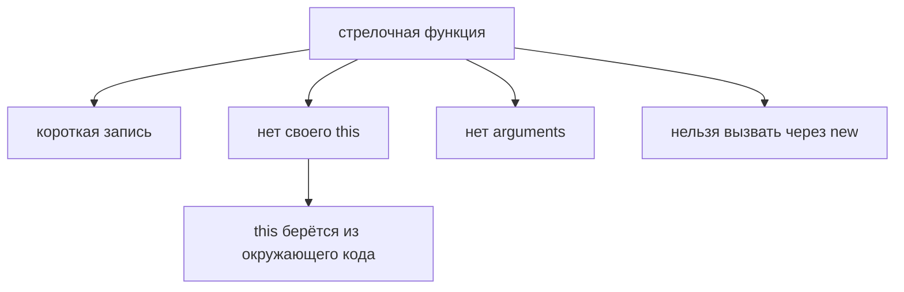

# Стрелочные функции

## Связь с предыдущей главой

Предыдущая глава ввела Function Expression.

Главная модель была такой: функция может быть значением, которое присваивают переменной.

Теперь появляется следующий вопрос:

> Можно ли создать такой же function object более коротким синтаксисом?

Function Expression уже работает:

```javascript
const validateStatus = function () {
  console.log('Status is valid');
};
```

Но в JavaScript есть более компактная форма:

```javascript
const validateStatus = () => {
  console.log('Status is valid');
};
```

Главный вопрос этой главы:

> Какую проблему решает этот синтаксис?

---

## Предварительные требования

Для этой главы нужно понимать:

* что функция - это специальный object value, который можно вызывать;
* что Function Expression создает function object;
* что переменная может хранить function object;
* что вызов `name()` выполняет тело функции;
* что читаемость важнее механического сокращения кода.

Не требуется знать lexical `this`, constructors, prototype differences, `arguments`, callbacks, higher-order functions или async arrows. Эти темы будут изучаться позже.

---

## Время изучения

Ориентировочное время:

```text
Чтение главы:            110-140 минут
Разбор схем:             40-55 минут
Запуск примеров:         20-30 минут
Практика:                90-120 минут
Повторение материала:    25 минут
```

Уровень сложности: **L3**.

Arrow Functions выглядят как короткая запись, но важно увидеть не только форму, а смысл: в этой главе мы рассматриваем их как еще один способ создать function object. Другие особенности Arrow Functions будут разобраны позже.

---

## Навигация

Предыдущая глава:

```text
docs/01-javascript/22-function-expression.md
```

Текущая глава:

```text
docs/01-javascript/23-arrow-functions.md
```

Следующая глава:

```text
docs/01-javascript/24-parameters.md
```

Следующая глава ответит:

> Как передавать данные внутрь функции?

---

## Цели обучения

После изучения этой главы вы будете понимать:

* зачем появились Arrow Functions;
* что Arrow Function создает function object;
* чем Arrow Function похожа на Function Expression;
* как записывать пустой список параметров;
* как записывать один параметр;
* как записывать несколько параметров;
* что такое explicit return;
* что такое implicit return на высоком уровне;
* как вызвать Arrow Function;
* почему компактный синтаксис стал одной из причин появления Arrow Functions;
* когда короткая запись улучшает читаемость;
* когда короткая запись ухудшает читаемость;
* как Arrow Functions используются в Automation QA без callbacks.

---

## Мотивация

Начнем со сравнения.

Function Expression уже решает задачу:

```javascript
const validateStatus = function () {
  console.log('Status is valid');
};
```

Вопрос:

```text
Если Function Expression уже работает,
зачем понадобилась еще одна форма записи?
```

Ответ:

```text
Некоторые функции часто бывают короткими.
Для них длинная форма function () { ... }
может быть шумной.
```

Схема проблемы:

```text
function () { return true; }   длинная форма
() => true                     та же идея короче
```

Arrow Function не отменяет Function Declaration и Function Expression.

В этой главе мы смотрим на нее через узкий вопрос:

> Можно ли создать function object короче?

---

## Теория

### Зачем появились стрелочные функции

Компактная запись была одной из причин их появления. В этой главе мы рассматриваем именно эту сторону: стрелка как способ создать объект функции более короткой формой.

Эволюция синтаксиса шла в сторону сокращения: сначала исчезло слово `function`,
затем — фигурные скобки и `return` для выражения в одну строку.

Почему компактная форма полезна:

```text
function () { ... }   →   () => { ... }   →   () => значение
```

Важно:

У стрелочных функций есть и другие особенности. Здесь они не раскрываются, потому что требуют отдельных тем: `this`, конструкторы, `arguments` и более сложные сценарии будут изучаться позже.

### Выражение-функция и стрелочная функция

Функциональное выражение:

```javascript
const validateStatus = function () {
  console.log('Status is valid');
};
```

Стрелочная функция:

```javascript
const validateStatus = () => {
  console.log('Status is valid');
};
```

Сравнение:

| Запись | Форма |
| --- | --- |
| `function () { ... }` | function expression |
| `() => { ... }` | стрелка с телом |
| `() => значение` | стрелка с неявным возвратом |

Главная замена:

Обе формы создают объект функции, который можно сохранить в переменной.

### Упрощение синтаксиса

Стрелочная функция убирает слово `function`.

```text
function () {
  ...
}
```

становится:

```text
() => {
  ...
}
```

Схема упрощения:

```text
список параметров  =>  тело
```

Модель компактной записи:

```text
function () { ... }   →   () => { ... }
```

Слово `function` исчезло, стрелка отделяет параметры от тела. Всё остальное —
создание объекта функции и связывание его с именем — работает как у обычного
выражения-функции.

### Создание стрелочной функции

Базовая форма:

```javascript
const validateStatus = () => {
  console.log('Status is valid');
};
```

Схема создания:

```text
validateStatus  ──→  [ function object ]
```

Временная шкала создания:

```text
до строки объявления   →  имя недоступно (TDZ), вызов даёт ReferenceError
строка объявления      →  создан объект функции, имя связано с ним
после строки           →  функция вызывается
```

То же самое, что и у выражения-функции: стрелка меняет запись, а не момент
создания.

### Вызов стрелочной функции

Стрелочная функция вызывается так же, как объект функции из выражения-функции:

```javascript
validateStatus();
```

Схема вызова:

```text
вызов arrow-функции ничем не отличается от вызова обычной
```

Объявление переменной со стрелочной функцией не выполняет тело.

### Пустой список параметров

Если функция не получает данные, пишутся пустые скобки:

```javascript
const validateStatus = () => {
  console.log('Status is valid');
};
```

Схема:

```text
() => { ... }        без параметров — скобки обязательны
```

В этой главе параметры объясняются только на уровне формы записи. Следующая глава будет подробно отвечать, как данные попадают внутрь функции.

### Один параметр

Если параметр один, скобки можно опустить:

```javascript
const validateStatus = statusCode => {
  console.log(statusCode);
};
```

Схема:

```text
statusCode => { ... }    один параметр — скобки можно опустить
```

Также можно оставить скобки:

```javascript
const validateStatus = (statusCode) => {
  console.log(statusCode);
};
```

Оба варианта работают.

Важно:

```text
скобки можно опустить только при ровно одном параметре
```

Ноль параметров и два параметра требуют скобок всегда.

### Несколько параметров

Если параметров несколько, скобки обязательны:

```javascript
const compareStatus = (actualStatus, expectedStatus) => {
  console.log(actualStatus === expectedStatus);
};
```

Схема:

```text
(a, b) => { ... }        несколько параметров — скобки обязательны
```

Подробная работа параметров будет изучаться в следующей главе.

### Явный возврат

Явный возврат означает, что значение возвращается через `return`.

```javascript
const isSuccessfulStatus = () => {
  return true;
};
```

Схема:

```text
() => { return true; }   тело с явным return
```

В этой главе `return` рассматривается только на высоком уровне. Отдельная глава о `return` будет позже.

### Неявный возврат

Неявный возврат означает, что короткая стрелочная функция возвращает результат выражения без слова `return`.

```javascript
const isSuccessfulStatus = () => true;
```

Схема:

```text
() => true               значение возвращается без слова return
```

Сравнение: запись с `{}` требует `return`, запись без фигурных скобок возвращает результат выражения автоматически.

Важно не превращать неявный возврат в головоломку. Если короткая запись ухудшает читаемость, лучше использовать тело с фигурными скобками и `return`.

### Читаемость

Стрелочная функция полезна, когда сокращение делает код яснее.

Сравнение читаемости: короткая форма хороша для одного выражения, а для нескольких шагов понятнее тело с `{}` и явным `return`.

Пример читаемой формы:

```javascript
const isSuccessfulStatus = () => true;
```

Пример, где лучше не сжимать:

```javascript
const validateStatus = () => {
  console.log('Read status');
  console.log('Compare status');
  console.log('Report result');
};
```

Стрелочная функция не требует всегда использовать самую короткую форму.

---

Короткая запись — не единственное отличие:


```mermaid
flowchart TD
    A["стрелочная функция"] --> B["короткая запись"]
    A --> C["нет своего this"]
    C --> D["this берётся из окружающего кода"]
    A --> E["нет arguments"]
    A --> F["нельзя вызвать через new"]
```

## Внутренний механизм

На концептуальном уровне стрелочная функция проходит тот же путь, что и
выражение-функция:

```text
1. вычислить выражение справа от =  →  создан объект функции
2. связать имя со этим объектом
3. позже, при вызове — создать контекст выполнения и выполнить тело
```

Результат остаётся тем же — объект функции, на который указывает имя. Отличается
только форма записи, а не механизм.

Эта глава не объясняет отличий стрелочных функций в поведении `this`, конструкторов, прототипа и `arguments`. Эти темы требуют отдельной внутренней модели и будут изучаться позже.

### Текущее место в модели JavaScript

Модель значения остаётся такой: создаётся объект функции, и переменная хранит на него ссылку — независимо от выбранной формы записи.

---

## Ментальная модель

### Краткая запись

Стрелочная функция похожа на сокращённую запись.

Сокращение не меняет главной цели: создать объект функции.

### Сжатый рецепт

Обе формы описывают инструкцию, которую можно выполнить позже.

### Упрощённый чертёж

Стрелочная функция — упрощённый чертёж создания объекта функции.

### Компактная карточка инструкции

Стрелочная функция — та же инструкция, записанная на карточке меньшего
размера: содержание не изменилось, изменилось только количество слов вокруг.

```text
что делает   —  то же самое
как выглядит —  короче
где живёт    —  в переменной, как любое значение
```

### Сокращённая команда

```text
function (value) { return value * 2; }   полная форма
(value) => { return value * 2; }         стрелка с телом
(value) => value * 2                     неявный возврат
value => value * 2                       одна скобка не нужна
```

Все четыре строки описывают одно вычисление. Сокращать стоит ровно до того
места, где запись остаётся понятной читателю, а не до самой короткой формы.

---

## Примеры кода

Все примеры находятся в:

```text
examples/01-javascript/chapter-23/
```

Запуск:

```bash
node examples/01-javascript/chapter-23/01-arrow-basic.js
node examples/01-javascript/chapter-23/02-parameters.js
node examples/01-javascript/chapter-23/03-return.js
node examples/01-javascript/chapter-23/04-expression-vs-arrow.js
node examples/01-javascript/chapter-23/05-common-mistakes.js
node examples/01-javascript/chapter-23/06-qa-example.js
```

### 01-arrow-basic.js

Показывает базовую стрелочную функцию без параметров.

### 02-parameters.js

Показывает пустой список параметров, один параметр и несколько параметров на уровне синтаксиса.

### 03-return.js

Показывает явный и неявный возврат.

### 04-expression-vs-arrow.js

Сравнивает выражение-функцию и стрелочную функцию.

### 05-common-mistakes.js

Показывает распространённую ошибку: объект функции создан, но не вызван.

### 06-qa-example.js

Показывает короткие проверки и вспомогательные функции для сценария автоматизации.

---

## Частые вопросы

### Стрелочная функция заменяет объявление функции?

Нет. Стрелочная функция — ещё один способ создать объект функции. Она не отменяет объявление функции и выражение-функцию.

### Стрелочная функция всегда лучше?

Нет. Короткий синтаксис полезен только тогда, когда он улучшает читаемость.

### Почему у одной функции есть `return`, а у другой нет?

Если тело записано в фигурных скобках, нужен явный `return`. Если после стрелки идёт одно выражение без скобок, возврат неявный.

### Можно ли всегда убирать скобки у параметров?

Нет. Скобки можно опустить только для одного параметра. Для пустого списка и нескольких параметров скобки нужны.

### Это уже обратные вызовы?

Нет. В этой главе стрелочные функции только создаются, сохраняются в переменные и вызываются. Обратные вызовы будут изучаться позже.

### Нужно ли здесь понимать `this` из окружения?

Нет. Это важное отличие стрелочных функций, но оно будет объясняться позже, когда появится достаточная база.

---

## Распространённые мифы

### Миф: стрелочная функция — это другой тип значения

Реальность:

Стрелочная функция создаёт объект функции.

### Миф: стрелочные функции всегда короче и лучше

Реальность:

Короткая запись может ухудшить читаемость, если функция сложная.

### Миф: неявный возврат всегда предпочтительнее

Реальность:

Неявный возврат хорош для коротких выражений. Для сложной логики лучше явный.

### Миф: стрелочные функции нужно использовать везде

Реальность:

Объявление функции, выражение-функция и стрелочная функция решают разные задачи чтения и организации кода.

---

## Распространённые ошибки

### Ошибка 1. Забыть вызов

Неправильно:

```javascript
const validateStatus = () => {
  console.log('Status is valid');
};

validateStatus;
```

Что произошло:

```text
Переменная прочитана,
но function object не вызван.
```

Исправление:

```javascript
validateStatus();
```

### Ошибка 2. Неправильно использовать неявный возврат

Неправильно:

```javascript
const isSuccessfulStatus = () => {
  true;
};
```

Здесь нет `return`, поэтому результат не возвращается.

Исправление:

```javascript
const isSuccessfulStatus = () => {
  return true;
};
```

или:

```javascript
const isSuccessfulStatus = () => true;
```

### Ошибка 3. Убрать скобки у нескольких параметров

Неправильно:

```javascript
const compareStatus = actualStatus, expectedStatus => {
  console.log(actualStatus === expectedStatus);
};
```

Исправление:

```javascript
const compareStatus = (actualStatus, expectedStatus) => {
  console.log(actualStatus === expectedStatus);
};
```

### Ошибка 4. Слишком умная короткая запись

Плохо:

```javascript
const validateStatus = statusCode => statusCode === 200 ? 'ok' : 'fail';
```

Для учебного и тестового кода часто читаемее:

```javascript
const validateStatus = (statusCode) => {
  return statusCode === 200;
};
```

### Ошибка 5. Начать объяснять стрелочную функцию через `this`

`this` действительно связан со стрелочными функциями, но это отдельная тема. Сейчас главная модель проще:

```text
Arrow Function creates function object with concise syntax.
```

---

## Практическое использование

Стрелочные функции полезны, когда функция короткая и передаётся куда-то как
значение: в метод массива, в обработчик, в обёртку для повтора.

Практический чек-лист:

```text
1. Какой объект функции создаётся?
2. Где он хранится?
3. Где он вызывается?
4. Нужен явный return или достаточно неявного?
5. Стало ли читателю проще?
```

Правило читаемости простое: неявный возврат уместен, когда всё выражение
помещается в одну строку и читается как формула. Как только появляется
условие, несколько шагов или длинная цепочка, возврат лучше сделать явным —
иначе экономия символов оплачивается временем чтения.

---

## Использование в Automation QA

### Вспомогательные функции

```javascript
const setupTestData = () => {
  console.log('Create test user');
};
```

Стрелочная функция создаёт вспомогательную функцию как объект функции.

### Краткие проверки

```javascript
const isSuccessfulStatus = () => true;
```

Пример вспомогательной функции: `const isSuccess = (status) => status === 200;` — короткая проверка, которую удобно передавать в методы массивов.

### Читаемые утилиты

```javascript
const openUserProfile = () => {
  console.log('Open user profile');
};
```

Хорошее имя переменной остается обязательным. Короткий синтаксис не спасает плохое имя.

### Организация проверок

```javascript
const assertUserProfileVisible = () => {
  console.log('Assert user profile is visible');
};
```

В реальных тестах проверки должны оставаться явными. Не стоит превращать их в слишком короткие и неочевидные выражения.

### Как не увлечься остроумным синтаксисом

Стрелочные функции полезны, но тестовый код читают люди. Читаемость важнее демонстрации знания короткой записи.

---

## Итоги

Стрелочные функции продолжают линию:

Главная модель: стрелочная функция — это другая форма записи того же объекта функции, а не отдельный вид функции.

В рамках этой главы стрелочные функции важны как компактная форма создания объекта функции.

Это не означает, что стрелочная функция равна выражению-функции «только короче». У стрелки есть другие особенности, но они требуют отдельного объяснения и будут изучаться позже.

Они не заменяют все остальные формы функций.

Следующая глава ответит:

```text
Как передавать данные внутрь функции?
```

Это тема параметров.

---

## Что нужно запомнить

* Стрелочная функция создаёт объект функции.
* В этой главе она рассматривается как компактная форма создания объекта функции.
* Объявление функции и выражение-функция никуда не исчезают.
* Пустой список параметров пишется как `()`.
* Один параметр можно писать без скобок.
* Несколько параметров требуют скобок.
* Явный возврат использует `return`.
* Неявный возврат отдаёт результат выражения без `return`.
* Короткая запись не всегда лучше читаемой.
* В автоматизации тестов стрелочные функции полезны для коротких вспомогательных функций и проверок.
* У стрелочных функций есть и другие особенности; `this` из окружения, конструкторы, `arguments`, обратные вызовы и асинхронные стрелки будут изучаться позже.

---

## Проверьте себя

Ответьте без запуска кода.

1. Зачем появились стрелочные функции?
2. Что создаёт стрелочная функция?
3. Заменяет ли стрелочная функция объявление функции?
4. Как записать стрелочную функцию без параметров?
5. Когда можно убрать скобки вокруг параметра?
6. Когда скобки обязательны?
7. Чем явный возврат отличается от неявного?
8. Почему короткая запись может ухудшить читаемость?
9. Как стрелочные функции используются в автоматизации тестов?
10. Какая тема идет следующей?

### Ответы

1. Ради короткой записи функций-значений, которые передаются другим функциям, и ради предсказуемого `this`, берущегося из окружающего кода.
2. Объект функции — ровно так же, как выражение-функция. Отличается только запись.
3. Нет. Объявление доступно до своей строки и удобно для именованных самостоятельных действий; стрелочная функция создаётся во время выполнения и недоступна до объявления.
4. Пустые скобки перед стрелкой: `() => { ... }`.
5. Когда параметр ровно один: `statusCode => { ... }`.
6. При нуле параметров и при двух и более.
7. Явный возврат записан словом `return` в блоке тела. Неявный возможен, когда тело — одно выражение без фигурных скобок: его значение и становится результатом.
8. Когда в одну строку сжимается выражение, которое читателю приходится разбирать. Короткая запись хороша для простого преобразования, а не для логики с несколькими условиями.
9. В обратных вызовах: фильтрация и преобразование списков, передача шага в ожидание, короткие функции сравнения.
10. `this` — что означает это слово внутри функции и от чего зависит его значение.

---

## Практика

Практика находится в файле:

```text
practice/01-javascript/23-arrow-functions.md
```

Сначала решайте задания на предсказание вывода без запуска. Главная цель — видеть, что стрелочная функция создаёт объект функции, а компактная запись не отменяет обычной модели вызова.

---

## Решения

Решения находятся в файле:

```text
solutions/01-javascript/23-arrow-functions.md
```

Читайте решения после самостоятельной попытки. Проверяйте рассуждение: какую проблему решает этот синтаксис?
