# Parameters

## Связь с предыдущей главой

Предыдущие главы раздела **Functions** показали, как создавать function objects разными способами.

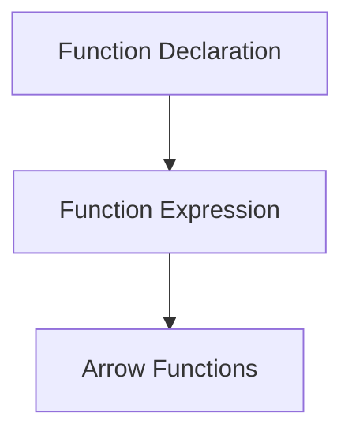

Теперь читатель уже знает:

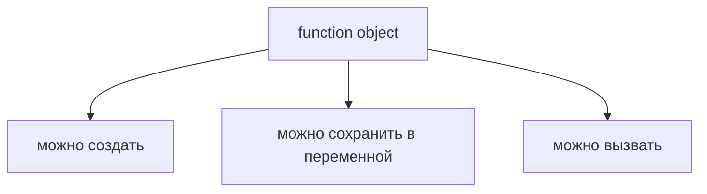

Но остается следующий вопрос:

> Как функция получает данные?

Например, helper проверяет status code.

```javascript
function validateStatus() {
  console.log('Validate status');
}
```

Но какой именно status code он должен проверить?

```text
200?
201?
404?
500?
```

Главный вопрос этой главы:

> Откуда пришло это значение?

---

## Предварительные требования

Для этой главы нужно понимать:

* что функция - это вызываемый function object;
* что тело функции выполняется только после вызова;
* что Function Declaration, Function Expression и Arrow Function создают функции;
* что переменная может хранить значение;
* что имя должно помогать читать код.

Не требуется знать default parameters, rest parameters, destructuring parameters, `arguments` object, spread, TypeScript parameter types, optional parameters или callbacks. Эти темы будут изучаться позже.

---

## Время изучения

Ориентировочное время:

```text
Чтение главы:            110-140 минут
Разбор схем:             40-60 минут
Запуск примеров:         20-30 минут
Практика:                100-130 минут
Повторение материала:    25 минут
```

Уровень сложности: **L3**.

Параметры выглядят как маленькая синтаксическая деталь, но именно они превращают фиксированный helper в переиспользуемый инструмент.

---

## Навигация

Предыдущая глава:

```text
docs/01-javascript/23-arrow-functions.md
```

Текущая глава:

```text
docs/01-javascript/24-parameters.md
```

Следующая глава:

```text
docs/01-javascript/25-return.md
```

Следующая глава ответит:

> Как функция отправляет данные обратно?

---

## Цели обучения

После изучения этой главы вы будете понимать:

* зачем существуют параметры;
* что такое parameter;
* что такое argument;
* чем parameter отличается от argument;
* как вызов функции передает значения;
* как работает функция без параметров;
* как работает один параметр;
* как работают несколько параметров;
* почему сопоставление идет по позиции;
* что происходит при missing arguments на высоком уровне;
* что происходит при extra arguments на высоком уровне;
* почему имена параметров важны;
* как параметры используются в Automation QA.

---

## Мотивация

Начнем с реальной проблемы.

Есть helper:

```javascript
function validateStatus() {
  console.log('Validate status');
}
```

Он называется правильно, но данных ему не хватает.

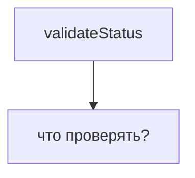

Если зашить значение внутрь:

```javascript
function validateStatus() {
  const statusCode = 200;
  console.log(statusCode);
}
```

helper всегда будет проверять только `200`.

Проблема:

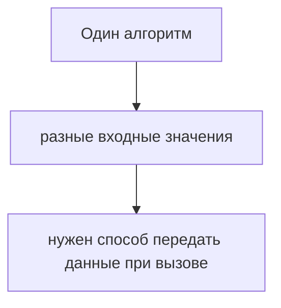

Именно для этого существуют параметры.

Зачем существуют parameters:

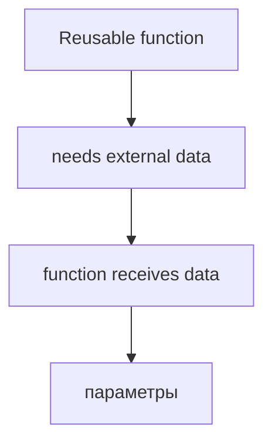

Главный вопрос:

> Откуда пришло это значение?

---

## Теория

### Зачем существуют параметры

Параметры нужны, чтобы функция могла получать данные извне.

Без параметров:

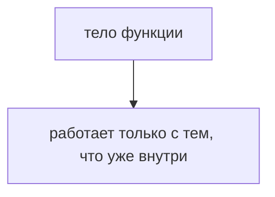

С параметрами:

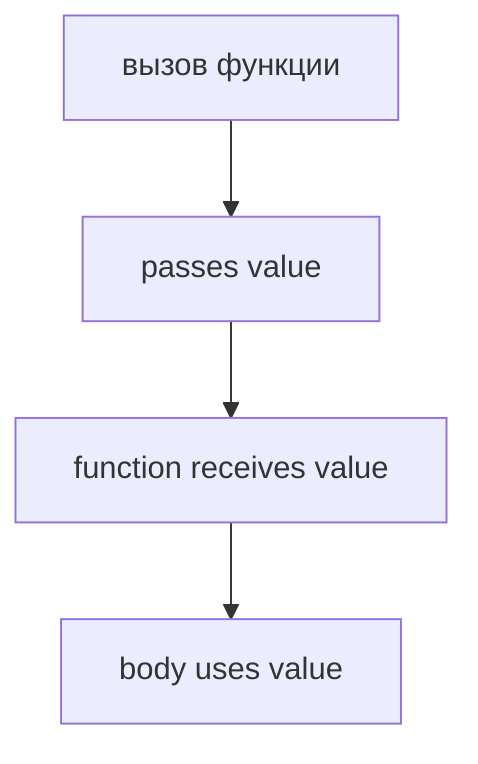

Function receives data:

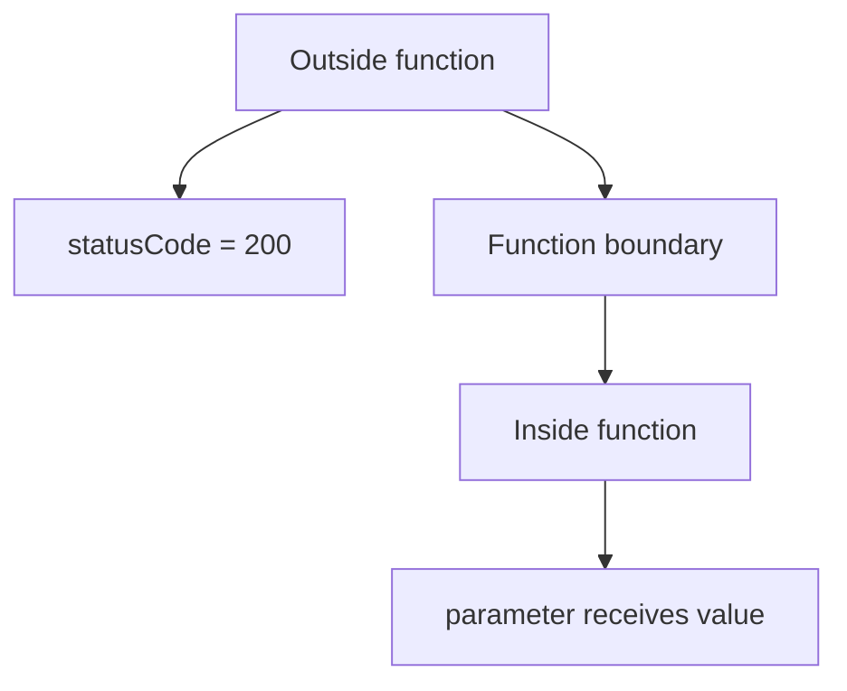

Параметр делает helper гибким:

```text
validateStatus(200)
validateStatus(201)
validateStatus(404)
```

Один алгоритм. Разные входные значения.

### Parameter

Parameter - это имя внутри определения функции, через которое функция получает значение.

```javascript
function validateStatus(statusCode) {
  console.log(statusCode);
}
```

Схема:

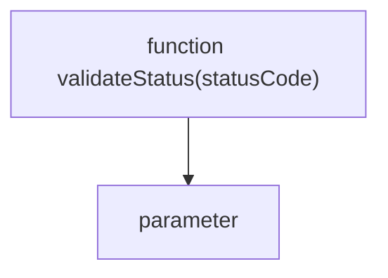

Parameter относится к определению функции:

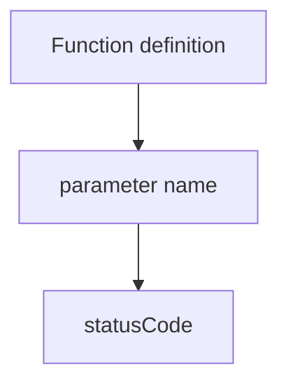

Параметр похож на локальное имя для входного значения.

### Argument

Argument - это значение, которое передается при вызове функции.

```javascript
validateStatus(200);
```

Схема:

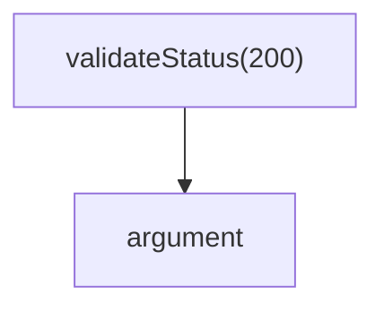

Argument относится к вызову функции:

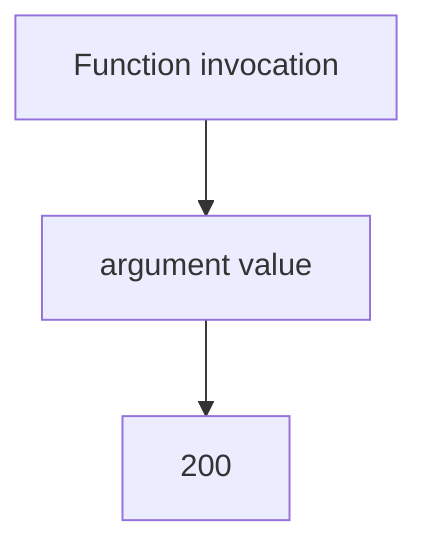

Главное различие:

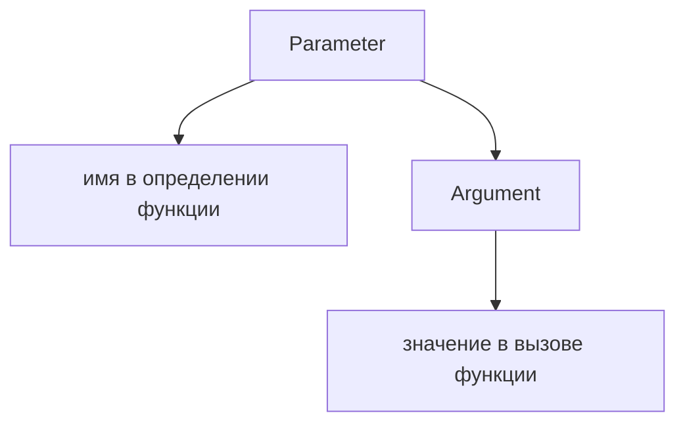

### Argument → Parameter

При вызове JavaScript сопоставляет argument с parameter.

```javascript
function validateStatus(statusCode) {
  console.log(statusCode);
}

validateStatus(200);
```

Схема:

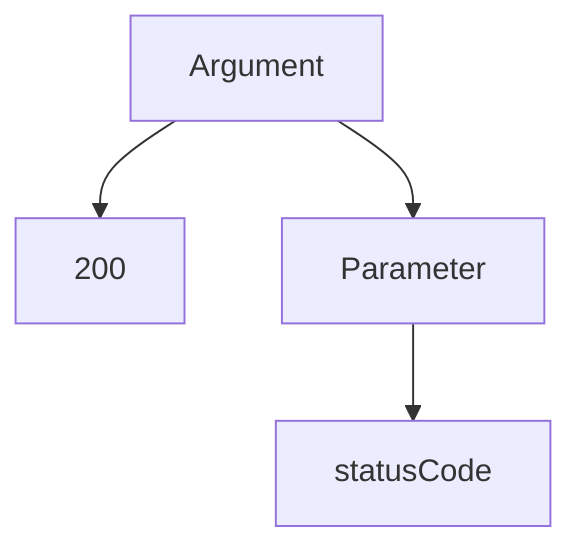

Data поток:

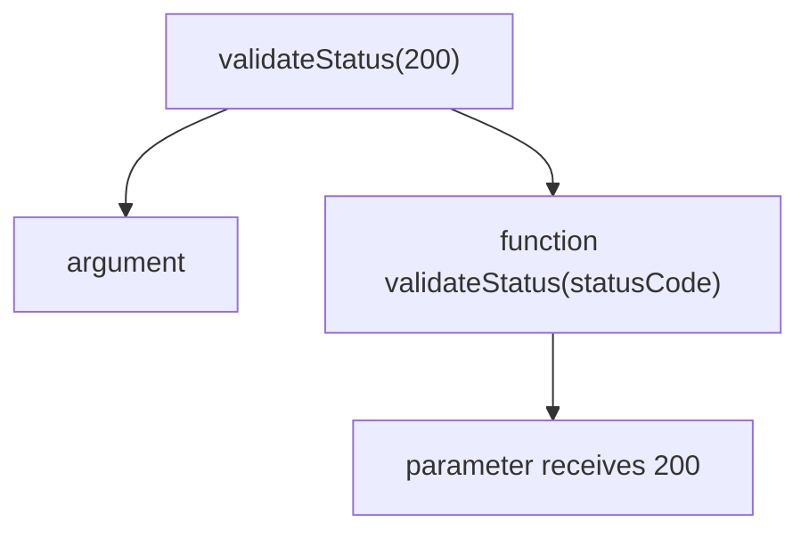

Внутри функции имя `statusCode` становится способом обратиться к переданному значению.

### Invocation with arguments

Вызов с аргументами выглядит так:

```javascript
validateStatus(200);
```

Жизненный цикл вызова:

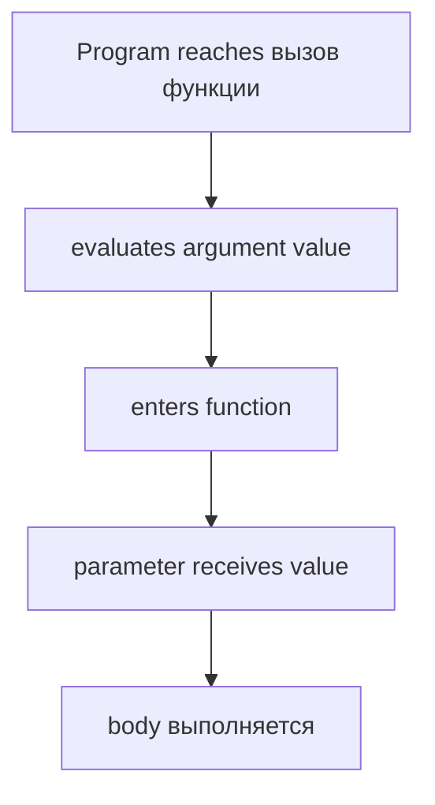

Главный вопрос:

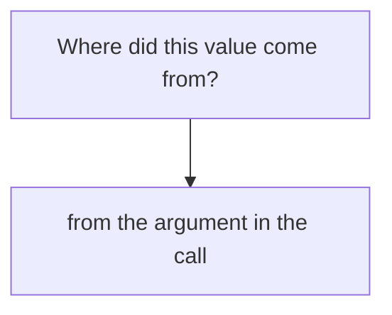

### Zero parameters

Функция может не получать данные.

```javascript
function printTestStart() {
  console.log('Test started');
}

printTestStart();
```

Zero parameters:

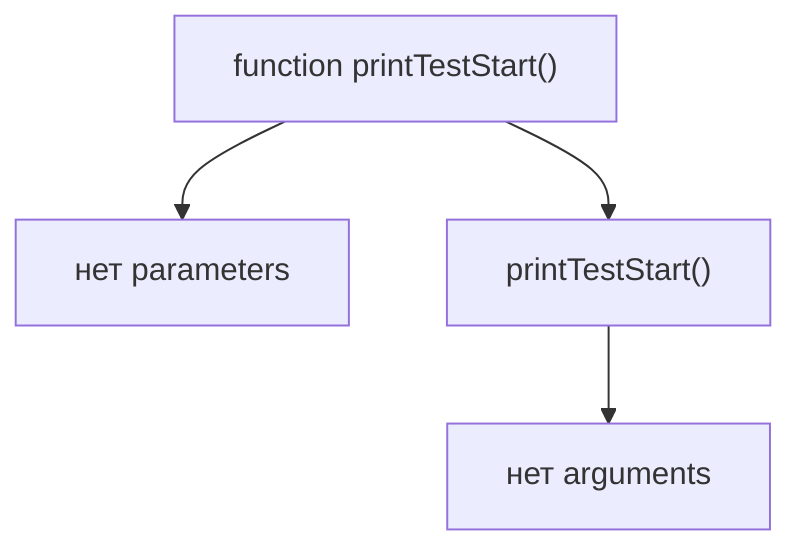

Такая функция выполняет фиксированное действие.

### One parameter

Функция может получать одно значение.

```javascript
function validateStatus(statusCode) {
  console.log(statusCode);
}

validateStatus(200);
```

One parameter:

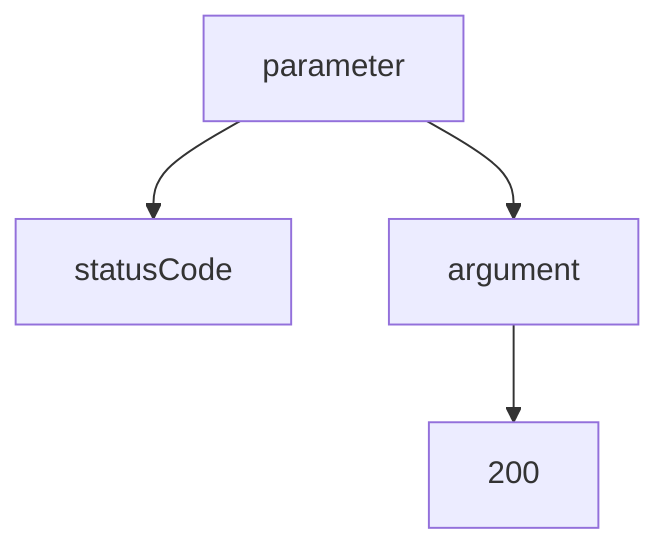

Matching:

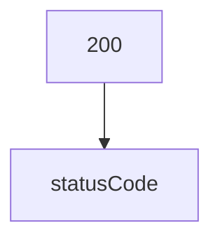

### Multiple parameters

Функция может получать несколько значений.

```javascript
function compareStatus(actualStatus, expectedStatus) {
  console.log(actualStatus === expectedStatus);
}

compareStatus(200, 200);
```

Multiple parameters:

```mermaid
flowchart TD
    N1["function compareStatus(actualStatus, expectedStatus)"]
    N2["parameter 2"]
    N3["parameter 1"]
    N1 --> N2
    N2 --> N3
```

Аргументы:

```mermaid
flowchart TD
    N1["compareStatus(200, 200)"]
    N2["argument 2"]
    N3["argument 1"]
    N1 --> N2
    N2 --> N3
```

### Matching by position

JavaScript сопоставляет arguments и parameters по позиции.

```mermaid
flowchart TD
    N1["compareStatus(200, 201)"]
    N2["goes to expectedStatus"]
    N3["goes to actualStatus"]
    N1 --> N2
    N2 --> N3
```

Схема:

```mermaid
flowchart TD
    N1["Argument 1 → Parameter 1"]
    N2["Argument 2 → Parameter 2"]
    N3["Argument 3 → Parameter 3"]
    N1 --> N2
    N2 --> N3
```

Для примера:

```mermaid
flowchart TD
    N1["200 → actualStatus"]
    N2["201 → expectedStatus"]
    N1 --> N2
```

Имена аргументов не передаются. Передаются значения, и JavaScript кладет их по порядку.

### Missing arguments

Если аргумент не передан, параметр получает `undefined` на высоком уровне.

```javascript
function validateStatus(statusCode) {
  console.log(statusCode);
}

validateStatus();
```

Схема:

```mermaid
flowchart TD
    N1["parameter exists"]
    N2["statusCode"]
    N3["argument значение отсутствует"]
    N4["statusCode receives undefined"]
    N1 --> N2
    N1 --> N3
    N3 --> N4
```

Это не default parameter. Default parameters будут изучаться позже.

### Extra arguments

Если аргументов больше, чем параметров, лишние значения на этом уровне просто не получают имени параметра.

```javascript
function validateStatus(statusCode) {
  console.log(statusCode);
}

validateStatus(200, 201);
```

Схема:

```mermaid
flowchart TD
    N1["200 → statusCode"]
    N2["201 → нет parameter name here"]
    N1 --> N2
```

Extra argument:

```mermaid
flowchart TD
    N1["Argument 1"]
    N2["used"]
    N3["Argument 2"]
    N4["extra at this level"]
    N1 --> N2
    N1 --> N3
    N3 --> N4
```

Объект `arguments`, rest parameters и spread будут изучаться позже.

### Parameter names

Имя параметра должно объяснять, какое значение ожидает функция.

Плохо:

```javascript
function validateStatus(x) {
  console.log(x);
}
```

Лучше:

```javascript
function validateStatus(statusCode) {
  console.log(statusCode);
}
```

Parameter naming:

```mermaid
flowchart TD
    N1["Bad name"]
    N2["x"]
    N3["Good name"]
    N4["statusCode"]
    N1 --> N2
    N1 --> N3
    N3 --> N4
```

Хорошее имя отвечает на вопрос:

```text
Что за значение пришло в функцию?
```

---

## Внутренний механизм

На концептуальном уровне вызов функции создает момент передачи данных.

```mermaid
flowchart TD
    N1["вызов функции"]
    N2["function object"]
    N3["argument values"]
    N4["invocation"]
    N1 --> N2
    N1 --> N3
    N1 --> N4
```

Граница функции:

```mermaid
flowchart TD
    N1["Outside"]
    N2["actual value: 200"]
    N3["Boundary: вызов функции"]
    N4["Inside"]
    N5["parameter name: statusCode"]
    N1 --> N2
    N1 --> N3
    N3 --> N4
    N4 --> N5
```

Что делает движок:

```mermaid
flowchart TD
    N1["I reach validateStatus(200)."]
    N2["I identify the function object."]
    N3["I evaluate the argument 200."]
    N4["I enter the тело функции."]
    N5["I make 200 available as statusCode."]
    N6["I выполнить the body."]
    N1 --> N2
    N2 --> N3
    N3 --> N4
    N4 --> N5
    N5 --> N6
```

Текущее место в модели JavaScript:

```mermaid
flowchart TD
    N1["Functions"]
    N2["Function Declaration"]
    N3["Function Expression"]
    N4["Arrow Functions"]
    N5["Parameters"]
    N6["function receives data"]
    N1 --> N2
    N1 --> N3
    N1 --> N4
    N1 --> N5
    N5 --> N6
```

Complete parameter model:

```mermaid
flowchart TD
    N1["Function definition"]
    N2["параметры"]
    N3["вызов функции"]
    N4["arguments"]
    N5["Arguments become available"]
    N6["through parameters"]
    N1 --> N2
    N1 --> N3
    N3 --> N4
    N3 --> N5
    N5 --> N6
```

Переход к Return:

```mermaid
flowchart TD
    N1["Parameters"]
    N2["data enters function"]
    N3["Next question"]
    N4["how does data leave function?"]
    N5["Return"]
    N1 --> N2
    N1 --> N3
    N3 --> N4
    N3 --> N5
```

---

## Ментальная модель

### Package delivery

Аргумент похож на посылку.

```mermaid
flowchart TD
    N1["Call site"]
    N2["sends package: 200"]
    N3["Function"]
    N4["receives package as statusCode"]
    N1 --> N2
    N1 --> N3
    N3 --> N4
```

### Mailbox

Параметр похож на почтовый ящик с именем.

```mermaid
flowchart TD
    N1["Mailbox name: statusCode"]
    N2["received value: 200"]
    N1 --> N2
```

### Поля формы

Функция похожа на форму.

```mermaid
flowchart TD
    N1["Form field"]
    N2["statusCode"]
    N3["Submitted value"]
    N4["200"]
    N1 --> N2
    N1 --> N3
    N3 --> N4
```

### Machine вход

```mermaid
flowchart TD
    N1["Machine: validateStatus"]
    N2["input slot: statusCode"]
    N3["input value: 200"]
    N1 --> N2
    N1 --> N3
```

### Recipe ingredients

```mermaid
flowchart TD
    N1["Recipe"]
    N2["needs ingredient: statusCode"]
    N3["Invocation"]
    N4["gives ingredient: 200"]
    N1 --> N2
    N1 --> N3
    N3 --> N4
```

Краткая ментальная модель:

```mermaid
flowchart TD
    N1["Parameter"]
    N2["named receiving place"]
    N3["Argument"]
    N4["value sent during call"]
    N5["тело функции"]
    N6["uses parameter name"]
    N1 --> N2
    N1 --> N3
    N3 --> N4
    N3 --> N5
    N5 --> N6
```

---

## Примеры кода

Все примеры находятся в:

```text
examples/01-javascript/chapter-24/
```

Запуск:

```bash
node examples/01-javascript/chapter-24/01-no-parameters.js
node examples/01-javascript/chapter-24/02-one-parameter.js
node examples/01-javascript/chapter-24/03-multiple-parameters.js
node examples/01-javascript/chapter-24/04-missing-extra-arguments.js
node examples/01-javascript/chapter-24/05-common-mistakes.js
node examples/01-javascript/chapter-24/06-qa-example.js
```

### 01-no-parameters.js

Показывает функцию без параметров.

### 02-one-parameter.js

Показывает один parameter и один argument.

### 03-multiple-parameters.js

Показывает сопоставление нескольких arguments с parameters по позиции.

### 04-missing-extra-arguments.js

Показывает missing argument и extra argument на высоком уровне.

### 05-common-mistakes.js

Показывает ошибку порядка аргументов.

### 06-qa-example.js

Показывает QA validator, который получает expected и actual значения.

---

## Частые вопросы

### Parameter и argument - это одно и то же?

Нет. Parameter находится в определении функции. Argument находится в вызове функции.

### Почему важно различать эти слова?

Потому что они отвечают за разные места кода. Parameter говорит, как функция назовет полученное значение. Argument говорит, какое значение реально передано.

### Что будет, если argument не передать?

На этом уровне можно считать, что parameter получит `undefined`. Более сложные способы обработки отсутствующих значений будут изучаться позже.

### Что будет, если передать лишний argument?

Если для него нет parameter, в обычном чтении функции он не получает имени. Rest parameters и `arguments` object будут изучаться позже.

### Можно ли использовать parameters в Arrow Functions?

Да. Параметры есть у Function Declaration, Function Expression и Arrow Functions.

### Можно ли указать тип parameter?

В JavaScript - нет. TypeScript parameter types будут изучаться в части TypeScript.

---

## Распространенные мифы

### Миф: parameter и argument - синонимы

Реальность:

Parameter принадлежит определению функции. Argument принадлежит вызову функции.

### Миф: JavaScript сопоставляет значения по именам

Реальность:

Arguments сопоставляются с parameters по позиции.

### Миф: missing argument всегда ошибка

Реальность:

На уровне JavaScript это допустимо, но parameter получит `undefined`, если нет другого механизма.

### Миф: extra arguments всегда ломают функцию

Реальность:

На этом уровне лишний argument просто не получает имени parameter.

Схема типичных ошибок:

```mermaid
flowchart TD
    N1["Ошибка"]
    N2["путать parameter и argument"]
    N3["передать значения в неправильном порядке"]
    N4["использовать неясные имена параметров"]
    N5["забыть argument"]
    N6["ожидать проверку типов от JavaScript"]
    N1 --> N2
    N1 --> N3
    N1 --> N4
    N1 --> N5
    N1 --> N6
```

---

## Типичные ошибки

### Ошибка 1. Путать parameter и argument

Неправильное объяснение:

```text
В validateStatus(statusCode) значение statusCode - это argument.
```

Правильно:

```text
statusCode в определении функции - parameter.
200 в validateStatus(200) - argument.
```

### Ошибка 2. Неправильный порядок arguments

```javascript
function compareStatus(actualStatus, expectedStatus) {
  console.log(actualStatus === expectedStatus);
}

compareStatus(200, 201);
```

Сопоставление:

```mermaid
flowchart TD
    N1["200 → actualStatus"]
    N2["201 → expectedStatus"]
    N1 --> N2
```

Если перепутать порядок, функция будет сравнивать не то.

### Ошибка 3. Неясные имена parameters

Плохо:

```javascript
function compare(a, b) {
  console.log(a === b);
}
```

Лучше:

```javascript
function compareStatus(actualStatus, expectedStatus) {
  console.log(actualStatus === expectedStatus);
}
```

### Ошибка 4. Missing argument

```javascript
function validateStatus(statusCode) {
  console.log(statusCode);
}

validateStatus();
```

`statusCode` получает `undefined`.

### Ошибка 5. Extra argument

```javascript
function validateStatus(statusCode) {
  console.log(statusCode);
}

validateStatus(200, 201);
```

`200` попадает в `statusCode`. `201` лишний на этом уровне.

---

## Практическое использование

Параметры нужны, когда один helper должен работать с разными данными.

```mermaid
flowchart TD
    N1["Один helper"]
    N2["validateStatus(200)"]
    N3["validateStatus(201)"]
    N4["validateStatus(404)"]
    N1 --> N2
    N1 --> N3
    N1 --> N4
```

Практический чек-лист:

```text
1. Какие данные нужны функции?
2. Как назвать parameter?
3. Где передается argument?
4. Совпадает ли порядок arguments с parameters?
5. Понятна ли сигнатура helper?
```

Readable parameter naming:

```text
statusCode
expectedStatus
actualStatus
userEmail
profileLocator
```

---

## Использование в Automation QA

### Validators receiving expected значения

```javascript
function validateStatus(actualStatus, expectedStatus) {
  console.log(actualStatus === expectedStatus);
}

validateStatus(200, 200);
```

QA-валидатор:

```mermaid
flowchart TD
    N1["actualStatus"]
    N2["value from API response"]
    N3["expectedStatus"]
    N4["value from test expectation"]
    N1 --> N2
    N1 --> N3
    N3 --> N4
```

### API status validation

```javascript
function validateApiStatus(statusCode) {
  console.log(statusCode);
}

validateApiStatus(200);
```

### Reusable helpers

```javascript
function openUserProfile(userId) {
  console.log(userId);
}
```

`userId` делает helper переиспользуемым.

### Passing locators

```javascript
function clickElement(locatorName) {
  console.log(locatorName);
}

clickElement('profile button');
```

Playwright locators будут изучаться позже. Здесь важно увидеть саму идею передачи значения.

### Passing test data

```javascript
function createUser(userEmail) {
  console.log(userEmail);
}

createUser('anna@example.com');
```

### Readable helper signatures

```mermaid
flowchart TD
    N1["Good helper signature"]
    N2["validateStatus(actualStatus, expectedStatus)"]
    N3["Poor helper signature"]
    N4["validate(a, b)"]
    N1 --> N2
    N1 --> N3
    N3 --> N4
```

Сигнатура helper должна объяснять, какие данные нужны функции.

---

## Итоги

Параметры отвечают на вопрос:

```text
Как функция получает данные?
```

Главная модель:

```mermaid
flowchart TD
    N1["Function definition"]
    N2["параметры"]
    N3["вызов функции"]
    N4["arguments"]
    N5["Argument value"]
    N6["Parameter name"]
    N7["тело функции uses value"]
    N1 --> N2
    N1 --> N3
    N3 --> N4
    N3 --> N5
    N5 --> N6
    N6 --> N7
```

Самое важное:

```text
Parameters belong to the function definition.
Arguments belong to the function call.
Arguments become available inside the function through parameters.
```

Следующая глава ответит:

```text
Как функция отправляет данные обратно?
```

Это тема Return.

---

## Что нужно запомнить

* Parameter - имя в определении функции.
* Argument - значение в вызове функции.
* Function receives data through parameters.
* Invocation supplies arguments.
* Arguments сопоставляются с parameters по позиции.
* Missing argument дает parameter значение `undefined` на высоком уровне.
* Extra argument может не получить имени parameter.
* Имена parameters должны объяснять входные данные.
* В Automation QA параметры делают helpers и validators переиспользуемыми.
* Default parameters, rest parameters, destructuring, spread, TypeScript types и callbacks будут позже.

---

## Проверьте себя

Ответьте без запуска кода.

1. Зачем существуют параметры?
2. Что такое parameter?
3. Что такое argument?
4. Где находится parameter: в определении или вызове?
5. Где находится argument: в определении или вызове?
6. Как argument становится доступным внутри функции?
7. Как JavaScript сопоставляет arguments и parameters?
8. Что происходит при missing argument?
9. Что происходит при extra argument?
10. Почему имя parameter важно для Automation QA?

---

## Практика

Практика находится в файле:

```text
practice/01-javascript/24-parameters.md
```

Сначала решайте задания на предсказание вывода без запуска. Главная цель - не смешивать parameter и argument.

---

## Решения

Решения находятся в файле:

```text
solutions/01-javascript/24-parameters.md
```

Читайте решения после самостоятельной попытки. Проверяйте главный вопрос: откуда пришло это значение?
